Lanciata nel 2021, SimpleX è un'applicazione di messaggistica istantanea gratuita con un approccio radicalmente diverso alla privacy. A differenza di WhatsApp, Signal e altri servizi di messaggistica centralizzati, SimpleX si distingue per la gestione degli utenti: non ci sono identificatori, pseudonimi, numeri o chiavi pubbliche visibili. Questa totale assenza di identificatori rende praticamente impossibile correlare gli utenti, garantendo un elevato livello di privacy.

A differenza della maggior parte delle applicazioni che richiedono un account o un numero di telefono, SimpleX consente di avviare conversazioni condividendo un link o un codice QR effimero. Ogni link crea un canale criptato unico e i contatti non possono trovare o ricontattare il mittente senza un Exchange esplicito. I messaggi sono crittografati da un capo all'altro e passano attraverso server di relay che li cancellano dopo l'invio e non vedono né il mittente né il destinatario, né le loro chiavi.

L'architettura della rete è interamente decentralizzata e non federata: i server non si conoscono tra loro, non tengono una directory globale e non ospitano alcun profilo utente. Ancora meglio, ogni utente può implementare e utilizzare il proprio server relay, pur rimanendo interoperabile con quelli della rete pubblica.

SimpleX è interamente open-source (client, protocolli e server), disponibile su Android, iOS, Linux, Windows e macOS. L'archiviazione locale è crittografata e portatile, quindi è possibile trasferire un profilo da un dispositivo all'altro senza affidarsi a un server centralizzato.

SimpleX integra tutte le caratteristiche classiche delle applicazioni di messaggistica. Tuttavia, la sua ergonomia rimane meno fluida rispetto a quella di WhatsApp o Signal. Può anche essere più restrittivo da usare, soprattutto quando si aggiungono i contatti. A mio avviso, quindi, è un'alternativa rilevante a WhatsApp o Signal per gli utenti che mettono la riservatezza al centro delle loro priorità e che sono disposti, per questo motivo, a fare qualche concessione sul comfort dell'utente quotidiano.

| Applicazione         | E2EE 1:1       | E2EE gruppi    | Registrazione anonima | Licenza client open-source | Licenza server open-source | Server decentralizzato   | Anno di creazione |
| -------------------- | -------------- | -------------- | --------------------- | -------------------------- | -------------------------- | ------------------------ | ----------------- |
| WhatsApp             | ✅              | ✅              | ❌                     | ❌                          | ❌                          | ❌                        | 2009              |
| WeChat               | ❌              | ❌              | ❌                     | ❌                          | ❌                          | ❌                        | 2011              |
| Facebook Messenger   | ✅              | 🟡 (opzionale) | ❌                     | ❌                          | ❌                          | ❌                        | 2011              |
| Telegram             | 🟡 (opzionale) | ❌              | 🟡                    | ✅                          | ❌                          | ❌                        | 2013              |
| LINE                 | ✅              | ✅              | ❌                     | ❌                          | ❌                          | ❌                        | 2011              |
| Signal               | ✅              | ✅              | ❌                     | ✅                          | ✅                          | ❌                        | 2014              |
| Threema              | ✅              | ✅              | ✅                     | ✅                          | ❌                          | ❌                        | 2012              |
| Element (Matrix)     | ✅              | ✅              | ✅                     | ✅                          | ✅                          | 🟡 (federato)           | 2016              |
| Delta Chat           | ✅              | ✅              | ✅                     | ✅                          | N/A                        | 🟡 (tramite email)      | 2017              |
| Conversations (XMPP) | ✅              | ✅              | ✅                     | ✅                          | ✅                          | 🟡 (federato)           | 2014              |
| Session              | ✅              | ✅              | ✅                     | ✅                          | ✅                          | ✅                        | 2020              |
| SimpleX              | ✅              | ✅              | ✅                     | ✅                          | ✅                          | ✅                        | 2021              |
| Olvid                | ✅              | ✅              | ✅                     | ✅                          | ❌                          | 🟡(nessuna directory)   | 2019              |
| Keet                 | ✅              | ✅              | ✅                     | ❌                          | N/A                        | ✅                        | 2022              |
| Jami                 | ✅              | ✅              | ✅                     | ✅                          | N/A                        | ✅                        | 2005              |
| Briar                | ✅              | ✅              | ✅                     | ✅                          | N/A                        | ✅                        | 2018              |
| Tox                  | ✅              | ✅              | ✅                     | ✅                          | N/A                        | ✅                        | 2013              |

*E2EE = crittografia end-to-end*

## Installare l'applicazione SimpleX Chat

SimpleX Chat è disponibile su tutte le piattaforme. È possibile scaricare l'applicazione direttamente dall'app store del telefono:

- [Google Play](https://play.google.com/store/apps/details?id=chat.simplex.app);
- [App Store](https://apps.apple.com/us/app/simplex-chat-secure-messenger/id1605771084);
- [F-Droid](https://simplex.chat/fdroid/).

Su Android, è anche possibile [installare via APK](https://github.com/simplex-chat/simplex-chat/releases).

In questa guida ci concentreremo sulla versione mobile, ma ricordiamo che [sono disponibili anche versioni desktop](https://simplex.chat/downloads/) (MacOS, Linux e Windows). È possibile collegare la versione desktop a un profilo utente mobile esistente, ma perché la sincronizzazione funzioni, entrambi i dispositivi devono essere collegati alla stessa rete locale.

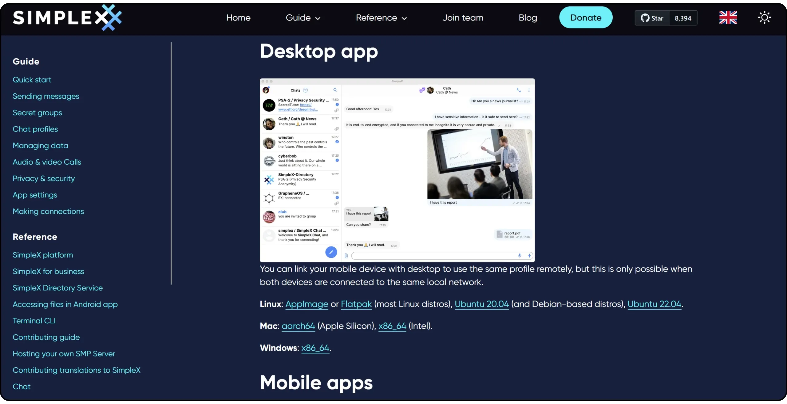

## Creare un account su SimpleX Chat

Al primo avvio dell'applicazione, fare clic sul pulsante "*Crea il tuo profilo*".

Scegliere un nome utente, che può essere il proprio nome reale o uno pseudonimo, quindi cliccare su "*Crea*".

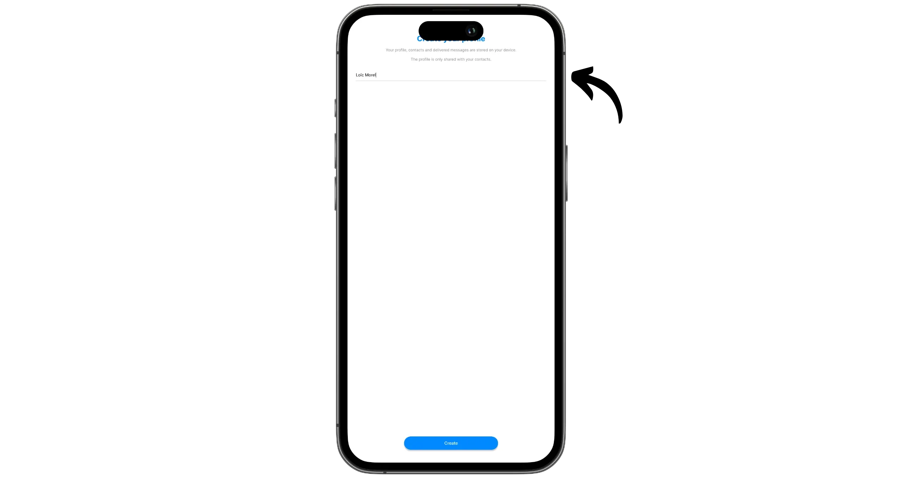

Quindi, impostare la frequenza con cui l'applicazione controlla la presenza di nuovi messaggi. Se la durata della batteria del telefono non è un problema, selezionate "*Istant*" per ricevere i messaggi in tempo reale. Se si preferisce risparmiare la batteria ed evitare che l'applicazione venga eseguita in background, selezionare "*Quando l'applicazione è in esecuzione*": si riceveranno così i messaggi solo quando l'applicazione è aperta. Un possibile compromesso è quello di optare per un controllo periodico ogni 10 minuti.

Una volta effettuata la scelta, cliccate su "*Usa la chat*".

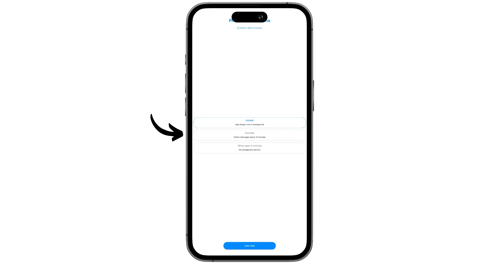

Ora siete connessi a SimpleX Chat e siete pronti per iniziare a chattare.

## Impostazione di SimpleX Chat

Per prima cosa, accedete alle impostazioni facendo clic sulla foto del vostro profilo nell'angolo in basso a destra, quindi su "*Impostazioni*".

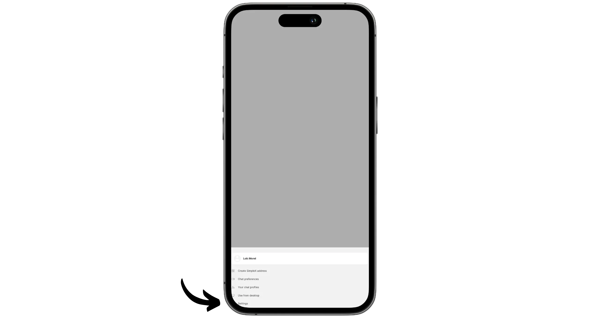

Le impostazioni predefinite sono generalmente adatte alla maggior parte degli utenti. Tuttavia, vi consiglio di andare al menu "*Database passphrase & export*". Qui è possibile esportare il database dell'account SimpleX a scopo di backup.

È inoltre possibile modificare il passphrase utilizzato per crittografare questo database. Per impostazione predefinita, viene generato in modo casuale e memorizzato localmente sul dispositivo. Se preferite, potete definire il vostro passphrase ed eliminare il passphrase di backup locale: dovrete quindi inserirlo manualmente ogni volta che aprite l'applicazione, così come quando migrate su un altro dispositivo.

**Nota bene**: se si sceglie questa opzione, la perdita del passphrase comporterà la perdita permanente di tutti i profili e i messaggi SimpleX.

Vi consiglio anche di andare nel menu "*Privacy & security*", dove potete attivare l'opzione "*SimpleX Lock*". In questo modo si protegge l'accesso all'applicazione con un codice di blocco.

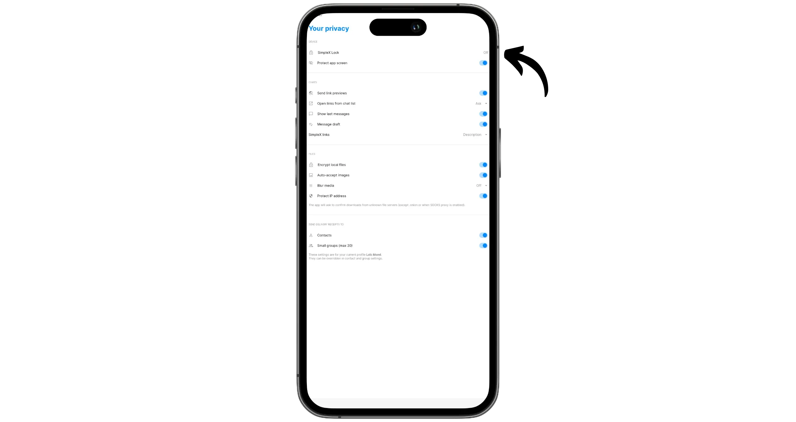

Infine, i menu "*Notifiche*" e "*Apparenza*" consentono di personalizzare SimpleX Chat in base alle proprie preferenze.

## Inviare messaggi con SimpleX Chat

Per connettersi con un'altra persona su SimpleX, avete due opzioni:

- Utilizzare un link monouso;
- Utilizzare un Address statico riutilizzabile.

Un Address statico consente a chiunque lo conosca di contattarvi su SimpleX. È un Address persistente, che può essere utilizzato più volte, da persone diverse, senza limiti di tempo. Questa persistenza lo rende più vulnerabile allo spam. Tuttavia, a differenza di altre applicazioni di messaggistica, l'eliminazione del Address di SimpleX è sufficiente a bloccare tutto lo spam, senza influenzare le conversazioni esistenti. Infatti, il Address viene utilizzato solo per stabilire la connessione iniziale e non è più necessario una volta che il Exchange è iniziato.

I link monouso, invece, possono essere utilizzati una sola volta, da qualsiasi utente. Una volta utilizzato da un contatto, il link non è più valido. Sarà necessario crearne uno nuovo per ogni nuova connessione.

### Con Address statico

Se si desidera utilizzare il Address, fare clic sull'immagine del profilo in basso a sinistra del Interface, quindi selezionare "*Crea SimpleX Address*". Quindi fare nuovamente clic su "*Crea SimpleX Address*".

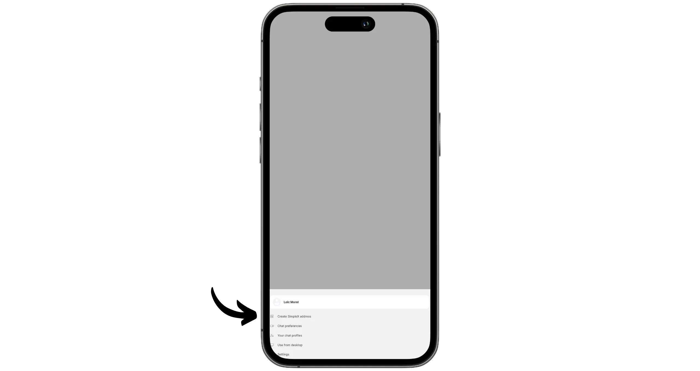

Il vostro Address riutilizzabile è stato creato. Potete condividerlo con le persone che desiderano mettersi in contatto con voi, mostrando loro il codice QR o inviando loro il link.

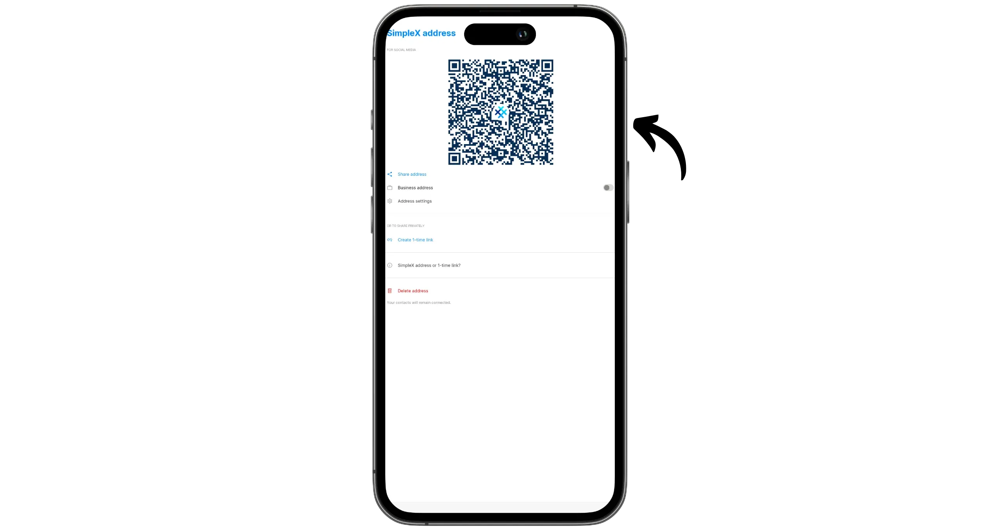

Fare clic sul pulsante "*Impostazioni Address*". Qui è possibile configurare le autorizzazioni associate al Address. L'opzione "*Condividi con i contatti*" rende visibile il Address sul vostro profilo SimpleX. I vostri contatti potranno quindi consultarlo e inoltrarlo ad altre persone che desiderano contattarvi.

L'opzione "*Accettazione automatica*" accetta automaticamente le connessioni in entrata tramite il Address. Ciò significa che chiunque abbia il vostro Address potrà vedere il vostro profilo e inviarvi un messaggio, a meno che non attiviate l'opzione "*Accetta in incognito*". Questa opzione nasconde il vostro nome e la foto del profilo quando viene stabilita una nuova connessione, sostituendoli con uno pseudonimo casuale, distinto per ogni interlocutore.

### Con anello di congiunzione riutilizzabile

Il secondo modo per entrare in contatto con una persona è creare un collegamento unico. Per farlo, cliccate sull'icona della matita nell'angolo in basso a destra di Interface, quindi selezionate "*Crea un collegamento una tantum*".

Se il vostro contatto vi ha inviato un link, fate clic su "*Scansiona/Incolla link*" per scansionarlo o incollarlo.

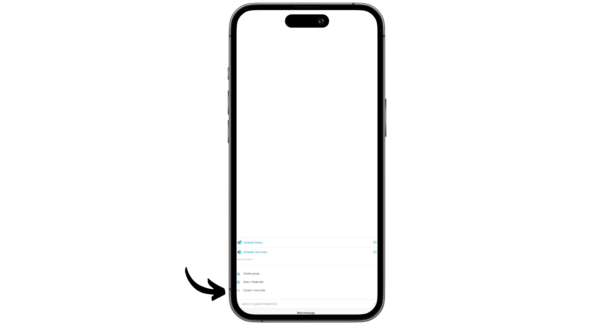

SimpleX genera quindi un link monouso. È possibile inoltrarlo al proprio contatto con qualsiasi mezzo: Exchange fisico, altri messaggi, ecc.

È inoltre possibile scegliere quale profilo associare a questo link di invito. Per farlo, cliccate sul vostro profilo appena sotto il codice QR. Sarà quindi possibile:

- selezionare uno dei profili esistenti (vedremo come creare più profili nella prossima sezione);
- oppure scegliete la modalità "*Incognito*", che nasconde il vostro nome e la foto del profilo con uno pseudonimo generato a caso per il vostro corrispondente.

Qui scelgo la modalità "*Incognito*".

Il mio contatto ha utilizzato il link. Da parte sua, non ha attivato la modalità "*Incognito*", motivo per cui vedo il nome del suo profilo, "*Bob*". D'altra parte, Bob non vede il mio vero nome "*Loïc Morel*", ma uno pseudonimo casuale, in questo caso "*RealSynergy*".

Potrei iniziare a chattare immediatamente, ma prima vorrei verificare che sto parlando con Bob e non con qualche malintenzionato che potrebbe aver intercettato il collegamento o effettuato un attacco MITM.

Per farlo, verificheremo il nostro link di sicurezza **fuori dall'applicazione**. Questo è importante, perché in caso di attacco MITM, la verifica interna sarebbe compromessa. Quindi, utilizzate un altro sistema di messaggistica sicura o, ancora meglio, verificate i codici di persona.

Nella chat, fare clic sulla foto di Bob, quindi su "*Verifica codice di sicurezza*". Bob deve fare lo stesso dalla sua parte.

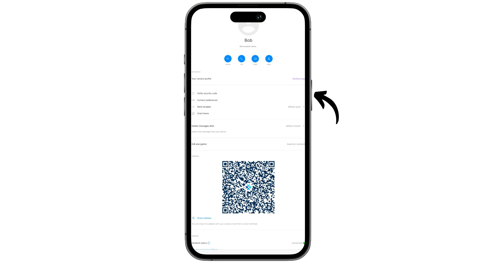

Se lavorate da remoto, confrontate i codici su un altro sistema di messaggistica sicura (devono essere identici). O meglio ancora, se potete incontrarvi di persona, scansionate il codice QR del vostro contatto cliccando su "*Scansiona codice*".

Se la verifica ha esito positivo, accanto al nome del contatto compare un'icona a forma di scudo con un segno di spunta. In questo modo si ha la certezza di scambiare con Bob. Se la verifica non ha esito positivo, apparirà un avviso "*Codice di sicurezza errato!*".

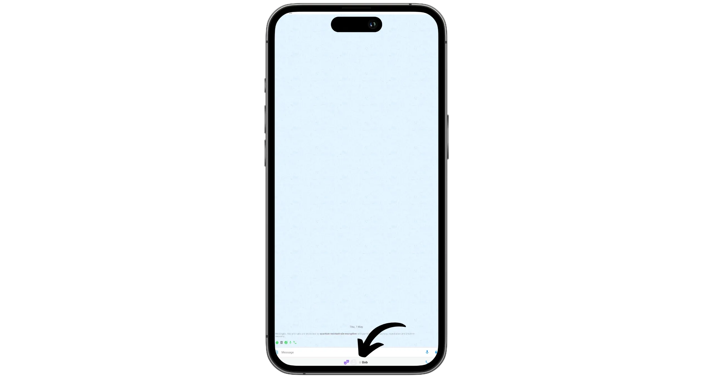

A questo punto, è possibile inviare liberamente a Exchange messaggi, chiamate e file con Bob, a seconda delle autorizzazioni impostate per questa conversazione.

## Personalizzate i vostri profili SimpleX Chat

Una delle caratteristiche più potenti di SimpleX è la possibilità di gestire diversi profili utente completamente separati, tutti accessibili dallo stesso account locale. Ciò consente di separare le diverse identità in modo ordinato, senza complicare la gestione dei messaggi.

Ad esempio, si può creare un file:

- Un profilo con il vostro vero nome e una foto reale per i vostri scambi professionali;
- Un profilo con il vostro vero nome e una foto divertente per gli scambi di famiglia;
- Un profilo con una foto falsa e uno pseudonimo per le conversazioni personali;
- Un altro profilo pseudonimo per chattare con gli sconosciuti.

È quello che faremo qui. Inizio configurando il mio profilo principale, quello legato alla mia identità reale. A tale scopo, faccio clic sulla mia foto del profilo nell'angolo in basso a destra e poi sul mio nome utente.

Poi clicco sulla mia foto profilo per cambiarla e aggiungerne una nuova.

Per aggiungere altri profili, fare clic sul menu "*Profili delle tue chat*".

Qui vengono visualizzati tutti i profili. Cliccate su "*Aggiungi profilo*" per crearne uno nuovo.

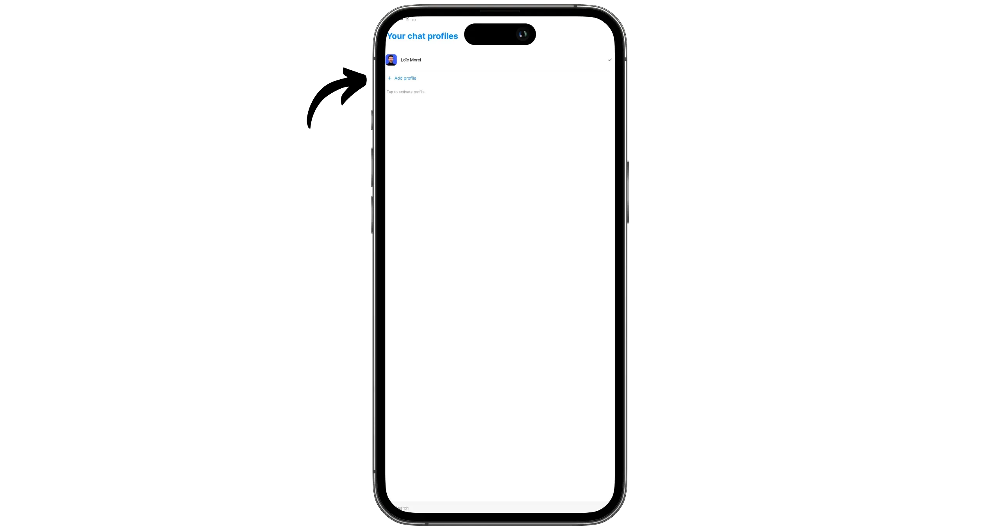

Poi scegliete le informazioni per il vostro nuovo profilo: nome, foto, ecc. Qui utilizzo uno pseudonimo e un'immagine diversa per nascondere la mia vera identità in alcuni scambi.

Tenendo premuto il dito su un profilo, è possibile nasconderlo. Questo lo renderà invisibile nell'applicazione, insieme a tutte le conversazioni associate. È anche possibile scegliere di "*Mutarlo*" per non ricevere più le notifiche.

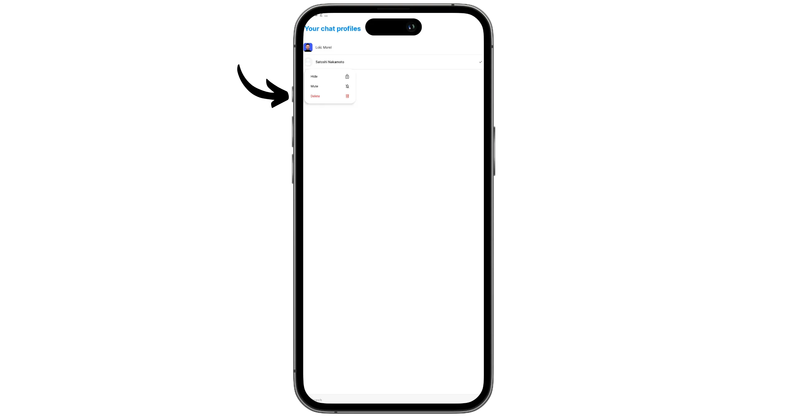

Una volta creati i profili, è possibile gestirli in modo indipendente. Dalla pagina iniziale, è sufficiente selezionare il profilo attivo da visualizzare.

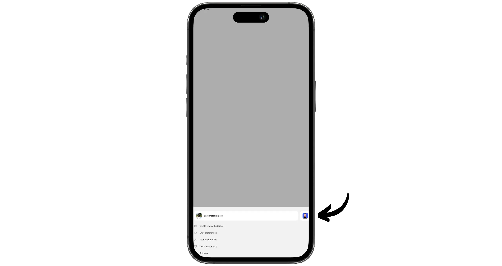

Quando si crea un link di invito o un Address statico, è ora possibile scegliere quale profilo associarvi. Ad esempio, se seleziono il profilo "*Satoshi Nakamoto*" per creare un link e inviarlo ad Alice, questa vedrà solo la mia identità pseudonima "*Satoshi Nakamoto*", senza conoscere la mia vera identità "*Loïc Morel*". Al contrario, se le fornisco un link dal mio profilo reale, non avrà modo di collegarsi al mio profilo pseudonimo.

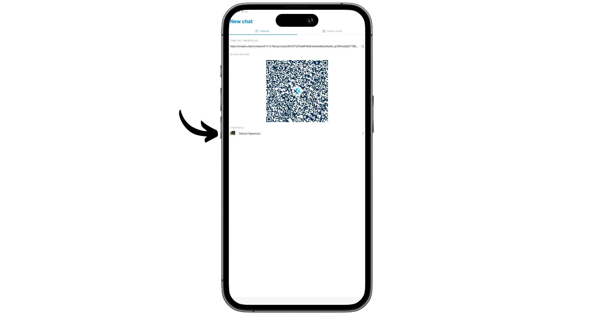

Congratulazioni, ora siete al corrente della messaggistica di SimpleX, un'eccellente alternativa a WathsApp!

Vi consiglio anche quest'altro tutorial, in cui presento Threema, un'altra interessante alternativa per la vostra applicazione di messaggistica:

https://planb.network/tutorials/computer-security/communication/threema-24382d25-df7b-4e96-b332-6968f748df74