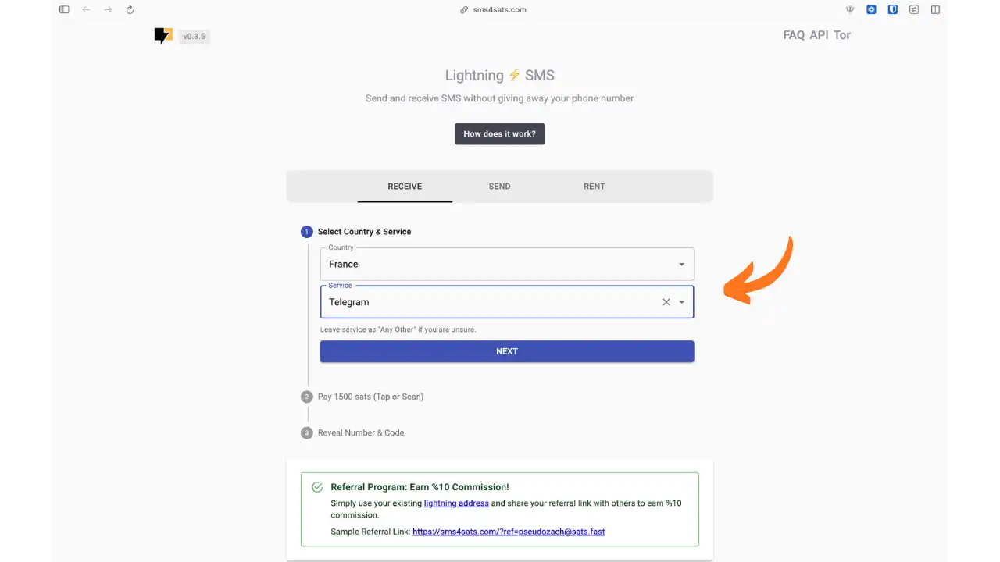
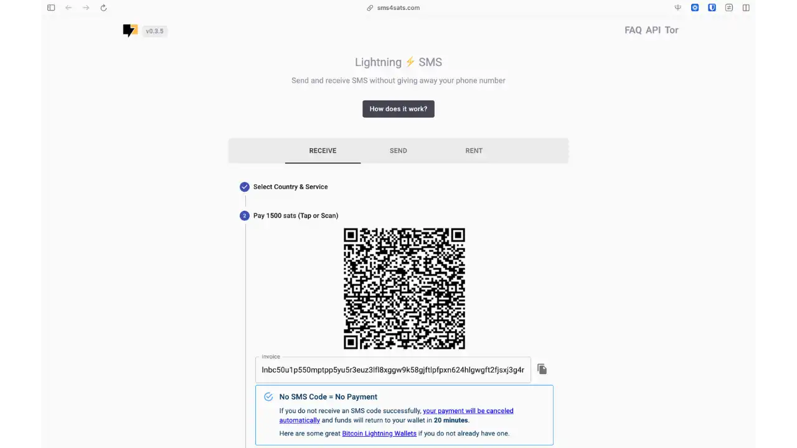
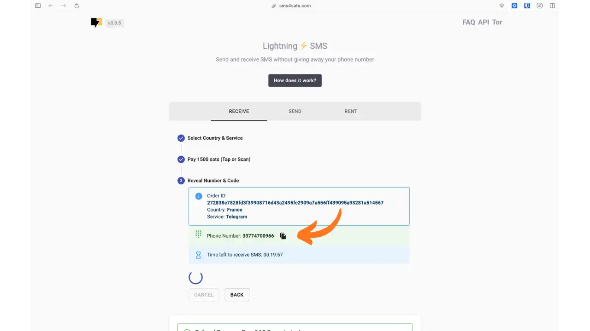
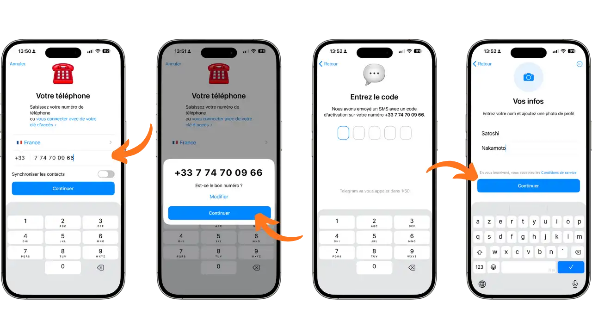
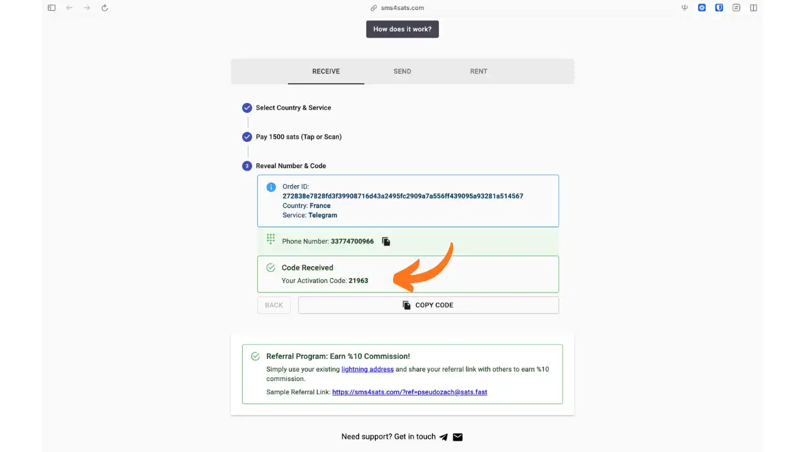
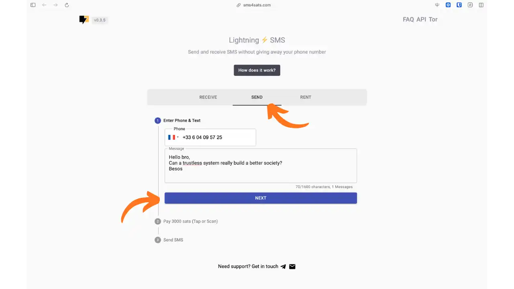
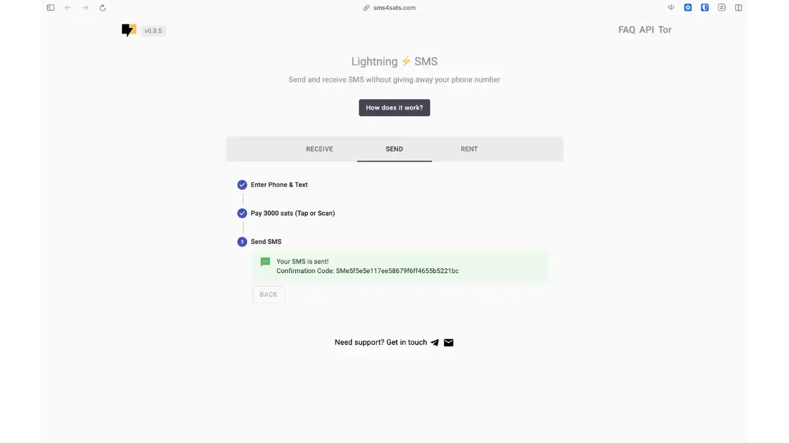
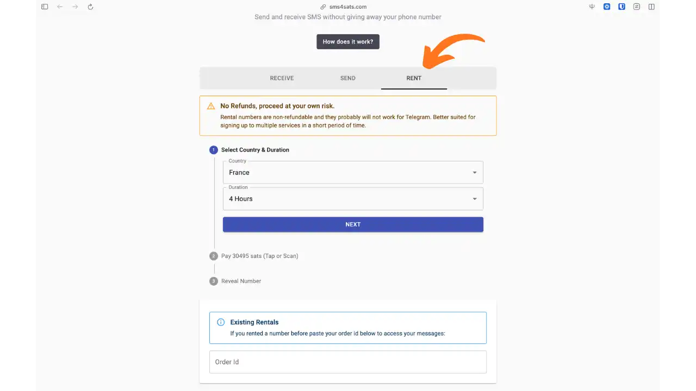

SMS verifikacija je postala neophodna za mnoge onlajn usluge. Bilo da je reč o kreiranju naloga na platformi, validaciji registracije ili potvrdi identiteta, veb-sajtovi gotovo sistematski zahtevaju broj telefona. Ova rasprostranjena praksa predstavlja veliki problem za svakoga ko želi da sačuva svoju privatnost: vaš lični broj postaje stalni identifikator, povezujući vaše različite digitalne aktivnosti sa vašim pravim identitetom i otvarajući vrata neželjenim komercijalnim ponudama.

**SMS4Sats** odgovara na ovaj problem nudeći privremene telefonske brojeve za primanje i slanje SMS poruka. Usluga se ističe modelom bez registracije i ekskluzivnim Bitcoin plaćanjem putem Lightning Network. Za nekoliko satoshija, dobijate jednokratni broj koji vam omogućava da potvrdite registraciju bez ikakvog otkrivanja vašeg ličnog broja.

Ovaj vodič vas vodi kroz tri funkcije SMS4Sats: primanje verifikacionog SMS-a, slanje anonimnog SMS-a i iznajmljivanje privremenog broja na nekoliko sati.

## Šta je SMS4Sats?

SMS4Sats je onlajn usluga dostupna na [sms4sats.com](https://sms4sats.com), koja omogućava anonimno upravljanje SMS-ovima putem plaćanja u Bitcoin Lightning. Usluga nudi tri različite funkcionalnosti: prijem jednokratnih verifikacionih kodova, slanje SMS-ova na bilo koji broj i iznajmljivanje privremenih brojeva na nekoliko sati.

### Filozofija i operativni model

Projekat je dizajniran da obezbedi maksimalnu poverljivost i finansijski suverenitet. Zahtevajući da se ne kreira nalog i prihvatajući samo Bitcoin Lightning uplate, SMS4Sats potpuno eliminiše potrebu za pružanjem ličnih podataka. Nije potrebna email adresa, kreditna kartica, niti lične informacije. Samo je Lightning uplata potrebna za pristup uslugama.

Usluga podržava preko 400 sajtova i aplikacija u oko 120 zemalja, pokrivajući većinu uobičajenih potreba za verifikacijom. Ovo opsežno geografsko pokrivanje omogućava validaciju registracija na različitim platformama, od društvenih mreža do usluga za razmenu poruka.

### Uslovni model plaćanja

SMS4Sats koristi uslovne Lightning fakture (hodl fakture) za svoju funkcionalnost prijema SMS-ova. Ovaj mehanizam osigurava da vam se naplati samo ako je SMS zaista primljen. Ako poruka ne stigne u predviđenom vremenu (maksimalno 20 minuta), uplata se automatski otkazuje i satoshi se vraćaju na vaš wallet. Ova garancija se ne odnosi na funkcije slanja i iznajmljivanja, koje su nepovratne.

## Tri funkcije SMS4Sats

Interfejs SMS4Sats organizovan je oko tri kartice koje odgovaraju trima različitim upotrebama: **RECEIVE** za primanje verifikacionih kodova, **SEND** za slanje anonimnih SMS-ova i **RENT** za iznajmljivanje privremenog broja.

### Primite SMS

Glavna funkcija vam omogućava da dobijete privremeni broj za primanje jedinstvenog verifikacionog koda. Kada je kod primljen i iskorišćen, broj se trajno deaktivira.

### Pošalji SMS

Ova funkcija vam omogućava da pošaljete SMS na bilo koji telefonski broj bez otkrivanja vašeg identiteta. Primalac će primiti poruku sa anonimnog broja.

### Iznajmi čin

Za korisnike kojima je potrebno da prime više SMS poruka na jednom broju, SMS4Sats nudi opciju privremenog iznajmljivanja. Ova opcija omogućava primanje i slanje više poruka tokom perioda iznajmljivanja.

**Napomena o cenama** : Cene prikazane u ovom vodiču su indikativne. One variraju u zavisnosti od zemlje broja, ciljne usluge i trenutne potražnje. Na primer, SMS ka Telegram Francuska može koštati između 1,500 i 5,000 satoshija, u zavisnosti od uslova. Uvek proverite tačan iznos Lightning fakture pre plaćanja.

## Primite SMS za verifikaciju

Hajde da detaljno pogledamo kako koristiti SMS4Sats za primanje verifikacionog koda, ilustrovano kreiranjem Telegram naloga.

### Korak 1: Izaberite državu i uslugu

Idite na [sms4sats.com](https://sms4sats.com) i ostanite na kartici **RECEIVE**. Izaberite državu željenog broja iz padajućeg menija. Ako je ciljna usluga vaše pretplate navedena, izaberite je kako biste optimizovali šanse za prijem.

U ovom primeru, biramo Francusku kao zemlju i Telegram kao ciljnu uslugu. Kliknite **NEXT** da biste prešli na sledeći korak.

### Korak 2: Platite Lightning fakturu

Faktura za Lightning prikazana je u obliku QR koda. Iznos varira u zavisnosti od zemlje i odabrane usluge. Skenirajte QR kod sa vašim Lightning wallet ili kopirajte fakturu da biste platili ručno.

Imajte na umu važnu poruku: "Nema SMS koda = Nema plaćanja". Ako ne primite SMS, vaša uplata će biti automatski otkazana i refundirana u roku od najviše 20 minuta.

### Korak 3: Dobijte privremeni broj

Jednom kada je uplata potvrđena, privremeni broj telefona se odmah prikazuje. Brojač pokazuje preostalo vreme za primanje SMS-a.

Kopirajte ovaj broj (ovde +33 7 74 70 09 66) da biste ga koristili na usluzi za koju se želite registrovati.

### Korak 4: Koristite broj na ciljnoj usluzi

Unesite privremeni broj na aplikaciju ili veb-sajt gde kreirate svoj nalog. U našem primeru Telegram, unesite broj, potvrdite ga i sačekajte verifikacioni kod.

Proces je identičan konvencionalnoj registraciji: unesete broj, Telegram šalje verifikacioni kod putem SMS-a, a zatim završavate kreiranje naloga.

### Korak 5: Preuzmite verifikacioni kod

Vratite se na SMS4Sats interfejs. Čim se SMS primi, aktivacioni kod se automatski prikazuje. Kliknite na **COPY CODE** da biste ga lako kopirali.

Unesite ovaj kod na ciljnu uslugu da biste završili registraciju. Privremeni broj će tada biti trajno deaktiviran.

## Pošalji anonimni SMS

SMS4Sats takođe vam omogućava slanje SMS poruka na bilo koji broj bez otkrivanja vašeg identiteta.

### Korak 1: Pisanje poruke

Kliknite na karticu **POŠALJI**. Unesite odredišni broj telefona sa međunarodnim pozivnim brojem i napišite svoju poruku (maksimalno 1600 karaktera).

Kliknite **NEXT** da biste prešli na plaćanje.

### Korak 2: Plati i pošalji

Platite prikazanu Lightning fakturu. Kada uplata bude potvrđena, SMS se odmah šalje primaocu.

Prikazuje se potvrdni kod kako bi se potvrdilo da je poruka poslata. Primalac će primiti SMS sa anonimnog broja.

## Iznajmi privremeni broj

Za upotrebe koje zahtevaju nekoliko SMS poruka na istom broju, funkcija RENT vam omogućava da iznajmite broj na nekoliko sati.

### Konfiguracija iznajmljivanja

Kliknite na karticu **RENT**. Izaberite državu i trajanje.

**Važne tačke za napomenu:**

- Cene variraju u zavisnosti od zemlje i dužine boravka
- Iznajmljivanja su nepovratna**, za razliku od jednokratnih SMS poruka
- Iznajmljeni brojevi generalno ne rade sa Telegram
- Ova opcija je pogodna za pretplatu na nekoliko usluga uzastopno

Kada kliknete na **NEXT** i platite Lightning fakturu, dobićete broj koji možete koristiti tokom trajanja perioda iznajmljivanja za primanje i slanje SMS poruka.

## Prednosti i ograničenja

### Istaknuto

**Nije potreban lični podaci**: Model bez registracije garantuje da se lične informacije ne prikupljaju.

**Tri dodatne funkcije**: Primanje, slanje i iznajmljivanje pokrivaju većinu potreba.

**Plaćanje samo u Bitcoin** : Lightning Network omogućava trenutne i pseudonimne transakcije.

**Automatska nadoknada**: Kada primate SMS poruke, hodl sistem faktura garantuje da plaćate samo ako SMS stigne.

### Ograničenja koja treba razmotriti

**Relativna sigurnost SMS kanala**: SMS kodovi nisu pouzdana metoda autentifikacije i ne bi trebalo da se koriste za osetljive naloge.

**Kompatibilnost varijabli**: Mnogi sajtovi detektuju i blokiraju virtuelne brojeve. Možda će biti potrebno nekoliko pokušaja.

**Brojevi za jednokratnu upotrebu**: Nakon jedne upotrebe, broj se reciklira i ne može se povratiti.

**Iznajmljivanja bez povraćaja novca**: Za razliku od jednokratnih SMS poruka, iznajmljivanja ne dolaze sa garancijom povraćaja novca.

## Najbolje prakse

### Koristi Tor za veću privatnost

SMS4Sats je dostupan putem [Tor](sms4sat6y7lkq4vscloomatwyj33cfeddukkvujo2hkdqtmyi465spid.onion). Ova konfiguracija prikriva vašu IP adresu prilikom pristupa usluzi.

### Izbegavajte kritične naloge

Nikada ne koristite jednokratni broj za svoje važne naloge (banka, glavni email). Ako ove platforme zahtevaju da ponovo potvrdite svoj broj kasnije, izgubićete pristup nalogu.

### Odvojite svoje digitalne identitete

Za pseudonimne naloge, kombinujte privremeni broj sa jednokratnom email adresom i pregledačem izolovanim od vaše uobičajene upotrebe.

### Izaberite čvrst 2FA

Kada vaš nalog bude kreiran, aktivirajte jača rešenja za autentifikaciju: TOTP aplikacija (Aegis, Ente Auth) ili FIDO2 fizički sigurnosni ključ.

## Zaključak

SMS4Sats je kompletno rešenje za poverljivo upravljanje SMS porukama. Bilo da želite da primite verifikacioni kod, pošaljete anonimnu poruku ili iznajmite privremeni broj, usluga zadovoljava širok spektar potreba za poverljivošću, zahvaljujući plaćanju u Bitcoin Lightning.

Imajte na umu njegova ograničenja, međutim: usluga ne garantuje apsolutnu anonimnost i nije pogodna za osetljive ili dugoročne naloge. Ako se koristi mudro i sa svešću o njegovim ograničenjima, SMS4Sats je praktičan alat za ponovno preuzimanje kontrole nad vašim telefonskim komunikacijama.

## Resursi

- [SMS4Sats zvanična veb stranica](https://sms4sats.com)
- [Česta pitanja o usluzi](https://sms4sats.com/faq)
- [Tor adresa](http://sms4sat6y7lkq4vscloomatwyj33cfeddukkvujo2hkdqtmyi465spid.onion)