## Varför Telegram

Telegram är mycket mer än en meddelandeapp och går utöver begreppet sociala medier. Jämfört med många av sina konkurrenter har den många funktioner som gör det till ett verktyg som är värt att veta hur man använder.

Förutom att utbyta meddelanden kan du med Telegram ringa video- och röstsamtal, redigera eller radera meddelanden även efter att de har skickats, Exchange stora filer utan utrymmesbegränsningar och mycket mer. Vi hoppas att denna handledning kan hjälpa till att göra det enkelt att lära sig och framför allt gå med i de många Bitcoiner-samhällen som finns på Telegram.

## Telegram mobil

Även om Telegram finns tillgängligt från officiella butiker är rådet alltid detsamma: ladda ner från utvecklarens webbplats, en bra vana för dem som, precis som du, är på en integritetsmedveten resa.

Med telefonens webbläsare går du till webbplatsen [telegram.org] (https://telegram.org). Du kan välja önskat språk, men jag rekommenderar att du fortsätter på engelska, så välj _Telegram för Android_

På nästa sida hittar du några användbara tips för nedladdning av filen `.apk`; om du inte behöver dem, klicka direkt på _Download Telegram_.

Ditt Android-operativsystem kan försöka avråda från en direkt nedladdning och informera dig om att filen kan vara skadlig. Du väljer ändå _Hämta_.

När du har laddat ner och installerat Telegram kan du välja _Open_ på den sista skärmen.

För att skapa denna handledning använde jag en telefon där Telegram redan var installerat. Vid den första installationen hittar du _Install_, istället för _Update_, välj att installera.

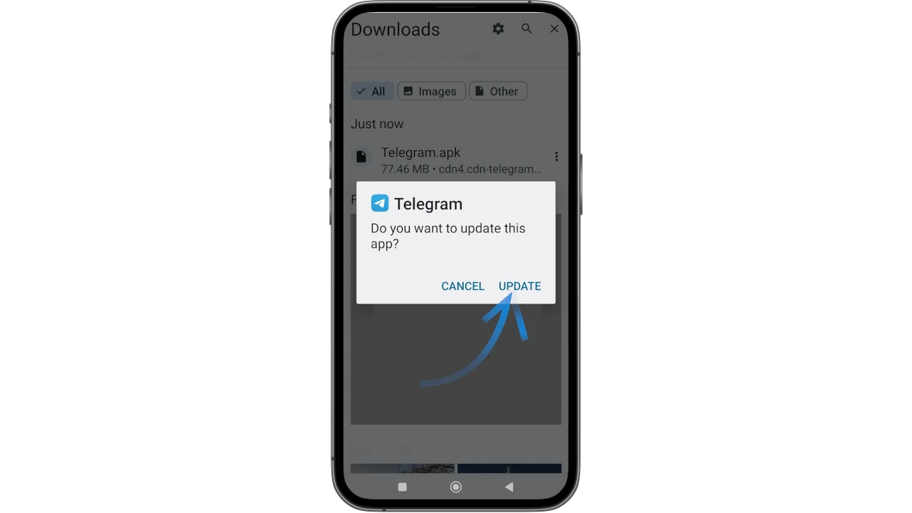

Låt Telegram installera

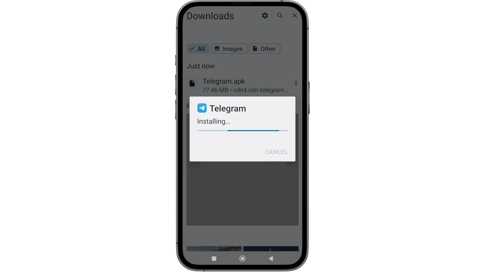

öppna den sedan från din telefon och välj _Start Messaging_.

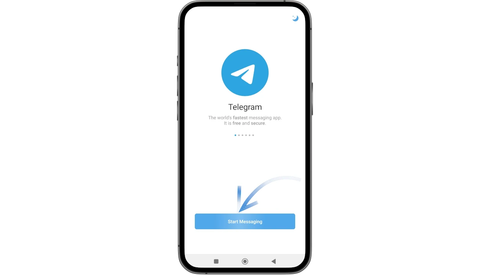

Som alla bra VoIP-meddelandeappar är Telegrams funktion också baserad på en fungerande telefonlinje. För att börja måste du ange ditt telefonnummer: Telegram kommer att skicka ett verifierings-SMS med en OTP-kod.

På nästa skärm kan du dubbelkolla det nummer du har angett. Om det är korrekt klickar du på _Yes_.

Telegram är nu fullt fungerande på mobilen, vi kan gå vidare till de första grundläggande inställningarna.

# Säkerhets- och sekretessinställningar

## Konfiguration av användarnamn

Telegram-användarnamnet - ibland också kallat "handtag" - är mycket mer än bara en fantasi. Handtaget är verkligen **unikt för varje användare**.

På Telegram är det lätt att stöta på bedragare som skriver privat och utger sig för att vara någon de inte är. Alla användare kan falla i fällan och avslöja personlig information i tron att de chattar med en kontakt som de litar fullt ut på. **Vi kommer att se att handtaget är det bästa försvaret för att mildra den här typen av faror**.

Välj _My Profile_ på huvudmenyn.

På nästa skärm väljer du ikonen "penna" längst upp till höger för att öppna menyn för profilredigering.

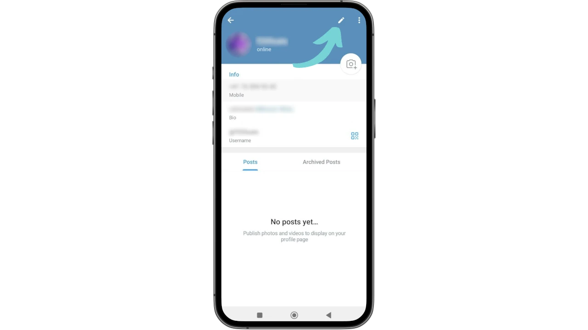

Du kommer att se alla känsliga uppgifter om ditt konto, inklusive ditt telefonnummer och två tomma fält: _Bio_ och _Användarnamn_.

**Genom att klicka på dem kan du fylla i dem med dina val**.

När du ställer in _användarnamn_ varnar Telegram dig om handtaget är tillgängligt eller inte.

(Den här skärmdumpen är också tagen från en telefon där användarnamnet redan är inställt).

Klicka på _Set Username_ (här _Change Username_ av den anledning som just nämnts)

och konfigurera ditt handtag, spara sedan genom att klicka på bocken ✅ längst upp till höger.

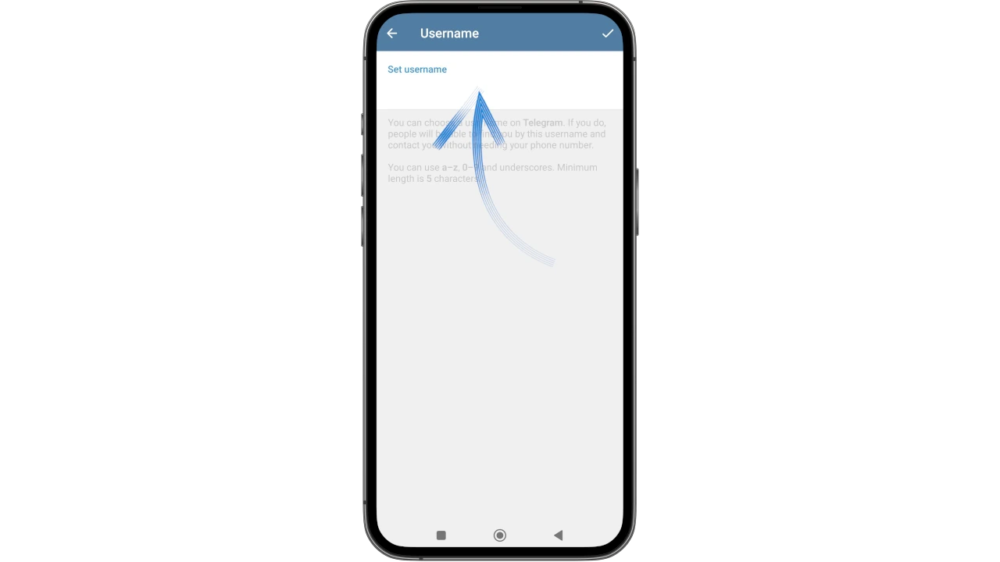

I de flesta Telegram-grupper och -kanaler krävs detta användarnamn som en förutsättning för åtkomst. För administratörerna av sådana grupper är det ett av sätten att hålla bots och spam i schack.

⚠️ Du bör alltid kontrollera vem som kontaktar dig privat och aldrig lämna ut konfidentiell information som lösenord eller Mnemonic-fraser till någon, även om de påstår sig vara officiell support eller erbjuder hjälp (kanske på din begäran). Blockera användare som kontaktar dig utan din tillåtelse, eftersom de säkerligen gör det med bedrägliga avsikter.

Hur tar en bedragare över någon annans identitet?

Det kan de inte, tack vare att användarnamnet är unikt.

**Vad de kan göra är att visa ett "liknande" handtag, ändra något (en bokstav / nummer), så att endast ett noggrant öga tydligt kan se att det är en bedragare **. Var alltid uppmärksam på användarnamnet, så ser du att bedragare inte har ett lätt spel.

## Integritet

En annan viktig försiktighetsåtgärd du kan vidta är att begränsa den information du lämnar ut från ditt nyskapade konto.

Gå tillbaka till huvudmenyn och sedan till _Settings_:

Välj nu _Privacy and Security_ (Sekretess och säkerhet)

Här hittar du en hel serie viktiga parametrar som du kan justera efter hur du vill använda ditt Telegram-konto.

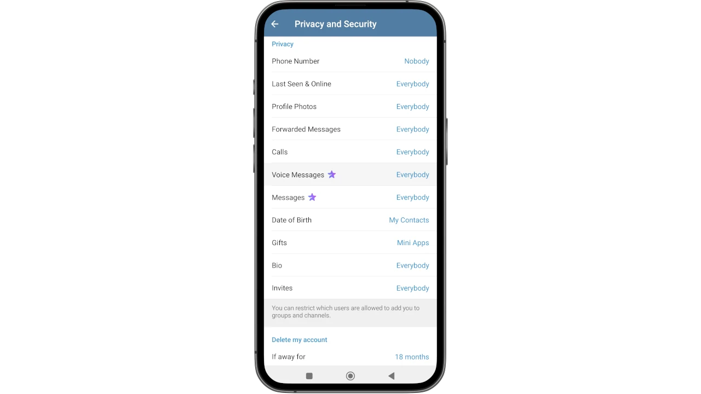

Var noga med att ställa in:

- _Telefonnummer_ till "Ingen"
- _Calls_ till "Mina kontakter"
- _Inviterar_ till "Nobody"

Det här är åtgärder som förhindrar att ditt telefonnummer avslöjas, så att du inte får oönskade samtal eller omedvetet läggs till i grupper med tvivelaktigt ursprung. Senare kan du justera alla andra parametrar som du vill.

Nu när ditt Telegram-konto är konfigurerat och du har fått lite integritet kan du börja använda det.

## Lägga till kontakter och chattar

Om ditt konto precis har skapats är det troligt att huvudsidan ser helt tom ut.

Här kan du redan se de 2 huvudfunktionerna som du kommer att använda för meddelanden:

- ett sökkommando, längst upp till höger;
- ikonen med en penna, längst ned till höger, som gör att du kan öppna instrumentpanelen där du kan hantera nya meddelanden.

Genom att klicka på det senare kommer Telegram först att be om tillstånd att komma åt kontakterna i din Address-bok, som du kan bevilja eller neka beroende på dina behov. Genom att godkänna kommer du att kunna nå de första vännerna som redan har laddat ner appen.

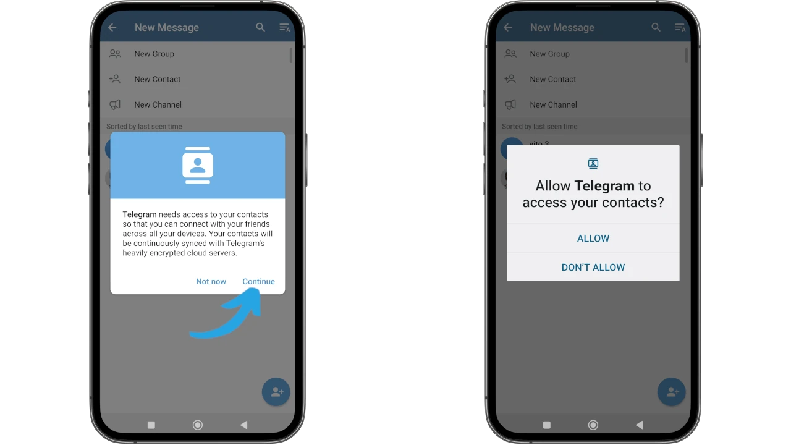

Därefter kommer kontakterna att visas på huvudskärmen.

Genom att klicka på ikonen med pennan längst ned till höger aktiveras skärmen för att lägga till fler kontakter, men inte bara.

Telegram erbjuder möjligheten att söka efter **Groups** på specifika teman, som är mycket lika forum där olika användare samlas för att prata om ett specifikt ämne, eller **Channels**, som vanligtvis används som informationsmedel där endast administratörer kan göra inlägg och följare kan konsumera innehållet.

Genom att välja profilbilden på en kontakt i listan får du tillgång till en omfattande meny för att utföra intressanta åtgärder:

- se alla detaljer om kontakten;
- starta ett videosamtal (**a**);
- starta ett röstsamtal (**b**);
- starta en chatt (**c**);
- anpassa meddelanden (**d**).

Du kan få tillgång till en mycket avancerad meny genom att klicka på de 3 prickarna längst upp till höger:

- ställa in en timer för automatisk radering av meddelanden;
- dela, blockera eller redigera kontakten;
- skicka en gåva (vanligtvis _Telegram Premium_);
- starta en hemlig chatt, vilket är en av de trevligaste funktionerna i Telegram: ** en hemlig chatt är ett utrymme från vilket det till exempel inte är möjligt att ta skärmdumpar, det är en mycket privat chatt och är endast aktiv på mobilen **;
- lägg till kontakten på startskärmen.

Som standard identifieras alla, från enskilda användare till tematiska kanaler, med sitt handtag. När du söker efter någon eller något räcker det med att sätta at-symbolen `@` följt av ett namn.

⚠️Attention: **undvik att gå med i grupper och kanaler utan att verifiera deras äkthet**. För att hitta den officiella Telegram-kanalen/gruppen för ett företag eller ämne som du vill följa, sök hjälp i avsnittet _Contacts_ på officiella webbplatser eller från mycket tillförlitliga källor.

### Avancerade meddelandefunktioner

Telegram låter dig använda unika avancerade funktioner när det gäller att utbyta meddelanden. Gå in i en chatt och klicka på bakgrunden, bredvid ett meddelande från en annan avsändare.

En rad alternativ visas som du kan använda:

- fästa meddelanden (_pin_ **A**) för en snabb sökning av viktiga meddelanden;
- påbörja ett samtal (**B**);
- infoga reaktioner (**C**);
- vidarebefordra, kopiera, radera meddelandet (**D**);
- välja mer än ett meddelande för flera åtgärder.

Om du istället gör samma sak på ett av dina meddelanden **upptäcker du att du kan redigera dina egna meddelanden, även de som redan skickats**.

Du kan också bifoga stora filer och utbyta "tung" media på ett enkelt sätt, mycket mer än i alla andra appar av den här typen.

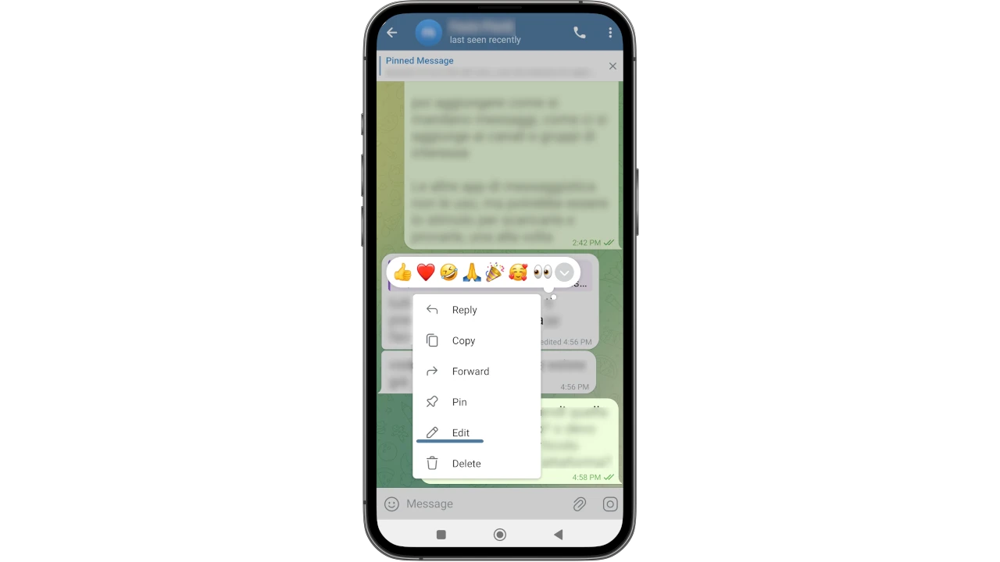

### Personligt moln

Bland de många otroliga funktionerna i Telegram finns det också ett personligt moln som - i skrivande stund - är ** obegränsat **.

Vi pratar om de berömda "Sparade meddelanden", eller _Sparade meddelanden_ i Telegram. Det är en chatt där du kan skicka nästan **(1)** alla typer av information, till exempel överföra filer från PC till mobil och vice versa.

För att komma åt de _Sparade meddelandena_ på ditt konto, gå till huvudmenyn och välj relevant post bland de alternativ som visas på skärmen.

Chatten visas i förgrunden, redo att användas.

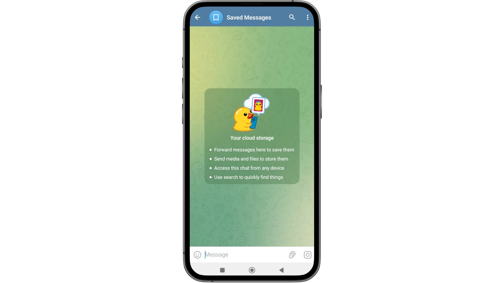

***

**(1)** _Använd inte Telegrams moln för konfidentiell information som lösenord, pins, mnemotekniker och liknande uppgifter_.

***

## Schemaläggning av meddelanden och tyst sändning

Andra användbara avancerade funktioner gör det möjligt att skicka meddelanden med respekt för mottagarnas integritet, välja mellan tyst sändning och schemalägga meddelandet vid lämpliga tidpunkter och dagar.

Allt du behöver göra är att skriva meddelandet, men istället för att skicka det direkt trycker du på och håller ner sänd-ikonen i några sekunder. Det som vanligtvis blir ett skickat meddelande, ger plats för en ny skärm där du kan välja mellan:

- schemalägga meddelandet (datum och tid)
- skicka endast när kontakten är online
- skickas tyst för att inte aktivera mottagarens aviseringar.

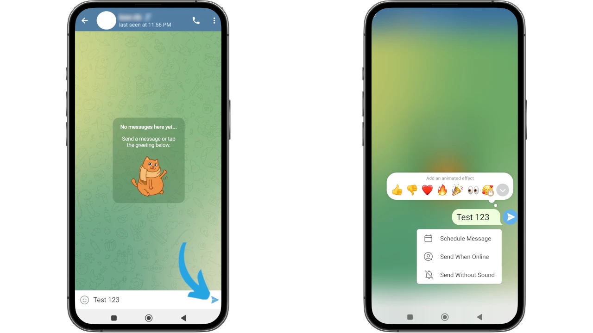

### Rensa telefonens cache

En annan användbar praxis för att hålla din telefon igång effektivt är att rensa Telegram-cachen då och då. Beroende på hur många grupper och kanaler du följer, kan informationen och media som kommer från dessa källor faktiskt samlas i cacheminnet, vilket gör din telefon långsam.

Gå in i huvudmenyerna igen genom att klicka på de tre staplarna längst upp till höger och välj _Min profil_ igen. Den här gången väljer du dock de 3 prickarna längst upp till höger.

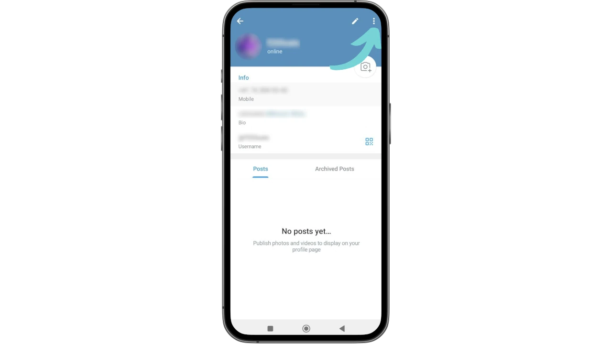

En rullgardinsmeny öppnas där du måste välja _Logga ut_.

⚠️ **Du kommer inte att logga ut, oroa dig inte: vi väljer denna meny endast för att få tillgång till den funktionalitet vi pratar om**.

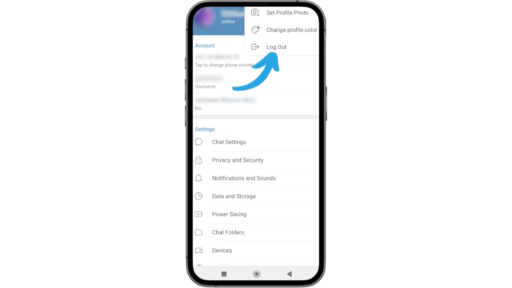

Bland alternativen väljer du _Clear Cache_.

Enheten börjar kvantifiera det använda lagringsutrymmet. När beräkningen är klar visas knappen _Clear Cache_.

Om du klickar på den visas en bekräftelseskärm, där du måste välja _Clear Cache_ igen för att fortsätta.

När processen är klar visar Telegram en skärm där - under resultatet av rengöringen - också visas en intressant inställning, möjligheten att välja hur mycket cacheutrymme som ska ägnas åt media.

Jag rekommenderar att du inte behåller obegränsat utrymme för foton och videor, men att du låter appen ta bort tunga filer när denna gräns har nåtts.

På bilden nedan kan du se var du hittar den här inställningen.

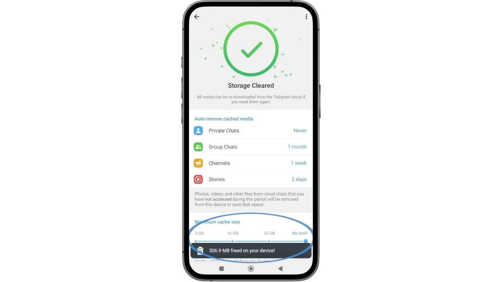

## Telegram skrivbord

Telegram kan användas från din dator, så att det synkroniseras med kontot som visas på din telefon. Du kan välja att inte ladda ner applikationen och att bara använda den via webben. Den här versionen har dock begränsningar jämfört med den som körs på datorn, därför rekommenderar jag att du laddar ner och installerar den för att få ut det mesta av detta kraftfulla verktyg.

Alla alternativ som hittills har sett med mobilmodellen kan utnyttjas på exakt samma sätt från din dator. Även för denna installation går du till den officiella webbplatsen [telegram.org] (https://telegram.org). Från hemsidan väljer du _Telegram för PC/Linux_.

På skärmen som öppnas klickar du på för att ladda ner den körbara filen som passar ditt operativsystem.

Installera Telegram och starta det, så att du omedelbart hittar den första skärmen där du klickar på _Start Messaging_.

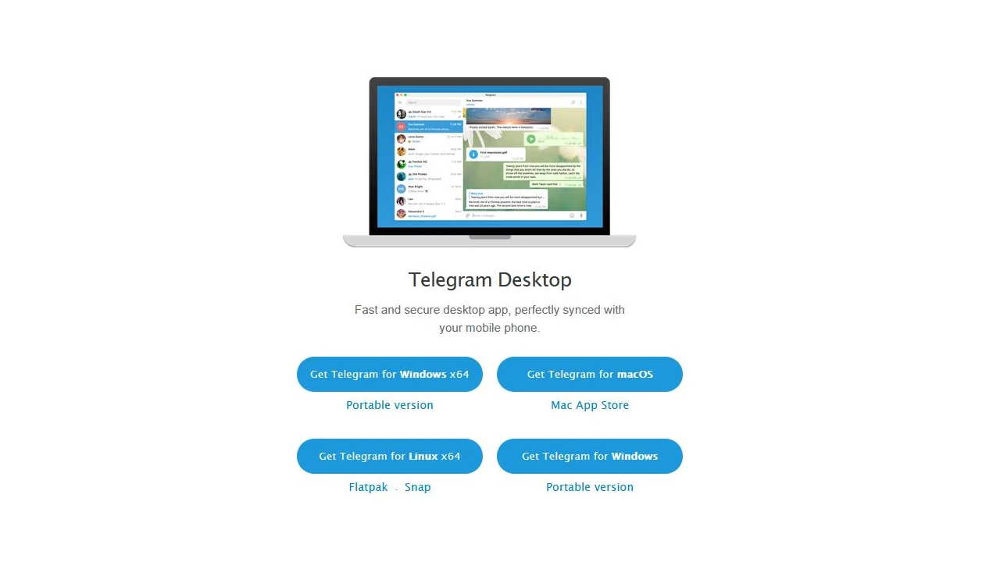

En QR-kod kommer att visas på skärmen, som ska skannas med din mobila enhet, den som Telegram redan är aktiv på: så här kan du använda det kontot via skrivbordet.

Öppna appen på din mobil och gå till huvudmenyn (de tre raderna längst upp till vänster).

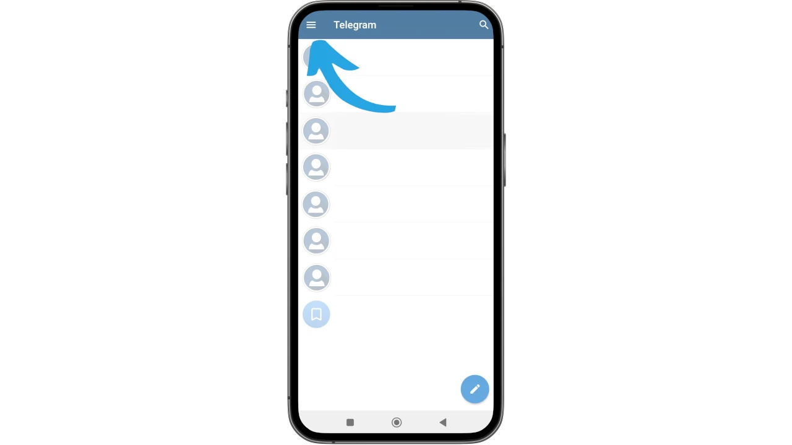

Välj _Inställningar_

och sedan direkt efter _Devices_.

Välj nu _Link Desktop Device_

Kameran i din telefon aktiveras. Vid första användningen är det troligt att din Android kommer att be om behörigheter: bevilja dem.

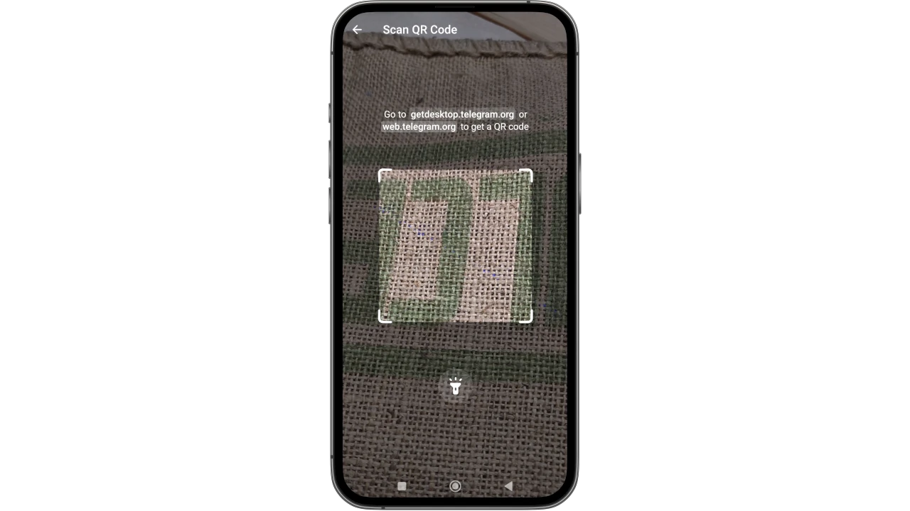

Skanna nu den QR-kod som tidigare visades på datorskärmen.

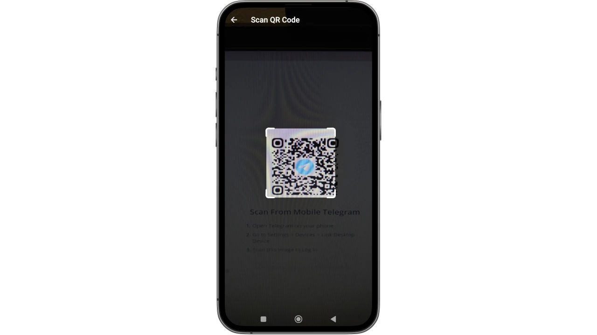

Ett meddelande på din telefon bekräftar att den nya enheten har lagts till på ett framgångsrikt sätt.

Speciellt är Telegram aktivt och användbart även på din stationära dator.

### Gruppsamtal

Om du är administratör eller ägare av en Telegram-grupp kan du starta ett samtal från själva gruppens meny. På så sätt kan du göra livestreaming med flera deltagare, spela in dem i ljud och video, dela dem eller använda dem för ändamål som utbildning.

I följande bild kan du se hur du startar ett gruppsamtal med Telegram-skrivbordet: gå till chatten på samma och i den övre högra delen av skärmen finns ikonen för en skärm. Genom att klicka på det kan du bestämma om du vill starta samtalet omedelbart eller schemalägga det för en förutbestämd tid.

### Slutliga överväganden

Nu när du har läst igenom den här handledningen är du helt kapabel att välja hur du använder Telegram utan att påverkas av det brus som genereras av hype från dess användare eller av mainstream. Du kan börja med ett milt tillvägagångssätt och sedan upptäcka hur du får ut det mesta av det, för dina personliga behov, den här meddelandeappen.