## Kubera iki telegaramu

Telegram ni ikintu kirenze cane app yo gutanga ubutumwa kandi irarenga iciyumviro c’ubuhinga bwo guhanahana amakuru. Ugereranije n’ibindi bihugu vyinshi biyihiganwa, irafise ibintu vyinshi bituma iba igikoresho gikwiriye kumenya gukoreshwa.

Uretse guhana ubutumwa, ukoresheje Telegram urashobora guhamagara amasanamu n’ijwi, guhindura canke gukuraho ubutumwa n’aho bumaze gutumwa, amadosiye manini ya Exchange ata mwanya uhagaze, n’ibindi vyinshi. Twizeye ko iyi nyigisho ishobora gufasha gutuma vyoroha kwiga kandi, ikiruta vyose, kwifatanya n’imiryango myinshi y’aba Bitcoiner iri kuri Telegram.

## Itelegaramu ngendanwa

Naho Telegram iboneka mu maduka yemewe, impanuro yama ari imwe: gukura ku rubuga rw’umuhinguzi, akamenyero keza ku bari mu rugendo rwo kwirinda ubuzima bwite nkawe.

Ukoresheje umucukumbuzi wa telefone yawe, genda ku rubuga [telegram.org](https://telegram.org). Ushobora guhitamwo ururimi ukunda, ariko ndagusavye gukomeza mu congereza, rero uhitemwo _Telegram ya Android_

Ku rupapuro rukurikira, uzosangamwo impanuro ngirakamaro zo gukuraho dosiye `.apk`; iyo utazikeneye, ukande directement kuri _Gukuraho Telegram_.

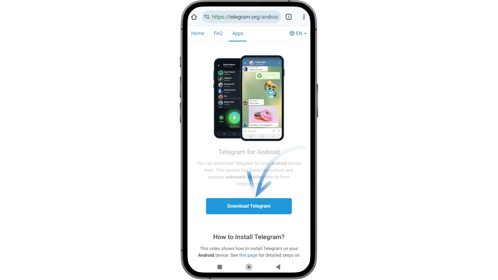

Sisitemu yawe yo gukoresha Android yoshobora kugerageza gutuma udashobora gukuraho iyo dosiye, ikakumenyesha ko iyo dosiye yoshobora kukugirira nabi. Uhitamwo _Gukuraho uko biri kwose_.

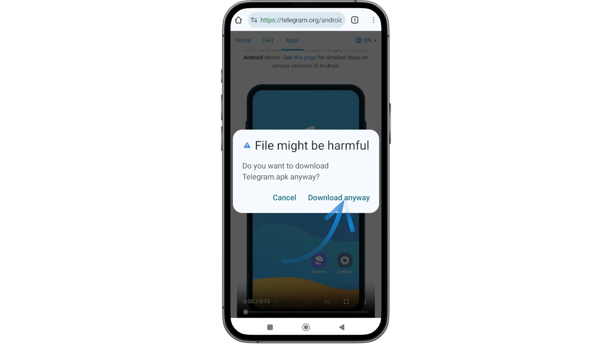

Iyo umaze gukura no gushiramwo Telegram, ushobora guhitamwo _Open_ ku rubuga rwa nyuma.

Mu guhingura iyi nyigisho, nakoresheje telefone aho Telegram yari isanzwe ishizwemwo. Ku gushiramwo kwa mbere, uzosanga _Install_, aho _Update_, uhitemwo gushiramwo.

Reka Telegaramu ishiremwo

hanyuma uyifungure kuri telefone yawe uhitemwo _Start Messaging_.

Cokimwe n’ubutumwa bwose bwiza bwa VoIP, igikorwa ca Telegram na co nyene gishingiye ku murongo wa telefone ukora. Kugira ngo utangure, utegerezwa kwandika inomero yawe ya telefone: Telegram izorungika ubutumwa bwo kugenzura ufise kode ya OTP.

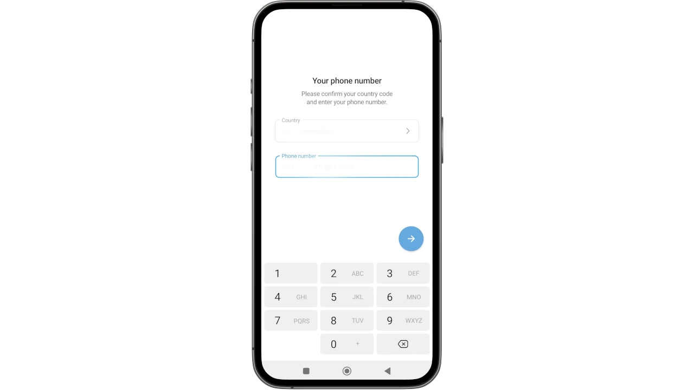

Ku rubuga rukurikira, urashobora gusuzuma kabiri inomero watanze. Niba ari ukuri, kanda kuri _Ego_.

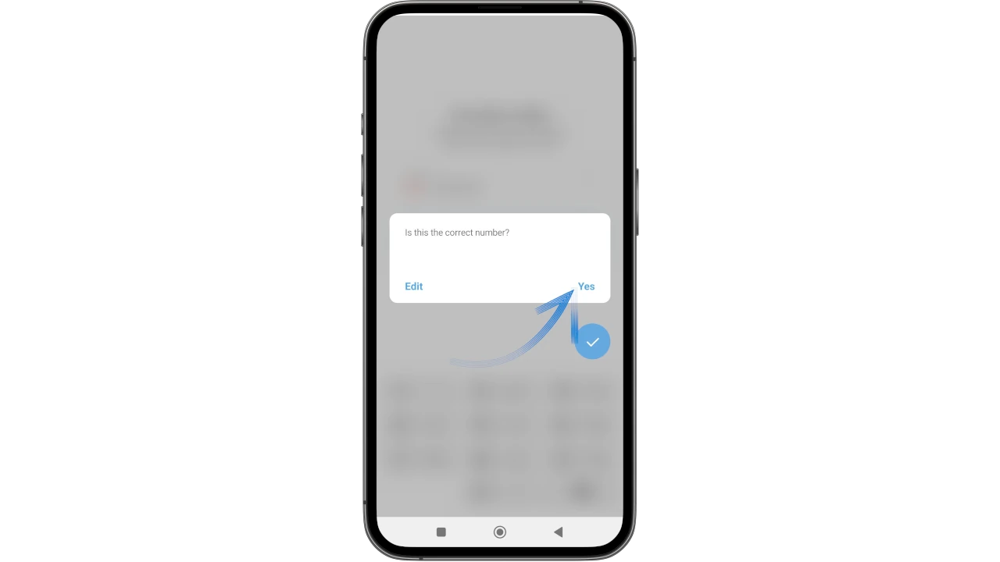

Telegram ubu irakora neza kuri telefone ngendanwa, turashobora kuja ku mirongo ya mbere y’ishimikiro.

# Amagenamiterere y'umutekano n'ubuzima bwite

## Izina ry'ukoresha

Izina ry'ukoresha rya Telegram - rimwe na rimwe ryitwa `handle` - ni ikintu kirenze cane ugushaka gusa. Igikoresho ni **kidasanzwe ku muntu wese akoresha**.

Kuri Telegram, biroroshe guhura n’abahendanyi bandika mu bwiherero, bakigira nk’aho atari bo. Uwukoresha wese arashobora kugwa mu mutego maze agahishura amakuru yiwe bwite yizera ko ariko arayaga n’umuntu yizigira bimwe bishitse. **Tuzobona ko igikoresho co gufata ari co kintu ciza co kwikingira kugira ngo umuntu agabanye ubwo bwoko bw’akaga**.

Mu bimenyetso nyamukuru, hitamwo _Urutonde rwanje_.

Mu gicapo gikurikira, hitamwo ikimenyetso ca "ikaramu" kiri hejuru iburyo kugira ngo winjire muri menyu yo guhindura urutonde.

Uzobona amakuru yose y'agaciro kuri konti yawe, harimwo n'inomero yawe ya telefone n'ibibanza bibiri bitagiramwo ikintu: _Bio_ na _Username_.

**Ukanda kuri buri kimwe cose, urashobora kuvyuzuza ivyo uhisemwo**.

Igihe ushizeho _Izina ry'Ukoresha_, Telegram irakumenyesha nimba igikoresho kiriho canke kitariho.

(Iyi screenshot nayo yafashwe kuri telefone ifise izina ry’ukoresha ryamaze gushirwaho).

Fyonda kuri _Shiraho Izina ry'Ukoresha_ (aha _Hindura Izina ry'Ukoresha_ kubera imvo twavuze)

kandi ushireho igikoresho cawe, hanyuma ubike ukanda ku kimenyetso ✅ kiri hejuru iburyo.

Mu mirwi myinshi ya Telegram n’imirongo, iryo zina ry’ukoresha risabwa nk’ivyangombwa kugira ngo umuntu ashobore kuronka. Ku barongozi b’ayo matsinda, ni bumwe mu buryo bwo gutuma amabots n’ama spam biguma kure.

⚠️ Ukwiye kwama ugenzura handle y’umuntu wese akubwira mu mwiherero kandi ntukigere utanga amakuru y’ibanga nk’amajambo y’ibanga canke amajambo ya Mnemonic ku muntu uwo ari we wese, naho yoba avuga ko ari umufasha wemewe canke ko atanga imfashanyo (kumbure ari wewe usavye). Buza abakoresha baguhamagara ata ruhusha rwawe, kuko ata gukeka ko babigira n’intumbero y’ubuhendanyi.

None umubeshi yiyumvira gute akaranga k’uwundi muntu?

Ntibashobora, kubera ubudasa bw’izina ry’ukoresha.

**Ico bashobora gukora n'ukwerekana igikoresho "gisa n'ico", bagahindura gatoyi (urudome/umubare), kugira ngo ijisho ryitaho gusa ribone neza ko ari umuhendanyi**. Imisi yose urabe neza izina ry’ukoresha, uzobona ko abahendanyi batazogira urukino rworoshe.

## Ubuzima bwite

Ikindi kintu gihambaye wokwirinda ni uguhagarika amakuru usohora muri konti yawe nshasha.

Subira kuri menyu nyamukuru hanyuma winjire mu _Ivyagezwe_:

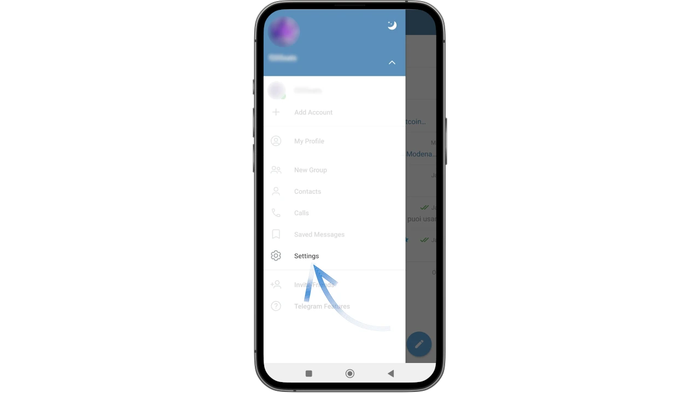

Ubu rero uhitemwo _Ubuzima bwite n'Umutekano_

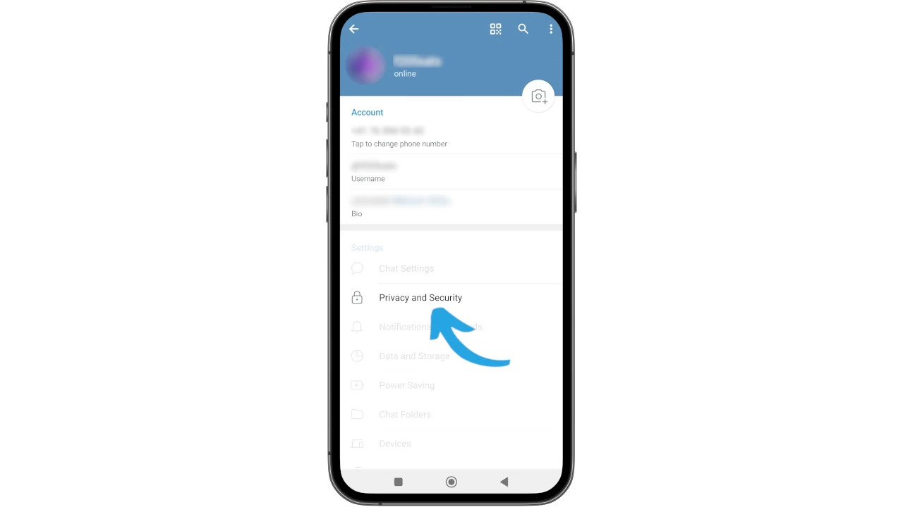

Aha uzosanga urutonde rw’ibintu bihambaye vyo guhindura bivanye n’ingene ushaka gukoresha konti yawe ya Telegram.

Raba neza ko ushizeho:

- _Inomero ya telefone_ kuri "Nta n'umwe".
- _Ahamagara_ ku "Bagenzi banje".
- _Atumira_ kuri "Nta n'umwe".

Izo ni ingingo zizotuma udashira ahabona inomero yawe ya telefone, kugira ngo ntuzoronke amatelefone udashaka canke ngo wongererwe mu migwi y’abantu bafise inkomoko iteye amakenga ataco uzi. Mu nyuma, urashobora guhindura ibindi bipimo vyose uko wipfuza.

Ubu ko konti yawe ya Telegram yashizweho kandi ukaba wararonse ubuzima bwite bukeyi, urashobora gutangura kuyikoresha.

## Kwongerako abo mubonana n'ibiganiro

Niba konti yawe iherutse kuremwa, birashoboka ko urupapuro nyamukuru ruzoboneka ataco rurimwo.

Aha urashobora kubona ibikorwa 2 nyamukuru uzokoresha mu gutanga ubutumwa:

- itegeko ryo kurondera, hejuru iburyo;
- ikimenyetso gifise ikaramu, hasi iburyo, kizotuma ushobora gufungura urupapuro rwo gukoresha ubutumwa bushasha.

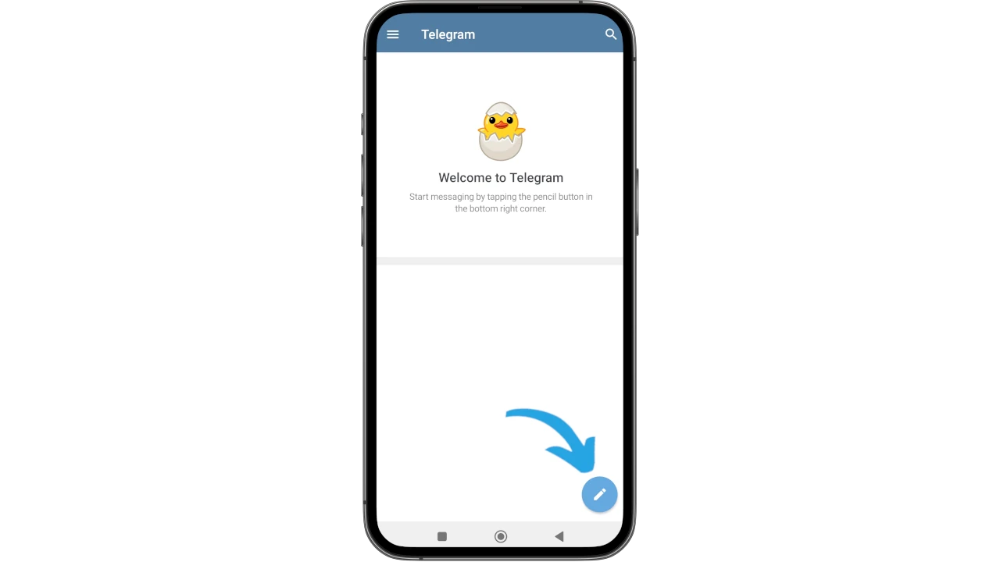

Ufyondeye kuri iyo ya nyuma, ubwa mbere, Telegram izogusaba uruhusha rwo gushika ku ma contacts ari mu gitabu cawe ca Address, ushobora gutanga canke kwanka bivanye n’ivyo ukeneye. Niwemera, uzoshobora gushikira abagenzi ba mbere bamaze gukuraho iyo porogarama.

Inyuma y’ivyo, ama contacts azoboneka ku rubuga nyamukuru.

Ufyondeye ku kimenyetso gifise ikaramu, kiri hasi iburyo, bituma igicapo gikora kugira ngo wongereko abandi bantu, ariko si vyo gusa.

Telegram itanga ubushobozi bwo kurondera **Imirwi** ku nsanganyamatsiko zimwe zimwe, zisa cane n’amahuriro aho abakoresha batandukanye bakoranira kugira ngo bavuge ku ciyumviro kinaka, canke **Imirongo**, akenshi ikoreshwa nk’uburyo bwo gutanga amakuru aho abarongozi bonyene bashobora gushiramwo kandi abakurikira bagafungura ibirimwo.

Guhitamwo ifoto y'umwirondoro w'umuntu muri list, ushobora gushika ku rutonde runini kugira ngo ukore ibikorwa bishimishije:

- reba amakuru yose y’uwo muntu;
- gutangura guhamagara kuri videwo (**a**);
- gutangura guhamagara n’ijwi (**b**);
- gutangura ikiyago (**c**);
- guhindura amatangazo (**d**).

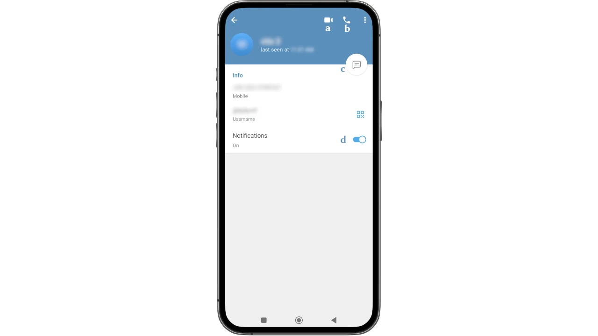

Ushobora gushika ku rutonde rwo hejuru cane ukanda ku tudodo 3 turi hejuru iburyo, kugira ngo:

- gushinga igihe co gukuraho ubutumwa ubwabwo;
- gusangira, guhagarika, canke guhindura uwo muntu;
- kohereza ingabirano (kenshi _Igiciro ca Telegaramu_);
- gutangura ikiyago c’ibanga, kikaba ari kimwe mu bintu vyiza cane biri muri Telegram: **ikiyago c’ibanga ni ikibanza nk’akarorero, bidashoboka gufata amafoto, ni ikiyago c’ibanga cane kandi gikora kuri telefone ngendanwa gusa**;
- wongere uwo muntu ku mugaragaro w'intango.

Ku mburabuzi, umuntu wese, kuva ku bakoresha ku giti cabo gushika ku mihora y’insanganyamatsiko, amenyekana ku gikoresho ciwe. Iyo urondera umuntu canke ikintu, birahagije gushiramwo ikimenyetso at `@` gikurikiwe n'izina.

⚠️Iciyumviro: **mwirinde kwinjira mu ma groupe n'imihora mutasuzumye ko ari ivy'ukuri**. Kugira uronke umurongo/umugwi wemewe wa Telegram w’ishirahamwe canke ingingo wipfuza gukurikira, rondera imfashanyo mu gice ca _Contacts_ c’imbuga zemewe canke mu masoko yizigirwa cane.

### Ibirango vy'ubutumwa buteye imbere

Telegram iragufasha gukoresha ibintu bidasanzwe biteye imbere iyo bije mu guhana ubutumwa. Injira mu kiganiro maze ukande ku nyuma, iruhande y’ubutumwa bwose buvuye ku wundi muntu.

Urutonde rw'amahitamwo ruraboneka ushobora gukoresha:

- ubutumwa bwa pin (_pin_ **A**) kugira ngo urondere ningoga ubuhambaye;
- gutangura guhamagara (**B**);
- kwinjiza inyishu (**C**);
- gutera imbere, gukopa, gukuraho ubutumwa (**D**);
- guhitamwo ubutumwa burenze bumwe ku bikorwa vyinshi.

Niwakora iyo operation nyene kuri bumwe mu butumwa bwawe, ahubwo, **uzosanga ushobora guhindura ubutumwa bwawe bwite, mbere n'ubwo bwamaze gutumwa**.

Ushobora kandi gufatanya amadosiye manini, ugahana amakuru "iremereye" mu buryo bworoshe, cane kuruta izindi porogaramu zose z'ubwo bwoko.

### Igicu c'umuntu ku giti ciwe

Mu bintu vyinshi bitangaje vya Telegram, harimwo n’igicu c’umuntu ku giti ciwe - mu gihe c’ukwandika - **kitagira aho kigarukira**.

Turavuga ku butumwa buzwi cane bwa "Ubutumwa bwabitswe", canke _Ubutumwa bwabitswe_ bwa Telegram. Ni chat aho ushobora kohereza hafi **(1)** ubwoko bwose bw'amakuru, nk'akarorero gukura amadosiye kuri PC ukayashira kuri mobile n'ibihushanye n'ivyo.

Kugira ngo ushikire _Ubutumwa bwabitswe_ bwa konti yawe, genda kuri menyu nyamukuru uhitemwo ikintu gibereye mu mahitamwo aboneka ku rubuga.

Ico kiganiro kiboneka imbere, kikaba giteguye gukoreshwa.

***

**(1)** _Ntukoreshe igicu ca Telegram ku makuru y'ibanga nk'amajambo y'ibanga, ama pin, ama mnemonics, n'amakuru y'ubwo bwoko_.

***

## Gutegura ubutumwa no kohereza mu gacerere

Ibindi bintu vy’ingirakamaro biteye imbere bituma umuntu yohereza ubutumwa yubaha ubuzima bwite bw’ababuronse, agahitamwo hagati yo kuburungika mu gacerere, no kubushira ku rutonde rw’ubutumwa ku bihe n’imisi bikwiye.

Ico ukeneye gukora n’ukwandika ubutumwa ariko aho kuburungika ubwo nyene, ukande kandi ufate ikimenyetso co kohereza mu masegonda makeyi. Ivyo bikunda kuba ubutumwa bwoherejwe, bitanga umwanya ku rubuga rushasha aho ushobora guhitamwo:

- gutegura ubutumwa (itariki n'isaha)
- wohereze gusa iyo uwo muntu ari kuri interineti
- wohereze mu gacerere, kugira ngo ntukoreshe amamenyesha y’uwuyakira.

### Gukuraho ububiko bwa telefone yawe

Ikindi kintu ngirakamaro cotuma telefone yawe iguma ikora neza ni ugukuraho ububiko bwa Telegram rimwe na rimwe. Bivanye n’imigwi n’imirongo ukurikirana, mu vy’ukuri, amakuru n’ibinyamakuru biva muri ivyo bibanza vyoshobora kwirundanira mu bubiko, bigatuma telefone yawe igenda buhoro.

Injira mu menus nyamukuru kandi ukanda ku mirongo itatu iri hejuru iburyo hanyuma uhitemwo _My Profile_ kandi. Ariko rero, kuri iyi ncuro, nuhitemwo utudomo 3 turi hejuru iburyo.

Imenyu imanuka izofunguka aho utegerezwa guhitamwo _Log Out_.

⚠️ **Ntuzosohoka, ntuhagarike umutima: duhitamwo iyi menu gusa kugira ngo ushikire ibikorwa turiko turavuga**.

Mu mahitamwo, hitamwo _Kuraho ububiko_.

Ico gikoresho gitangura gupima ikibanza co kubikamwo ibintu gikoreshwa. Igihe igiharuro kirangiye, buto _Clear Cache_ izoboneka.

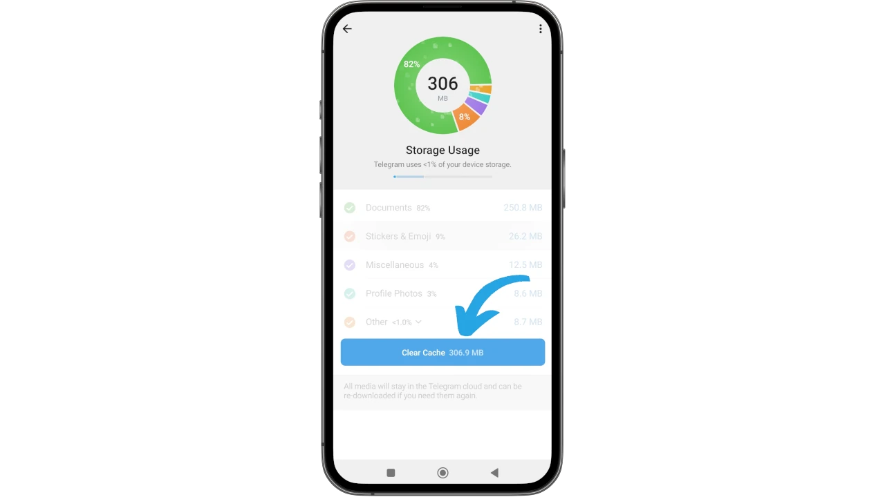

Ugikandako bizokwereka igicapo co kwemeza, aho utegerezwa guhitamwo _Clear Cache_ kandi kugira ngo ukomeze.

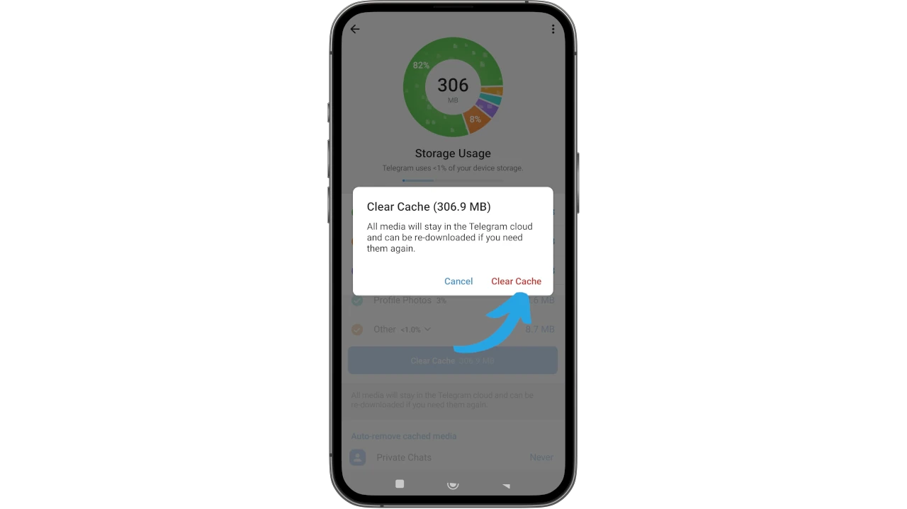

Igihe igikorwa kirangiye, Telegram yerekana igicapo aho - munsi y’ivyavuye mu gusukura - na co nyene kigaragara ahantu hashimishije, ubushobozi bwo guhitamwo umwanya wo gucungera amakuru ukwiye guhabwa ibinyamakuru.

Ndabagira inama yo kudagumya umwanya utagira aho ugarukira wo gushiramwo amafoto n’amasanamu, ahubwo ngo ureke iyo porogarama ikureho amadosiye aremereye iyo iyo nzira ishitse.

Ushobora kubona kw’ifoto ikurikira aho wosanga iyo setting.

## Telegaramu y'ibiro

Telegram ishobora gukoreshwa kuri mudasobwa yawe, kugira ngo ihure na konti yerekanwa kuri telefone yawe. Ushobora guhitamwo kudakura kuri interineti iyo porogarama no kuyikoresha biciye ku rubuga gusa. Ariko rero, iyi verisiyo irafise aho igarukira ugereranyije n’iyo ikoreshwa kuri mudasobwa, ni co gituma ndabagira inama yo kuyikurako no kuyishiramwo kugira ngo mukoreshe neza ico gikoresho gikomeye.

Amahitamwo yose yabonetse gushika ubu n’umuderi wa telefone ngendanwa, ashobora gukoreshwa mu buryo bumwe nyene uhereye kuri mudasobwa yawe. Kandi ku bijanye n’ivyo gushiramwo, genda ku rubuga rwemewe [telegram.org](https://telegram.org). Kuva kuri paji y'intango uhitemwo _Telegaramu ya PC/Linux_.

Mu gicapo kizofunguka, fyonda kugira ngo ubone executable ibereye sisitemu yawe.

Install Telegram maze uyifungure, rero uhite ubona screen ya mbere aho uzokanda _Start Messaging_.

QR Code izogaragara ku rubuga, kugira ngo uyikoreshe mu gukoresha telefone yawe, iyo Telegram isanzwe ikorako: ni ko ushobora gukoresha iyo konti biciye kuri desktop.

Ugurure app kuri telefone yawe, uje kuri menu main (imirongo itatu iri hejuru ibubamfu).

Hitamwo _Ivyagezwe_

hanyuma ubwo nyene inyuma ya _Ibikoresho_.

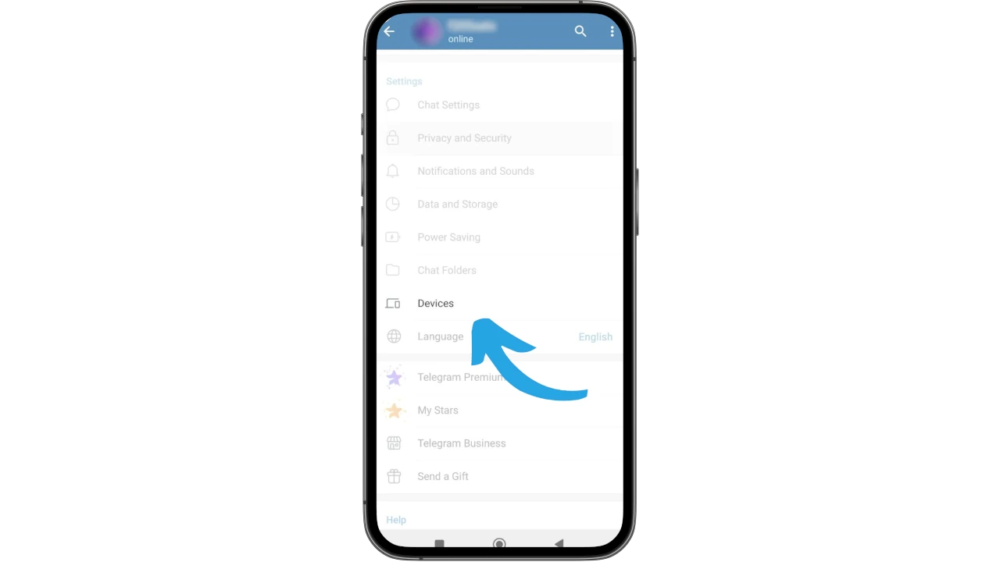

Ubu rero hitamwo _Ihuza igikoresho co ku biro_

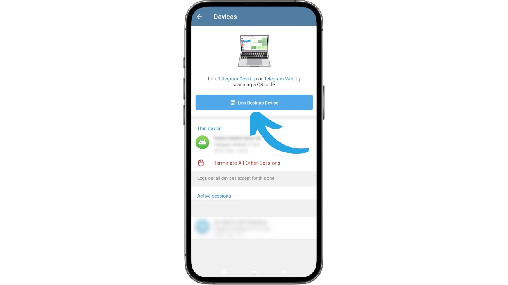

Camera ya telefone yawe irakora. Ku gukoresha kwa mbere, birashoboka ko Android yawe izosaba uruhusha: uzihe.

Ubu rero, nushireko QR Code yari yabonetse mbere ku rubuga rwa orodinateri.

Itangazo riri kuri telefone yawe ryemeza ko ico gikoresho gishasha congereweko neza.

Cane cane, Telegram irakora kandi irakoreshwa no kuri mudasobwa yawe.

### Guhamagara kw'umugwi

Nimba uri umuyobozi canke nyen’umugwi wa Telegram, urashobora gutangura guhamagara ukoresheje menu y’uwo mugwi ubwawo. Uko niko, ushobora gukora live streaming n’abantu benshi, ukabifata mu majwi no mu mashusho, ukabisangiza abandi, canke ukabikoresha mu ntumbero nk’inyigisho.

Mu ishusho ikurikira, urashobora kubona ingene wotangura guhamagara mu mugwi ukoresheje Telegram desktop: genda kuri chat y’uwo nyene kandi mu gice co hejuru iburyo c’ibarabara hariho ikimenyetso c’ibarabara. Niwafyonda kuri ivyo, urashobora guhitamwo nimba uzoca utangura guhamagara uwo muntu ubwo nyene canke ukawutegekanya ku gihe wategekanije.

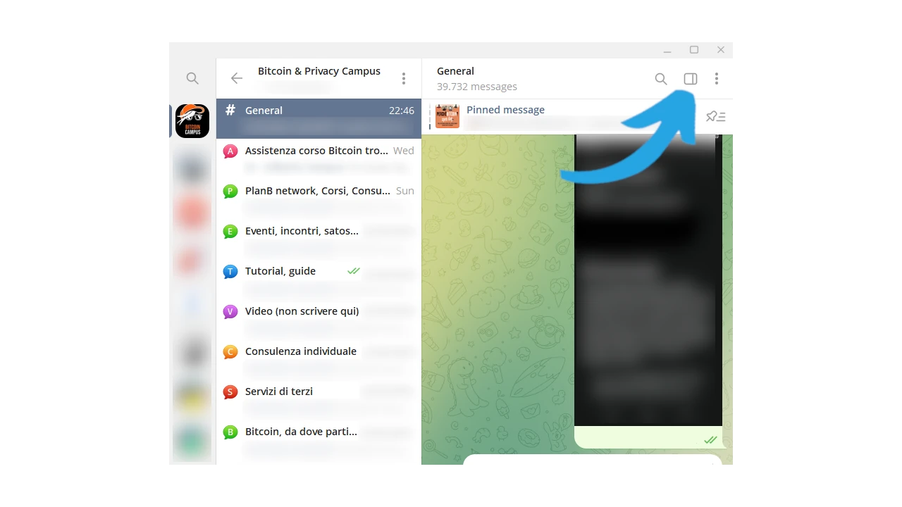

### Ivyiyumviro vya nyuma

Ubu umaze gusoma muri iyi nyigisho, urashoboye neza guhitamwo ingene ukoresha Telegram, utagira ico ukoze ku rusaku ruterwa n’ivyo abayikoresha bavuga, canke n’ivyo abantu benshi bavuga. Ushobora gutangura n’uburyo bworoshe hanyuma ukabona ingene wobukoresha neza, ku vyo ukeneye bwite, iyi porogarama yo gutanga ubutumwa.