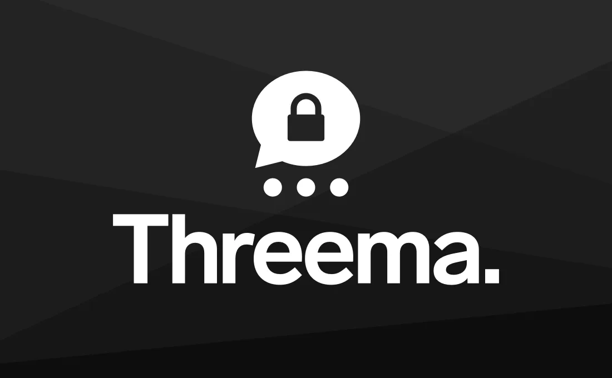

Threema on vuonna 2012 Sveitsissä perustettu pikaviestisovellus, joka on suunniteltu takaamaan yksityisyys ja turvallisuus. Toisin kuin WhatsApp, Telegram tai Signal, Threema ei vaadi puhelinnumeroa tai sähköpostia Address tilin luomiseen. Jokaisella käyttäjällä on yksilöllinen tunniste, mikä mahdollistaa täysin anonyymin rekisteröitymisen.

Teknisesti Threeman kautta tapahtuva viestintä on päästä päähän salattua. Mobiilisovelluksen koodi on ollut avointa lähdekoodia vuodesta 2020, mutta palvelininfrastruktuuri on edelleen oma ja keskitetty. Palvelimia isännöidään yksinomaan Sveitsissä (maa, joka on tunnettu tietosuojaa koskevasta oikeudellisesta kehyksestään).

Threemalla on perusohjelmat Androidille ja iOS:lle. Tarjolla on myös verkkosovellus sekä ohjelmisto Windowsille, Linuxille ja macOS:lle. Niiden käyttäminen edellyttää kuitenkin ensin rekisteröitymistä mobiililaitteella.

Threema-sovellus ei ole ilmainen. Se toimii kertaluonteisella ostomallilla: 5,99 €, jos haluat käyttää sovellusta koko elämäsi ajan (tai 4,99 €, jos ostat sen suoraan). Jotta Threema-sovellusta voisi todella käyttää anonyymisti, myös maksun on oltava anonyymi. Siksi voit ostaa aktivointiavaimen bitcoineina tai käteisellä "*Threema Shopista*" aktivoidaksesi Android-version. IOS:ssä oston on sen sijaan tapahduttava App Storen kautta Applen sovellusten rahaksi muuttamista koskevien rajoitusten vuoksi.

On myös oma yritysversio nimeltä "*Threema Work*". Tässä oppaassa keskitymme kotiversioon.

| Sovellus             | E2EE 1:1       | E2EE ryhmät    | Anonyymi rekisteröinti | Avoimen lähdekoodin asiakaslisenssi | Avoimen lähdekoodin palvelinlisenssi | Hajautettu palvelin      | Luomisvuosi       |
| -------------------- | -------------- | -------------- | ---------------------- | ----------------------------------- | ------------------------------------ | ------------------------ | ----------------- |
| WhatsApp             | ✅              | ✅              | ❌                      | ❌                                   | ❌                                    | ❌                        | 2009              |
| WeChat               | ❌              | ❌              | ❌                      | ❌                                   | ❌                                    | ❌                        | 2011              |
| Facebook Messenger   | ✅              | 🟡 (valinnainen) | ❌                      | ❌                                   | ❌                                    | ❌                        | 2011              |
| Telegram             | 🟡 (valinnainen) | ❌              | 🟡                     | ✅                                   | ❌                                    | ❌                        | 2013              |
| LINE                 | ✅              | ✅              | ❌                      | ❌                                   | ❌                                    | ❌                        | 2011              |
| Signal               | ✅              | ✅              | ❌                      | ✅                                   | ✅                                    | ❌                        | 2014              |
| Threema              | ✅              | ✅              | ✅                      | ✅                                   | ❌                                    | ❌                        | 2012              |
| Element (Matrix)     | ✅              | ✅              | ✅                      | ✅                                   | ✅                                    | 🟡 (federoitu)          | 2016              |
| Delta Chat           | ✅              | ✅              | ✅                      | ✅                                   | N/A                                  | 🟡 (sähköpostin kautta) | 2017              |
| Conversations (XMPP) | ✅              | ✅              | ✅                      | ✅                                   | ✅                                    | 🟡 (federoitu)          | 2014              |
| Session              | ✅              | ✅              | ✅                      | ✅                                   | ✅                                    | ✅                        | 2020              |
| SimpleX              | ✅              | ✅              | ✅                      | ✅                                   | ✅                                    | ✅                        | 2021              |
| Olvid                | ✅              | ✅              | ✅                      | ✅                                   | ❌                                    | 🟡(ei hakemistoa)       | 2019              |
| Keet                 | ✅              | ✅              | ✅                      | ❌                                   | N/A                                  | ✅                        | 2022              |
| Jami                 | ✅              | ✅              | ✅                      | ✅                                   | N/A                                  | ✅                        | 2005              |
| Briar                | ✅              | ✅              | ✅                      | ✅                                   | N/A                                  | ✅                        | 2018              |
| Tox                  | ✅              | ✅              | ✅                      | ✅                                   | N/A                                  | ✅                        | 2013              |

*E2EE = End-to-end-salaus*

## Asenna Threema-sovellus

Threema on saatavilla kaikilla alustoilla. Voit ladata sovelluksen suoraan puhelimesi sovelluskaupasta:

- [Google Play](https://play.google.com/store/apps/details?id=ch.threema.app);
- [F-Cold] (https://f-droid.org/en/packages/ch.threema.app.libre/);
- [Huawei AppGallery](https://appgallery.huawei.com/#/app/C103713829);
- [App Store](https://apps.apple.com/us/app/threema-the-secure-messenger/id578665578).

Androidissa on myös mahdollista [asentaa APK:n kautta](https://shop.threema.ch/en/download).

On myös [tietokoneversioita](https://threema.ch/download) (MacOS, Linux ja Windows). Tässä opetusohjelmassa näytetään, miten ne synkronoidaan.

## Osta Threema-lisenssi

Kun olet asentanut sovelluksen, jos olet käyttänyt sitä suoraan sovelluskaupan kautta, olet jo maksanut lisenssistä ja sinulla pitäisi olla siihen välitön pääsy. Jos käytit F-Droidin tai APK:n kautta, sinun on nyt ostettava lisenssi viralliselta verkkosivustolta.

[Mene "*Threema Shop*" (https://shop.threema.ch/) ja napsauta "*Osta Threema for Android*" -painiketta.

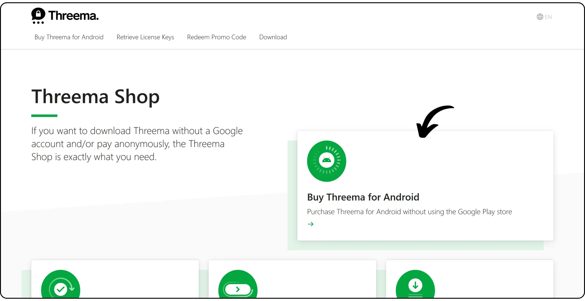

Valitse ostettavien lisenssien määrä (vain yksi, jos se on vain sinulle), valitse valuutta ja valitse lisenssin toimitustapa. Voit valita, haluatko vastaanottaa lisenssin sähköpostitse vai suoraan sivustolla, jos haluat pysyä nimettömänä. Napsauta sitten "*Siirry maksuun*".

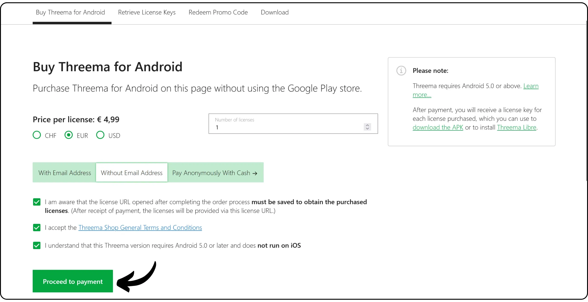

Valitse maksutapa. Omassa tapauksessani aion maksaa bitcoineilla, mitä suosittelen myös sinulle, sillä sen avulla voit pysyä anonyyminä (edellyttäen, että käytät Bitcoin:ta asianmukaisesti) ja se on paljon kätevämpi kuin käteisellä maksaminen etänä. Napsauta sitten "*Seuraava*".

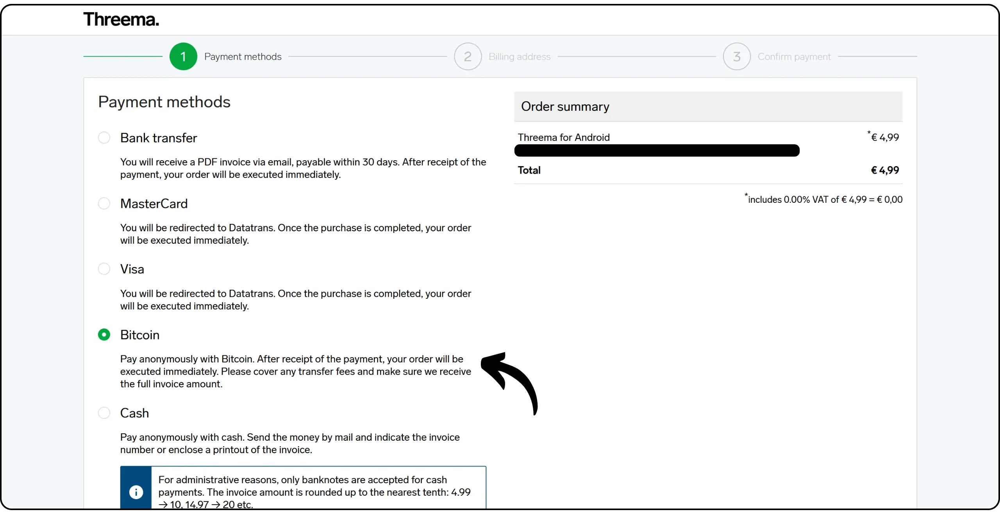

Jos et tarvitse Invoice:a, napsauta uudelleen "*Seuraava*" syöttämättä mitään henkilökohtaisia tietoja.

Vahvista sitten ostoksesi klikkaamalla "*Vahvista maksu*".

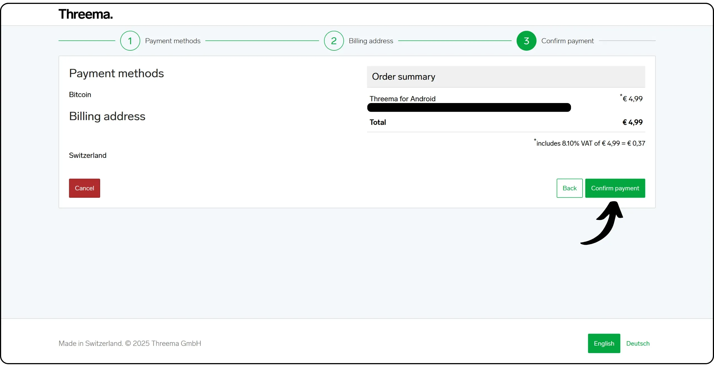

Tämän jälkeen sinun on lähetettävä ilmoitettu summa Bitcoin Address:een (valitettavasti Lightning ei vielä tue). Kun tapahtuma on vahvistettu Blockchain:ssä, napsauta "*Sulje*" Invoice:n vieressä.

Tämän jälkeen saat käyttöoikeusavaimesi käyttöösi. Huomaa: jos et ole syöttänyt Address-sähköpostia, tämä avain näkyy vain tässä. Muista tallentaa sivun URL-osoite, jotta voit tarvittaessa käyttää sitä myöhemmin.

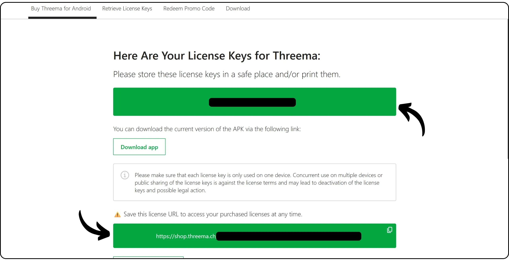

## Luo tili Threemassa

Nyt kun sinulla on lisenssiavain, voit viimein käynnistää sovelluksen. Jos et ole ostanut Threemaa sovelluskaupasta, sinua pyydetään ensimmäisellä käynnistyskerralla syöttämään sivustolta ostettu lisenssiavain.

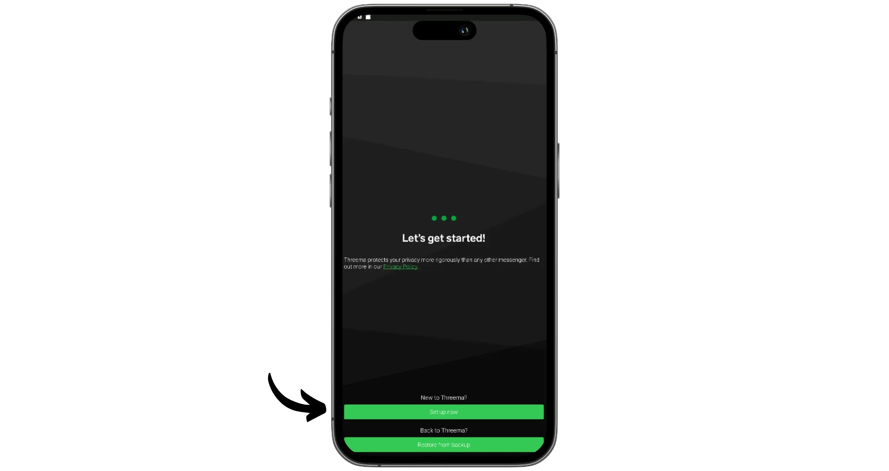

Napsauta sitten "*Set up now*" -painiketta.

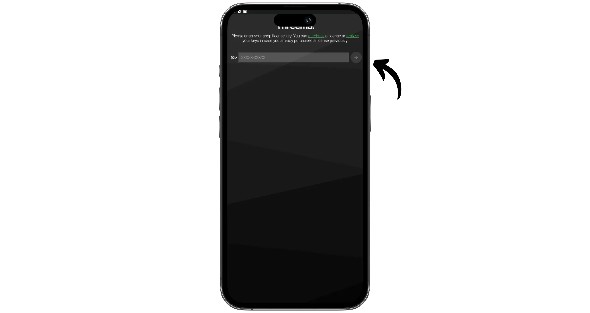

Siirrä sormiasi näytön poikki generate-entropialähteen luomiseksi, jota tarvitaan "*Threema ID*" -tunnuksen luomiseen.

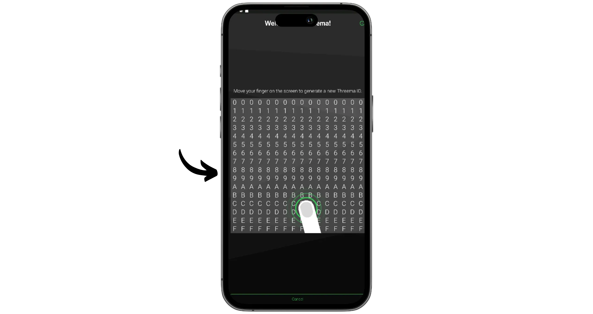

Tämän jälkeen näyttöön tulee "*Threema ID*". Sen avulla voit ottaa yhteyttä muihin käyttäjiin. Klikkaa "*Seuraava*".

Valitse salasana. Sen avulla voit tarvittaessa palauttaa tilisi käyttöoikeuden. Tee salasanastasi mahdollisimman pitkä ja satunnainen ja säilytä siitä turvallinen kopio esimerkiksi salasanahallinnassa.

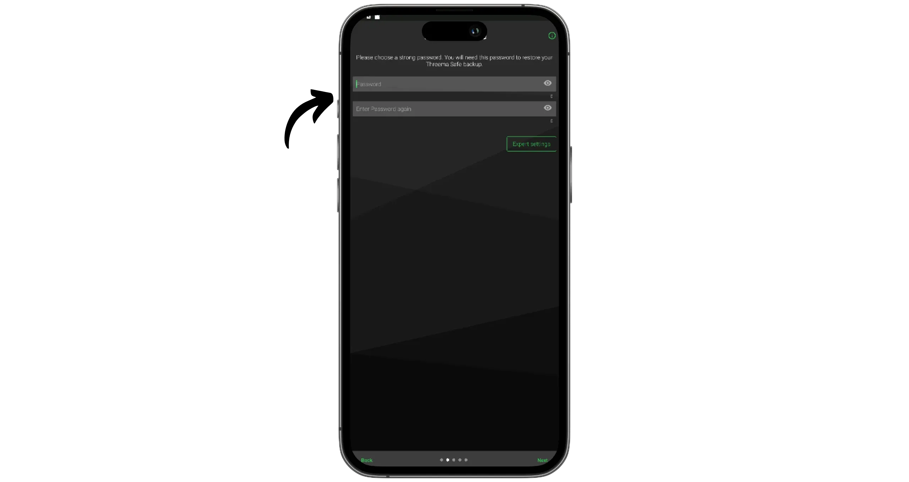

Valitse sitten käyttäjätunnus, joka voi olla joko oikea nimesi tai salanimi.

Tämän jälkeen voit yhdistää Threema-tunnuksesi puhelinnumeroosi. Tämä helpottaa yhteystietojesi etsimistä, mutta jos käytät Threema-tunnusta, sen tarkoituksena on myös säilyttää anonymiteettisi, joten sitä ei kannata yhdistää. Napsauta "*Seuraava*".

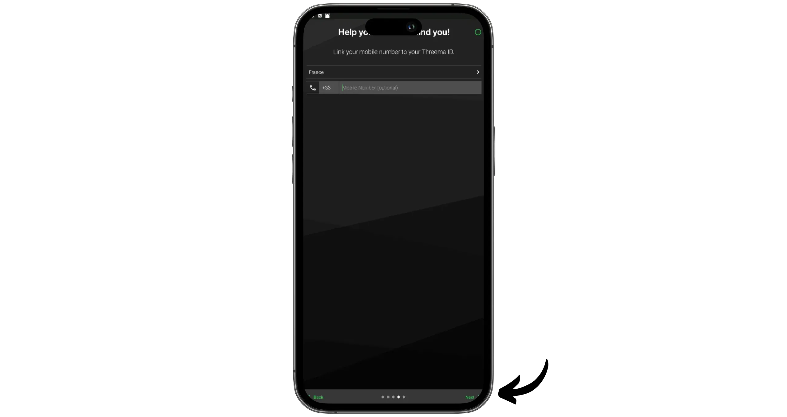

Kun olet suorittanut tämän vaiheen, napsauta "*Finish*".

Olet nyt yhteydessä Threemaan ja voit aloittaa yhteydenpidon.

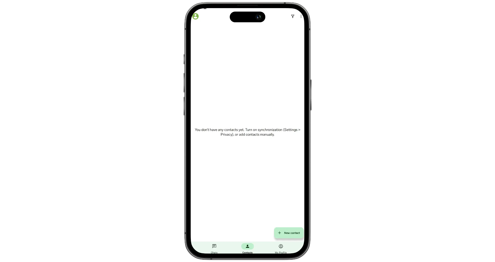

## Threeman perustaminen

Pääset asetuksiin klikkaamalla kolmea pientä pistettä oikeassa yläkulmassa ja valitsemalla sitten "*Asetukset*".

"*Privacy*"-välilehdellä on useita vaihtoehtoja, joita voit mukauttaa tarpeidesi mukaan:

- Puhelimen yhteystietojen synkronointi ;
- Viestien vastaanottaminen tuntemattomilta ihmisiltä;
- Kirjoitusindikaattori tietojen syöttämisen aikana ;
- Ilmoitus viestien vastaanottamisesta..

Suosittelen, että otat "*Turvallisuus*"-välilehdellä käyttöön "*Lukitusmekanismi*"-vaihtoehdon sovelluksen käytön suojaamiseksi. On myös suositeltavaa aktivoida passphrase paikallisten varmuuskopioiden suojaamiseksi.

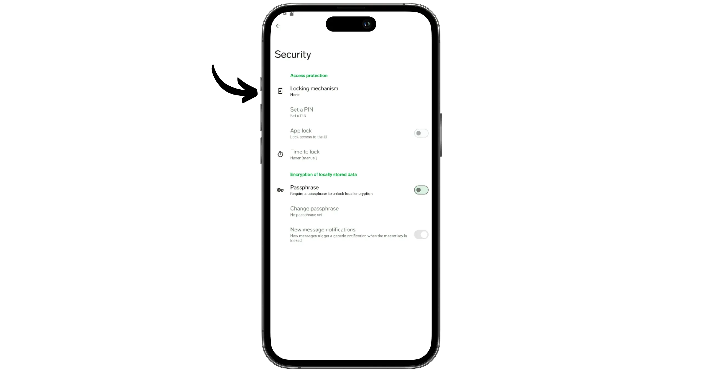

Tutustu vapaasti asetusten muihin osioihin, jotta voit mukauttaa sovelluksen mieltymystesi mukaan.

## Threema-tilisi varmuuskopiointi

Ennen kuin aloitat viestien vaihdon, on tärkeää suunnitella tapa, jolla tilisi voidaan palauttaa, varsinkin jos puhelimesi vaihdetaan tai se katoaa. Voit tehdä tämän napsauttamalla Interface:n oikeassa yläkulmassa olevia kolmea pistettä ja siirtymällä sitten "*Backups*"-valikkoon.

Täältä löydät kaksi vaihtoehtoa tietojen varmuuskopiointia varten:

- "*Threema Safe*";
- "*Datan varmuuskopiointi*".

"Threema Safe* tallentaa kaikki tilitietosi, keskusteluja lukuun ottamatta, Threeman palvelimille. Nämä tiedot salataan salasanalla, jonka valitsit tiliäsi luodessasi, jolloin varmistetaan, ettei Threema pääse niihin käsiksi. Varmuuskopiot tehdään automaattisesti ja säännöllisesti.

*Threema Safe* -toiminnon avulla voit palauttaa tilisi uuteen laitteeseen syöttämällä vain *Threema ID*-tunnuksesi ja salasanasi. Jos jompikumpi näistä kahdesta tiedosta puuttuu, tilisi palauttaminen on mahdotonta.

Tämän vaihtoehdon avulla voit hakea vain tunnuksesi, profiilisi, yhteystietosi, ryhmäsi ja tietyt asetukset, mutta **ei keskusteluhistoriaasi**.

Voit aktivoida "*Threema Safe*" -toiminnon yksinkertaisesti valitsemalla vaihtoehdon "*Backups*"-valikosta.

Jos haluat myös varmuuskopioida ja palauttaa keskusteluhistoriasi, sinun on käytettävä "*Datan varmuuskopiointi*"-vaihtoehtoa. Tämä luo tilistäsi täydellisen varmuuskopion, joka tallennetaan paikallisesti puhelimeesi. Sinun on siirrettävä tämä varmuuskopio uuteen laitteeseesi ja palautettava koko tilisi salasanasi (ja mahdollisesti passphrase) avulla.

Koska tämä varmuuskopio on vain paikallinen, se on kopioitava säännöllisesti ulkoiselle tietovälineelle. Muussa tapauksessa laitteen katoaminen on mahdotonta. Siksi tämä menetelmä soveltuu parhaiten suunniteltuun siirtoon laitteesta toiseen eikä niinkään hätätilanteisiin.

Huomaa: "*Tietojen varmuuskopiointi*" toimii vain, jos käytät samaa käyttöjärjestelmää. Et voi käyttää sitä esimerkiksi siirtyäksesi Samsungista iPhoneen.

## Threema-profiilin mukauttaminen

Napsauta Interface:n vasemmassa yläkulmassa profiilikuvaasi ja valitse sitten "*My Profile*".

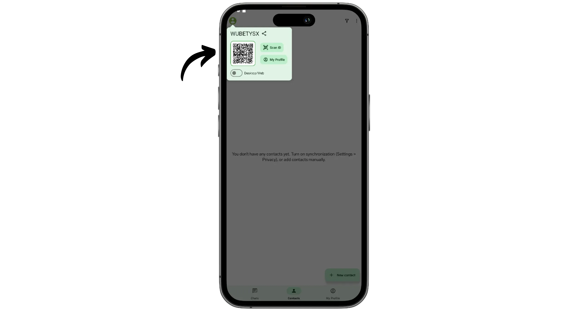

Täällä voit muokata profiiliasi: lisätä valokuvan, valita, kuka voi nähdä sen, tai tarkastella Threema-tunnuksiasi.

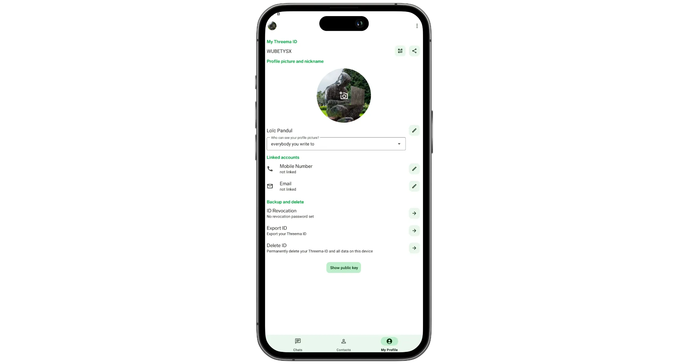

## PC-ohjelmiston synkronointi

Jos haluat käyttää keskusteluja tietokoneellasi, voit synkronoida Threema-tilisi siihen tarkoitetulla ohjelmistolla. Lataa ohjelmisto käyttöjärjestelmääsi varten [viralliselta verkkosivustolta](https://threema.ch/en/download).

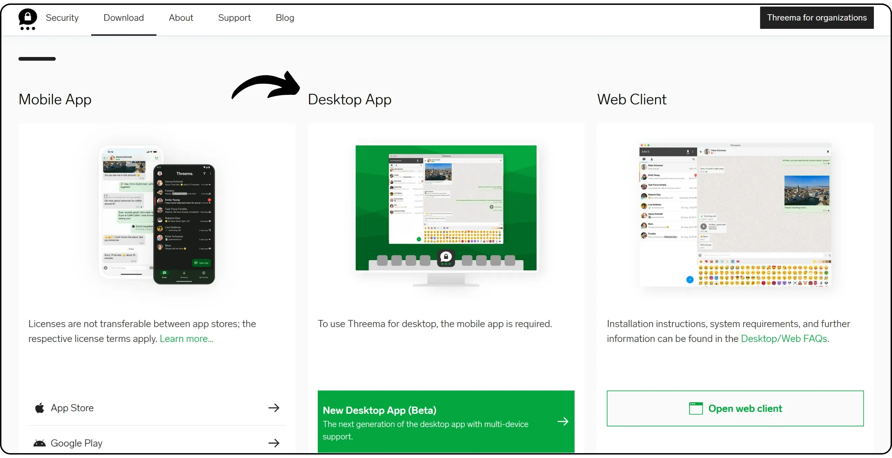

Napsauta puhelimessasi kolmea pistettä oikeassa yläkulmassa ja avaa sitten "*Threema 2.0 for Desktop*" -valikko.

Napsauta "*Lisää laite*" ja skannaa sitten puhelimellasi tietokoneen ohjelmiston näyttämä QR-koodi.

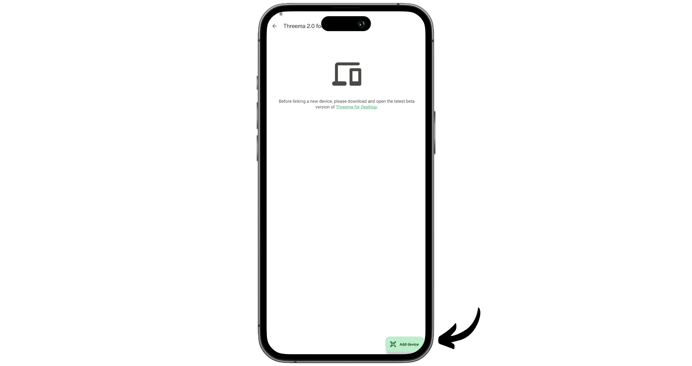

Vahvista synkronointi napsauttamalla ohjelmistossa näkyvää emoji-ryhmää.

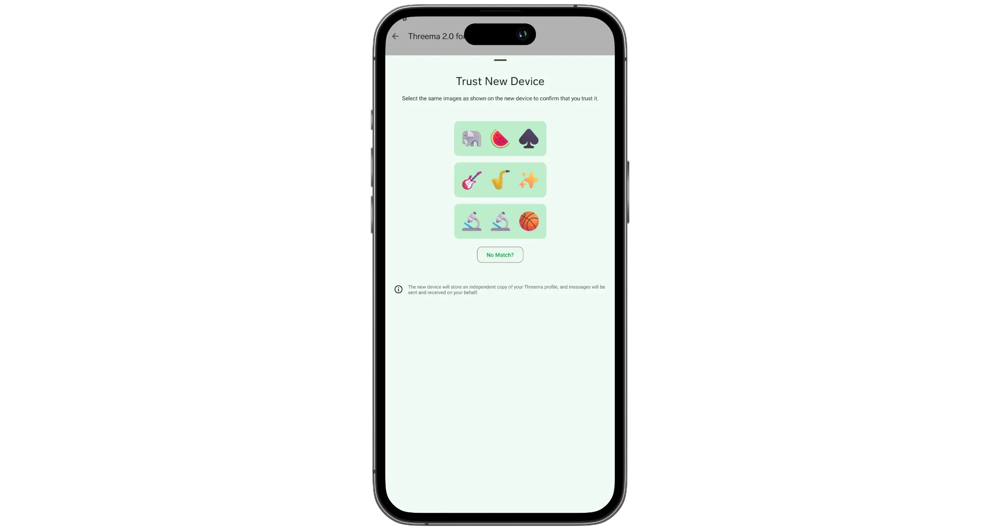

Kirjaudu tietokoneellasi sisään salasanallasi.

Mobiilisovelluksen lisäksi voit nyt käyttää Threema-tiliäsi suoraan tietokoneeltasi.

## Viestien lähettäminen Threeman avulla

Nyt kun kaikki on asetettu oikein, voit aloittaa viestinnän. Napsauta "*Start chat*" -painiketta.

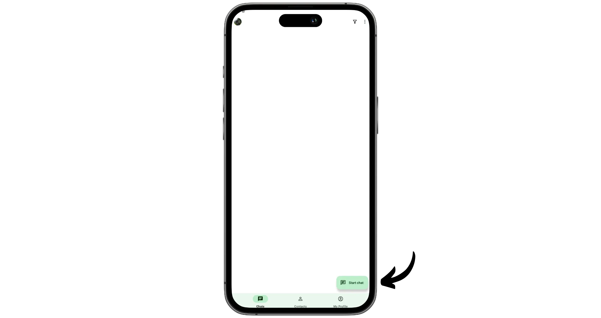

Valitse "*Uusi yhteystieto*".

Syötä tai skannaa kirjeenvaihtajasi "*Threema ID*".

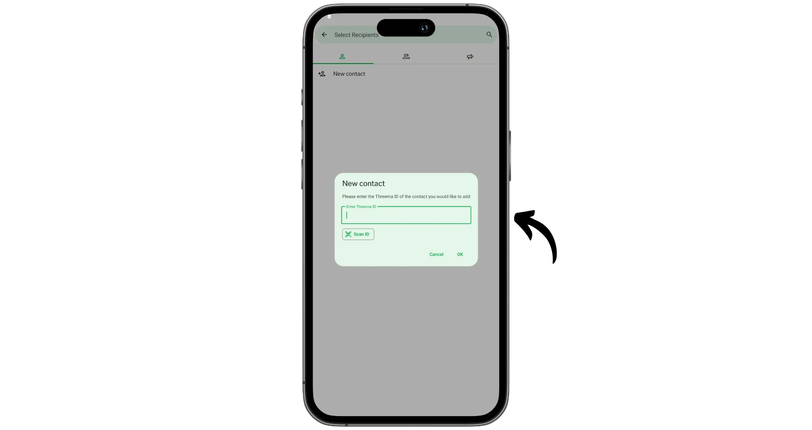

Napsauta viestikuvaketta.

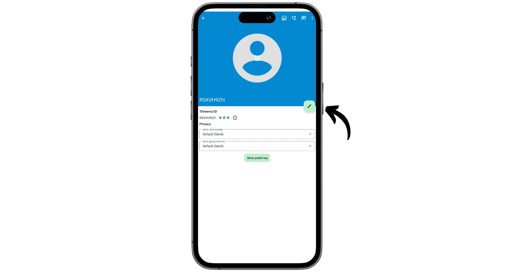

Lähetä ensimmäinen viesti kirjeenvaihtajallesi.

Kun kirjeenvaihtajasi vastaa, yhteys muodostetaan, ja näet hänen nimensä ja profiilikuvansa. Sen jälkeen voit lähettää Exchange-viestejä, multimediatiedostoja ja jopa soittaa puheluita.

Onneksi olkoon, olet nyt vauhdissa Threema-viestien käytössä, joka on loistava vaihtoehto WathsAppille! Jos löysit tämän opetusohjelman hyödylliseksi, olisin hyvin kiitollinen, jos jättäisit Green peukalon alle. Voit vapaasti jakaa tätä opetusohjelmaa sosiaalisissa verkostoissa. Kiitos paljon!

Suosittelen myös tätä toista opetusohjelmaa, jossa esittelen sinulle Proton Mailin, joka on paljon yksityisyydensuojaystävällisempi vaihtoehto Gmailille:

https://planb.network/tutorials/computer-security/communication/proton-mail-c3b010ce-254d-4546-b382-19ab9261c6a2