Thunderbird je e-mailová aplikace proslulá svou flexibilitou a širokou škálou funkcí. Nabízí elegantní, snadno ovladatelný a obzvláště intuitivní Interface. Je proslulý svou stabilitou a patří mezi nejoblíbenější e-mailové aplikace na trhu. Důležitá poznámka: je zcela zdarma.

## Proč používat Thunderbird?

- Zdarma a s otevřeným zdrojovým kódem**: na rozdíl od mnoha aplikací pro zasílání zpráv je Thunderbird zcela zdarma. Komunitu vývojářů však můžete podpořit zasláním příspěvku.
- Intuitivní Interface a snadné učení**: Konfigurace Thunderbirdu je z velké části jednoduchá, takže si s ní nemusíte dělat starosti.
- Tato schránka je vhodná pro několik typů e-mailů**: ať už se jedná o Gmail, Yahoo, Outlook nebo dokonce firemní e-maily spojené s názvem domény, je velmi univerzální.
- Více účtů**: Thunderbird umožňuje připojení k několika e-mailovým účtům najednou, což usnadňuje přístup ke všem zprávám.
- Vysoce výkonné funkce a škálovatelnost**: ve výchozím nastavení nabízí Thunderbird širokou škálu funkcí pro správu e-mailových účtů a kalendáře událostí. Umožňuje však také přidat další možnosti díky mnoha dostupným rozšířením.
- Multiplatformní**: Thunderbird je k dispozici na různých zařízeních (Android, Windows, Linux, macOS), takže máte snadný přístup ke svým e-mailům.
- Bezpečnost**: Thunderbird je vysoce bezpečná aplikace, která vám umožní využívat end-to-end šifrování založené na RSA nebo ECC (Elliptic Curve), které zaručí důvěrnost vašich dat.

## Stažení a instalace

### Stáhnout

Chcete-li nainstalovat program Thunderbird, musíte si jej stáhnout z [oficiální stránky](https://www.thunderbird.net/). Všimněte si, že aplikace je k dispozici pro různé operační systémy. Výchozí verzí však bude ta, která bude automaticky rozpoznána podle údajů poskytnutých vaším prohlížečem.

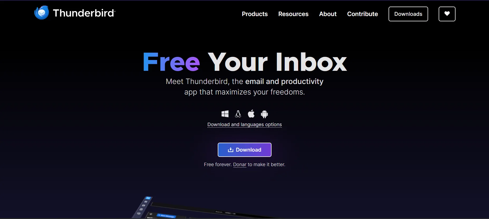

Chcete-li stáhnout konkrétní verzi Thunderbirdu, přejděte na stránku [tato stránka](https://www.thunderbird.net/an/thunderbird/all/). Vyberte jazyk, cílový operační systém a architekturu procesoru a spusťte stahování.

### Instalace

**Typ instalace:**

V systému Windows spusťte stažený spustitelný soubor a spusťte instalaci. Pokračujte kliknutím na tlačítko "Next". K dispozici jsou dvě možnosti:

- Standard**: umožňuje přímou instalaci bez předchozí konfigurace.
- Vlastní**: umožňuje zvolit instalační složku a vytvořit či nevytvořit zástupce na ploše.

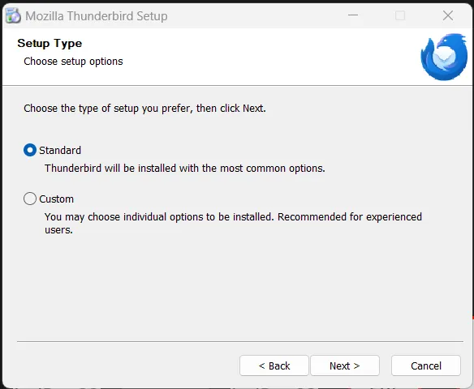

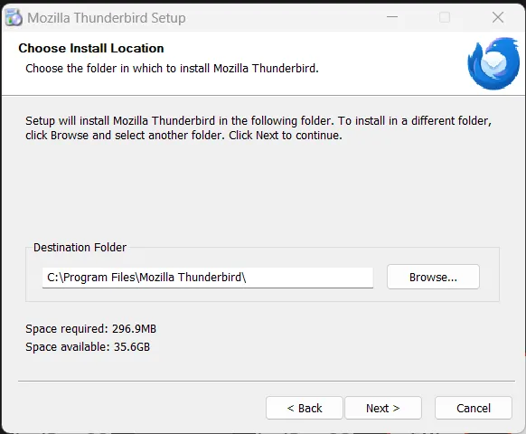

**Spuštění instalace:**

Instalaci zahájíte kliknutím na tlačítko "**Aktualizace**" nebo "**Instalace**" a počkejte na dokončení procesu.

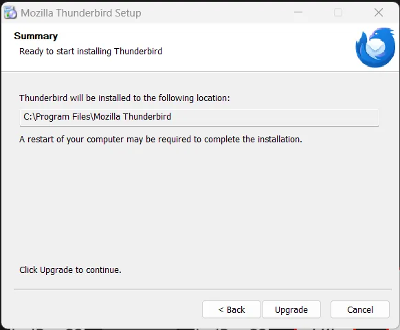

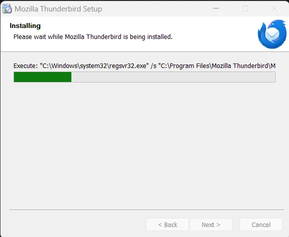

Počkejte na dokončení instalace a spusťte aplikaci

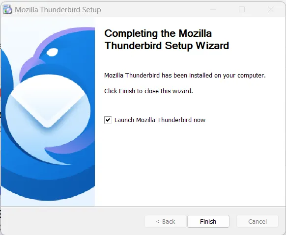

**Přihlášení k účtu:**

Thunderbird podporuje různé typy e-mailů. Chcete-li se připojit poprvé, přejděte na nastavení účtu a vyberte možnost E-mail.

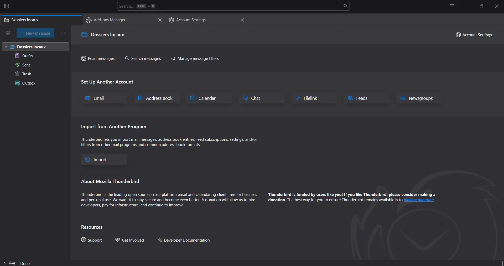

Otevře se okno, do kterého můžete zadat své údaje. Zadejte celé jméno, které se má zobrazit ve vaší poštovní schránce, a úplný e-mail Address a poté potvrďte.

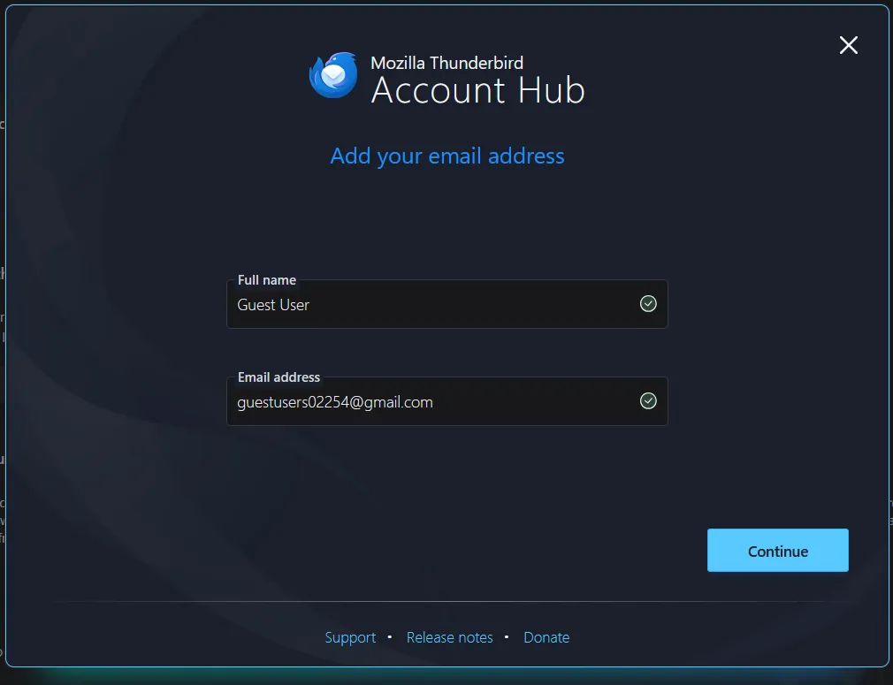

**Výběr protokolu a konfigurace připojení:**

Budete vyzváni k výběru protokolu zpráv, který nejlépe vyhovuje vašim potřebám. Ve většině případů postačí IMAP. U specifických konfigurací můžete nastavení upravit nebo jednoduše kliknout na tlačítko "Další".

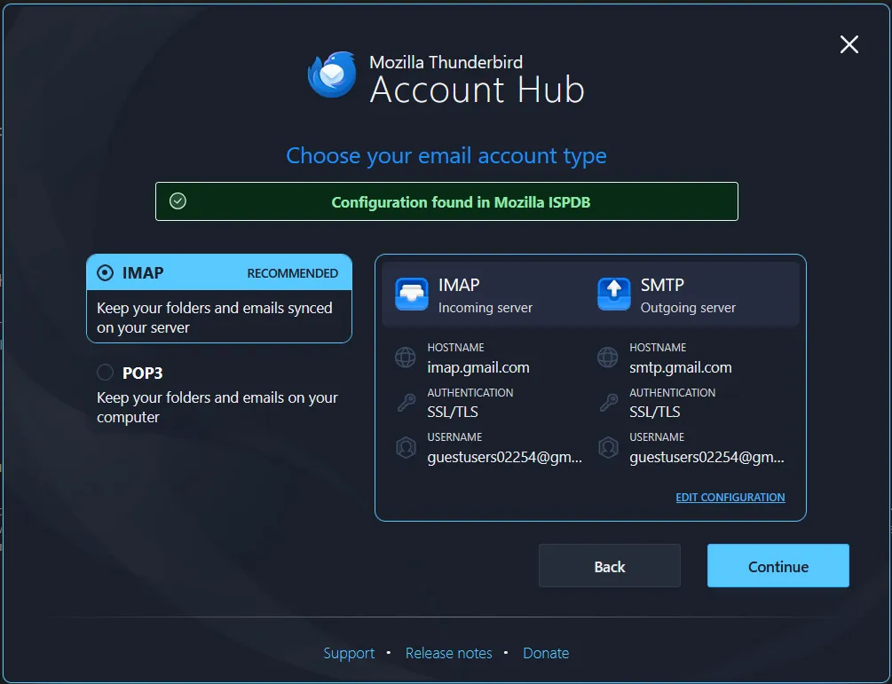

Otevře se nové okno, které vám umožní připojit se k poštovní schránce pomocí přihlašovacího jména a hesla. Autorizujte Thunderbird pro přístup k vašemu účtu a klikněte na tlačítko OK.

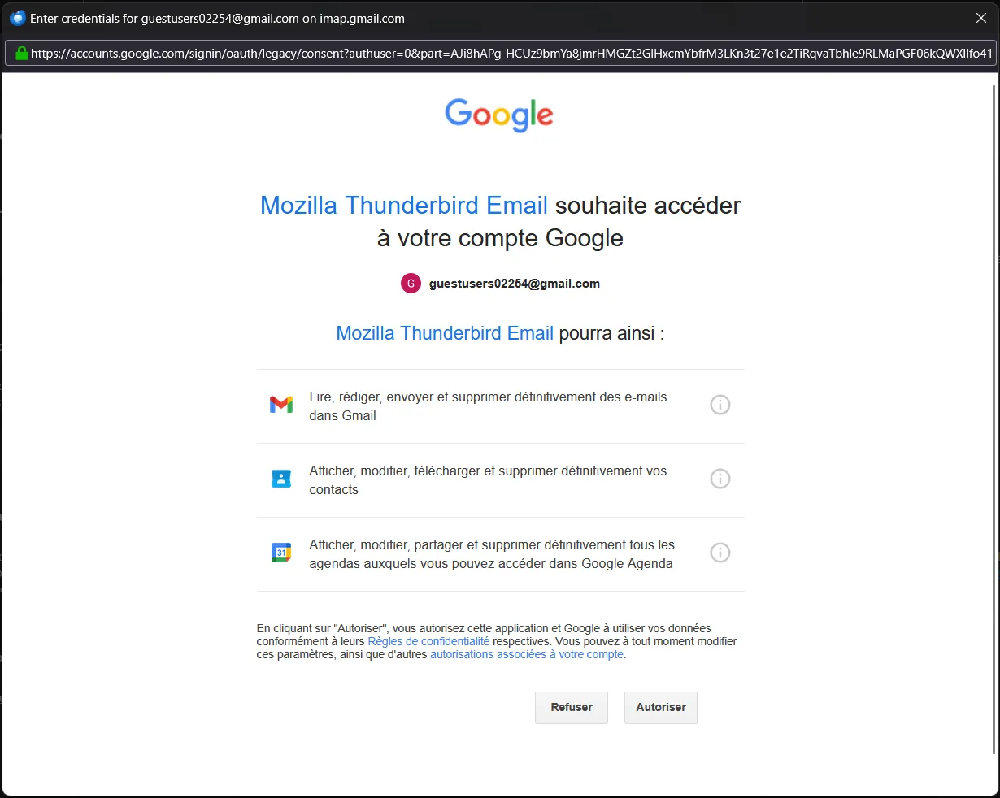

Můžete také aktivovat další služby, například knihu Address a kalendář, nebo jejich výběr před pokračováním zrušit.

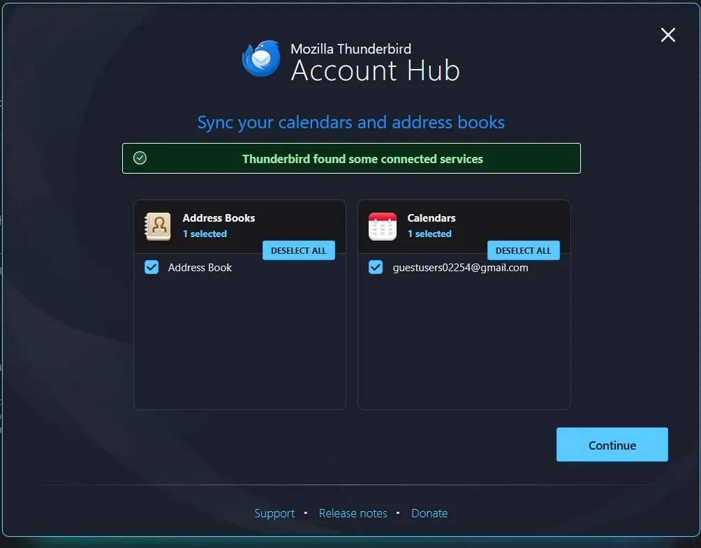

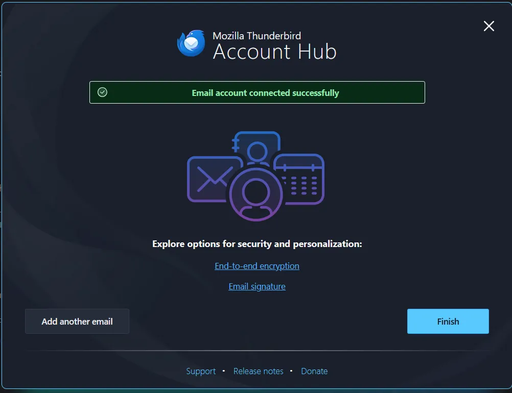

Po nastavení bude váš účet automaticky připraven a umožní vám přístup ke všem e-mailům. Zprávy budete moci snadno odesílat, přijímat, archivovat nebo mazat.

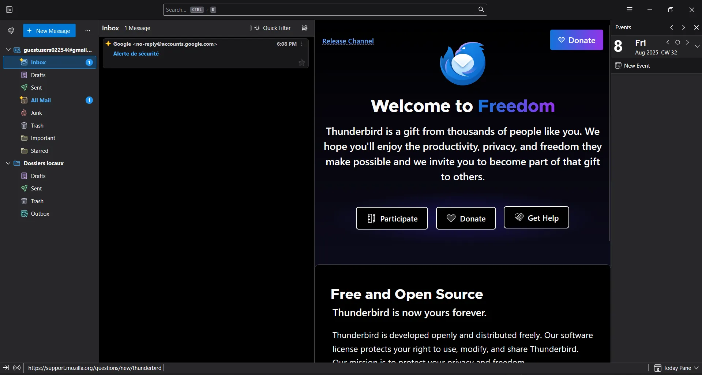

## Objevte Thunderbird

### Připojení k dalším účtům

Thunderbird se neomezuje pouze na správu e-mailů. Můžete také přidat chat, kanály a skupinové účty. Chcete-li přidat nový účet, přejděte do nastavení účtu, klikněte na "Nový účet" a vyberte požadovaný typ. Vyplňte požadované údaje a poté je potvrďte pro připojení.

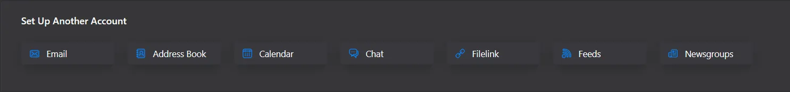

### Změna tématu

Thunderbird umožňuje změnit motiv Interface. Chcete-li tak učinit, přejděte do obecných nastavení e-mailu, klikněte na "Doplňky a motivy", poté přejděte do sekce "Motivy" a vyberte jeden z dostupných výchozích motivů.

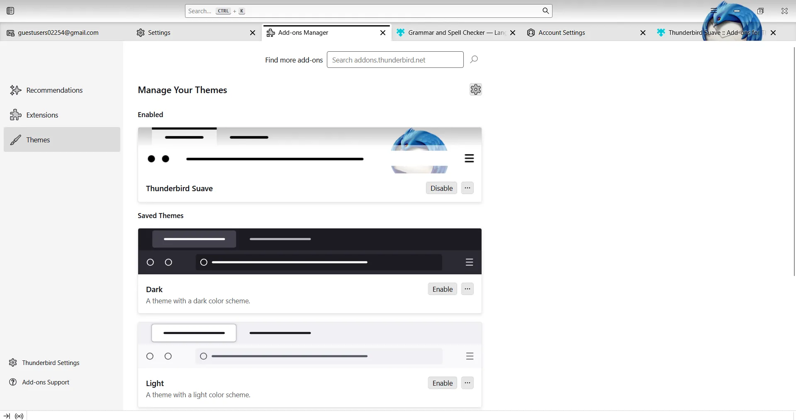

### Instalace dalších zásuvných modulů nebo témat

Můžete si stáhnout další motivy nebo pluginy a přidat do Thunderbirdu nové funkce. Za tímto účelem otevřete oficiální obchod s rozšířeními na stránce "Další moduly". Pomocí vyhledávacího pole vyhledejte konkrétní zásuvný modul nebo téma.

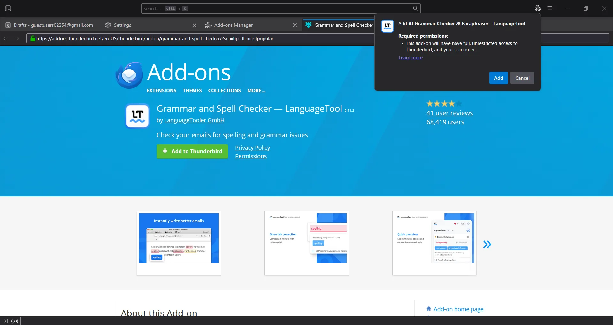

### Konfigurace koncového šifrování

Koncové šifrování umožňuje zaručit důvěrnost e-mailů a chránit je před zachycením. Chcete-li jej nakonfigurovat, přejděte do nastavení svého účtu, přejděte do části "End-to-end encryption" a klikněte na "Add key". Pokud již klíč máte, můžete jej importovat; pokud ne, vytvořte si nový. V tomto případě nastavte datum platnosti (doporučuje se maximálně jeden rok), vyberte typ a velikost klíče a poté jej potvrďte.

Váš účet Thunderbird bude nakonfigurován podle vašich potřeb s vysokou úrovní zabezpečení pro optimální používání.

Thunderbird je zkrátka kompletní, bezplatné a vysoce přizpůsobitelné řešení pro zasílání zpráv, které vyhovuje potřebám domácích uživatelů i profesionálů. Jeho jednoduchost, kompatibilita s širokou škálou služeb, pokročilé funkce a vysoká úroveň zabezpečení z něj činí ideální volbu pro efektivní správu komunikace. Ať už hledáte spolehlivý nástroj pro centralizaci více účtů, zabezpečení výměny zpráv nebo si prostě jen užíváte příjemné prostředí Interface, Thunderbird splní vaše očekávání a zároveň vám nabídne svobodu a flexibilitu, kterou přináší svobodný software.

Objevte náš návod na Proton Mail, řešení pro šifrované zasílání zpráv end-to-end.

https://planb.network/tutorials/computer-security/communication/proton-mail-c3b010ce-254d-4546-b382-19ab9261c6a2