端對端加密是 WhatsApp 和 Telegram 等許多訊息應用程式所提供的服務。這裡的加密是指在寄件者傳送訊息之前，先將訊息以密碼鎖加密，只有收件者才有鑰匙。今天我們要去發現一個完全去中心化的端對端加密訊息應用程式，它的原理類似 Blockchain，提供沒有中介的安全端對端加密通訊：Tox Chat。

| Application          | E2EE 1:1       | E2EE groupes   | Inscription anonyme | Licence client open-source | Licence serveur open-source | Serveur décentralisé | Année de création |
| -------------------- | -------------- | -------------- | ------------------- | -------------------------- | --------------------------- | -------------------- | ----------------- |
| WhatsApp             | ✅              | ✅              | ❌                   | ❌                          | ❌                           | ❌                    | 2009              |
| WeChat               | ❌              | ❌              | ❌                   | ❌                          | ❌                           | ❌                    | 2011              |
| Facebook Messenger   | ✅              | 🟡 (optionnel) | ❌                   | ❌                          | ❌                           | ❌                    | 2011              |
| Telegram             | 🟡 (optionnel) | ❌              | 🟡                  | ✅                          | ❌                           | ❌                    | 2013              |
| LINE                 | ✅              | ✅              | ❌                   | ❌                          | ❌                           | ❌                    | 2011              |
| Signal               | ✅              | ✅              | ❌                   | ✅                          | ✅                           | ❌                    | 2014              |
| Threema              | ✅              | ✅              | ✅                   | ✅                          | ❌                           | ❌                    | 2012              |
| Element (Matrix)     | ✅              | ✅              | ✅                   | ✅                          | ✅                           | 🟡 (fédéré)          | 2016              |
| Delta Chat           | ✅              | ✅              | ✅                   | ✅                          | N/A                         | 🟡 (via email)       | 2017              |
| Conversations (XMPP) | ✅              | ✅              | ✅                   | ✅                          | ✅                           | 🟡 (fédéré)          | 2014              |
| Session              | ✅              | ✅              | ✅                   | ✅                          | ✅                           | ✅                    | 2020              |
| SimpleX              | ✅              | ✅              | ✅                   | ✅                          | ✅                           | ✅                    | 2021              |
| Olvid                | ✅              | ✅              | ✅                   | ✅                          | ❌                           | 🟡(pas d'annuaire)   | 2019              |
| Keet                 | ✅              | ✅              | ✅                   | ❌                          | N/A                         | ✅                    | 2022              |
| Jami                 | ✅              | ✅              | ✅                   | ✅                          | N/A                         | ✅                    | 2005              |
| Briar                | ✅              | ✅              | ✅                   | ✅                          | N/A                         | ✅                    | 2018              |
| **Tox**              | ✅              | ✅              | ✅                   | ✅                          | N/A                         | ✅                    | 2013              |

*E2EE = 端對端加密 *

## Tox 是什麼？

Tox 是一個免費 (開放原始碼) 的分散式通訊協定，使用 * 網路與密碼學函式庫* (NaCl) 技術加上加密演算法組合來確保使用者的安全性與機密性。Tox 可讓您安全、分散且無中介地與朋友 Exchange 文字訊息、撥打音訊及視訊通話、分享檔案及分享螢幕。

Tox 通訊協定所使用的技術與區塊鏈等點對點網路類似，有利於協定基礎架構的去中心化。與社交網路和端對端加密訊息應用程式不同，Tox Chat 應用程式是建構在一個沒有中央伺服器的分散式通訊協定上。所有使用者都在無中介、可抵制審查的點對點網路中進行通訊。為了進行通訊，每個使用者都會被一個獨特的 ID (ToxID) 識別，這個 ID 來自於他或她的公開金鑰，並儲存在分散式的 Hash 表中。

## 加入 Tox

您可以透過從 [Tox Chat 網站](https://tox.chat) 下載的即時通訊用戶端來使用 Tox 通訊協定。

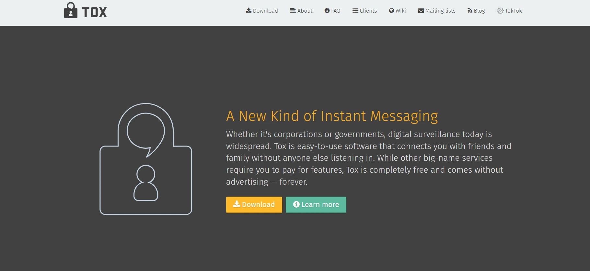

根據您的作業系統，您可以下載並安裝與 .NET 相容的 Tox 用戶端：

- aTox：[aTox](https://github.com/evilcorpltd/aTox)，以 Kotlin 寫成的 Tox 用戶端，僅在 Android 上提供

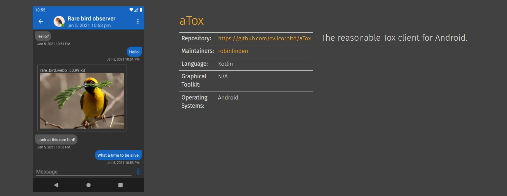

- qTox：來自 [開放原始碼](https://github.com/TokTok/qTox) 基於 Qt Framework (C++) 的 Tox 客戶端，可在 Windows、Linux、MacOs 上使用。

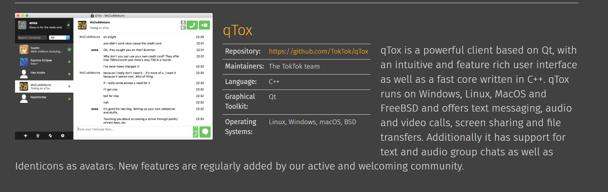

- Toxic：[Toxic](https://github.com/JFreegman/toxic) 是以 C 寫成的 Tox 用戶端，可在具有命令列介面的系統上執行。

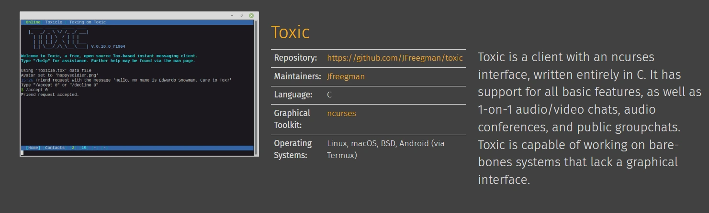

在本教程中，我們將使用 Windows 上的 qTox 客戶端和 aTox 進行通訊。

## 開始使用 qTox

下載完成後，安裝 Tox 客戶端並建立您的個人資料。

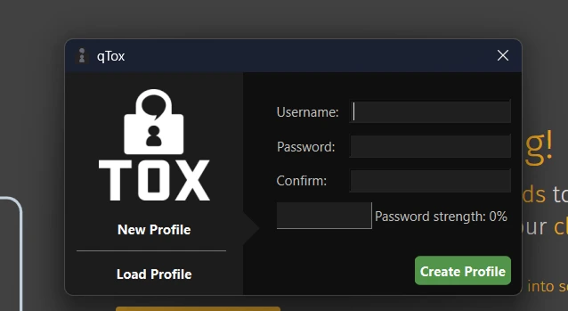

恭喜您，您剛剛加入了 Tox 協議。在 qTox 軟體上，點擊您的使用者名稱即可找到您的個人資料資訊。

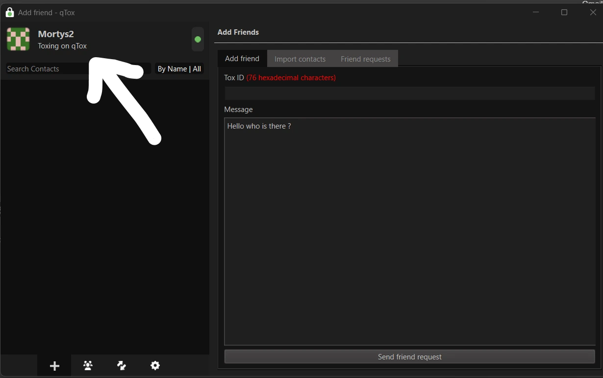

特別是，您會找到您的 Tox ID，您可以將其儲存為 QR 代碼，並與想要與您聯繫的人分享。

匯出您的 Tox 個人資料檔案，以便備份您的個人資料和聯絡人資訊，供您還原時使用。按一下 ** 匯出** 按鈕，然後選擇備份檔案的路徑。

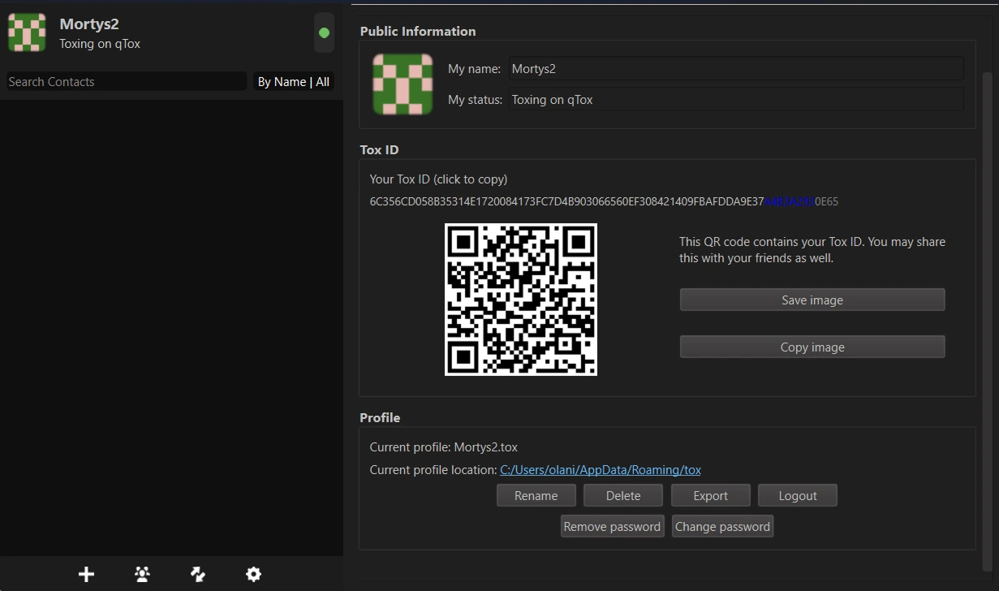

從 **More** 功能表，新增朋友、匯入聯絡人並管理您收到的朋友請求。

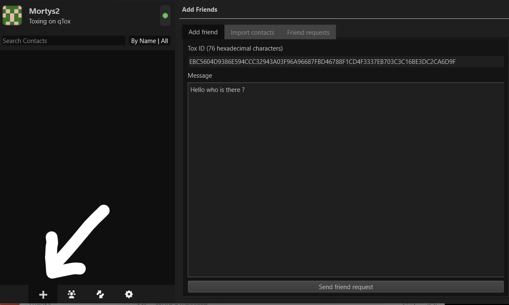

例如，您可以透過這個 Tox ID 聯絡我：EBC5604D9386E594CCC32943A03F96A96687FBD46788F1CD4F3337EB703C3C16BE3DC2CA6D9F

發送好友請求後，收件人必須先接受或拒絕您的請求，您才能與他們聯絡。

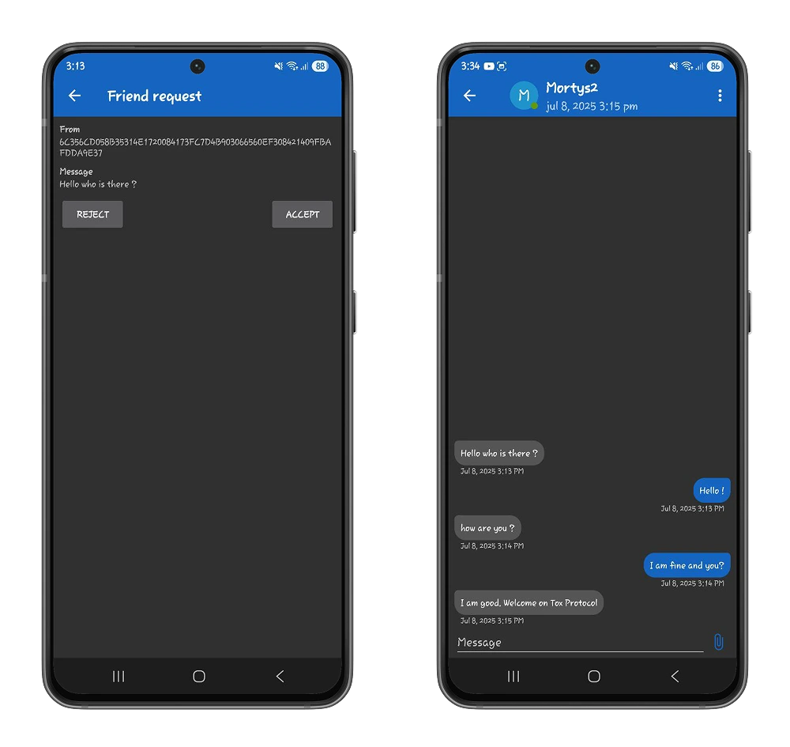

您的 Tox 客戶端包含即時通訊應用程式提供的所有選項：

- 視訊通話

- 語音通話

- 檔案分享

- 表情符號

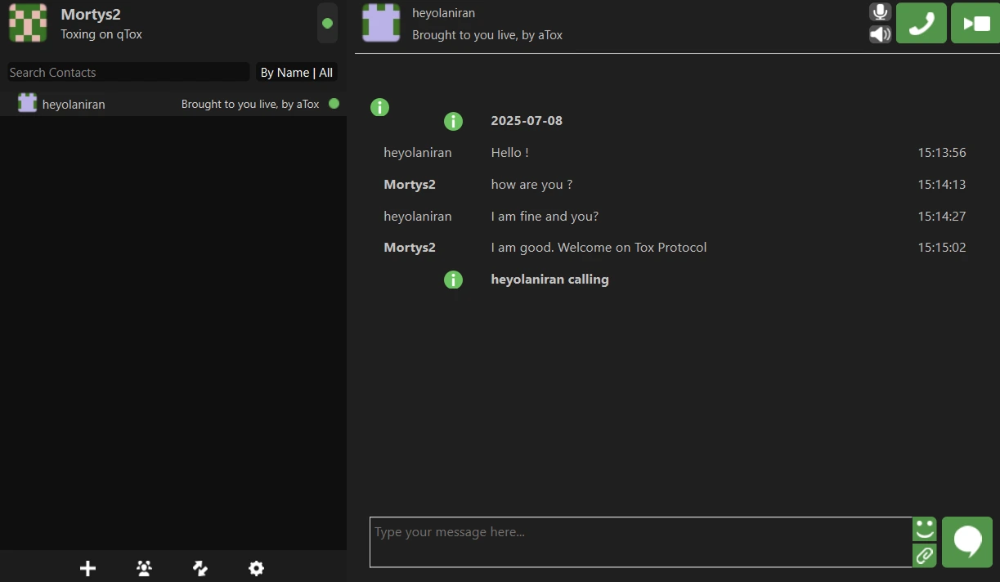

### 同儕團體

您的 Tox 用戶端還能讓您以完全分散的方式與一群人溝通：這些人稱為會議。在**群組**選單中，建立一個新的會議，或查看您收到的會議邀請清單。

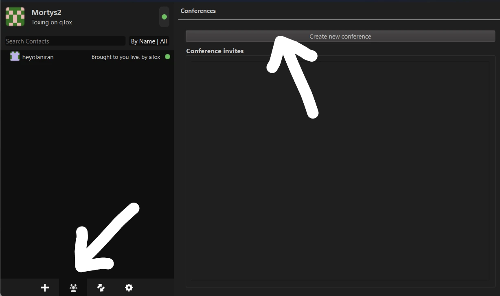

建立會議後，您可以在 Tox 用戶端上邀請朋友加入會議。在您的朋友清單中，用滑鼠右鍵按一下您想要邀請的朋友的使用者名稱。按一下 ** 邀請參加會議** 選項，然後選擇您建立的會議名稱。您也可以透過**建立新會議**選項隱式建立會議來邀請朋友。

⚠️ Tox 客戶端仍在開發中，因此您在與軟體互動時可能會遇到錯誤。Tox Android 用戶端 (aTox) 尚未提供會議和視訊通話功能。

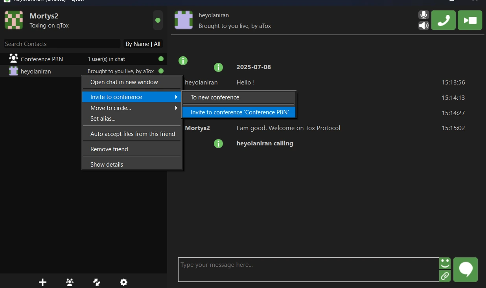

### 檔案傳輸

在 ** 檔案傳輸** 功能表中，您可以找到您傳送和從連絡人接收檔案的歷史記錄。

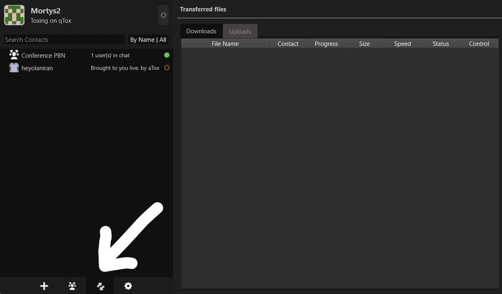

您也可以針對每次討論自訂檔案分享設定。在收件人的使用者名稱上按一下滑鼠右鍵，然後選擇「顯示更多詳細資訊」。

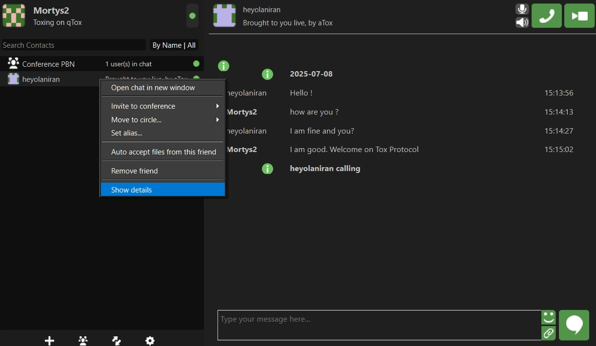

從 Interface 詳細資訊中，您可以管理授予收件人的 .Interface 授權：

- 自動接受會議邀請。

- 自動接受檔案。

- 討論檔的備份路徑。

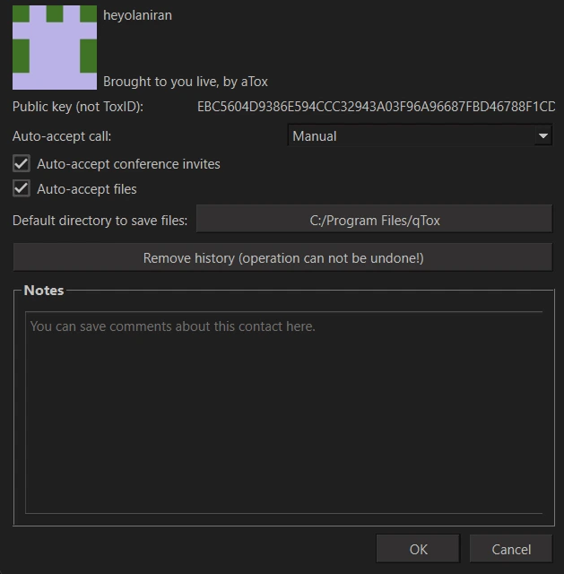

### 更多參數

在 ** 設定** 功能表中，您可以自訂 Tox 客戶端的設定。

- 在**一般**部分，變更 Tox 用戶端的基本語言、定義檔案備份路徑和自動接受的最大檔案大小。

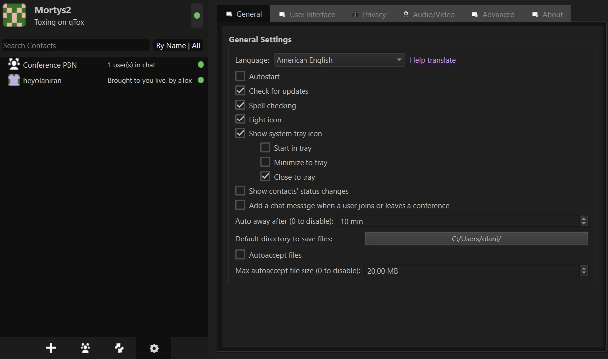

- 在**Interface 使用者**部分，修改訊息的字型和大小。您也可以變更 Tox 用戶端的主題。

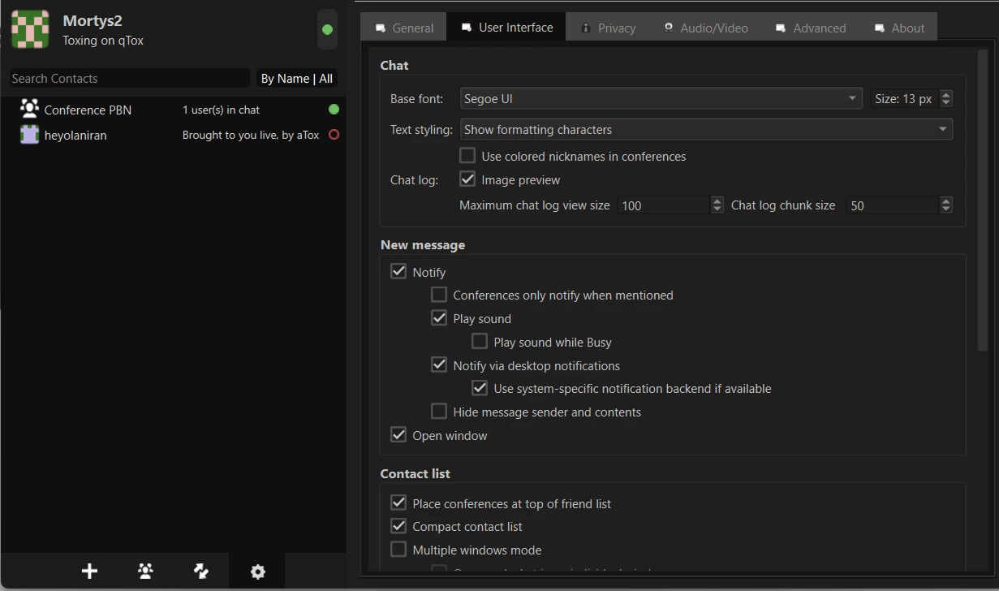

- 在**隱私**標籤中，您可以取消勾選「保留聊天記錄」方塊來定義短暫訊息。當您發現被好友請求濫發訊息時，也可以按一下「generate 隨機 NoSpam 代碼」按鈕來變更您的 NoSpam 代碼。

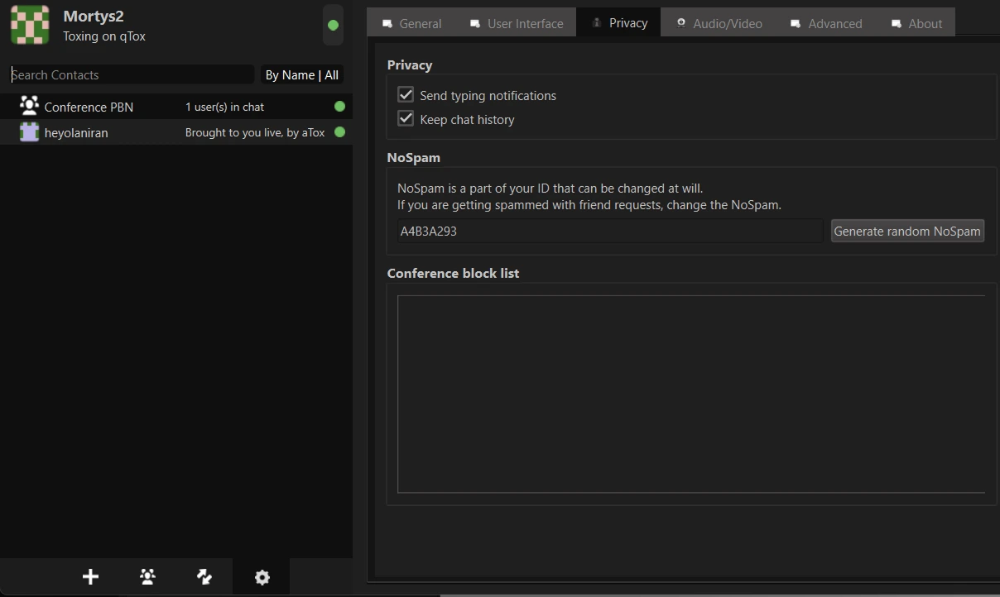

### 如何保證 Tox 的機密性？

Tox 通訊協定使用分散式 Hash 表來建立分散式節點網路。每個 Tox 用戶端都是 DHT 網路的一部分，並儲存其他節點的資訊。就 Tox 而言，DHT 將 IP 位址儲存為與 Tox 公鑰 (Tox ID) 相關的值。這使得搜尋 Tox Client 裝置變得容易，無須查詢中央伺服器。

試想一下，我們寫信給使用者 `EBC5604D9386E594CCC32943A03F96A96687FBD46788F1CD4F3337EB703C16BE3DC2CA6D9F`，我們將其命名為**使用者 B**。您的 Tox 用戶端會在 Hash Distributed 表中找到此識別碼，並擷取相關的 IP Address。一旦找到 IP Address，您的 Tox 客戶端就會與我們的 ** 使用者 B** 的電腦建立直接的加密通訊通道，或使用其他節點作為中繼，以連結到 ** 使用者 B**。加密演算法可確保無論使用何種通訊管道，只有**使用者 B** 才能讀取您的訊息內容。

如果您喜歡發現 Tox，並能了解它對強化您的隱私有多大用處，請隨時為本教程豎起大拇指。我們也向您推薦我們的 Simple Login 教學，這是一個可以讓您匿名收發電子郵件的工具。

https://planb.network/tutorials/computer-security/communication/simple-login-c17a10d6-8f84-4f97-8d50-7a83428d0f41