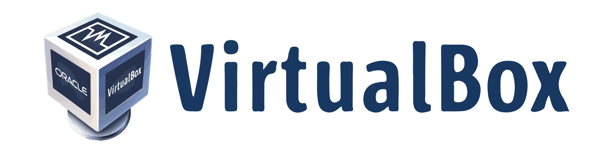


___


*Bu eğitim Florian Burnel tarafından [IT-Connect](https://www.it-connect.fr/) adresinde yayınlanan orijinal içeriğe dayanmaktadır. Lisans [CC BY-NC 4.0](https://creativecommons.org/licenses/by-nc/4.0/). Orijinal metinde değişiklikler yapılmış olabilir.*


___


## I. Sunum


Bu eğitimde, Windows 10, Windows 11, Windows Server veya bir Linux dağıtımı (Debian, Ubuntu, Kali Linux, vb.) çalıştırmak üzere sanal makineler oluşturmak için Windows 11'e VirtualBox'ı nasıl kuracağımızı öğreneceğiz.


VirtualBox'a giriş niteliğindeki bu eğitim, Oracle tarafından geliştirilen ve tamamen ücretsiz olan bu açık kaynak sanallaştırma çözümünü kullanmaya başlamanıza yardımcı olacaktır. Daha sonra, sizi konunun derinliklerine götürecek başka eğitimler de yayınlanacaktır.


İster bir projenin parçası olarak test amacıyla ister BT çalışmalarınız sırasında olsun, bir iş istasyonunu sanallaştırmak söz konusu olduğunda VirtualBox'ın iyi bir çözüm olduğu açıktır. Ayrıca Windows 10 ve Windows 11'e (Windows Server'ın yanı sıra) entegre edilmiş olan Hyper-V ve VMware Workstation (ücretli) / VMware Workstation Player (kişisel kullanım için ücretsiz) gibi diğer çözümlere de bir alternatiftir.


Benim yapılandırmam: **VirtualBox'ı yükleyeceğim bir Windows 11 iş istasyonu**, ancak VirtualBox'ı Windows 10'a (veya daha eski bir sürüme) ve Linux'a yükleyebilirsiniz. Sanal makineler söz konusu olduğunda VirtualBox, Windows (örneğin Windows 10, Windows 11, Windows Server 2022, vb.), Linux (Debian, Rocky Linux, Ubuntu, Fedora, vb.), BSD (PfSense) ve macOS dahil olmak üzere çok çeşitli sistemleri destekler.


## II. Windows 11 için VirtualBox'ı indirin


Bir Windows makinesine kurulum için VirtualBox'ı indirmek için tek bir iyi Address vardır: [resmi VirtualBox web sitesi] (https://www.virtualbox.org/wiki/Downloads) "**Downloads**" bölümünde. Boyutu 100 MB'ın biraz üzerinde olan bu çalıştırılabilir dosyayı indirmeye başlamak için "Windows hosts" seçeneğine tıklamanız yeterlidir.


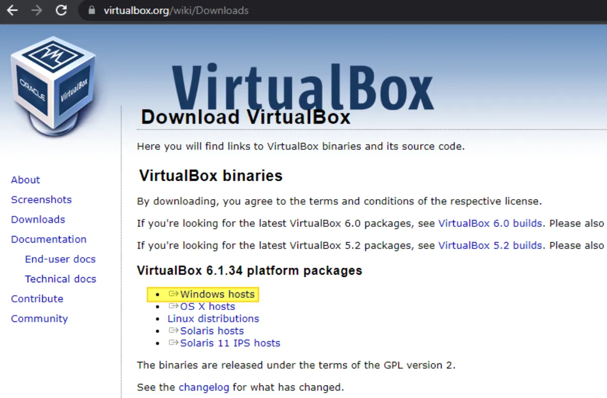


## III. Windows 11 üzerinde VirtualBox Kurulumu


### A. VirtualBox'ı Yükleme


VirtualBox** kurulumu basittir ve süreç Windows'un tüm sürümleri için aynıdır. Yeni indirdiğiniz VirtualBox çalıştırılabilir dosyasını başlatarak başlayın, ardından "**Sonraki**" üzerine tıklayın.


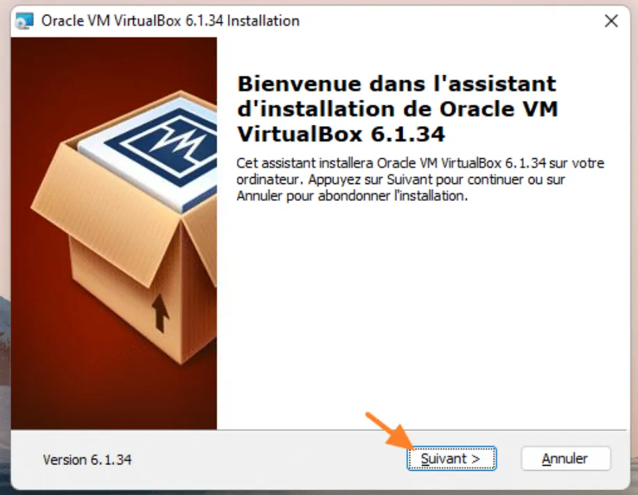


Bu kurulum özelleştirilebilir, ancak tüm özellikleri yüklemenizi tavsiye ederim: varsayılan seçimde olduğu gibi. Aşağıdaki resimde, çeşitli Elements'leri görebilirsiniz:


- VirtualBox'ın USB aygıtlarını desteklemesini sağlamak için VirtualBox USB Desteği**
- Ağ desteğini "Köprü" modunda entegre etmek için VirtualBox Köprülü Ağ** (sanal makine doğrudan yerel ağınıza bağlanabilir)
- VirtualBox Host-Only Network** "Host-Only" modunda ağ desteğini entegre etmek için (sanal makine bu modda yalnızca Windows 11 fiziksel ana bilgisayarınızla ve diğer sanal makinelerle iletişim kurabilir)


Devam etmek için "**Sonraki**" düğmesine tıklayın.


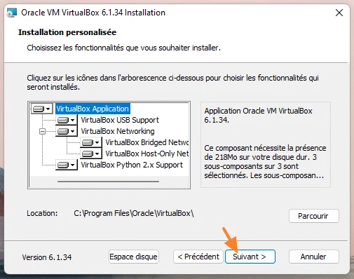


VirtualBox, Köprü modu da dahil olmak üzere farklı ağ türlerini desteklemek için ağ değişikliklerini gerçekleştirirken **Windows 11 makinenizde ağın bir süreliğine kesintiye uğrayacağını** aklınızda bulundurarak "**Evet**" üzerine tıklayın.


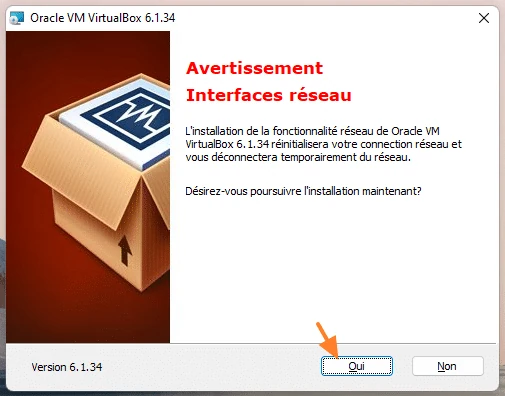


Onayladıktan sonra yükleme başlayacaktır... Ve bir "**Bu cihaz yazılımını yüklemek istiyor musunuz? "** bildirimi görünecektir. "**Always trust software from Oracle Corporation**" seçeneğini işaretleyin ve "**Install**"a tıklayın. VirtualBox'ın aslında bilgisayarınıza birkaç sürücü yüklemesi gerekiyor.


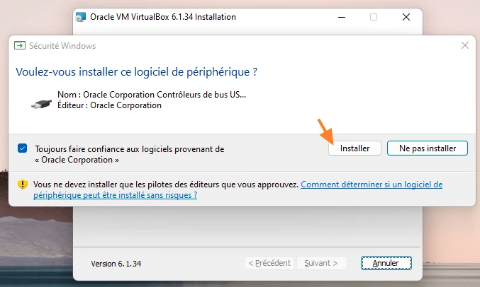


Kurulum şimdi tamamlandı! "**Kurulumdan sonra Oracle VM VirtualBox 6.1.34'ü başlat**" seçeneğini işaretleyiniz ve yazılımı başlatmak için "**Tıkla**" butonuna tıklayınız.


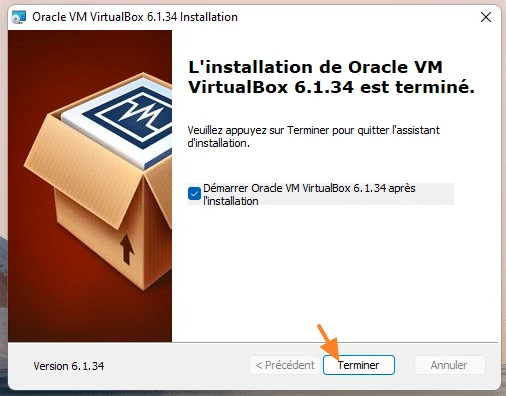


### B. Uzantı paketini ekleyin


Yine de resmi VirtualBox sitesinde (önceki bağlantıya bakın), "**Tüm desteklenen platformlar**" bağlantısına tıklayarak "**VirtualBox 6.1.34 Oracle VM VirtualBox Extension Pack**" bölümünden erişebileceğiniz resmi bir uzantı paketi indirebilirsiniz. Bu paket VirtualBox'a ek işlevler eklemenizi sağlayacaktır: eklemek zorunlu değildir, ancak yararlı olabilir! Örneğin, VM'lerde USB 3.0 desteği, web kamerası desteği ve disk şifreleme içerir.


VirtualBox'ı açın, menüden "**Dosya**" ve ardından "**Ayarlar**" üzerine tıklayın.


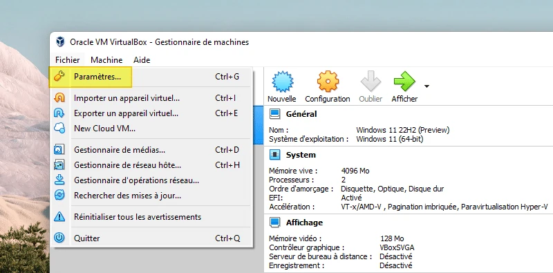


Sol taraftaki "**Extensions**" (1) üzerine tıklayın, ardından sağ taraftaki "**+**" düğmesine (2) tıklayarak yeni indirdiğiniz VirtualBox** uzantı paketini **yükleyin (3).


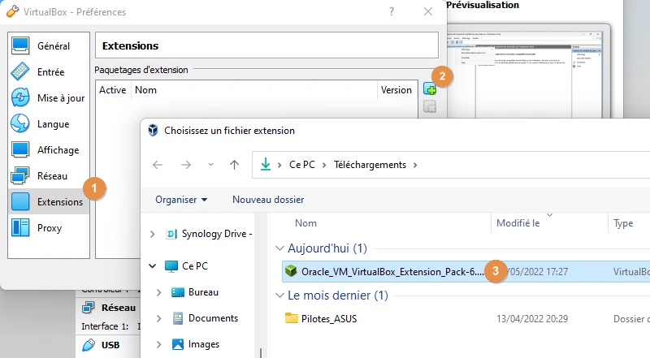


"**Kurulum**" düğmesine tıklayarak onaylayın.


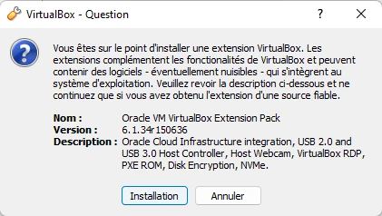


"**Tamam**" üzerine tıklayın: resmi uzantı paketi artık VirtualBox örneğinize yüklenmiştir!


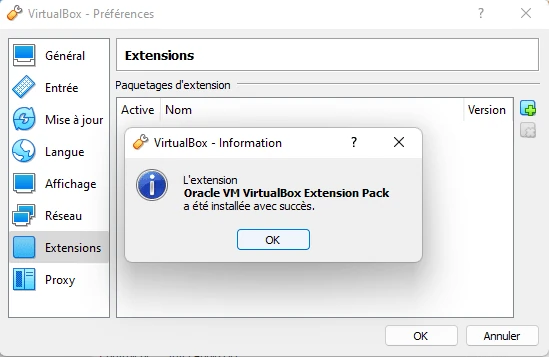


İlk sanal makinemizi oluşturmaya geçelim.


## IV. İlk VirtualBox Sanal Makinenizi Oluşturma


VirtualBox üzerinde yeni bir sanal makine oluşturmak için, VM oluşturma sihirbazını başlatmak üzere "**Yeni**" düğmesine tıklamanız yeterlidir. VirtualBox'ı ilk kez başlattığınız için, size Interface ve diğer düğmeler hakkında birkaç ayrıntı daha vermek istiyorum.


- Ayarlar**: genel VirtualBox yapılandırması (varsayılan VM klasörü, güncelleme yönetimi, dil, NAT ağları, uzantılar, vb.)
- İçe Aktar**: OVF biçiminde bir sanal cihazı içe aktarın
- Dışa Aktar**: sanal bir cihaz oluşturmak için mevcut bir sanal makineyi OVF formatında dışa aktarın
- Ekle**: VirtualBox envanterinize standart VirtualBox formatında (.vbox) veya XML formatında mevcut bir sanal makine ekleyin


Sol taraftaki "**Araçlar**" bölümü, özellikle sanal ağı yönetmek ve aynı zamanda VM depolama alanını yönetmek için **gelişmiş işlevlere erişim sağlar**. "**Araçlar**" girişi altında, sanal makineleriniz daha sonra eklenecektir.


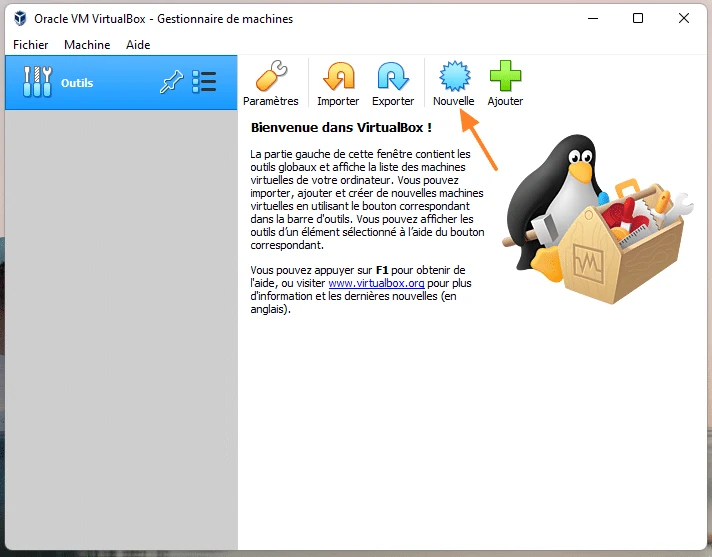


### A. Sanal makine oluşturma süreci


**Bir hatırlatma olarak, VirtualBox Windows, Linux ve BSD dahil olmak üzere çok sayıda işletim sistemini desteklemektedir. Bu örnekte, Windows 11 için bir sanal makine oluşturacağım. Birkaç alanın doldurulması gerekiyor:


- Name**: sanal makine adı (bu VirtualBox'ta görüntülenecek addır)
- Makine klasörü**: sanal makinenin saklanacağı yer, bu konumda sanal makinenin adıyla bir alt klasör oluşturulacağını bilerek
- Tür**: hangi işletim sistemini yüklemek istediğinize bağlı olarak işletim sisteminin türü
- Sürüm**: yüklemek istediğiniz sistemin sürümü, bu durumda Windows 11, yani "**Windows11_64**"


Devam etmek için "**Sonraki**" düğmesine tıklayın.


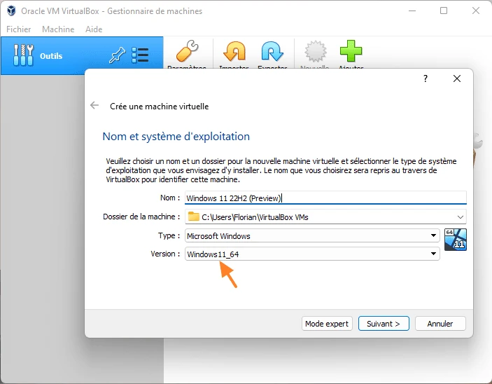


Bir önceki adımda seçtiğiniz işletim sistemine bağlı olarak, **VirtualBox sanal makineye tahsis edilecek kaynaklar konusunda önerilerde bulunur**. Burada, sanal makineye ayırmak istediğiniz RAM'den bahsediyoruz. 4 GB olduğunu varsayalım, çünkü Windows 11 için gerçekten de bu önerilmektedir, ancak kaynaklarınız yetersizse bunun yerine 2 GB belirtin. **Devam et


**Not**: sanal makineye tahsis edilen kaynaklar daha sonra değiştirilebilir.


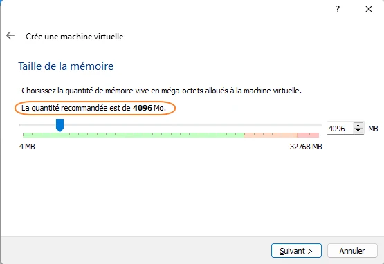


Sanal Hard diski söz konusu olduğunda, sıfırdan başlıyoruz, bu nedenle VM'nin işletim sistemini kurmak ve verileri depolamak için depolama alanına sahip olması için "**Sanal Hard diskini şimdi oluştur**" seçeneğini seçmemiz gerekiyor. "**Oluştur**" üzerine tıklayın.


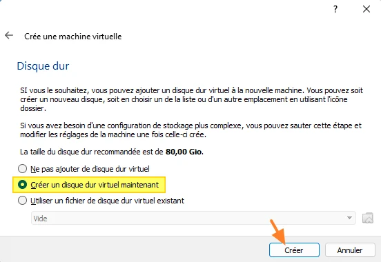


VirtualBox, sanal Hard diskleri için üç farklı formatı destekler; bu, VMware ve Hyper-V gibi diğer çözümlerle karşılaştırıldığında önemli bir farktır. Aralarından seçim yapabileceğiniz üç format vardır:


- VDI**, resmi VirtualBox formatı
- VHD**, resmi Hyper-V formatıdır, ancak yeni VHDX formatı bu günlerde daha sık kullanılmaktadır
- VMDX** hem VMware Workstation hem de VMware ESXi için resmi VMware formatıdır


Yalnızca bu VirtualBox örneğinde kullanılacak bir sanal makine oluşturmak için "**VDI**" seçeneğini seçin. Öte yandan, sanal Hard diski daha sonraki bir tarihte bir Hyper-V ana bilgisayarına eklenecekse, dönüştürmek zorunda kalmamak için VHD biçimiyle başlamak iyi bir fikir olabilir. "**Sonraki**" üzerine tıklayın.


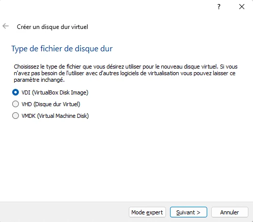


**Sanal diskin boyutu dinamik ya da sabit olabilir**. Dinamik olduğunda, **sanal diski temsil eden dosya (burada bir .vdi dosyası) maksimum boyutuna ulaşana kadar diske veri yazıldıkça büyür**, ancak veri silindiğinde küçülmez. Tersine, sabit boyutta olduğunda, **toplam depolama alanı hemen tahsis edilir (ve bu nedenle ayrılır)**, bu da biraz daha yüksek performans sağlar, ancak sanal disk ilk oluşturulduğunda daha uzun sürer.


Şahsen, VirtualBox ile test sanal makineleri için "**Dynamically allocated**" modunun yeterli olduğunu düşünüyorum.


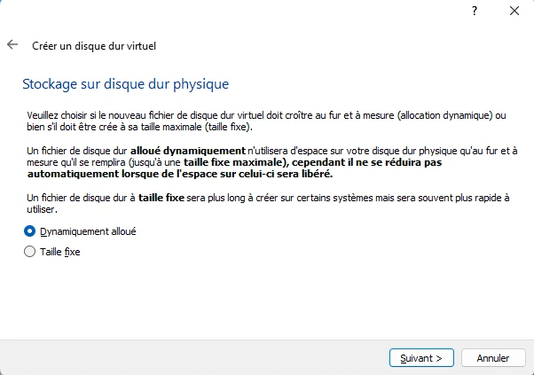


**Bir sonraki adım, diskin varsayılan olarak VM dizininde depolanacağını (bu aşamada değiştirilebilir) akılda tutarak sanal diskin boyutunu** belirtmektir. Windows 11 gereksinimlerine uymak için 64 GB'lık bir boyut belirttim, ancak burada da daha küçük bir boyut atanabilir. Sanal makineyi oluşturmak için "**Oluştur**" düğmesine tıklayın!


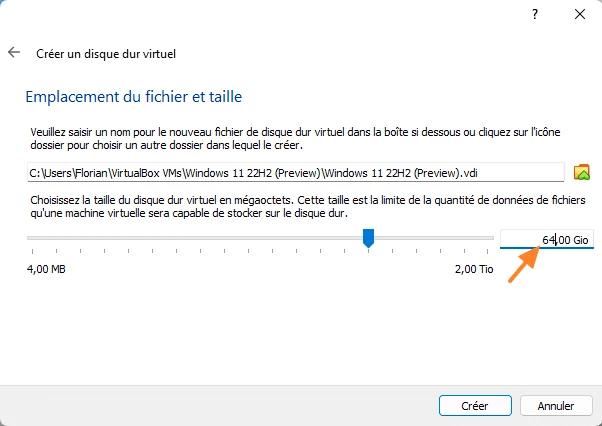


Bu noktada, sanal makine envanterimizdedir, yapılandırılmıştır ancak işletim sistemi yüklü değildir. Çalıştırmadan önce VM'nin yapılandırmasını tamamlamamız gerekiyor.


### B. VirtualBox sanal makinesine ISO görüntüsü atama


Windows 11'i veya başka bir sistemi kurmak için kurulum kaynaklarına ihtiyacımız var. Çoğu durumda, bir işletim sistemi yüklemek için ISO formatında bir disk imajı kullanırız. **Windows 11 ISO imajını VM'mizin sanal DVD sürücüsüne yüklemek gerekir


VirtualBox envanterindeki sanal makineye (1) ve ardından bu sanal makinenin genel yapılandırmasına erişim sağlayan "**Configuration**" düğmesine (2) tıklayın. Bu menü kaynakları yönetmek için kullanılır (örn. RAM'i artırmak, CPU'yu yapılandırmak, vb.). Soldaki "**Depolama**" üzerine tıklayın (3), DVD sürücüsünde şu an için "**Boş**" yazan yere tıklayın (4), ardından DVD şeklindeki simgeye tıklayın (5) ve "**Bir disk dosyası seçin**".


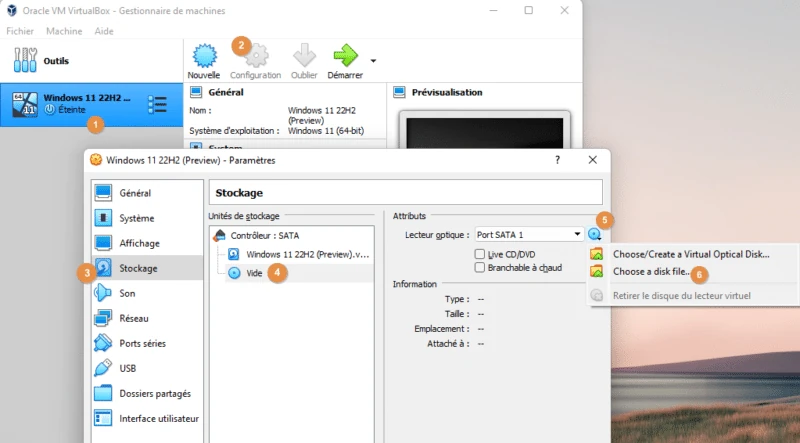


Yüklemek istediğiniz işletim sisteminin ISO görüntüsünü seçin ve ardından Tamam'a tıklayın. Aldığım sonuç bu:


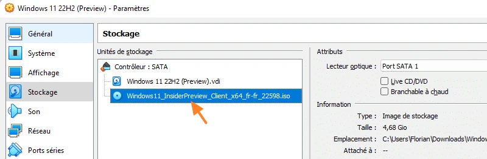


VM'nin "**Configuration**" bölümünde kalın, hala açıklamam gereken birkaç şey var.


### C. VM ağ bağlantısı


Sol taraftaki "**Ağ**" bölümüne gidin. Bu bölüm sanal makinenin ağını yönetmenizi sağlar: sanal ağ arayüzlerinin sayısı (VM başına en fazla 4), MAC Address ve ağ erişim modu (NAT, köprü erişimi, dahili ağ, vb.). **Sanal makinenizin İnternet'e erişmesini istiyorsanız, "NAT" veya "Köprü Erişimi "** seçeneğini seçin, ancak bu ikinci mod, ağınızda bir DHCP sunucusunun etkin olmasını gerektirir veya bir IP Address'yı manuel olarak yapılandırmanız gerekir.


Not: Ağ kısmına özel bir makalede daha ayrıntılı olarak geri döneceğim.


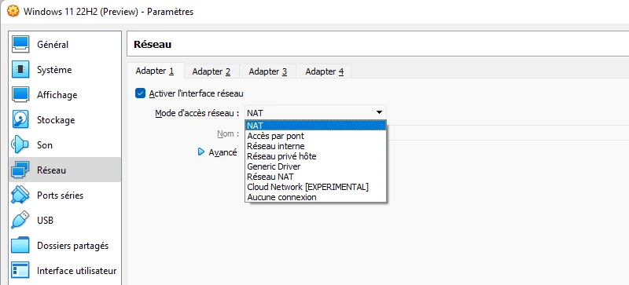


### D. Sanal işlemci sayısı


Fiziksel bir bilgisayar gibi, bir sanal makinenin de çalışması için RAM, Hard disk ve işlemciye ihtiyacı vardır. Sanal makineyi oluşturduğumuzda, sihirbazın işlemci yapılandırmasını içermediğini fark etmiş olabilirsiniz. Ancak, bu yapılandırmayı istediğiniz zaman "**Sistem**" sekmesi ve ardından sanal işlemci sayısını seçebileceğiniz "**İşlemci**" aracılığıyla yapabilirsiniz.


Not: "**Enable VT-x/AMD-v nested**" seçeneği iç içe sanallaştırma için gereklidir.


Benim durumumda, sanal makinenin 2 sanal işlemcisi var:


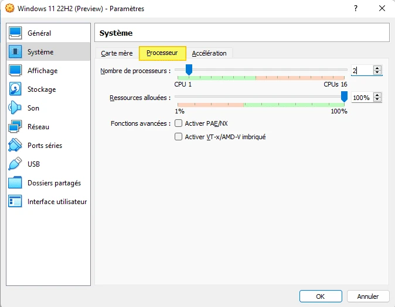


**Yapılandırma menüsünün diğer bölümlerine de göz atmaktan çekinmeyin.


### E. İlk önyükleme ve işletim sistemi kurulumu


Bir sanal makineyi başlatmak için envanterden seçmeniz ve "**Başlat**" düğmesine tıklamanız yeterlidir. Sanal makineye görsel bir genel bakış sağlayan ikinci bir pencere açılacaktır.


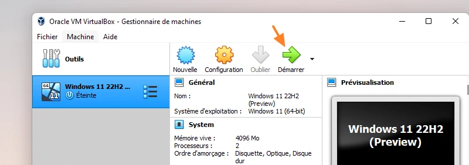


Kötü bir hata alıyorum ve sanal makinem başlamıyor! Hata, aşağıdaki ayrıntılarla birlikte "Sanal makine için oturum açma başarısız oldu..." şeklinde:


```shell
Not in a hypervisor partition (HPV=0)
AMD-V is disabled in the BIOS (or by the host OS)
```


Aslında bu normaldir çünkü **sanallaştırma özelliği bilgisayarımda etkin değil**! Bu sorunu düzeltmek için, BIOS'a erişmek ve sanallaştırmayı etkinleştirmek üzere bilgisayarınızı yeniden başlatmanız gerekir.


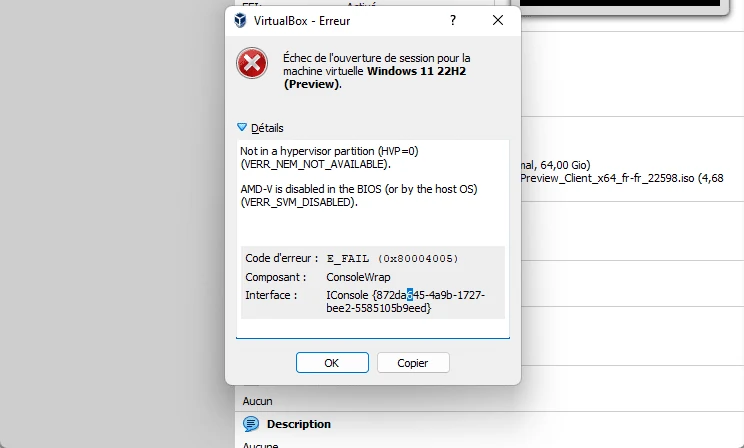


Beklemeden bilgisayarımı yeniden başlatıyorum ve **ASUS anakartımın BIOS'una** erişmek için "SUPPR" tuşuna basıyorum (tuş makineye göre değişebilir ve örneğin F2 olabilir). Sanallaştırmayı etkinleştirmek için, benim durumumda "SVM Modu" etkinleştirilmelidir. Burada yine, bir anakarttan diğerine, bir üreticiden diğerine, isim değişebilir. AMD-V** (AMD CPU için) ya da **Intel VT-x** (Intel CPU için) ile ilgili bir fonksiyon arayın.


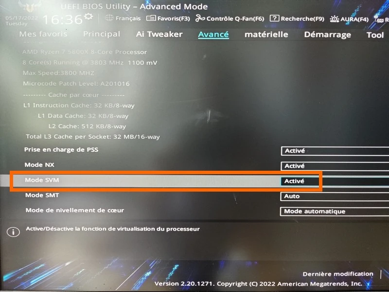


Bu işlem tamamlandıktan sonra, değişikliği kaydedin ve fiziksel makineyi yeniden başlatın... Bu sefer, **VirtualBox sanal makineyi başlatabilir** ve işletim sistemini yüklemek için Windows ISO görüntüsünü yükleyebilir! 🙂


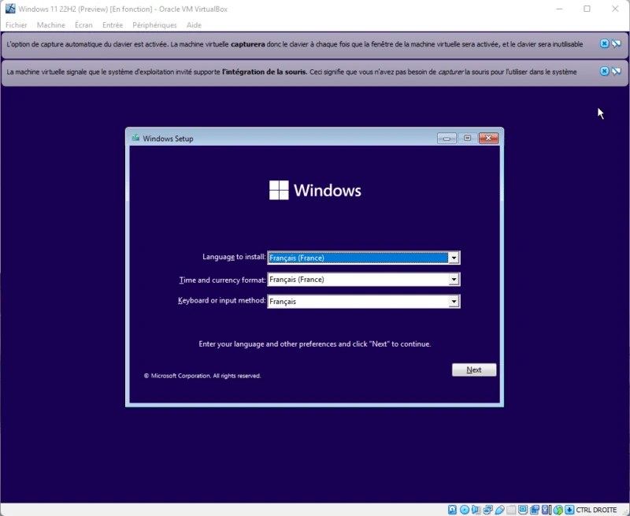


VirtualBox'ın kurulu olduğu Windows 11 fiziksel hostumuz üzerinde, Windows 11 sanal makine klasörünün çeşitli dosyalar içerdiğini görebiliriz.


- Sanal makine yapılandırmasına (RAM, CPU, vb.) karşılık gelen VBOX** dosyası (XML biçiminde)
- VBOX-PREV** dosyası önceki yapılandırmanın bir yedeğidir
- VDI** dosyası dinamik moddaki sanal Hard diskine karşılık gelir, bu nedenle şu anda yalnızca 13 GB'tır, oysa maksimum boyutu 64 GB'tır
- NVRAM** dosyası, fiziksel bir makinenin geçici olmayan belleğine eşdeğer olan sanal makinenin BIOS durumunu içerir


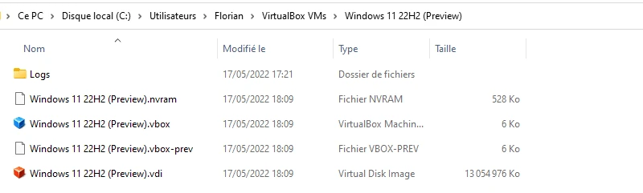


## V. Sonuç


**VirtualBox artık Windows 11 fiziksel makinemizde çalışır durumda! Geriye kalan tek şey bundan yararlanmak ve sanal makineler oluşturmak!** Windows 11'i bir VirtualBox sanal makinesine kurmaya başka bir makalede geri döneceğim. Windows 10, Windows Server veya bir Linux dağıtımı (Ubuntu, Debian, vb.) için size rehberlik etmemize izin verin!