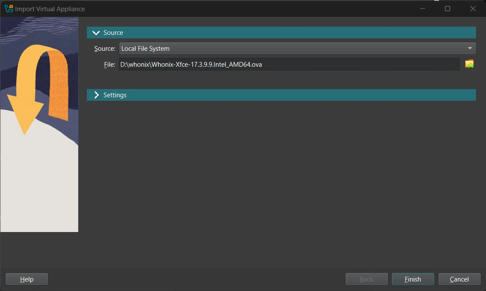
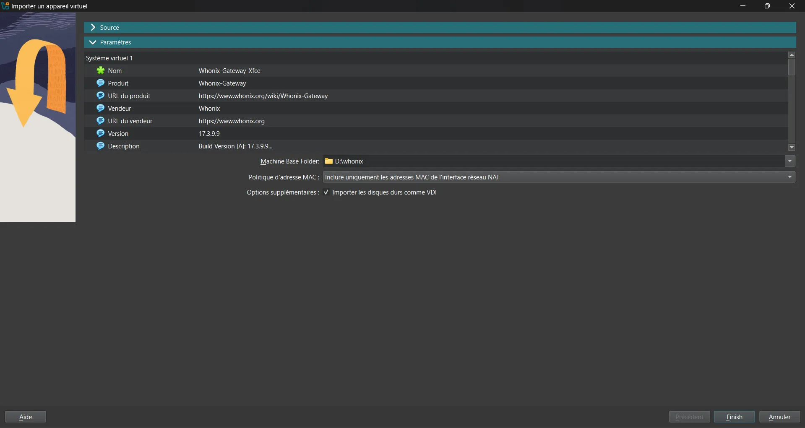
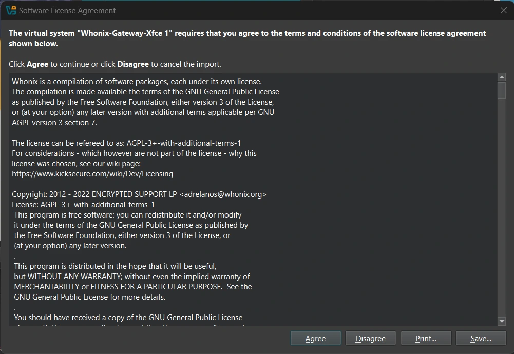
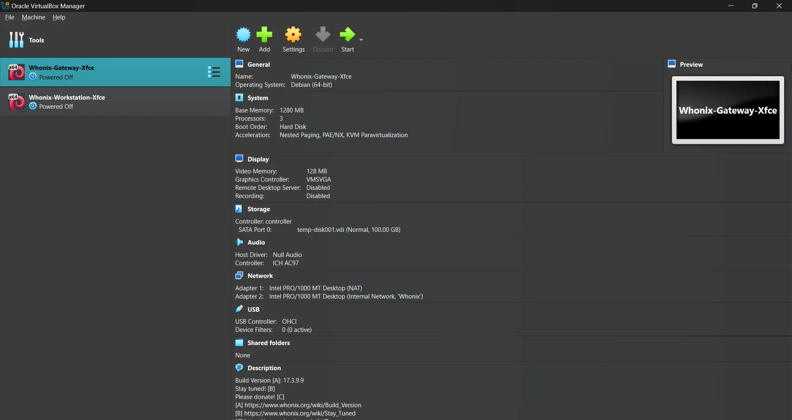
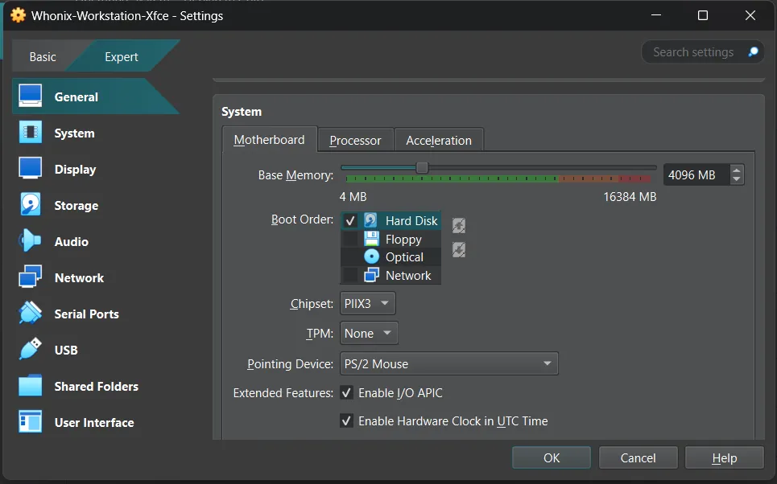
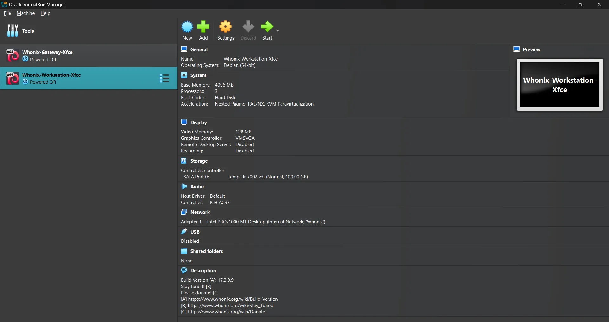
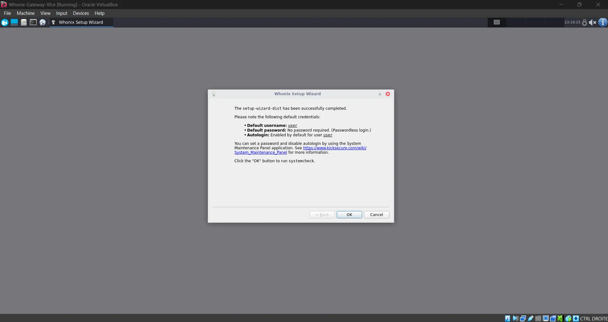
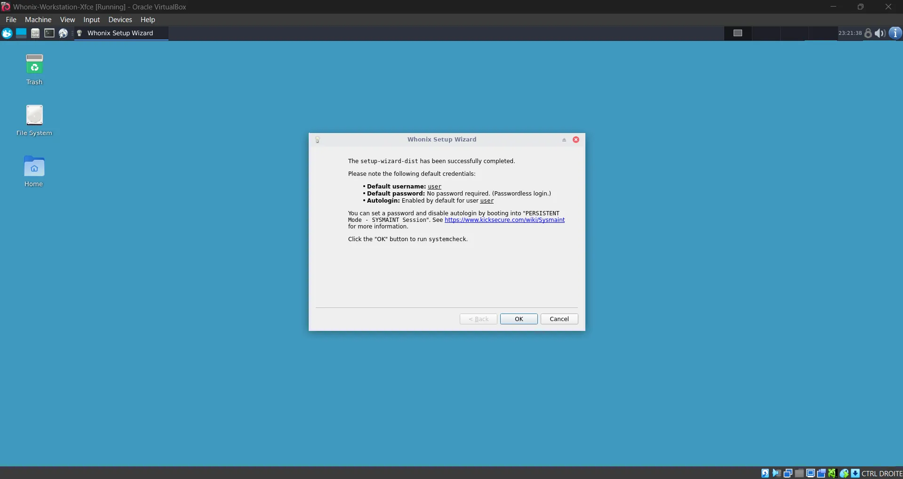
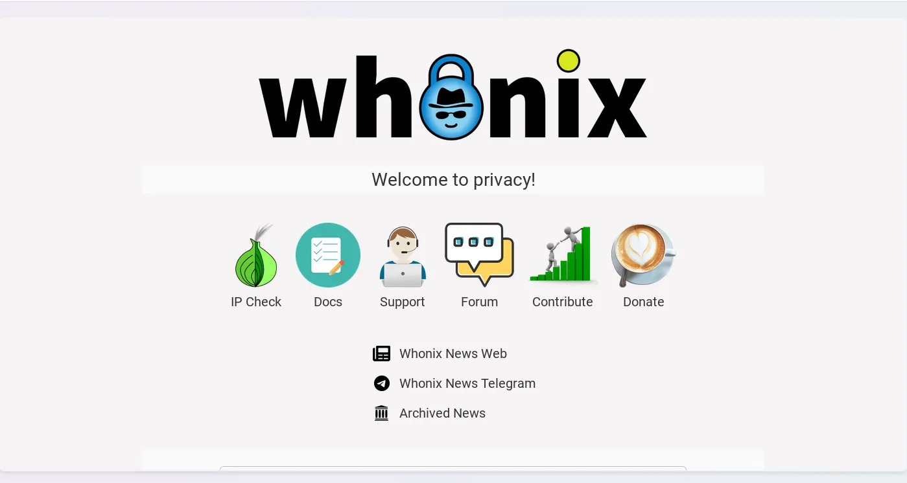

**Whonix** est une distribution Linux basée sur **Debian**, conçue pour fournir un environnement alliant **sécurité**, **anonymat** et **confidentialité**. Facile à prendre en main et compatible avec différentes interfaces (machines virtuelles, Qubes OS, mode Live), elle intègre par défaut le routage du trafic réseau via **Tor**, un **double pare-feu** (un pare-feu sur la Gateway et un autre sur la Workstation), une **protection complète contre les fuites IP/DNS** ainsi que des outils permettant de masquer efficacement votre activité vis-à-vis des observateurs réseau y compris votre fournisseur d’accès Internet. Plus qu’un simple système anonyme, **Whonix** constitue un environnement complet de développement sécurisé.

## Pourquoi choisir Whonix ?

- **Gratuit** : Comme la plupart des distributions Linux, Whonix est un système libre dont la licence est totalement gratuite. Il est développé en open source, avec une communauté active et transparente.
- **Confidentialité, sécurité et anonymat** : L’objectif principal de Whonix est d’offrir un environnement ultra-sécurisé, dans lequel toutes vos données sont protégées et vos communications cryptées via le réseau Tor.
- **Facile à utiliser** : Whonix propose une interface graphique intuitive et préconfigurée, adaptée même aux utilisateurs débutants. Aucun besoin d’être expert pour bénéficier d’une protection avancée.
- **Environnement idéal pour le développement sécurisé** : Whonix permet de développer, tester, auditer ou exécuter des programmes sans jamais révéler votre adresse IP réelle ni exposer vos habitudes de navigation ou de communication réseau.
- **Sessions jetables et mode Live** : Whonix peut être lancé en mode Live ou à travers des machines jetables (par exemple via **Qubes OS**), ce qui permet d’effectuer des tâches critiques sans laisser de traces persistantes une fois la session terminée.
- **Installation relativement simple** : Des images prêtes à l’emploi sont fournies pour une installation rapide dans des machines virtuelles (VirtualBox, KVM, Qubes). Le système est documenté et régulièrement mis à jour.

## Installation et configuration

Avant de passer à l’installation de Whonix, il est essentiel de noter que cette distribution **n’est pas encore officiellement disponible** en tant que système principal installable directement sur le disque dur (en mode “bare metal”). En d'autres termes, vous **ne pouvez pas encore installer Whonix comme système d’exploitation hôte classique**, à la manière d’un Ubuntu ou d’un Debian standard.

Cependant, plusieurs éditions sont disponibles et permettent d’utiliser Whonix de manière **volatile** (mode Live, sessions temporaires) ou **persistante** (via machines virtuelles ou intégration dans Qubes OS).

Pour une utilisation durable et stable, **la virtualisation reste actuellement la seule méthode officiellement recommandée**. Vous pouvez faire tourner Whonix à l’aide de **VirtualBox** (Whonix-Gateway et Whonix-Workstation) ou l’intégrer dans un système comme **Qubes OS**. Dans ce tutoriel nous nous focaliserons sur une installation à partir de VirtualBox.

### Prérequis

Avant de pouvoir installer Whonix en mode virtuel, assurez-vous que votre machine réponde aux conditions techniques minimales. La virtualisation nécessite certaines ressources que tous les ordinateurs ne peuvent pas offrir. Il est donc indispensable que votre processeur prenne en charge la technologie de virtualisation (Intel VT-x ou AMD-V), et que cette option soit activée dans le BIOS/UEFI.

Voici les spécifications recommandées pour une expérience fluide et stable avec Whonix :

- **Mémoire vive (RAM)** : un minimum de **8 Go** est fortement recommandé. Plus vous avez de RAM, plus vous pourrez allouer de ressources aux machines virtuelles (Gateway et Workstation), ce qui améliorera les performances.
- **Espace disque disponible** : prévoyez au moins **30 Go d’espace libre**. Cela inclut l’espace requis pour les deux machines virtuelles, les fichiers systèmes, et vos éventuelles données ou snapshots.
- **Processeur** : un processeur disposant d’au moins **4 cœurs physiques** (8 threads logiques) est conseillé, surtout si vous souhaitez faire tourner d’autres services ou outils en parallèle.

### Téléchargement Whonix

Whonix est disponible en plusieurs éditions, selon le type d’environnement dans lequel vous souhaitez l’utiliser. Pour la majorité des utilisateurs (Windows, Linux ou MacOs), l’édition VirtualBox est la plus simple à mettre en place. Vous pouvez télécharger l'image directement depuis [le site officiel](https://www.whonix.org/wiki/VirtualBox).
 
⚠️ Whonix **n’est pas compatible** avec les MacBook utilisant des processeurs Apple Silicon (architecture ARM). 

## Installation de VirtualBox

Pour faire fonctionner Whonix, vous aurez besoin d’un **hyperviseur** comme VirtualBox, Qubes ou encore KVM.

Une fois le fichier téléchargé, procédez à l’installation comme pour n’importe quel logiciel classique. Acceptez les options par défaut sauf si vous avez des besoins spécifiques. Êtes-vous perdu ? Découvrez notre guide sur l'utilisation de VirtualBox.

https://planb.network/tutorials/computer-security/operating-system/virtualbox-6472f5be-10ce-4a07-8b24-097bfbcedd65
### Importation de Whonix

Une fois VirtualBox installé, vous pouvez importer les fichiers `.ova` de Whonix que vous avez préalablement téléchargés (`Whonix-Gateway-Xfce.ova` et `Whonix-Workstation-Xfce.ova`).

Ouvrez VirtualBox, puis cliquez sur **Fichier → Importer une appliance**.
Sélectionnez le fichier `.ova` correspondant (commencez par la Gateway).



Choisissez l’emplacement où seront stockés les fichiers de la machine virtuelle Whonix.



Acceptez les conditions d'utilisation puis lancez l’importation et patientez jusqu’à la fin du processus.




### Configuration de Whonix

Avant de démarrer Whonix, il est important d’ajuster certaines **paramètres système** pour garantir de meilleures performances :

Sélectionnez la machine virtuelle **Whonix-Workstation-Xfce**, puis cliquez sur **Configuration**.
 


Rendez-vous dans l’onglet **Système**, par défaut, la mémoire vive allouée est fixée à 2048 Mo. Il est recommandé de la **monter à 4096 Mo (4 Go)** pour plus de fluidité, surtout si vous comptez ouvrir plusieurs applications ou travailler dans des sessions longues. Le Gateway peut rester à 2048 Mo, sauf si vous utilisez beaucoup de connexions Tor en parallèle.



### Démarrage de Whonix

Pour que Whonix fonctionne correctement et de façon sécurisée, **vous devez impérativement suivre cet ordre de démarrage** :

Démarrez d’abord la machine **Whonix-Gateway-Xfce**. Cette machine est responsable de router tout le trafic via le réseau **Tor**. Sans le gateway en marche aucun trafic ne sera routé via Tor et vous perdrez l’anonymat.



Une fois le Gateway entièrement lancé (vous verrez Tor connecté), vous pouvez démarrer **Whonix-Workstation-Xfce**, qui se connectera automatiquement via le Gateway.





### Mise à jour du système

Entrez dans le terminal, insérez la commande suivante pour mettre à jour la liste des paquets :

```shell
sudo apt update
```

Lancez ensuite la commande suivante pour installer les mises à jour disponibles :

```shell
sudo apt full-upgrade
```

## Découvrez Whonix

**Whonix** est un système conçu pour offrir un environnement informatique **sécurisé**, **anonyme** et **confidentiel**, idéal pour naviguer sur Internet sans compromettre votre identité ou vos données. Pour cela, il intègre par défaut plusieurs applications utiles au quotidien, pensées pour renforcer votre sécurité numérique dès le premier démarrage.
### KeepassXC

**KeePassXC** est un gestionnaire de mots de passe intégré à Whonix. Il vous permet de **créer, stocker et gérer** vos mots de passe en toute sécurité, sans avoir à les retenir tous manuellement. Les mots de passe sont enregistrés dans une **base de données chiffrée**, protégée par un mot de passe principal (Mot de passe mère).

### Tor Browser

**Tor Browser** est le navigateur web par défaut de Whonix. Il repose sur le réseau **Tor**, qui redirige votre trafic à travers plusieurs relais à travers le monde, rendant pratiquement impossible l'identification de votre adresse IP réelle.

https://planb.network/tutorials/computer-security/communication/tor-browser-a847e83c-31ef-4439-9eac-742b255129bb

### Electrum Bitcoin Wallet

**Electrum** est un portefeuille Bitcoin léger et rapide, préinstallé sur Whonix pour vous permettre de gérer des **transactions en cryptomonnaies** de manière anonyme. Il ne télécharge pas toute la blockchain mais utilise des serveurs distants pour obtenir les informations nécessaires, ce qui le rend beaucoup plus léger qu’un wallet complet.

https://planb.network/tutorials/wallet/desktop/electrum-efec9166-46b5-4937-8cee-6bc310975177

Whonix n’est pas qu’un simple système d’exploitation : c’est un véritable **environnement sécurisé** pensé pour protéger votre anonymat, votre vie privée et vos activités sensibles. Grâce à son architecture basée sur Tor, son cloisonnement intelligent entre Gateway et Workstation, et ses outils préinstallés comme Tor Browser, KeePassXC ou Electrum, il offre une solution clé en main pour toute personne souhaitant **naviguer anonymement**, **travailler en toute sécurité** ou **manipuler des données confidentielles**.

Pour renforcer votre sécurité sur votre système Unix, découvrez notre tutoriel sur l'audit de votre machine : vérifiez les failles de sécurité dans votre système d'exploitation et assurez-vous que vos données ne sont pas compromises.

https://planb.network/tutorials/computer-security/operating-system/lynis-1cf865b3-a352-4dd2-94d2-f17fa65547af