___


*Iyi nyigisho ishingiye ku bintu vy’umwimerere vya Florian BURNEL vyasohowe kuri [IT-Connect](https://www.it-connect.fr/). Uruhusha [CC KURI-NC 4.0](ku rubuga rwacu/uruhusha/ku-NC/4.0/). Birashoboka ko hari ivyo bahinduye mu canditswe c’intango.*


___


## I. Ugushikiriza


Muri iyi nyigisho, tuzokwiga ingene twotunganya VPN ishingiye kuri WireGuard, umuti wa VPN w’ubuntu, ufunguye, ushobora kwongereza ubushobozi ata kwirengagiza umutekano.


WireGuard ni umuti uherutse gusohoka, ukaba warabonetse nk’isohorwa ridahinduka kuva muri Ntwarante 2020, kandi wararonse icubahiro co kwinjizwa ataco ushizemwo mu **Kernel ya Linux kuva kuri verisiyo 5.6**. Ivyo ntibibuza ko ishobora gushikirwa n'ibice vya kera vya Linux bikoresha verisiyo itandukanye y'inkomoko. Ugereranije n’ibisubizo nka OpenVPN na IPSec, WireGuard yoroshe gukoresha kandi iranyaruka cane, nk’uko tuzobibona mu mpera y’iki kiganiro.


Ingingo zimwe zimwe z’ingenzi ku vyerekeye WireGuard:


- Biroroshe, biraremereye kandi birakora neza cane!
- UDP-gusa igikorwa (gishobora kuba ikibazo iyo ujabutse ibihome bimwe bimwe)
- Ikora ku buryo bw'urunganwe aho gukoresha uburyo bw'umukiriya-umukozi
- Kwemeza n'urufunguzo Exchange, ku ngingo imwe na SSH n'urufunguzo rwihariye/rwa bose
- Ikoreshwa ry’ubuhinga bwinshi: gupfuka amakuru mu buryo buhuye na ChaCha20, kwemeza ubutumwa na Poly1305, hamwe n’ibindi nka Curve25519, BLAKE2 na SipHash24
- Ishigikira IPv4 na IPv6.
- Urubuga rwinshi: Amadirisha, Linux, BSD, MacOS, Android, iOS, OpenWRT (kandi zishirwa mu ngiro muri ProtonVPN)
- Imirongo 4.000 gusa y’amakode, ugereranyije n’ibihumbi amajana vy’ibindi bisubizo .


Ku bijanye n’igice c’ubuhinga bwo gukingira amakuru, ubuhinga butandukanye bukoreshwa buratorwa n’amaboko, bugasuzumwa mu buryo butandukanye, bugasuzumwa n’abashakashatsi b’umutekano bajejwe ivyo.


Urubuga rwemewe rw'umugambi: [umurinzi w'umuyagankuba.com](https://www.umucungezi w'umuyagankuba.com/)


Woba wemezwa n’uwo muti umaze gusoma iyi ntangamarara? Ivyo bisigaye ni ugusoma gusa!


## II. Igishushanyo c'umucungezi w'intsinga


Imbere y’uko ndababwira laboratwari yanje yo gushinga WireGuard, mukwiye kumenya ko mushobora kwiyumvira **gukoresha WireGuard kugira ngo muhuze ibikorwa remezo bibiri biri kure**, ariko kandi **muhuze umukiriya ari kure n’ibikorwa remezo nk’urubuga rw’ishirahamwe canke urubuga rwawe rwo mu nzu**. Ivyo biri mu mpwemu imwe n'iya OpenVPN, nk'uko twabibonye vuba mu nyigisho "[OpenVPN kuri Synology] (https://www.


Niba WireGuard itashizweho ataco ihinduye kuri router canke ku ruhome rw’umuriro, nk’uko bishoboka kuri OpenWRT, uzokenera gushinga ugurungika imbere kw’ibarabara kugira ngo uruja n’uruza rushike ku babiri ba WireGuard.


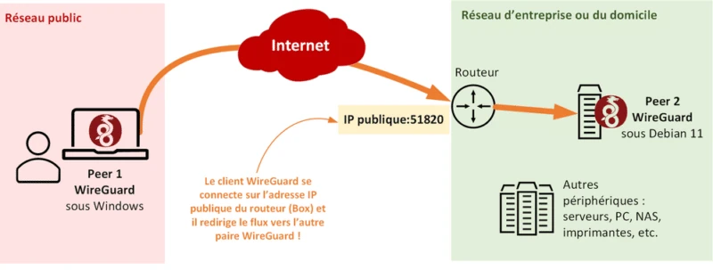


None ndababwira ivyerekeye laboratwari yanje n’ivyo tuzoshiraho uno musi.


Nzokoresha imashini ya Debian 11 nk’umukozi wa WireGuard n’umukiriya wa Windows nk’umukiriya wa VPN ya WireGuard. Naho ari ukuzimiza gato kuvuga ku bijanye n'ubucuti hagati y'umukiriya n'umukozi, kuko **WireGuard ikora ku buryo bwa "peer-to-peer "**. Ivyo ni ukuvuga nabi iyo uriko uragerageza gushinga uruja n'uruza "client-to-site". Reka tuvuge aho ko ngiye kugira ama pair abiri canke **ibibanza bibiri vy’uguhuza WireGuard** nimba ushaka: kimwe kiri munsi ya Debian 11 ikindi kiri munsi ya Windows.


Ivyo bibiri bibiri birashobora kuvugana mu nzira zompi, bisobanura ko nkoresheje imashini yanje ya Windows nshobora gushika kuri LAN iri kure y’imashini ya Debian 11, n’ibihushanye n’ivyo: vyose bivana n’imiterere y’umugende n’uruhome rw’umuriro rw’umugenzi wa WireGuard.


Muri aka karorero, nzoshimika ku kibazo gikurikira: **kuva kuri Windows Peer 1 yanje ifatanye n’urubuga rwanje rwo muhira, nshaka gushika ku rubuga rwanje rw’ishirahamwe kugira ngo nshobore gushika ku ma server y’ishirahamwe biciye mu nzira ya WireGuard VPN**. Ivyo bitanga ikigereranyo gikurikira:


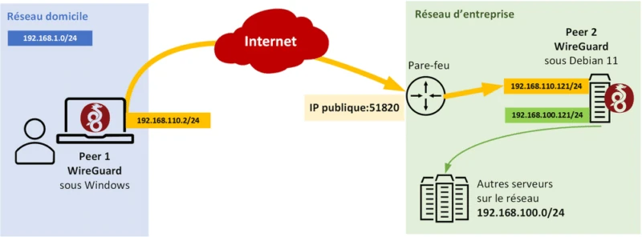


Ku bijanye n’amaderesi ya IP, ivyo bitanga:


- Urubuga rwo muhira**: 192.168.1.0/24
- Urubuga rw'amashirahamwe**: 192.168.100.0/24
- Urubuga rw'imigende y'abacungera amashanyarazi**: 192.168.110.0/24


+ IP Address y'Urunganwe rwa 1 (Amadirisho) mu mugende: 192.168.110.2/24


+ IP Address y'Urunganwe rwa 2 (Debian) mu mugende: 192.168.110.121/24


Ivyo ni vyo vyose birimwo! Reka tumanuke ku bijanye n’ugutunganya!


**Iciyumviro: ku mburabuzi, WireGuard ikora mu buryo bwa UDP ku cambu 51820.**


## III Gushiramwo no gutunganya serveri ya WireGuard


Nzokoresha amajambo "client" ku mashini ya Windows na "server" ku mashini ya Debian muri iyi nyigisho, kuko naho ari peer-to-peer, bisa n'ibifise insiguro kuruta.


### A. Gushiramwo WireGuard kuri Debian 11


Igikoresho co gushiramwo WireGuard kiraboneka mu bubiko bwa Debian 11, rero ico dutegerezwa gukora n'uguhindura ububiko bw'igikoresho maze tukagishiramwo:


```
sudo apt-get update
```


```
sudo apt-get install wireguard
```


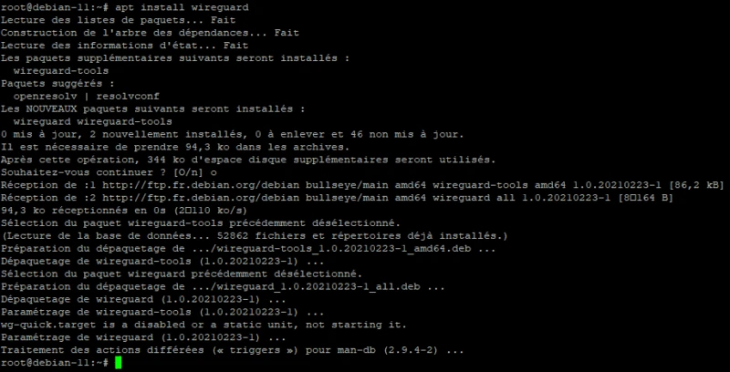


Igice ca server ya WireGuard kizoshirwaho, hamwe n’ibikoresho bitandukanye bitanga uburenganzira bwo kuronka amabwirizwa ngirakamaro yo gucunga imiterere.


### B. Gushiramwo igikoresho co kurinda amashanyarazi Interface


Dukoresheje **itegeko "wg "** dukeneye generate urufunguzo rwihariye n'urufunguzo rwa bose: bikenewe kugira ngo umuntu yemeze hagati y'ababiri babiri, ni ukuvuga umukozi n'umukiriya (na we azokenera urufunguzo rubiri).


Tuzokora urufunguzo rw'ibanga "**/n'ibindi/umurinzi/wg-urufunguzo rw'ibanga**" n'urufunguzo rwa bose "**/n'ibindi/umurinzi/wg-rufunguzo rwa bose**" n'uru rutonde rw'amabwirizwa:


```
wg genkey | sudo tee /etc/wireguard/wg-private.key | wg pubkey | sudo tee /etc/wireguard/wg-public.key
```


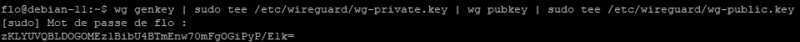


Agaciro k'urufunguzo rwa bose kazogaruka muri konsole. Mu dosiye y'imiterere ya WireGuard, turakeneye **kwongerako agaciro k'urufunguzo rwacu rw'ibanga**. Kugira ngo ubone aka gaciro, shiramwo itegeko riri musi maze ukope agaciro:


```
sudo cat /etc/wireguard/wg-private.key
```


Igihe kirageze co kurema dosiye y'imiterere muri "**/n'ibindi/wireguard/**". Nk'akarorero, turashobora kwita iyi dosiye "**wg0.conf**", niwiyumvira ko urubuga rwa Interface rujanye n'ivyo WireGuard ruzoba "wg0", ku ngingo ngenderwako imwe na "eth0", nk'akarorero.


```
sudo nano /etc/wireguard/wg0.conf
```


Muri iyi dosiye, dutegerezwa kubanza kwongerako ibi bikurikira (tuzogaruka tubiheza hanyuma):


```
[Interface]
Address = 192.168.110.121/24
SaveConfig = true
ListenPort = 51820
PrivateKey = <clé privée du serveur>
```


Igice `[Interface]` gikoreshwa mu gutangaza igice ca server. Akira amakuru amwe amwe:


- Address**: IP Address ya Interface WireGuard iri mu mugende wa VPN (umurongo muto utandukanye na LAN iri kure)
- SaveConfig**: ivyagezwe birabikwa (kandi bikarindwa) igihe cose Interface ikora
- Igikoresho co kwumviriza**: Igikoresho co kwumviriza ca WireGuard. Muri iki gihe, 51820 ni port mburabuzi, ariko urashobora kuyihindura
- Urufunguzo rw'ibanga**: agaciro k'urufunguzo rw'ibanga rwa server yacu (*wg-urufunguzo rw'ibanga*)


Bika dosiye maze uyifunge. N'itegeko "**wg-quick**", turashobora gutangura iyi Interface mu gutanga izina ryayo (wg0, nk'uko dosiye yitwa wg0.conf):


```
sudo wg-quick up wg0
```


Niwatanga urutonde rw'amaderesi ya IP ya server yawe ya Debian 11, uzobona Interface nshasha yitwa "wg0" ifise IP Address isobanuwe muri dosiye y'imiterere:


```
ip a
```


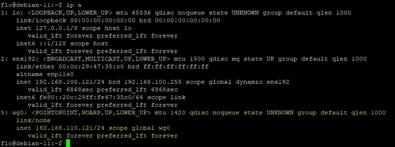


Mu mpwemu imwe, turashobora kwerekana imiterere ya Interface "wg0" biciye ku itegeko "wg show":


```
sudo wg show wg0
```


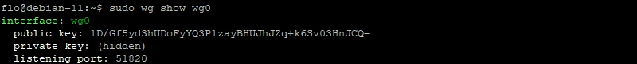


Ubwa nyuma, turakeneye gukoresha ugutangura kwihuta kwa Interface wg0 WireGuard yacu:


```
sudo systemctl enable wg-quick@wg0.service
```


Kugeza ubu, tuzosiga ku ruhande imiterere y’uruhande rwa server ya WireGuard.


### C. Gushoboza IP


Kugira ngo imashini yacu ya Debian 11 ishobore **gurungika amapakete hagati y’imirongo itandukanye (nk’umurongozi)**, ni ukuvuga hagati y’umurongo wa VPN n’umurongo wo mu karere, dukeneye gukoresha [IP Forwarding](https://www.it-connect.fr/ Ku mburabuzi, iki kintu kirazimye.


Guhindura iyi dosiye y'imiterere:


```
sudo nano /etc/sysctl.conf
```


Yongerako amabwirizwa akurikira ku mpera ya dosiye maze ubike:


```
net.ipv4.ip_forward = 1
```


Ivyo ni vyo vyose birimwo.


### D. Gushoboza IP Ukwiyoberanya


Kugira ngo server yacu ishobore gutuma amapakete agenda neza kandi LAN iri kure ishobore gushikirwa n’imashini ya Windows, turakeneye gukoresha IP Masquerade kuri server yacu ya Debian. Ivyo ni ubwoko bw’ugukora kwa NAT. Ngiye gukora iyi ntunganyo ku ruhome rw’umuriro rwa Linux biciye kuri UFW, iyo namenyereye gukoresha ([inyigisho ya ufw kuri Debian](https://www.it-connect.fr/)).


Niba udafise UFW kandi ushaka kuyishiraho (ushobora no gukoresha Nftables), tangura uyishizeho:


```
sudo apt install ufw
```


Mbere na mbere, ukeneye gukoresha SSH kugira ngo ntutakaze ububasha kuri server ya kure (hindura inomero y'icuma):


```
sudo ufw allow 22/tcp
```


Port 51820 muri UDP nayo itegerezwa kwemererwa, nk'uko tuyikoresha kuri WireGuard (na none, uhindure inomero y'icuma):


```
sudo ufw allow 51820/udp
```


Igikurikira, tuzobandanya n’ugutunganya kugira ngo IP masquerade ishoboke. Kugira ngo ivyo tubishikeko, turakeneye kuronka izina rya Interface ryifatanijwe n’urubuga rwo mu karere. Niba utazi izina, genda "ip a" kugira ubone izina ry'ikarita. Mu vyerekeye jewe, ni ikarita "**ens192**".


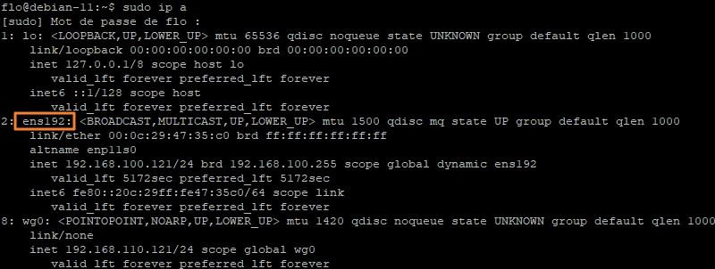


Tugiye gukoresha aya makuru. Guhindura dosiye ikurikira:


```
sudo nano /etc/ufw/before.rules
```


Yongerako iyi mirongo ku mpera y'idosiye kugira ngo **ushobore gukoresha IP ku Interface ens192** (uhindure izina rya Interface) mu murongo wa POSTROUTING w'imeza ya NAT y'uruhome rwacu rw'umuriro:


```
# NAT - IP masquerade
*nat*
:POSTROUTING ACCEPT [0:0]
-A POSTROUTING -o ens192 -j MASQUERADE

# End each table with the 'COMMIT' line or these rules won't be processed
COMMIT
```


Ishusho yerekana:


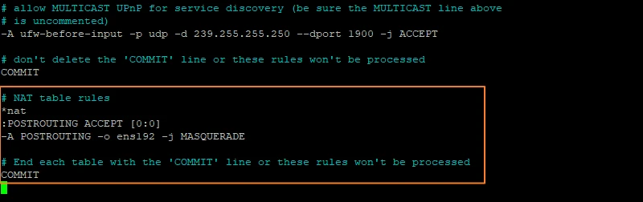


Gumana iyi dosiye y'imiterere yuguruye maze ugende ku ntambwe ikurikira. 😉


### E. Linux gutunganya uruhome rw'umuriro rwa WireGuard


Naho biri muri dosiye imwe y'imiterere, tugiye kumenyesha urubuga rw'ishirahamwe "192.168.100.0/24" kugira ngo dushobore kururonka. Aha niho hari amategeko abiri azokwongerwako (vyiza cane inyuma y'igice ca "*# ok icmp code for FORWARD*" kugira ngo ushire hamwe amategeko):


```
# autoriser le forwarding pour le réseau distant de confiance (+ le réseau du VPN)
-A ufw-before-forward -s 192.168.100.0/24 -j ACCEPT
-A ufw-before-forward -d 192.168.100.0/24 -j ACCEPT
-A ufw-before-forward -s 192.168.110.0/24 -j ACCEPT
-A ufw-before-forward -d 192.168.110.0/24 -j ACCEPT
```


Niba ushaka kwemerera umushitsi umwe gusa, nk'akarorero "192.168.100.11", biroroshe:


```
-A ufw-before-forward -s 192.168.100.11/32 -j ACCEPT
-A ufw-before-forward -d 192.168.100.11/32 -j ACCEPT
```


Ubu ushobora kubika iyo dosiye ukayifunga. Igisigaye ni ugukoresha UFW no gusubira gutangura iyo serivisi kugira ngo dushire mu ngiro ivyo twahinduye:


```
sudo ufw enable
```


```
sudo systemctl restart ufw
```


Igice ca mbere c'imiterere ya server ya Debian ubu cararangiye.


## IV. Umukiriya wa WireGuard wa Windows


Igikoresho ca WireGuard kiraboneka kuri Windows, macOS, Android, n’ibindi... Iyi ni inkuru nziza cane. Ivyo vyose bishobora gukurwa kuri iyi paji: [Umukiriya wa WireGuard](https://www.wireguard.com/install/). Muri aka karorero, ngiye gushinga umukiriya kuri Windows. Kugira ngo ushireho umukiriya wa WireGuard kuri Linux, ukurikize ingingo ngenderwako imwe n’iyo guhingura dosiye wg0.conf ku mashini ya Debian (ata NAT yose, n’ibindi).


### A. Gushiramwo umukiriya wa Windows wa WireGuard


Iyo umaze gukuraho executable canke MSI package, gushiramwo biragoye: gusa utangure installer, maze...voilà, birarangiye! 🙂


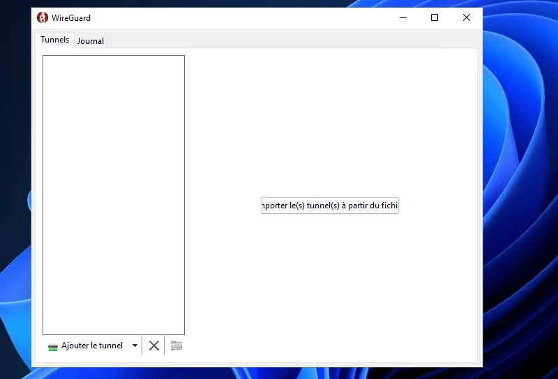


### B. Rema umwirondoro wa WireGuard


Tangana n’ugufungura porogarama kugira ngo ureme umugende mushasha. Kugira ngo ubikore, fyonda ku mwampi uri iburyo bw'ubuto bwa "**Ongera umugende**" hanyuma ukande ku buto "**Ongera umugende w'ubusa**".


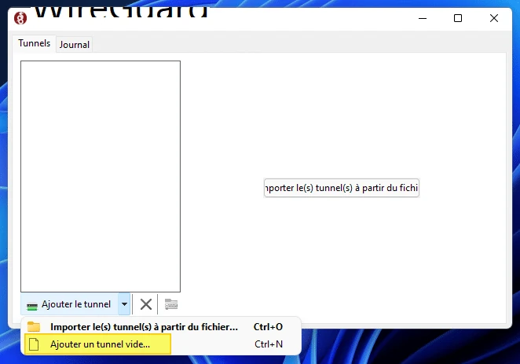


Idirisha ry'imiterere rizofunguka. Igihe cose hashizweho imiterere mishasha y'umugende, WireGuard itanga urufunguzo rw'ibanga/rwa bose rwihariye kuri iyo miterere. **Muri iyi ntunganyo, dukeneye kumenyesha "umugenzi", ni ukuvuga umukozi wa kure:**


```
[Interface]
PrivateKey = <la clé privée du PC>
```


Turakeneye kurangiza iyo ntunganyo, cane cane kumenyesha IP Address kuri iyi Interface (*Address*), ariko kandi kumenyesha umukozi wa WireGuard wo kure biciye ku nzira ya [Peer]. Ishusho iri musi ikwiye kukwibutsa dosiye y’imiterere twaremye ku ruhande rwa server ya Linux.


Reka dutangure n'ububiko bwa `[Interface]`, twongereko IP Address "**192.168.110.2**"; wibuke ko umukozi afise IP Address "**192.168.110.121**" kuri iki gice c'urubuga. Ivyo bitanga:


```
[Interface]
PrivateKey = <la clé privée du PC>
Address = 192.168.110.2/24
```


Ibikurikira, dukeneye gutangaza "Peer" block ifise ibintu bitatu, bikavamwo iyi ntunganyo:


```
[Peer]
PublicKey = 1D/Gf5yd3hUDoFyYQ3P1zayBHUJhJZq+k6Sv03HnJCQ=
AllowedIPs = 192.168.110.0/24, 192.168.100.0/24
Endpoint = <ip-serveur-debian>:51820
```


Mu mafoto:


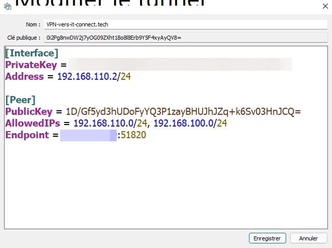


**Ibisobanuro bike ku vyerekeye [Peer] block:**


- Urufunguzo rwa bose**: uru ni urufunguzo rwa bose rwa server ya WireGuard Debian 11 (ushobora kuronka agaciro kayo ukoresheje itegeko "*sudo wg*")
- AllowedIPs**: izo ni aderesi za IP / inzira zishobora gushikwako biciye kuri iyi nzira ya VPN ya WireGuard, muri iki gihe ni inzira yihariye kuri VPN yanje ya WireGuard (*192.168.110.0/24*) na LAN yanje yo kure (*192.168.100.0/24*)
- Iherezo**: iyi ni IP Address y'umushitsi wa Debian 11, kuko iyi ni ihuriro ryacu rya WireGuard (uzokenera kugaragaza IP ya bose Address)


Ubwa nyuma, shiramwo izina mu kibanza ca "**Izina**" (ata myanya) hanyuma ukope kandi ushire urufunguzo rwa bose rw'umukiriya, kuko tuzokenera kurumenyesha kuri server. Fyonda kuri "**Iyandikishe**".


### C. Kumenyesha umukiriya kuri serveri ya WireGuard


Igihe kirageze co gusubira kuri server ya Debian kugira ngo umenyeshe "**Peer**", ni ukuvuga PC yacu ya Windows, mu ntumbero ya WireGuard. Mbere na mbere, turakeneye **guhagarika Interface "wg0"** kugira ngo duhindure imiterere yayo:


```
sudo wg-quick down wg0
# ou
sudo wg-quick down /etc/wireguard/wg0.conf
```


Ibikurikira, hindura dosiye y'imiterere yaremwe mbere:


```
sudo nano /etc/wireguard/wg0.conf
```


Muri iyi dosiye, hakurikijwe `[Interface]` ububiko, dukeneye gutangaza ububiko bwa `[Peer]`:


```
[Peer]
PublicKey = 0i2Pg8nwDW2j7yOG09ZXht18o8l8Erb9Y5F4xyAyQV8=
AllowedIPs = 192.168.110.2/32
```


Iyi [Peer] irimwo urufunguzo rwa bose rwa PC ya Windows 10 (**Urufunguzo rwa bose**) na IP Address ya PC Interface (**IPs zemerewe**): umukozi azovugana muri iyi nzira ya WireGuard gusa kugira ngo abone umukiriya wa Windows, ni co gituma agaciro "**192.1628.**210".


Igisigaye ni ukubika dosiye (*CTRL+O hanyuma Enter hanyuma CTRL+X biciye kuri Nano*). Gusubira gutanguza Interface "wg0":


```
sudo wg-quick up wg0
# ou
sudo wg-quick up /etc/wireguard/wg0.conf
```


Kugira ngo ugenzure ko itangazo ry'urunganwe rikora, ushobora gukoresha iri tegeko:


```
sudo wg show
```


Igihe umushitsi wo kure amaze gushinga uruja n'uruza rwayo rwa WireGuard, IP Address yiwe izoduzwa ku gaciro ka "endpoint".


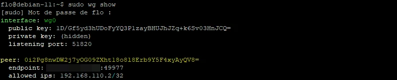


Ubwanyuma, tuzokingira amadosiye y'imiterere kugira ngo tugabanye ukuronka imizi:


```
sudo chmod 600 /etc/wireguard/ -R
```


### D. Uguhuza kwa mbere kwa WireGuard


None ko iyo configuration iteguye, turashobora kuyitangura turi kuri PC ya Windows. Kugira ngo ubikore, mu client ya **WireGuard**, ukande kuri buto ya **Activate**: ihuriro rizohinduka rive kuri "Off" rije kuri "On", ariko ivyo ntibisigura ko rizokora. Vyose bivana n’uko configuration yawe ari nziza canke atari yo. **Igihe iyo nzira ishizweho, imashini zacu zibiri zivugana biciye ku nzira ya Interface WireGuard itunganijwe ku ruhande rumwe rumwe!**


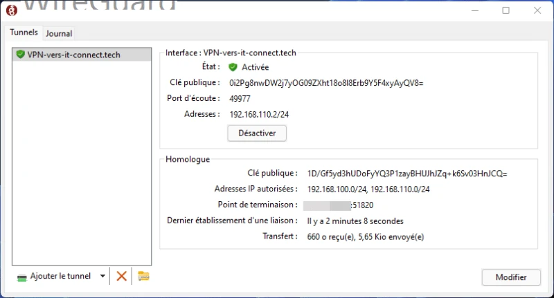


Iyo habaye ingorane, ivyo bizoboneka mu gice ca "**Logbook**". Abashitsi babiri bazokoresha amapakete ya Exchange ubudasiba kugira ngo basuzume uko ubufatanye buri, ni co gituma ubutumwa buvuga ngo "*Kwakira amapakete y'ubuzima buva ku bagenzi 1*".


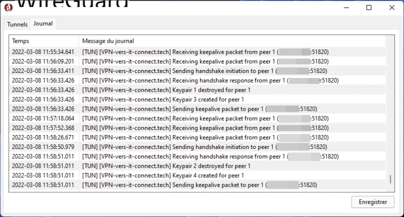


Niba urupapuro rwa WireGuard "**Journal**" rwerekana ubutumwa nk'ubu buri musi, ukeneye kugenzura ko imfunguruzo za bose zamenyeshejwe ku mpande zompi ari ukuri.


```
Handshake for peer 1 (<ip>:51820) did not complete after 5 seconds, retrying (try 2)
```


Kuva kuri PC yanje iri kure, ndashobora gukora ping IP Address ya Interface WireGuard yanje ku ruhande rwa server, hamwe n’umushitsi kuri LAN yanje iri kure.


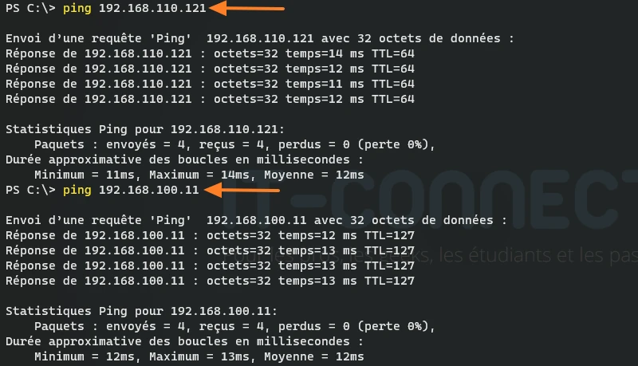


### E. Ibikorwa: OpenVPN vs WireGuard


Navuye kuri PC yanje ya kure ihuye na VPN yanje ya WireGuard, narashoboye gushika ku serveri y’amadosiye no gutanga dosiye biciye kuri [SMB](https://www.it-connect.fr/le-protocole-smb-pour-les-debutants/), kugira ngo mbone igipimo co gutanga dosiye. **Nkoresheje WireGuard, nshobora gusohoka ku rugero rwa 45 Mb/s, ni vyiza cane, kuko ndi kuri WiFi.**


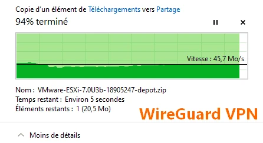


Mu bihe nk’ivyo nyene, ariko biciye ku nzira ya OpenVPN (muri UDP) kuri iyi ncuro, n’igikorwa kimwe, ubushobozi bwo gukora buratandukanye rwose: hafi 3 MB/s. Itandukaniro riri hagati y’ivyo bintu riragaragara!


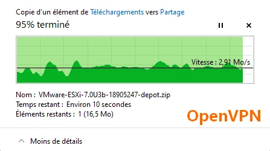


Ivyo biraryoshe, kuko iyo, nk’akarorero, uvuye ku nzira ya WiFi ukaja ku nzira ya 4G/5G, iyo nzira yo gusubira gukorana izoca yihuta cane ku buryo iyo nzira y’uguhagarara itazoboneka.


### F. Ivyiza: umugende wuzuye WireGuard


Kubera iyo nzira iriho ubu, igice c’uruja n’uruza kica kuri VPN, ibindi bica kuri Internet y’umukiriya, harimwo no guca kuri Internet. Niba dushaka guhindukira tukaja kuri WireGuard **full tunnel mode**, kugira ngo vyose bice mu tunnel ya VPN, turakeneye guhindura bikeyi ku mitunganyirize yacu....


Mbere, ukeneye gushiramwo "resolvconf" kuri:


```
sudo apt-get update
sudo apt-get install resolvconf
```


Ivyo bimaze gukorwa, ukeneye guhindura urutonde rwa "wg0.conf" ku mashini ya Debian: uhagarike Interface, uyihindure, hanyuma wongere utangure.


```
sudo wg-quick down /etc/wireguard/wg0.conf
```


Igikurikira, **mu gice ca `[Interface]`, twongerako umukozi wa DNS azokoreshwa**. Mu gihe canje, ni umugenzuzi w'itongo ryanje, ariko twoshobora kandi gushiramwo Bind9 ku mashini ya Debian kugira ngo tugire umutorera umuti wo mu karere.


```
DNS = 192.168.100.11
```


Bika dosiye, hanyuma wongere utangure Interface:


```
sudo wg-quick up /etc/wireguard/wg0.conf
```


Ubwa nyuma, mu gutegura umugende ku kibanza co gukoreramwo ca Windows 10, ukeneye guhindura igice ca "AllowedIPs" kugira ngo werekane ko vyose bitegerezwa guca muri uwo mugende. Gusubiriza:


```
AllowedIPs = 192.168.110.0/24, 192.168.100.0/24
```


Na:


```
AllowedIPs = 0.0.0.0/0
```


Ushobora kubona ko ivyo navyo bishobora gutuma habaho uburyo bwo "**Kill switch**".


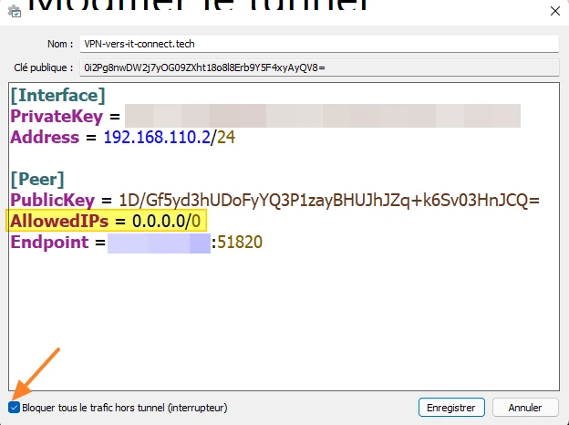


Ubwa nyuma, narakoresheje iyo tunnel yuzuye kugira ngo nkore ikigeragezo gitoyi c’uruja n’uruza, ivyo vyavuyemwo bikaba vyerekanywe aha hepfo:


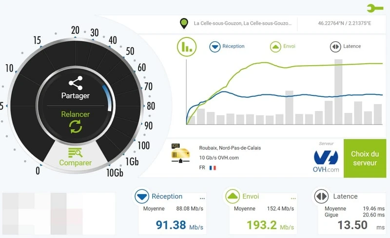


Ivyo WireGuard ikora ni vyoroshe cane kandi biroroshe gutahura, kandi ikiruta vyose ni ugubungabunga. **WireGuard ifatwa nk'akazoza ka VPNs**, rero vyoba vyiza tuyikurikiranye cane! Turashobora kandi kubona ko inyungu ari nini mu bijanye n’ubushobozi, ivyo bikaba ari akarusho kanini kuri WireGuard ugereranyije na OpenVPN.


Ibindi vyanditswe:


- [Umuntu - Itegeko wg] (ibikoresho vyo kurinda amashanyarazi/ivyerekeye/src/umuntu/wg.8)
- [Umuntu - Itegeko wg-vyihuta](https://impapuro z'abantu.debian.org/ibidashikamye/ibikoresho-vy'uburinzi bw'intsinga/wg-vyihuta.8.ru.html)


**VPN yawe ya WireGuard irakora! Urakoze cane!**