Nykypäivän verkkoselaimissa Google Chrome hallitsee yli 65 prosentin markkinaosuudellaan, mutta tämä hegemonia herättää tärkeitä kysymyksiä yksityisyydestä ja teknologisesta monimuotoisuudesta. Chrome, kuten useimmat suositut selaimet, kerää laajamittaisesti selaustietoja Googlen mainosalgoritmeja varten.

Tämän todellisuuden edessä on tulossa uusia selaimia, joilla on erilainen filosofia: modernin käyttäjäkokemuksen ja yksityisyyden suojan yhteensovittaminen. Zen Browser, joka lanseerattiin vuonna 2024, on osa tätä lähestymistapaa ja tarjoaa innovatiivisen vaihtoehdon, joka perustuu Firefoxiin mutta on suunniteltu uudelleen nykypäivän käyttäjiä varten.

Zen Browser erottuu edukseen ainutlaatuisella Interface:llä, jossa on pystysuorat välilehdet, työtilat istuntojesi järjestämiseen ja tuottavuusominaisuudet, kuten jaettu näkymä. Näiden ergonomisten innovaatioiden lisäksi siitä tekee mielenkiintoisen ennen kaikkea sen Commitment yksityisyydensuojaa kohtaan: ei telemetriaa, vahvistettu jäljittämisen estävä suojaus ja läpinäkyvä yhteisöllinen kehitys.

Tässä oppaassa selvitämme, miten Zen Browser voi muuttaa selaustapasi yhdistämällä tuottavuuden, personoinnin ja yksityisyyden.

## Zen Browserin asentaminen

### Virallinen lataus

Zen Browser on saatavilla Windowsille, macOS:lle ja Linuxille. Käy virallisella verkkosivustolla: zen-browser.app/download

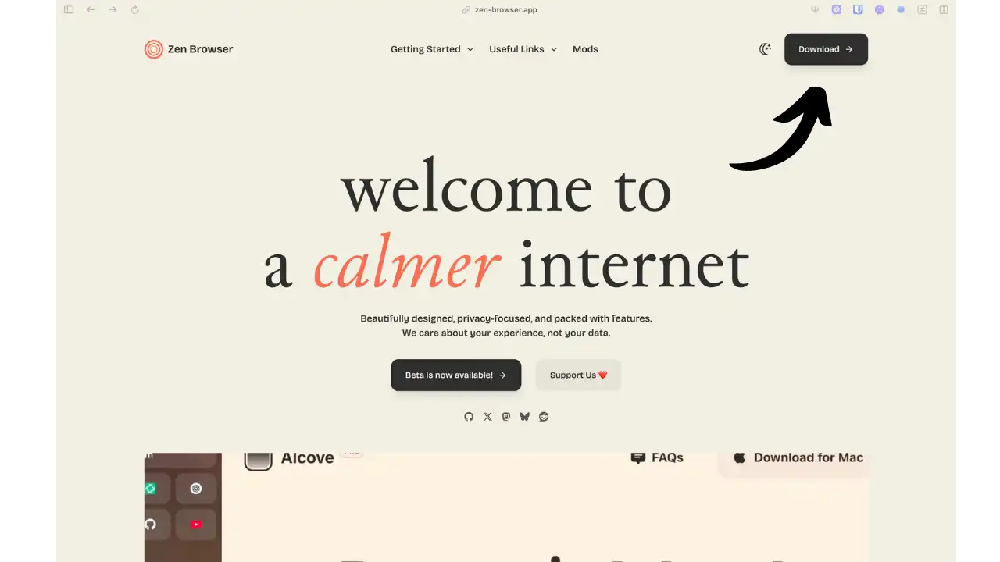

Sivusto tunnistaa järjestelmäsi automaattisesti ja ehdottaa sopivaa linkkiä:

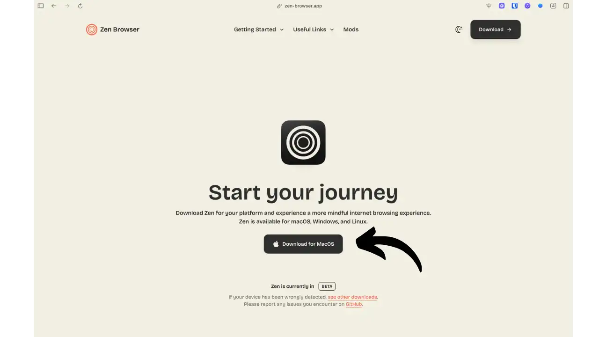

- **Windows:** .exe-asennusohjelma Windows 10/11:lle (x64- ja ARM64-versiot)
- **macOS:** Intel- ja Apple Silicon -yhteensopiva .dmg-levykuva (macOS Monterey ja uudemmat)
- **Linux:** Useita vaihtoehtoja saatavilla:
- **Flatpak** (suositellaan): zen_browser.Zen`
- **AppImage**: Kannettava, suoraan suoritettava
- **Arkisto tar.gz**: Puretaan manuaalisesti
- **AUR** (Arch Linux): Zen-selainpaketti

### Asennus vaihe vaiheelta

**Windowsissa:**

- Lataa .exe-tiedosto
- Suorita asennusohjelma (jos SmartScreen antaa hälytyksiä, valitse "Lisätietoja" ja sitten "Suorita joka tapauksessa")
- Valitse asennushakemisto
- Jätä "Käynnistä Zen Browser" rasti päälle, jotta se käynnistyy välittömästi

**MacOS:ssa:**

- Lataa .dmg-tiedosto
- Kiinnitä levykuva
- Vedä Zen Browser Sovellukset-kansioon
- Ensimmäisellä käynnistyskerralla: siirry Gatekeeperiin hiiren oikealla painikkeella > "Avaa"

**Linuxissa:**

- **Flatpak:** Automaattinen asennus paketinhallinnan kautta
- **AppImage:** `chmod +x ZenBrowser.AppImage` ja kaksoisnapsauta sitten sitä
- **tar.gz:** Pura ja suorita zen-selaimen suoritusohjelma

### Ensimmäinen käynnistys ja alustava konfigurointi

Kun Zen Browser käynnistetään ensimmäisen kerran, se opastaa sinua useiden konfigurointivaiheiden läpi:

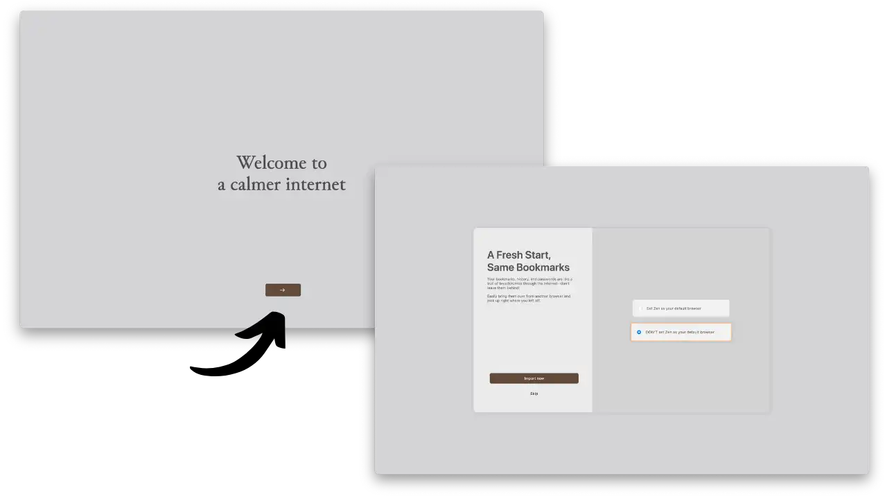

*Vapaaehtoinen tietojen tuonti toisesta selaimesta (suosikit, historia, salasanat)*

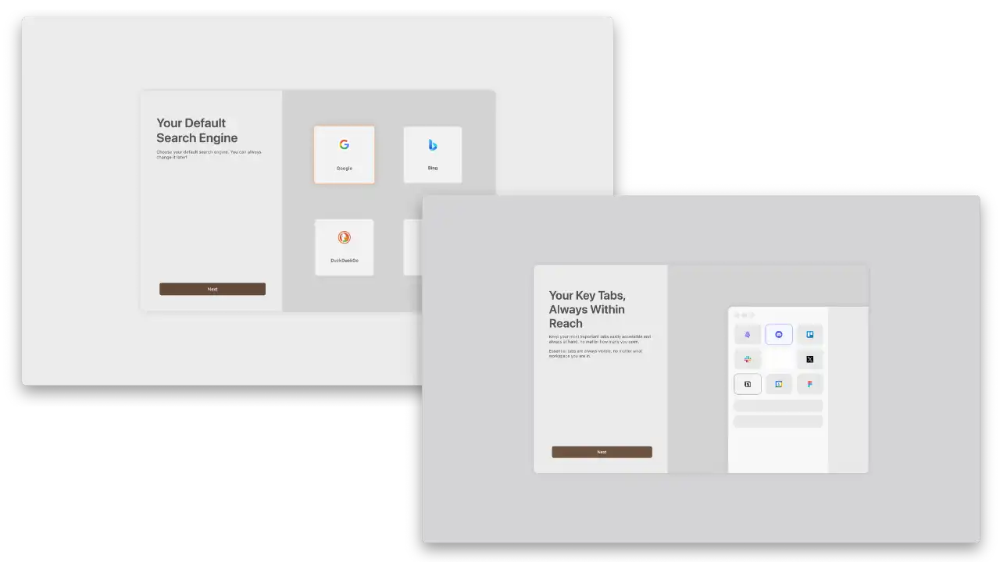

*Oletushakukoneen valinta ja pin-välilehtien konfigurointi*

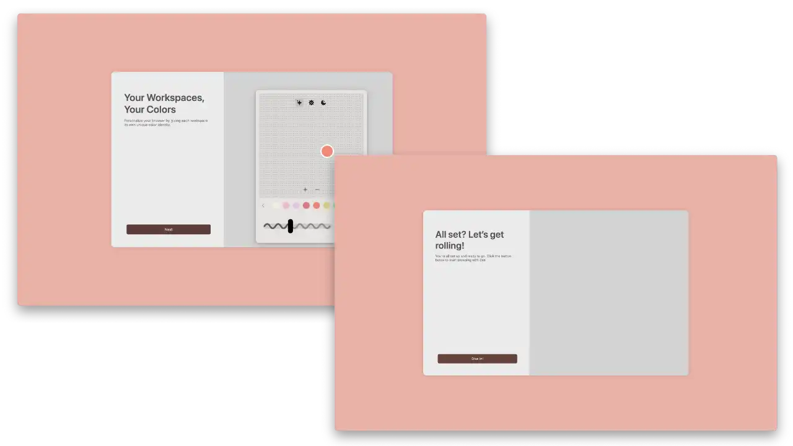

*Valitse työtilan väri ja vahvista selaimen käyttö*

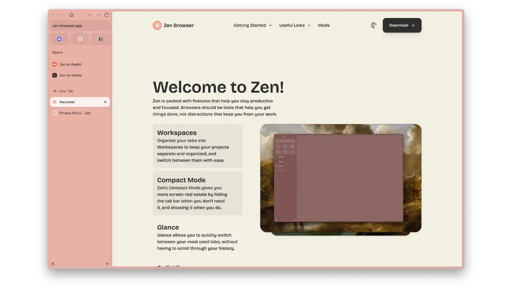

*Zen Browserin etusivu, jossa on ominainen sivupalkki*

## Zen Browserin esittely

**Zen Browser** on ilmainen ja avoimen lähdekoodin verkkoselain, joka on johdettu Mozilla Firefoxista ja jota intohimoisten vapaaehtoisten yhteisö on kehittänyt maaliskuusta 2024 lähtien. Toisin kuin suurten teknologiayritysten selaimet, Zen Browserin taustalla ei ole mitään kaupallista yritystä, vaan se rahoitetaan yksinomaan yhteisönsä panoksilla.

**Tärkeä huomautus:** Zen Browser on tällä hetkellä **Beta-versiossa**. Vaikka se on vakaa jokapäiväiseen käyttöön, voit odottaa usein tapahtuvia päivityksiä ja satunnaisia virheitä.

Hankkeen filosofia tiivistyy sen iskulauseeseen: "Tervetuloa rauhallisempaan Internetiin". Tämä lähestymistapa näkyy selaimessa, joka välittää käyttäjäkokemuksestasi pikemminkin kuin henkilökohtaisista tiedoistasi ja etsii täydellistä tasapainoa kauneuden, nopeuden ja yksityisyyden välillä.

### Tuottavuutta varten uudelleen suunniteltu Interface

Zen Browser mullistaa selailukokemuksen useilla innovaatioilla:

**Pystysuorat välilehdet:** Toisin kuin perinteiset selaimet, Zen näyttää välilehdet pystysuorassa sivupalkissa eikä vaakasuorassa. Tämä Arc Browserin innoittama ergonominen valinta maksimoi näyttötilan ja parantaa navigointia erityisesti silloin, kun sinulla on useita välilehtiä auki.

**Työtilat:** Järjestä välilehdet projektin tai teeman mukaan omiin tiloihin. Esimerkiksi "Työ"-tila ammatillisille välilehdille, "Katso"-tila lukemiselle ja niin edelleen. Voit siirtyä tilasta toiseen välittömästi.

**Split View:** Näyttää useita sivustoja vierekkäin yhdessä ikkunassa, mikä on ihanteellinen tietojen vertailuun tai useiden lähteiden samanaikaiseen käsittelyyn.

**Glance:** Voit esikatsella linkkiä nopeasti tilapäisessä modaalisessa ikkunassa avaamatta uutta välilehteä, mikä on täydellinen tapa tutustua viitteeseen menettämättä asiayhteyttä.

### Tietosuoja oletusarvoisesti

Zen Browser integroi luonnostaan vahvan yksityisyydensuojan:

- **Parannettu jäljityksen esto:** Automaattinen jäljittäjien, kolmannen osapuolen evästeiden ja sormenjälki-skriptien esto
- **Telemetria pois käytöstä:** Ulkoisille palvelimille ei lähetetä tietoja
- **DNS over HTTPS:** Salaa DNS-pyynnöt valvonnan estämiseksi
- **Vähennetyt Google-riippuvuudet:** Zen Browser poistaa useimmat yhteydet Googlen palveluihin, vaikka osa niistä voi säilyä (suojattu selaus, päivitykset)

### Kehittynyt räätälöinti Zen Modsilla

Zen tarjoaa ainutlaatuisen muokkausekosysteemin **Zen Mods**: galleria yhteisön luomia teemoja ja muokkauksia, jotka muuttavat selaimen ulkoasua ja käyttäytymistä.

**Suositeltavat Zen-modit:**

- **SuperPins** ⭐: Muunna kiinnitetyt välilehdet tyylitellyiksi painikkeiksi ammattimaisemman Interface-lookin aikaansaamiseksi
- **Yhteenkuuluvuus**: Johdonmukainen, läpinäkyvä muotoilu, joka yhdistää URL-palkin, sivupalkin ja kirjanmerkit
- **Parempi löytää baari**: Siirtää hakupalkin yläreunaan paremman ergonomian vuoksi
- **Sivupalkin laajentaminen leijailemalla**: Automaattinen sivupalkin laajennus leijaillessa, maksimoi näyttötilan
- **Paremmat lataamattomat välilehdet**: Optimoi muistinhallinnan visuaalisten indikaattoreiden avulla inaktiivisille välilehdille
- **Puhdistettu URL-palkki**: Interface puhdistettu Address-palkki, poistaa ylimääräisen Elements:n
- **Läpinäkyvä Zen**: tyylikkäät läpinäkyvyystehosteet sulavilla animaatioilla

**Zen Modin asennus:**

- Siirry [viralliseen Zen Mods -galleriaan](https://zen-browser.app/mods)
- Selaa saatavilla olevien teemojen galleriaa

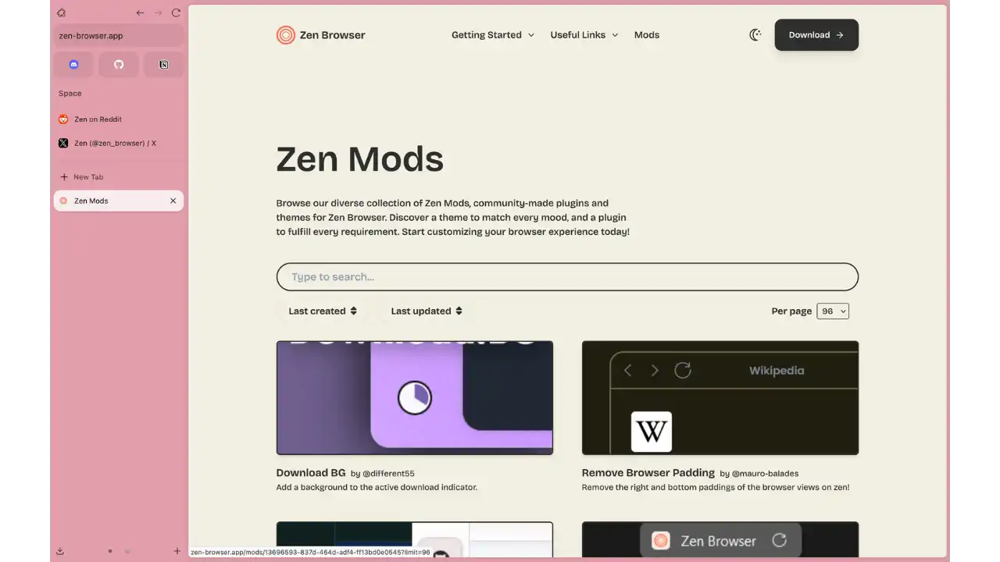

- Klikkaa "Install" haluamasi modin kohdalla

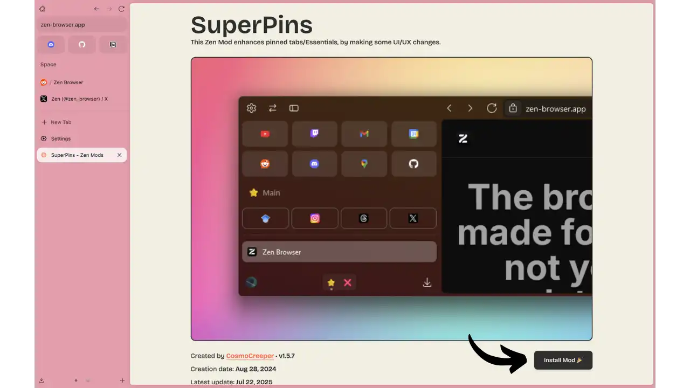

*Esimerkki: Suosittujen SuperPins*-modien asentaminen

- Teemaa sovelletaan välittömästi
- Voit poistaa sen käytöstä tai kokeilla muita milloin tahansa

Zen-modit eivät rajoitu pelkästään visuaalisiin teemoihin: jotkin niistä muuttavat Interface:n käyttäytymistä (animaatiot, elementtien asettelu, mukautetut pikakuvakkeet). Tämän modulaarisen lähestymistavan ansiosta jokainen käyttäjä voi luoda oman ihanteellisen selainympäristönsä.

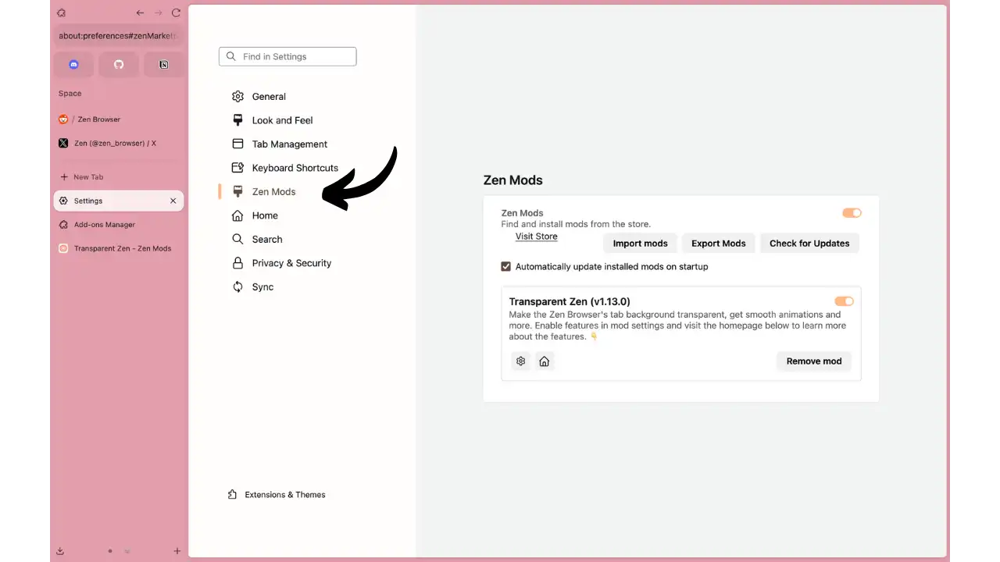

*Interface parametreihin asennettujen Zen-modien hallintaan*

**⚠️ Tärkeä huomautus personoinnista ja sormenjäljistä:**

Mitä enemmän muokkaat Zen Browseria (teemat, laajennukset, modit), sitä enemmän **digitaalisesta jalanjäljestäsi** tulee ainutlaatuinen ja siten jäljitettävissä. Se on perustavanlaatuinen kompromissi:

- **Maksimaalinen personointi** = Optimaalinen käyttäjäkokemus MUTTA ainutlaatuinen, helposti tunnistettava painatus
- **Oletuskonfiguraatio** = Yleisempi jalanjälki, mutta vähemmän yksilöllinen kokemus

Zen Browser on valinnut käyttäjäkokemuksen täydellisen anonymiteetin sijaan. Jos etusijalla on ehdoton anonymiteetti, suosi Tor Browseria tai Mullvad Browseria, jotka asettavat kaikille käyttäjille yhdenmukaiset asetukset.

Koska Zen perustuu Firefoxiin, se on yhteensopiva koko Firefoxin laajennusekosysteemin kanssa.

## Edut ja haitat

### ✅ Kohokohdat

- **Privacy by design:** Seurantasuojaus aktiivinen, telemetria pois käytöstä, ei tiedonkeruuta
- **Innovatiivinen Interface:** Pystysuorat välilehdet, työtilat ja jaettu näkymä parantavat tuottavuutta merkittävästi
- **Nopeat päivitykset:** Synkronointi Firefoxin kanssa alle 72 tunnissa tietoturvakorjausten osalta
- **Kehittynyt muokkaus:** Yhteisön teemat, hienosäätö, Firefox-laajennusten yhteensopivuus
- **Avoin lähdekoodi ja yhteisö:** Läpinäkyvä koodi, yhteistoiminnallinen kehitys, riippumattomuus suurista teknologiayhtiöistä

### ❌ Nykyiset rajat

- **Ei mobiiliversiota:** Saatavilla vain PC-tietokoneissa (Windows, macOS, Linux)
- **DRM-yhteensopimattomuus:** Netflix, Disney+, Spotify ja muut suoratoistopalvelut eivät tällä hetkellä toimi
- **Nuori projekti:** Pieni tiimi, yhteisön tuki, satunnaisia virheitä
- **Oppimiskäyrä:** Interface erilainen, vaakasuoriin välilehtiin tottuneilta vaaditaan sopeutumista

## Edistynyt konfigurointi yksityisyyttä ja turvallisuutta varten

Pääset Zen Browserin asetuksiin:

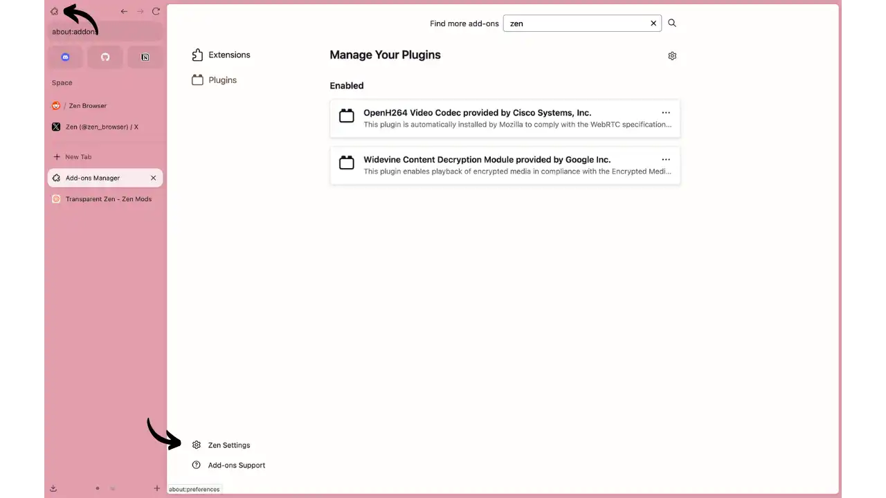

*Napsauta palapelin kuvaketta (laajennukset) ja sitten "Zen-asetukset" alareunassa*

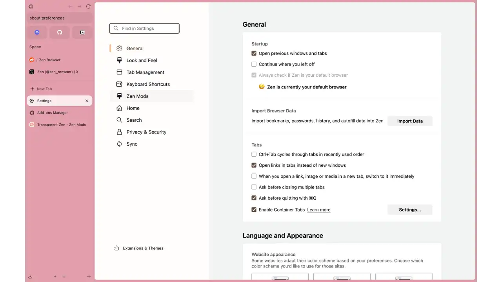

*Zen-parametrien yleisnäkymä, jossa on kaikki käytettävissä olevat välilehdet*

### Optimoidut oletusasetukset

Zen Browser käyttää alusta alkaen korkean yksityisyydensuojan asetuksia, jotka ovat useimpia selaimia paremmat:

- **Tiukka jäljityksenestosuojaus:** "Standard" -taso on oletusarvoisesti aktivoitu ja estää:
  - Sivustojen väliset seurantaevästeet ja supercookiet
  - Mainosten seurantasarjat (Google Analytics, Facebook Pixel jne.)
  - Kryptominterit, jotka käyttävät suorittimesi Miner-kryptovaluuttojen käyttämiseen
  - Sormenjälkien ottaminen Canvasin, WebGL:n ja AudioContextin avulla

- **Evästeiden täydellinen eristäminen:** First Party Isolation estää yhtä sivustoa lukemasta toisen evästeitä
- **Telemetria suurelta osin poistettu käytöstä:** Suurin osa tiedonkeruusta on poistettu, vaikka jotkin yhteydet Mozilla/Google-palveluihin saattavat säilyä ja vaatia manuaalista lisämääritystä
- **Suojattu DNS oletusarvoisesti:** DNS-over-HTTPS käytössä pyyntöjen vakoilun estämiseksi
- **HTTPS-Only käytössä:** Pakottaa salatut yhteydet kaikille sivustoille

### Suositellut yksityisyysasetukset

**1. Valitse jäljittämisen estävä suojaustaso:**

Asetukset > Tietosuoja ja turvallisuus > Parannettu jäljityssuojaus

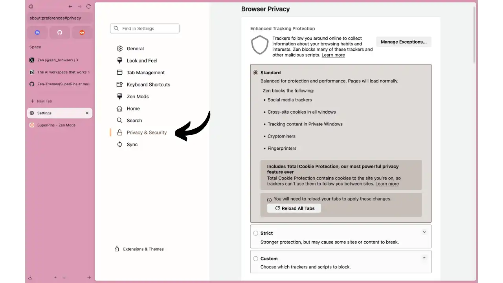

**Standardi (suositeltu oletusarvo):**

- Suojauksen ja suorituskyvyn välinen tasapaino, sivut latautuvat normaalisti
- Estää: sosiaaliset seurantalaitteet, ristikkäiset evästeet, sisällön seuranta yksityisissä ikkunoissa, kryptomining, sormenjälkitunnisteet
- Sisältää **Total Cookie Protection**: eristää evästeet sivustokohtaisesti estääkseen sivustojen välisen seurannan

**Strict (maksimaalinen suojaus):**

- Parannettu suojaus, mutta saattaa rikkoa tietyt sivustot tai sisällön
- Estää: sosiaaliset seurantalaitteet, ristikkäiset evästeet, sisällön seuranta **kaikissa** ikkunoissa, tunnetuissa ja epäillyissä selaimissa
- Suositellaan kokeneille käyttäjille

**Räätälöity (rakeinen ohjaus):**

- Valitse tarkasti, mitkä seurantalaitteet ja skriptit haluat estää
- Erilliset vaihtoehdot: Tunnetut/epäillyt seurantalaitteet, Evästeet, Seurantasisältö, Kryptomining
- Ihanteellinen hienosäätöä varten

**2. Vaihda hakukonetta:**

Asetukset > Haku > Oletushakukone:

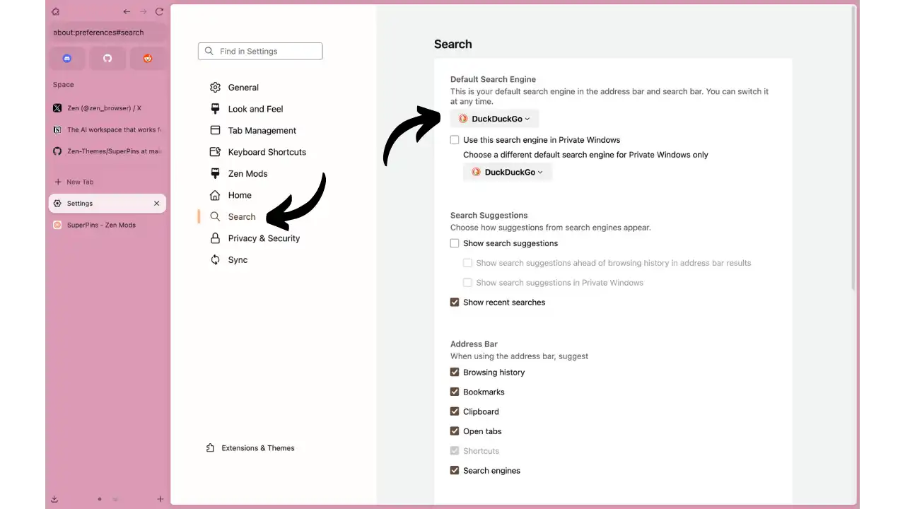

- **DuckDuckGo**: Ei profilointia, ei suodatinkuplia, neutraalit tulokset
- **Startpage**: anonymisoidut Google-tulokset, Alankomaissa (RGPD)
- **Searx**: Hajautettu metahakukone, ei lokeja, avoin lähdekoodi
- **Rohkea haku**: Riippumaton indeksi, ei Google
- **Vältä**: Google, Bing, Yahoo (massiivinen tiedonkeruu)

**3. Määritä suojattu DNS (DNS over HTTPS):**

Asetukset > Tietosuoja ja suojaus > DNS HTTPS:n kautta (sivun alareuna)

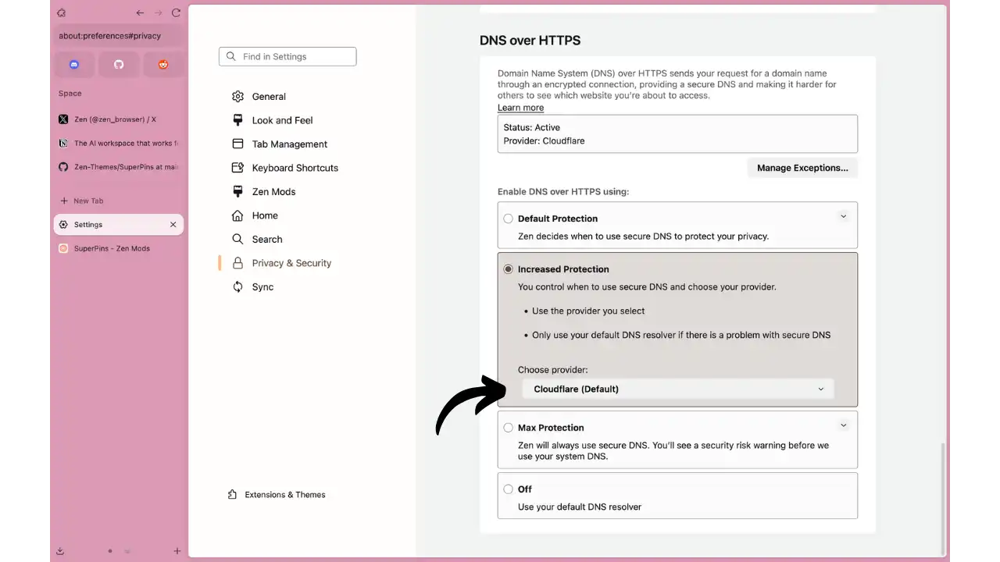

**Default Protection:**

- Zen päättää automaattisesti, milloin käyttää suojattua DNS:ää
- Käytä suojattua DNS:ää alueilla, joilla se on käytettävissä
- Paluu oletus-DNS:ään, jos ongelma on turvallisen palveluntarjoajan kanssa
- Deaktivoituu automaattisesti VPN:n, lapsilukkojen tai yrityskäytäntöjen avulla

**Lisätty suojaus (suositellaan):**

- Sinä päätät, milloin käytät suojattua DNS:ää ja valitset palveluntarjoajan
- Käyttää valittua palveluntarjoajaa ja tarvittaessa DNS-järjestelmän varajärjestelmää
- **Oletuspalveluntarjoaja:** Cloudflare (nopeat, anonymisoidut lokit)
- **Vaihtoehdot:** Vaihda Quad9, NextDNS saatavuuden mukaan

**Max Protection (edistyneet käyttäjät):**

- Zen käyttää **aina** vain suojattua DNS:ää
- Turvallisuusvaroitus ennen DNS-järjestelmän käyttöä
- **Varoitus:** Sivustot eivät ehkä lataudu, jos suojattu DNS ei ole käytettävissä

**4. Ota vain HTTPS-tila käyttöön:**

Asetukset > Tietosuoja ja suojaus > Vain HTTPS-tila > **Käytössä**

- Pakota kaikki yhteydet HTTPS:ään
- Hälytys, jos sivusto tukee vain HTTP:tä

**5. Hallitse oletusoikeuksia:**

Asetukset > Tietosuoja ja turvallisuus > Käyttöoikeudet:

- **Sijainti**: Block (paitsi korttipalvelut)
- **Kamera/mikrofoni**: Lohko (sallitaan tapauskohtaisesti)
- **Ilmoitukset**: Estää (estää roskapostin)
- **Automaattinen toisto**: Estää äänen ja videon

### Suositellut turvajatkokset

**Välttämättömät laajennukset:**

- **uBlock Origin**: Tehokkain mainosten esto ja jäljitin
  - Suositeltavat luettelot: Peter Lowen mainos- ja seurantapalvelinluettelo: EasyList, EasyPrivacy, Peter Lowen mainos- ja seurantapalvelinluettelo
  - Edistynyt tila kokeneille käyttäjille

- **ClearURLs**: Poistaa URL-seurantaparametrit (utm_source, fbclid jne.)
- **Cookie AutoDelete**: poistaa evästeet ja selaustiedot automaattisesti, kun välilehti suljetaan
- **Decentraleyes**: Tarjoaa JS-kirjastot paikallisesti Googlen/Cloudflaren CDN:ien välttämiseksi

**Edistyneet laajennukset (kokeneet käyttäjät):**

- **NoScript**: Rakeinen JavaScript-ohjaus (voi rikkoa monia sivustoja)
- **Privacy Badger** (EFF): Seurantaohjelmien käyttäytymiseen perustuva havaitseminen
- **Väliaikaiset säiliöt**: Eristä kukin välilehti erilliseen säiliöön

## DRM:n puuttumisen ymmärtäminen Zen Browserissa

### Mikä on DRM?

**DRM:t (Digital Rights Management)** ovat suojaustekniikoita, jotka salaavat digitaalisen sisällön kopioinnin estämiseksi. Ne edellyttävät omaa selainmoduulia (kuten **Google Widevine**) suojatun median salauksen purkamiseen ja lukemiseen.

**Palvelut, jotka vaativat DRM:ää:**

- **Videon suoratoisto:** Netflix, Disney+, HBO Max, Amazon Prime Video
- **Premium-musiikki:** Spotify Premium, YouTube Music, Deezer
- **Verkkokoulutus:** Udemy, Coursera (suojatut videot)

### Miksi Zen Browserissa ei ole DRM:ää

**Pääsyyt:**

1. **Kustannukset ja monimutkaisuus:** Google Widevine -lisenssit eivät ole ilmaisia, ja ne edellyttävät hankalaa hyväksymisprosessia

2. **Projektin filosofia:** DRM on omistusoikeudellinen "musta laatikko", joka ei ole yhteensopiva avoimen lähdekoodin lähestymistavan ja Googlesta riippumattomuuden kanssa

3. **Resurssien rajallisuus:** Tiimi keskittyy Interface-innovaatioihin ja luottamuksellisuuteen

### Käytännön vaikutus

**❌ Palvelut, joihin ei pääse käsiksi:**

Netflix, Disney+, Spotify Premium, YouTube Premium, maksulliset Udemy/Coursera-koulutukset

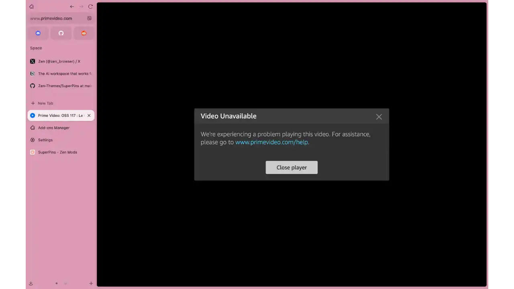

*Tyypillinen virheilmoitus, kun yritetään toistaa DRM-suojattua sisältöä*

**✅ Toiminnalliset palvelut:**

Ilmainen YouTube, Twitch, Vimeo, uutissivustot, sosiaaliset verkostot ja podcastit

**Bypass-ratkaisut:**

- Käytä Firefoxia/Chromea vain suoratoistoon
- Natiivit sovellukset (Netflix, Spotify)
- Valitse DRM-vapaata sisältöä (YouTube, Twitch, Bandcamp, PeerTube)

**Nykytilanne:** Zen-tiimi on aloittanut Widevine-lisenssin hankkimisen, mutta aikataulua ei ole annettu. Prosessi riippuu täysin Googlen hyväksynnästä.

## Päivittäinen käyttö

### Interface ja navigointi

**Sivupalkki:**

- Kunkin sivun otsikko ja pikkukuva
- +"-painike uusia välilehtiä varten
- Vedä-ja-pudota uudelleenjärjestely
- Kontekstiherkät toiminnot: kopiointi, sulkeminen, siirtäminen hiiren oikealla napsautuksella

**Työalueet:**

- Valitsin sivupalkin yläosassa
- Teemoitettujen alueiden luominen
- Nopea vaihtaminen kontekstien välillä
- Kiinnitetyt välilehdet käytettävissä kaikissa tiloissa

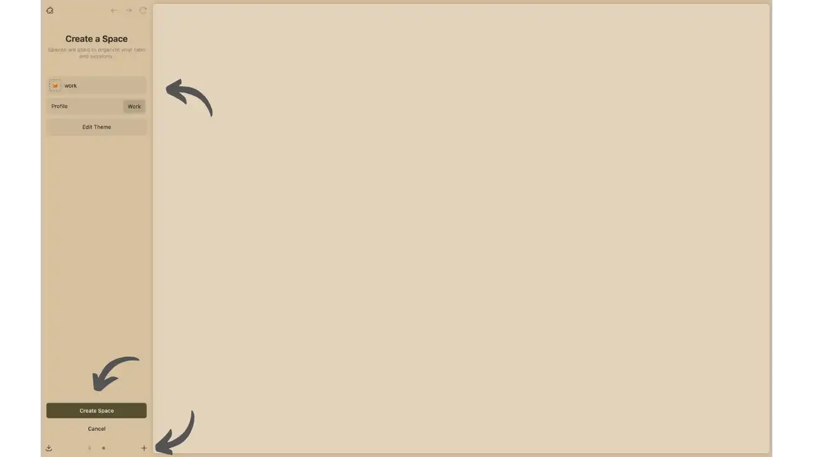

*Interface uuden työtilan luomiseksi*

**Lisäominaisuudet:**

- **Jaettu näkymä**: Valitse useita välilehtiä > napsauta hiiren kakkospainikkeella > "Split x tabs"
- **Vilkaisu**: Alt + klikkaa linkkiä esikatselua varten

### Hyödylliset pikanäppäimet

- ctrl+T`: Uusi välilehti
- ctrl+Space`: Työtilan valikko
- ctrl+B`: Näytä/piilota sivupalkki
- ctrl+Shift+P`: Yksityinen ikkuna
- alt+klikkaa`: Glance (esikatselu)

### Parhaat käytännöt

- **Järjestä tilasi**: Luo teemoitettuja tiloja (työ, kello, henkilökohtainen)
- **Käytä kiinnitettyjä välilehtiä**: Eniten vierailtuja sivustoja varten
- Hyödynnä **Split View**: Ihanteellinen monitoimityöskentelyyn suurilla näytöillä
- **Pysy ajan tasalla**: Tarkista säännöllisesti päivitykset
- Tutustu **Zen-moodeihin**: muokkaa ulkoasua oman makusi mukaiseksi

## Päätelmä

Zen Browser on raikas tuulahdus verkkoselaimien ekosysteemissä. Yhdistämällä innovatiivisen ja tuottavan Interface:n ja yksityisyydensuojan tiukan kunnioittamisen se tarjoaa uskottavan vaihtoehdon teknologiajättien selaimille.

Sen pystysuorat välilehdet ja työtilat todella muuttavat selailukokemuksen niille, jotka jonglööraavat useita projekteja. Sen "no Google" -filosofia ja yhteisöllinen kehitys tekevät siitä johdonmukaisen valinnan käyttäjille, jotka ovat huolissaan digitaalisesta riippumattomuudestaan.

Vaikka sillä on vielä muutamia rajoituksia (ei mobiililaitteita, DRM puuttuu), Zen Browser on riittävän kypsä jokapäiväiseen käyttöön, ja se kehittyy nopeasti aktiivisen yhteisönsä ansiosta.

Bitcoinin käyttäjille ja tekniikan käyttäjille, jotka arvostavat sekä tuottavuutta että yksityisyyttä, Zen Browser on ehdottomasti kokeilemisen arvoinen. Saatat hyvinkin omaksua tämän uuden, rauhallisemman ja tehokkaamman tavan selata.

## Resurssit

### Viralliset linkit

- [Zen Browserin virallinen verkkosivusto](https://zen-browser.app)
- [Täydellinen dokumentaatio](https://docs.zen-browser.app)
- [GitHub-lähdekoodi](https://github.com/zen-browser/desktop)
- [Lataa sivu](https://zen-browser.app/download)

### Yhteisö ja tuki

- [Virallinen Discord](https://discord.gg/zen-browser)
- [Reddit r/zen_browser](https://reddit.com/r/zen_browser)
- [Zen Mods Gallery](https://zen-browser.app/mods)