Vous le savez sans doute, Plan ₿ Academy est la plus vaste base de données éducative dédiée à Bitcoin, regroupant des cours, des tutoriels et des milliers de ressources publiées sous licence libre. À l’origine, Plan ₿ Academy est un site web. Mais que se passerait-il si vous ne pouviez plus y accéder normalement, par exemple en cas de censure ?

Dans ce tutoriel, nous allons apprendre à faire tourner la plateforme **Plan ₿ Academy** de manière réellement incensurable grâce à **Pears**, une technologie pair-à-pair (P2P) développée par **Holepunch** et soutenue par **Tether**.

Pears est donc le logiciel qui va nous permettre de faire fonctionner la plateforme Plan ₿ Academy sans dépendre d’un site web centralisé. Dans ce tutoriel, nous allons donc installer Pears sur votre ordinateur afin d’accéder à Plan ₿ Academy via Pears.

L’objectif de Pears est simple : rendre possible la diffusion et l’utilisation d’applications web sans dépendre d’aucune infrastructure centralisée (ni serveurs, ni hébergeurs, ni intermédiaires). En d’autres termes, même si un fournisseur de cloud ferme ou qu’un pays bloque un domaine, l’application continue de vivre entre les pairs du réseau. C’est cette approche qui permet à notre plateforme éducative Plan ₿ Academy de rester accessible partout dans le monde, sans point unique de défaillance.

---

**TL;DR :**

- Installez Pears ;

- Exécutez la commande suivante pour lancer l’application Plan ₿ Academy :

```shell
pear run pear://k9cawqdsan3bkobkigesuyfeqjcasi49ikjaru5cipap835t7nwy
```

---

## 1. Installer Pears 

### 1.1. Qu’est-ce que Pears ?

Pears est à la fois un environnement d’exécution, un outil de développement et une plateforme de déploiement pour des applications pair-à-pair. Cet outil open-source permet de construire, partager et exécuter des logiciels sans serveur et sans infrastructure, directement entre utilisateurs. Concrètement, cela signifie qu’au lieu d’héberger une application sur un serveur central, chaque utilisateur devient un nœud du réseau : il partage une partie de l’application et des données avec d’autres pairs. L’ensemble du système forme un réseau distribué où chaque instance coopère pour maintenir le service accessible.

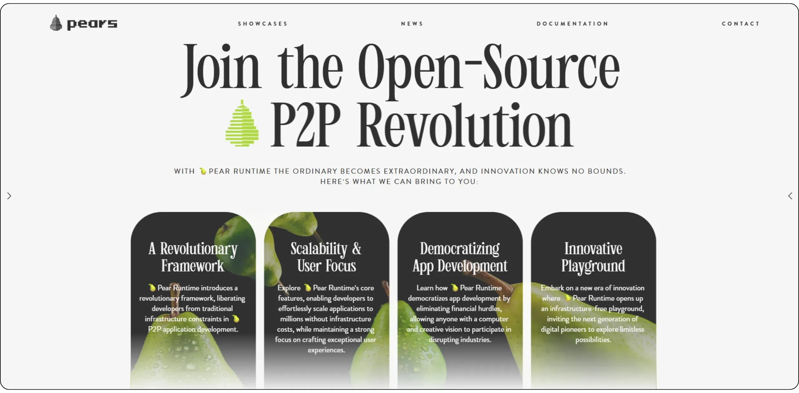

Cette approche repose sur un ensemble de briques logicielles modulaires développées par Holepunch :
- **Hypercore** : un journal distribué qui garantit la cohérence et la sécurité des données sans base de données centrale.
- **Hyperbee** : un indexeur au-dessus d’Hypercore, qui permet d’organiser et de parcourir les données de façon efficace.
- **Hyperdrive** : un système de fichiers distribué qui est utilisé pour stocker et synchroniser les fichiers d’une application entre les pairs.
- **Hyperswarm** et **HyperDHT** : des couches réseau qui permettent la découverte et la connexion entre les pairs dans le monde entier, sans serveur central.
- **Secretstream** : un protocole de chiffrement E2E pour sécuriser les échanges entre deux pairs.

En combinant ces composants, Pears permet de créer des applications autonomes, chiffrées et distribuées, où chaque utilisateur participe activement au réseau. Cette architecture décentralisée élimine les coûts d’infrastructure, les risques de censure et les SPOF ("*Single Point of Failure*").

Pears est développé par Holepunch, une entreprise fondée par Mathias Buus et Paolo Ardoino (CEO de Tether et CTO de Bitfinex), avec la mission d’étendre la logique du pair-à-pair au-delà de Bitcoin. Leur ambition est de bâtir l’"*Internet des pairs*", où chaque application peut fonctionner sans autorisation, sans serveurs, et sans intermédiaire. Holepunch est déjà à l’origine de **Keet**, une application de visioconférence et de messagerie entièrement P2P.

https://planb.academy/tutorials/computer-security/communication/keet-efdb759d-5e94-4bbf-b28c-5fa8669c809b

*Ce tutoriel d'installation de Pears est divisé en plusieurs sections selon votre système d’exploitation. Rendez-vous directement à celle qui correspond à votre environnement pour suivre les instructions adaptées :*
- **Linux (Debian)** → Partie **1.2.**
- **Windows** → Partie **1.3.**
- **macOS** → Partie **1.4.**


### 1.2. Comment installer Pears sur Linux (Debian) ?

L’installation de Pears sur un Debian est relativement simple, mais nécessite quelques prérequis que nous allons détailler dans cette section.

#### 1.2.1. Mettre à jour le système

Avant toute chose, il est important de s’assurer que votre système est à jour.

```bash
sudo apt update && sudo apt upgrade -y
```


#### 1.2.2. Installer les dépendances

Pears repose sur certaines bibliothèques système, notamment `libatomic1`, utilisée par le moteur d’exécution JavaScript Bare. Installez-la avec la commande suivante :

```bash
sudo apt install -y libatomic1 curl git
```

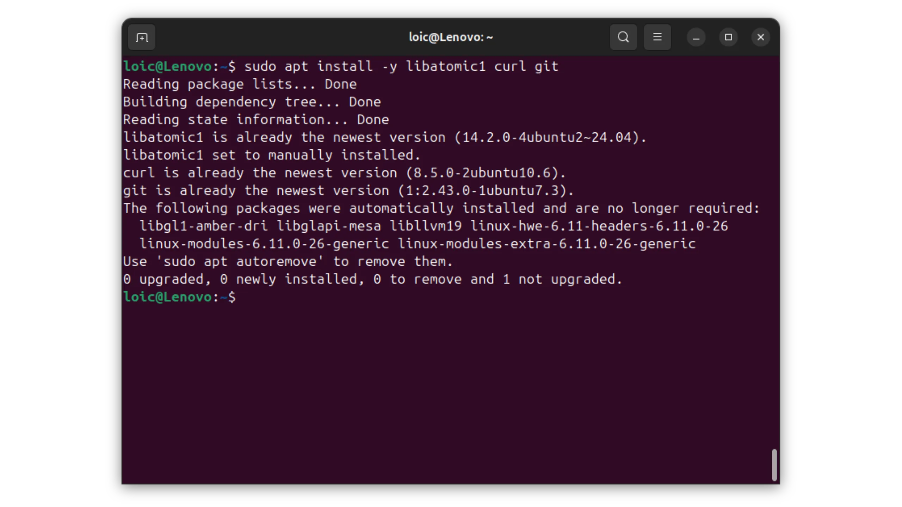

#### 1.2.3. Installer Node.js et npm via NVM

Pears est distribué via *npm*, le gestionnaire de paquets *Node.js*. Même si Pears ne dépend pas directement de *Node.js* pour fonctionner, celui-ci est nécessaire à l’installation. La méthode recommandée pour installer *Node.js* sur Linux est *NVM* (*Node Version Manager*), qui permet de gérer plusieurs versions de Node en parallèle.

```bash
curl -o- https://raw.githubusercontent.com/nvm-sh/nvm/master/install.sh | bash
```

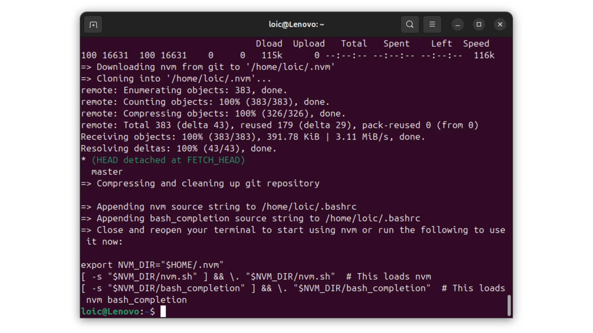

Ensuite, rechargez votre terminal pour activer *NVM* :

```bash
source ~/.bashrc
```


Vérifiez que *NVM* est bien installé :

```bash
nvm --version
```


Installez ensuite une version stable de *Node.js* (par exemple la LTS actuelle) :

```bash
nvm install --lts
```

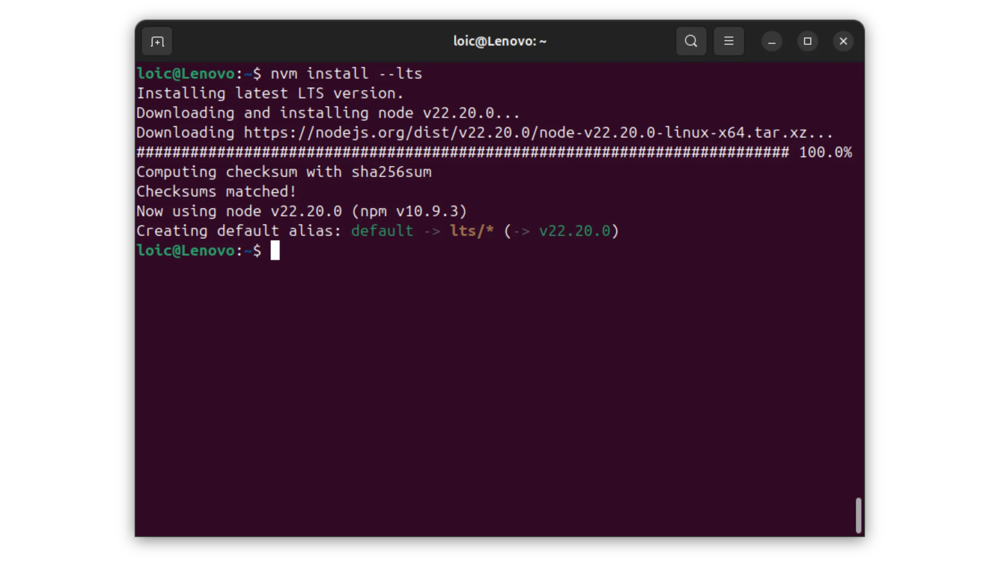

Vérifiez les installations de *Node.js* et *npm* :

```bash
node -v
npm -v
```

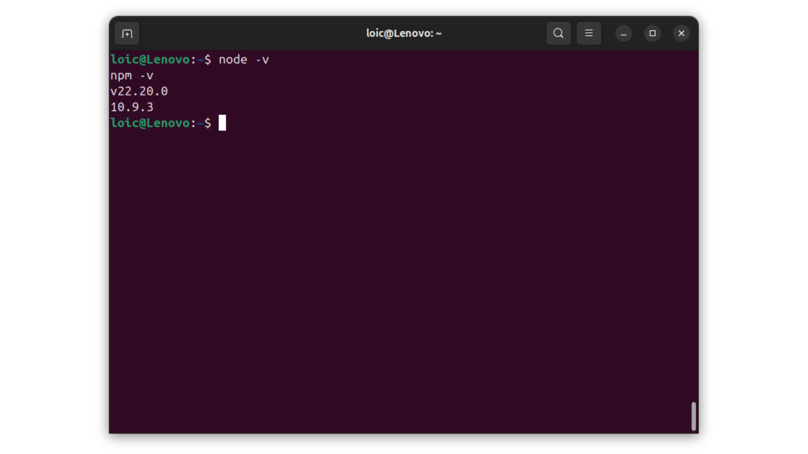

#### 1.2.4. Installer Pears avec npm

Une fois *npm* disponible, vous pouvez installer Pears CLI globalement sur votre système. Cela vous permettra d’exécuter la commande `pear` depuis n’importe quel répertoire.

```bash
npm install -g pear
```


#### 1.2.5. Initialiser Pears

Après l’installation, lancez simplement la commande suivante dans votre terminal :

```bash
pear
```

Lors du premier démarrage, Pears va se connecter au réseau pair-à-pair pour télécharger les composants nécessaires. Ce processus ne nécessite aucun serveur central : les fichiers sont obtenus directement depuis d’autres pairs.  

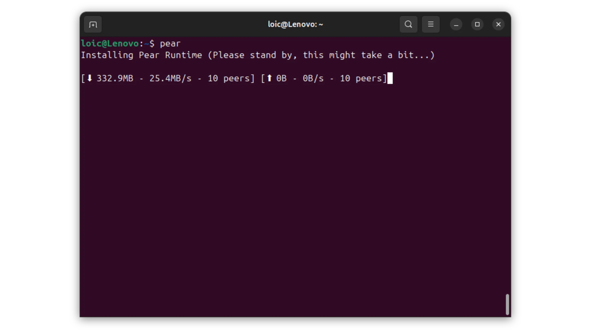

Une fois le téléchargement terminé, relancez la commande pour vérifier que tout fonctionne :

```bash
pear
```


Si tout est correctement installé, l’aide de Pears s’affichera avec la liste des commandes disponibles.

#### 1.2.6. Tester Pears avec Keet

Pour vérifier que Pears est pleinement opérationnel, vous pouvez lancer une application P2P déjà disponible sur le réseau, comme Keet, le logiciel de messagerie et visioconférence open-source de Holepunch.

```bash
pear run pear://keet
```

Cette commande charge l’application Keet directement depuis le réseau Pears, sans passer par un serveur central. Si Keet se lance correctement, cela signifie que votre installation de Pears est pleinement fonctionnelle.

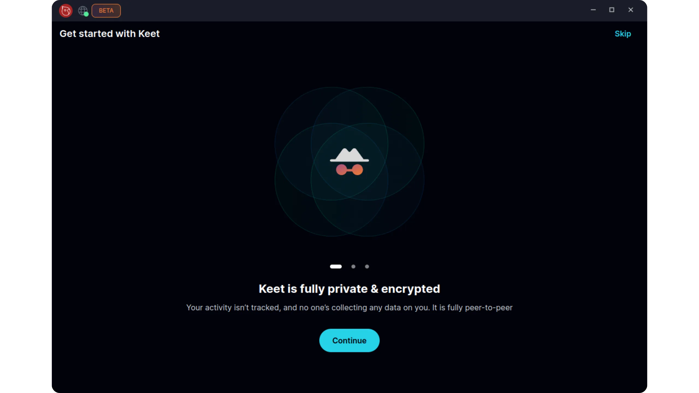

Votre système Linux est désormais prêt à exécuter et héberger des applications pair-à-pair avec Pears.

### 1.3. Comment installer Pears sur Windows ?

L’installation de Pears sur Windows est tout aussi simple que sur Linux, mais nécessite quelques outils spécifiques.

*Si vous utilisez Linux et avez déjà installé Pears, vous pouvez passer directement à l'**étape 2**.*

#### 1.3.1. Ouvrir PowerShell en mode administrateur

Avant toute chose, lancez PowerShell avec les droits administrateur :
- Cliquez sur le menu Démarrer ;
- Tapez PowerShell ;
- Faites un clic droit sur "*Windows PowerShell*" ;
- Sélectionnez "*Exécuter en tant qu’administrateur*".

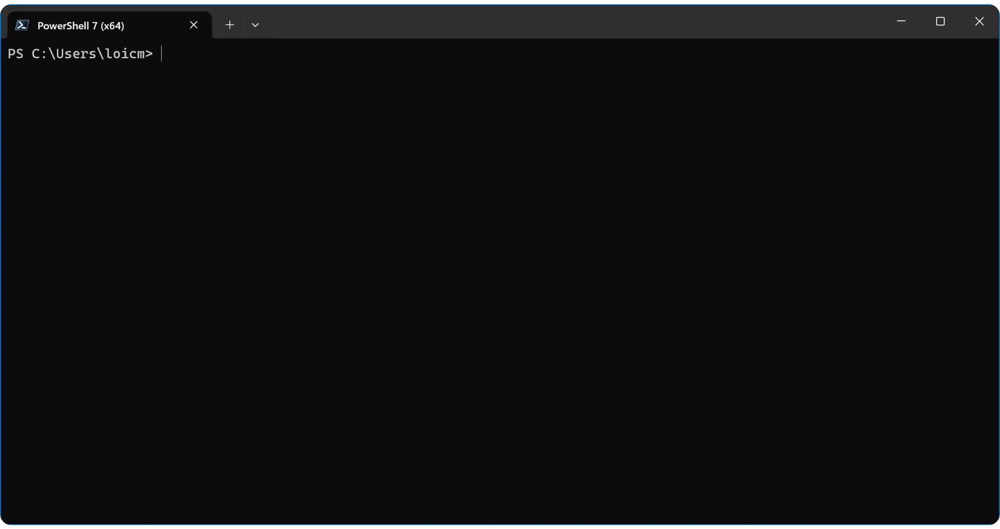

#### 1.3.2. Télécharger NVS

Pears s’installe via *npm*, le gestionnaire de paquets de *Node.js*. Sur Windows, la méthode recommandée par Holepunch consiste à utiliser *NVS* (*Node Version Switcher*), plus stable que *NVM* sur ce système.

Dans PowerShell, exécutez la commande suivante pour installer la dernière version de *NVS* :

```PowerShell
winget install jasongin.nvs
```

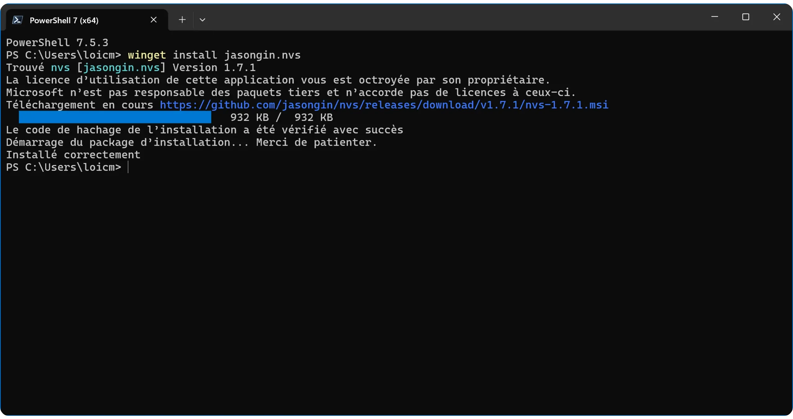

#### 1.3.3. Installer Node.js

Après l’installation, redémarrez PowerShell, puis saisissez la commande suivante :

```powershell
nvs
```

Vous devriez voir apparaître la liste des versions de *Node.js* disponibles. Sélectionnez la première en appuyant sur la touche `a` de votre clavier.

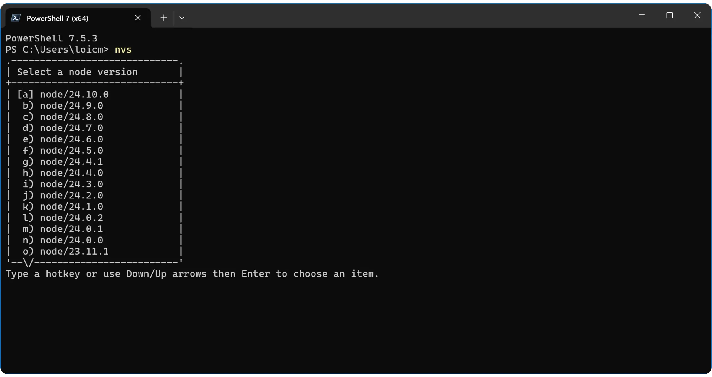

*Node.js* est bien installé.


#### 1.3.4. Vérifier les installations

Assurez-vous que *Node.js* et *npm* sont accessibles :

```powershell
node -v
npm -v
```

Les deux commandes doivent renvoyer un numéro de version.


#### 1.3.5. Installer Pears avec npm

Une fois *Node.js* et *npm* disponibles, installez **Pears CLI** globalement sur votre système :

```powershell
npm install -g pear
```

Cela installera le binaire `pear` dans votre répertoire *npm* global.


#### 1.3.6. Vérifier et initialiser Pears

Une fois l’installation terminée, exécutez :

```powershell
pear
```

Lors du premier lancement, Pears téléchargera automatiquement les composants nécessaires depuis le réseau pair-à-pair. Ce processus peut durer quelques instants.

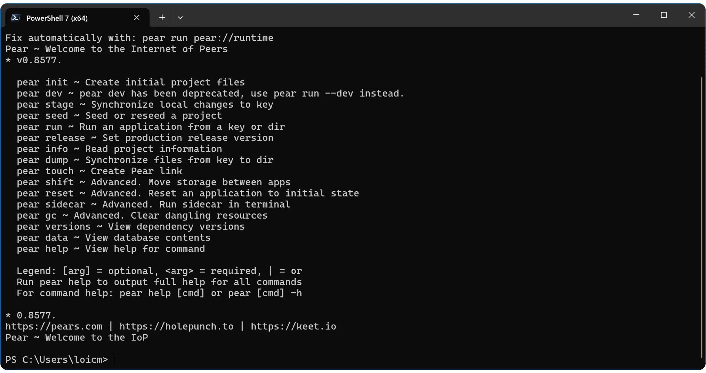

Si tout s’est bien déroulé, vous devriez voir apparaître l’aide du CLI Pears avec la liste des sous-commandes disponibles (run, seed, info...).

#### 1.3.7. Tester Pears avec Keet

Pour vérifier que Pears est pleinement opérationnel, vous pouvez lancer une application P2P déjà disponible sur le réseau, comme Keet, le logiciel de messagerie et visioconférence open-source de Holepunch.

```bash
pear run pear://keet
```

Cette commande charge l’application Keet directement depuis le réseau Pears, sans passer par un serveur central. Si Keet se lance correctement, cela signifie que votre installation de Pears est pleinement fonctionnelle.

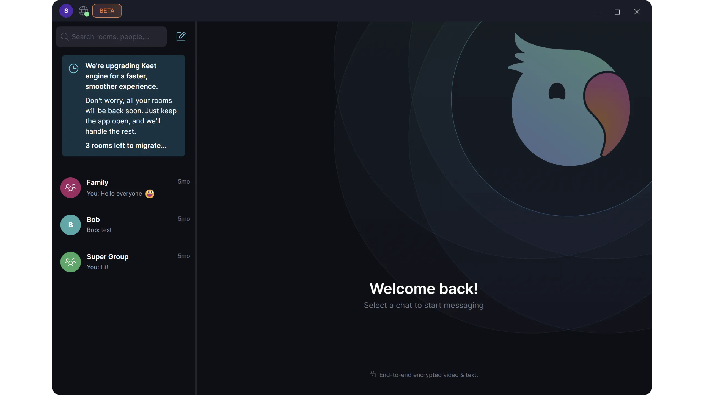

Votre système Windows est désormais prêt à exécuter et héberger des applications pair-à-pair avec Pears.

### 1.4. Comment installer Pears sur macOS ?

L’installation de Pears sur macOS est similaire à celle sous Linux, mais elle requiert quelques ajustements propres à l’environnement Apple. Découvrons ces étapes ensemble.

*Si vous utilisez Linux ou Windows et avez déjà installé Pears, vous pouvez passer directement à l'**étape 2**.*

#### 1.4.1. Vérifier les prérequis système

Avant l'installation, assurez-vous que *Xcode Command Line Tools* est présent sur votre système. Ce paquet fournit les outils de compilation nécessaires pour _Node.js_ et ses dépendances.

Pour ce faire, ouvrez un terminal avec le raccourcis clavier `Cmd + Space bar`, puis tapez `Terminal` et appuyez sur la touche `Enter`. Vous pouvez ensuite saisir cette commande dans le terminal pour lancer l'installation :

```bash
xcode-select --install
```

Si les outils sont déjà installés sur votre système, macOS vous en informera.

#### 1.4.2. Installer NVM

Pears est distribué via *npm*, le gestionnaire de paquets *Node.js*. Même si Pears ne dépend pas directement de *Node.js* pour fonctionner, celui-ci est nécessaire à l’installation. La méthode recommandée pour installer *Node.js* sur macOS est *NVM* (*Node Version Manager*), qui permet de gérer plusieurs versions de Node en parallèle.

```bash
curl -o- https://raw.githubusercontent.com/nvm-sh/nvm/master/install.sh | bash
```

Ensuite, rechargez votre terminal pour activer *NVM* :

```bash
source ~/.zshrc
```

Si vous utilisez *bash* plutôt que *zsh*, exécutez plutôt :

```bash
source ~/.bashrc
```

Vérifiez ensuite que *NVM* est bien installé :

```bash
nvm --version
```

Le terminal doit vous renvoyer la version de *NVM* installée sur votre système.

#### 1.4.3. Installer Node.js et npm

Installez ensuite une version stable de *Node.js* (par exemple la LTS actuelle) :

```bash
nvm install --lts
```

Une fois l’installation terminée, vérifiez les versions installées :

```bash
node -v
npm -v
```

Les deux commandes doivent retourner un numéro de version.

#### 1.4.4. Installer Pears avec npm

Une fois *npm* disponible, vous pouvez installer Pears CLI globalement sur votre système. Cela vous permettra d’exécuter la commande `pear` depuis n’importe quel répertoire.

```bash
npm install -g pear
```

#### 1.4.5. Initialiser Pears

Après l’installation, lancez simplement la commande suivante dans votre terminal :

```bash
pear
```

Lors du premier démarrage, Pears va se connecter au réseau pair-à-pair pour télécharger les composants nécessaires. Ce processus ne nécessite aucun serveur central : les fichiers sont obtenus directement depuis d’autres pairs.  

Une fois le téléchargement terminé, relancez la commande pour vérifier que tout fonctionne :

```bash
pear
```

Si tout est correctement installé, l’aide de Pears s’affichera avec la liste des commandes disponibles.

#### 1.4.6. Tester Pears avec Keet

Pour vérifier que Pears est pleinement opérationnel, vous pouvez lancer une application P2P déjà disponible sur le réseau, comme Keet, le logiciel de messagerie et visioconférence open-source de Holepunch.

```bash
pear run pear://keet
```

Cette commande charge l’application Keet directement depuis le réseau Pears, sans passer par un serveur central. Si Keet se lance correctement, cela signifie que votre installation de Pears est pleinement fonctionnelle.

Votre système macOS est désormais prêt à exécuter et héberger des applications pair-à-pair avec Pears.

## 2. Comment utiliser Plan ₿ Academy sur Pears ?

Une fois Pears installé et fonctionnel, vous pouvez directement exécuter la plateforme **Plan ₿ Academy** via le réseau P2P. Il suffit d’exécuter la commande suivante dans votre terminal (c'est la même commande pour Linux, Windows et macOS) :

```bash
pear run pear://k9cawqdsan3bkobkigesuyfeqjcasi49ikjaru5cipap835t7nwy
```

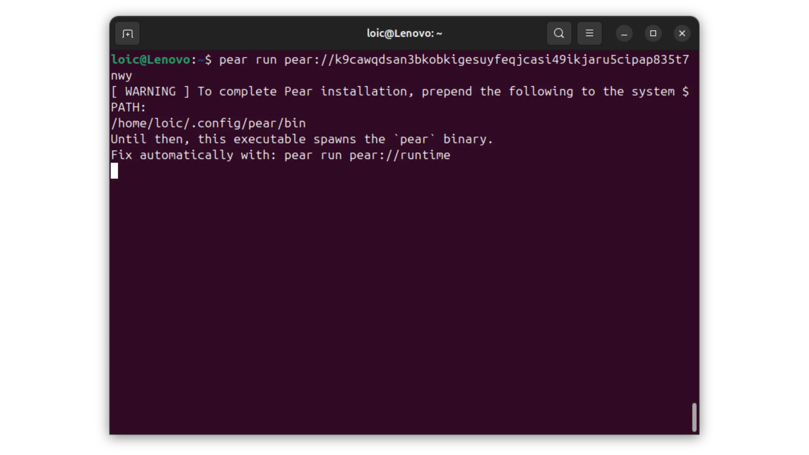

Une fois le chargement terminé, Plan ₿ Academy s’ouvrira dans votre environnement Pears, prête à être utilisée comme sur le site web original, mais sans aucune dépendance à un serveur central.

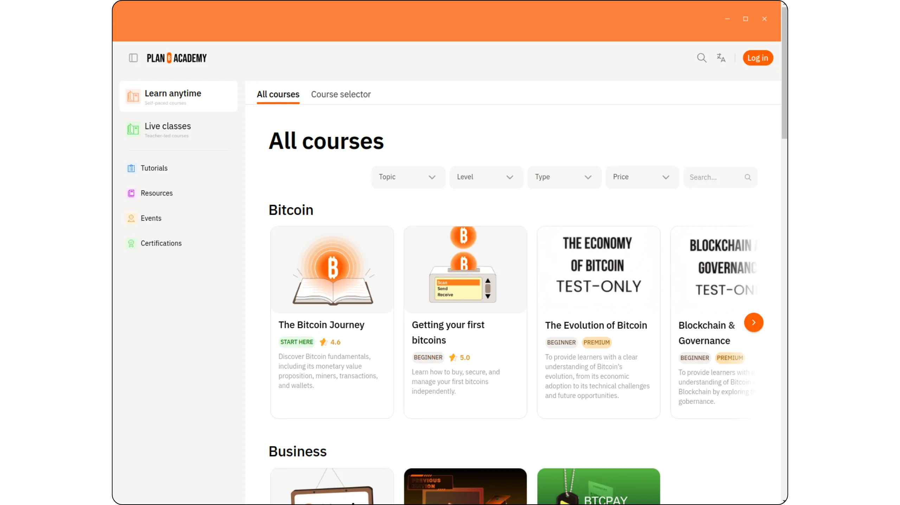

## 3. Comment seed Plan ₿ Academy sur Pears ?

Dans le réseau Pears, "*seed*" une application signifie la redistribuer à d'autres pairs depuis votre propre machine. Concrètement, lorsque vous seedez Plan ₿ Academy, votre ordinateur devient à son tour une source de données permettant à d'autres utilisateurs de télécharger l'application sans dépendre d'un serveur central.

Ce mécanisme renforce la résilience et la résistance à la censure de notre application sur le réseau Pears. Plus il y a de pairs qui seedent une application, plus elle devient disponible et décentralisée, même si certaines machines d’origine s’éteignent.

Pour contribuer à la diffusion de Plan ₿ Academy, il suffit d’exécuter la commande suivante :

```bash
pear seed pear://k9cawqdsan3bkobkigesuyfeqjcasi49ikjaru5cipap835t7nwy
```

Tant que cette commande est active, votre appareil participe à la distribution des fichiers de l’application. Si vous fermez le terminal, le partage s’arrête.

Pour continuer à seeder après un redémarrage, vous pouvez exécuter la commande en tâche de fond, ou bien créer un service systemd (Linux), un LaunchAgent (macOS), ou une tâche planifiée (Windows). Ces solutions permettent de relancer automatiquement le seeding de l'application Plan ₿ Academy au démarrage de votre système.

Merci de contribuer à la diffusion décentralisée de Plan ₿ Academy sur Pears et d’aider à rendre l’éducation sur Bitcoin réellement incensurable !
