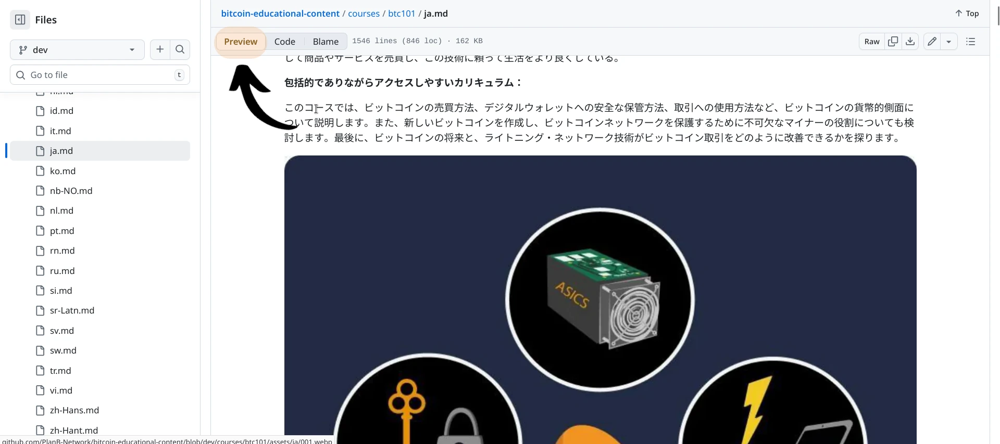
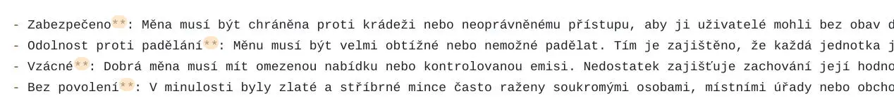
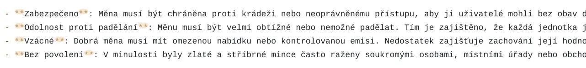
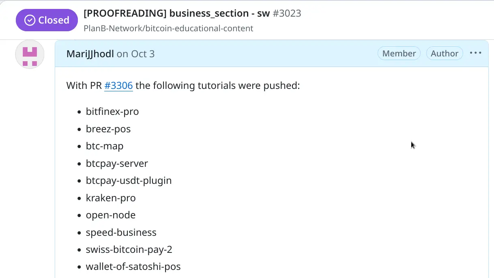
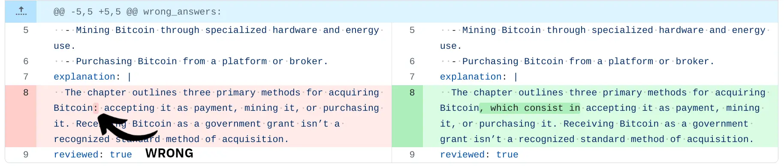

Welkom bij deze handleiding over de **richtlijnen die gevolgd moeten worden bij het proeflezen van inhoud op Plan ₿ Network**. We zijn blij dat u onze missie deelt om Bitcoin materialen in zoveel mogelijk talen te vertalen, zodat mensen zich bewust worden van hoe het werkt en hoe het gebruikt kan worden in hun dagelijks leven.


Ten eerste, bijdragen aan Plan ₿ Network [openbare repository](https://github.com/PlanB-Network/Bitcoin-educational-content) geeft je de kans om tutorials te schrijven, de bestaande inhoud te proeflezen, of zelfs de toevoeging van een nieuwe taal aan het platform voor te stellen. Om meer te weten te komen, moet je eerst lid worden van onze [Telegram Groep](https://t.me/PlanBNetwork_ContentBuilder) en een korte presentatie schrijven over jezelf en de talen die je spreekt.


Deze handleiding is bedoeld voor bijdragers die inhoud willen proeflezen. De meesten van hen weten niet veel over [Github](https://planb.network/en/tutorials/contribution/others/create-github-account-a75fc39d-f0d0-44dc-9cd5-cd94aee0c07c) of de [Markdown taal](https://www.markdownguide.org/basic-syntax/) die we gebruiken in de repository, dus het is belangrijk om wat inzichten te delen over de belangrijkste factoren die betrokken zijn bij deze taak.


Hieronder heb ik de meest voorkomende problemen verzameld die proeflezers tegenkomen. Voel je vrij om er meer te suggereren, omdat het anderen kan helpen zich te verbeteren.


Voordat je in de details duikt, is het eerste wat je moet doen deze tutorial lezen over de praktische acties die je moet volgen op Github, door Plan ₿ Network repository te forken, wijzigingen te committen en PR's te sturen:


https://planb.network/tutorials/contribution/content/proofreading-review-tutorial-28236c98-23b2-4efd-9563-953f08707017


## Wat is proeflezen?


Proeflezen is de laatste controle van een geschreven tekst om fouten in grammatica, spelling, interpunctie en opmaak op te sporen en te corrigeren. Het zorgt ervoor dat de tekst duidelijk en samenhangend is en geen fouten bevat voor publicatie of indiening.


Bij dit soort opdrachten is het belangrijk om de betekenis van de oorspronkelijke taal (EN of FR) te volgen, maar zorg ervoor dat de tekst in de uiteindelijke taal zo vloeiend mogelijk is voor een moedertaalspreker.


Onthoud altijd dat vertalen/proeflezen ONDERWIJS is!


In feite is het ons gezamenlijke doel om zoveel mogelijk mensen te onderwijzen over Bitcoin, dus is het van fundamenteel belang dat het materiaal dat ze lezen vlot en duidelijk is.

In die zin zijn alle medewerkers op Plan ₿ Network opvoeders!


## De eerste stappen voor proeflezen op Plan ₿ Network


Voordat je aan een nieuwe proefleestaak begint, kondig je het aan in de [Telegram groep] (https://t.me/PlanBNetwork_ContentBuilder) of informeer je je Plan ₿ Network coördinator, die een speciale [issue] zal openen (https://github.com/orgs/PlanB-Network/projects/3). Wanneer je de link van de uitgave ontvangt, **vemeld dan dat je begint** met het proeflezen van die inhoud.


Dit systeem helpt de coördinator om de voortgang binnen de repo bij te houden, en het maakt het mogelijk om de inhoud te "claimen" door de proeflezer, waardoor dubbel werk door iemand anders voorkomen wordt.

Op het probleem zelf vind je de links die je doorverwijzen naar de inhoud om te controleren. U kunt er gewoon op klikken, of, nog beter, u kunt teruggaan naar uw eigen forked repo en direct vanaf daar werken. Laten we eens kijken hoe je dat kunt doen!


Allereerst, **Denk er ALTIJD aan om je repo te SYNCEN op de "dev" branch**. Op deze manier zal de inhoud altijd bijgewerkt zijn voordat je een taak start en zul je geen conflicten creëren tussen oud en nieuw materiaal. Zorg ervoor dat je klikt op "Sync Fork" en "Update branch".


Na het succesvol synchroniseren, kun je direct naar de gewenste inhoud gaan en committen op een nieuwe branch, zoals te zien is in deze [tutorial] (https://planb.network/tutorials/contribution/content/proofreading-review-tutorial-28236c98-23b2-4efd-9563-953f08707017). Anders kun je een nieuwe branch openen om aan te werken, door op "Branches" te klikken, zoals hieronder te zien is.


Op deze nieuwe pagina vind je alle takken die je al hebt geopend onder de titel "Jouw takken". Deze sectie is erg handig omdat je zo gemakkelijk kunt vinden waar je bepaalde inhoud hebt aangepast. Als je een nieuwe tak wilt openen, kun je op "Nieuwe tak" klikken in de rechterbovenhoek van de pagina.


Vervolgens krijg je een pop-upvenster waarin je de naam van de nieuwe tak moet invoeren. In het geval hieronder heb ik ervoor gekozen om het "BTC101-FR" te noemen. Op deze manier zal ik altijd onthouden dat deze specifieke tak gebruikt moet worden voor het proeflezen van de cursus BTC101 in het Frans, en **ik zal het voor geen enkele andere taak gebruiken**.


Ik stel voor dat je hetzelfde doet: zorg ervoor dat je een nieuwe tak opent wanneer je aan een nieuwe taak moet beginnen.


Na het aanmaken van deze nieuwe branch, zorg er dan voor dat je erop klikt vanuit "Je Branches" in de vorige pagina en begin te werken aan het *.md* bestand dat gerelateerd is aan de specifieke inhoud (in mijn geval zal ik klikken op "cursussen" -> "BTC101" -> "fr.md"). Alle commits die gerelateerd zijn aan het specifieke bestand moeten binnen dezelfde branch gecommit (opgeslagen) worden.


## Oorspronkelijke taal of vertaling?


Bij het proeflezen van inhoud is het belangrijk om **altijd de originele Engelse (of Franse)** versie ervan te controleren. Wees je ervan bewust dat we vertalen met behulp van AI-taalprogramma's, dus de weergave in de doeltaal is misschien niet vloeiend of goed te begrijpen voor de uiteindelijke lezer.


Voel je dus vrij om de tekst aan te passen en zinnen te wijzigen als dat nodig is. Ons doel is om de tekst vloeiender te maken, maar altijd volgens de oorspronkelijke betekenis. Als je twijfelt over hoe je een bepaald woord moet behandelen, vraag het dan aan de vertaalcoördinator.


LLM-tools kunnen sommige woorden met betrekking tot Bitcoin letterlijk vertalen, net als Lightning Network. Dit is vooral het geval als het om zeer technische woorden gaat. In dit soort gevallen is het aan te raden om het originele Engelse woord in de doeltaal te behouden voor een betere duidelijkheid, tenzij je taalregels je verplichten om elk woord te vertalen.


In dit tweede geval, **doe altijd wat onderzoek om te zien of iemand anders in jouw Bitcoin gemeenschap dat woord al vertaald heeft** en het nu algemeen gebruikt wordt.


- Een oplossing zou kunnen zijn om **te controleren op [BitcoinWiki](https://en.Bitcoin.it/wiki/Main_Page)** in je doeltaal om te zien of het woord vertaald is of niet. Als dat niet zo is, houd je het woord in het Engels.


- In elk geval zou mijn advies zijn om **het EN-woord desondanks** in te voegen, met toevoeging van de overeenkomstige betekenis in de doeltaal binnen ronde haakjes, volgens het schema EN (LANG), of omgekeerd. Voorbeeld. Address (indirizzo), of indirizzo (Address).


- Een andere goede oplossing is om het NL oorspronkelijke woord/zin te behouden en **een hyperlink** te maken die verwijst naar de [woordenlijst](https://planb.network/en/resources/glossary) op planb.network. Om dit te doen, moet je het woord/de zin tussen vierkante haakjes plaatsen en de link tussen ronde haakjes, zoals je kunt zien in het onderstaande voorbeeld:


```
[UTXO](https://planb.network/resources/glossary/utxo)
```


In het uiteindelijke resultaat (afbeelding hieronder) zie je niet de hele link, en wordt het woord klikbaar.


Houd er rekening mee dat de woordenlijstlink die je van de website haalt de taalcode na het woord "network" bevat (voorbeeld: ``https://planb.network/en/resources/glossary/utxo``-> hier kun je de taalcode "en" lezen). Verwijder in dit geval **de taalcode uit de link**, zoals je in het vak hierboven ziet. Op deze manier zal het systeem de lezer automatisch naar de taal van zijn keuze leiden.


De inhoud van het archief staat vol met hyperlinks zoals deze hierboven. Nu je weet wat ze betekenen, **zorg ervoor dat je geen enkele link** verwijdert die door de oorspronkelijke auteur is ingevoegd.


- Iets anders met betrekking tot woordweergave is het volgende. Als je "Plan ₿ Network" in de tekst tegenkomt, **laat het dan in deze oorspronkelijke vorm staan**. Vertaal het woord "plan" of het woord "netwerk" niet. Gebruik ook NIET het lidwoord "De" als je Plan ₿ Network introduceert: **beschouw het als een merk**.


- Hetzelfde geldt voor "₿-CERT", "Biz School", "Tech School", die ook in de originele vorm moeten worden bewaard.


Nog een laatste opmerking over deze paragraaf: zoals we hierboven al zeiden, gebruiken we AI-tools om inhoud te vertalen en dan vragen we om de tussenkomst van medewerkers om ervoor te zorgen dat alles vloeiend en goed nagelezen is.


Als je AI gebruikt om het grootste deel van de tekst te proeflezen, zullen we dat zeker merken, omdat we bekend zijn met de typische zinsstructuren die AI genereert. Als we merken dat je alleen op AI vertrouwde voor het proeflezen, zonder significante veranderingen toe te passen, kan de uiteindelijke beloning in Sats met de helft worden verminderd!


## De structuur van headers


In de markdown taal beginnen koppen (en paragraaftitels) allemaal met het Hash teken ``#``. Het aantal Hash tekens komt overeen met het koptekstniveau. Een kop van niveau drie heeft bijvoorbeeld drie cijfertekens voor de tekst (bijvoorbeeld `### My Header`).


In cursussen worden de belangrijkste onderdelen geïntroduceerd door een enkel Hash teken, terwijl de subonderdelen twee tot vier Hash tekens kunnen hebben. In tutorials gebruiken we normaal gesproken alleen koppen met twee Hash tekens.


Zorg ervoor dat je **NOOIT Hash tekens** voor een titel verwijdert, anders krijg je problemen met de structuur van de tekst.


Verander tegelijkertijd** niet het chapterID gedeelte dat je kunt zien in de afbeelding hierboven, ``<chapterId>d668fdf6-fb4c-4bbf-82e1-afcb95c122e0</chapterId>`` of de videoreferenties zoals ``:: video id=ba99951f-81d2-418f-b5e7-4b8c9f8b8cc8:::``.


Wanneer we ``#`` voor een titel invoegen, wordt die automatisch vet in het cursusvoorbeeld, dus **vermijd het vet maken van titels tijdens het corrigeren**.


Terzijde: in de EN-versie van cursussen hebben de **titels die ingeleid worden door één of twee ``#`` alle woorden die in hoofdletters beginnen**, terwijl titels die beginnen met drie of vier ``#`` deze regel meestal niet volgen. Zorg er indien mogelijk voor dat de titels in je doeltaal deze structuur volgen.


## Het eerste deel van de cursussen


Aan het begin van elke inhoud staan de volgende statische kleine letters: "naam", "beschrijving", "doelstellingen". Ze worden door de website gebruikt om de inhoud zelf te decoderen en worden **altijd in EN** gelaten. Vertaal ze daarom NIET, anders zal de inhoud synchronisatieproblemen veroorzaken. Zorg ervoor dat je alleen het gedeelte na de dubbele punt proefleest, dat automatisch door AI wordt vertaald.


Houd in ditzelfde eerste gedeelte de opmaak zoals die is. Voeg niets toe aan het begin van de tekst. Voeg bijvoorbeeld geen "tt" toe voor de streepjes, zoals in de afbeelding hieronder!


## Formaat aanbevelingen


Hieronder vind je een paar voorbeelden van opmaakproblemen waar je op moet letten bij het proeflezen van inhoud in je doeltaal.


- Let op vreemde interpunctie zoals ```, of ``**`` die een slechte weergave van het vetgedrukte symbool kunnen zijn. In de afbeelding hieronder zie je dat de sterretjes alleen aan de rechterkant van het woord staan, wat er vreemd uitziet.





Controleer dus altijd de originele Engelse tekst om te zien of een vetgedrukte tekst daar hoort te staan. In dit geval voeg je gewoon twee sterretjes toe aan het begin van het woord, zodat het correct wordt weergegeven op de website. In de markdown taal, **om de tekst vet weer te geven, moet je twee sterretjes ``**`` zowel voor als na het woord/de zin invoegen** (zie onderstaand voorbeeld).





- Hetzelfde kan gebeuren met symbolen als $ en `` ``.

Controleer het originele taalbestand (vaak EN of FR) om te zien waar deze symbolen horen te staan. Je kunt altijd de coördinator om hulp vragen.


- Als je aanhalingstekens vindt, zoek dan online naar de juiste vertaling in jouw taal. Aanhalingstekens worden meestal ingevoegd na het symbool ``>``.





## Proeflezen quiz


Wist je dat je ook de quizvragen van elke cursus kunt proeflezen? Als je bijvoorbeeld de testen voor BTC101 in IT wilt proeflezen, kun je een speciale tak openen en dit pad volgen: "cursussen" -> "BTC101" -> "quiz". Daar zul je alle mappen vinden die gewijd zijn aan elke vraag, samen met het gerelateerde taalbestand in _yml_ formaat.


Nogmaals, zorg ervoor dat je in een speciaal hiervoor geopend filiaal bent en informeer altijd de coördinator.


Nadat je de vraag hebt bekeken, moet je ervoor zorgen dat je de status "beoordeeld" verandert van "onjuist" in "waar", zoals in de afbeelding hieronder.


## Woordenlijst proeflezen


Net als de quizzen kun je ook de woordenlijst proeflezen. De oorspronkelijke woordenlijst is in het Frans geschreven, dus je zult zinnen vinden als: "In het Frans kan deze uitdrukking vertaald worden in..."


Pas in dit soort gevallen deze zin aan in je doeltaal of in het Engels.


## Andere best practices


- Als je moet zoeken naar specifieke woorden in de tekst, kun je klikken op ``CTRL+F`` en dan verschijnt het gedeelte Zoeken-Vervangen. Dit gedeelte is erg handig als je naar een specifiek deel van de tekst wilt springen, of als je specifieke woorden/zinnen in een batch wilt vervangen zonder de volledige inhoud te hoeven scrollen.





Wanneer je de functie "Alles vervangen" gebruikt, is het belangrijk om de resultaten dubbel te controleren om er zeker van te zijn dat links niet ook zijn gewijzigd. Als je bijvoorbeeld het woord "Bitcoin" wilt veranderen in "Bitkoin" (wat in sommige talen nodig kan zijn), kun je met de functie "Alles vervangen" alle gevallen in de tekst efficiënt bijwerken. Houd er echter rekening mee dat deze tool ook alle links wijzigt die dat woord bevatten, wat kan leiden tot omleidingsproblemen.


In het onderstaande voorbeeld gebruikte de proeflezer de bovenstaande functie om "Satoshi" te vervangen door "Satoshi(Sats)", en veranderde ook de link naar een tutorial die het woord zelf bevat. Hierdoor werd de link ongeldig.


Controleer altijd dubbel alle hyperlinks in de tekst om er zeker van te zijn dat ze correct zijn.


- Als de auteur een link invoegt die verwijst naar een Plan ₿ Network cursus of tutorial (**niet** tussen haakjes), zal de website automatisch een "kaart" aanmaken met de bijbehorende thumbnail. Zorg er daarom altijd voor dat je **een spatie hebt tussen de tekst en de link zelf**, anders zou je de volgende foutmelding op de website kunnen zien.





- Tot slot, als je klaar bent met je proefleestaak en de PR verstuurt, ga dan terug naar het oorspronkelijke probleem dat door de coördinator is geopend en plaats een opmerking met "Proeflezen gedaan". **Zorg ervoor dat je daar ook je PR-link toevoegt**.


## Conclusie


Kortom, je bewust zijn van de veelgemaakte fouten van proeflezers kan je echt helpen om je vaardigheden bij het controleren van inhoud te verbeteren. Het is makkelijk om dingen als context of consistentie over het hoofd te zien, en het ontdekken van deze fouten kan een groot verschil maken.


Houd altijd in gedachten dat een beginner deze cursussen en tutorials kan lezen, dus het is onze verantwoordelijkheid om ervoor te zorgen dat ze het volledig begrijpen. Als proeflezer ben je een opvoeder!


Bedankt voor het lezen van deze handleiding en veel plezier met proeflezen!