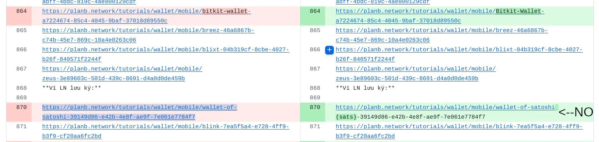
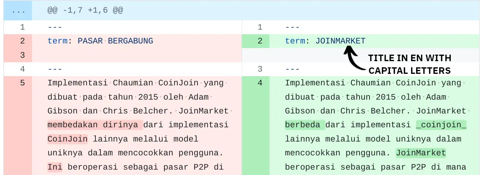

Ikaze muri iyi nyigisho yerekeye **amabwirizwa yo gukurikiza igihe usoma ibirimwo kuri Plan ₿ Network**. Turanezerewe ko musangira ubutumwa bwacu bwo guhindura ibikoresho vya Bitcoin mu ndimi nyinshi zishoboka, kugira ngo dufashe abantu kumenya ingene bikora n’ingene bishobora gukoreshwa mu buzima bwabo bwa misi yose.


Mbere na mbere, gutanga umusanzu kuri Plan ₿ Network [ububiko bwa bose](https://github.com/PlanB-Network/Bitcoin-ibirimwo-ivy’inyigisho) biguha amahirwe yo kwandika inyigisho, gukosora ibirimwo, canke mbere gusaba ko hokwongerwa ururimi rushasha ku rubuga. Kugira ngo umenye vyinshi, banza winjire muri [Itsinda rya Telegaramu](https://t.me/PlanBNetwork_ContentBuilder) ryacu, maze wandike ikiganiro kigufi ku bijanye nawe n’indimi ushobora kuvuga.


Iyi nyigisho igenewe abatanga intererano bashaka gukosora ibirimwo. Benshi muri bo ntibazi vyinshi ku vyerekeye [Github](https://planb.network/ru/inyigisho/intererano/abandi/gukora-konti-ya-github-a75fc39d-f0d0-44dc-9cd5-cd94aee0c07c) canke [Markdown ururimi](https://www.markdownguide.org/basic-syntax/) dukoresha imbere mu bubiko, rero birahambaye ko dusangira ubumenyi bumwe bumwe ku bintu nyamukuru biri muri iki gikorwa.


Aha musi, nakoranije hamwe ibibazo bikunze guhura navyo abakosora. Ntutinye gutanga ibindi, kuko bishobora gufasha abandi gutera imbere.


Imbere yo kwisuka mu vyihariye, ikintu ca mbere wokora ni ugusoma iyi nyigisho ku bikorwa ngirakamaro vyo gukurikiza kuri Github, mu gucapura ububiko bwa Plan ₿ Network, guhindura no kohereza PRs:


https://planb.network/tutorials/contribution/content/proofreading-review-tutorial-28236c98-23b2-4efd-9563-953f08707017


## Gukosora ni iki?


Gukosora ni igikorwa ca nyuma co gusubiramwo igisomwa canditswe, kugira ngo umuntu amenye amakosa yo mu kibonezamvugo, mu kwandika, mu gushiramwo ibimenyetso vy’akarongo no mu gukosora. Bituma igisomwa gitomoye, gihuye kandi kitagira amakosa imbere y’uko gisohorwa canke gishikirizwa.


Iyo ushikiwe n’ubwo bwoko bw’igikorwa, birahambaye ko ukurikiza insobanuro y’ururimi rw’intango (EN canke FR), ariko urabe neza ko icanditswe kiri mu rurimi rwa nyuma kigenda neza uko bishoboka kwose ku muntu avuga ururimi kavukire.


Imisi yose mwibuke ko guhindura/gukosora ari UBWIGISHWA!


Nkako, intumbero dusangiye ni iyo kwigisha abantu benshi bishobotse ku bijanye na Bitcoin, ni co gituma ari ngirakamaro ko ivyo basoma bigenda neza kandi bitomoye.

Muri ubwo buryo, abatanga intererano bose kuri Plan ₿ Network ni abigisha!


## Intambwe za mbere imbere yo gukosora kuri Plan ₿ Network.


Imbere yo gutangura igikorwa gishasha co gukosora, kimenyeshe mu [mugwi wa Telegram](https://t.me/PlanBNetwork_ContentBuilder) canke umenyeshe umuhuzabikorwa wawe wa Plan ₿ Network, azogufungura [ikibazo] kigenewe (https://github.com/orgs/PlanB-Network3/). Iyo ubonye uruja n'uruza rw'ikibazo, **vuze gusa ko uriko uratangura** igikorwa co gukosora ivyo birimwo.


Uwo murongo ufasha umuhuzabikorwa kumenya ingene ibintu bigenda imbere muri iyo repo, kandi utuma ibirimwo "bivugwa" n'umukosozi, bikabuza utwigoro twisubirwamwo n'uwundi muntu.

Ku kibazo ubwaco, uzosanga amahuzu akujana ku birimwo kugira ngo ubisuzume. Ushobora gusa kubikandako, canke, mbere vyiza kuruta, ushobora gusubira mu nzu yawe bwite y’amabarabara maze ugakora uhereye ng’aho. Reka turabe ingene wobikora!


Mbere na mbere, **WAME wibuka gukora SYNC repo yawe, ku ishami rya "dev"**. Muri ubwo buryo, ibirimwo bizoma bivugururwa imbere y’uko utangura igikorwa ico ari co cose, kandi ntuzotuma haba amakimbirane hagati y’ibintu vya kera n’ibishasha. Raba neza ko ukanda kuri "Sync Fork" na "Update ishami".


Uhejeje gukorana neza, urashobora gushika ku birimwo vy’inyungu maze ugafata ishami rishasha, nk’uko vyerekanwa muri iyi [nyigisho](https://planb.network/inyigisho/intererano/ibirimwo/ugukosora-isubiramwo-inyigisho-28236c98-23b2-4efd-9576793-). Ahandi ho, ushobora gufungura ishami rishasha aho uzokorera, ukanda kuri "Amashami", nk'uko vyerekanwa aha hepfo.


Muri iyi paji nshasha, uzosanga amashami yose wamaze gufungura munsi y'umutwe "Amashami yawe". Iki gice ni ngirakamaro cane kuko kigufasha kumenya bitagoranye aho wahinduye ibintu bimwebimwe. Niba ushaka gufungura ishami rishasha, ushobora gufyonda kuri "Ishami rishasha" riri hejuru iburyo kuri iyo paji.


Hanyuma, uzobona pop-up aho ukeneye kwinjiza izina ry’ishami rishasha. Mu gihe kiri musi, nahisemwo kuvyita "BTC101-FR". Uko ni ko nzokwama nibuka ko iryo shami ryihariye rikeneye gukoreshwa mu gukosora inyigisho BTC101 mu gifaransa, kandi **sinzorikoresha mu kindi gikorwa cose**.


Ndagusavye ngo nawe ukore gutyo nyene: urabe ko ufungura ishami rishasha igihe cose ukeneye gutangura igikorwa gishasha.


Uhejeje kurema iri shami rishasha, urabe ko ukanda kuri "Amashami yawe" kuri paji iheze maze utangure gukora kuri dosiye *.md* ijyanye n'ibirimwo vyihariye (mu gihe canje, nzokanda kuri "courses" -> "BTC101" -> "fr.md"). Ivyemezo vyose bijanye na dosiye yihariye bizobwirizwa gukorwa (kubikwa) imbere mw'ishami rimwe.


## Ururimi rw’umwimerere canke ubuhinduzi?


Igihe ukora ugukosora ibirimwo, birahambaye ko **wama usuzuma icongereza (canke igifaransa)** c'umwimerere. Menya ko duhindura dukoresheje ibikoresho vy’ururimi rwa AI, rero uguhindura mu rurimi rwo gukoresha vyoshobora kutaba vyiza canke ngo bitahurwe neza n’umusomyi wa nyuma.


Nuko rero, ntutinye guhindura icanditswe no guhindura amajambo, nimba bikenewe. Intumbero yacu ni iyo kwongerera ubushobozi bwo guhindura ibintu, ariko twama dukurikiza insobanuro y’intango. Mu gihe woba ufise amakenga ku bijanye n’ingene wofata ijambo kanaka, nubone ko ubaza umuhuzabikorwa w’ubuhinduzi.


Ibikoresho vya LLM bishobora guhindura amajambo amwamwe ajanye na Bitcoin uko biri, nka Lightning Network. Ni ko biri canecane iyo rivuga amajambo y’ubuhinga cane. Mu bihe nk’ivyo, ni vyiza ko ugumana ijambo ry’icongereza ry’umwimerere mu rurimi ukoresha kugira ngo risobanuke neza, kiretse iyo amategeko y’ururimi rwawe akutegetse guhindura ijambo ryose.


Muri iki gihe ca kabiri, **wame ukora ubushakashatsi kugira ngo urabe nimba hari uwundi muntu wo mu muryango wawe wa Bitcoin amaze guhindura iryo jambo** kandi ubu rikoreshwa cane.


- Umuti umwe woshobora kuba **ugusuzuma kuri [BitcoinWiki](https://ru.Bitcoin.it/wiki/Urupapuro_Nkuru)** mu rurimi rwawe kugira ngo urabe nimba iryo jambo ryahinduwe canke atari ryo. Niba atarivyo, ijambo urabigumya mu congereza.


- Uko biri kwose, impanuro yanje yoba iyo **kwinjiza ijambo EN nonetheless**, ukongerako insobanuro ihuye n’iryo mu rurimi rw’intumbero imbere mu bifunga bizunguruka, ukurikije umugambi EN (LANG), canke vice-versa. Yamye. Address (ivy’indirimbo), canke ivy’indirimbo (Address).


- Ikindi ciyumviro ciza ni ugukomeza ijambo/invugo y’umwimerere y’ikirundi, hanyuma **ukore uruja n’uruza** ruja ku [rutonde rw’amajambo](https://planb.network/ru/ibikoresho/urutonde rw’amajambo) kuri planb.network. Kugira ngo ubikore, ukeneye kwinjiza ijambo/invugo imbere mu bifunga, n'ihuriro mu bifunga bizunguruka, nk'uko ushobora kubibona mu karorero kari aha hepfo:


```
[UTXO](https://planb.network/resources/glossary/utxo)
```


Mu gisubizo ca nyuma (ishusho iri musi) ntuzobona mu ciyumviro uruja n’uruza rwose, kandi ijambo rizoba ryo gukanda.


Urashobora kubona ko uruja n'uruza rw'amajambo uzofata ku rubuga rurimwo kode y'ururimi inyuma y'ijambo "urubuga" (akarorero: ``https://planb.network/ru/resources/glossary/utxo``-> aha ushobora gusoma kode y'ururimi "ru"). Muri iki gihe, **kuraho kode y'ururimi ku nzira**, nk'uko mwabibonye mu gasandugu kari hejuru. Muri ubwo buryo, iyo sisitemu izoca ijana umusomyi mu rurimi rwabo rwagenwe.


Ibiri ku bubiko vyuzuyemwo ama hyperlinks nk’aya ari hejuru. None ko uzi ico bisobanura, **urabe ko udafuta link iyo ari yo yose** yinjijwe n'umwanditsi w'umwimerere.


- Ikindi kintu gifitaniye isano n’uguhindura amajambo ni iki gikurikira. Niwabona "Plan ₿ Network" mu nyandiko, **uyisige muri iyi nzira y'umwimerere**. Ntuhindure ijambo "umugambi" canke ijambo "urubuga". Ikindi, NTUKORESHE ingingo "The" igihe utangaza Plan ₿ Network: **uyifate nk'ikimenyetso**.


- Ni ko biri no kuri "₿-CERT", "Biz School", "Tech School", na vyo nyene bikwiye kuguma mu buryo bw'intango.


Iciyumviro kimwe ca nyuma kuri iki gice: nk’uko twabivuze haruguru, dukoresha ibikoresho vya AI kugira ngo duhindure ibirimwo, hanyuma tugasaba abatanga intererano kugira ngo twiyemeze neza ko vyose bigenda neza kandi bikosorwa neza.


Niwakoresha AI kugira ngo ukosore igice kinini c’ivyanditswe, tuzobibona ata gukeka, kuko tumenyereye imiterere y’interuro isanzwe AI itanga. Nitwabona ko wizigiye gusa AI mu gukosora, utashize mu ngiro amahinduka akomeye, impembo ya nyuma muri Sats yoshobora kugabanywa n’igice!


## Ubuhinga bw'imitwe


Mu rurimi rw'ikimenyetso, imitwe (n'imitwe y'ibice) vyose bitangura n'ikimenyetso ca Hash ``#``. Igitigiri c’ibimenyetso vya Hash kijanye n’urugero rw’umutwe. Nk'akarorero, umutwe w'urugero rwa gatatu ufise ibimenyetso bitatu vy'imibare imbere y'umwandiko (nk'akarorero, `### Umutwe wanje`).


Mu masomo, ibice bihambaye cane bitangwa n’ikimenyetso kimwe ca Hash, mu gihe ibice bitobito bishobora kugira ibimenyetso kuva kuri bibiri gushika kuri bine vya Hash. Mu nyigisho, mu bisanzwe dukoresha gusa imitwe ifise ibimenyetso bibiri vya Hash.


Raba neza ko **NTUZOKWIGEZE ufuta ibimenyetso vya Hash** imbere y'umutwe, ahandi ho uzotuma haba ibibazo ku miterere y'ivyanditswe.


Muri ico gihe nyene, **ntimuhindure** igice c'Indangamuntu y'igice ushobora kubona kw'ishusho iri hejuru, ``<Indangamuntu y'igice>`` canke ibisobanuro vya videwo nka ``:::de id=ba99951f-81d2-418f-b5e7-4b8c9f8b8cc8:::``.


Iyo twinjije ``#`` imbere y'umutwe, bica bihinduka bikomeye mu gihe c'imbere y'amashure, rero **wirinde guhindura amazina mu gihe co gukosora**.


Nk’akarorero, mu rurimi rw’ikirundi rw’amashure, **amazina yashizweho n’imwe canke zibiri ``#`` afise amajambo yose atangura n’inyuguti nini**, mu gihe amazina atangura n’inyuguti zitatu canke zine ``#``, akenshi ntakurikiza iri tegeko. Niba bishoboka, nurabe neza ko amazina yo mu rurimi ukoresha akurikiza iyo ntunganyo.


## Igice ca mbere c'amashure


Mu ntango y'ibirimwo vyose, uzosanga amajambo mato mato akurikira: "izina", "insobanuro", "intumbero". Bikoreshwa n’urubuga kugira ngo bisobanure ibirimwo ubwavyo kandi **vyama bisigara mu rurimi rw’ikirundi**. Nk’inkurikizi, NTUBIhindure, ahandi ho ibirimwo bizotuma haba ibibazo vyo guhuza. Raba neza ko usoma gusa igice kiri inyuma y’agace k’urudome, kikaba gihindurwa ubwaco na AI.


Muri iki gice nyene c’intango, nugumye uburyo buri. Ntugire ico wongereko mu ntango y’icanditswe. Nk'akarorero, wirinde kwongerako "tt" imbere y'uturongo, nk'uko biri kw'ishusho iri musi!


## Impanuro zo guhingura


Aha musi urashobora kubona ingero nkeyi z’ibibazo vy’imiterere y’ibintu vyo kwitwararika, igihe usoma ibirimwo mu rurimi rwawe.


- Witwararike ibimenyetso vy'akarongo bitangaje nka `\*\*\`, canke ``**`` bishobora guserura uguhindura nabi kw'ikimenyetso gikomeye. Mu ishusho iri musi, urashobora kubona ko inyenyeri ziri iburyo gusa bw’ijambo, ivyo bikaba bisa n’ibitangaje.


Gutyo, wama usuzuma icanditswe c’umwimerere c’icongereza kugira ngo urabe nimba hariho icanditswe gikomeye. Muri ivyo, wongereko gusa inyenyeri zibiri ku ntango y’ijambo, kugira ngo ryerekane neza ku rubuga. Nkako, mu rurimi rwa markdown, **kugira ngo uhindure inyuguti zikomeye, utegerezwa kwinjiza inyenyeri zibiri ``**`` imbere n'inyuma y'ijambo/interuro** (raba akarorero kari musi).


- Ivyo bibazo nyene bishobora gushika ku bimenyetso nka $ na `` ` ``.

Raba neza ko usuzuma dosiye y’ururimi rw’intango (kenshi EN canke FR) kugira ngo ubone aho ivyo bimenyetso bikwiye kuba biri. Ushobora kwama usaba umuhuzabikorwa ngo agufashe kuri ivyo.


- Niwabona amajambo asubiwemwo, nukore ubushakashatsi kuri Internet kugira uronke ubuhinduzi bubereye mu rurimi rwawe. Ivyiyumviro bisubiramwo bishirwa inyuma y'ikimenyetso ``>``.


## Gukosora ikibazo


Woba wari uzi ko ushobora no gukosora ibibazo vy’ikibazo mu nyigisho yose? Nk'akarorero, niwaba ushaka gukosora ibibazo vya BTC101 mu vy'ubuhinga bwa none, woshobora gufungura ishami ryihariye maze ukurikire iyi nzira: "amashure" -> "BTC101" -> "ikibazo". Aho, uzosanga amadosiye yose yagenewe ikibazo cose, hamwe n'idosiye y'ururimi bijanye mu buryo bwa _yml_.


Na none, nurabe neza ko uri mw’ishami ry’umwihariko ufungura ku bw’iyo ntumbero canecane, kandi wama ubimenyesha umuhuzabikorwa.


Ikintu gihambaye co kuguma mu muzirikanyi igihe usoma ubu bwoko bwa dosiye _yml_ ni ukwirinda kwongerako amabara ``:`` imbere mu nyandiko. Nkako, akarongo ni **gusa** gakoreshwa mu gutandukanya urufunguzo-agaciro kabiri nka "wrong_answers" ku bindi. Ushobora kubona akarorero kw'ishusho iri musi:


Uhejeje gusubiramwo ikibazo, urabe ko uhindura ikibanza "casubiwemwo" kuva ku "ikinyoma" gushika ku "ukuri," nk'uko vyerekanwa ku ishusho iri musi. Raba neza ko aya majambo ya status aguma ari mu congereza, naho woba uriko urakora ururimi uruhe!


Niba umurongo w'imimerere "reviewed:true" ubuze, urabe ko **wongerako ku mpera y'ikibazo**.


## Gukosora insobanuro


Nka kurya kw’ibibazo, urashobora kandi gukosora urutonde rw’amajambo. Insobanuro y'amajambo y'intango yanditswe mu gifaransa, rero uzosanga amajambo nk'aya: "Mu gifaransa, iyi mvugo ishobora guhindurwa mu..."


Mu bihe nk’ibi, ndagusavye uhindure iyo nteruro ihure n’ururimi ukoresha canke n’icongereza. Nk'akarorero, ushobora kwandika ngo "Mu congereza, iyi mvugo...".

Iyo umutwe w'ikiganiro usigaye mu congereza, urashobora guhindura iryo rungane rihuye n'ururimi rwawe: "Mu giswahili, iyi mvugo..."


Vyongeye, nurabe neza ko wandika amazina y’ibiganiro mu NGURU NININI.


## Umutwe n'insobanuro ya PR yawe


Iyo wohereje PR yawe, vyoba bitangaje iyo uyiha izina ukoresheje ubu buryo: [GUSOMA GUKOSORA] IZINA RY'IBIRIMWO - URURIMI:


```
[PROOFREADING] BTC101 - ENGLISH
```


Ikindi, mu **gice c'ibitekerezo ca PR**, urashobora kwandika "closes" + umubare w'ikinyamakuru umuhuzabikorwa yakurungikiye igihe watangura igikorwa co gukosora, ubanza kwandika ``#``.

Nk'akarorero, iyo wohereje PR n'ugukosora kw'ibibazo vya cyp201 +, ushobora kwandika "bifunga [#2934]


Uko ni ko PR n’ikibazo bizohuzwa, kandi uwuzosoma ububiko bwa Github bwa bose azoshobora kuronka amakuru bitamugoye.


## Ibindi bikorwa vyiza


- Niba ukeneye kurondera amajambo yihariye mu nyandiko, ushobora gukanda kuri ``CTRL+F`` maze igice co kurondera-gusubirira kizoboneka. Iki gice ni ngirakamaro cane iyo ukeneye gusimbukira ku gice kinaka c’ico canditswe, canke ukeneye gusubirira amajambo/amajambo yihariye mu bice, utahinduye ibirimwo vyose.


Igihe ukoresha igikorwa ca "gusubirira vyose", birahambaye ko usuzuma kabiri ibisubizo kugira ngo umenye neza ko amahuza na yo nyene atahinduwe. Nk'akarorero, nimba ushaka guhindura ijambo "Bitcoin" ngo ribe "Bitkoin" (bishobora kuba bikenewe mu ndimi zimwe zimwe), gukoresha igikorwa ca "replace all" birashobora guhindura neza instances zose ziri mu nyandiko. Ariko rero, menya ko iki gikoresho kizohindura kandi amahuza yose arimwo iryo jambo, bishobora gutuma haba ibibazo vyo guhindura inzira.


Mu karorero kari aha hepfo, umukosozi yakoresheje igikorwa kiri hejuru kugira ngo asubirize "Satoshi" "Satoshi(Sats)", kandi ahindura n'ihuriro ry'inyigisho irimwo ijambo ubwaryo. Inkurikizi ni uko iyo nzira yacitse ubusa.


Imisi yose suzuma kabiri ama hyperlinks yose ari mu nyandiko, kugira ngo umenye neza ko ari ukuri.





- Dukurikije ku ciyumviro, iyo umwanditsi yinjije uruja n'uruza rwerekeye inyigisho canke inyigisho ya Plan ₿ Network (**si** imbere mu bifunga), urubuga ruzoca rukora "ikarata" yerekana igishushanyo gitoyi gifitaniye isano. Nk'inkurikizi, wama uraba neza ko **wongerako umurongo mushasha hagati y'umwandiko n'ihuriro ubwaryo**, ahandi ho woshobora kubona ikosa rikurikira ku rubuga.





Ivyo ni vyo bishika no ku "makode y'amashusho" nk'aya ``[ISHUSHO](asset/fr/001.webp)``: urabe neza ko wama wongerako umurongo mushasha hagati ya kode y'amashusho n'umwandiko. Akarorero kari aha hepfo:


```
WRONG CONFIGURATION:
- to start translating, click on the button `Translate`: 
To save, click on `save`!


RIGHT CONFIGURATION:

- to start translating, click on the button `Translate`:


To save, click on `save`!
```


## Iciyumviro


Mu ncamake, kumenya amakosa asanzwe abasomyi bakora birashobora vy’ukuri kugufasha kwongereza ubuhinga bwawe igihe usuzuma ibirimwo. Biroroshe kwirengagiza ibintu nk’aho bivugwa canke ukuntu bihuye, kandi gufata ayo makosa birashobora gutuma habaho itandukaniro rikomeye.


Imisi yose uzirikane ko uwutangura ashobora gusoma ayo masomo n’inyigisho, rero ni inshingano yacu kumenya neza ko atahura neza. Nk’umukosozi, uri umwigisha!


Ubu rero urateguye gutangura amashure yo gukosora, inyigisho, ibibazo, n’amajambo y’insobanuro. Mugume mubikurikirana kugira ngo mutangure no kugenzura amashusho n'amasanamu ;)


Murakoze gusoma muri iyi nyigisho, kandi mwinovore urugendo rwanyu rwo gukosora!