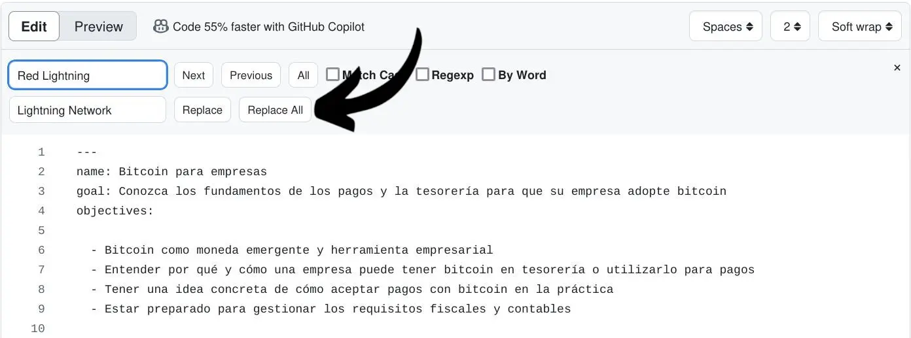
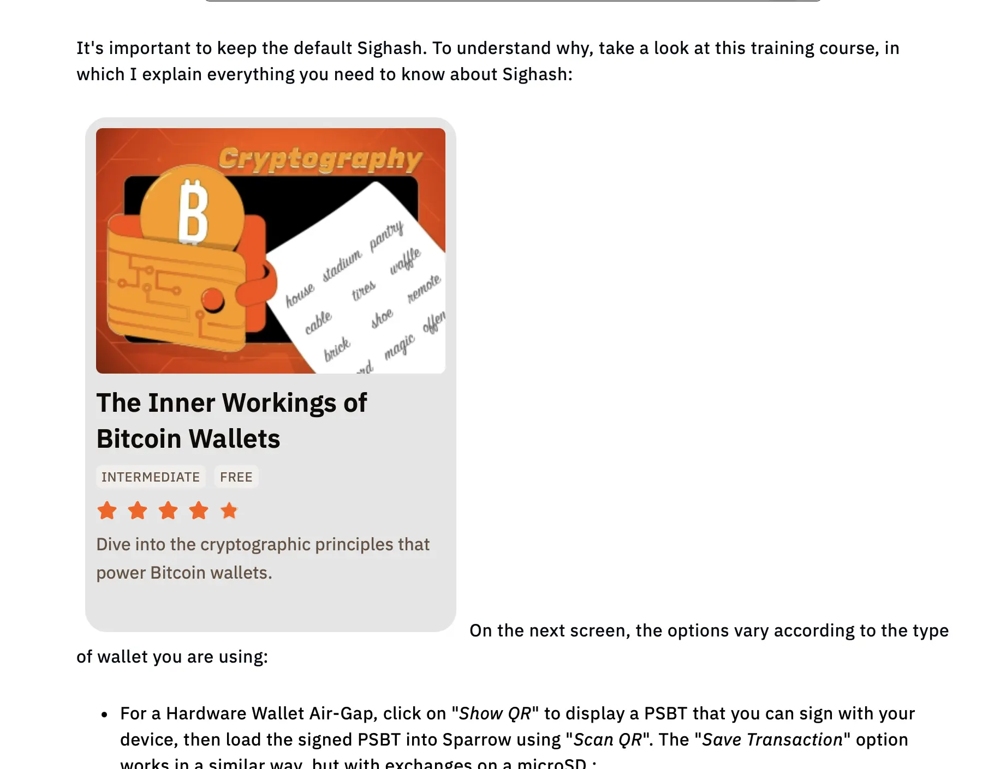

ยินดีต้อนรับสู่บทแนะนำเกี่ยวกับ **แนวทางที่ควรปฏิบัติเมื่อการพิสูจน์อักษรเนื้อหาบน Plan ₿ Academy** เราดีใจที่คุณร่วมภารกิจของเราในการแปลวัสดุ Bitcoin ให้ได้มากที่สุดเท่าที่จะเป็นไปได้ เพื่อช่วยให้ผู้คนตระหนักถึงวิธีการทำงานและวิธีการใช้งานในชีวิตประจำวันของพวกเขา


ก่อนอื่น การมีส่วนร่วมใน Plan ₿ Academy [public repository](https://github.com/PlanB-Network/bitcoin-educational-content) จะเปิดโอกาสให้คุณได้เขียนบทแนะนำ ตรวจทานเนื้อหาที่มีอยู่ หรือแม้กระทั่งเสนอการเพิ่มภาษาใหม่ลงในแพลตฟอร์ม หากต้องการทราบข้อมูลเพิ่มเติม เข้าร่วม [Telegram Group](https://t.me/PlanBNetwork_ContentBuilder) ของเราก่อน และเขียนการนำเสนอเกี่ยวกับตัวคุณและภาษาที่คุณสามารถพูดได้สั้นๆ


บทแนะนำนี้มุ่งเน้นไปที่ผู้ร่วมสมทบที่ต้องการตรวจสอบเนื้อหา ส่วนใหญ่ไม่ค่อยรู้เกี่ยวกับ [Github](https://planb.academy/en/tutorials/contribution/others/create-github-account-a75fc39d-f0d0-44dc-9cd5-cd94aee0c07c) หรือ [ภาษา Markdown](https://www.markdownguide.org/basic-syntax/) ที่เราใช้ในที่เก็บข้อมูล ดังนั้นจึงเป็นเรื่องสำคัญที่จะแบ่งปันข้อมูลเชิงลึกเกี่ยวกับปัจจัยสำคัญที่เกี่ยวข้องในงานนี้


ด้านล่างนี้ ฉันได้รวบรวมปัญหาที่พบบ่อยที่สุดที่ผู้ตรวจแก้เจอไว้แล้ว รู้สึกอิสระที่จะแนะนำเพิ่มเติม เพราะมันสามารถช่วยให้ผู้อื่นพัฒนาขึ้นได้


ก่อนที่จะเจาะลึกถึงรายละเอียด สิ่งแรกที่ควรทำคืออ่านบทแนะนำนี้เกี่ยวกับการดำเนินการที่ปฏิบัติได้จริงบน Github โดยการ fork ที่เก็บ Plan ₿ Academy, commit การเปลี่ยนแปลง และส่ง PRs:


https://planb.academy/tutorials/contribution/content/proofreading-review-tutorial-28236c98-23b2-4efd-9563-953f08707017


## การพิสูจน์อักษรคืออะไร?


การพิสูจน์อักษรเป็นกระบวนการตรวจสอบขั้นสุดท้ายของข้อความที่เขียนขึ้น เพื่อระบุและแก้ไขข้อผิดพลาดในไวยากรณ์ การสะกดคำ เครื่องหมายวรรคตอน และการจัดรูปแบบ มันช่วยให้ข้อความมีความชัดเจน สอดคล้อง และปราศจากข้อผิดพลาดก่อนการตีพิมพ์หรือการส่ง


เมื่อคุณทำงานประเภทนี้ สิ่งสำคัญคือต้องปฏิบัติตามความหมายของภาษาต้นฉบับ (EN หรือ FR) แต่ต้องแน่ใจว่าข้อความในภาษาสุดท้ายมีความลื่นไหลที่สุดสำหรับเจ้าของภาษา


โปรดจำไว้เสมอว่าการแปล/การตรวจแก้คือการศึกษา!


ในความเป็นจริง เป้าหมายร่วมกันของเราคือการให้ความรู้แก่ผู้คนให้มากที่สุดเกี่ยวกับ Bitcoin ดังนั้นจึงเป็นสิ่งสำคัญที่เนื้อหาที่พวกเขาอ่านจะต้องราบรื่นและชัดเจน

ในแง่นี้ ผู้มีส่วนร่วมทุกคนใน Plan ₿ Academy เป็นนักการศึกษา!


## ขั้นตอนแรกก่อนการพิสูจน์อักษรบน Plan ₿ Academy


ก่อนเริ่มงานพิสูจน์อักษรใหม่ ให้ประกาศใน [กลุ่ม Telegram](https://t.me/PlanBNetwork_ContentBuilder) หรือแจ้งผู้ประสานงาน Plan ₿ Academy ของคุณ ซึ่งจะเปิด [issue](https://github.com/orgs/PlanB-Network/projects/3) เฉพาะ เมื่อคุณได้รับลิงก์ issue แล้ว ให้เพียงแค่ **แสดงความคิดเห็นว่าคุณกำลังเริ่มต้น** กับงานพิสูจน์อักษรของเนื้อหานั้น


ระบบนี้ช่วยให้ผู้ประสานงานติดตามความคืบหน้าภายใน repo และช่วยให้เนื้อหาถูก "อ้างสิทธิ์" โดยผู้พิสูจน์อักษร ป้องกันความพยายามซ้ำซ้อนโดยผู้อื่น

ในประเด็นนี้ คุณจะพบลิงก์ที่นำคุณไปยังเนื้อหาเพื่อตรวจสอบ คุณสามารถคลิกที่ลิงก์เหล่านั้นได้เลย หรือจะดีกว่านั้น คุณสามารถกลับไปที่ repo ที่คุณ fork มาและทำงานจากที่นั่นโดยตรง มาดูกันว่าคุณสามารถทำได้อย่างไร!


ก่อนอื่นเลย **จำไว้เสมอว่าต้อง SYNC repo ของคุณบน "dev" branch** ด้วยวิธีนี้ เนื้อหาจะได้รับการอัปเดตก่อนที่คุณจะเริ่มงานใด ๆ และคุณจะไม่สร้างความขัดแย้งระหว่างเนื้อหาเก่าและใหม่ ตรวจสอบให้แน่ใจว่าคลิกที่ "Sync fork" และ "Update branch"


หลังจากซิงค์สำเร็จแล้ว คุณสามารถเข้าถึงเนื้อหาที่สนใจและทำการ commit บน branch ใหม่ได้โดยตรง ตามที่แสดงใน [บทแนะนำ](https://planb.academy/tutorials/contribution/content/proofreading-review-tutorial-28236c98-23b2-4efd-9563-953f08707017) นี้ หรือคุณสามารถเปิด branch ใหม่เพื่อทำงานได้ โดยคลิกที่ "Branches" ตามที่แสดงด้านล่าง


ภายในหน้านี้ คุณจะพบสาขาทั้งหมดที่คุณได้เปิดไว้แล้วภายใต้หัวข้อ "สาขาของคุณ" ส่วนนี้มีประโยชน์มากเพราะช่วยให้คุณค้นหาสิ่งที่คุณได้แก้ไขเนื้อหาได้อย่างง่ายดาย หากคุณต้องการเปิดสาขาใหม่ คุณสามารถคลิกที่ "สาขาใหม่" ที่มุมขวาบนของหน้า


จากนั้น คุณจะได้รับป๊อปอัพที่คุณต้องใส่ชื่อของสาขาใหม่ ในกรณีด้านล่างนี้ ฉันเลือกที่จะเรียกมันว่า "BTC101-FR" ด้วยวิธีนี้ ฉันจะจำได้เสมอว่าสาขานี้จำเป็นต้องใช้สำหรับการพิสูจน์อักษรของหลักสูตร BTC101 ในภาษาฝรั่งเศส และ **ฉันจะไม่ใช้มันสำหรับงานอื่นใด**


ฉันขอแนะนำให้คุณทำเช่นเดียวกัน: ตรวจสอบให้แน่ใจว่าได้เปิดสาขาใหม่ทุกครั้งที่คุณต้องเริ่มงานใหม่


หลังจากสร้างสาขาใหม่นี้แล้ว อย่าลืมคลิกที่มันจาก "Your Branches" ในหน้าก่อนหน้าและเริ่มทำงานกับไฟล์ *.md* ที่เกี่ยวข้องกับเนื้อหาเฉพาะ (ในกรณีของฉัน ฉันจะคลิกที่ "courses" -> "BTC101" -> "fr.md") การ commit ทั้งหมดที่เกี่ยวข้องกับไฟล์เฉพาะจะต้องถูก commit (บันทึก) ภายในสาขาเดียวกันนี้


## ต้นฉบับหรือการแปล?


เมื่อทำการพิสูจน์อักษรของเนื้อหา สิ่งสำคัญคือต้อง **ตรวจสอบต้นฉบับภาษาอังกฤษ (หรือฝรั่งเศส)** เสมอ โปรดทราบว่าเราใช้เครื่องมือภาษาของ AI ในการแปล ดังนั้นการแปลในภาษาปลายทางอาจไม่ราบรื่นหรือเข้าใจได้ดีสำหรับผู้อ่านสุดท้าย


ดังนั้น อย่าลังเลที่จะปรับเปลี่ยนข้อความและแก้ไขประโยคหากจำเป็น วัตถุประสงค์ของเราคือการเพิ่มความลื่นไหล แต่ต้องคงความหมายเดิมไว้เสมอ หากมีข้อสงสัยเกี่ยวกับวิธีการแปลคำเฉพาะ ให้สอบถามผู้ประสานงานการแปล


เครื่องมือ LLM อาจแปลคำบางคำที่เกี่ยวข้องกับ Bitcoin เป็นคำตรงตัว เช่นเดียวกับ Lightning Network โดยเฉพาะอย่างยิ่งเมื่อเป็นคำที่มีความเชิงเทคนิคสูง ในกรณีเช่นนี้ แนะนำให้คงคำภาษาอังกฤษเดิมไว้ในภาษาปลายทางเพื่อความชัดเจนที่ดียิ่งขึ้น เว้นแต่กฎของภาษาของคุณจะบังคับให้คุณต้องแปลทุกคำ


ในกรณีที่สองนี้ **ควรทำการค้นคว้าเสมอเพื่อดูว่ามีใครในชุมชน Bitcoin ของคุณได้แปลคำนั้นแล้วหรือยัง** และตอนนี้มันถูกใช้อย่างแพร่หลายแล้วหรือไม่


- วิธีแก้ปัญหาหนึ่งอาจเป็นการ **ตรวจสอบบน [BitcoinWiki](https://en.bitcoin.it/wiki/Main_Page)** ในภาษาที่คุณต้องการเพื่อดูว่าคำนี้ถูกแปลหรือไม่ หากไม่ถูกแปล ให้คงคำในภาษาอังกฤษไว้


- ในกรณีใด ๆ คำแนะนำของฉันคือให้ **ใส่คำ EN เข้าไปด้วย** โดยเพิ่มความหมายที่สอดคล้องกันในภาษาปลายทางภายในวงเล็บกลม ตามรูปแบบ EN (LANG) หรือในทางกลับกัน เช่น Address (indirizzo) หรือ indirizzo (address)


- อีกวิธีแก้ปัญหาที่ดีคือการเก็บคำ/วลี EN ต้นฉบับไว้ แล้ว **สร้างไฮเปอร์ลิงก์** ที่เปลี่ยนเส้นทางไปยัง [glossary](https://planb.academy/en/resources/glossary) บน planb.network ในการทำเช่นนี้ คุณต้องใส่คำ/วลีไว้ในวงเล็บเหลี่ยม และใส่ลิงก์ไว้ในวงเล็บกลม ดังที่คุณเห็นในตัวอย่างด้านล่าง:


```
[UTXO](https://planb.academy/resources/glossary/utxo)
```


ในผลลัพธ์สุดท้าย (ภาพด้านล่าง) คุณจะไม่เห็นลิงก์ทั้งหมด และคำจะกลายเป็นคลิกได้


โปรดทราบว่าลิงก์พจนานุกรมที่คุณจะนำมาจากเว็บไซต์มีรหัสภาษาหลังคำว่า "network" (ตัวอย่าง: ``https://planb.academy/en/resources/glossary/utxo`` -> ที่นี่คุณสามารถอ่านรหัสภาษา "en") ในกรณีนี้ **ลบรหัสภาษาออกจากลิงก์** ดังที่คุณเห็นในกล่องด้านบน ด้วยวิธีนี้ ระบบจะนำผู้อ่านไปยังภาษาที่กำหนดโดยอัตโนมัติ


เนื้อหาในที่เก็บข้อมูลเต็มไปด้วยไฮเปอร์ลิงก์เช่นนี้ข้างต้น ตอนนี้ที่คุณรู้แล้วว่ามันหมายถึงอะไร **อย่าลบลิงก์ใดๆ** ที่ใส่โดยผู้เขียนต้นฉบับ


- สิ่งที่เกี่ยวข้องกับการแสดงผลคำคือสิ่งต่อไปนี้ หากคุณพบ "Plan ₿ Academy" ในข้อความ **ให้คงรูปแบบเดิมนี้ไว้** อย่าแปลคำว่า "plan" หรือคำว่า "network" นอกจากนี้ อย่าใช้คำว่า "The" เมื่อนำเสนอ Plan ₿ Academy: **พิจารณาว่าเป็นแบรนด์**


- เช่นเดียวกันกับ "₿-CERT", "BIZ SCHOOL", "TECH SCHOOL", ซึ่งควรเก็บไว้ในรูปแบบเดิมเช่นกัน


หมายเหตุสุดท้ายสำหรับย่อหน้านี้: ดังที่เราได้กล่าวไว้ข้างต้น เราใช้เครื่องมือ AI ในการแปลเนื้อหา และจากนั้นเราขอให้ผู้ร่วมงานเข้ามาช่วยตรวจสอบเพื่อให้แน่ใจว่าทุกอย่างลื่นไหลและผ่านการพิสูจน์อักษรอย่างดีแล้ว


หากคุณใช้ AI ในการตรวจสอบข้อความส่วนใหญ่ เราจะสังเกตเห็นอย่างแน่นอน เนื่องจากเราคุ้นเคยกับโครงสร้างประโยคทั่วไปที่ AI สร้างขึ้น หากเราพบว่าคุณพึ่งพา AI ในการตรวจสอบเพียงอย่างเดียว โดยไม่ได้ทำการเปลี่ยนแปลงที่สำคัญ รางวัลสุดท้ายใน sats อาจลดลงครึ่งหนึ่ง!


## โครงสร้างของส่วนหัว


ในภาษา markdown หัวเรื่อง (และชื่อย่อหน้า) ทั้งหมดเริ่มต้นด้วยเครื่องหมายแฮช ``#`` จำนวนเครื่องหมายแฮชสอดคล้องกับระดับหัวเรื่อง ตัวอย่างเช่น หัวเรื่องระดับสามจะมีเครื่องหมายแฮชสามตัวก่อนข้อความ (เช่น `### My Header`)


ในหลักสูตร ส่วนที่สำคัญที่สุดจะถูกแนะนำด้วยเครื่องหมายแฮชหนึ่งตัว ในขณะที่ส่วนย่อยสามารถมีเครื่องหมายแฮชตั้งแต่สองถึงสี่ตัว ในบทแนะนำ เรามักจะใช้หัวข้อที่มีเครื่องหมายแฮชสองตัวเท่านั้น


ตรวจสอบให้แน่ใจว่า **อย่าลบเครื่องหมายแฮช** ก่อนชื่อเรื่องเด็ดขาด มิฉะนั้นคุณจะสร้างปัญหาให้กับโครงสร้างของข้อความ


ในขณะเดียวกัน **อย่าเปลี่ยน** ส่วน chapterID ที่คุณเห็นในภาพด้านบน, ``<chapterId>d668fdf6-fb4c-4bbf-82e1-afcb95c122e0</chapterId>`` หรือการอ้างอิงวิดีโอเช่น ``:::video id=ba99951f-81d2-418f-b5e7-4b8c9f8b8cc8:::``.


เมื่อเราใส่ ``#`` ก่อนชื่อเรื่อง มันจะกลายเป็นตัวหนาโดยอัตโนมัติในตัวอย่างคอร์ส ดังนั้น **หลีกเลี่ยงการทำให้ชื่อเรื่องเป็นตัวหนาระหว่างการแก้ไข**.


ในฐานะที่เป็นหมายเหตุเพิ่มเติม ในเวอร์ชัน EN ของหลักสูตร **ชื่อที่เริ่มต้นด้วยหนึ่งหรือสอง ``#`` จะมีคำทั้งหมดขึ้นต้นด้วยตัวอักษรใหญ่** ในขณะที่ชื่อที่เริ่มต้นด้วยสามหรือสี่ ``#`` มักจะไม่ปฏิบัติตามกฎนี้ หากเป็นไปได้ โปรดตรวจสอบให้แน่ใจว่าชื่อในภาษาปลายทางของคุณปฏิบัติตามโครงสร้างนี้


## ส่วนเริ่มต้นของหลักสูตร


At the beginning of any content, you will find the following static lowercase words: "name", "description", "objectives". They are used by the website to decode the content itself and are **always left in EN**. As a consequence, DO NOT translate them, otherwise the content will create synchronization issues. Make sure to only proofread the part after the colon, which is automatically translated by AI.


ในส่วนเริ่มต้นนี้ ให้รักษารูปแบบตามที่เป็นอยู่ อย่าเพิ่มอะไรที่จุดเริ่มต้นของข้อความ เช่น หลีกเลี่ยงการเพิ่ม "tt" ก่อนขีดเส้น ดังในภาพด้านล่าง!


## วิธีจัดการกับภาพหลักสูตร


เว็บไซต์ของเราตอนนี้มีภาพที่แปลแล้วสำหรับเกือบทุกหลักสูตร!


เมื่อคุณตรวจทาน ให้ตรวจสอบเสมอว่าภาพทั้งหมดมีอยู่และแสดงผลอย่างถูกต้อง ใน `code view` หากคุณพบบรรทัดลักษณะนี้ `` หมายความว่าจะมีการแสดงภาพที่นั่น


ตรวจสอบให้แน่ใจว่าคุณเพิ่มบรรทัดใหม่ระหว่างโค้ดรูปภาพและข้อความเสมอ ตัวอย่างด้านล่าง:


```
WRONG CONFIGURATION:
- to start translating, click on the button `Translate`: 
To save, click on `save`!


RIGHT CONFIGURATION:

- to start translating, click on the button `Translate`:


To save, click on `save`!
```


นอกจากนี้ อย่าลืมอ่านเนื้อหาของแต่ละภาพ หากคุณสังเกตเห็นปัญหาใด ๆ กับการแปลข้อความภายในภาพ แจ้งผู้ประสานงานของคุณและคุณจะมีโอกาสในการพิสูจน์อักษรด้วย!


คุณสามารถดูภาพในส่วน `Preview` ของ Github (หรือบนเว็บไซต์ของเรา เปิดในแท็บใหม่) จากนั้นกลับมาที่ส่วน `code` ข้างๆ เพื่อการตรวจสอบคำอีกครั้ง


## คำแนะนำเกี่ยวกับรูปแบบ


ด้านล่างนี้คุณสามารถพบตัวอย่างบางส่วนของปัญหารูปแบบที่ควรใส่ใจเมื่อทำการพิสูจน์อักษรเนื้อหาในภาษาที่คุณต้องการ


- ใส่ใจกับเครื่องหมายวรรคตอนที่แปลก ๆ เช่น `\*\*\` หรือ ``**`` ซึ่งอาจแสดงถึงการแสดงผลที่ไม่ถูกต้องของสัญลักษณ์ตัวหนา ในภาพด้านล่าง คุณจะเห็นว่าเครื่องหมายดอกจันอยู่ทางขวาของคำเท่านั้น ซึ่งดูแปลก ๆ


ดังนั้น ให้ตรวจสอบข้อความภาษาอังกฤษต้นฉบับเสมอว่ามีข้อความตัวหนาหรือไม่ ในกรณีนี้ เพียงแค่เพิ่มดอกจันสองตัวที่จุดเริ่มต้นของคำ เพื่อให้แสดงผลได้ถูกต้องบนเว็บไซต์ ในความเป็นจริง ในภาษามาร์กดาวน์ **เพื่อให้แสดงผลเป็นตัวหนา คุณต้องใส่ดอกจันสองตัว ``**`` ทั้งก่อนและหลังคำ/ประโยค** (ดูตัวอย่างด้านล่าง)


- ปัญหาเดียวกันอาจเกิดขึ้นกับสัญลักษณ์เช่น $ และ `` ` ``.

ตรวจสอบไฟล์ภาษาต้นฉบับ (มักจะเป็น EN หรือ FR) เพื่อดูว่าสัญลักษณ์เหล่านี้ควรอยู่ที่ใด คุณสามารถขอความช่วยเหลือจากผู้ประสานงานในเรื่องนี้ได้เสมอ


- หากคุณพบคำคม โปรดทำการค้นคว้าออนไลน์เพื่อหาคำแปลที่ถูกต้องในภาษาของคุณ คำคมมักจะถูกแทรกหลังจากสัญลักษณ์ ``>``


## การพิสูจน์อักษรบทแนะนำ


หากคุณตัดสินใจที่จะตรวจสอบบทแนะนำ ผู้ประสานงานจะเปิดประเด็นเฉพาะสำหรับ **ส่วนบทแนะนำทั้งหมด** เมื่อคุณทำงานเสร็จ คุณสามารถบันทึกความคืบหน้าโดยแสดงความคิดเห็นในประเด็นนั้นพร้อมกับรายการบทแนะนำที่ได้ตรวจสอบ: ด้วยวิธีนี้ คุณจะสร้างระบบการติดตามที่ชัดเจนสำหรับการอ้างอิงในอนาคต ซึ่งเป็นสิ่งสำคัญเพราะมีการเพิ่มเนื้อหาใหม่ทุกเดือน คุณสามารถดูตัวอย่างของวิธีการนี้ [ที่นี่](https://github.com/PlanB-Network/bitcoin-educational-content/issues/3023#issuecomment-3364923190)


เนื่องจากมีการเพิ่มบทเรียนใหม่ทุกเดือน สาขาของคุณอาจล้าสมัยในระหว่างกระบวนการพิสูจน์อักษร นักพิสูจน์อักษรบางคนได้แก้ปัญหานี้โดยการซิงโครไนซ์สาขาที่พวกเขากำลังทำงานอยู่: **กรุณาอย่าทำเช่นนั้นเด็ดขาด! หากคุณทำ คุณเสี่ยงที่จะสูญเสียความก้าวหน้าทั้งหมดที่คุณได้ทำมาจนถึงตอนนั้น!**


แทนที่จะทำเช่นนั้น คุณควรจะเสร็จสิ้นการพิสูจน์อักษรของบทแนะนำใน fork ปัจจุบันของคุณก่อน จากนั้น, **ซิงค์ `dev`**, และสร้างสาขาใหม่ที่คุณจะมุ่งเน้นไปที่การพิสูจน์อักษรบทแนะนำที่เพิ่มเข้ามาใหม่ (เฉพาะบทที่ขาดหายไปจากสาขาก่อนหน้าของคุณ)


ในบทแนะนำ มีโอกาสที่**ภาพอาจจะไม่ได้รับการแปล** เนื่องจากบทแนะนำส่วนใหญ่**เขียนขึ้นในภาษาฝรั่งเศสหรือภาษาอังกฤษ** คุณอาจพบภาพที่มีคำสั่งหรือคำแนะนำในภาษาต้นฉบับ ลองมาดูตัวอย่างจากบทแนะนำเกี่ยวกับ Sparrow ในภาษาดัตช์ โดยรายงานทั้งข้อความและภาพที่เกี่ยวข้อง


```
Verbinding maken met een openbaar knooppunt is heel eenvoudig. Klik op het tabblad "_Publieke server_".
```


ตามที่คุณเห็น ภาพชี้ไปที่ `Public Server` อย่างชัดเจนในภาษาอังกฤษ ในขณะที่ข้อความกล่าวถึงวลี `_Publieke server_` ในกรณีนี้ มีปัญหาความสอดคล้องกัน เพราะผู้อ่านพบข้อมูลที่ขัดแย้งกันเมื่อเปรียบเทียบภาพกับข้อความ


ในการแก้ไขปัญหานี้ คุณสามารถใส่คำสั่งตามที่ปรากฏในภาพ (ภาษาอังกฤษหรือภาษาฝรั่งเศส) ตามด้วยคำแปลในภาษาของคุณภายในวงเล็บ ดังที่แสดงด้านล่าง:


```
Verbinding maken met een openbaar knooppunt is heel eenvoudig. Klik op het tabblad "_Public Server_" (Publieke server).
```


## ตรวจสอบคำถามแบบทดสอบ


คุณรู้หรือไม่ว่าคุณสามารถตรวจสอบคำถามในแบบทดสอบของทุกหลักสูตรได้ด้วย? ตัวอย่างเช่น หากคุณต้องการตรวจสอบแบบทดสอบสำหรับ BTC101 ใน IT คุณสามารถเปิดสาขาที่กำหนดและทำตามเส้นทางนี้: "courses" -> "BTC101" -> "quiz" ที่นั่นคุณจะพบโฟลเดอร์ทั้งหมดที่เกี่ยวข้องกับแต่ละคำถาม พร้อมกับไฟล์ภาษาที่เกี่ยวข้องในรูปแบบ _yml_


อีกครั้ง ตรวจสอบให้แน่ใจว่าคุณอยู่ในสาขาที่เปิดขึ้นมาเฉพาะสำหรับวัตถุประสงค์นี้ และแจ้งผู้ประสานงานเสมอ


สิ่งสำคัญที่ต้องจำไว้เมื่อพิสูจน์อักษรไฟล์ _yml_ ประเภทนี้คือหลีกเลี่ยงการเพิ่มเครื่องหมายทวิภาค ``:`` หรือเครื่องหมายอัญประกาศภายในข้อความ อันที่จริง เครื่องหมายทวิภาคจะใช้ **เฉพาะ** เพื่อแยกคู่คีย์-ค่า เช่น "wrong_answers" กับส่วนที่เหลือ คุณสามารถดูตัวอย่างในภาพด้านล่าง:


หลังจากตรวจสอบคำถามแล้ว ให้แน่ใจว่าคุณเปลี่ยนสถานะ "reviewed" จาก "false" เป็น "true" ตามที่แสดงในภาพด้านล่าง อย่าลืม **เก็บคำสถานะเหล่านี้เป็นภาษาอังกฤษ** ไม่ว่าจะทำงานในภาษาใด!


หากบรรทัดสถานะ "reviewed:true" หายไป ให้ **เพิ่มที่ท้ายแบบทดสอบ**


## การพิสูจน์อักษรอภิธานศัพท์


เช่นเดียวกับแบบทดสอบ คุณยังสามารถตรวจสอบอภิธานศัพท์ได้อีกด้วย อภิธานศัพท์ต้นฉบับเขียนเป็นภาษาฝรั่งเศส ดังนั้นคุณจะพบประโยคเช่น: "ในภาษาฝรั่งเศส วลีนี้สามารถแปลได้ว่า..."


ในกรณีเช่นนี้ โปรดปรับประโยคให้เข้ากับภาษาเป้าหมายของคุณหรือเป็นภาษาอังกฤษ ตัวอย่างเช่น คุณอาจเขียนว่า "ในภาษาอังกฤษ สำนวนนี้..."

หากชื่อเรื่องยังคงเป็นภาษาอังกฤษ คุณสามารถปรับประโยคให้เข้ากับภาษาของคุณได้: "ในภาษาสวาฮิลี การแสดงออกนี้..."


นอกจากนี้ ให้เขียนชื่อเรื่องเป็นตัวพิมพ์ใหญ่


## ชื่อเรื่องและคำอธิบายของ PR ของคุณ


เมื่อคุณส่ง PR ของคุณ จะดีมากถ้าคุณตั้งชื่อโดยใช้รูปแบบนี้: [PROOFREADING] CONTENT NAME - LANGUAGE:


```
[PROOFREADING] BTC101 - ENGLISH
```


นอกจากนี้ ใน**ส่วนความคิดเห็นของ PR** คุณสามารถเขียน "closes" + หมายเลขของปัญหาที่ผู้ประสานงานส่งให้คุณเมื่อคุณเริ่มงานการพิสูจน์อักษร โดยมี ``#`` นำหน้า

ตัวอย่างเช่น หากคุณเพิ่งส่ง PR พร้อมการพิสูจน์อักษรของ cyp201 + quizzes คุณสามารถเขียนว่า "closes [#2934](https://github.com/PlanB-Network/bitcoin-educational-content/issues/2934)"


ด้วยวิธีนี้ PR และปัญหาจะถูกเชื่อมโยงกัน และใครก็ตามที่อ่านที่เก็บ Github สาธารณะจะสามารถค้นหาข้อมูลได้อย่างง่ายดาย


## แนวปฏิบัติที่ดีที่สุดอื่น ๆ


- หากคุณต้องการค้นหาคำเฉพาะภายในข้อความ คุณสามารถคลิกที่ ``CTRL+F`` และส่วนค้นหา-แทนที่จะแสดงขึ้น ส่วนนี้มีประโยชน์มากเมื่อคุณต้องการข้ามไปยังส่วนเฉพาะของข้อความ หรือคุณต้องการแทนที่คำ/ประโยคเฉพาะเป็นชุด โดยไม่ต้องเลื่อนดูเนื้อหาทั้งหมด





เมื่อใช้ฟังก์ชัน "แทนที่ทั้งหมด" สิ่งสำคัญคือต้องตรวจสอบผลลัพธ์อย่างละเอียดเพื่อให้แน่ใจว่าลิงก์ไม่ได้ถูกเปลี่ยนแปลงด้วย ตัวอย่างเช่น หากคุณต้องการเปลี่ยนคำว่า "Bitcoin" เป็น "Bitkoin" (ซึ่งอาจจำเป็นในบางภาษา) การใช้ฟังก์ชัน "แทนที่ทั้งหมด" สามารถอัปเดตทุกกรณีในข้อความได้อย่างมีประสิทธิภาพ อย่างไรก็ตาม ควรระวังว่าฟังก์ชันนี้จะเปลี่ยนแปลงลิงก์ใดๆ ที่มีคำนั้นด้วย ซึ่งอาจนำไปสู่ปัญหาการเปลี่ยนเส้นทางได้


ในตัวอย่างด้านล่าง ผู้ตรวจสอบได้ใช้ฟังก์ชันข้างต้นเพื่อแทนที่ "satoshi" ด้วย "satoshi(sats)" และยังได้เปลี่ยนลิงก์ไปยังบทแนะนำที่มีคำนี้อยู่ด้วย เป็นผลให้ลิงก์นั้นกลายเป็นไม่ถูกต้อง


ตรวจสอบลิงก์ทั้งหมดในข้อความเสมอ เพื่อให้แน่ใจว่าถูกต้อง


- ต่อเนื่องจากหัวข้อ หากผู้เขียนแทรกลิงก์ที่อ้างอิงถึงหลักสูตรหรือบทเรียน Plan ₿ Academy (**ไม่ใช่** ภายในวงเล็บ) เว็บไซต์จะสร้าง "การ์ด" โดยอัตโนมัติที่แสดงภาพขนาดย่อที่เกี่ยวข้อง ดังนั้นควรตรวจสอบให้แน่ใจเสมอว่า **เพิ่มบรรทัดใหม่ระหว่างข้อความและลิงก์เอง** มิฉะนั้นคุณอาจเห็นข้อผิดพลาดต่อไปนี้บนเว็บไซต์





## บทสรุป


โดยสรุป การตระหนักถึงข้อผิดพลาดทั่วไปของผู้พิสูจน์อักษรสามารถช่วยให้คุณพัฒนาทักษะในการตรวจสอบเนื้อหาได้จริง ๆ เป็นเรื่องง่ายที่จะมองข้ามสิ่งต่าง ๆ เช่น บริบทหรือความสม่ำเสมอ และการจับข้อผิดพลาดเหล่านี้สามารถสร้างความแตกต่างอย่างมากได้


โปรดจำไว้เสมอว่าผู้เริ่มต้นอาจอ่านคอร์สและบทเรียนเหล่านี้ ดังนั้นจึงเป็นความรับผิดชอบของเราที่จะต้องมั่นใจว่าพวกเขาเข้าใจอย่างเต็มที่ **ในฐานะผู้ตรวจสอบ คุณคือผู้ให้ความรู้!**


ตอนนี้คุณพร้อมที่จะเริ่มหลักสูตรการพิสูจน์อักษร บทเรียน แบบทดสอบ และคำศัพท์แล้ว รอติดตามเพื่อเริ่มตรวจสอบถอดความวิดีโอด้วยเช่นกัน!


ขอบคุณที่อ่านบทแนะนำนี้ และขอให้สนุกกับการเดินทางในการพิสูจน์อักษรของคุณ!