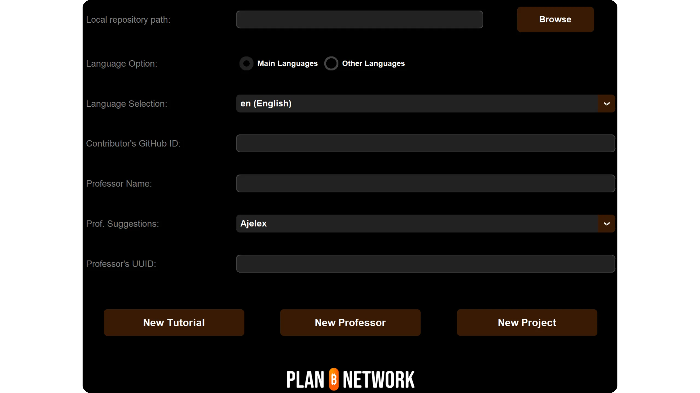
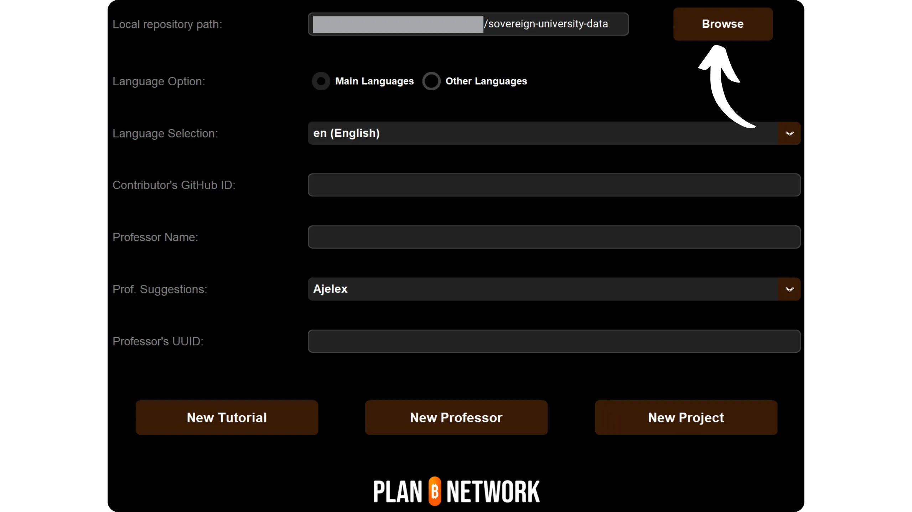
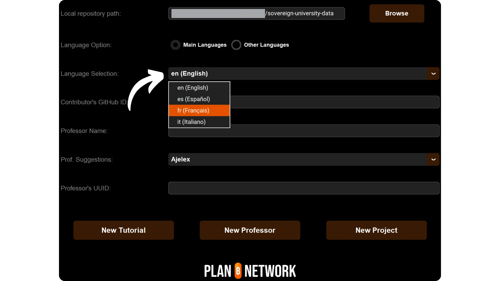
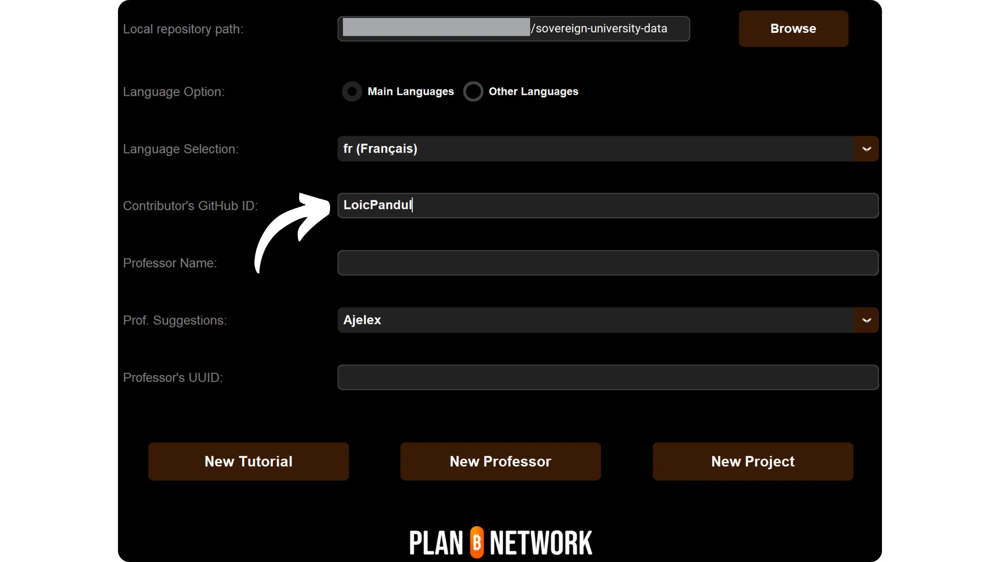
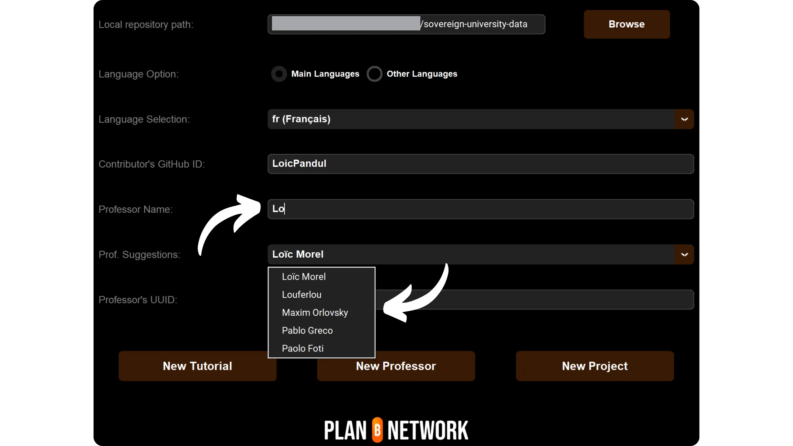
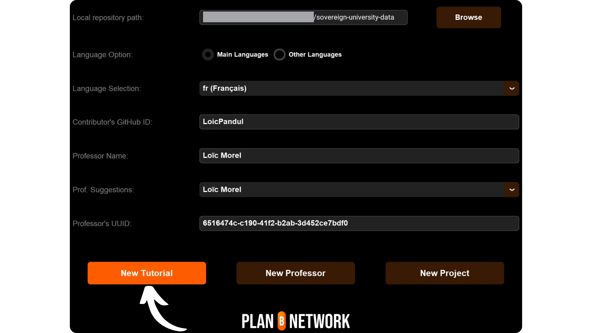

在按照本教學添加新教學之前，您必須完成一些初步步驟。如果您還沒有這樣做，我邀請您先參閱此入門教學，然後再回到這裡：


https://planb.network/tutorials/contribution/content/write-tutorials-4d142a6a-9127-4ffb-9e0a-5aba29f169e2

您已經


- 選擇您教學的主題；
- 透過 [Telegram 群組](https://t.me/PlanBNetwork_ContentBuilder) 或 paolo@planb.network 聯絡 Plan ₿ Network 團隊；
- 選擇您的貢獻工具。


在本教程中，我們將介紹如何通過 GitHub Desktop 設置本地環境，在 Plan ₿ Network 上添加您的教學。如果您已經精通 Git，這篇非常詳細的教學對您來說可能就沒有必要了。我更推薦您參考另一篇教學，在這篇教學中我只介紹了主要的指南，並沒有詳細的步驟指導：


- 經驗豐富的使用者**：


https://planb.network/tutorials/contribution/content/write-tutorials-git-expert-0ce1e490-c28f-4c51-b7e0-9a6ac9728410

如果您不想設定您的本機環境，請參考這篇專為初學者設計的教學，我們會直接透過 GitHub 的網頁 Interface 進行變更：


- 初學者 (web Interface)**：


https://planb.network/tutorials/contribution/content/write-tutorials-github-web-beginner-e64f8fed-4c0b-4225-9ebb-7fc5f1c01a79

## 先決條件


遵循本教學所需的軟體：


- [GitHub Desktop](https://desktop.github.com/)；
- Markdown 檔案編輯器，如 [Obsidian](https://obsidian.md/)；
- 程式碼編輯器 ([VSC](https://code.visualstudio.com/) 或 [Sublime Text](https://www.sublimetext.com/))。


開始教學前的先決條件：


- 擁有 [GitHub 帳戶](https://github.com/signup)；
- 擁有 [Plan ₿ Network 原始碼倉庫](https://github.com/PlanB-Network/Bitcoin-educational-content) 的 Fork；
- 擁有 [Plan ₿ Network 上的教授簡介](https://planb.network/professors) (僅限於您提出完整的教學)。


如果您在取得這些先決條件時需要協助，我的其他教程會協助您：


一旦一切就緒，而且您的本機環境也正確設定了您自己的 Plan ₿ Network 的 Fork，您就可以開始新增教學了。


## 1 - 建立新的分支


打開瀏覽器，前往 Plan ₿ Network 套件庫的 Fork 頁面。這是您在 GitHub 上建立的 Fork。您的 Fork 的 URL 應該如下所示：https://github.com/[您的使用者名稱]/Bitcoin-educational-content`：


確定您在主分支 `dev` 上，然後按一下 `Sync Fork` 按鈕。如果您的 Fork 不是最新的，GitHub 會提供更新分支的服務。繼續更新。相反，如果您的分支已經是最新的，GitHub 會通知您：


開啟 GitHub Desktop 軟體，確保您的 Fork 已在視窗左上角正確選取：


按一下 `Fetch origin` 按鈕。如果您的本地套件庫已經是最新的，GitHub Desktop 將不會建議任何額外的動作。否則會出現 `Pull origin` 選項。點擊此按鈕更新本地版本庫：


確認您確實在主分支 `dev`：


按一下此分支，然後按一下「新增分支」按鈕：


確保新分支是基於原始碼套件庫，即 `PlanB-Network/Bitcoin-educational-content`.


為您的分支命名時，要在標題中清楚說明其目的，並使用破折號分開每個單字。例如，假設我們的目標是撰寫 Sparrow Wallet 軟體的使用教學。在這種情況下，專門撰寫這份教學的工作分支可以命名為：`tuto-sparrow-Wallet-loic`。輸入適當的名稱後，點選 `Create branch` 確認分支的建立：


現在按一下 `Publish branch` 按鈕，將您的新工作分支儲存到 GitHub 上的線上 Fork：


現在，在 GitHub 桌面上，您應該會發現自己在新的分支上。這意味著您在本地電腦上所做的所有變更，都會被保存在這個特定的分支上。此外，只要在 GitHub Desktop 上仍然選擇了這個分支，您電腦上可見的檔案就是這個分支 (`tuto-sprow-Wallet-loic`)的檔案，而不是主分支 (`dev`)的檔案。


每發表一篇新文章，您都需要從 `dev` 建立一個新的分支。Git 中的分支是專案的平行版本，讓您可以在不影響主分支的情況下進行變更，直到工作準備好合併為止。


## 2 - 加入教學檔案


現在工作分支已經建立，是時候整合您的新教學了。您有兩個選擇：使用我的 Python 腳本，它會自動建立必要的文件，或是手動建立每個檔案。我們會看看每種選項的步驟。


### 使用我的 Python 指令碼


您需要在您的機器上安裝：


- Python 3.8 或更高版本。


若要使用指令碼，請導航至儲存指令碼的資料夾。腳本位於 Plan ₿ Network 資料庫的路徑：Bitcoin-educational-content/scripts/tutorial-related/data-creator`。


進入資料夾後，安裝相依性：


```
pip install -r requirements.txt
```


然後使用指令啟動軟體：


```
python3 main.py
```


圖形化使用者 Interface (GUI) 將會開啟。第一次使用時，您需要輸入所有必要資訊，但在之後的使用中，腳本會記住您的個人資訊，因此您不需要再次輸入。





首先輸入您複製套件庫中的 `/tutorials`資料夾 (`.../Bitcoin-educational-content/tutorials/`)的本機路徑。您可以手動輸入，或按一下「瀏覽」按鈕，使用檔案總管進行導覽。





選擇您撰寫教學的語言。





在「貢獻者的 GitHub ID」欄位中，輸入您的 GitHub 使用者名稱。





接下來，您需要填寫您的教授簡介。有幾個選項可供您選擇：


- 在「教授姓名」欄中輸入您姓名的首字母。您的姓名將出現在下面的「教授建議」下拉清單中。按一下即可選擇；
- 或者，您可以直接點擊「教授建議」下拉清單，選擇您的教授姓名。


此操作將自動在相應欄位中填入您的教授 UUID。





如果您還沒有教授檔案，請查看此教學：


https://planb.network/tutorials/contribution/others/create-teacher-profile-8ba9ba49-8fac-437a-a435-c38eebc8f8a4

然後按一下「新教學」按鈕。





為您的教學選擇一個主類別。然後根據您選擇的主類別，選擇相關的子類別。


決定教學的難度等級。


為專為您的教學建立的目錄選擇一個名稱。此資料夾的名稱應反映教學中涵蓋的軟體，並使用連字線分隔字詞。例如，資料夾可命名為 `red-Wallet`：


project_id`是指教學中涉及的工具背後的公司或組織的UUID，可在[項目列表](https://github.com/PlanB-Network/Bitcoin-educational-content/tree/dev/resources/projects)中找到。例如，關於 Sparrow Wallet 的教學，您可以在檔案中找到它的「project_id」：Bitcoin-educational-content/resources/projects/sparrow/project.yml`。此資訊會被加入到您的教學 YAML 檔案中，因為 Plan ₿ Network 會維護一個資料庫，其中包含活躍於 Bitcoin 或相關專案的公司和組織。透過加入相關的 `project_id`，您可以將您的內容連結到相關的實體。


*** 更新：*** 在新版本的腳本中，您不再需要手動輸入 `project_id`。新增搜尋功能，可依名稱找到專案，並自動擷取對應的「project_id」。在 「專案名稱 」欄位中輸入專案名稱的開頭來搜尋，然後從下拉式功能表中選擇所需的公司。`project_id`將自動填入下方欄位。如果需要，您也可以手動輸入。


對於標籤，請選擇 2 或 3 個與您的教學內容相關的關鍵字，完全從 [Plan ₿ Network 標籤清單](https://github.com/PlanB-Network/Bitcoin-educational-content/blob/dev/docs/50-planb-tags.md) 中選擇。本軟體也提供下拉清單的關鍵字搜尋功能。


輸入並驗證所有資訊後，按一下「建立教學」以確認建立您的教學檔案。這將在本機 generate 您的教學資料夾以及所選類別中所有必要的檔案。


現在您可以跳過「沒有我的 Python 指令碼」這一小節以及步驟 3「填入 YAML 檔案」，因為指令碼已經為您完成這些動作。直接進入步驟 4，開始撰寫您的教學。


有關這個 Python 腳本的更多資訊，您也可以查看 [README](https://github.com/PlanB-Network/Bitcoin-educational-content/blob/dev/scripts/tutorial-related/new-tutorial-creation/README.md)。


### 沒有我的 Python 指令碼


開啟您的檔案管理員，並導覽到「Bitcoin-educational-content」資料夾，它代表您的套件庫的本機複製。通常您可以在 `Documents\GitHub\Bitcoin-educational-content` 下找到它。


在此目錄中，您需要找到適當的子資料夾，以放置您的教學。資料夾組織反映了 Plan ₿ Network 網站的不同部分。在我們的範例中，由於我們想要新增關於 Sparrow Wallet 的教學，我們應該導航到下列路徑：Bitcoin-educational-content/tutorials/Wallet「，它对应于网站上的 」Wallet "部分：


在 `Wallet` 資料夾中，您需要建立一個專門用於教學的新目錄。此資料夾的名稱應讓人聯想到教學中涵蓋的軟體，並確保用破折號連接字詞。在我的範例中，資料夾將命名為 `sparrow-Wallet`：


在這個專屬於您教學的新子資料夾中，需要新增幾個 Elements：


- 建立`assets`資料夾，用來接收教學所需的所有插圖；
- 在這個 `assets` 資料夾內，您需要建立一個子資料夾，根據教學的原始語言代碼命名。例如，如果教學以英文撰寫，則此子資料夾必須命名為 `en`。將教學的所有視覺資料（圖表、影像、螢幕截圖等）放在此資料夾中。
- 必須建立一個 `tutorial.yml` 檔案，以記錄與您的教學相關的詳細資訊；
- 要建立一個 markdown 格式的檔案來撰寫教學的實際內容。此檔案的標題必須依據撰寫的語言代碼。例如，如果是以法文撰寫的教學，則檔案的名稱必須為 `fr.md`。


總括而言，以下是要建立的檔案層級：


```
bitcoin-educational-content/
└── tutorials/
└── wallet/ (to be modified with the correct category)
└── sparrow-wallet/ (to be modified with the name of the tutorial)
├── assets/
│   ├── en/ (to be modified according to the appropriate language code)
├── tutorial.yml
└── en.md (to be modified according to the appropriate language code)
```


## 3 - 填寫 YAML 檔案


複製以下範本，填入 `tutorial.yml` 檔案：


```
id:

project_id:

tags:
-
-
-

category:

level:

professor_id:

# Proofreading metadata

original_language:
proofreading:
- language:
last_contribution_date:
urgency:
contributor_names:
-
reward:
```


以下是必填欄位：


- id** ：UUID (_Universally Unique Identifier_)，用來唯一識別教學。您可以使用 [線上工具](https://www.uuidgenerator.net/version4) generate 它。唯一的要求是這個 UUID 是隨機的，以避免與平台上的其他 UUID 衝突；


- project_id** ：教程中展示的工具背後的公司或組織的 UUID [來自專案清單](https://github.com/PlanB-Network/Bitcoin-educational-content/tree/dev/resources/projects)。例如，如果您要建立一個關於 Green Wallet 軟體的教學，您可以在下列檔案中找到這個 `project_id`：`Bitcoin-educational-content/resources/projects/blockstream/project.yml`。此資訊會加入到您的教學 YAML 檔案中，因為 Plan ₿ Network 會維護所有在 Bitcoin 或相關專案上運作的公司和組織的資料庫。透過加入連結到您的教學的實體的「project_id」，您就在兩個 Elements 之間建立了連結；


- 標籤** ：從 Plan ₿ Network 標籤清單中](https://github.com/PlanB-Network/Bitcoin-educational-content/blob/dev/docs/50-planb-tags.md) 獨家選取 2 或 3 個與教學內容相關的關鍵字；


- 類別** ：根據 Plan ₿ Network 網站結構，與教學內容相對應的子類別（例如，對於錢包：`桌面`、`硬體`、`行動`、`備份`）；


- 等級** ：教學的難度等級，可從下列項目中選擇：
    - 初學者
    - 中級
    - `進階`
    - `專家`


- professor_id** ：您的 `professor_id` (UUID) 顯示在 [您的教授簡介](https://github.com/PlanB-Network/Bitcoin-educational-content/tree/dev/professors)；


- original_language** ：教學的原始語言 (例如 `fr`、`en` 等)；


- 校對** ：有關校對過程的資訊。完成第一部分，因為校對自己的教程算作第一次驗證：
    - language** ：校對的語言代碼 (例如 `fr`、`en` 等)。
    - last_contribution_date** ：當天的日期。
    - 迫切性** ：1
    - contributor_names** ：您的 GitHub ID。
    - 獎勵** ：0


有關教師 ID 的詳細資訊，請參閱相應的教學：


https://planb.network/tutorials/contribution/others/create-teacher-profile-8ba9ba49-8fac-437a-a435-c38eebc8f8a4

```
id: e84edaa9-fb65-48c1-a357-8a5f27996143

project_id: 3b2f45e6-d612-412c-95ba-cf65b49aa5b8

tags:
- wallets
- software
- keys

category: mobile

level: beginner

professor_id: 6516474c-c190-41f2-b2ab-3d452ce7bdf0

# Proofreading metadata

original_language: fr
proofreading:
- language: fr
last_contribution_date: 2024-11-20
urgency: 1
contributor_names:
- LoicPandul
reward: 0
```


完成修改您的 `tutorial.yml` 檔案後，按一下 `File > Save` 儲存您的文件：


現在您可以關閉程式碼編輯器。


## 4 - 填寫 Markdown 檔案


現在，您可以打開將存放您教學的檔案，以您的語言代碼命名，例如 `fr.md`。進入 Obsidian，在視窗左側捲動資料夾樹，直到找到您的教學資料夾以及您要找的檔案：


按一下檔案即可開啟：


我們將從填寫文件頂端的 `Properties` 區段開始。


手動新增並填寫下列程式碼區塊：


```
---
name: [Title]
description: [Description]
---
```


填入您的教學名稱和簡短說明：


然後，在教學的開頭加入封面影像的路徑。要做到這一點，請注意：


```

```


當需要在教學中加入圖片時，此語法將非常有用。感嘆號表示這是一張圖片，並在括弧之間指定了替代文字 (alt)。括號之間表示圖片的路徑：


## 5 - 加入標誌和封面


在 `assets` 資料夾中，您必須新增一個名為 `logo.webp` 的檔案，作為您文章的縮圖。此圖片必須為「.webp」格式，且尺寸必須為正方形，以便與使用者 Interface 協調。您可以自由選擇本教學所涵蓋軟體的標誌或任何其他相關圖片，但必須是無版權圖片。此外，也請在相同位置新增標題為「cover.webp」的圖片。此圖片將顯示在教學的頂部。請確保這張圖片與標誌一樣，尊重使用權並適合您的教學內容：

## 6 - 撰寫教學並加入視覺效果


繼續撰寫教學內容。當您想要整合副標題時，應用適當的 markdown 格式，在文字前加上 `##`：


`assets` 資料夾中的語言子資料夾可用來儲存圖表和視覺效果，這些圖表和視覺效果將隨附於您的教學。盡可能避免在您的圖像中包含文字，使您的內容能為國際觀眾所接受。當然，所介紹的軟體會包含文字，但如果您在軟體截圖上加入圖表或其他指示，請不要使用文字，如果證明文字不可或缺，則使用英文。


要為您的圖片命名，只需使用與它們在教學中出現的順序相對應的數字，格式為兩位數字（或三位數字，如果您的教學包含超過 99 個圖片）。例如，將第一個影像命名為 `01.webp`，第二個命名為 `02.webp`，依此類推。


您的圖片必須是 `.webp` 格式。如有需要，您可以使用 [我的圖片轉換軟體](https://github.com/LoicPandul/ImagesConverter)。


若要在文件中插入圖表，請使用下列 Markdown 指令，確保指定適當的替代文字以及圖片的正確路徑：


```

```


開頭的感嘆號表示這是一張圖片。替代文字放在括號之間，有助於存取和 SEO。最後，括號之間會標示圖片的路徑。


如果您想要建立自己的圖表，請務必遵守 Plan ₿ Network 的圖形章程，以確保視覺上的一致性：


- 字型**：使用 [Rubik](https://fonts.google.com/specimen/Rubik)；
- 顏色**：
 - 橙色：#FF5C00
 - 黑色：#000000
 - 白色：#FFFFFF


**所有整合到您的教學中的視覺圖片必須是無權或尊重原始檔案的授權**。此外，所有在 Plan ₿ Network 上發佈的圖表都和文字一樣，以 CC-BY-SA 授權方式提供。

**-> 提示：** 當公開分享檔案（例如圖片）時，移除任何不必要的元資料非常重要。這可能包含敏感資訊，例如位置資料、建立日期或作者的詳細資訊。為了保護您的隱私，建議您刪除這些 metadata。為了簡化這個過程，您可以使用 [Exif Cleaner](https://exifcleaner.com/) 之類的專門工具，它可以透過簡單的拖放方式清理文件的元資料。

## 7 - 儲存並提交教學


當您完成以您選擇的語言撰寫教學後，下一步就是提交**Pull Request**。接下來，管理員將利用我們的自動翻譯方法與人工審核，為您的教學加入任何遺漏的翻譯。


要繼續處理 Pull Request，請打開 GitHub Desktop 軟體。該軟件應該會自動檢測出您在本地分支上所做的變更，與原始版本庫相比。在繼續之前，請在 Interface 的左側仔細檢查這些變更是否符合您的預期：


為您的提交新增一個標題，然後按一下藍色的「提交到 [您的分支]」按鈕來驗證這些變更：


提交是保存對分支所做的變更，並附有描述性的訊息，允許跟隨專案隨著時間的演進。它算是一個中間檢查點。


然後按一下 `Push origin` 按鈕。這將會把您的提交傳送到您的 Fork：


如果您還沒有完成您的教學，您可以稍後再回來做新的提交。如果您已完成此分支的變更，請點選 ` 預覽 Pull Request` 按鈕：


您可以最後一次檢查您的修改是否正確，然後按一下「建立拉取請求」按鈕：


拉取請求（Pull Request）是將您的分支中的變更整合到 Plan ₿ Network 套件庫的主分支中的請求，它允許在合併之前對變更進行審查和討論。


您在 GitHub 上的瀏覽器將會自動重定向到您的 Pull Request 的準備頁面：


註明一個標題，簡要概括您希望與原始碼倉庫合併的變更。加入簡短的註解說明這些變更 (如果您有與建立教學相關的問題編號，記得在註解中註明 `關閉 #{issue number}`)，然後點選 Green `建立拉取請求` 按鈕以確認合併請求：


之後您的 PR 就會出現在 Plan ₿ Network 主儲存庫的「Pull Request」標籤中。您所要做的就是等待管理員與您聯絡，確認您的貢獻已被合併或要求任何額外的修改。


在您的 PR 與主分支合併之後，建議刪除您的工作分支 (`tuto-sprow-Wallet`)，以保持 Fork 的歷史清白。GitHub 會自動在您的 PR 頁面上提供這個選項：


在 GitHub 桌面軟體上，您可以切換回 Fork 的主分支 (`dev`)。


如果您希望在提交 PR 之後修改您的貢獻，程序取決於您 PR 的當前狀態：


- 如果您的 PR 仍未合併，請在本地進行修改，同時保持在同一分支上。一旦修改完成，請使用 `Push origin` 按鈕，為仍未合併的 PR 新增一次提交；
- 如果您的 PR 已經與主分支合併，您需要重新建立新的分支，然後再提交新的 PR。在繼續之前，請確認您的本機套件庫與 Plan ₿ Network 原始套件庫同步。


如果您在提交教程時遇到技術困難，請不要猶豫，在 [我們專用的 Telegram 投稿群組](https://t.me/PlanBNetwork_ContentBuilder) 上尋求幫助。謝謝！