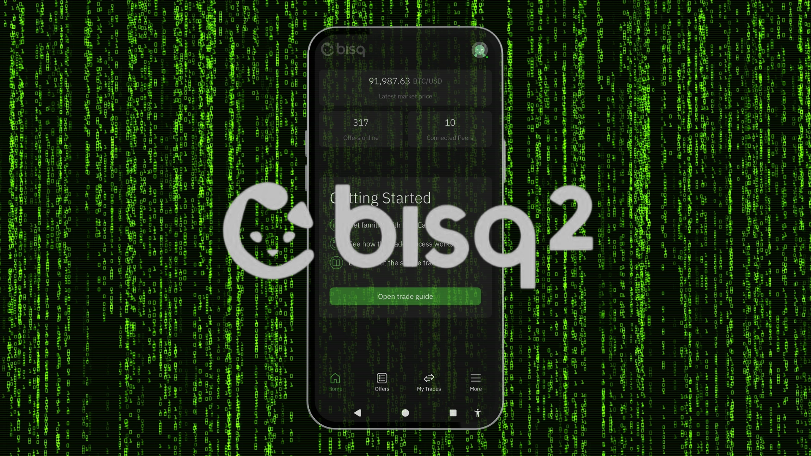

## Inleiding

Het [Bisq Easy](https://bisq.network/bisq-easy/) handelsprotocol is ontworpen voor [Bisq 2](https://github.com/bisq-network/bisq2), de opvolger van [Bisq v1](https://github.com/bisq-network/bisq). Bisq 2 ondersteunt meerdere handelsprotocollen, privacynetwerken en identiteiten. Het vergemakkelijkt de aankoop van Bitcoin zonder transactiekosten en zonder vereiste borg. Het is bedoeld voor nieuwe Bitcoin kopers die op zoek zijn naar een niet-KYC optie en die efficiënt ingewerkt willen worden door ervaren en goed geïnformeerde verkopers die bekend zijn met het Bisq platform.

Momenteel is Bisq Easy het enige handelsprotocol voor Bisq 2. Meer handelsprotocollen zijn gepland voor de toekomst. Leer meer over Bisq 2 in deze tutorial:

https://planb.academy/tutorials/exchange/peer-to-peer/bisq-v2-c1c6a702-6c16-4101-8b90-62c424017b80

Deze korte handleiding is een aanvulling op de bovenstaande handleiding over het aanschaffen van Bitcoin met behulp van de [Bisq Easy Mobile](https://github.com/bisq-network/bisq-mobile) applicatie en Lightning.

## 1️⃣ Aan de slag

Download om te beginnen Bisq Easy Mobile van de [downloadpagina] (https://bisq.network/downloads/). Het wordt aanbevolen om de download te verifiëren. Verificatie-instructies zijn ook beschikbaar op de [downloadpagina](https://bisq.network/downloads/). Na de installatie moet u de `Gebruikersovereenkomst` accepteren. Maak vervolgens een openbaar profiel aan, bestaande uit een `nicknaam` en avatar (weergegeven door een `bot icoon`). Met Bisq Easy kun je ook meerdere gebruikersprofielen binnen één client aanmaken. Na een korte initialisatie kom je op het `Home Screen`. De app laat educatief materiaal direct op de hoofdpagina zien. Tik op `Open Trade Guide` om vertrouwd te raken met de laatste informatie.

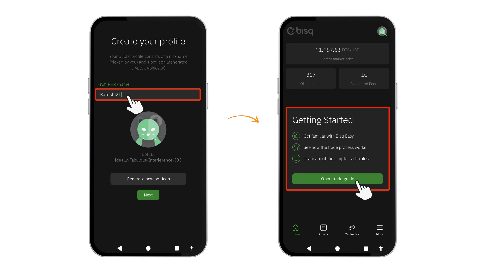

De handelsgids legt alles in eenvoudige stappen uit:

- Hoe te handelen op Bisq Gemakkelijk
- Hoe werkt het handelsproces
- Wat moet ik weten over handelsregels?

Een ander belangrijk onderdeel is **"Hoe veilig is het om te handelen op Bisq Easy?"**

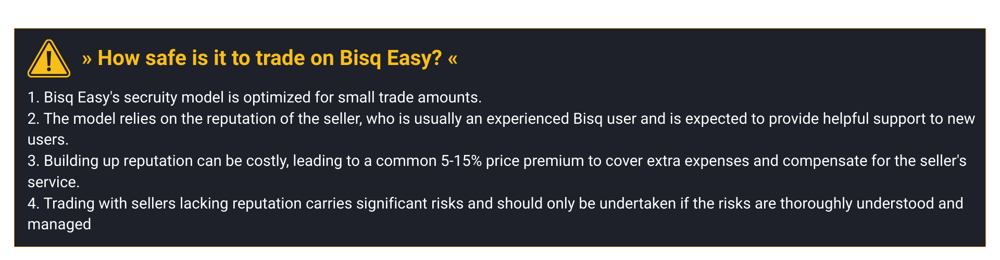

Vink het vakje `Ik heb het gelezen en begrepen` aan en tik op `Voltooien`.

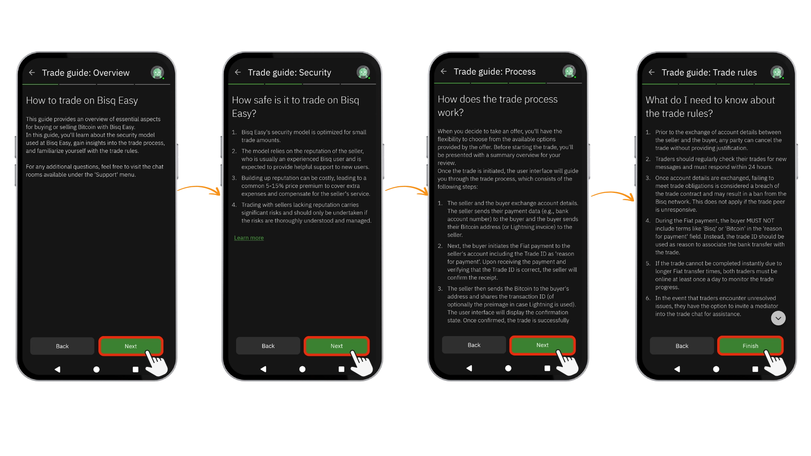

## 2️⃣ Maak een back-up van je gegevens

Voordat we beginnen, moeten we eerst wat huishoudelijke taken uitvoeren en een `back-up` maken van je gegevensopslagbestand. Ga naar `Meer` > `Back-up & Herstel` om je profiel en handelsgeschiedenis op te slaan. Als u uw apparaat verliest zonder een back-up, zijn uw reputatie en lopende transacties onherstelbaar. Geef een `wachtwoord` op om uw back-up te coderen.

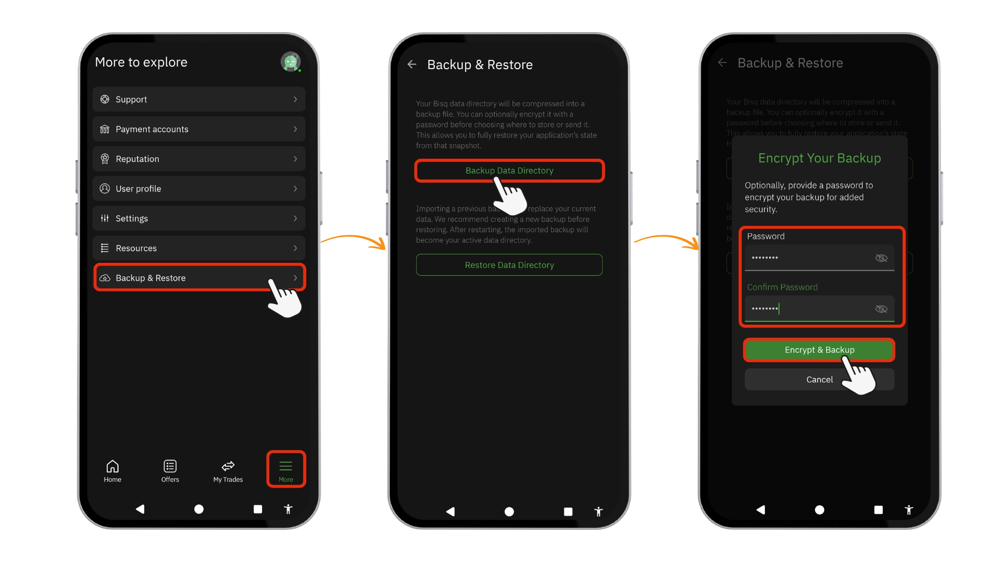

## 3️⃣ Aanbiedingen

Vanuit het `Home scherm` kun je op twee manieren naar de aanbiedingen navigeren. Tik op `Verken aanbiedingen` in het midden van het scherm of tik op `Aanbiedingen` in het onderste menu. Selecteer daar de `valuta` waarin je wilt handelen.

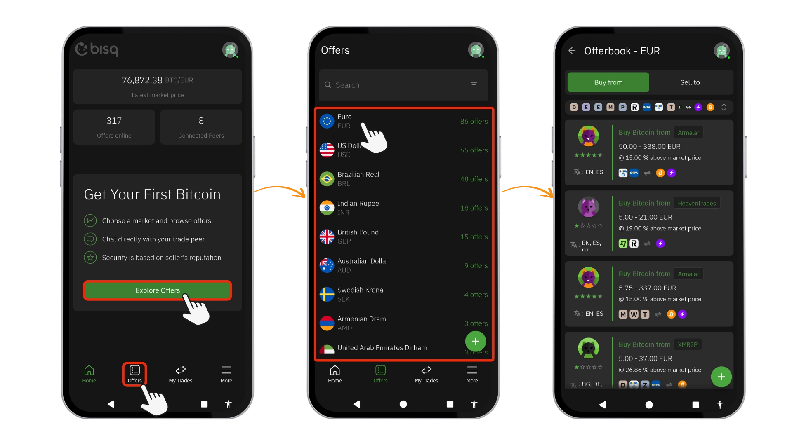

In tegenstelling tot [Bisq 1](https://planb.academy/en/tutorials/exchange/peer-to-peer/bisq-fe244bfa-dcc4-4522-8ec7-92223373ed04), dat onderpand vereist, vertrouwt Bisq Easy voor zekerheid alleen op de reputatie van de verkoper. Hoewel deze aanpak kopers in staat stelt om voor de eerste keer Bitcoin te kopen zonder eerst eigenaar te worden, plaatst het een hoge mate van vertrouwen in het vermogen van de verkoper om Bitcoin te leveren na ontvangst van fiatbetalingen. Daarom is het Bisq Easy security model alleen geoptimaliseerd voor kleine handelsbedragen en zijn transacties beperkt tot $600 USD equivalent per transactie om het risico te minimaliseren. Selecteer in het gedeelte `Offerbook` filters voor betaalmethoden en afwikkeling in Lightning of Bitcoin (on-chain).

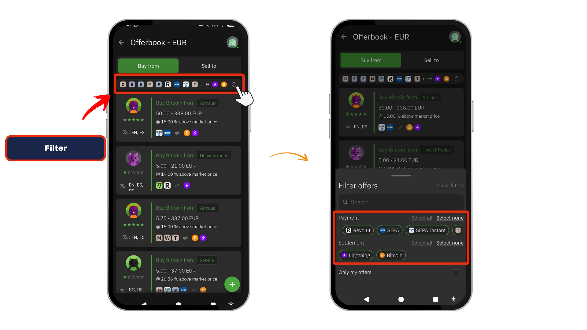

Selecteer na het toepassen van `filters` een geschikte aanbieding van een gerenommeerde handelspartner. De door de verkoper vooraf geselecteerde betalingsmethode en afwikkelingstype (`Lightning` of `on-chain`) worden weergegeven. Controleer of deze overeenkomen met je voorkeuren voordat je verdergaat. We selecteren hier de Lightning ⚡ optie.

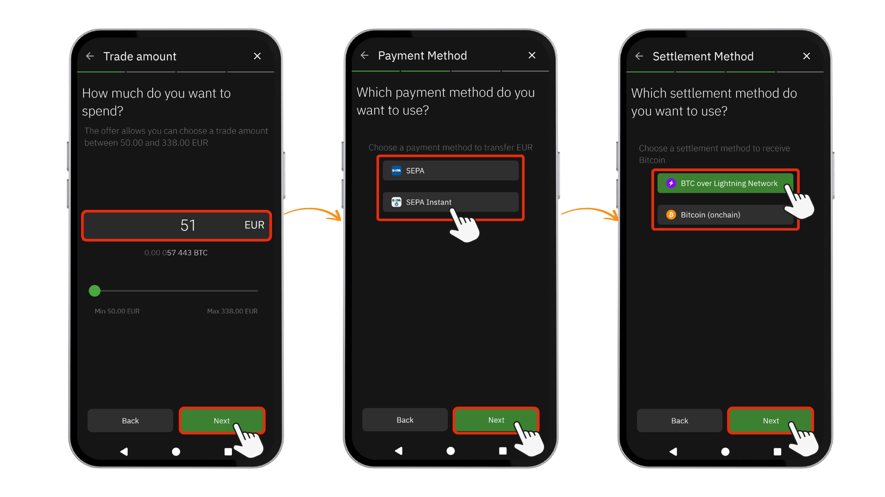

Bekijk en bevestig de details van de transactie door op `Bevestig neem aanbod` te tikken. Vervolgens wordt in een pop-upvenster bevestigd dat je het aanbod met succes hebt aangenomen. Tik op Transactie weergeven in `Openstaande transacties`. Plak je `bliksemfactuur` in het gedeelte `Open transacties` en tik op `Verstuur naar verkoper` om deze te delen. Wacht nu op de betaalrekeninggegevens van de verkoper. Het kan even duren voordat verkopers reageren. Kom regelmatig terug voor updates in het chatvenster.

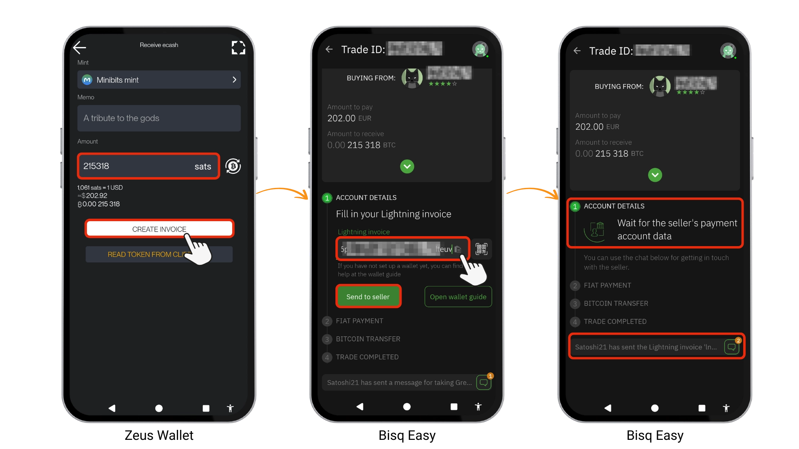

Stuur een korte groet in de chat. De verkoper deelt de betalingsgegevens wanneer hij online komt

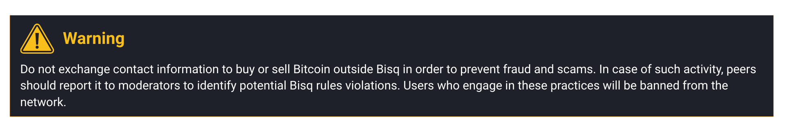

Zodra je de benodigde betalingsgegevens van de verkoper hebt ontvangen, ga je verder met het voltooien van de betaling. Tik daarna op de knop `Bevestig dat je de betaling hebt verricht` en wacht geduldig op de ontvangstbevestiging. ️ ⌛️

Tenslotte, wanneer de verkoper de ontvangst van betaling bevestigt, moet u ook de ontvangst van de Bitcoin bevestigen. Hiermee is de aankoop met Bisq in Easy Mode voltooid. Gefeliciteerd! U kunt nu op de knop `De transactie sluiten` tikken.

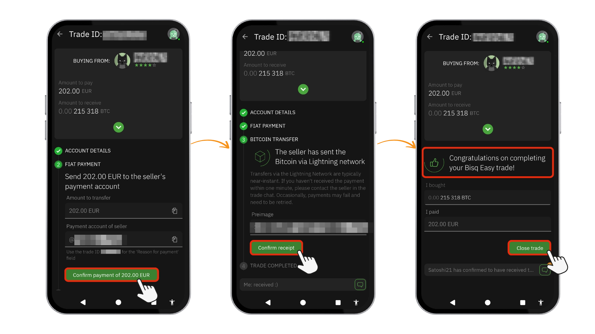

## 4️⃣ Geschillenbeslechting op Bisq gemakkelijk

Als er iets misgaat met je handel, kunnen zowel kopers als verkopers om bemiddelingsondersteuning vragen.

**Wat bemiddelaars kunnen doen:**

- Helpen bij het succesvol afronden van de handel

- Fiat, altcoin en Bitcoin betalingen verifiëren

- Indien nodig transacties annuleren

- Rapporteer ernstige regelovertredingen aan moderators voor mogelijke gebruikersverboden

**Gevolgen voor frauduleuze verkopers:**

Afhankelijk van hun reputatietype:

- BSQ Obligatie Reputatie**: De DAO kan hun BSQ in beslag nemen
- Ui Address reputatie**: Hun Bisq 1 ui adres kan verbannen worden

**Belangrijke opmerking:** Omdat alle reputatie is gekoppeld aan je gebruikersprofiel, schakelt een ban je reputatie volledig uit.

## 5️⃣ Creëer je eigen aanbod

In plaats van bestaande aanbiedingen te accepteren, kun je je eigen koopaanbod maken en verkopers naar jou laten komen. Dit is de juiste optie als je geen aanbiedingen met de juiste premie of betaalmethode vindt in de markt waarin je wilt handelen, hoewel je dan wel moet wachten tot een verkoper deze accepteert.

Tik in het `aanbiedingsscherm` op het groene `+` pictogram in de rechterbenedenhoek. Selecteer vervolgens `Koop Bitcoin` en kies je fiatvaluta.

Stel je handelsparameters in:

- Vast bedrag of Bereik**: Kies hoeveel je wilt uitgeven.
- Betalingsmethode**: Selecteer uit beschikbare opties
- Afrekening**: Kies Lightning ⚡ of ₿ on-chain

Bekijk je gegevens en tik op `Aanbieding maken`. Je aanbieding verschijnt nu in het `Aanbiedingenboek`.

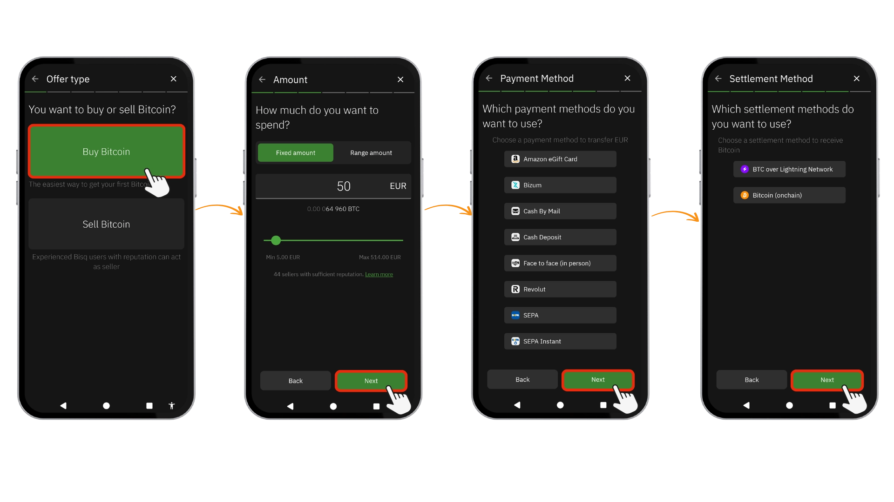

*Opmerking: als koper op Bisq Easy heb je geen reputatie nodig - dit is het belangrijkste voordeel. Verkopers dragen de reputatievereisten en het risico, daarom vragen ze premies. Jouw aanbod moet gewoon aantrekkelijk genoeg geprijsd zijn voor verkopers met een goede reputatie om het te overwegen.*

Wacht na publicatie in de sectie `Aanbiedingenboek`. Wanneer een verkoper je bod accepteert, ontvang je een melding. Open de transactie in `Open Trades`, waar de verkoper en jij je betalingsgegevens kunnen uitwisselen. Stuur je Bitcoin adres of Lightning-factuur naar de verkoper. Bevestig na het verzenden van fiat de betaling. Zodra de verkoper de ontvangst bevestigt, geeft hij de Bitcoin's vrij om de transactie af te ronden.

## conclusie

Bisq Easy maakt Bitcoin aankopen zonder onderpand mogelijk, waardoor het klassieke kip-en-ei probleem voor nieuwe kopers wordt opgelost. De ruil is duidelijk: je vertrouwt op de reputatie van de verkoper in plaats van op vastgezette fondsen voor zekerheid. Deze op vertrouwen gebaseerde aanpak verklaart de typische premie van 5-15%, die verkopers met een goede reputatie compenseert voor hun investering in het opbouwen van vertrouwen en het bieden van ondersteuning. Hoewel het systeem transacties beperkt tot kleine bedragen om potentiële verliezen te beperken, moet je altijd bij verkopers blijven met een solide reputatiescore. Voor nieuwkomers die bereid zijn deze voorwaarden te accepteren, biedt Bisq Easy een makkelijke instap naar Bitcoin.

## gW-27 Eenvoudige mobiele bronnen

[Github](https://github.com/bisq-network/bisq-mobile) | [Website ](https://bisq.network/bisq-easy/)| [Wiki](https://bisq.wiki/Bisq_Easy)