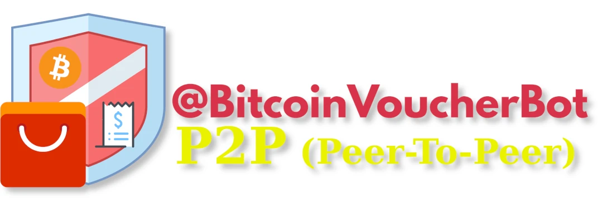

Все още чуваме за BitcoinVoucherBot - бот за Telegram, създаден за закупуване на Bitcoin без [KYC](https://planb.academy/resources/glossary/kyc-know-your-customer) чрез банков превод SEPA. За съжаление, от ноември 2025 г. BitcoinVoucherBot в централизираната си форма вече не се предлага като услуга без KYC.

В това ръководство ще разгледаме как работи новото изпълнение, което позволява на потребителите да купуват и продават Bitcoin директно на новия пазар P2P (Peer-To-Peer), така че да няма KYC. За да се противопоставят на новите ограничения, които все повече застрашават цифровата свобода и неприкосновеността на личния живот, разработчиците създадоха това разширение, което дава на потребителите възможност да купуват и продават Bitcoin с висока степен на анонимност чрез P2P (Peer-To-Peer). Нека заедно да видим как работи този нов метод за обмен.

За да се възползвате от услугата, трябва да направите преводи чрез Lightning Network. Затова се уверете, че имате wallet, който поддържа този протокол и ви позволява да използвате "LNURL" или "Lightning Address" за получаване и изпращане на средства.

Сред поддържаните портфейли можем да открием:

- [Sats.Mobi](https://planb.academy/tutorials/wallet/mobile/satsmobi-ea04e1cd-609a-4ea8-9c61-f9de1fe3a1fb) (Bot Telegram) (Custodial)
- [Wallet от Satoshi](https://planb.academy/tutorials/wallet/mobile/wallet-of-satoshi-39149d86-e42b-4e8f-ae9f-7e061e7784f7) (попечителски със замяна с не-попечителски)
- [Breez](https://planb.academy/tutorials/wallet/mobile/breez-46a6867b-c74b-45e7-869c-10a4e0263c06) (Non-custodial)

Или всеки wallet, който има "Светкавица Address" и генерира фактура Bolt11. портфейли, които generate фактура Bolt12, понастоящем не се поддържат. За повече информация вижте определението на [Bolt](https://planb.academy/resources/glossary/bolt).

За този урок, предвид лесната му непосредствена употреба, ще използваме Wallet of Satoshi.

**Внимание**: Wallet of Satoshi, макар и популярен сред начинаещите, е попечителски, с ограничен контрол върху средствата; използвайте го само временно, като незабавно се прехвърлите към не-попечителски за пълен суверенитет. От октомври 2025 г. тя включва стабилен режим на самонастойничество в цял свят в iOS/Android (актуализирайте приложението), с автономни частни ключове, превключване между режимите, потребителски Lightning адреси и резервно копие на seed с 12 думи. Въпреки това той остава временно решение до консолидацията, като за дългосрочно управление се предпочита зрял некустодиен wallet.

Много добре! Сега можем да започнем нашето пътешествие, което ще ви помогне стъпка по стъпка да създадете своя акаунт, да управлявате съвпаденията на покупки и продажби и да използвате зоната с ограничен достъп.

## Wallet и записване

Първо, ако все още не сте я инсталирали на смартфона си, изтеглете Wallet of Satoshi.

- [Google Play](https://play.google.com/store/apps/details?id=com.livingroomofsatoshi.wallet&pli=1)
- [App Store](https://apps.apple.com/au/app/wallet-of-satoshi/id1438599608)

Ако никога не сте използвали Wallet of Satoshi и искате да разберете как работи, препоръчвам ви да следвате този урок, за да можете да го активирате правилно и да го архивирате безопасно.

https://planb.academy/tutorials/wallet/mobile/wallet-of-satoshi-39149d86-e42b-4e8f-ae9f-7e061e7784f7

След като wallet е готов, можете да започнете да изпращате малко количество sats. Имайте предвид, че за да завършите регистрацията си в платформата P2P (Peer-To-Peer), ще трябва да изпратите 1000 sats като контролна мярка: това е с цел да се създаде бариера срещу всякакви атаки от типа "фантомно съвпадение" (измама), като се предотврати възможността някой да се регистрира без спам филтър.

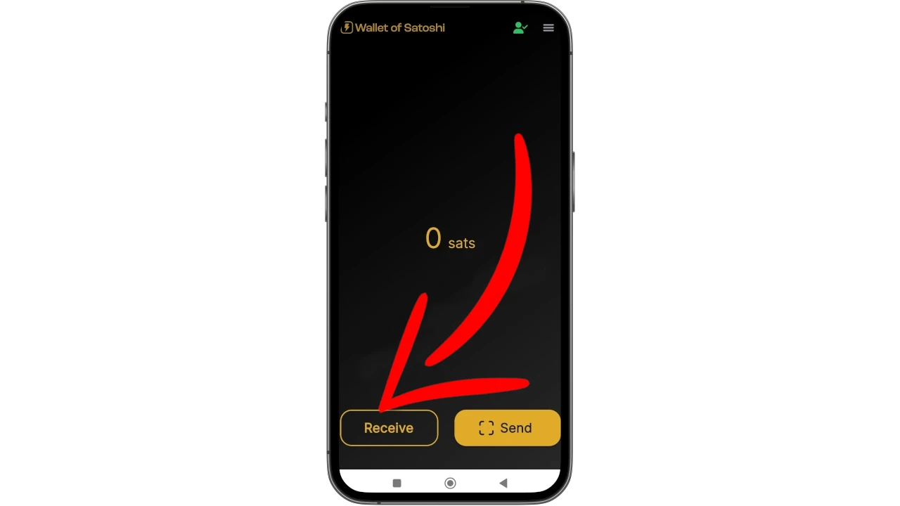

Сега можем да отворим платформата P2P (Peer-To-Peer), за да продължим с регистрацията. Можете да влезете от настолни компютри или браузъри на смартфони, чрез Telegram BitcoinVoucherBot или чрез .onion връзки, за да осигурите още по-високо ниво на поверителност.

ако решите да използвате връзката Tor .onion, препоръчвам и "Tor Browser". Ако все още не го познавате, можете да научите повече за него на тази връзка:

https://planb.academy/tutorials/computer-security/communication/tor-browser-a847e83c-31ef-4439-9eac-742b255129bb

Сега изберете начина, по който искате да достигнете до платформата.

- [BitcoinVoucherBot](https://t.me/BitcoinVoucherBot?start=55360009) (Telegram)
- [Pc Desktop / Browser Smartphone](https://p2p.bitcoinvoucher.bot/?ref=55360009)
- [Tor .Onion](http://umembxtpokml6fkogemcfnpyt3qqvyw6u3hnvwinevo3gvoe6j7vfyad.onion/?ref=55360009)

Ще бъдете пренасочени към главната страница.

натиснете "Get Starter", за да започнете веднага

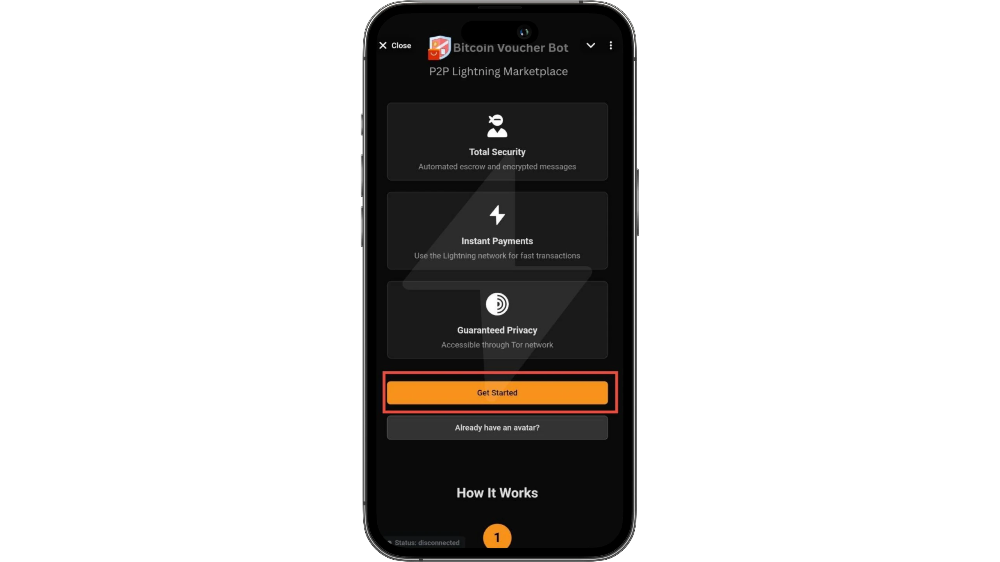

На следващия екран трябва да изберете парола и да я въведете (поле А), след което да я повторите (поле Б). Препоръчвам ви незабавно да запишете тази парола на резервен носител, който може да бъде на защитено цифрово устройство, например "Bitwarden":

https://planb.academy/tutorials/computer-security/authentication/bitwarden-0532f569-fb00-4fad-acba-2fcb1bf05de9

или да запазите паролата си на хартиен носител (**предупреждение**: това не е добро решение, но може да се използва като временно решение).

Поставете отметка в полето за проверка, в което заявявате, че не сте робот (поле В). Моля, обърнете внимание Не активирайте RSA криптирането, освен ако не знаете точно какво представлява и как работи. На този етап не е необходимо да правите нищо. Щракнете върху "Генериране на аватар" ("Generate Avatar") (поле D).

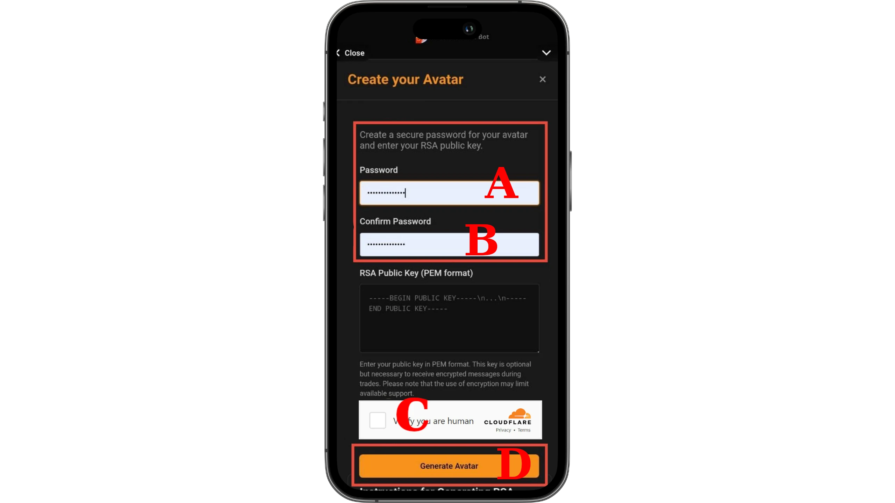

Сега трябва да платите 1000 sats, за да завършите регистрацията.

1. Започвайки отгоре, първо вижте произволно генерирания си и изключително важен "ID на аватар" Запазете го внимателно, точно както ви посъветвах да направите с паролата.

2. След това трябва да въведете своя "Lightning Address" в полето по-долу. Това ще ви позволи да получавате плащания, ако закупите Bitcoin, или да получавате възстановявания. Ако използвате Wallet От Satoshi, ще можете да копирате своя Address, като кликнете върху получаването.

3. Поставете отметка в полето за проверка, в което заявявате, че не сте робот.

4. Платете 1000 sats, за да получите достъп до зоната с ограничен достъп. Ако не можете да го поставите в рамка, щракнете върху него с мишката (на компютър) или го докоснете с пръст (на смартфони Browser/Telegram), за да копирате адреса, който трябва да поставите в Wallet of Satoshi и да завършите плащането на фактурата.

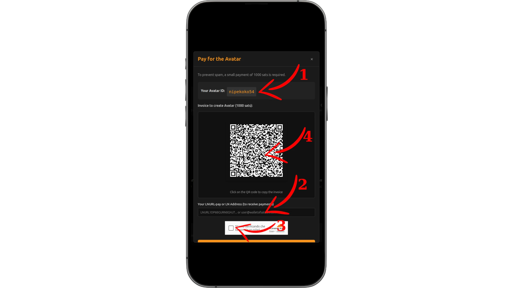

Това е вашият LNURL Address.

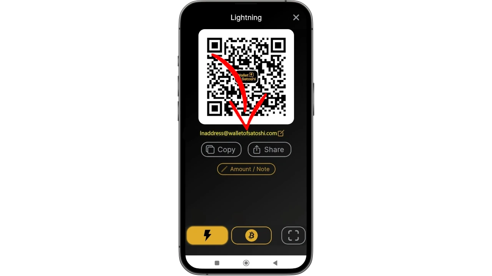

Поздравления!!! Създали сте своя аватар за постоянно и можете да видите обобщението тук. Още веднъж ви препоръчвам внимателно да запазите както своя Аватар, така и паролата си, както съм предлагал и преди.

Щракнете върху `I've saved my credentials, continue` (преведено като: "Запазих данните си, продължете")

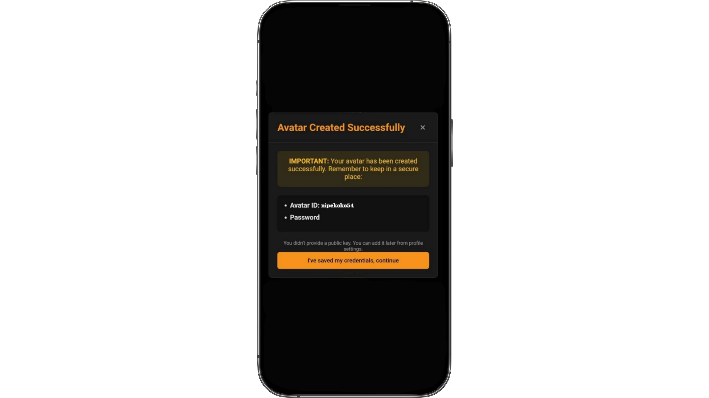

Вече сте в сърцето на платформата, където можете да видите всички търговски съвпадения с техните данни. За по-ясна представа, по-долу ще видите изображенията, присъщи на уебсайта от настолни компютри.

- "Тип" ("Type") определя дали става въпрос за продажба "Sell" ("Продай") или покупка "Buy" ("Купи")
- "Количество" ("Amount"): показва колко sats продава потребителят, ако съответствието е от тип "Продай", или колко Bitcoin е готов да купи потребителят, ако съответствието е от тип "Купи".
- "Цена на БТК с марж" ("Цена на БТК с марж"): показва цената, отчитаща маржа, приложен над маркираната стойност.
- "Марж" ("Margin") е процентът, който се прилага към пазарната цена, Със знак минус (-) получавате отстъпка от пазарната цена, Със знак плюс (+) към пазарната цена се прилага премия.
- "Метод" ("Метод") показва по кой начин потребителят предпочита да му бъде платено.
- "Създател" е уникалният аватар, използван от потребителя в платформата.
- "Rep" (Репутация) Нивото на репутация на потребителя варира от -5 ненадежден до +5 изключително надежден.
- "Статус" ("Status"): показва статуса на съответствието. В примерната екранна снимка всички съвпадения изглеждат като "Отворени" ("Open").
- "Изтичане" ("Expiration"): показва колко време остава до изтичането на мача и отмяната му, ако не е бил избран от никого.

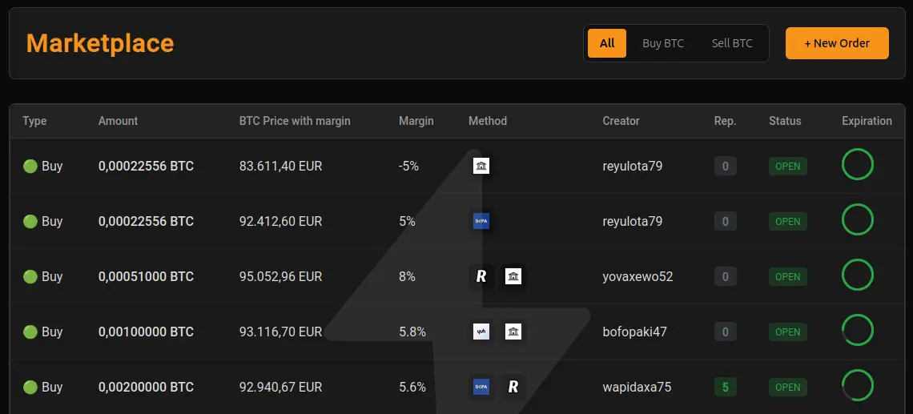

В горния десен ъгъл кликнете върху своя аватар, за да получите достъп до профила си.

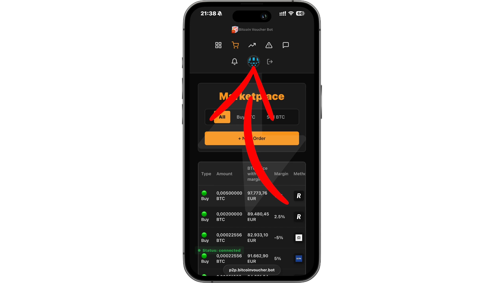

Тук можете да видите името на вашия аватар, потребителския идентификатор, датата на създаване и репутацията, която ще се отрази положително или отрицателно на поведението ви в преговорите.

В раздела "Настройки" можете да видите своя "Lightning Address", въведен при регистрацията, и да го промените, ако е необходимо. Имате също така възможност да създадете публичен ключ, който, както беше споменато, трябва да бъде създаден само ако имате съответните умения. Той се използва за криптиране на съобщенията, които ще обменяте с вашия контрагент директно от вашия компютър.

Препоръчва се функцията за уведомяване Telegram. Ако я активирате, ще се появи QR код, който да поставите в рамка на приложението Telegram: така ще получавате известия в реално време за всички действия, свързани с вашите мачове, директно в чата на бота на Telegram.

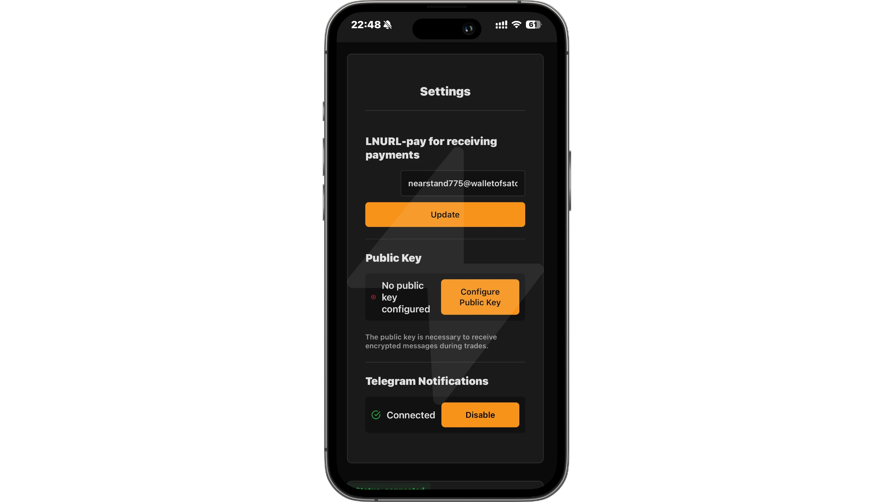

Накрая ще намерите раздела за препращане с приходите, генерирани от потребителите, които сте поканили. Оттук можете да използвате бутона, за да споделите връзката или QR кода си, а малко по-надолу да видите списък със съвпадения, за да проследите репутацията си заедно със съответния резултат.

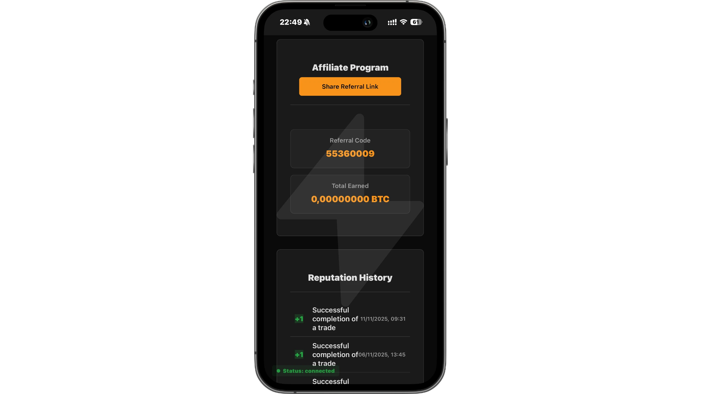

## Създаване на поръчка за закупуване на Bitcoin

Влезте в Marketplace: от главната лента за навигация кликнете върху символа на количката "Marketplace" ("Пазар"), за да отворите книгата за поръчки. след това започнете нова поръчка: натиснете бутона "Нова поръчка" ("Нова поръчка"), за да започнете процеса.

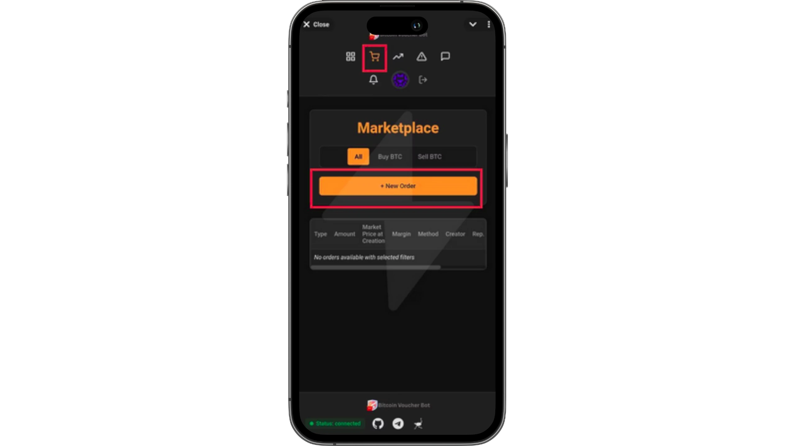

- Задайте подробности за поръчката:
- Изберете опцията "Купи Bitcoin" ("Купи Bitcoin").
- Въведете желаното количество sats.
- Определете ценовия марж (между -20% и +20% от пазарната стойност).
- Изберете метода на плащане (незабавно SEPA и др.).
- Посочва предпочитаната валута.
- Потвърждаване на поръчката: щракнете върху "Create Order" ("Потвърждаване на поръчката"), за да преминете към етапа на подаване.

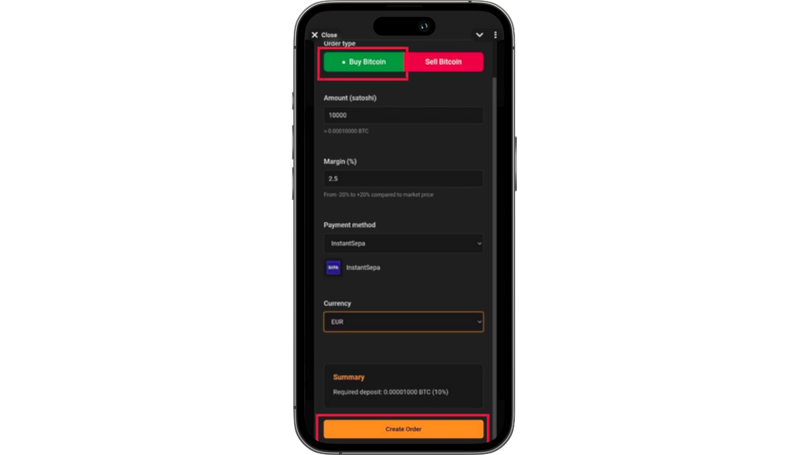

Изисква се депозит: за да се активира поръчката, се изисква депозит в размер на 10% от общата сума плюс такса за обслужване.

- Депозитно плащане: при създаването на поръчката системата автоматично генерира фактура Lightning. Депозитът е само временен и се възстановява, когато поръчката бъде завършена.
- Основни характеристики:
- Гаранционен депозит: 10% от стойността на поръчката.
- Такса за обслужване: разходи за използване на платформата.
- Времево ограничение: имате 5 минути, за да извършите плащането, в противен случай транзакцията изтича.

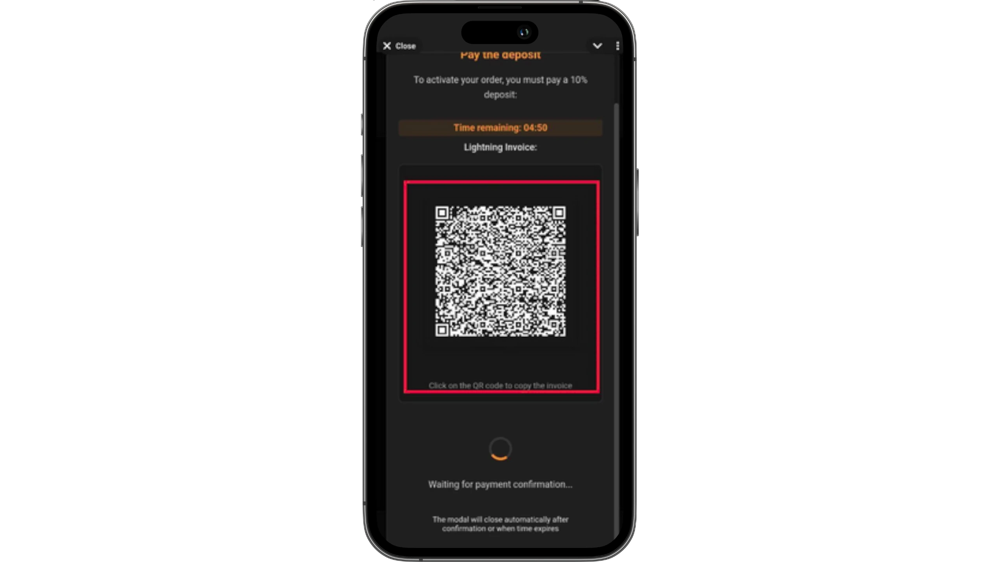

След успешно плащане поръчката ще се появи в книгата и ще бъде видима за всички потребители, които могат да я изберат и приемат. За да създадете поръчка за продажба, трябва само да кликнете върху "Sell Bitcoin" ("Продай Bitcoin"), да въведете количеството satoshi, което искате да продадете, да зададете маржа, да изберете метода на плащане и валутата, след което да продължите с 10% депозит като гаранционен депозит. След като приключите, вашето съвпадение ще бъде видимо в списъка.

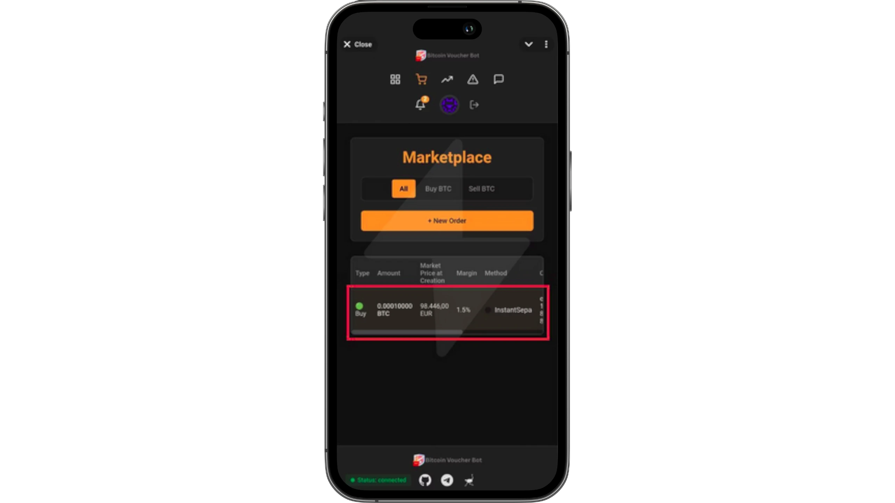

## Как да приемете поръчка

1. Продавачите могат да видят списък с всички налични поръчки в книгата.

2. Проверете подробностите: всяка поръчка съдържа информация като:

  - Количество на Bitcoin,
  - Марж върху цената,
  - Метод на плащане,
  - Репутация на потребителя.

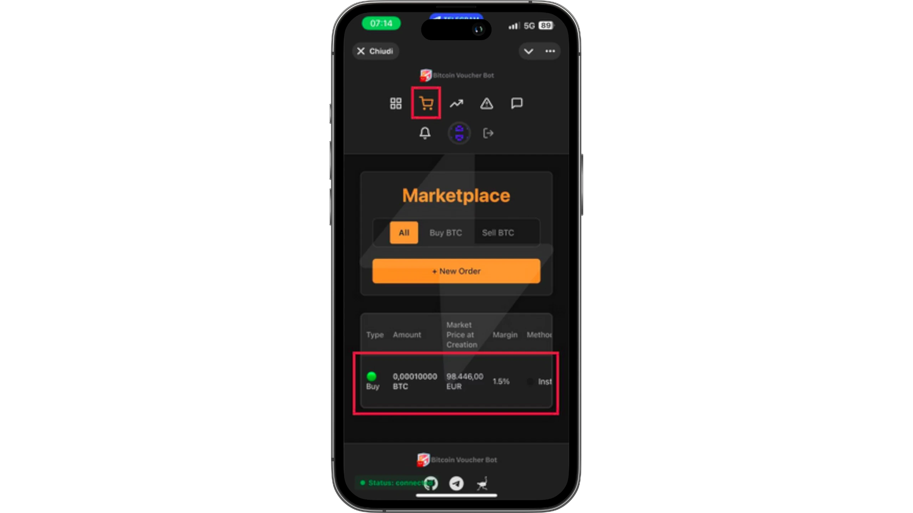

3. Кликнете върху поръчката, за да отворите пълния лист с цялата информация.

4. Натиснете "Sell Bitcoin" ("Продай Bitcoin"), за да приемете предложението.

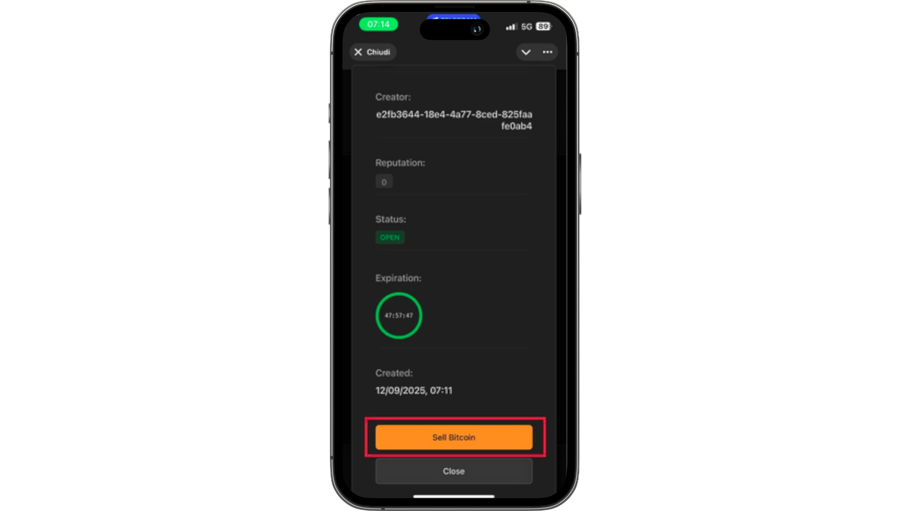

## Депозит, изискван от продавача

Когато поръчката е приета, системата генерира фактура за плащане. Депозитът включва:

- Общата сума на поръчката,

- комисията по услугите.

Депозитното плащане трябва да бъде извършено в рамките на определения срок, в противен случай сделката няма да бъде потвърдена.

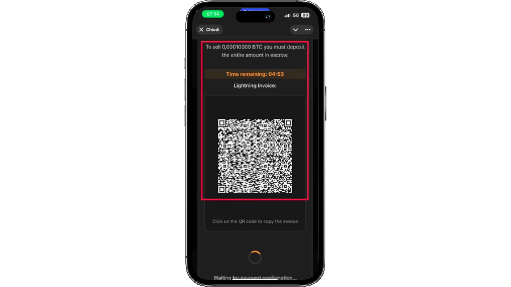

## Изпращане на инструкции за плащане

След като депозитът бъде направен, транзакцията ще се появи в личното табло на продавача, който трябва да предостави данните на купувача, за да извърши плащането във фиатна валута.

1. Продавачът показва активната сделка в своя панел.

2. Кликнете върху "Изпращане на инструкции за плащане"

3. Въведете цялата необходима информация за фиатното плащане (IBAN, получател, адрес, основание за плащане и т.н.).

4. Щракнете върху "Send Message" ("Изпращане на съобщение"), за да предадете данните на купувача.

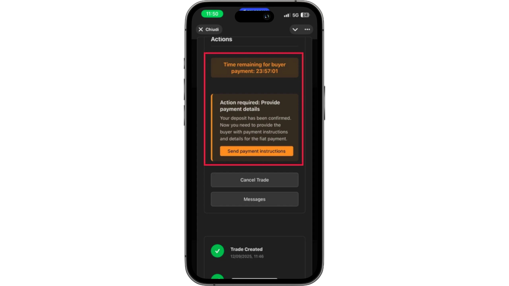

## Процедура за плащане

Купувачът получава в чата на платформата съобщение с всички необходими данни за извършване на плащането във фиатна валута:

- Банкови данни: IBAN с името и адреса на титуляра на сметката на продавача.
- Точна сума: точната сума във фиат, която трябва да бъде прехвърлена.
- Причина/описание: текст, който трябва да бъде включен в транзакцията.
- Срок: краен срок, в който трябва да се извърши плащането.

Преводът се извършва извън системата P2P и трябва да се осъществи чрез банковата институция.

⚠️ **Важна забележка:** потвърждението в платформата трябва да се извърши само след като действително сте уредили превода или фиатно плащане чрез вашата банка.

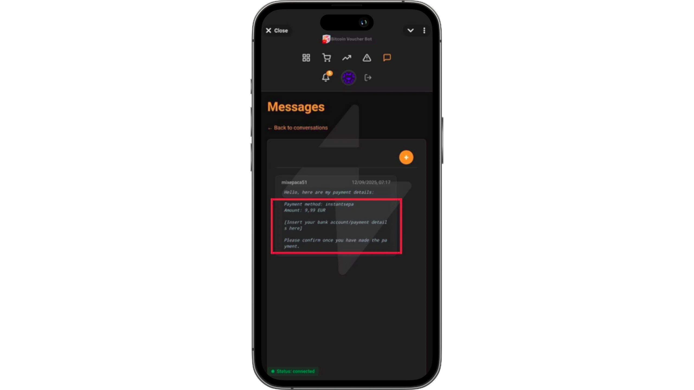

## Потвърждаване на плащането fiat

Тази стъпка е от решаващо значение за купувача и трябва да бъде извършена само след като се провери дали плащането действително е изпратено.

1. Получаване на данни: купувачът е получил инструкции за плащане от продавача.

2. Извършване на плащането: преводът на фиат се извършва от банковата сметка на потребителя.

3. Проверка: проверява дали операцията е била обработена правилно.

4. Потвърждаване на платформата: кликнете върху "Confirm fiat payment" ("Потвърждаване на фиатно плащане") на страницата за търговия.

Бутонът "Confirm Payment fiat" се появява в раздела за транзакциите и трябва да се използва само след като се провери, че плащането наистина е изпратено.

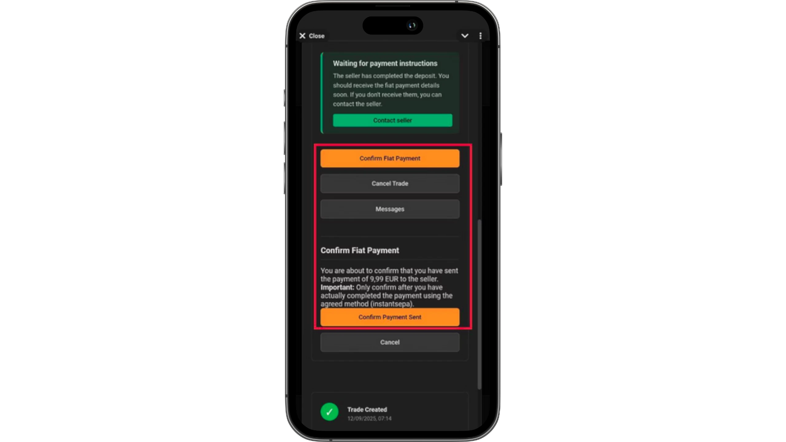

Последната стъпка в процеса е продавачът да потвърди получаването на плащането във фиат, след което сатовете се предоставят на купувача.

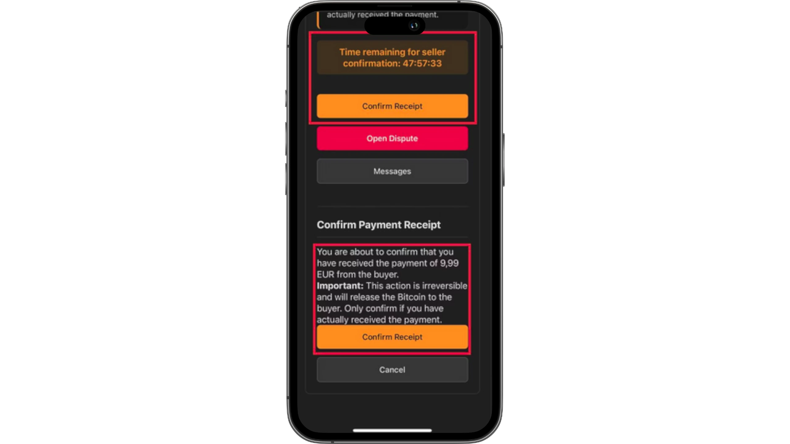

## Заключение

Надяваме се, че този урок ще ви помогне да използвате нов метод за търговия с биткойни или дори просто да ги купувате - за собствено хранилище на стойност или за да оживите ежедневните плащания. Все пак остава вратата, която трябва да проучите, за да се справите с това, което предстои да се случи в нашия цифров свят.

Примката на органите, които ни контролират, се затяга, за да роди все по-контролиран интернет. Купувайки P2P, вие ще запазите пълната си анонимност, без да оставяте следи и без последващи последствия от трети страни.