_Ten samouczek został napisany przez_ [Bitcoin Campus](https://linktr.ee/bitcoincampus_)

## Wprowadzenie

BitcoinVoucherBot to narzędzie, za pomocą którego można kupić Bitcoiny w Exchange za euro.

### KYC Light

Wymiana euro na Bitcoin jest pierwszym i najbardziej podstawowym krokiem do rozpoczęcia studiowania tego tematu, ale najwyraźniej jest też najtrudniejsza i najbardziej złożona. Opcji może być wiele: oferowanie Bitcoin za pośrednictwem scentralizowanych giełd, spotkania o tematyce Bitcoin, przyjaciele, znajomi i nie tylko. Przyłączamy się do społeczności Bitcoinerów i **bezwzględnie zalecamy korzystanie ze scentralizowanych giełd** w celu zapewnienia większej dbałości o własną prywatność.

Chociaż ten wybór może być mniej wygodny, ważne jest, aby zrozumieć, że giełdy egzekwują przepisy Know Your Cutomer (KYC), przypisując w ten sposób tożsamość, a także fizyczną lokalizację do każdego zakupionego od nich Satoshi. "Wygoda" ma pewne uderzające skutki uboczne.

### Jak to zrobić?

Oto usługa [BitcoinVoucherBot:](https://t.me/BitcoinVoucherBot), bot Telegrama, który działa jako pośrednik między naszymi przelewami SEPA a zakupami Sats.

### Wymagania wstępne

Aby rozpocząć korzystanie z BitcoinVoucherBot, nie ma potrzeby ujawniania poufnych danych osobowych personelowi bota. **Nie jest wymagana autoryzacja**.

Wszystko, czego potrzeba, to aktywne konto Telegram i konto bankowe. **Uwaga**: Konto otwarte w Poste Italiane (dla włoskich klientów) lub, bardziej ogólnie, odwołujące się do karty doładowującej nie jest odpowiednie.

Na czacie Telegram przygotowujemy zamówienie, płacimy za nie przelewem bankowym, a na koniec za pośrednictwem bota otrzymujemy voucher wystawiony przez firmę zewnętrzną, która nie zna przedmiotu zakupu.

### Aktywacja bota i menu

Aktywacja jest prostą jednorazową operacją. W Telegramie należy wyszukać _@BitcoinVoucherBot_, a gdy tylko przejdzie się do czatu bota, na dole pojawi się duży przycisk _Start/Start_. Operacja ta powoduje reakcję bota, który prezentuje menu głównych dostępnych dla niego poleceń. Pojawiają się również pierwsze wiadomości powitalne, których uważną lekturę zalecamy.

**Uwaga**: istnieje kilku oszustów podszywających się pod oryginalnego VoucherBot. Jeśli nie jesteś pewien wyszukiwania przez Telegram, skorzystaj z linku do BitcoinVoucherBot ze [strony oficjalnej](https://www.bitcoinvoucherbot.com/)

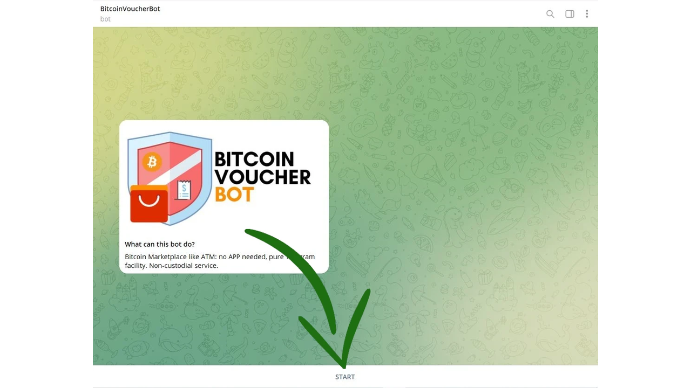

Opcje pojawiają się po kliknięciu przycisku _Menu_ w lewym dolnym rogu: można kliknąć słowo odpowiadające poleceniu lub wpisać w polu wiadomości ukośnik `/`, po którym następuje wpisane polecenie.

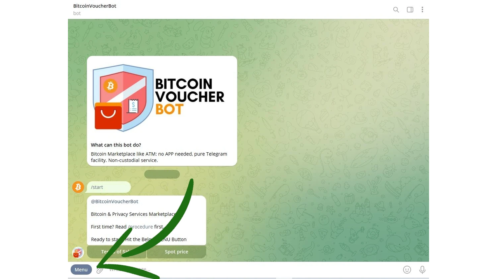

Główne operacje obejmują:

- _/purchase_: to faktyczna procedura zakupu. Po zakończeniu transakcji kod QR jest automatycznie generowany przez bota i gotowy do wykorzystania.
- _/refill_: dostępna w momencie pisania tego poradnika, ale nie będziemy jej opisywać, ponieważ z przyczyn technicznych opcja ta może zostać usunięta później.
- _/swap_: otwiera procedurę wymiany, dostępną za pomocą wygodnego bota Telegram lub przez Internet.
- _/ap_: plan akumulacji, który umożliwia skonfigurowanie **stałego planu akumulacji (CAP)**.
- _/lnaddress_: z którym jesteśmy proszeni o połączenie własnego LN Address, dla konkretnej procedury, którą zobaczymy później.
- _/credits_: aby sprawdzić, ile środków pozostało do wykorzystania w ramach kuponów generate.
- _/myorders_: pokazuje zamówienia złożone za pomocą bota (**Uwaga** system śledzi tylko 10 ostatnich złożonych zamówień, a nie całą historię).
- _/fees_: polecenie sprawdzające opłaty sieciowe. Aby je ocenić, zawsze najlepiej jest polegać na Mempool.space.
- _/support_: w razie potrzeby wyskakują kontakty do zgłaszania problemów zespołowi pomocy technicznej.

## Procedura zakupu Bitcoina

### Przygotowanie zamówienia

Kliknij _/purchase_ w menu poleceń

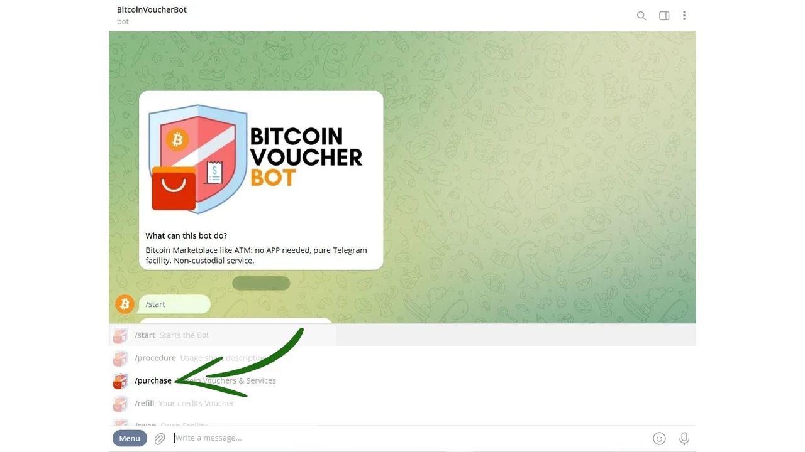

Pojawia się wiele możliwości, ale my wybieramy _BTC Vouchers_

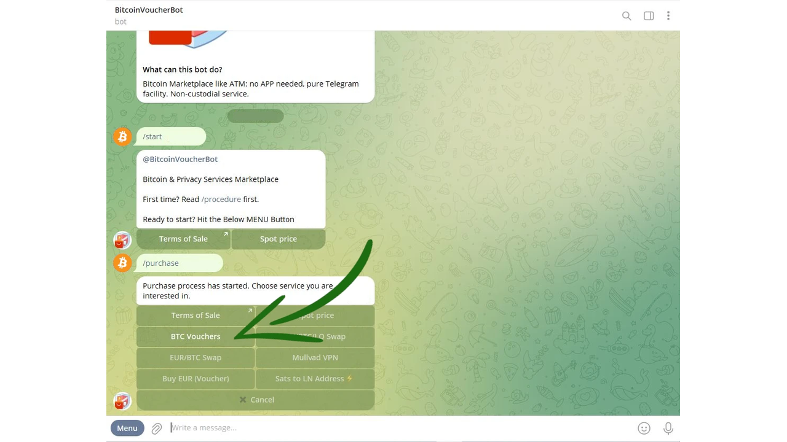

BitcoinVoucherBot umożliwia zakup Bitcoin onchain, Lightning i Liquid.

Na tym etapie wybierz _Onchain & Lightning 🔗⚡️_

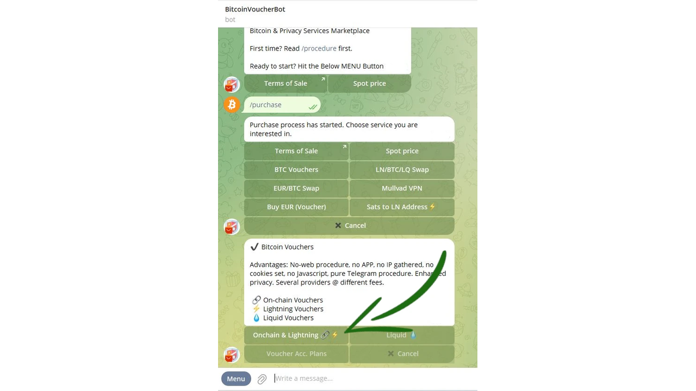

Ekran zmienia się szybko, a VoucherBot proponuje nominały zakupu. Zaczynają się one od minimum 100,00 € do 900,00 €.

W przypadku pierwszego zakupu oferowane są tylko nominały 100,00 €, Onchain i Lightning. Aby zwiększyć poufność, sugerujemy wybranie opcji _Lightning ⚡️_

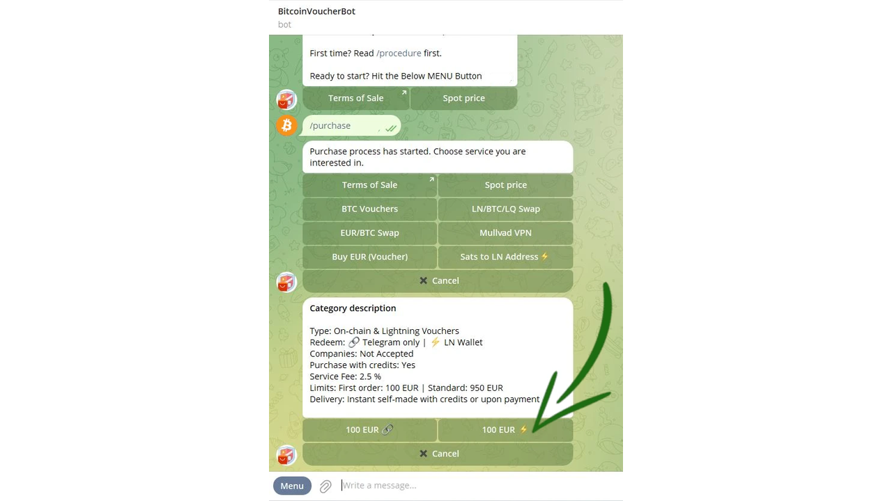

VoucherBot powiadamia nas, że dokonano pierwszego wyboru i aby go potwierdzić, musimy wybrać _Proceed_

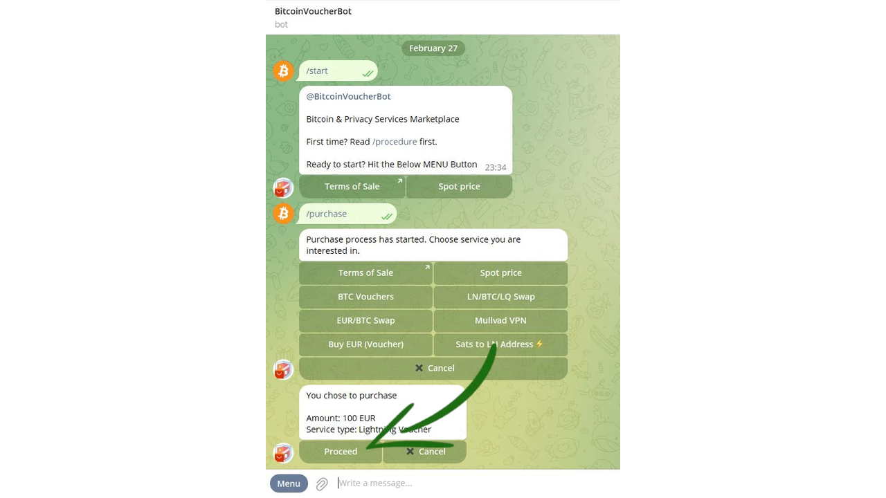

Teraz pozostaje kwestia wyboru metody płatności. Przelew jest dokonywany za pomocą przelewu bankowego **(akceptowany tylko SEPA)**. VoucherBot proponuje jako odbiorcę firmę, która udostępnia dwa konta bankowe, jedno w Wielkiej Brytanii, a drugie w Szwajcarii. Szwajcarski bank został wybrany do przeprowadzenia tego samouczka

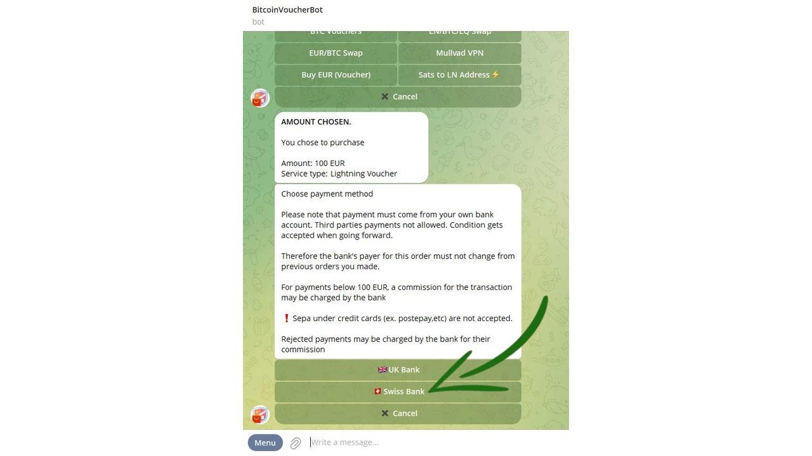

W tym momencie jesteśmy proszeni o podanie naszego numeru IBAN, od którego rozpocznie się przelew do wybranego banku. Informacje te składają się na układankę, która pozwoli botowi, czyli maszynie, połączyć pewne informacje, aby proces zakupu przebiegał bez konieczności interwencji człowieka.

Numer IBAN musi zostać wpisany na pasku wiadomości, sprawdzony i wysłany do bota.

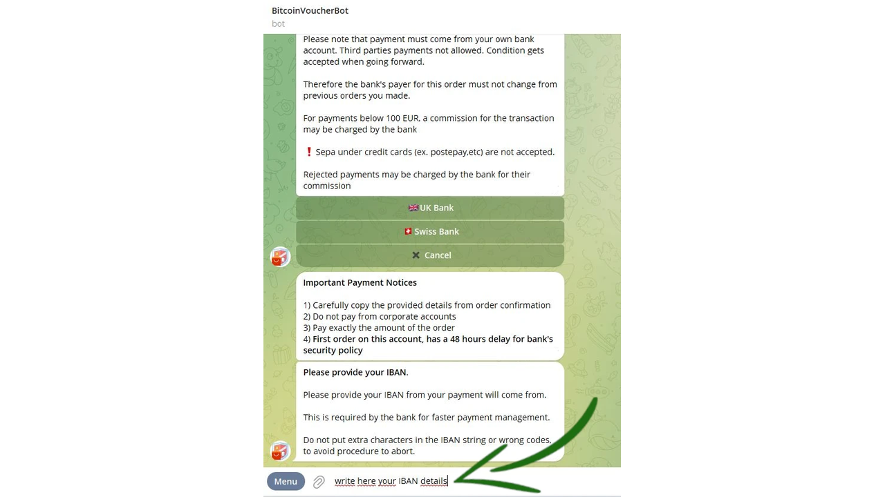

Na czacie z VoucherBot pojawi się teraz komunikat kontrolny.

Jeśli wszystko się zgadza, kontynuuj, klikając przycisk _Proceed_.

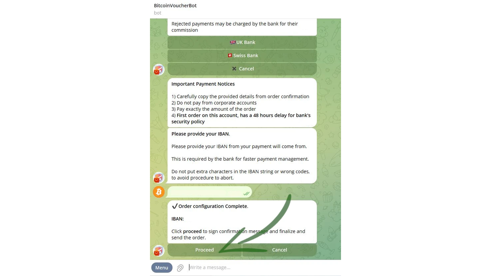

### Płatność

Po kilku chwilach niezbędnych do przetworzenia danych, VoucherBot odpowiada wiadomością zawierającą wszystkie szczegóły niezbędne do zrealizowania zamówienia. W zależności od wymagań banku, odpowiednie informacje to:

- `IBAN`, który jest niezbędny do złożenia depozytu, a także Address odbiorcy;
- `wybrana kwota` poprzednio przez cutoff, który musi być spełniony, aby VoucherBot mógł rozpoznać zamówienie po otrzymaniu płatności;
- `Payment reason`, czyli powód płatności. **Musi być skopiowany i wklejony bez usuwania lub dodawania czegokolwiek w odpowiednim polu przelewu. Wszelkie "." lub "-" obecne w powodzie płatności można zastąpić "białą spacją "**.
- unikalny identyfikator `OrderID`, do którego można się odwołać, prosząc o jakąkolwiek pomoc.

Następnie można dokonać płatności za pośrednictwem aplikacji lub banku. Gdy płatność zostanie zaakceptowana przez bank, należy pamiętać o naciśnięciu przycisku _Zgłoś płatność_ na czacie z VoucherBot. Ta prosta operacja powiadamia, że płatność jest w drodze.

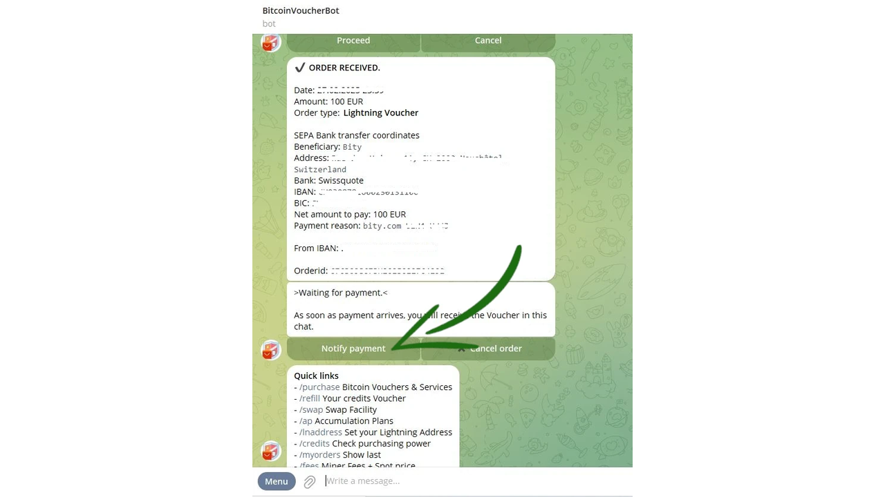

VoucherBot odpowiada wiadomością, która zawiera bardzo ważne ostrzeżenie: **nie usuwaj czatu**, przynajmniej do czasu otrzymania vouchera, ponieważ jest to jedyny sposób na odtworzenie zamówienia i jego kontynuację.

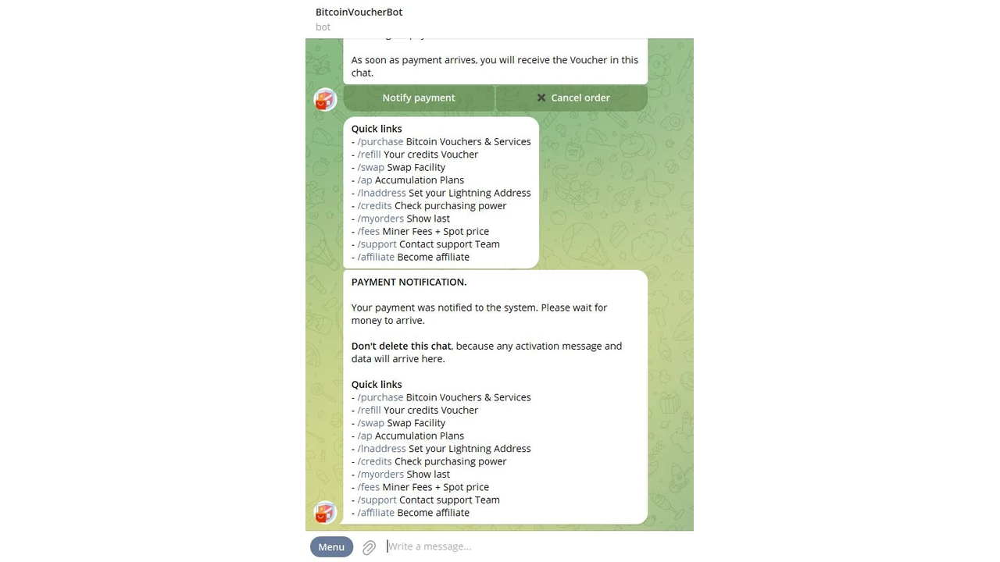

---
Uwaga:

- akceptowane są tylko przelewy SEPA;
- czas oczekiwania zależy wyłącznie od tego, jak banki (które nie pracują 24/7/365 jak Bitcoin) przetwarzają voucher. Otrzymanie vouchera może zająć od kilku godzin do 3 dni roboczych;
- w przypadku jakichkolwiek potrzeb, Bitcoin VoucherBot ma doskonałą usługę [support](https://t.me/BitcoinVoucherGroup) w Telegramie.

---
### Wykup

Gdy tylko płatność się powiedzie, Bitcoin VoucherBot wysyła voucher bezpośrednio na czat. Voucher ma postać kodu QR wydrukowanego na pomarańczowym tle.

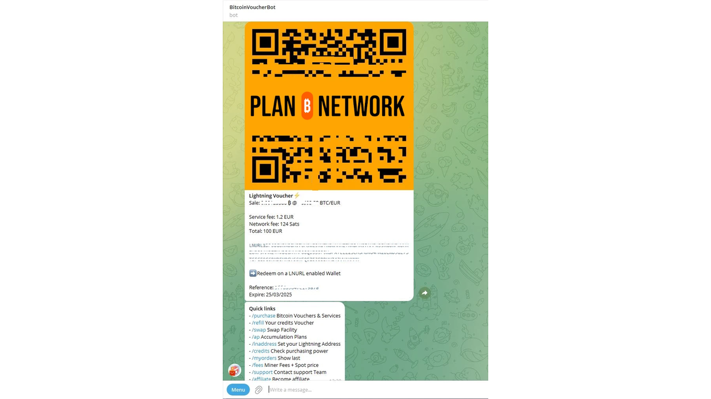

Są tam wszystkie dane potrzebne do jej spieniężenia:

- kwota w Sats, równoważna kwocie wysłanej przelewem bankowym, z wyłączeniem opłat za usługę i opłat sieciowych;
- identyfikator referencyjny vouchera;
- datę, do której voucher musi zostać zrealizowany, w przeciwnym razie środki zostaną utracone, tj. 25 dni po jego wydaniu.

Voucher można zrealizować, kadrując kod QR za pomocą funkcji skanowania kompatybilnego Wallet Lightning Network lub za pośrednictwem LNURL, również pokazanego poniżej kodu QR.

Do tego samouczka użyliśmy Wallet Of Satoshi, korzystając z funkcji skanowania aktywowanej przyciskiem _Send_.

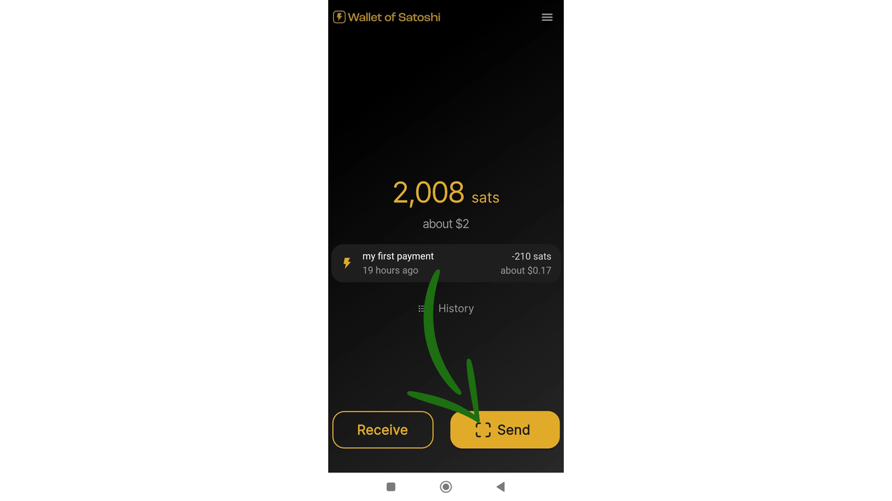

Przy włączonym aparacie telefonu komórkowego obramuj kod QR na czacie, otwierając Telegram z komputera

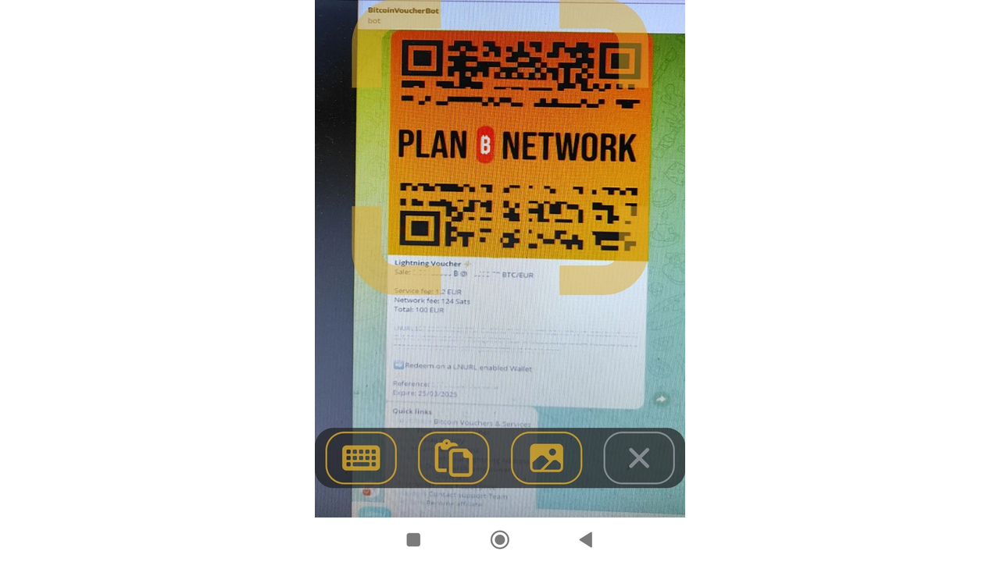

Przed kontynuowaniem Wallet Of Satoshi wyświetla ekran weryfikacji, który obejmuje kwotę dokładnie odpowiadającą tej podanej na voucherze, a jako opis widnieje BitcoinVoucherBot. Aby zrealizować voucher, wystarczy kliknąć _Receive_.

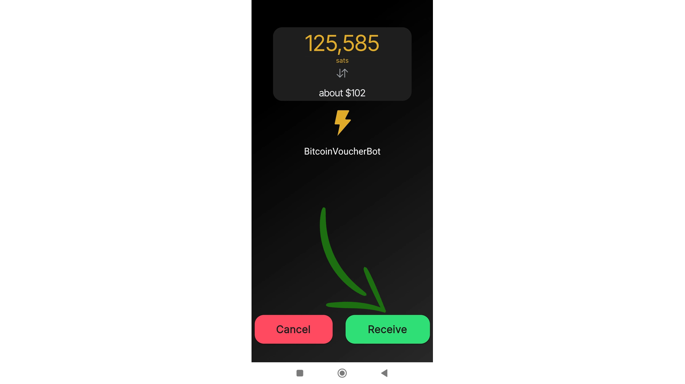

Wallet Of Satoshi przetwarza przez kilka chwil.

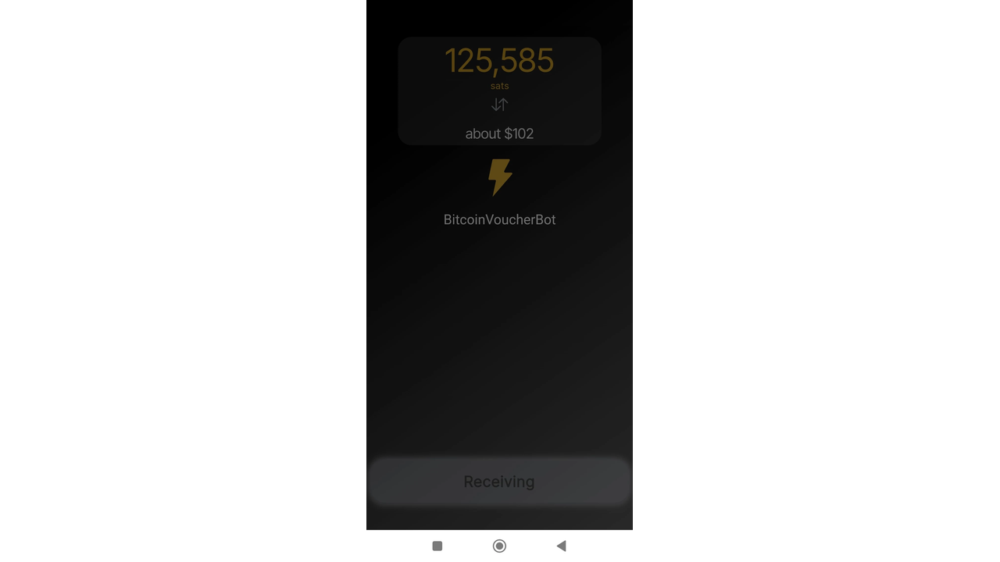

a na koniec kolekcja jest raportowana i natychmiast dostępna na saldzie Wallet.

**Wallet of Satoshi to aplikacja powiernicza: zaraz po zrealizowaniu vouchera zaleca się przeniesienie satsów do portfela niepowierniczego.**

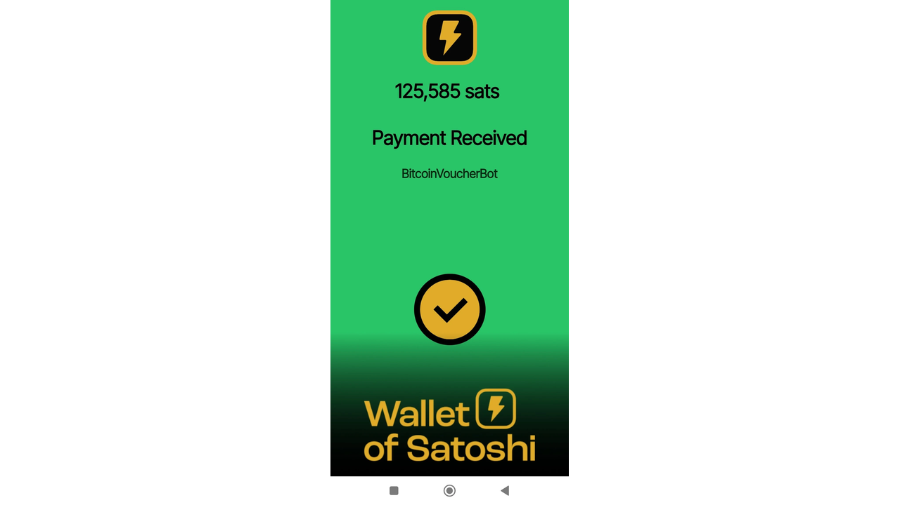

### Jak spieniężyć voucher onchain

Jak widzieliśmy podczas przygotowywania zamówienia, VoucherBot umożliwia zakup Sats bezpośrednio w łańcuchu, z wyborem tytułowego vouchera.

**Uwaga**: Przygotowanie zamówienia i płatność nie ulegają zmianie, są zawsze takie same. Zmienia się natomiast sposób realizacji vouchera onchain.

Po sfinalizowaniu zamówienia, dokonaniu płatności, naciśnięciu przycisku _Zgłoś płatność_ i odczekaniu czasu technicznego banków na przekazanie przelewu, VoucherBot odpowie, wysyłając voucher bezpośrednio na czat.

Ten voucher jest również w formie kodu QR, ale głównym kolorem jest kanarkowy żółty i - co najważniejsze - w opisie jest dobrze wyjaśnione, że jest to voucher onchain, który można spieniężyć bezpośrednio na swoim Wallet onchain, a aby rozpocząć procedurę wypłaty, należy kliknąć _Redeem on Telegram_. Voucher onchain zawiera również informacje, które były już widoczne w przypadku vouchera lightning:

- kwota w Sats, równoważna kwocie wysłanej przelewem bankowym, z wyłączeniem opłat za usługę i opłat sieciowych;
- kod kuponu;
- identyfikator referencyjny vouchera;
- datę, do której voucher musi zostać zrealizowany, w przeciwnym razie środki zostaną utracone, tj. 25 dni po jego wydaniu.

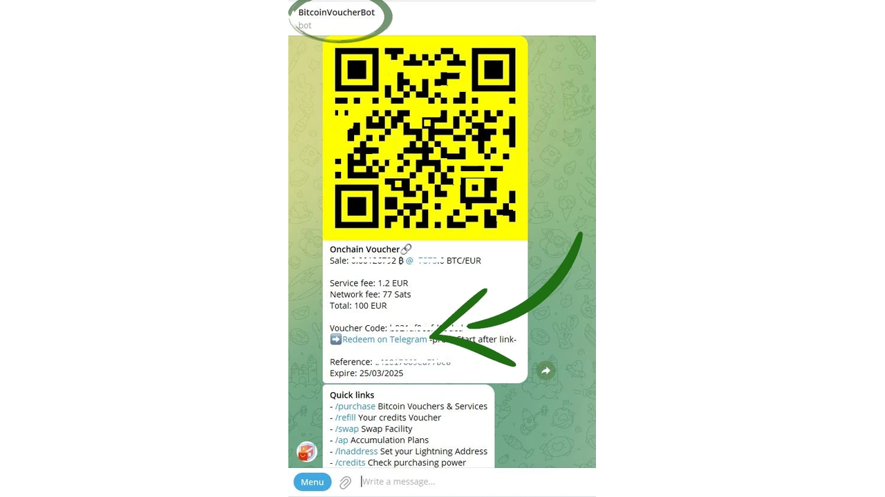

**OSTRZEŻENIE ⚠️:** po kliknięciu, jak wyjaśniono, otwiera się wyskakujące okienko innego bota: **Voucher RedeemBot.**

Voucher RedeemBot jest narzędziem udostępnionym w tym celu. Niezależnie od tego, czy jest to pierwsze użycie, czy też istnieją poprzednie zamówienia, za każdym razem, gdy dokonywany jest nowy wykup, zawsze konieczne jest kliknięcie _START_.

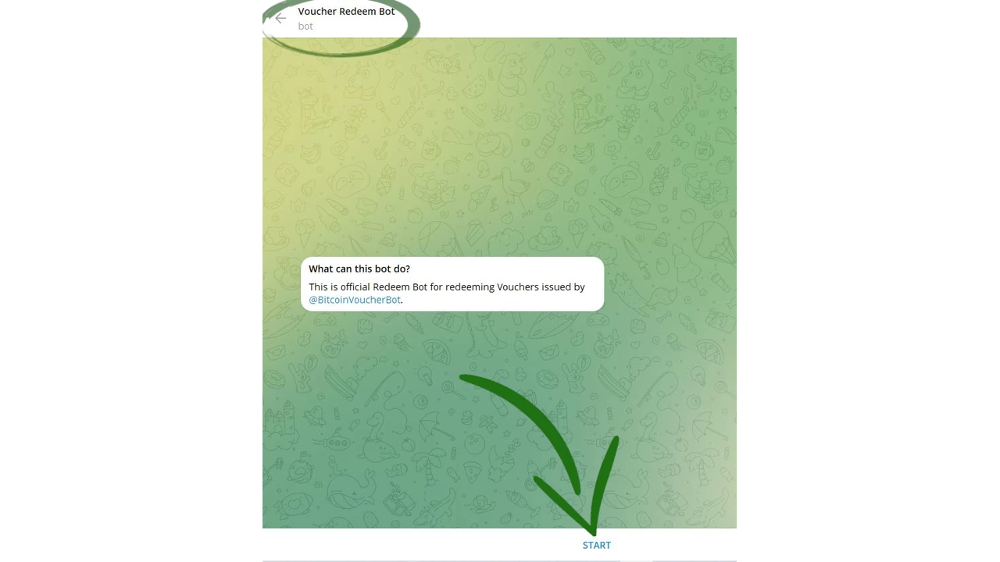

W tym momencie RedeemBot ładuje voucher onchain, łatwo rozpoznawalny po Voucher Code i ID referencyjnym. Odblokowuje również pasek do pisania wiadomości i rozpoczęcia czatu z botem, który w rzeczywistości zachęca nas do przekazania mu onchain Address naszego Wallet.

**Uwaga**: Ten Address musi być typu SegWit.

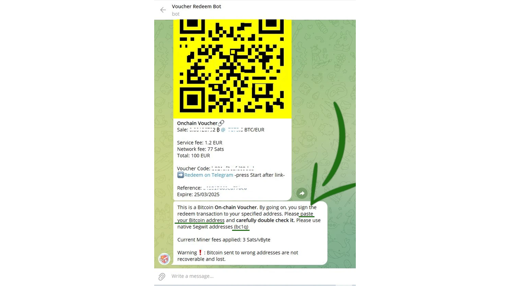

W tym momencie otwieramy Wallet, generate i SegWit Address

kopiujemy go

i wklej go na czacie z RedeemBotem

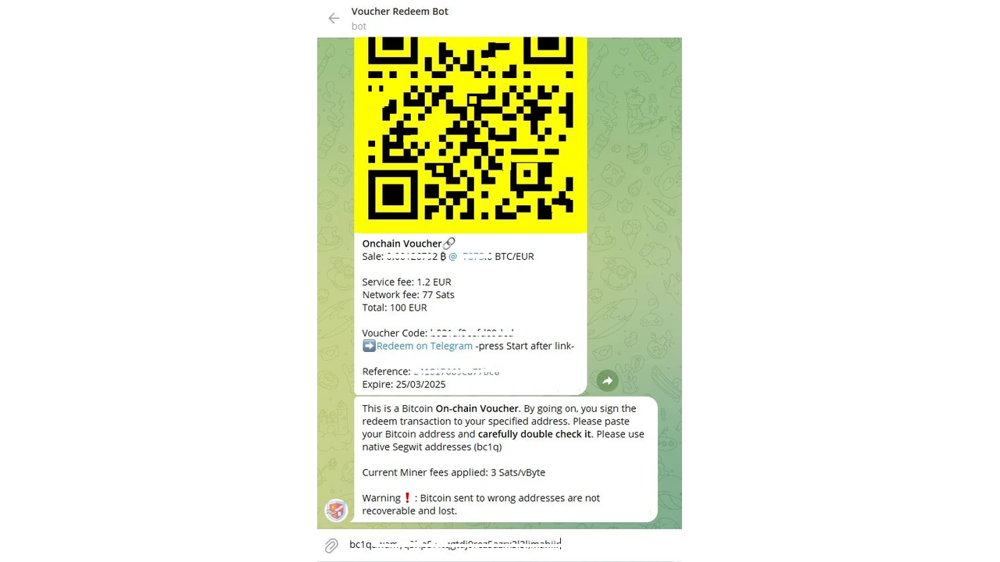

Mamy teraz ekran sprawdzania, aby zweryfikować poprawność kodu kuponu, a także Address, który przekazaliśmy RedeemBot. Sprawdźmy to dobrze, ponieważ klikając _Proceed_, transakcja rozpoczyna się i nie będzie możliwości jej ponownego znalezienia, jeśli na przykład przekazaliśmy niewłaściwy Address.

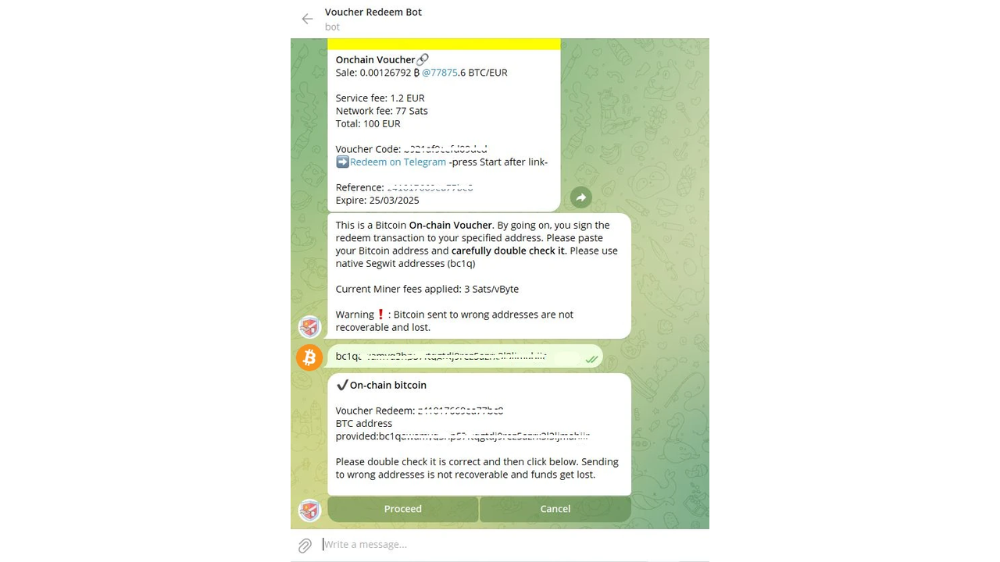

Transakcja została rozpoczęta i tym samym kończy się procedura Redeem vouchera onchain.

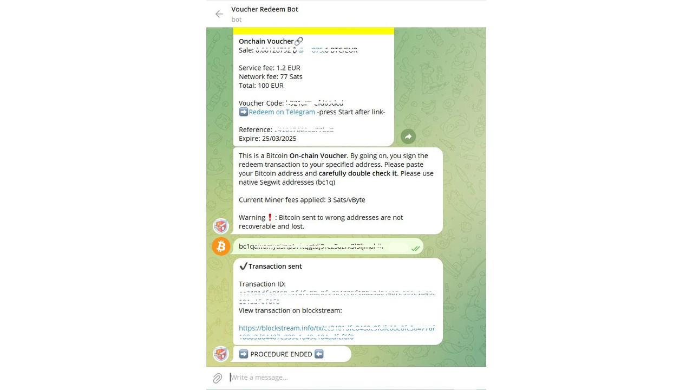

podczas gdy kwota ta może być widoczna w historii naszego Wallet.

