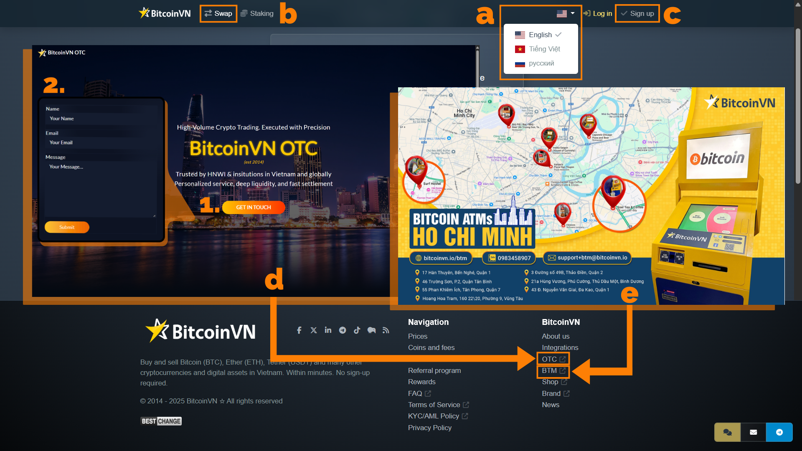
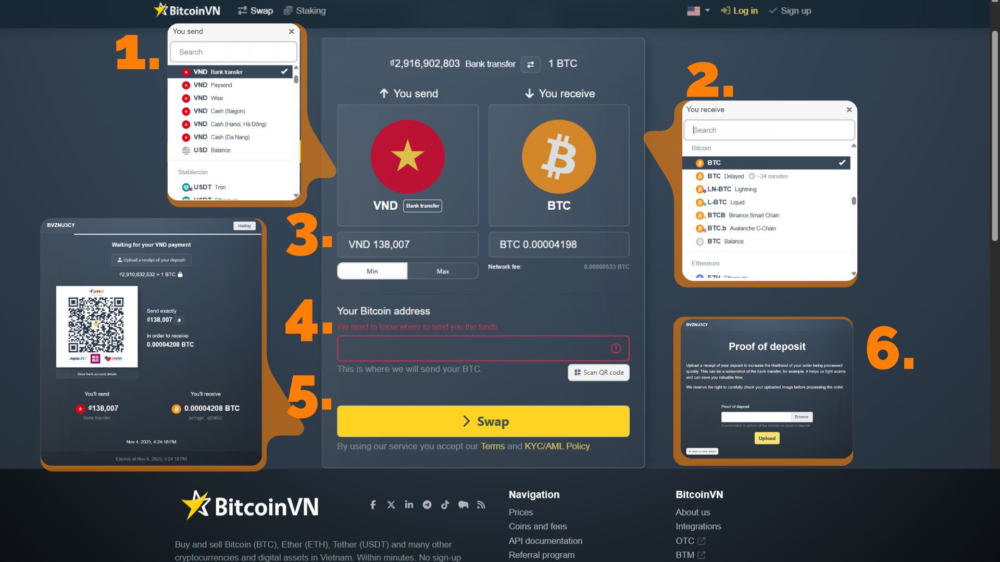
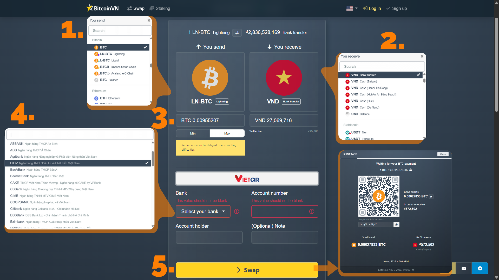

## Introdução

A BitcoinVN.io tem sido a primeira e mais confiável bolsa Bitcoin do Vietname desde 2014. Capacitamos os usuários a converter ativos digitais diretamente em Dong vietnamita (VND) por meio de três serviços principais:

- (b)** Swaps instantâneos em linha
- (e)** ATMs Bitcoin
- (d)** Mercado de balcão (OTC)

O nosso compromisso com a segurança e conformidade de alto nível garante que os habitantes locais e os expatriados confiam em nós para remessas seguras, investimentos e pagamentos digitais diários.

A nossa plataforma de câmbio online foi concebida para uma experiência de utilizador intuitiva, permitindo-lhe executar swaps instantâneos com facilidade. Suportamos vários idiomas, incluindo **(a)** inglês, vietnamita e russo. Para pequenos swaps, não é necessária uma conta; no entanto, pode **(c)** inscrever-se para aumentar significativamente os seus limites de transação diários. A plataforma lista atualmente mais de 99 activos digitais, que pode converter convenientemente para Bitcoin (BTC) - o ativo mais difícil - ou diretamente para Dong vietnamita (VND), com várias opções de pagamento disponíveis.

## Declaração de exoneração de responsabilidade

Este guia destina-se estritamente a fins educativos sobre as nossas ferramentas e **não a aconselhamento financeiro**. Informamos que as criptomoedas são altamente voláteis e **não têm curso legal no Vietname**. Pedimos-lhe que cumpra todas as leis locais e que considere vivamente a possibilidade de procurar aconselhamento financeiro profissional.

## Como comprar BTC por VND

### Passo 1: Selecionar a moeda a enviar

Na secção "You send" (Você envia) - o grande quadrado com o ícone VND vermelho, escolha os seus métodos de pagamento preferidos para pagar o BTC a partir do menu pendente. Neste caso, é selecionada a Transferência bancária VND (pagar VND através de bancos locais). Apoiamos **67 bancos locais** no Vietname.

### Passo 2: Escolher a moeda de receção

Na secção "You receive" (Recebe) - o grande quadrado com o logótipo Bitcoin - selecione BTC (Bitcoin blockchain/mainchain) - é normalmente a opção predefinida ou fácil de encontrar na lista pendente.

### Passo 3: Introduzir o montante em VND e rever os detalhes da transação

Introduza manualmente o montante que pretende trocar e utilize a ligação [limites diários](https://bitcoinvn.io/info) ou os botões Mín/Máx. para verificar a sua capacidade, caso não tenha uma conta. O sistema calcula instantaneamente o montante final de BTC que irá receber depois de ter em conta as [taxas de troca](https://support.bitcoinvn.io/help/en-us/4-orders/12-fees) e a taxa de câmbio nesse momento específico. Reveja o montante final de BTC para ver se está satisfeito com o negócio.

#### Dicas

Lembre-se que as **taxas de transação variam**, por isso verifique sempre o preço final antes de confirmar.

**Não é necessária uma conta com** transacções diárias limitadas a VND 250.000 (~ USD $8). Estão disponíveis mais informações nas nossas [políticas de transferência bancária](https://support.bitcoinvn.io/help/en-us/5-deposit-settle-methods/17-vnd-bank-transfer).

**Atenção**: a taxa de rede é geralmente mais barata quando se escolhe o Lightning Network em comparação com o método de transação onchain.

### Passo 4: Introduza o seu Bitcoin Address

Copie e cole o seu endereço de receção de BTC wallet ou digitalize o código QR no campo de endereço (destacado a vermelho na captura de ecrã). Verifique-o novamente, pois é para lá que as suas BTC serão enviadas.

### Etapa 5: Proceder ao pagamento da sua escolha

Clique no grande botão amarelo Swap para prosseguir para uma página de pagamento com os dados bancários do BitcoinVN acompanhados de um código QR (para aplicativos financeiros locais como Momo e VNPAY) e o valor exato do VND. Transfira o montante exato da sua conta bancária/app vietnamita dentro do limite de tempo, caso contrário, o negócio expirará e terá de recomeçar a partir do passo 3.

### Passo 6: Verificar o seu pagamento e receber o ativo

Depois de efetuar o pagamento, carregue uma captura de ecrã/recibo do recibo de pagamento para verificação (normalmente 1-10 minutos nos dias úteis). Uma vez confirmado, o BTC é enviado instantaneamente para o seu wallet. Receberá actualizações por e-mail e poderá seguir o número da encomenda.

## Como vender BTC por VND

### Etapa 1, 2 e 3: Selecionar Moeda de envio, Moeda de receção, introduzir montantes de swap

Semelhante ao processo de compra acima, clique na secção `Você envia` para escolher o ativo que deseja trocar através de qual blockchain, por exemplo, BTC (bitcoin on-chain), ou BTC via lightning network (uma solução off-chain) a partir do menu suspenso.

Em seguida, na secção "Receber", selecione o ativo que pretende receber e como pretende receber; por exemplo, através de uma transferência bancária VND (receber através do seu banco).

Introduza o montante de BTC que pretende trocar. A aplicação calcula instantaneamente o montante de VND que irá receber. Verifique a taxa de rede, os montantes finais a receber e a nota de liquidação (pode ser adiada fora do horário de expediente).

### Passo 4: Rever e introduzir os seus dados de pagamento

Selecione um dos 67 bancos locais suportados a partir da lista pendente e, em seguida, preencha o nome completo do titular da conta, o número da conta e adicione uma nota, se desejar.

### Passo 5: Enviar o ativo e receber o seu pagamento

Clique no botão Swap para mostrar o endereço de depósito BTC da BitcoinVN e um código QR. Envie exatamente a quantia especificada de BTC do seu wallet para o endereço indicado, digitalizando o código QR ou copiando o endereço Bitcoin.

Dê tempo para a confirmação (segundos no Lightning, minutos no on-chain). O VND será transferido para a sua conta bancária - geralmente dentro de 1-2 horas durante o horário comercial. Um e-mail e um número de pedido serão emitidos para rastreamento.

## Conclusão

Agradecemos sinceramente as suas perguntas, pedidos e comentários sobre os nossos produtos e serviços.

Para obter informações específicas, pode consultar a nossa Política de Recuperação de Activos [aqui](https://support.bitcoinvn.io/help/en-us/3-general/1-asset-recovery-policy) ou contactar-nos diretamente através de [Telegram](https://t.me/bitcoinvn_community).

À medida que a adoção de activos digitais se integra nas finanças globais, a **BitcoinVN** está estrategicamente posicionada para liderar o desenvolvimento da capacidade financeira internacional do Vietname. Fazemos a ponte entre as economias física e digital, combinando a liquidez global com a facilidade local. A nossa missão é democratizar o acesso seguro e fácil a uma gama abrangente de produtos de qualidade e serviços profissionais aqui mesmo no Vietname.

Cobrimos as suas necessidades, quer seja um indivíduo ou uma empresa. Isto inclui tudo, desde a troca de moeda local por BTC, troca de activos digitais ou envio de fundos para o estrangeiro, até à incorporação de ferramentas comerciais e soluções API para fazer avançar o seu negócio na futura economia digital.

Incentivamo-lo vivamente a juntar-se à nossa comunidade e a manter-se atualizado:

- [LinkedIn](https://vn.linkedin.com/company/bitcoinvn)
- [Facebook](https://www.facebook.com/www.bitcoinvn.io)
- [X](https://x.com/Bitcoin_Vietnam) (antigo Twitter)
- [TikTok](https://www.tiktok.com/@bitcoinvn.io)
- [Nostr](https://iris.to/npub1j4lp9hmzd3rqlcw7mml09uwvwap0g5u5wx2qm2lzt9wcqt925jvqf4wzaa)
- [Últimas notícias](https://bitcoinvn.io/news/)