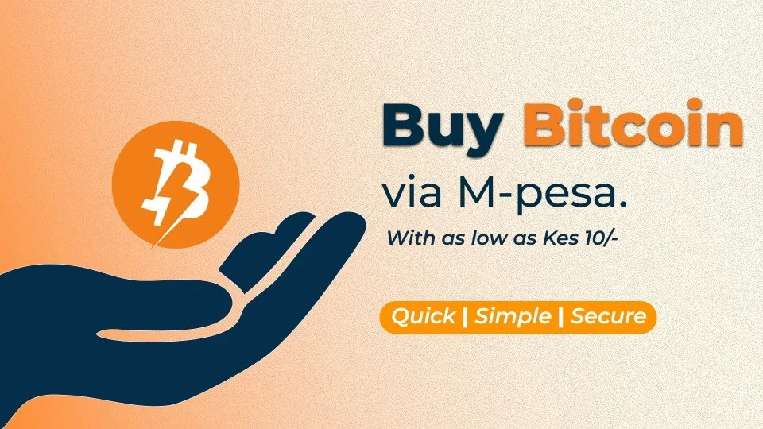
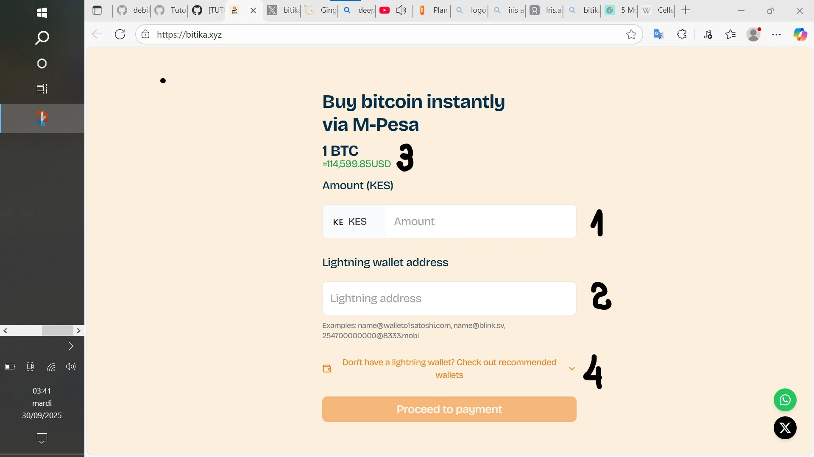
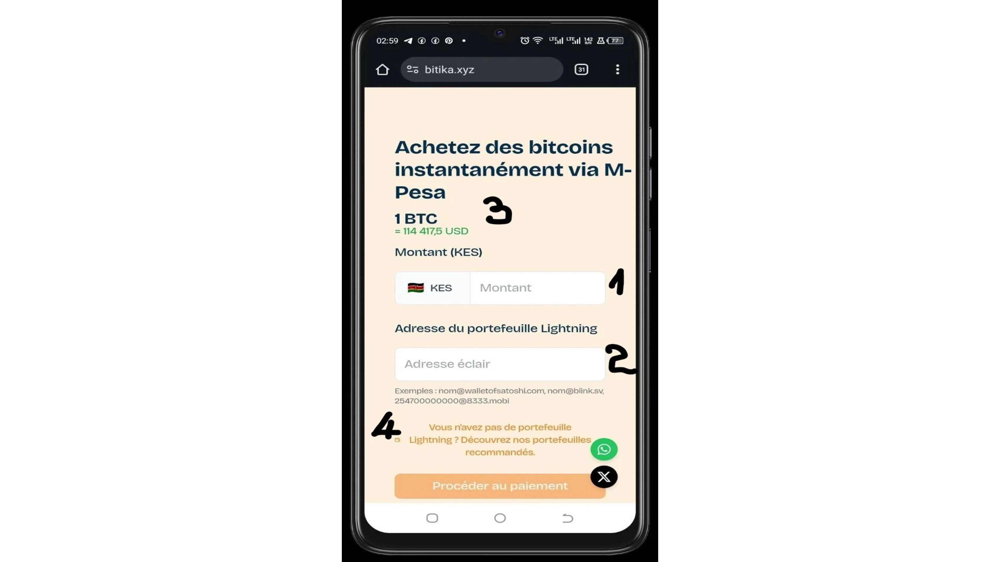
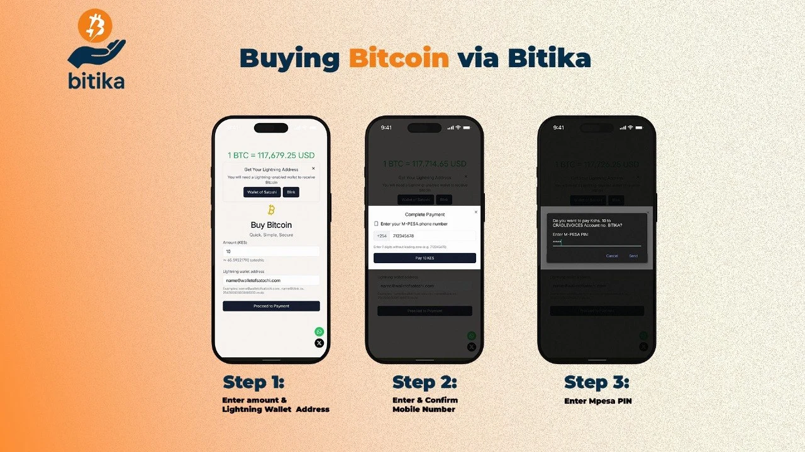
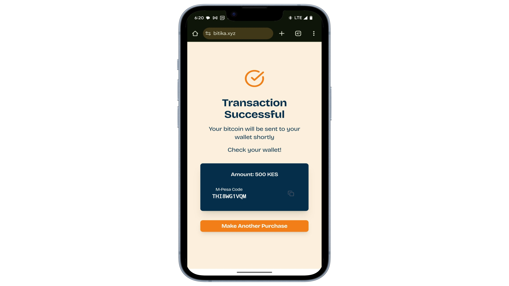
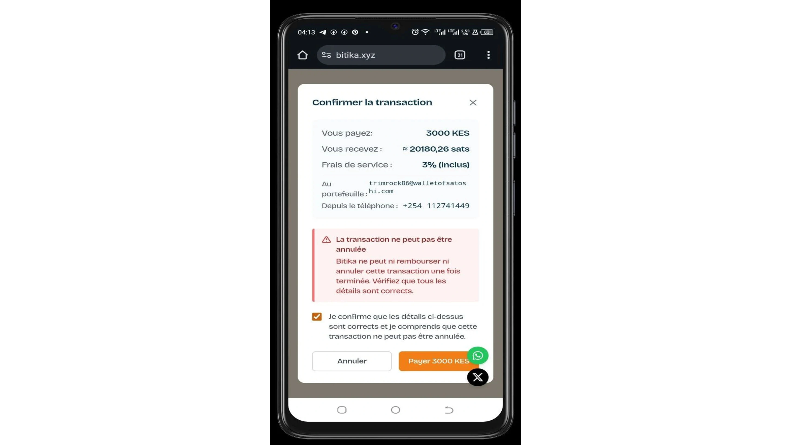
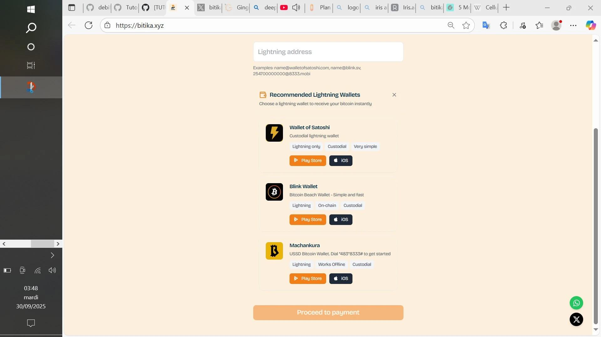
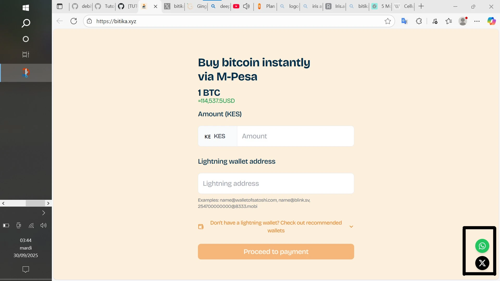

Velstandsskaping og regional og samfunnsmessig integrasjon er basert på økonomisk utveksling. Utvekslingen stimulerer til pengesirkulasjon og forbruk. Gjennom tidene har økonomisk utveksling tatt mange ulike former, fra byttehandel til digital økonomi og industriell økonomi.

Afrika blir i stadig større grad en grobunn for den digitale økonomien, særlig gjennom :

- mobile pengeoverføringstjenester (den første tjenesten av denne typen, M-Pesa, ble lansert i Kenya av telefonoperatøren Safaricom);
- og digitale eiendeler (hovedsakelig Bitcoin for sin desentraliserte, usensurerte natur osv.).

*programvareingeniør *FIDEL OTIENO** skapte deretter en løsning - **Bitika** - som kombinerer Bitcoin og mobile penger for å gi folk enklere tilgang til finansielle tjenester.

Løsningen **Bitika** er en kenyansk plattform som ikke er utviklet for å innføre nye verktøy for daglige transaksjoner, men for å følge lokalbefolkningen mot Bitcoin via M-Pesa, som de har vært vant til i årevis.

Kenyanere kan derfor kjøpe satoshier i tre enkle trinn, uten å måtte kjenne kundenes identitet eller bruke komplekse vekslingsplattformer.

## Kom i gang med Bitika

For å bruke løsningen, besøk [Bitika]-plattformen (https://bitika.xyz/). Grensesnittet forblir det samme, enten du bruker datamaskinen eller smarttelefonen.

Du har :

1. feltet for å legge inn beløpet ;

2. feltet for å lime inn Lightning-adressen din (kun adresser) ;

3. gW-3-pris i sanntid i dollar ;

4. anbefales Lightning lommebøker, hvis du ikke allerede har en.

## De tre innkjøpsfasene

For å gjøre ditt kjøp :

1. skriv inn kjøpsbeløpet (i **KES**) og Lightning-adressen til din wallet;

2. skriv inn og bekreft M-Pesa-nummeret ditt;

3. tast inn PIN-koden til M-Pesa-mobilpengekontoen din for å bekrefte kjøpet.

wallet blir nesten umiddelbart kreditert med satoshiene dine.

Vær oppmerksom på at beløpet du kjøper på **Bitika** ikke kan være **mindre enn** **50 KES** eller **mer enn** **10 000 KES** (kenyanske shilling). Plattformen har allerede opplevd mangel på satoshier (*tomt på lager*) på grunn av stor etterspørsel. Dette viser lokalbefolkningens entusiasme for løsningen.

Husk å sjekke detaljene nøye og krysse av i boksen før du starter betalingen. Det påløper også servicegebyrer.

I tillegg ble **OTP-verifisering** lagt til for noen måneder siden for å sikre transaksjoner på grunn av svindlere som utgir seg for å være plattformer og lokker folk til å sende penger via M-Pesa. En engangskode som er gyldig i en kort periode, sendes til telefonen din via SMS. Deretter taster du den inn i det angitte feltet. Når den er validert, blir du omdirigert til betalingssiden.

## Anbefalte porteføljer

**Bitika** anbefaler lynlommebøker som :

- Wallet av Satoshi;

https://planb.academy/tutorials/wallet/mobile/wallet-of-satoshi-39149d86-e42b-4e8f-ae9f-7e061e7784f7

- Blunk;

https://planb.academy/tutorials/wallet/mobile/blink-7ea5f5a4-e728-4ff9-b3f9-cf20aa6fc2bd

- Machankura.

https://planb.academy/tutorials/wallet/mobile/machankura-wallet-b41dd76d-a427-4cc1-992e-235dbb5884ae

Disse porteføljene er kun anbefalinger. Du kan bruke hvilken som helst wallet som støtter Lightning Network, forutsatt at den kan generate en adresse.

For å holde deg oppdatert på nyheter om løsningen, kan du abonnere på X-kontoen deres (f.eks. Twitter) eller skrive til WhatsApp-nummeret deres ved å klikke på ikonene nederst i høyre hjørne.

Du har nå mestret Bitika-plattformen for å kjøpe bitcoins umiddelbart.

Sjekk også ut veiledningen vår om Tando, en annen kenyansk løsning som lar deg betale for varer og tjenester, sende penger eller betale regninger med Bitcoin.

https://planb.academy/tutorials/exchange/centralized/tando-14a3d2f3-09d2-41c9-9e00-2f616dabea5c