아프리카의 국경 간 송금은 상품과 서비스의 무료 Exchange에 있어 큰 골칫거리입니다. 이러한 문제에 직면한 Bitcoin는 적절한 맥락에서 활용된다면 금융 주권부터 무료 Exchange 가치에 이르기까지 아프리카 사회가 직면한 많은 문제를 해결할 수 있는 혁신입니다. 오늘은 가나에서 Bitcoin의 일상적인 사용을 민주화하고 국경 간 거래를 촉진하는 것을 목표로 성장하고 있는 가나 커뮤니티인 Bitcoin 두아의 이니셔티브인 비트스펜다를 소개해드리고자 합니다.

## Genesis

*트위터는 지난 2주 동안 @freeAfricaRouthing 가나 라이트닝 개발* - X 사용자(이전 트위터)를 위해 가나에 통화를 송금하는 작업을 진행해 왔습니다.

BitSpenda는 인증, 개인 정보, 수수료 없이 Exchange와 모바일 머니를 변환할 수 있는 Bitcoin 통화 플랫폼입니다. 가나뿐만 아니라 많은 아프리카 국가에서 흔히 볼 수 있는 특정 문제, 즉 국경 간 결제를 해결하기 위해 만들어졌습니다. BitSpenda를 사용하면 일상적인 비즈니스에서 사용할 수 있는 빠르고 익명의 교환을 할 수 있습니다. BitSpenda의 주요 목표는 아프리카 커뮤니티에서 Bitcoin의 글로벌 채택을 위한 원활한 거래를 가능하게 하는 것입니다.

## 비트스펜다 시작하기

비트스펜다는 웹 기반 플랫폼으로, 기밀을 유지하면서 Exchange Bitcoin 및 모바일 머니를 거래할 수 있습니다. 실제로 비트스펜다는 계정, 개인 데이터, 신원 확인이 필요 없는 거래소로, 여러분과 여러분의 거래만 있으면 됩니다.

비트스펜다로 거래하는 것은 매우 직관적이며, 몇 단계만 거치면 됩니다. 공식 비트스펜다 [웹사이트](https://bitspenda.app)에서 "시작" 버튼을 클릭하면 Interface Exchange로 리디렉션됩니다.

BitSpenda는 현재 3개국을 대상으로 합니다:

- Bitcoin이 있는 가나는 모바일 머니 번호로 교환합니다.
- 은행 송금을 통한 나이지리아.
- M-pesa 모바일 머니를 통한 케냐.

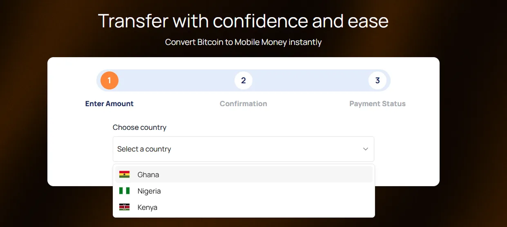

이러한 옵션을 사용하면 Lightning Network을 통해 Bitcoin를 사용하여 해당 국가로 송금하고 현지 통화 없이 일상적인 구매를 하는 것이 더 쉬워집니다.

### 나이지리아의 은행

아프리카의 은행 간 거래는 충분한 마찰을 일으키고 일반적으로 상당한 처리 시간이 소요됩니다. BitSpenda에서는 나이지리아에서 무료로 즉시 송금할 수 있는 Exchange을 사용하여 어디서나 송금할 수 있습니다. BitSpenda는 나이지리아의 50개 이상의 은행과 신생 은행을 지원합니다.

BitSpenda 애플리케이션의 첫 페이지에서 대상 국가로 나이지리아를 선택합니다.

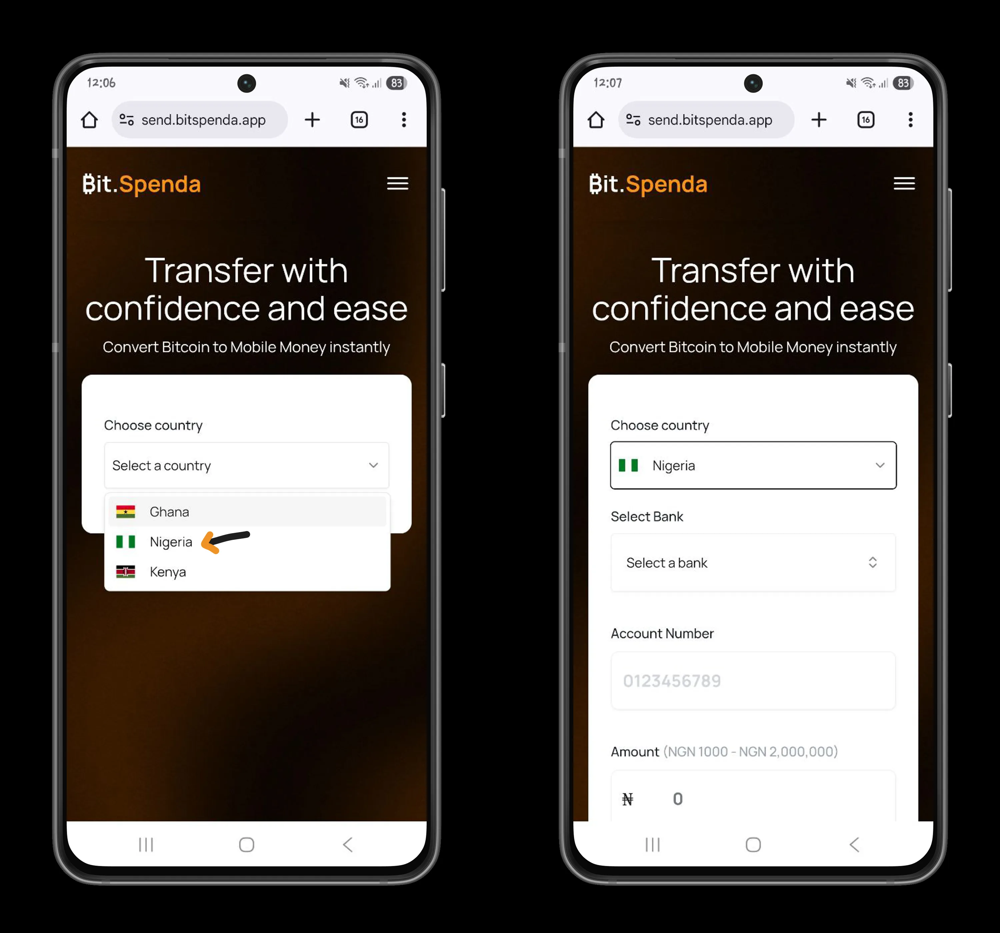

수취인의 은행을 선택하고 계좌 번호를 입력합니다. 각 Exchange에 대해 1,000~2,000,000 NGN(나이지리아 나이라)을 보낼 수 있습니다.

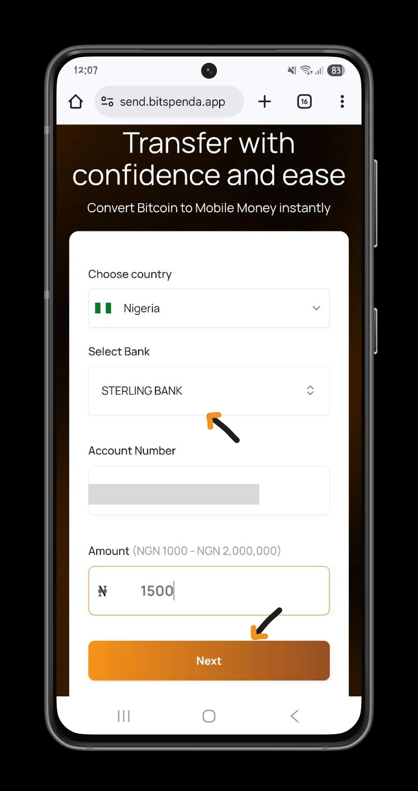

그런 다음 입력한 정보를 확인하여 Exchange를 확인합니다.

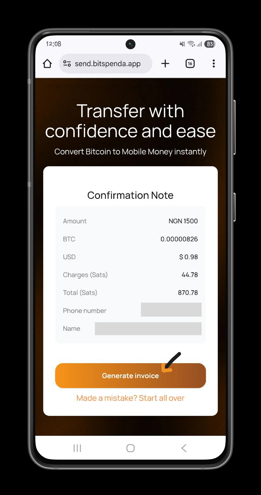

거래가 확인되면 관련 라이트닝 Invoice을 결제합니다. 결제가 완료되는 즉시 은행 송금이 자동으로 이루어집니다.

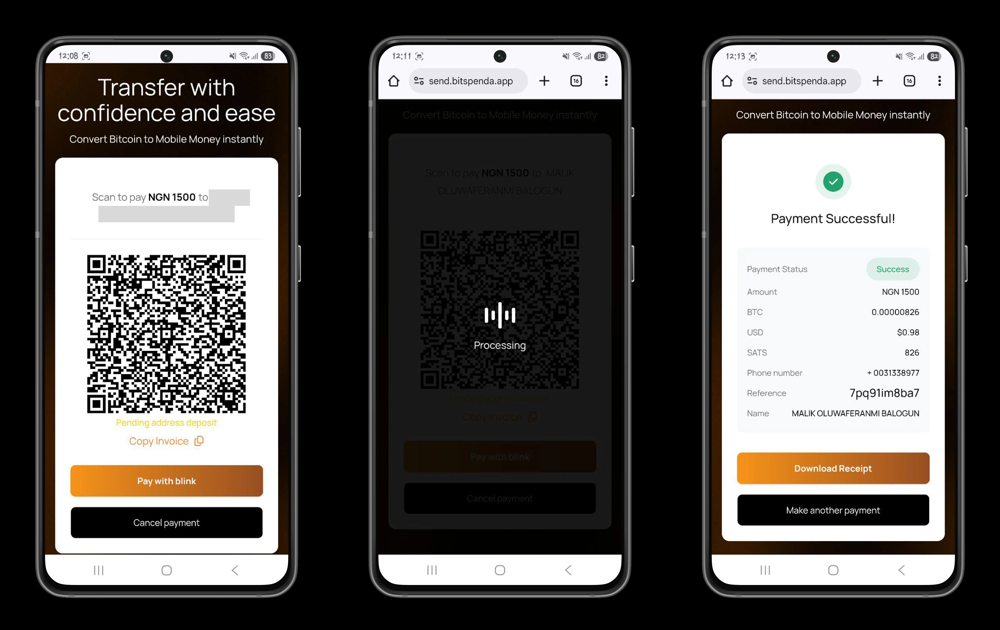

https://planb.network/tutorials/wallet/mobile/blink-7ea5f5a4-e728-4ff9-b3f9-cf20aa6fc2bd

https://planb.network/tutorials/wallet/mobile/blitz-wallet-794bdac4-1af4-49d5-9ea5-abb8228ca196

### 케냐의 M-Pesa

비트스펜다는 두 가지 금융 및 기술 혁신을 기반으로 합니다: Bitcoin과 모바일 머니입니다. 첫 번째는 사용자가 중앙 기관의 중개 없이 전 세계 어디에서나 Lightning Network Layer를 통해 즉시 익명으로 거래함으로써 금융 주권을 되찾을 수 있게 해줍니다. 두 번째는 아프리카 사회의 매우 낮은 은행 보급률 문제를 해결합니다.

비트스펜다는 케냐에서 인기 있는 모바일 머니 서비스인 M-Pesa를 통해 서비스를 제공하고 있습니다.

BitSpenda와 같은 이니셔티브 덕분에 오늘날 Bitcoin을 사용하여 상점에서 결제하고, 식당에서 식사를 하고, 집세와 공과금을 납부할 수 있습니다.

목적지 국가로 케냐를 선택한 다음 수취인의 M-pesa 번호와 수취인이 받을 금액을 입력합니다.

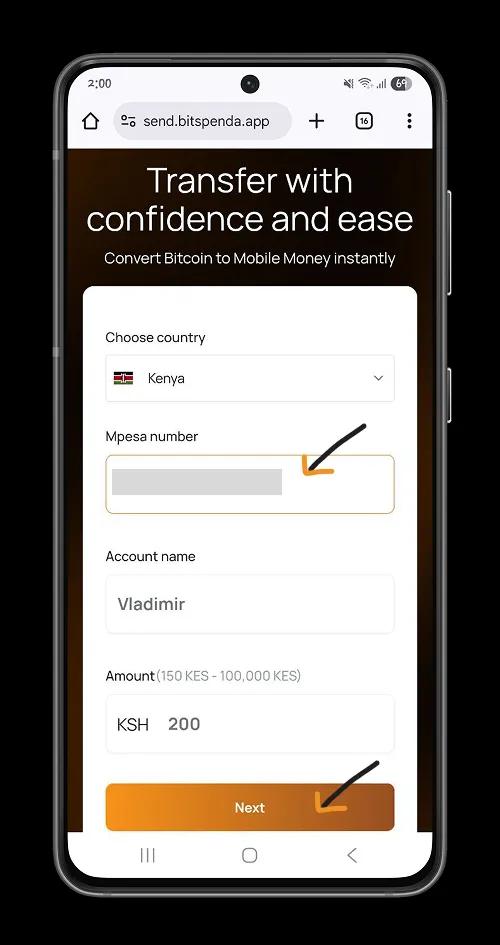

입력한 정보를 확인하면서 확인을 진행합니다.

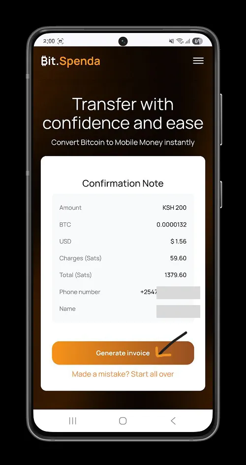

라이트닝 Invoice를 지불하여 Exchange의 유효성을 검사하고 Exchange을 완성하세요.

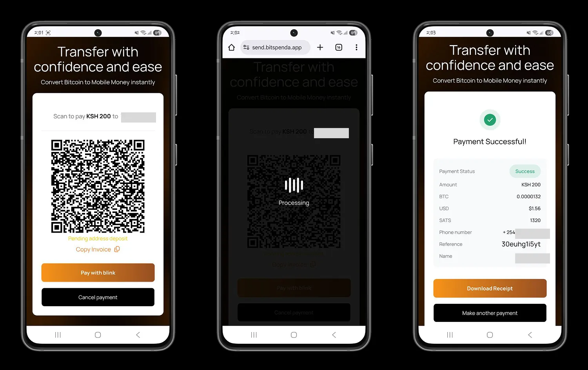

### 가나의 모바일 머니

가나에서는 케냐에서 M-Pesa를 사용하는 것과 같은 방식으로 MTN 모바일 머니를 통해 비트스펜다를 사용할 수 있습니다.

국가로 가나를 선택합니다.

그런 다음 Exchange을 받는 사람의 모바일 머니 번호를 입력합니다.

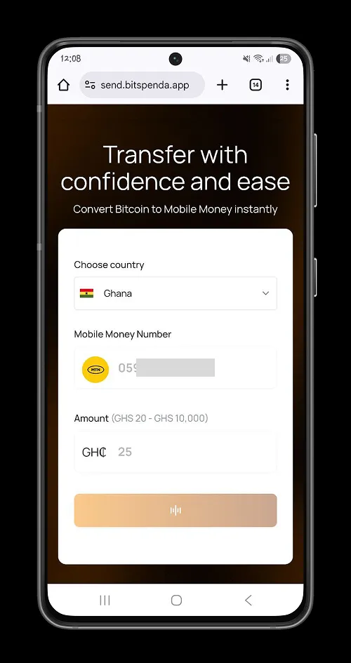

Exchange 번호와 금액을 확인하고 확인한 다음 Exchange에 연결된 Lightning Invoice를 결제합니다.

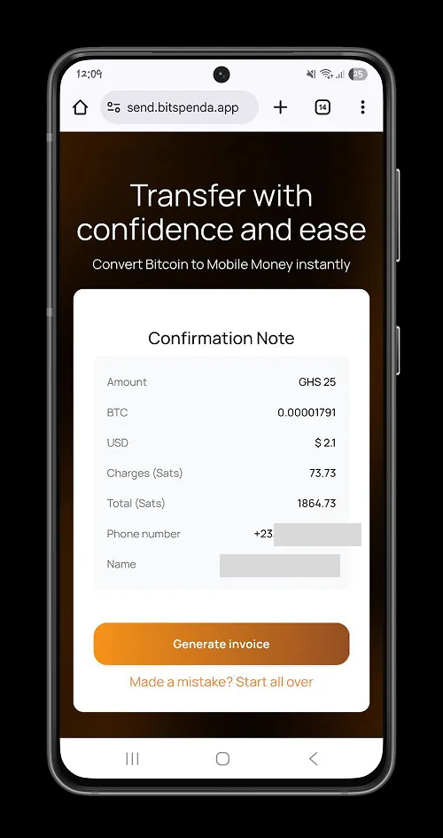

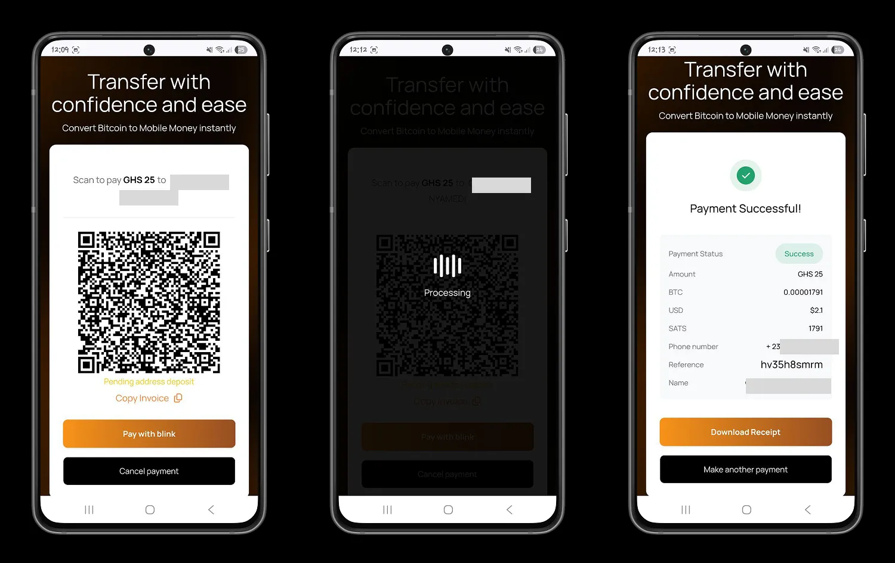

## 아프리카에서 Bitcoin 대중화

비트스펜다를 통해 [Bitcoin 두아](https://www.bitcoindua.org/)는 아프리카에서 Bitcoin을 채택하기 위한 이상적인 프레임워크를 구축하는 것을 목표로 합니다. 비트스펜다는 주로 :

- 기밀 유지**: 플랫폼에서 계정을 만들 필요도 없고, 신원을 확인할 필요도 없으며, 개인 정보를 제공할 필요도 없습니다.
- 자유**: 어느 나라에서든 가나, 나이지리아, 케냐로 거래할 때 비트스펜다를 사용할 수 있습니다.
- 속도**: 비트스펜다는 라이트닝 결제를 통해 처리 시간을 단축하고 거래를 즉시 처리할 수 있었습니다.
- 투명성**: 비트스펜다에서 수행한 모든 거래는 이러한 거래의 진행 상황을 추적하고 추적할 수 있는 고유 식별자와 연결되어 있습니다. 이 식별자를 사용하여 [X의 애플리케이션 지원](https://x.com/bitspenda)에 문의할 수도 있습니다.

이제 BitSpenda가 서비스하는 국가에서 매일 Bitcoin을 사용할 수 있습니다.

아프리카 커뮤니티에서 BitSpenda와 같은 많은 이니셔티브와 솔루션이 등장하고 있습니다. 세네갈에서 일상적으로 Bitcoin를 사용하는 솔루션인 Banxaas를 소개합니다.

https://planb.network/tutorials/exchange/centralized/banxaas-0cb6766a-5aee-4626-b657-224154bcf27c