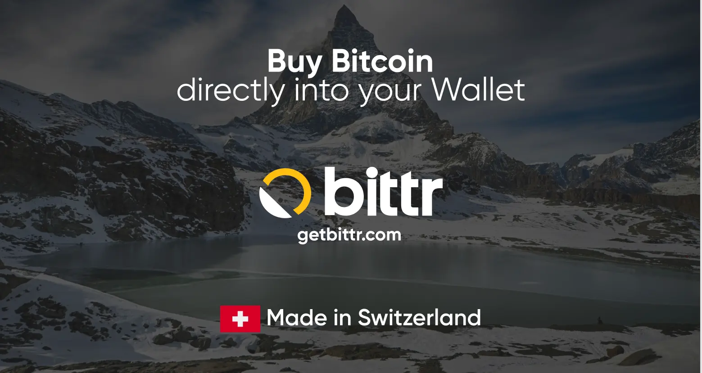

### Uvod u Bittr

Bittr je jednostavan alat za svakoga ko želi da poveća svoju ušteđevinu u Bitcoin - bez komplikovane aplikacije, provere identiteta ili treće strane koja čuva sredstva. Dizajniran je za ljude koji preferiraju jednostavnost, privatnost i potpunu kontrolu nad svojim novcem.

Samo pošaljite regularan bankovni transfer sa svog računa i dobićete Bitcoin direktno u svoj Wallet. Bilo da želite da štedite nedeljno, mesečno, ili kad god vam odgovara, Bittr je dizajniran da se uklopi u vašu rutinu bez ometanja.

Hajde da prođemo kroz to koliko je lako početi slagati Sats sa Bittr.

## Početak sa Bittr

1) Na webu ili mobilnom uređaju idite na [getbittr.com](https://getbittr.com/buy-Bitcoin?utm_source=planb&utm_medium=tutorial&utm_campaign=step1) i kliknite na „Buy Bitcoin“

- Nema naloga:** Ne morate kreirati nalog da biste kupili Bitcoin
- Bez KYC procesa:** Ne morate prolaziti kroz KYC (do 999CHF svakih 30 dana)
- Direktan početak:** Počinjete odmah i možete primiti svoj Sats za nekoliko minuta

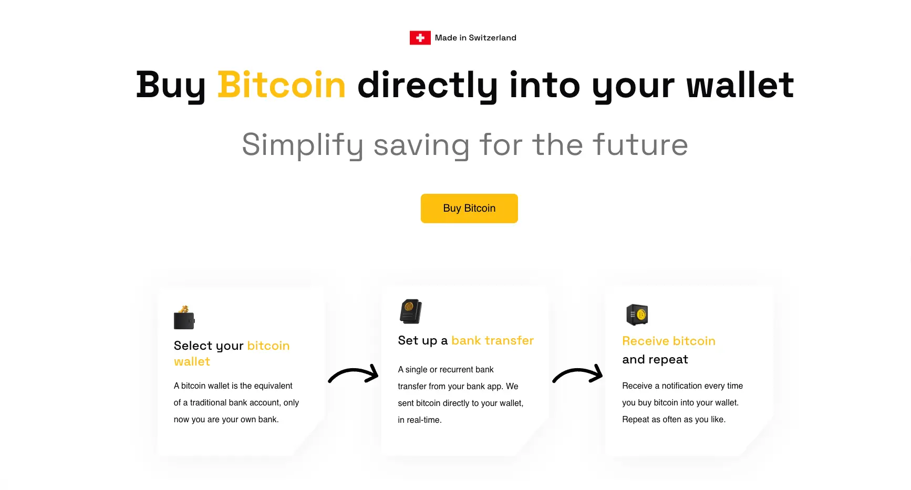

2) Unesite IBAN sa kojeg ćete slati

- SEPA only:** Bittr radi samo unutar Evrope

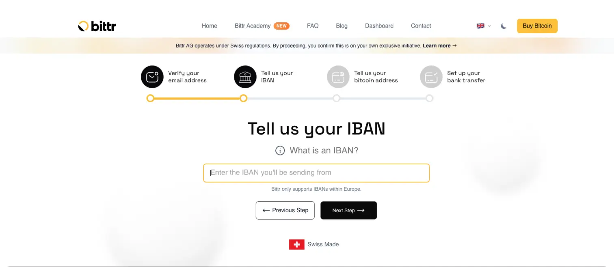

### Biranje vašeg Wallet

Bittr radi sa bilo kojom vrstom Wallet, uključujući aplikacije novčanike, softverske novčanike ili hardverske novčanike.

Počećemo sa BlueWallet za početnike, a kasnije u tutorijalu ćemo ga postaviti sa BitBox.

## Kupite Bitcoin direktno u BlueWallet

Preporučujemo da postavljanje obavite na mirnom i privatnom mestu. Ne bi trebalo da vam oduzme više od 5 minuta.

1) Odaberite “bluewallet” na veb-sajtu

2) Preuzmite BlueWallet aplikaciju ovde: [App Store](https://itunes.apple.com/app/bluewallet-Bitcoin-Wallet/id1376878040), [Google Play](https://play.google.com/store/apps/details?id=io.bluewallet.bluewallet).

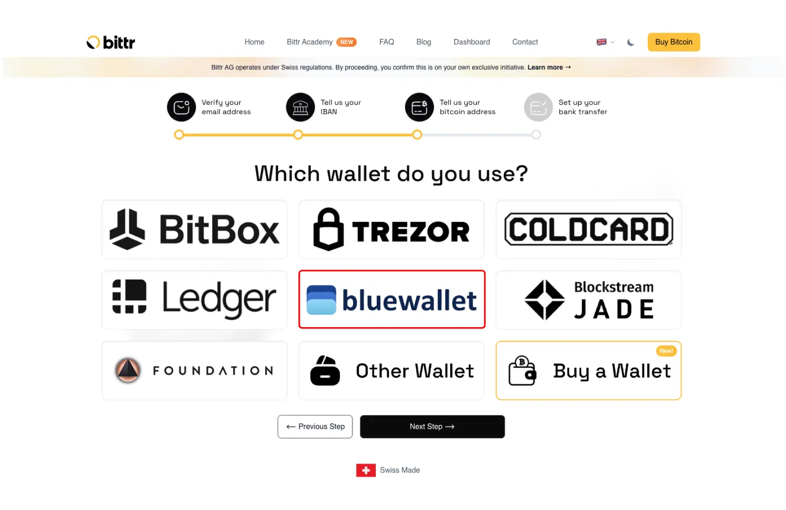

3) Kliknite na „Dodaj Wallet“ (Ako već imate Wallet, pređite na sledeći korak).

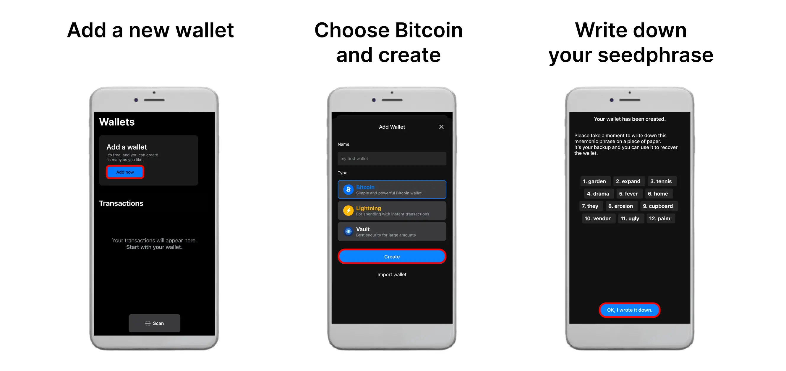

4) Odaberite svoj Wallet i idite na potpisivanje poruke

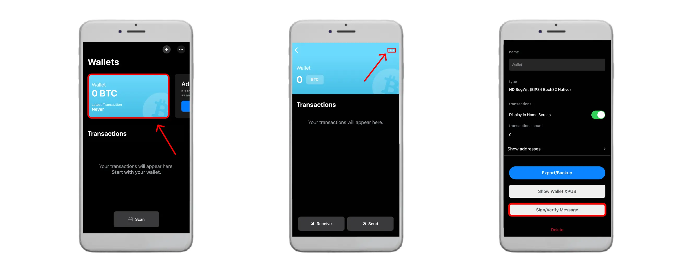

5) Dovršite potpisivanje poruke i nalepite svoj potpis na vebsajt

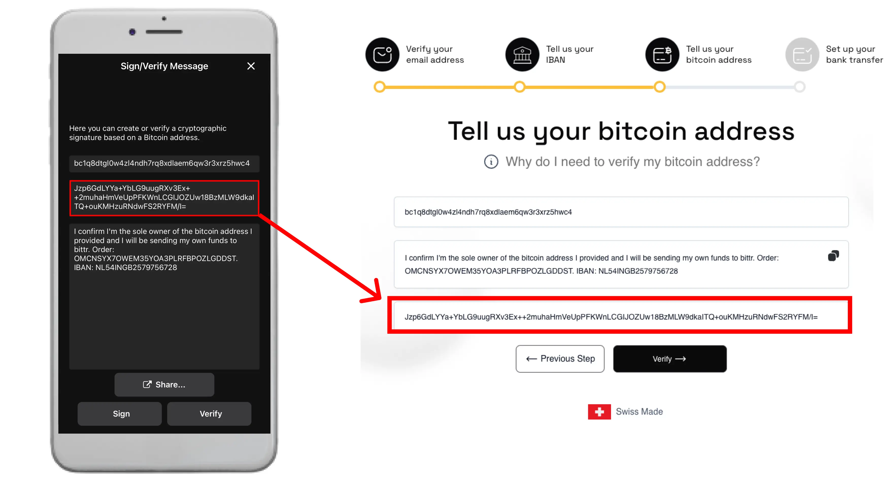

**Napomena: Takođe možete kliknuti na "Share" u BlueWallet-u, kopirati ceo link i nalepiti ga u polje na Bittr vebsajtu.**

6) Postavite svoj bankovni transfer sa vašim ličnim opisom uplate

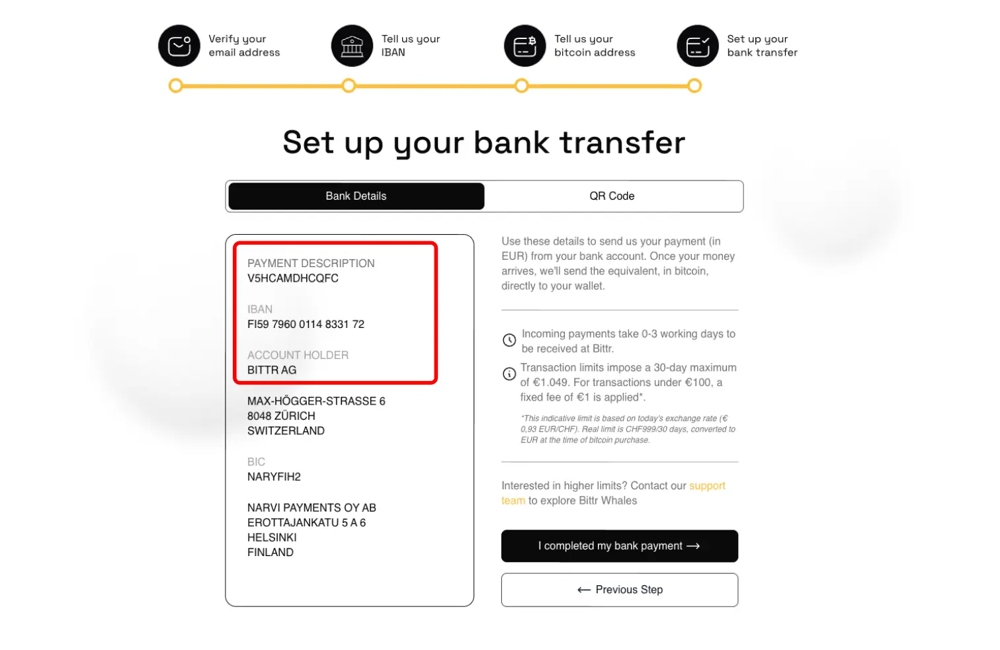

## Kupite Bitcoin direktno u BitBox

1) Odaberite “BitBox”

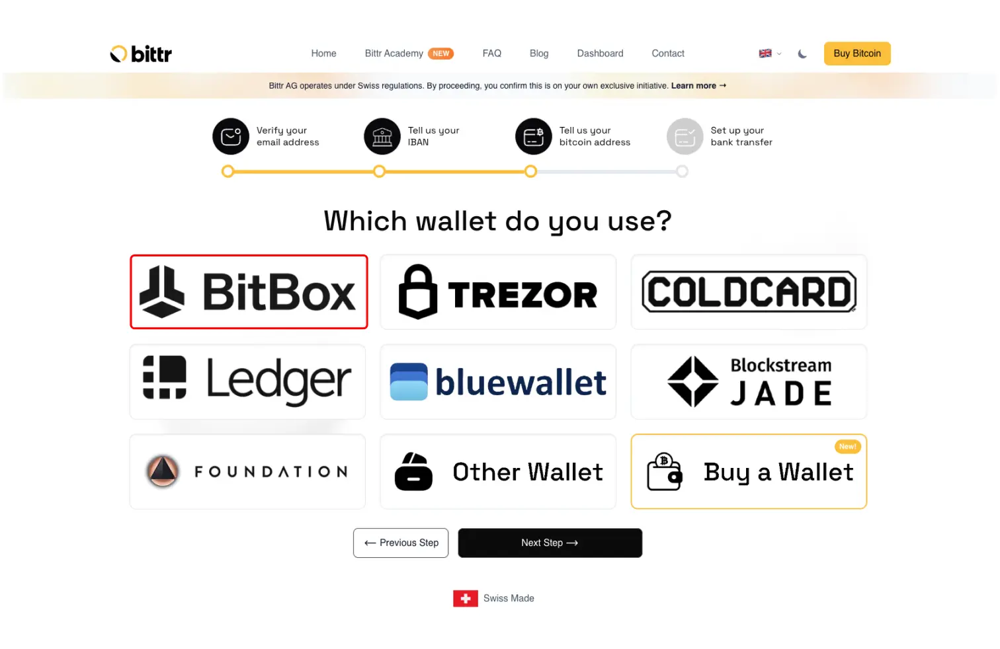

2) Kliknite da otvorite BitBox aplikaciju na vašem računaru

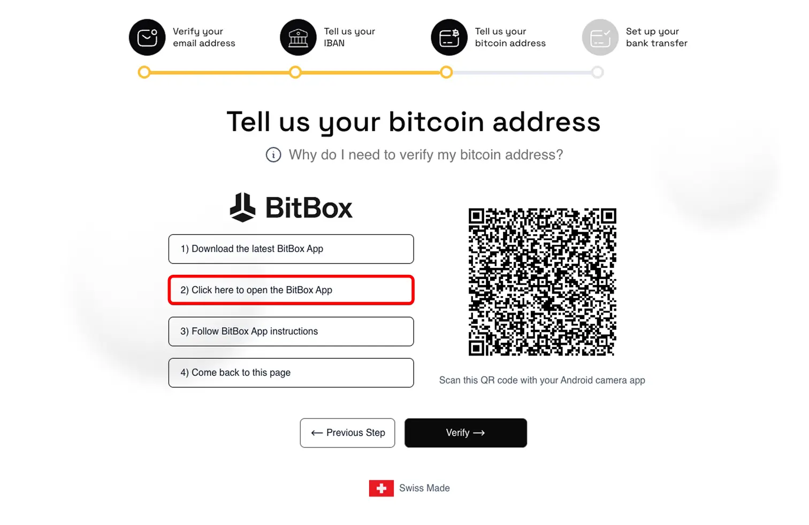

3) Otključajte svoj BitBox i pratite korake i završite potpisivanje poruke

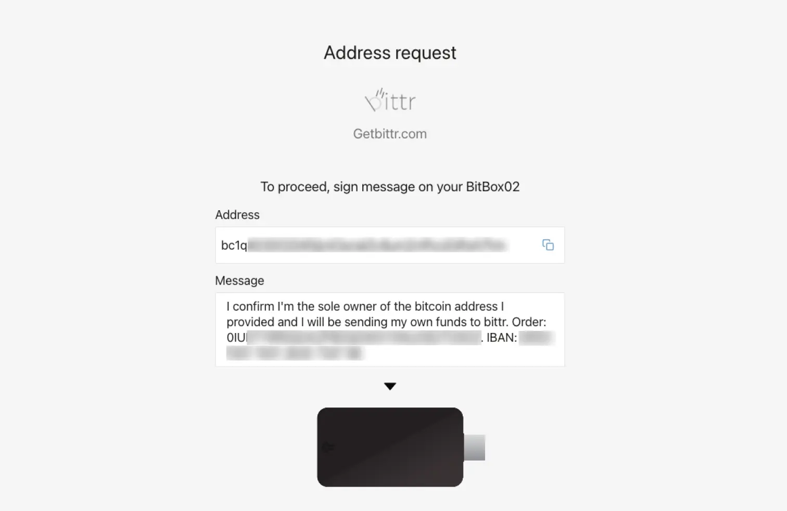

4) Postavite svoj bankovni transfer sa vašim ličnim opisom plaćanja

Wuhuu, that’s it! 🤩 As soon as money arrives in Bittr’s bank account, Bittr will buy your Bitcoin, send the Bitcoin directly to your Wallet, and email you the transaction details (including the Exchange rate at the time of conversion).