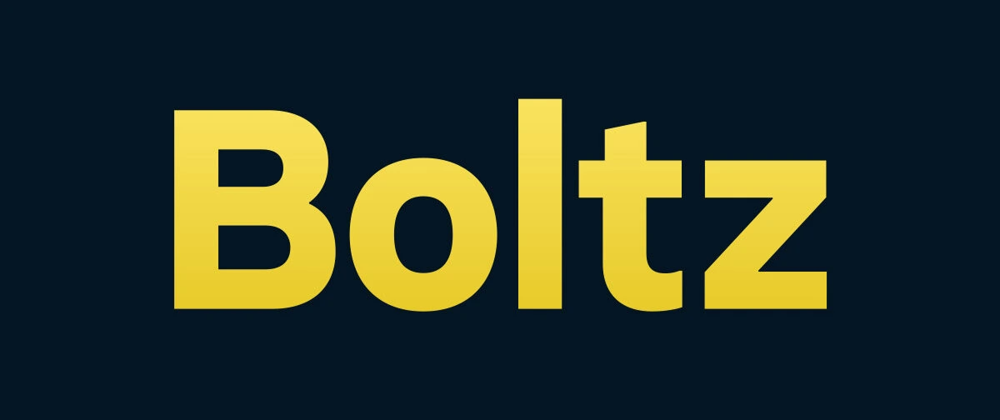

Kể từ khi triển khai vào năm 2009, hệ thống tiền điện tử ngang hàng Bitcoin đã phát triển theo cấp số nhân, tạo ra các giải pháp hiện nay cho phép chúng ta có thể sử dụng ngay lập tức trong các hoạt động hàng ngày, đặc biệt là thông qua Lightning Network.

Tuy nhiên, vẫn còn một vấn đề lớn giữa các lớp giao thức Bitcoin: khả năng tương tác linh hoạt. Để khai thác toàn bộ tiềm năng của Bitcoin, việc tìm ra một giải pháp cho phép giao dịch giữa các lớp khác nhau của giao thức là vô cùng cấp thiết. Nhu cầu này đã dẫn đến sự ra đời của Boltz, một cầu nối liên kết nhiều lớp Bitcoin, vào năm 2019.

## Boltz là gì?

[Boltz](https://boltz.Exchange) là một nền tảng phi lưu ký lý tưởng cho bất kỳ ai muốn giao dịch giữa các lớp khác nhau của giao thức Bitcoin:

- on chain**: Chuỗi chính của Bitcoin, nơi các giao dịch được xác nhận trung bình cứ sau 10 phút, phí giao dịch thường cao, không nhất thiết đáp ứng được nhu cầu của người dùng;
- Lightning Network**: Lớp phủ Bitcoin cho phép thanh toán tức thời với mức phí thấp, cho phép sử dụng Bitcoin cho các khoản thanh toán hàng ngày;
- Liquid Network**: lớp phủ cho Bitcoin do Blockstream tạo ra, cho phép sử dụng nhanh Confidential Transactions và các công cụ tài chính khác dựa trên Bitcoin;
- RootStock**: Giải pháp phát triển hợp đồng thông minh dựa trên giao thức Bitcoin.

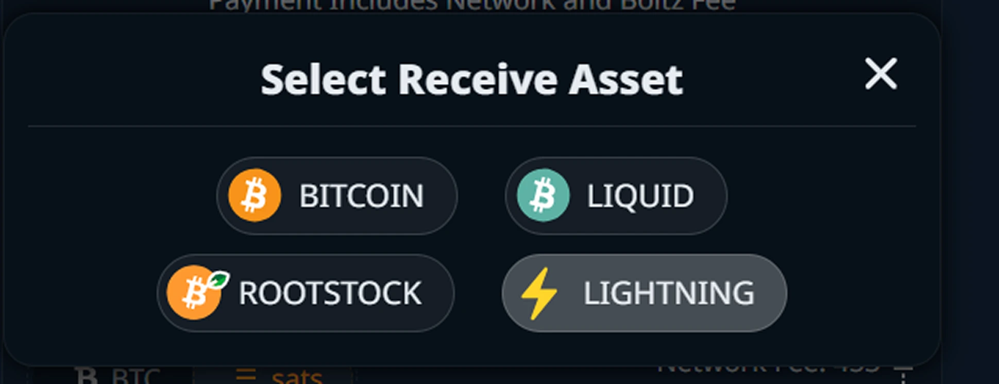

Khả năng tương tác giữa các lớp khác nhau này có tầm quan trọng lớn vì nó mang lại cho người dùng sự linh hoạt cần thiết để tận dụng tối đa mọi tính năng mà hệ sinh thái Bitcoin mang lại.

Boltz sử dụng hoán đổi nguyên tử. Công nghệ này cho phép trao đổi bitcoin giữa 2 lớp (ví dụ: BTC onchain trong Exchange với BTC trên Lightning) trực tiếp giữa hai bên, không cần sự tin tưởng và không cần trung gian. Những trao đổi này được gọi là "hoán đổi nguyên tử" vì chúng chỉ có thể tạo ra hai kết quả:

- Hoặc là Exchange thành công và hai người tham gia đã trao đổi BTC của họ một cách hiệu quả;
- Hoặc Exchange thất bại và cả hai người tham gia đều phải ra về với số BTC ban đầu của mình.

Theo cách này, bạn sẽ giữ được quyền tự quản lý vĩnh viễn số bitcoin của mình và Exchange không dựa trên bất kỳ sự tin tưởng nào vào bên đối tác: Exchange có thể thành công hoặc thất bại, nhưng không bên nào có thể đánh cắp tiền của bên kia.

Exchange nguyên tử hoạt động với hợp đồng thông minh [HTLC](https://planb.network/resources/glossary/htlc) (*Khóa thời gian băm Contract*). Trong loại Contract này, số tiền được "khóa" trong một kênh hai chiều và giới hạn thời gian được áp dụng, do đó nếu giao dịch không hoàn tất trong một khoảng thời gian nhất định, số dư sẽ được trả về cho người gửi. Đây là cơ chế được nền tảng Boltz sử dụng.

## Những trao đổi đầu tiên của bạn với Boltz

Boltz là một nền tảng web phi lưu ký, không yêu cầu bạn cung cấp thông tin cá nhân. Boltz sở hữu Interface tối giản, mượt mà, cho phép bạn bắt đầu giao dịch trong vòng chưa đầy một phút.

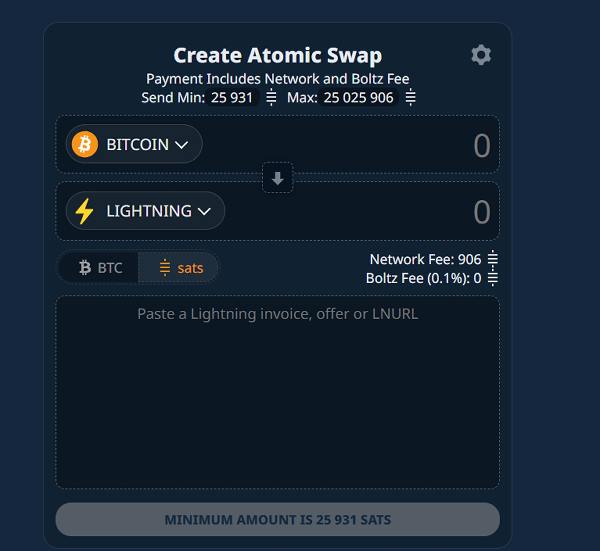

Khi ở trên nền tảng, bạn có thể tạo ra các trao đổi nguyên tử giữa các lớp khác nhau của hệ sinh thái Bitcoin.

Bạn sẽ thấy số satoshi tối thiểu và tối đa (đơn vị nhỏ nhất của Bitcoin) mà bạn có thể giao dịch thông qua Boltz, bao gồm phí mạng và tỷ lệ phần trăm do Boltz áp dụng từ 0,1% đến 0,5%.

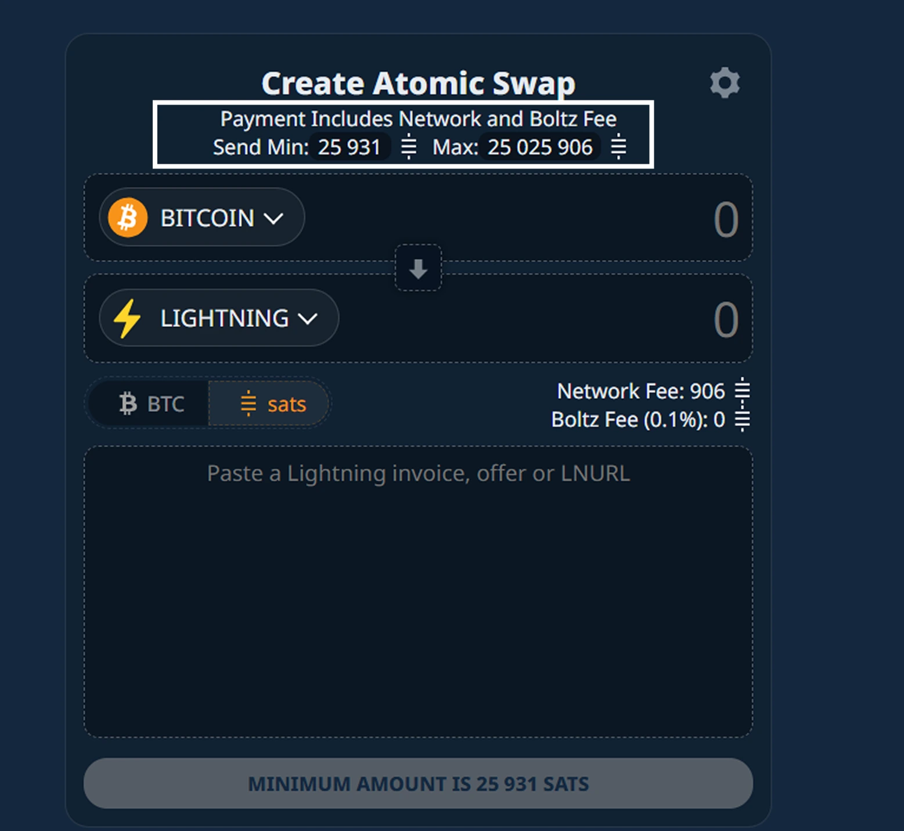

Sau đó chọn Layer mà bạn muốn tạo ra Exchange nguyên tử và chọn Layer mà bạn muốn nhận bitcoin.

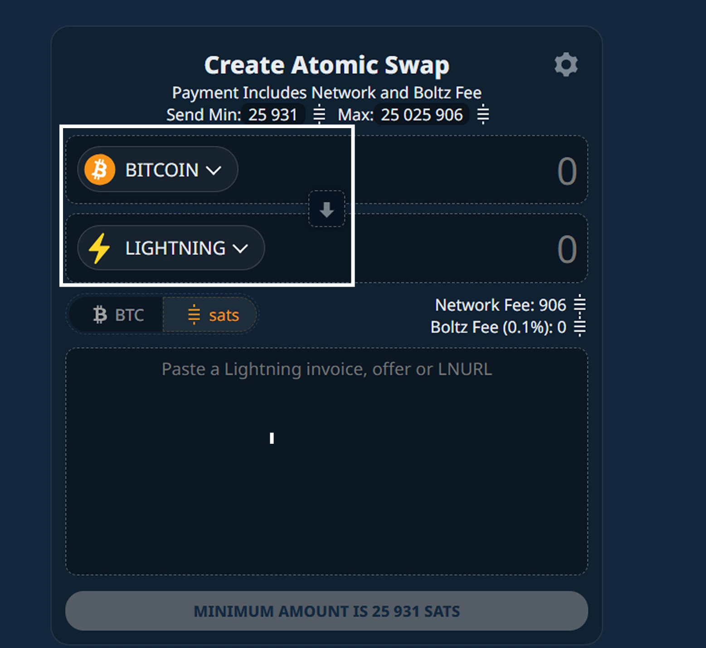

Trong hướng dẫn này, chúng ta sẽ tập trung vào Exchange nguyên tử từ Layer chính đến Lightning Network.

Bạn có thể cấu hình đơn vị cơ sở cho các cuộc trao đổi của mình bằng cách chọn giữa các tùy chọn:

- BTC;
- Sats.

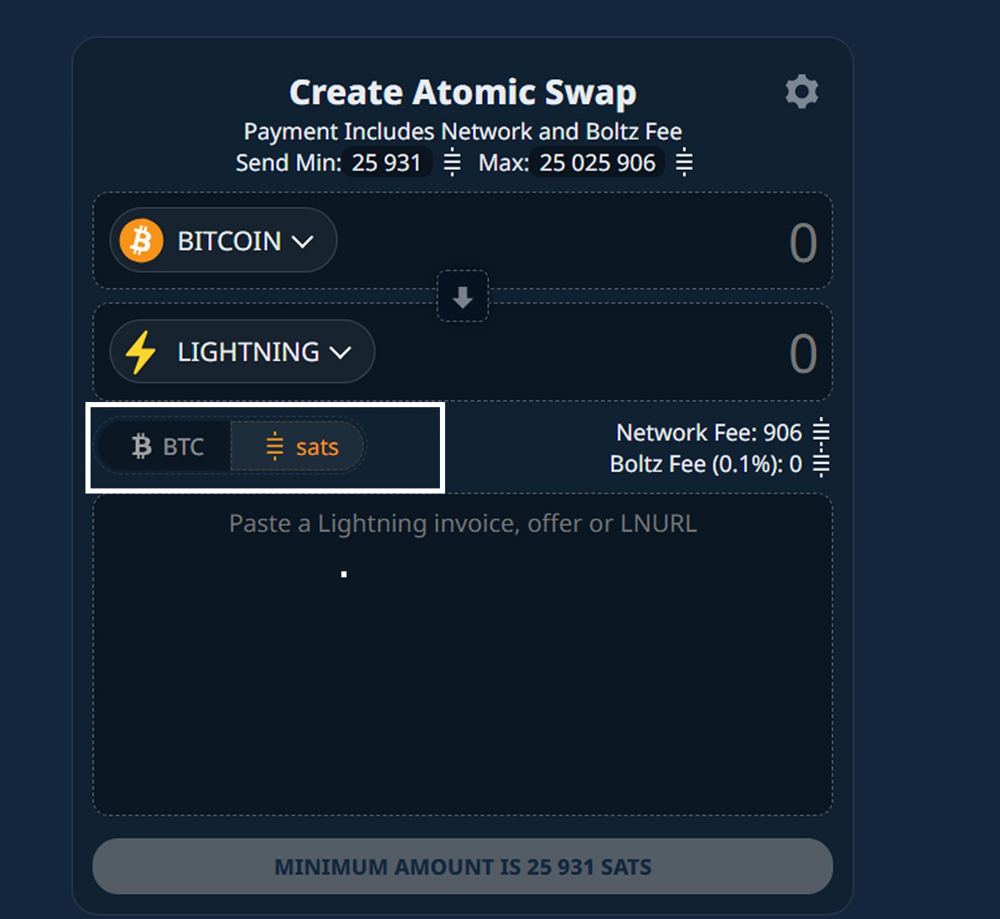

Sau khi hoàn tất các cấu hình cơ bản, hãy chèn số lượng Exchange nguyên tử của bạn, sau đó tạo một Lightning Invoice với số lượng tương đương hoặc chỉ cần chèn LNURL của bạn.

https://planb.network/tutorials/wallet/mobile/aqua-8e6d7dd3-8c03-45cc-90dd-fe3899a7d125

https://planb.network/tutorials/wallet/mobile/blitz-wallet-794bdac4-1af4-49d5-9ea5-abb8228ca196

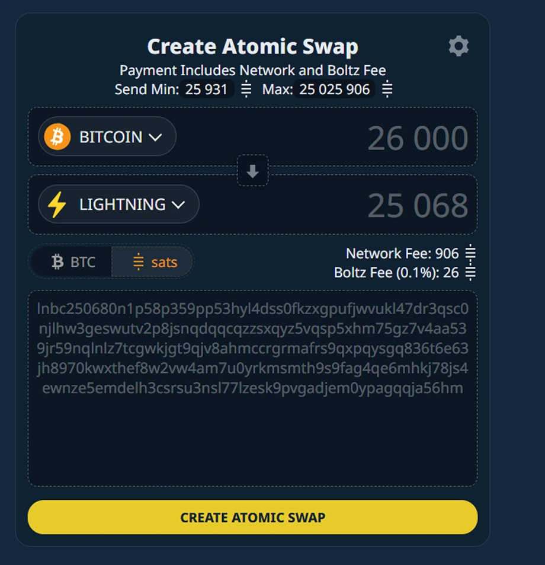

Để đảm bảo an toàn, vui lòng kiểm tra các thông số của Exchange nguyên tử để xuất các khóa sao lưu được liên kết với Exchange của bạn.

Trên biểu tượng **Cài đặt**, tải xuống khóa sao lưu và lưu tệp theo đúng cách.

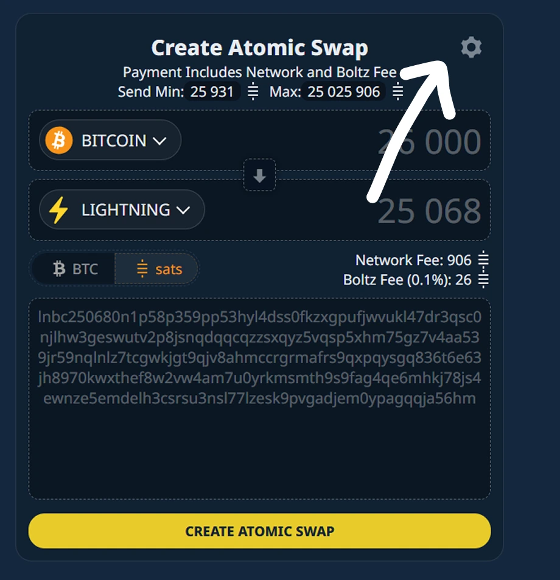

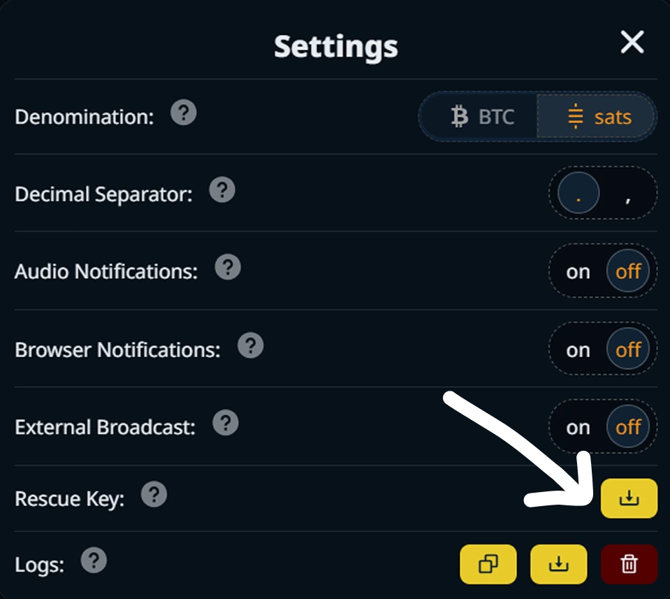

Tệp này chứa 12 từ khóa của danh mục đầu tư liên quan đến các sàn giao dịch nguyên tử của bạn.

Sau đó nhấp vào nút **Tạo Exchange nguyên tử** và tiến hành thanh toán số tiền đã chỉ định.

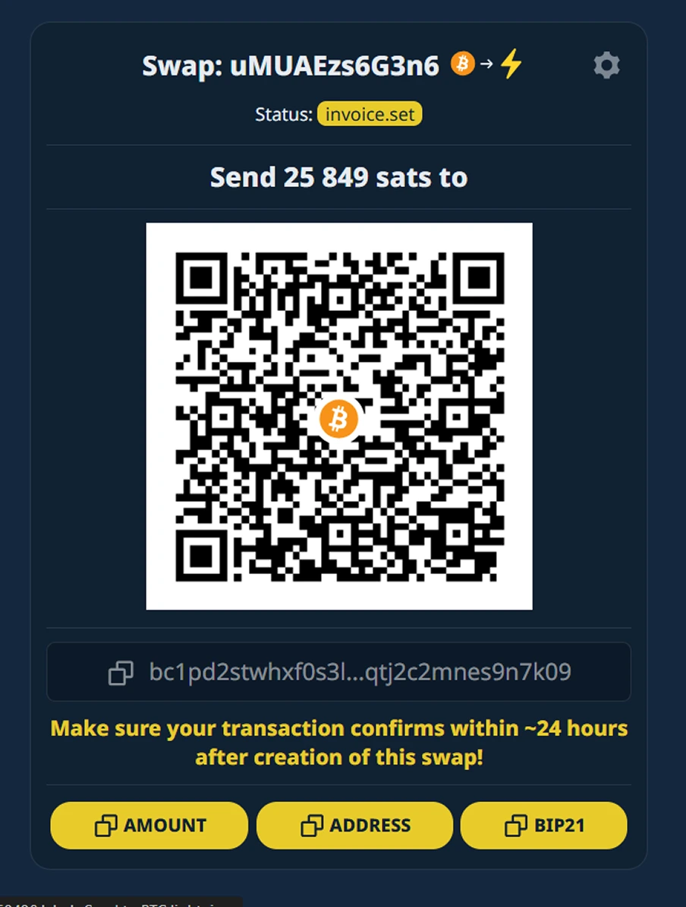

https://planb.network/tutorials/wallet/mobile/blue-wallet-2f4093da-6d03-4f26-8378-b9351d0dbc90

https://planb.network/tutorials/wallet/mobile/blink-7ea5f5a4-e728-4ff9-b3f9-cf20aa6fc2bd

Sau khi thanh toán được thực hiện và xác nhận, bạn sẽ tự động nhận được số tiền tương ứng trên Lightning Wallet của mình.

Trong menu **Hoàn tiền**, hãy tìm lịch sử giao dịch Exchange nguyên tử của bạn để xác định Exchange mà bạn muốn được hoàn tiền. Bạn cũng có thể nhập lịch sử giao dịch đã thực hiện trên một thiết bị khác, ví dụ: sử dụng tệp khóa sao lưu được liên kết với các giao dịch này.

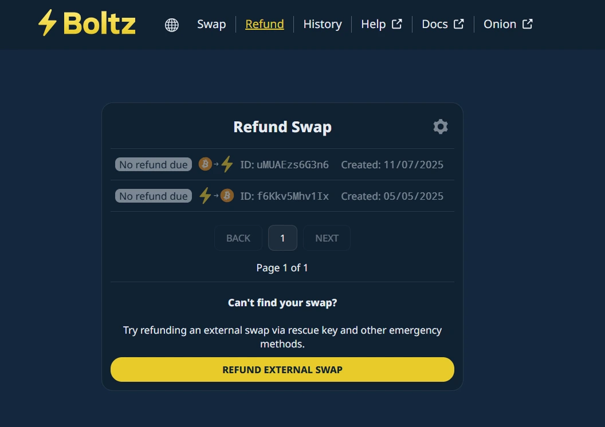

Trong menu **Lịch sử**, bạn có thể tải xuống lịch sử chi tiết hơn về các cuộc trao đổi liên quan đến khóa cứu hộ của mình bằng cách nhấp vào nút **Sao lưu**.

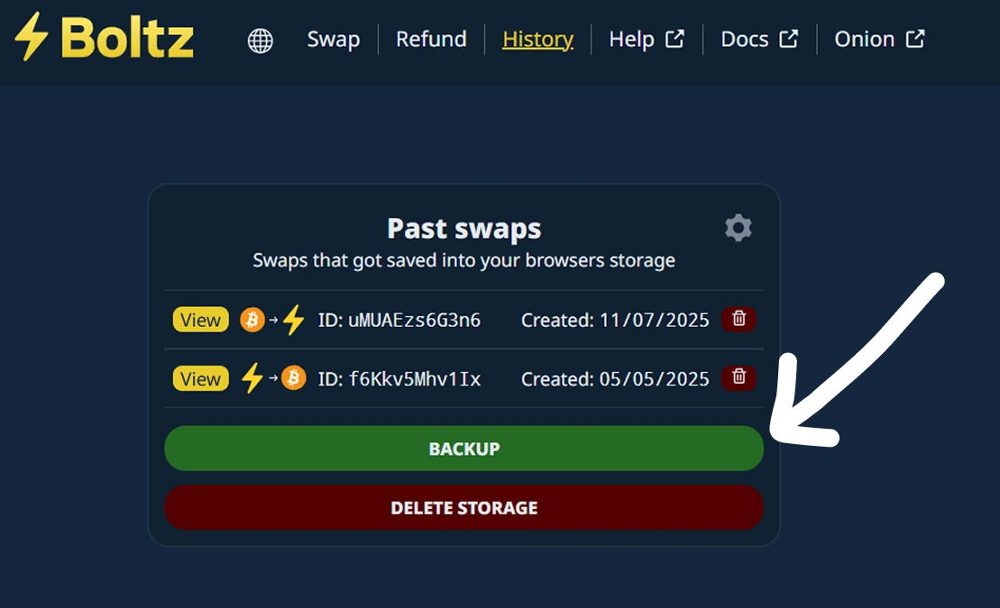

⚠️ Vui lòng không tiết lộ tệp này vì nó chứa tất cả thông tin liên quan đến các giao dịch của bạn và khóa sao lưu được liên kết với các giao dịch này.

Boltz mang đến cho bạn mức độ bảo mật cao nhờ khả năng truy cập thông qua liên kết `.onion` trên mạng Tor. Hãy đảm bảo các trao đổi nguyên tử hoàn toàn ẩn danh bằng cách chọn menu **Onion** sau khi kích hoạt trình duyệt Tor trên trình duyệt của bạn.

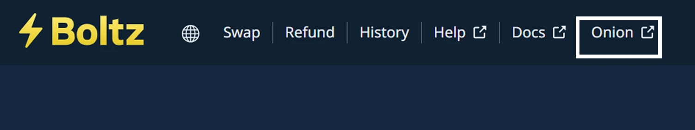

https://planb.network/tutorials/computer-security/communication/tor-browser-a847e83c-31ef-4439-9eac-742b255129bb

Bây giờ bạn đã quen thuộc với Boltz, một nền tảng Exchange độc đáo cho phép khả năng tương tác giữa các lớp khác nhau của hệ sinh thái Bitcoin.