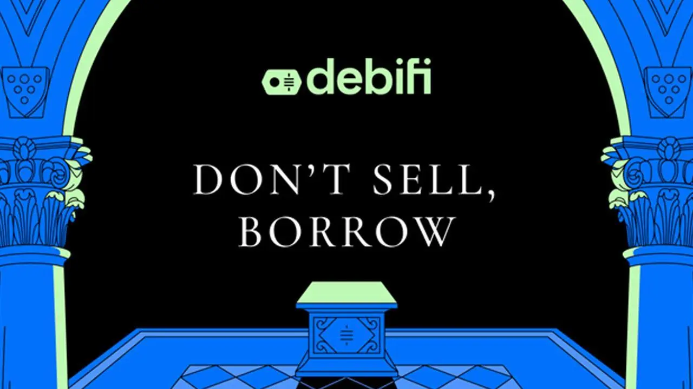

## 簡介

在這個循序漸進的視頻教程中，您將看到如何使用 Debifi 通過 Bitcoin 支持的貸款來釋放您的 BTC 價值。您將學習如何創建帳戶、使用 2FA 保護帳戶安全、瀏覽優惠，甚至在 Multisig 設定中使用 Coldcard Q 以確保您的 Bitcoin 無法再次借出。

無論您是要為商業機會提供資金、處理緊急情況，或只是想要短期的流動資金，但又不想觸發應課稅事件，本指南都會提供您正確的工具。

**註：** 本教學只是純英文的草稿，我們仍需要有人撰寫這方面的詳盡指南。如果您是這樣的人，請透過 [Telegram](https://t.me/PlanBNetwork_ContentBuilder/325) 或 [GitHub](https://github.com/PlanB-Network/Bitcoin-educational-content) 聯絡我們。