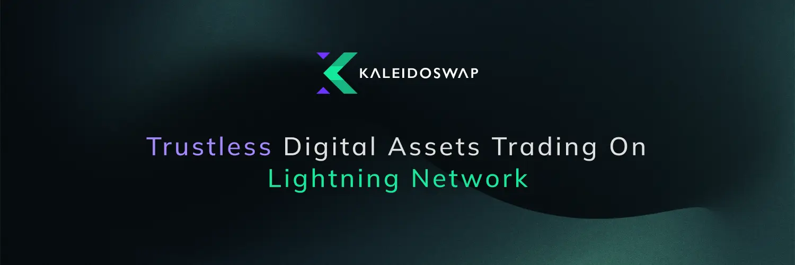

KaleidoSwap es una sofisticada aplicación de escritorio de código abierto que sirve de puente entre el protocolo RGB y el Lightning Network. Sirve de interfaz completa para gestionar nodos RGB Lightning, interactuar con proveedores de servicios RGB Lightning (LSP) a través de la especificación LSPS1 y ejecutar intercambios atómicos de activos RGB.

Como solución sin custodia, KaleidoSwap permite a los usuarios mantener el control total sobre sus claves y datos. Aprovechando el paradigma de validación del lado del cliente de RGB, permite contratos inteligentes privados y escalables sobre Bitcoin. Este tutorial se sumerge en las características avanzadas de KaleidoSwap, guiándole a través de las complejidades de la gestión de UTXO "coloreado", la liquidez del canal para activos específicos, y el modelo de negociación taker-maker, asegurándose de que puede utilizar plenamente este potente protocolo de intercambio descentralizado.

## Instalación

KaleidoSwap proporciona binarios precompilados para los principales sistemas operativos, pero para los usuarios avanzados, la compilación desde el código fuente garantiza la ejecución del código más reciente con sus configuraciones específicas.

### Descargar binarios

Puede descargar la última versión para su sistema operativo desde el [sitio web oficial](https://kaleidoswap.com/) o la [página de versiones de GitHub](https://github.com/kaleidoswap/desktop-app/releases).

### Métodos de instalación

1.  **Windows**: Descargue el instalador `.exe` y ejecútelo.

2.  **macOS**: Descarga el archivo `.dmg`, ábrelo y arrastra KaleidoSwap a tu carpeta de Aplicaciones.

3.  **Linux**: Descarga el archivo `.AppImage` o `.deb` e instálalo/ejecútalo.

## Opciones de configuración del nodo

Cuando inicie KaleidoSwap por primera vez, se le presentará la **Pantalla de Conexión**. Este es el primer paso en la configuración de su entorno.

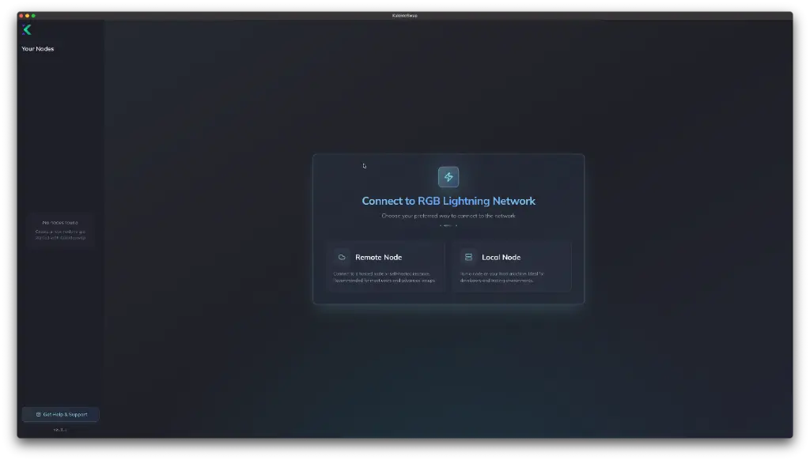

Debe elegir cómo conectarse a la RGB Lightning Network. Esta elección afecta a su nivel de control y privacidad.

### Opción 1: Nodo local (recomendado para la autocustodia)

**Para un completo control y privacidad**, ejecute un nodo directamente en su máquina, vea las ventajas más abajo:

- Custodia propia**: Usted tiene las llaves. Ningún tercero puede congelar tus fondos ni censurar tus transacciones.
- Privacidad**: Tus datos permanecen en tu dispositivo.
- Independencia**: Sin dependencia de proveedores de servicios externos.

Si selecciona **Nodo local**, accederá a la pantalla de configuración donde podrá crear un nuevo wallet o restaurar uno existente.

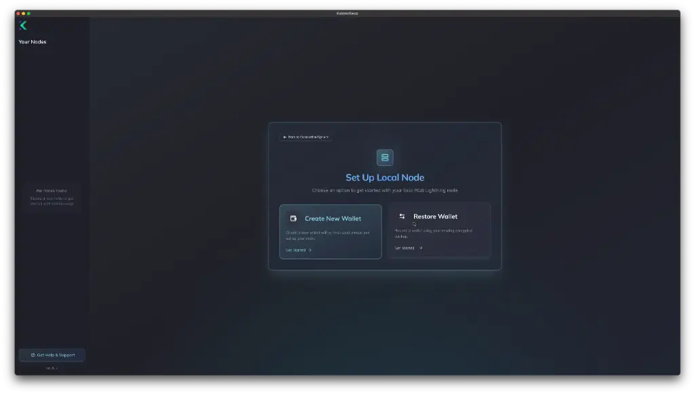

### Opción 2: Nodo remoto

Conectarse a un RGB Lightning Node remoto (autoalojado en un VPS o en un proveedor alojado).

- Ventajas**: Sin uso de recursos locales, disponibilidad 24/7.
- Contrapartida**: Requiere confiar en el host o gestionar un servidor remoto.

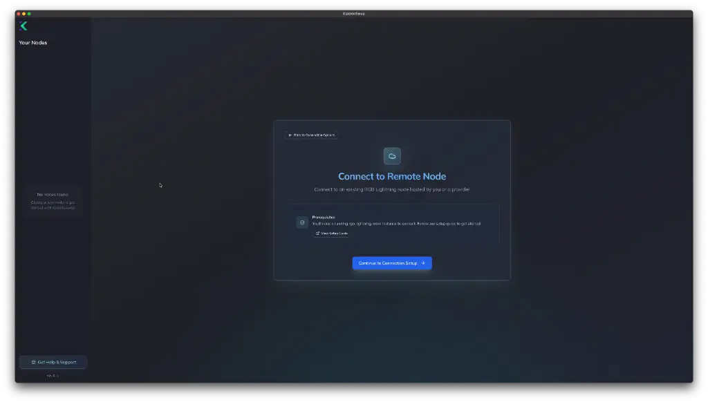

**Recomendamos encarecidamente que ejecute su propio nodo, ya sea localmente (opción 1) o alojando un nodo remoto, para aprovechar al máximo las propiedades de resistencia a la censura de Bitcoin y RGB.

## Creación de una Wallet

KaleidoSwap gestiona tanto activos Bitcoin como RGB. El proceso de creación de wallet inicializa un almacén de claves que asegura tus fondos de on-chain y los estados de tu canal Lightning.

He aquí el proceso detallado:

1. Abre KaleidoSwap y selecciona **Nodo Local**.

2. Haga clic en **Crear nueva Wallet**.

3. **Configuración de la cuenta**: Introduzca un **Nombre de cuenta** y seleccione la **Red** (por ejemplo, Bitcoin Mainnet, Testnet, Signet).

4. **Configuración Avanzada** (Opcional): Si eres un usuario avanzado, puedes configurar puntos finales personalizados de RPC, URLs del Indexador o ajustes del Proxy en "Configuración avanzada".

5. Haga clic en **Continuar**.

6. **Contraseña**: Establece una contraseña segura para encriptar tu archivo wallet localmente.

7. **Frase de recuperación**: Escribe tu frase seed y guárdala en un lugar seguro.

    - Crítico**: Esta frase es necesaria para recuperar sus fondos on-chain y la identidad del nodo.
    - Advertencia**: **Los estados de los canales de rayos no pueden recuperarse completamente sólo desde el seed**. También debe mantener copias de seguridad estáticas del canal (SCB) para recuperar los fondos bloqueados en los canales.

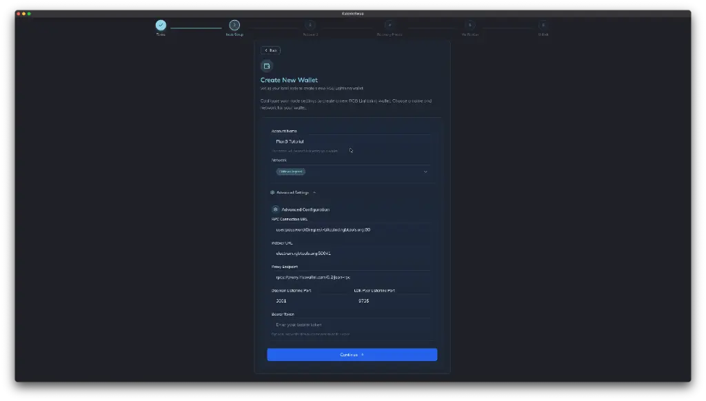

## Cuadro de mandos

Una vez creada su wallet, se le dirigirá al **Panel de control** principal.

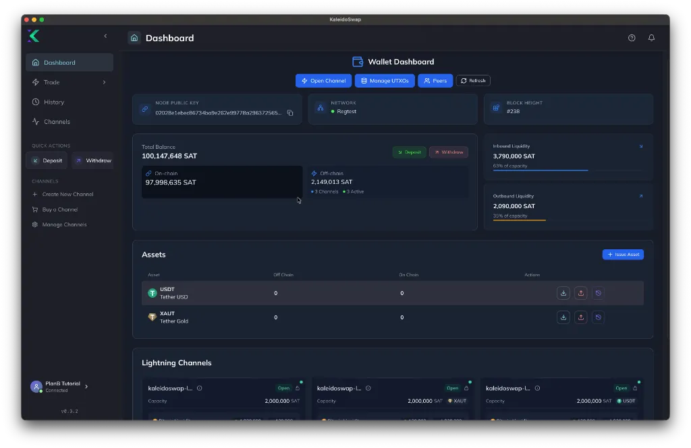

nota: La captura de pantalla anterior muestra un wallet que ya ha sido financiado y tiene canales activos. Una wallet nueva no tendrá saldo ni canales activos hasta que la financie

## Financiación de su Wallet

Para operar con activos RGB, necesita depositar fondos en su wallet. KaleidoSwap permite depositar activos Bitcoin y RGB mediante transacciones on-chain o Lightning Network.

### Depositar Bitcoin

1. Haga clic en **Depósito** en el menú Acciones rápidas.

2. Seleccione **BTC** de la lista de activos.

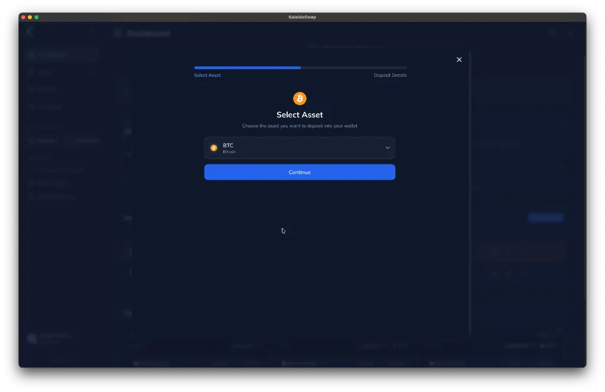

3. Elija su método de depósito: **En cadena** o **Rayo**.

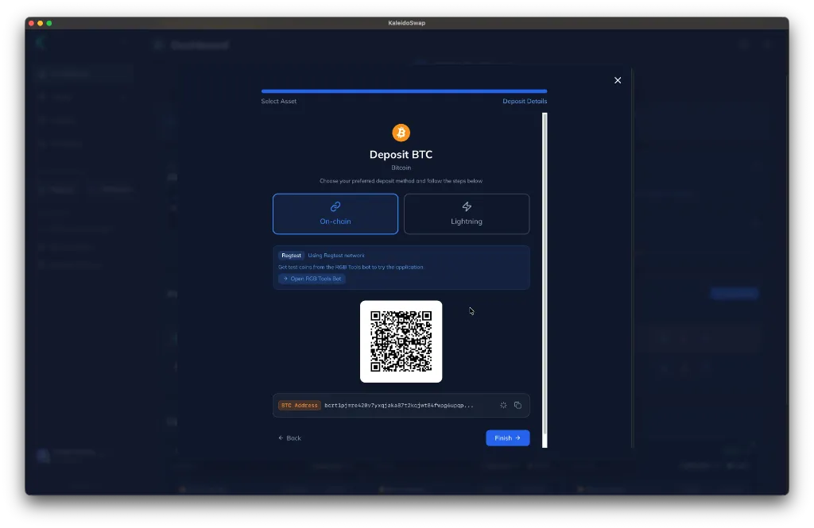

- En cadena**: Escanea el código QR o copia la dirección para enviar Bitcoin desde otro wallet.
- Rayo**: Genera una factura por el importe deseado.

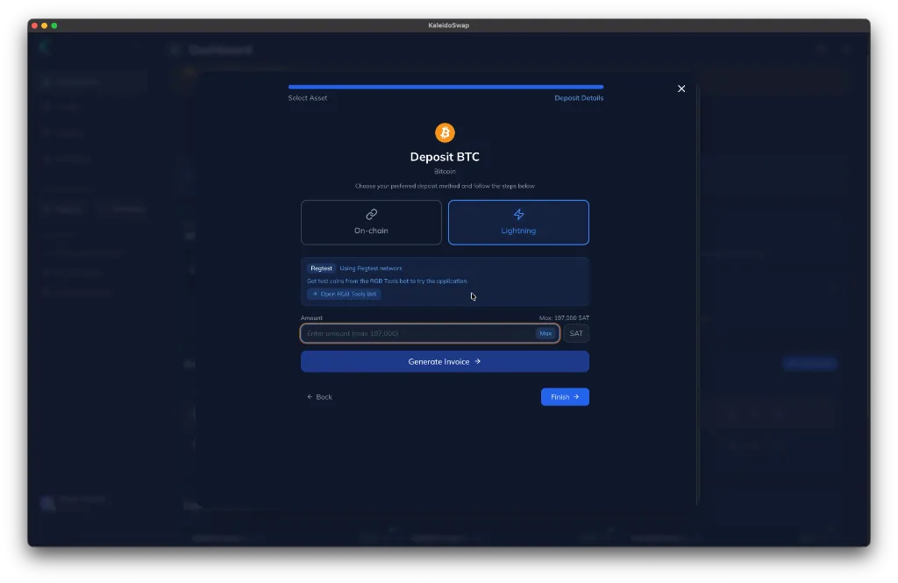

### Depositar activos RGB y UTXOs coloreados

Para recibir activos RGB (como USDT), se necesitan UTXOs específicos disponibles para ser "coloreados" (asignados a un activo).

1. Haga clic en **Depositar** y seleccione el activo RGB (por ejemplo, USDT). **Importante**: Si es la **primera vez** que su nodo recibe este activo específico, **deje vacío el campo ID del activo**. Si introduce un ID para un activo desconocido, el nodo devolverá un error, ya que aún no lo reconoce.

2. Elija **En cadena** o **Rayo**.

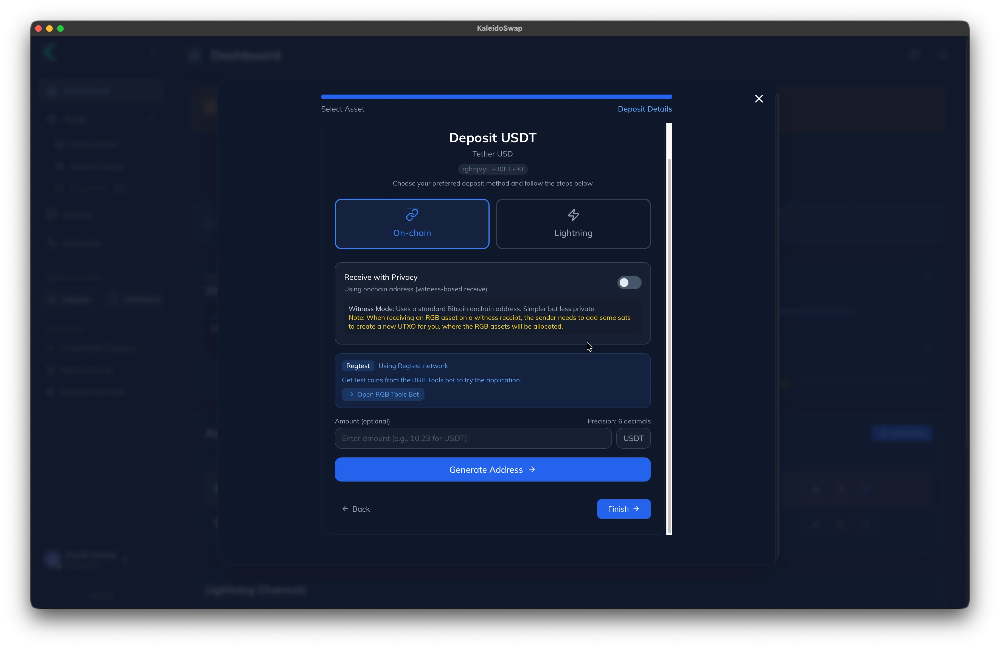

#### Modos de recepción en cadena: Testigo vs. Ciego

Cuando se reciben activos RGB on-chain, dispone de dos modos de privacidad:

- Recepción ciega (recomendada por privacidad)**: Proporcionas un UTXO "blinded" al remitente. Le está pidiendo al remitente que envíe activos a un UTXO existente que usted posee, pero ofusca el identificador real del UTXO. Esto ofrece mayor privacidad.
- Recepción de testigos**: Usted proporciona una dirección Bitcoin estándar. Pides al remitente que cree una *nueva* UTXO para ti enviando los activos a esa dirección. Esto permite que los activos RGB se adjunten directamente a la nueva UTXO creada por la transacción.

#### Depósito relámpago

Para los depósitos Lightning, basta con generate una factura. El activo RGB se le enviará a través de sus canales abiertos.

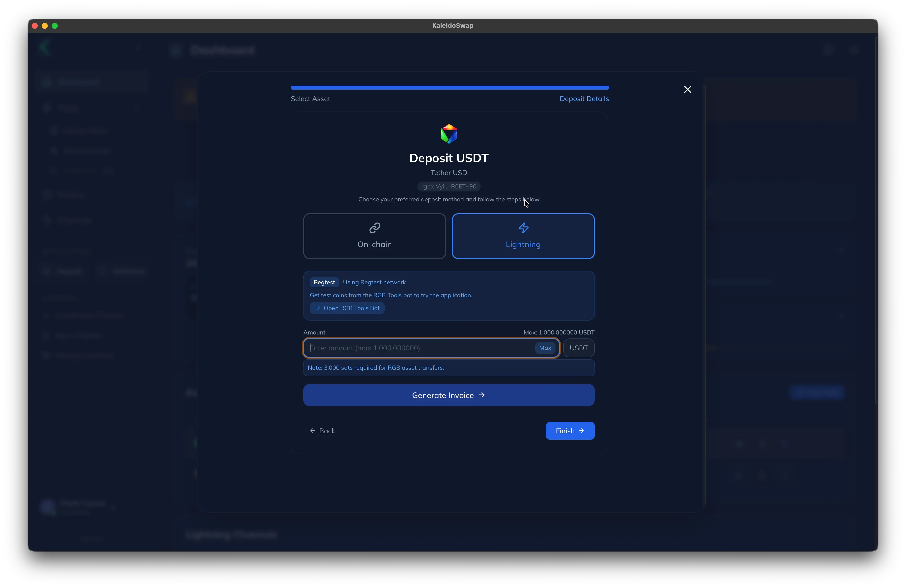

## Abrir canales con activos RGB

Para enrutar activos RGB a través de Lightning Network, necesita un canal con suficiente liquidez y asignación de activos. La forma más sencilla de empezar es **comprar un canal** a un LSP (Lightning Service Provider).

### Comprar un canal de Kaleido LSP

1. Vaya a la pestaña **Canales**. Verás opciones para "Abrir canal" (manual) o "Comprar canal" (LSP).

2. Haga clic en **Comprar canal**.

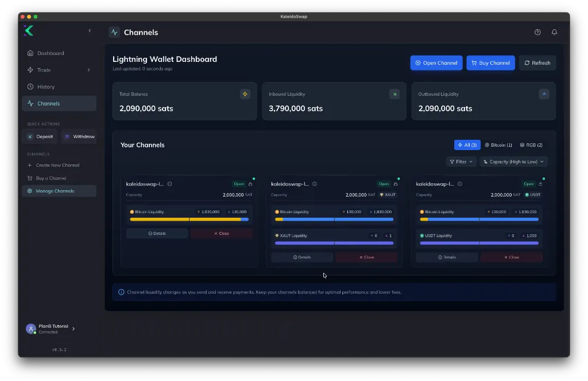

3. **Conectar a LSP**: La aplicación se conectará al LSP predeterminado de Kaleido. Este proveedor ofrece liquidez entrante y admite el enrutamiento de activos RGB.

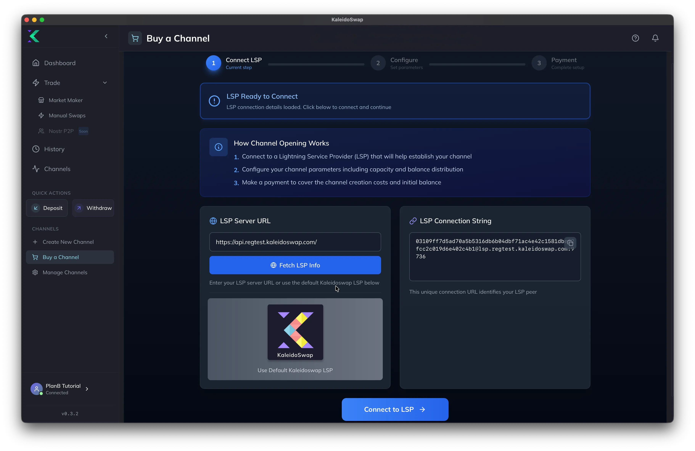

4. **Configurar canal**:

    - Capacidad**: Selecciona la capacidad total de Bitcoin para el canal.
    - Asignación RGB**: Elija el activo RGB (por ejemplo, USDT) que desea poder recibir o enviar. El PSL se asegurará de que el canal esté configurado para admitir este activo.

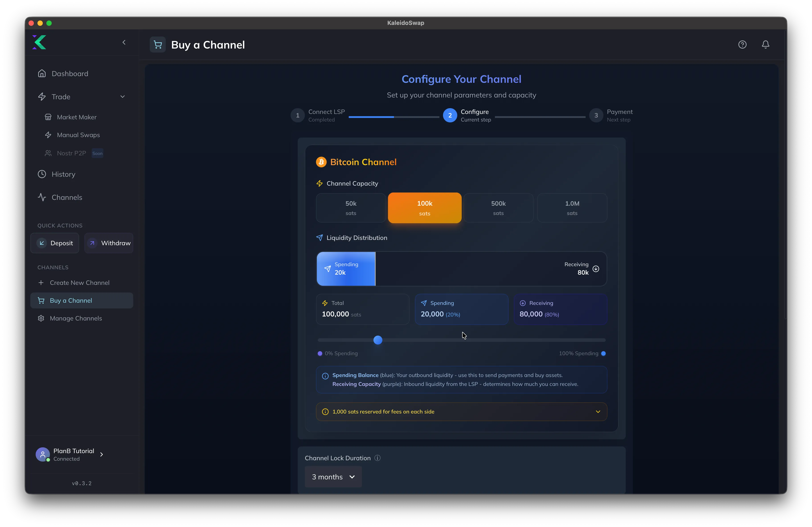

    - Asignación de RGB**: Elija el activo RGB (por ejemplo, USDT) que desea poder recibir o enviar. El PSL se asegurará de que el canal esté configurado para admitir este activo.

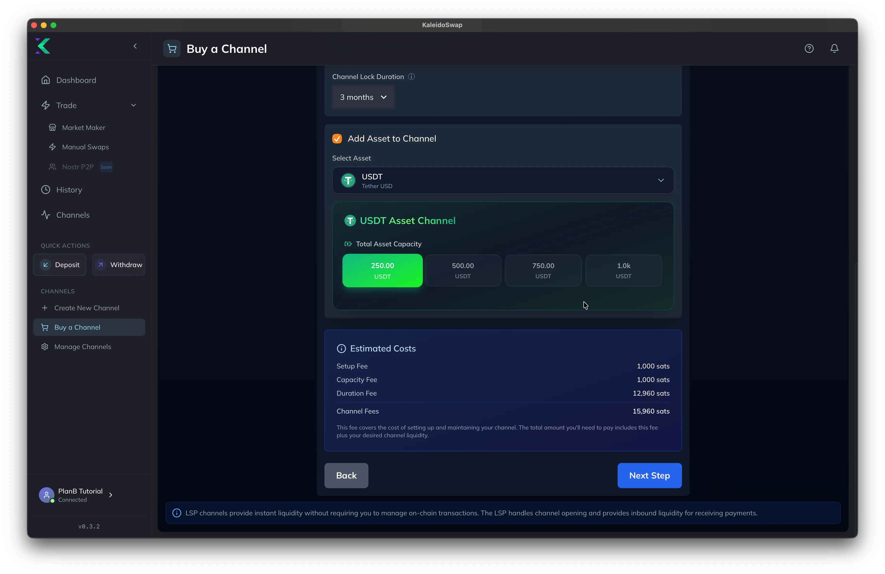

5.  **Pago**: Debes pagar una comisión al PSL por abrir el canal y proporcionar liquidez. Puedes pagar usando **Lightning** o **On-chain** Bitcoin. El pago puede realizarse desde tu wallet interna de KaleidoSwap o desde una wallet externa.

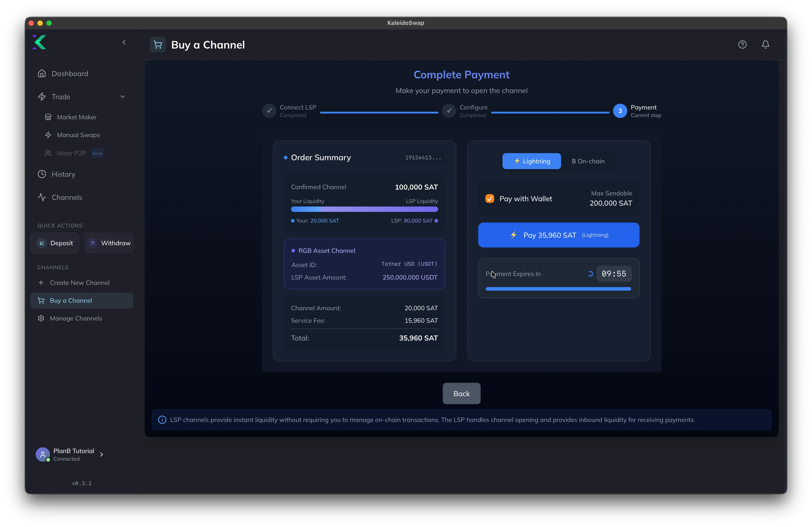

6. Una vez confirmado el pago, el PSL iniciará la transacción de apertura del canal. Verá una pantalla de **Pedido completado**.

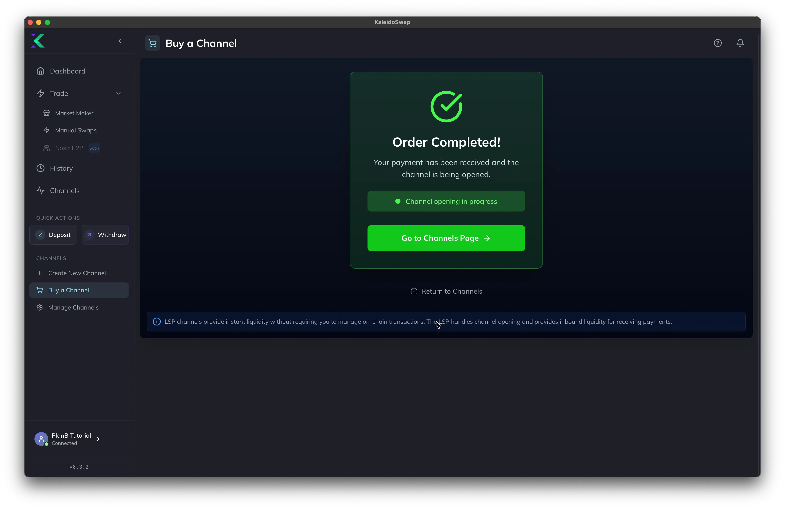

7. Tras la confirmación en la blockchain, su canal estará activo y listo para transferencias RGB.

## Comercio: Modelo tomador-creador

El motor de negociación de KaleidoSwap funciona según un modelo **Taker-Maker**. Puedes intercambiar activos manualmente con un peer o utilizar un Market Maker (LSP).

### Intercambio con un creador de mercado (PSL)

Es la forma más habitual de operar. Usted actúa como **Tomador**, ejecutando órdenes contra la liquidez disponible proporcionada por el PSL (**Maker**).

1. Vaya a la pestaña **Comercio** y seleccione **Formador de mercado**.

2. **Introduzca la cantidad**: Introduzca la cantidad de Bitcoin que desea enviar (o el activo que desea recibir). La interfaz mostrará el tipo de cambio estimado y las comisiones.

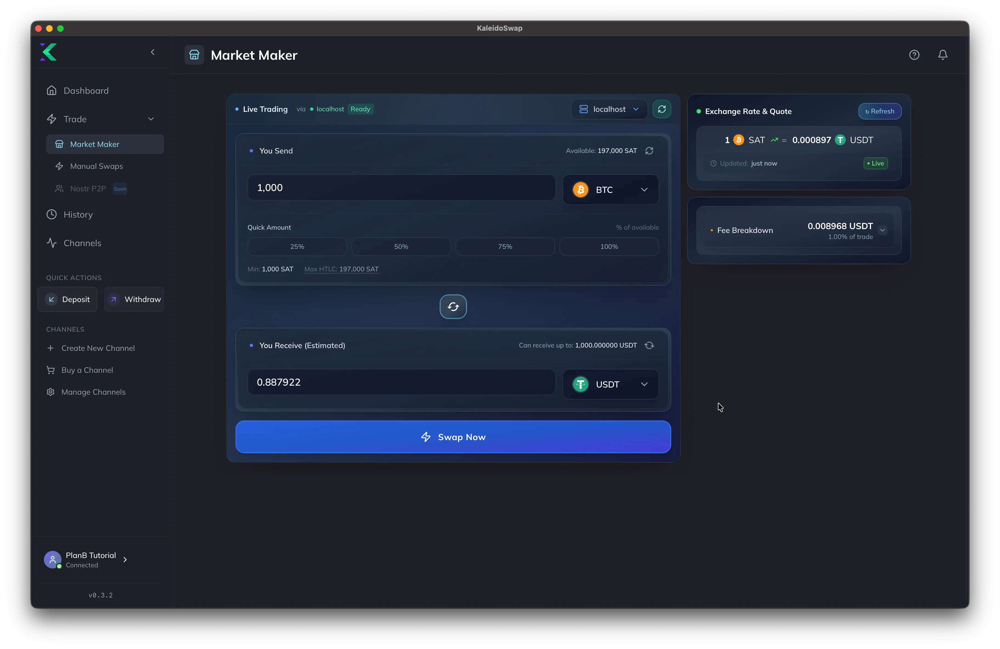

3. **Confirmar Canje**: Revise los detalles, incluido el tipo de cambio y el importe exacto que recibirá. Haga clic en **Confirmar canje**.

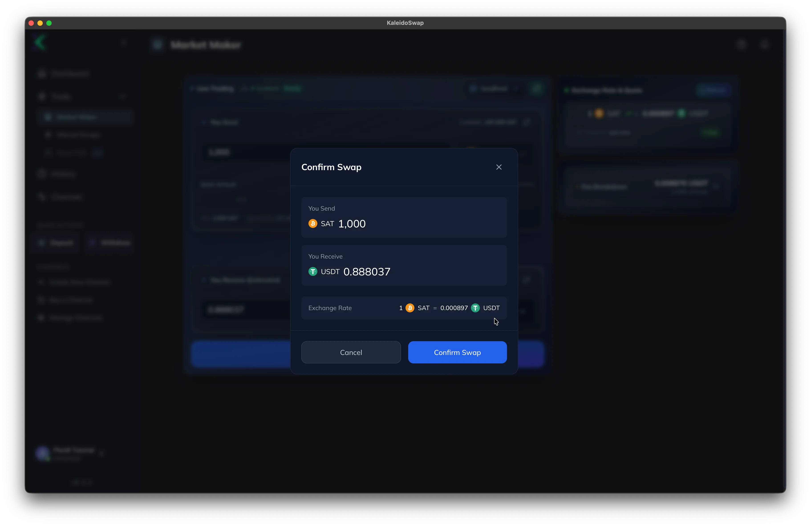

4. **Procesamiento**: El swap se ejecuta atómicamente en la Lightning Network. Verás una pantalla de estado indicando que el swap está pendiente.

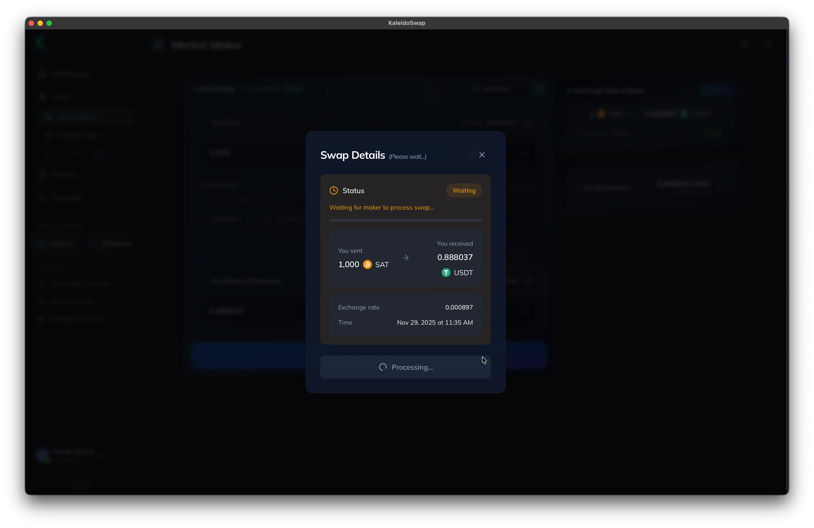

5. **Éxito**: Una vez liquidados los HTLC, el swap se ha completado y los activos están en tu canal.

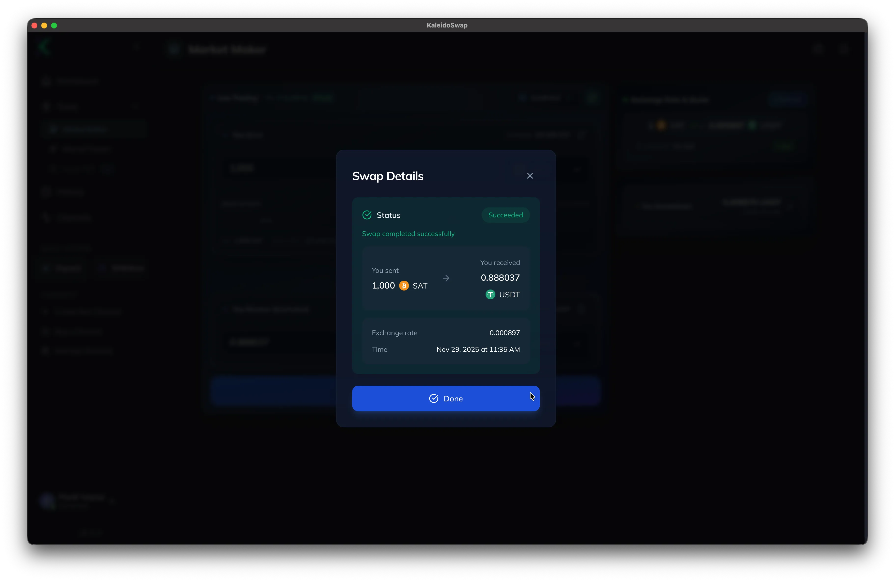

## Desarrollador API

Para los desarrolladores que construyen sobre KaleidoSwap, la aplicación expone un API que soporta:

- RGB LSPS1**: Para servicios de liquidez automatizados.
- Swap API**: Para negociación programática y creación de mercado.
- WebSocket**: Para suscripciones a datos de mercado en tiempo real.

Consulte la [Documentación de API](https://docs.kaleidoswap.com/api/introduction) para conocer todos los extremos y especificaciones.

## Conclusión

KaleidoSwap le permite aprovechar la privacidad y escalabilidad de los activos de RGB en Lightning Network. Si conoce los UTXO de color y la asignación de activos de canal, podrá aprovechar al máximo este potente protocolo de intercambio descentralizado.