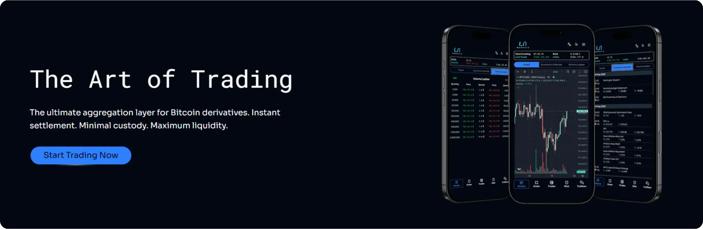

LN Markets पहला ऐसा Bitcoin ट्रेडिंग प्लेटफॉर्म है जो पूरी तरह से लाइटनिंग पर आधारित है। यह आपको बिना KYC के, तुरंत सेटलमेंट और न्यूनतम कस्टडी के साथ, सीधे अपने wallet लाइटनिंग से लीवरेज्ड Bitcoin डेरिवेटिव्स का व्यापार करने की सुविधा देता है। 2020 में लॉन्च किया गया यह प्लेटफॉर्म पारंपरिक एक्सचेंजों की परेशानियों को दूर करता है: पहचान सत्यापन की आवश्यकता नहीं, जमा राशि अवरुद्ध नहीं होती, और blockchain की पुष्टि के लिए प्रतीक्षा करने की आवश्यकता नहीं। आपका wallet लाइटनिंग ही आपका ट्रेडिंग खाता बन जाता है।

## LN Markets क्या है?

LN Markets **फ्यूचर्स** (100 गुना तक लीवरेज वाले पर्पेचुअल कॉन्ट्रैक्ट) और **ऑप्शंस** (कॉल/पुट, जिसमें जोखिम भुगतान किए गए प्रीमियम तक सीमित होता है) की सुविधा प्रदान करता है। यह प्लेटफॉर्म एक लिक्विडिटी एग्रीगेशन लेयर के रूप में कार्य करता है, जो इष्टतम शून्य-स्लिपेज निष्पादन के लिए कई ट्रेडिंग स्थानों को समेकित करता है। आपके फंड केवल आपकी सक्रिय पोजीशन की सटीक अवधि के लिए ही लॉक होते हैं, न कि दिनों या हफ्तों के लिए, जैसा कि पारंपरिक कस्टोडियल खाते में होता है।

### व्यापारिक उत्पाद उपलब्ध हैं

**फ्यूचर्स (परपेचुअल Contract)**

परपेचुअल कॉन्ट्रैक्ट्स बिना किसी समाप्ति तिथि के फ्यूचर्स होते हैं, जो आपको लीवरेज के साथ Bitcoin मूल्य प्रवृत्ति पर सट्टा लगाने में सक्षम बनाते हैं। LN Markets दो मार्जिन प्रबंधन मोड प्रदान करता है:

**पृथक मोड**: प्रत्येक पोजीशन का अपना अलग मार्जिन होता है। केवल इसी पोजीशन में आवंटित धनराशि जोखिम में होती है। यदि पोजीशन लिक्विडेशन मूल्य तक पहुँच जाती है, तो **केवल यही पोजीशन लिक्विडेट होती है**, आपकी अन्य पोजीशन और शेष बैलेंस अप्रभावित रहते हैं। प्रति ट्रेड जोखिम को सख्ती से सीमित करने के लिए आदर्श।

क्रॉस मोड (क्रॉस मार्जिन): मार्जिन आपके सभी खुले पदों के बीच साझा किया जाता है। आपके खाते की कुल शेष राशि सभी पदों के लिए गारंटी के रूप में कार्य करती है। यदि कोई पद घाटे में चला जाता है, तो सिस्टम परिसमापन से बचने के लिए आपकी पूरी उपलब्ध शेष राशि का उपयोग करता है। जोखिम: यदि आपकी कुल शेष राशि समाप्त हो जाती है, तो आपके सभी पद एक साथ परिसमाप्त हो सकते हैं। यह केवल उन अनुभवी व्यापारियों के लिए अनुशंसित है जो पूंजी दक्षता को अधिकतम करना चाहते हैं।

**पद प्रबंधन** :

- लॉन्ग पोजीशन**: आप BTC/USD के बढ़ने पर दांव लगाते हैं। यदि कीमत बढ़ती है, तो आपको लाभ होता है; यदि गिरती है, तो आपको हानि होती है। **उदाहरण**: Bitcoin का मूल्य $100,000 है, आप 10,000 sats के साथ 10 गुना लीवरेज पर लॉन्ग पोजीशन खोलते हैं। यदि Bitcoin बढ़कर $105,000 (+5%) हो जाता है, तो आपकी पोजीशन में 50% (5% × 10) का लाभ होता है, यानी लगभग 5,000 sats का लाभ। यदि Bitcoin गिरकर $95,000 (-5%) हो जाता है, तो आपको 50% की हानि होती है, यानी लगभग 5,000 sats का नुकसान।

- शॉर्ट पोजीशन**: आप BTC/USD के गिरने पर दांव लगाते हैं। यदि कीमत गिरती है, तो आप जीतते हैं; यदि बढ़ती है, तो आप हारते हैं। **उदाहरण**: Bitcoin का मूल्य $100,000 है, आप 10,000 sats के साथ 10 गुना लीवरेज पर शॉर्ट पोजीशन खोलते हैं। यदि Bitcoin गिरकर $95,000 (-5%) हो जाता है, तो आप 50% यानी लगभग 5,000 sats जीतते हैं। यदि Bitcoin बढ़कर $105,000 (+5%) हो जाता है, तो आप 50% हारते हैं।

लीवरेज (100 गुना तक) लाभ और हानि को आनुपातिक रूप से बढ़ाता है। एक **फंडिंग रेट** तंत्र (हर 8 घंटे में आवधिक शुल्क) लॉन्ग और शॉर्ट पोजीशन को संतुलित करता है। आप एक साथ 100 तक फ्यूचर्स पोजीशन का प्रबंधन कर सकते हैं।

**विकल्प**

ऑप्शन एक लॉटरी टिकट की तरह है जिसकी एक समय सीमा होती है। आप Bitcoin की कीमत की दिशा पर दांव लगाने के लिए प्रीमियम का भुगतान करते हैं। इसका मुख्य लाभ यह है कि आप भुगतान किए गए प्रीमियम से अधिक कभी नहीं हार सकते, और किसी भी प्रकार की लिक्विडेशन संभव नहीं है।

- कॉल ऑप्शन (तेजी का दांव)**: आप शर्त लगाते हैं कि Bitcoin की कीमत समाप्ति से पहले स्ट्राइक मूल्य से ऊपर जाएगी। कीमत बढ़ने पर आपको लाभ होगा, और कीमत गिरने पर आपका नुकसान प्रीमियम तक सीमित रहेगा।

- पुट ऑप्शन (मंदी का दांव)**: आप शर्त लगाते हैं कि Bitcoin की कीमत स्ट्राइक मूल्य से नीचे गिर जाएगी। कीमत गिरने पर आपको लाभ होगा, और कीमत बढ़ने पर आपका नुकसान प्रीमियम तक सीमित रहेगा।

- स्ट्रैडल (अस्थिरता पर दांव)**: आप एक साथ कॉल और पुट खरीदते हैं। यदि Bitcoin में किसी भी दिशा में बड़ा बदलाव होता है तो आप जीतते हैं, यदि कीमत स्थिर रहती है तो आप दोनों प्रीमियम खो देते हैं।

सीमा: एक साथ 50 पोजीशन। लिक्विडेशन के डर के बिना लीवरेज्ड ट्रेडिंग शुरू करने के लिए आदर्श।

**sats ↔ sUSD**: अस्थिरता से खुद को बचाने के लिए अपने satoshi को तुरंत सिंथेटिक डॉलर (sUSD) में बदलें, या इसके विपरीत Bitcoin एक्सपोजर को पुनः प्राप्त करने के लिए बदलें।

## प्लेटफ़ॉर्म तक पहुंच और खाता निर्माण

### LN Markets पर जाएं

[lnmarkets.com](https://lnmarkets.com) पर जाएं और "ऐप खोलें" पर क्लिक करें।

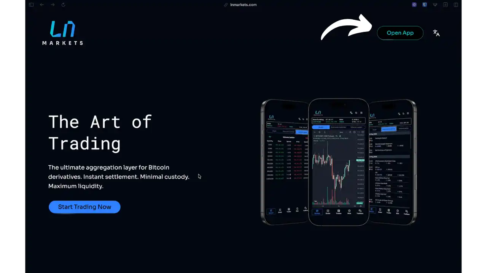

### अपना खाता बनाएं

स्वागत स्क्रीन पर कई कनेक्शन विधियां उपलब्ध हैं:

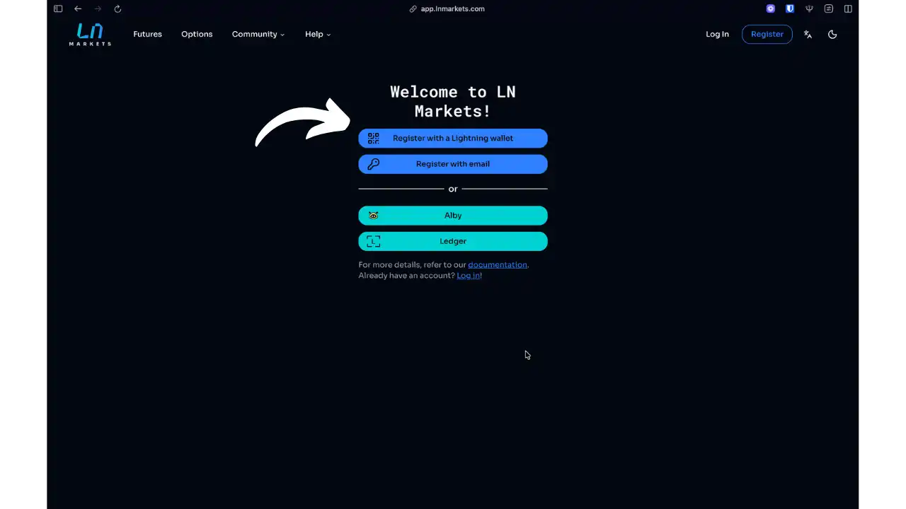

**उपलब्ध विकल्प:**

1. **लाइटनिंग wallet के साथ पंजीकरण करें** (अनुशंसित): Phoenix, Breez, ज़्यूस या ब्लूवॉलेट के साथ LNURL प्रमाणीकरण।

2. **ईमेल से पंजीकरण करें**: क्लासिक खाता (लाइटनिंग अनुभव सीमित करता है)

3. **Alby** या **Ledger**: ब्राउज़र एक्सटेंशन

### लाइटनिंग (LNURL-auth) के माध्यम से कनेक्शन

"Register with a Lightning wallet" पर क्लिक करें। अपने wallet लाइटनिंग डिवाइस से क्यूआर कोड स्कैन करें।

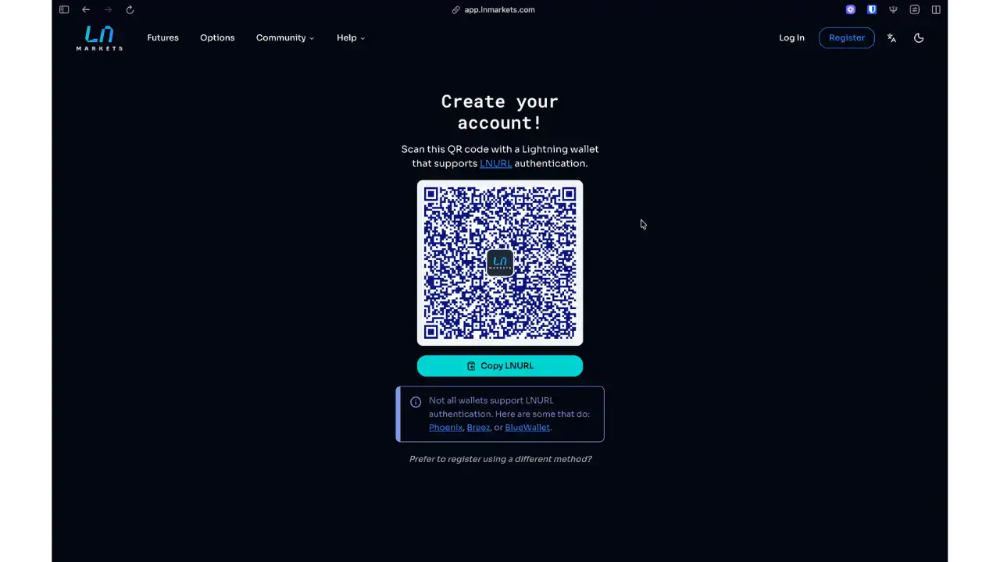

आपका wallet स्वचालित रूप से एक क्रिप्टोग्राफिक अनुरोध पर हस्ताक्षर करता है और आपका खाता ईमेल या पासवर्ड के बिना तुरंत बन जाता है। मजबूत सुरक्षा और पूर्ण गुमनामी।

### प्रारंभिक विन्यास

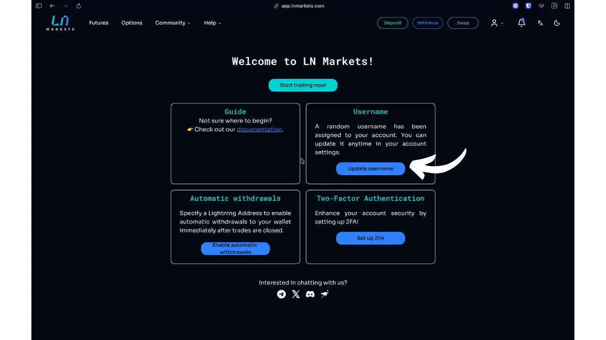

**उपलब्ध पैरामीटर** :

- उपयोगकर्ता नाम**: अपना उपयोगकर्ता नाम व्यक्तिगत बनाएं
- स्वचालित निकासी**: ट्रेड बंद होने के बाद अपने wallet खाते में स्वचालित निकासी सक्रिय करें
- दो-कारक प्रमाणीकरण**: 2FA के साथ बेहतर सुरक्षा
- प्रलेखन**: आधिकारिक संसाधनों तक पहुंचें

## Interface यात्रा

LN Markets इंटरफ़ेस को कई अनुभागों में व्यवस्थित किया गया है, जिन्हें साइड मेनू से एक्सेस किया जा सकता है:

### डैशबोर्ड

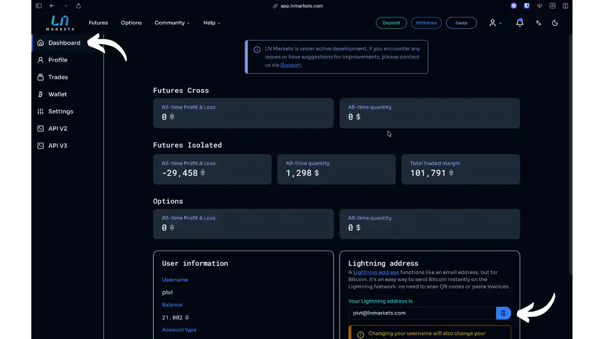

यह उत्पाद प्रकार (फ्यूचर्स क्रॉस, फ्यूचर्स आइसोलेटेड, ऑप्शंस) के अनुसार आपके प्रदर्शन को लाभ और हानि विवरण, कारोबार की मात्रा और आपके व्यक्तिगत Address लाइटनिंग ईमेल पते (जैसे `pivi@lnmarkets.com`) के साथ प्रदर्शित करता है।

### प्रोफ़ाइल

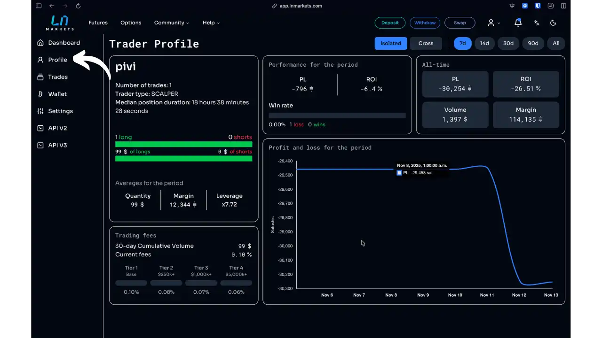

विस्तृत आँकड़े: ट्रेडों की संख्या, ट्रेडर का प्रकार (स्केलपर, आदि), औसत पोजीशन अवधि, लॉन्ग/शॉर्ट विभाजन, जीत दर, औसत (मात्रा, मार्जिन, लीवरेज), और वॉल्यूम के अनुसार प्रगतिशील शुल्क संरचना।

### ट्रेडों

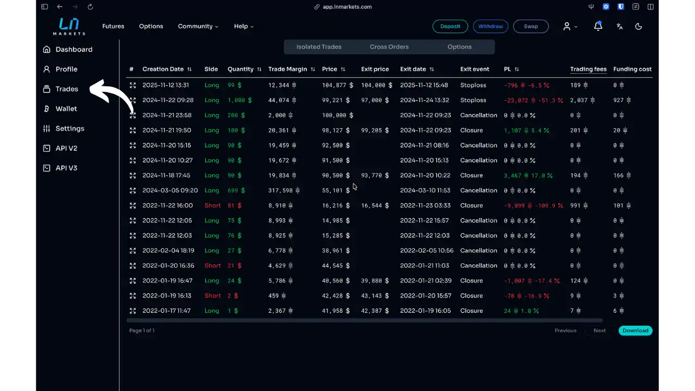

ट्रेड्स टैब में आपकी सभी पोजीशनों का पूरा इतिहास प्रदर्शित होता है, जिसमें सभी महत्वपूर्ण मेट्रिक्स शामिल हैं: निर्माण तिथि, दिशा (लॉन्ग/शॉर्ट), पोजीशन का आकार (मात्रा), प्रतिबद्ध मार्जिन, प्रवेश और निकास मूल्य, वास्तविक लाभ/हानि (P&L) और ट्रेडिंग शुल्क। आप उत्पाद प्रकार (फ्यूचर्स/ऑप्शंस) के अनुसार फ़िल्टर कर सकते हैं और बाहरी विश्लेषण या लेखांकन के लिए अपना डेटा निर्यात कर सकते हैं।

### सेटिंग्स

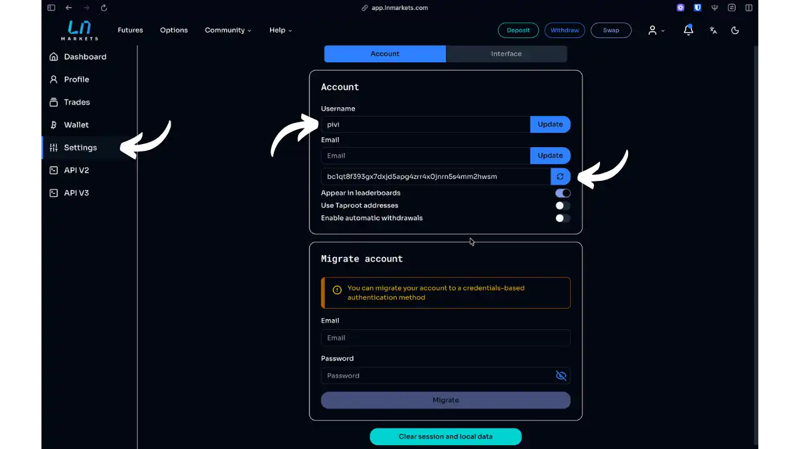

सेटिंग्स टैब में दो टैब हैं: **खाता** और **Interface**।

**खाता** टैब:

संपादन योग्य फ़ील्ड के साथ खाता प्रबंधन:

- उपयोगकर्ता नाम**: "अपडेट" बटन का उपयोग करके अपना उपयोगकर्ता नाम बदलें (उदाहरण के लिए "pivi")
- ईमेल**: अपना ईमेल पता जोड़ें/संपादित करें
- बिटकॉइन जमा करने का पता**: वह बिटकॉइन पता जिसका उपयोग आप on-chain धनराशि जमा करने के लिए कर सकते हैं।

**तीन कॉन्फ़िगरेशन टॉगल** :

- लीडरबोर्ड में शामिल हों**: सार्वजनिक लीडरबोर्ड में शामिल होना है या नहीं, यह चुनें
- Taproot पतों का उपयोग करें**: Bitcoin पतों का उपयोग करें Taproot का उपयोग on-chain जमा/निकासी के लिए करें
- स्वचालित निकासी सक्षम करें**: ट्रेड बंद होने के बाद अपने wallet लाइटनिंग में स्वचालित निकासी सक्रिय करें

**खाता माइग्रेशन**: यह अनुभाग आपको अपने लाइटनिंग खाते को पारंपरिक ईमेल/पासवर्ड प्रमाणीकरण में माइग्रेट करने की अनुमति देता है।

**Session प्रबंधन**: डिस्कनेक्ट करने और स्थानीय ब्राउज़र डेटा को साफ़ करने के लिए "सत्र और स्थानीय डेटा साफ़ करें" बटन का उपयोग करें।

**Interface** टैब:

सात टॉगल की मदद से उपयोगकर्ता अनुभव को अनुकूलित करें:

- ऑर्डर की पुष्टि छोड़ें**: ट्रेड निष्पादन से पहले पुष्टिकरण मॉडल को निष्क्रिय करें (तेज़ ट्रेडिंग)
- टूलटिप्स दिखाएँ**: तत्वों पर माउस ले जाने पर टूलटिप्स प्रदर्शित करें
- निजी मोड (संवेदनशील डेटा छुपाता है)**: इंटरफ़ेस में राशियों और संवेदनशील डेटा को छुपाता है (निजता मोड)
- प्रोफ़ाइल में शुद्ध लाभ/हानि दिखाएँ**: अपनी सार्वजनिक प्रोफ़ाइल में शुद्ध लाभ/हानि दिखाएँ
- इकाई चिह्नों का उपयोग करें**: मुद्रा इकाइयों (sats, $) के लिए चिह्न प्रदर्शित करें
- ध्वनि सूचनाएं सक्षम करें**: ट्रेडिंग इवेंट्स के लिए ध्वनि सूचनाएं सक्रिय करें
- डेस्कटॉप नोटिफिकेशन चालू करें**: ऑपरेटिंग सिस्टम डेस्कटॉप नोटिफिकेशन सक्रिय करें

### Wallet

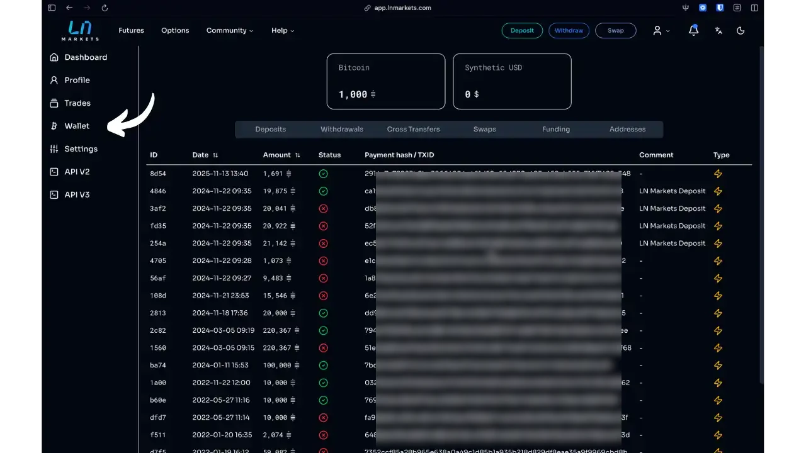

Bitcoin और सिंथेटिक USD बैलेंस, जमा, निकासी, क्रॉस ट्रांसफर, स्वैप, फंडिंग और on chain एड्रेस मैनेजमेंट के इतिहास के साथ।

### API

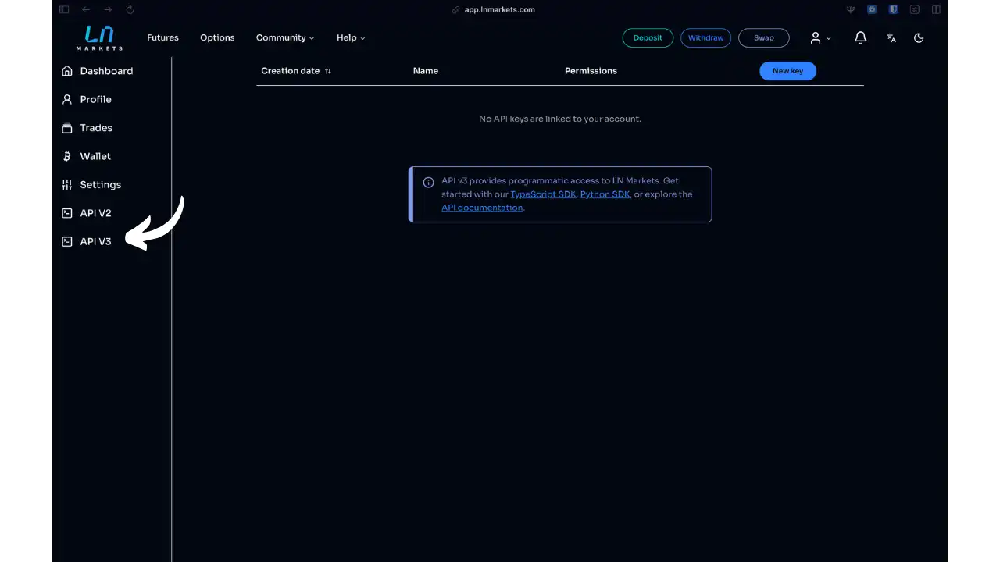

LN Markets, script या बॉट्स के माध्यम से आपके ट्रेडिंग को पूरी तरह से स्वचालित करने के लिए एक संपूर्ण API REST (V2 और V3) प्रदान करता है। आप इंटरफ़ेस से ही अनुकूलित अनुमतियों (केवल पढ़ने, ट्रेडिंग, निकासी) के साथ API कुंजी बना सकते हैं। आसान एकीकरण के लिए आधिकारिक TypeScript और Python SDK उपलब्ध हैं। API V3 का पूरा दस्तावेज़ीकरण [api.lnmarkets.com/v3](https://api.lnmarkets.com/v3) पर उपलब्ध है।

## धनराशि की पहली जमा राशि

"जमा करें" पर क्लिक करें। तीन तरीके उपलब्ध हैं:

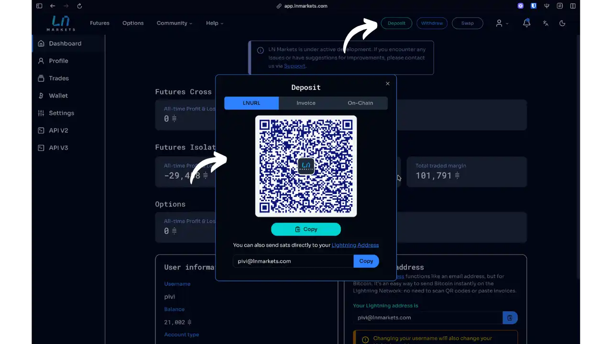

1. **LNURL**: अपने wallet लाइटनिंग डिवाइस से QR कोड स्कैन करें

2. **Invoice**: राशि दर्ज करें और फिर लाइटनिंग इनवॉइस को स्कैन करें

3. **On-Chain**: डिपो Bitcoin on chain

## व्यवहार में व्यापार

### फ्यूचर्स लॉन्ग ट्रेड: लाभ की संभावना पर दांव लगाना

डैशबोर्ड से, "फ्यूचर्स" पर क्लिक करें, फिर "आइसोलेटेड" पर क्लिक करें। लॉन्ग पोजीशन खोलने के लिए **"बाय"** पर क्लिक करें।

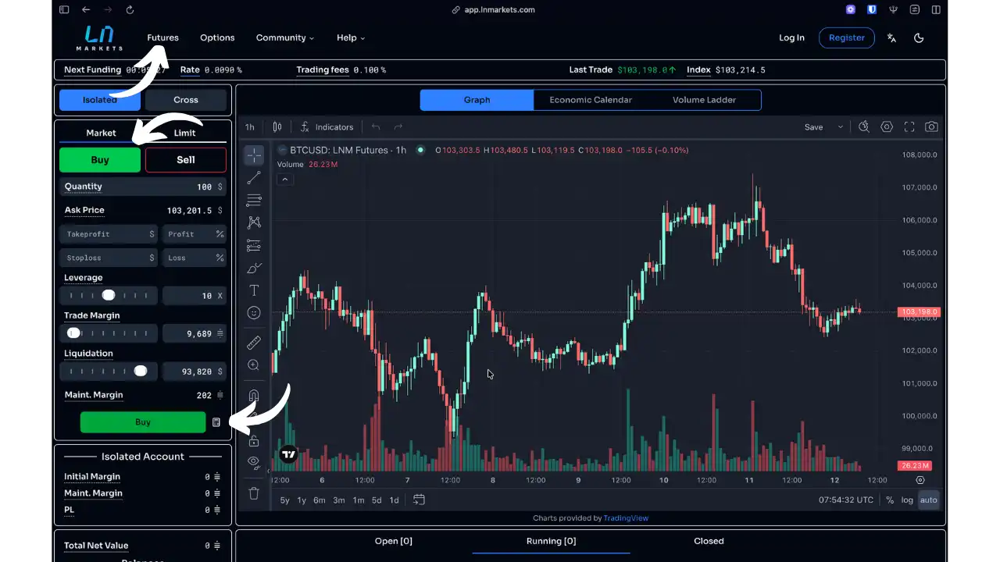

"खरीदें" बटन के बगल में स्थित **कैलकुलेटर** आइकन पर क्लिक करके पोजीशन कैलकुलेटर प्रदर्शित करें:

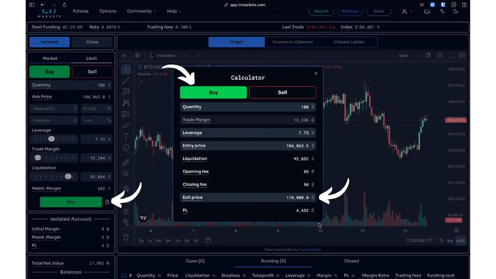

**ठोस उदाहरण** :

- मात्रा**: $100 (पद का आकार)
- व्यापार मार्जिन**: 12.336 sats (प्रतिबद्ध मार्जिन)
- लीवरेज**: 7.73× (प्रत्येक 1% BTC भिन्नता = आपकी पूंजी पर 7.73%)
- प्रवेश शुल्क**: $104,863.5
- Liquidation**: $92,852 (महत्वपूर्ण स्वचालित परिसमापन मूल्य)
- निकास मूल्य**: $110,000 (लाभ की गणना के लिए)
- पीएल** : 4,492 sats (यदि $110,000 पर बाहर निकलें तो लाभ)

**परिदृश्य** :

- वृद्धि +4.9%** ($110,000): +4,492 sats लाभ (+36.4%)
- तटस्थ** ($104,863): -185 sats (केवल शुल्क)
- -11.5% की गिरावट** ($92,852): कुल परिसमापन (-100%)

लेन-देन की पुष्टि करने के लिए "खरीदें" बटन पर क्लिक करें। **दो संभावित स्थितियाँ**:

- यदि आपके खाते में पर्याप्त तरलता** है: तो तुरंत एक पुष्टिकरण मॉडल प्रदर्शित होगा (नीचे दी गई छवि देखें)। तुरंत ट्रेड करने के लिए "हां" पर क्लिक करें।

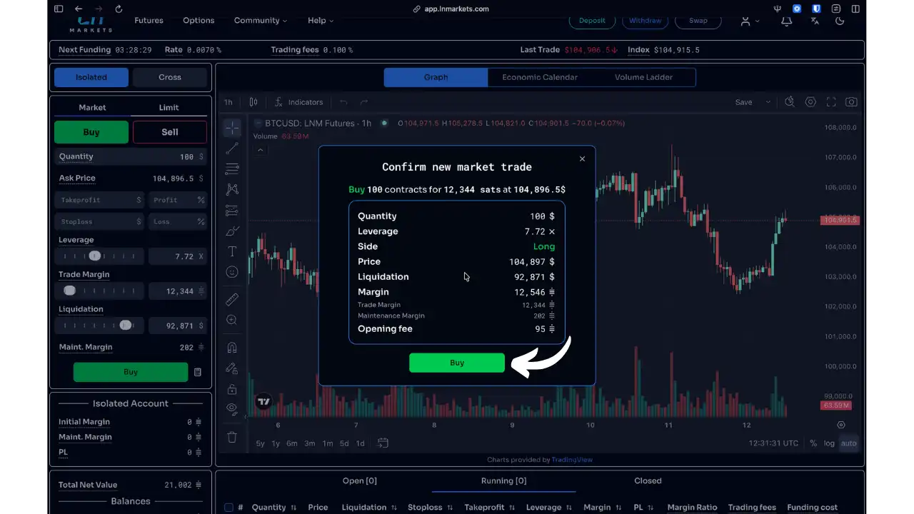

- यदि आपके पास पर्याप्त नकदी नहीं है**: तो इसके बजाय एक लाइटनिंग क्यूआर कोड प्रदर्शित होगा। आवश्यक मार्जिन का भुगतान करने के लिए इसे अपने wallet लाइटनिंग कार्ड से स्कैन करें। भुगतान प्राप्त होने पर ट्रेड स्वतः खुल जाएगा।

### ट्रेड फ्यूचर्स शॉर्ट: गिरावट पर दांव लगाना

शॉर्ट पोजीशन खोलने के लिए **"बेचें"** पर क्लिक करें (कीमत गिरने पर आपको लाभ होगा)। अपनी पोजीशन निर्धारित करने के लिए कैलकुलेटर आइकन से कैलकुलेटर खोलें:

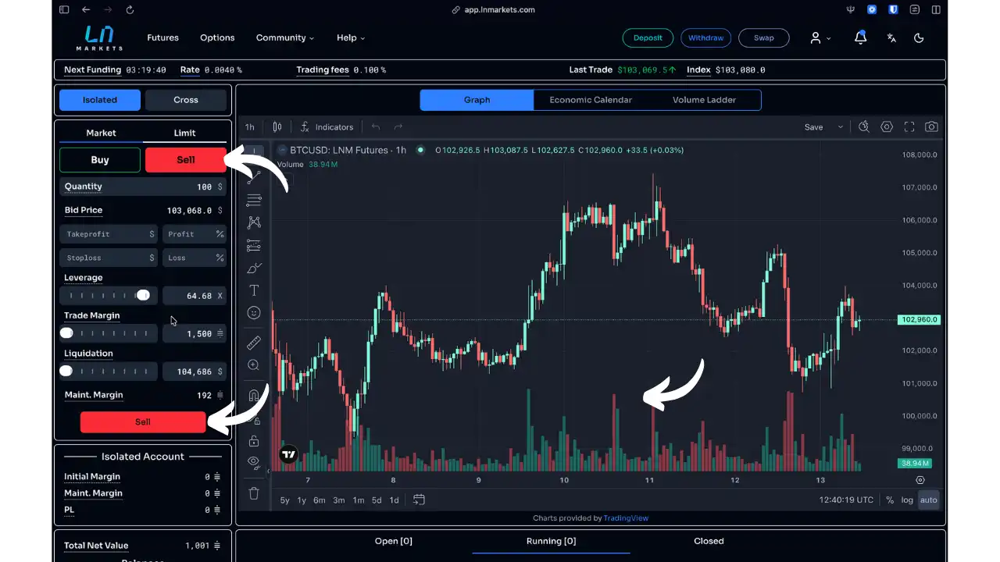

पुष्टि करने के लिए "बेचें" पर क्लिक करें। लॉन्ग पोजीशन के लिए, **दो संभावित स्थितियाँ हैं**:

- यदि आपके पास पर्याप्त नकदी है**: सीधे पुष्टिकरण मोड में, "हाँ" पर क्लिक करें
- यदि आपके पास पर्याप्त नकदी नहीं है**: एक लाइटनिंग क्यूआर कोड प्रदर्शित होगा (नीचे दी गई छवि)। आवश्यक राशि का भुगतान करने के लिए इसे अपने wallet लाइटनिंग कार्ड से स्कैन करें।

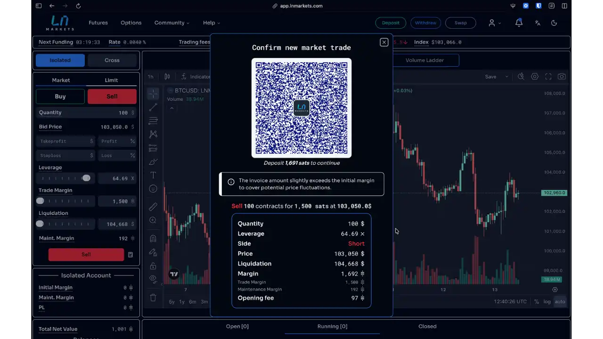

लाइटनिंग पेमेंट प्राप्त होते ही, आपकी शॉर्ट पोजीशन अपने आप खुल जाएगी। फिर आप इसे ट्रेडिंग इंटरफेस से मैनेज कर सकते हैं।

#### किसी पद को बंद करना

अपनी पोजीशन (लॉन्ग या शॉर्ट) बंद करने के लिए, मैनेजमेंट इंटरफेस के निचले दाएं कोने में स्थित **छोटे क्रॉस** पर क्लिक करें:

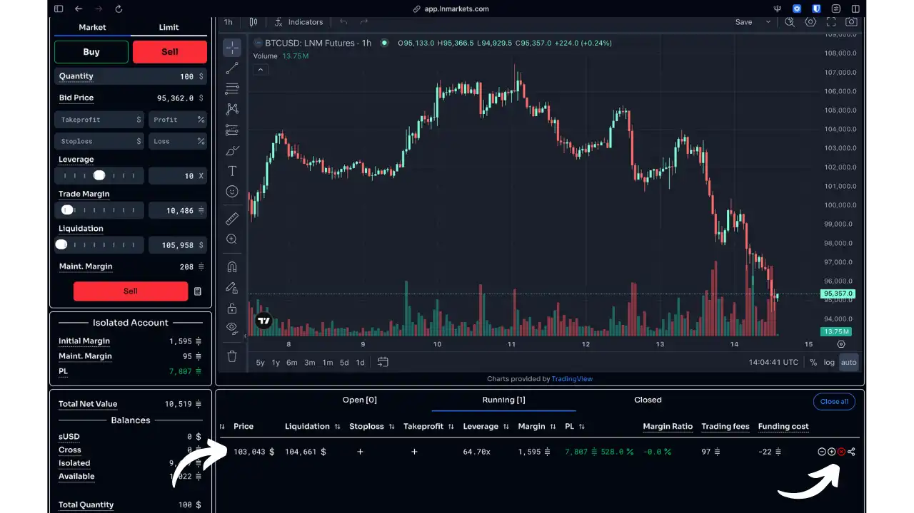

ट्रेड बंद होने की पुष्टि करने के लिए एक पुष्टिकरण डायलॉग बॉक्स प्रदर्शित होता है:

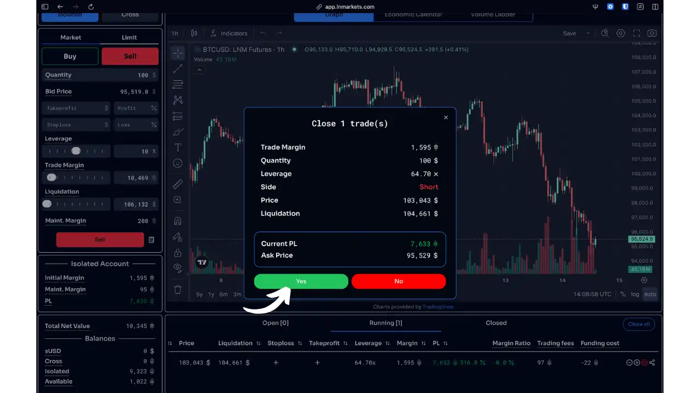

यह मॉडल आपके वर्तमान लाभ-हानि (P&L) को प्रदर्शित करता है। बंद करने के लिए "हाँ" पर क्लिक करें। शेष राशि लाइटनिंग के माध्यम से आपके Wallet खाते में तुरंत जुड़ जाएगी (लाभ) या घट जाएगी (हानि)।

### ट्रेड ऑप्शंस कॉल: खरीदने का सशर्त अधिकार

ऑप्शंस में जोखिम केवल भुगतान किए गए प्रीमियम तक ही सीमित होता है, और इन्हें बेचा नहीं जा सकता। कॉल ऑप्शंस आपको समाप्ति से पहले स्ट्राइक प्राइस पर Bitcoin खरीदने का अधिकार (बाध्यता नहीं) देता है। फ्यूचर्स के विपरीत, आप निवेश किए गए प्रीमियम से अधिक कभी नहीं खो सकते।

डैशबोर्ड से, "विकल्प" पर क्लिक करें, फिर "कॉल" टैब का चयन करें।

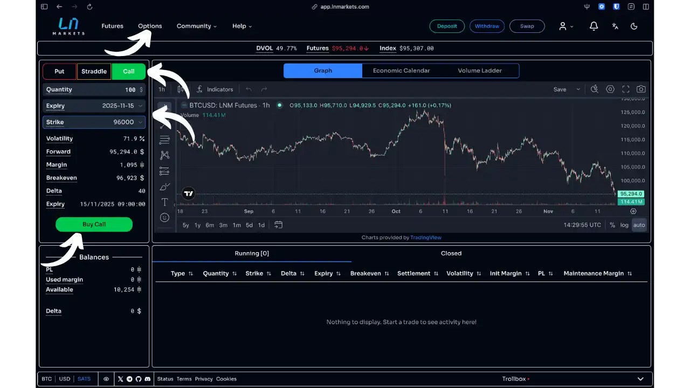

निम्नलिखित मापदंडों के साथ अपना ट्रेड कॉन्फ़िगर करें:

- मात्रा**: $100 (आपके अनुबंध का आकार)
- समाप्ति तिथि**: 2025-11-15 (समाप्ति तिथि)
- स्ट्राइक**: $96,000 (लक्ष्य मूल्य)

अन्य फ़ील्ड की गणना स्वचालित रूप से की जाती है:

- मार्जिन**: 1.045 sats (देय प्रीमियम, आपका निवेश)
- ब्रेकइवन**: $96,923 (अपनी हिस्सेदारी वापस पाने की कीमत)
- डेल्टा**: 40 (Bitcoin मूल्य संवेदनशीलता)

**अपनी जीत की गणना कैसे करें?**

आपका लाभ समाप्ति के समय Bitcoin की कीमत पर निर्भर करता है। सूत्र: **(BTC की कीमत - स्ट्राइक) × Contract का आकार - भुगतान किया गया प्रीमियम**।

**ठोस उदाहरण** :

- Bitcoin की कीमत $96,000** (वर्तमान मूल्य): आंतरिक मूल्य = $0. **हानि: -1.045 sats** (आपको प्रीमियम का नुकसान होगा)

- Bitcoin का मूल्य $97,000**: आंतरिक मूल्य = (97,000 - 96,000) × 0.00105 BTC = $1.05। sats में परिवर्तित करने पर ≈ 2,175 sats प्राप्त होता है। **लाभ: 2.175 - 1.045 = +1.130 sats** (+108% लाभ)

- Bitcoin का मूल्य $98,000**: आंतरिक मूल्य = $2,000 ≈ 3,224 sats. **लाभ: +2,179 sats** (+208% लाभ)

- Bitcoin का मूल्य $100,000**: आंतरिक मूल्य = $4,000 ≈ 5,263 sats. **लाभ: +4,218 sats** (+403% लाभ)

- Bitcoin का मूल्य $96,000 से कम होने पर**: विकल्प निरर्थक हो जाता है। **सीमित हानि: -1,045 sats**, परिसमापन संभव नहीं है।

"बाय कॉल" पर क्लिक करें। एक पुष्टिकरण डायलॉग बॉक्स दिखाई देगा:

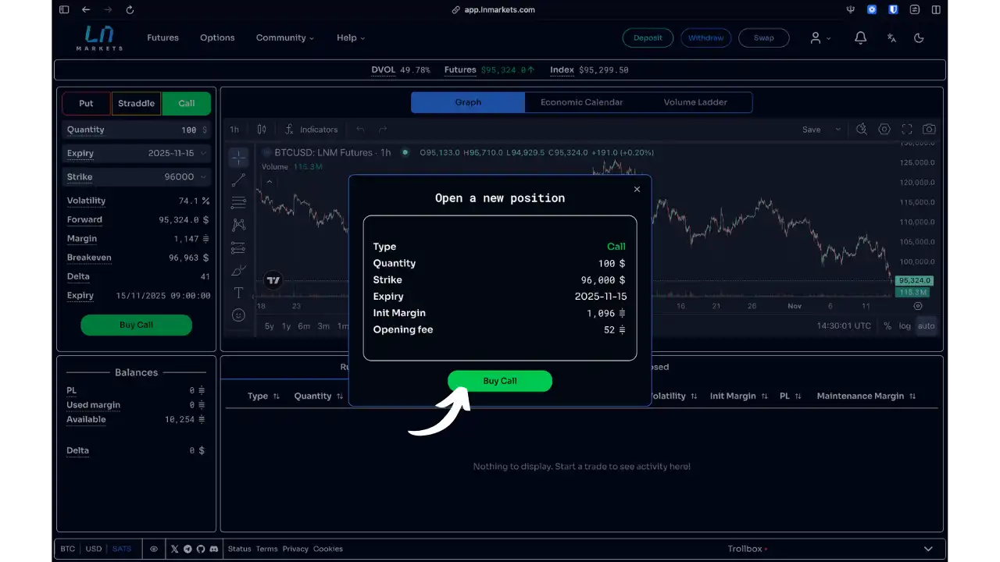

पुष्टि करने के लिए दोबारा "बाय कॉल" पर क्लिक करें। यह विकल्प "रनिंग ऑप्शंस" में दिखाई देगा। समाप्ति पर, LN Markets स्वचालित रूप से आंतरिक मूल्य की गणना करेगा और आपके लाभ/हानि को समायोजित करेगा।

**पुट ऑप्शन पर ध्यान दें**: इसका संचालन कॉल ऑप्शन के समान ही होता है, लेकिन विपरीत क्रम में। पुट ऑप्शन में, आप Bitcoin की कीमत में गिरावट पर दांव लगाते हैं। यदि Bitcoin आपके स्ट्राइक मूल्य से नीचे गिरता है, तो आप लाभ कमाते हैं; यदि यह स्ट्राइक मूल्य से ऊपर रहता है, तो आप केवल भुगतान किया गया प्रीमियम खो देते हैं। लाभ की गणना का तरीका भी यही है: **(स्ट्राइक मूल्य - BTC की कीमत) × Contract का आकार - भुगतान किया गया प्रीमियम**।

### लाइटनिंग फंड निकासी

"निकासी" पर क्लिक करें:

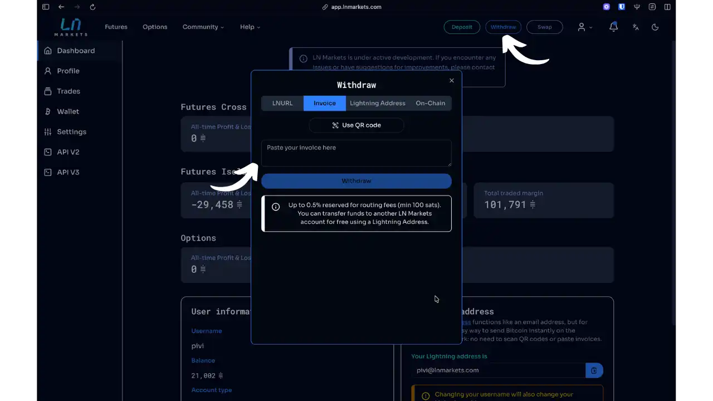

**तरीके** : LNURL, Invoice, लाइटनिंग Address, On-Chain.

**Invoice प्रक्रिया** :

1. अपने wallet से लाइटनिंग इनवॉइस जनरेट करें

2. इनवॉइस की प्रतिलिपि बनाएं (जो `lnbc...` से शुरू होता है)

3. इसे LN Markets फ़ील्ड में पेस्ट करें

4. निकासी की पुष्टि करें

5. आपका wallet 1-3 सेकंड में क्रेडिट हो जाएगा।

लाइटनिंग निकासी पर कोई शुल्क नहीं लगता, केवल न्यूनतम रूटिंग लागत (व्यवहार में <0.1%) लगती है।

## जोखिम और सर्वोत्तम प्रथाएं

**मुख्य जोखिम** :

- पूर्ण परिसमापन**: उच्च लीवरेज मिनटों में 100% मार्जिन को समाप्त कर सकता है
- प्रायोगिक सेवा**: अल्फा चरण, तकनीकी अनिश्चितताएं
- प्रतिपक्ष जोखिम**: प्लेटफ़ॉर्म एकल प्रतिपक्ष बना रहता है

**सर्वोत्तम प्रथाएं** :

1. **पूंजी प्रबंधन**: अपनी प्रोफ़ाइल के अनुरूप जोखिम प्रबंधन रणनीति अपनाएं। उदाहरण के लिए: अपनी कुल परिसंपत्तियों का 5% लीवरेज्ड ट्रेडिंग में लगाएं, फिर प्रति ट्रेड इस पूंजी का अधिकतम 1% जोखिम लें (जैसे: 1 BTC परिसंपत्ति → 5M sats ट्रेड करने के लिए → प्रति पोजीशन अधिकतम 50k sats का जोखिम)।

2. **व्यवस्थित स्टॉप-लॉस**: प्रति ट्रेड अपने नुकसान को सीमित करने के लिए स्टॉप-लॉस सेट करें। उदाहरण के लिए, 1% जोखिम नियम के साथ, लगातार 10 नुकसान वाले ट्रेड भी आपकी ट्रेडिंग पूंजी का केवल 10% ही दर्शाते हैं।

3. **छोटे स्तर से शुरू करें**: अपनी पूंजी प्रबंधन रणनीति लागू करने से पहले कार्यप्रणाली को समझने के लिए कुछ हज़ार sats मशीनों के साथ परीक्षण करें।

4. **नियमित रूप से अपना मुनाफा निकालें**: अपने मुख्य wallet खाते में अपना मुनाफा सुरक्षित रखें, और प्लेटफ़ॉर्म पर केवल सक्रिय ट्रेडिंग पूंजी ही रहने दें।

5. लीवरेज से सावधान रहें: 20 गुना से अधिक लीवरेज से बचें, जब तक कि आप परिसमापन जोखिमों से पूरी तरह अवगत न हों।

**लागत**: लाइटनिंग डिपॉजिट/निकासी पर कोई शुल्क नहीं, स्प्रेड लगभग 0.1% प्रति ट्रेड (वॉल्यूम के आधार पर 0.06% तक गिर सकता है)।

## लाभ और सीमाएँ

**लाभ** :

- गैर-अभिरक्षित (व्यापार अवधि को छोड़कर पूर्ण नियंत्रण)
- केवाईसी-मुक्त (लाइटनिंग/Nostr के माध्यम से गुमनामी)
- त्वरित निपटान (सेकंडों में जमा/निकासी)
- तरलता एकत्रीकरण के साथ शून्य-स्लिप निष्पादन
- API सार्वजनिक और Nostr समर्थन

**सीमाएँ** :

- सेवा अल्फा (संभावित विकास)
- Binance/Deribit की तुलना में कम तरलता
- अमेरिकी निवासियों के लिए प्रतिबंधित

## निष्कर्ष

LN Markets, Bitcoin ट्रेडिंग का एक महत्वपूर्ण विकास है, जिसमें Lightning Network को मूल रूप से एकीकृत करके उपयोगकर्ताओं को नियंत्रण वापस दिया गया है। समझदार बिटकॉइन निवेशकों के लिए, जो अपनी संप्रभुता से समझौता किए बिना सट्टा लगाना चाहते हैं, यह पारंपरिक केंद्रीकृत एक्सचेंजों का एक अनूठा विकल्प है।

यह प्लेटफॉर्म USDT लीनियर फ्यूचर्स और डिस्क्रीट लॉग Contracts (DLC) के माध्यम से नॉन-कस्टोडियल ट्रेडिंग के विकास के साथ लगातार विकसित हो रहा है। जोखिम प्रबंधन के अच्छे तरीकों (छोटी रकम, स्टॉप-लॉस, नियमित निकासी) को अपनाकर, LN Markets, Bitcoin लीवरेज का जिम्मेदारीपूर्वक उपयोग करने के लिए एक शक्तिशाली उपकरण बन जाता है।

छोटे स्तर से शुरुआत करें, कुछ हज़ार sats मिसाइलों के साथ परीक्षण करें, और धीरे-धीरे Lightning Network के इस नए क्षेत्र का अन्वेषण करें। संप्रभु व्यापार के लिए शुभकामनाएँ ⚡️!

## संसाधन

- [LN Markets की आधिकारिक वेबसाइट](https://lnmarkets.com)
- [दस्तावेज़ीकरण](https://docs.lnmarkets.com)