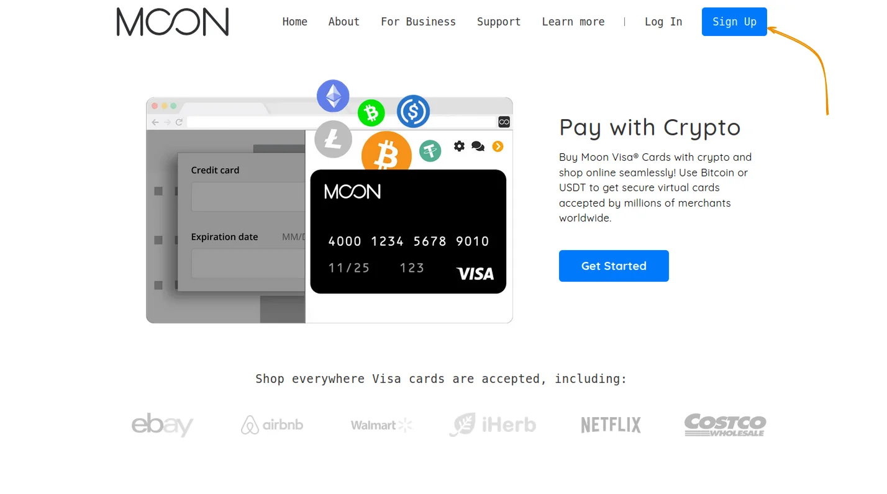
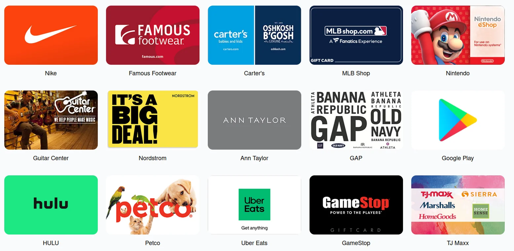
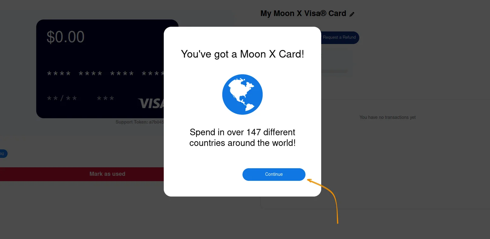
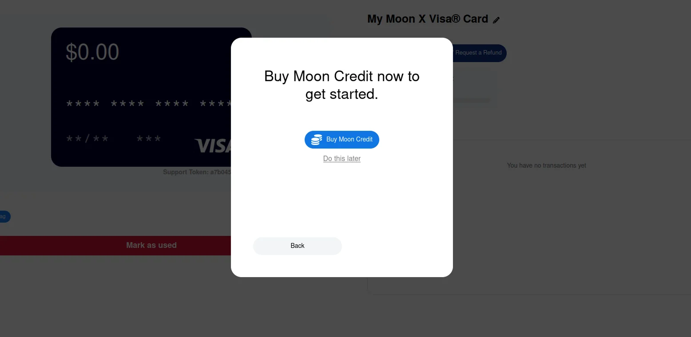
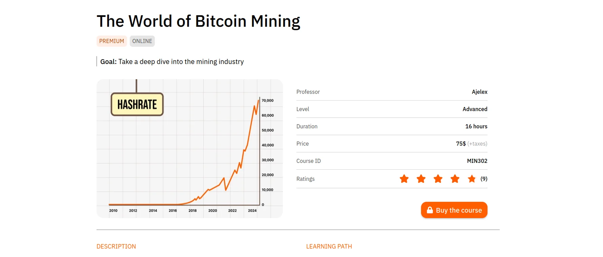
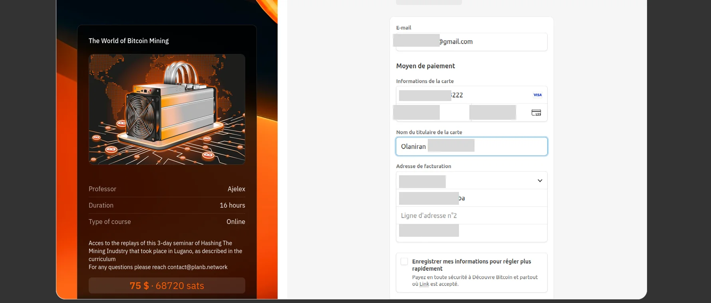

Moon umožňuje používat kryptoměny, jako je bitcoin, k nákupu virtuálních karet Visa a dárkových karet bez nutnosti KYC, které lze používat u milionů online obchodníků stejně jako tradiční bankovní karty. Nabízí tak jednoduchý způsob, jak utratit své sats všude, kde je Visa akceptována, aniž byste museli procházet směnárenskou platformou.

Tento přístup ilustruje hlavní ambice společnosti Moon: zpřístupnit bitcoin široké veřejnosti tím, že usnadní každodenní platby po celém světě, a zároveň čekat, až tento platební prostředek bude nativně přijímat více obchodníků. Je to jakýsi most mezi Bitcoin a tradičním bankovním světem. V tomto tutoriálu vás zveme, abyste se seznámili s touto inovativní službou, jejím konceptem a hlavními funkcemi, které nabízí.

## Získejte virtuální kartu

Online platby představují revoluci, kterou přinesl vývoj internetu, a posilují výměnu mezi všemi zeměmi bez ohledu na jejich zeměpisnou polohu. V této souvislosti vynikají svým mezinárodním pokrytím zejména dva giganti: **Visa** a Mastercard**. Cílem těchto společností je poskytovat platební karty spojené s bankovními účty, které uživatelům umožňují platit a nakupovat.

Moon přináší zásadní inovaci: možnost používat bitcoin a další kryptoměny k financování těchto virtuálních bankovních karet. Služba využívá infrastrukturu společnosti Visa a umožňuje získat dobíjecí bitcoinové karty (Lightning), aniž byste si museli otevřít bankovní účet nebo poskytnout jakékoli identifikační údaje, a to až do výše stanovených limitů použití.

Díky službě Moon získáte skutečný most mezi bitcoiny a platebním systémem Visa, který je přijímán na většině stránek obchodníků. Své bitcoiny můžete použít na :

- Nakupování na stránkách elektronického obchodu;
- Plaťte předplatné online ;
- A mnoho dalších využití.

*Podle zkušeností uživatelů funguje karta Moon X Visa téměř na všech stránkách. Zdá se, že ji nepodporuje jen hrstka obchodníků, ale to je výjimečné.*

Přejděte na [oficiální platformu](https://paywithmoon.com), klikněte na tlačítko **"Registrovat "**, projděte lidským ověřením (CAPTCHA) a zaregistrujte se zadáním e-mailové adresy a hesla.

Upozornění: toto heslo je jedinou ochranou, kterou potřebujete pro přístup k údajům na své budoucí virtuální kartě. Ujistěte se, že jste zvolili silné a jedinečné heslo.

Po vytvoření účtu najdete na **"Dashboardu "** následující sekce:

- Měsíční limit výdajů udělen, před nutností provést KYC ;
- Měsíční kreditní zůstatek ;
- Historie transakcí ;
- Přidání nových karet.

Chcete-li získat novou mapu, klikněte na tlačítko **"Nová mapa "**. Měsíc nabízí několik typů karet:

- Karta Moon 1X** Visa, osobní virtuální karta, kterou lze používat pouze ve Spojených státech a nelze ji dobíjet. Tato karta umožňuje utratit až 1 000 USD bez transakčních poplatků;
- Karta Moon X** Visa, osobní virtuální karta dostupná ve více než 147 zemích s měsíčním limitem výdajů 4 000 USD. Platí tři roky a účtuje si 1 % transakční poplatek, přičemž minimální výše jedné transakce je 1 dolar.

- Moon nabízí také službu **dárkové karty**, která umožňuje platit přímo za konkrétní produkty nebo předplatné, například za obchod Google Play, obchod PlayStation Store a mnoho dalších.

V tomto návodu budeme používat kartu ***Visa Moon X***. Postup pořízení však zůstává stejný pro všechny virtuální a dárkové karty Moon.

Klikněte na tlačítko **Koupit nyní** a poté přijměte podmínky použití a oprávněnosti karty Visa.

Gratulujeme, právě jste získali svou první virtuální kartu.

Tuto virtuální kartu můžete dobíjet pomocí kreditů Moon.

Jak jste si možná všimli, získání této virtuální karty nevyžaduje žádné identifikační údaje: potřebujete pouze e-mailovou adresu a heslo. KYC je vyžadováno pouze v případě, že překročíte měsíční limity výdajů.

## Dobití karty

Karta Moon se dobíjí kredity Moon, které si můžete koupit platbou :

- Bitcoin (Blesk),
- USDT (TRC-20, v síti Tron),
- USDC (v síti Polygon).

Po aktivaci virtuální karty Moon klikněte na tlačítko **"Koupit kredity Moon "** nebo na zůstatek **"Kreditů Moon "** zobrazený na hlavním panelu a během několika okamžiků si dobijte účet.

Minimální částka na jedno dobití je stanovena na 5 USD, přičemž horní limit dobití karty Moon X není stanoven. Vložte částku, kterou chcete dobít, a poté zaplaťte vygenerovanou fakturu Blesku.

Vaše karta bude automaticky připsána na účet, jakmile bude potvrzena platba faktury Lightning.

S touto virtuální kartou můžete platit za produkty a služby online stejně jako s běžnou kartou Visa. Můžete například absolvovat nejnovější prémiový kurz Bitcoin mining, který je k dispozici na naší platformě. Ačkoli je tento příklad čistě ilustrativní (protože již přijímáme platby v nativních bitcoinech), ukazuje, jak snadné je kartu Moon používat.

https://planb.academy/courses/the-world-of-bitcoin-mining-7750d9da-417a-4377-8e35-85c377168477

Všechny své transakce si pak můžete prohlédnout na panelu nebo na stránce s údaji o kartě.

## Organizace karet

Moon je služba, která umožňuje mít na jednom účtu několik karet. Můžete mít kartu Moon Visa a dárkové karty s různými zůstatky nebo platit dárkové karty z karty Moon Visa X.

Když zaškrtnete políčko **Použít kredit**, společnost Moon nabije dárkovou kartu přímo z vaší karty Visa.

Nyní máte k dispozici virtuálního zpracovatele karet založeného na infrastruktuře společnosti Visa, který respektuje důvěrnost a chrání vaše údaje.

Zveme vás také k objevování našeho návodu na Bitrefill, abyste mohli používat bitcoiny k placení dárkových karet z vašich oblíbených služeb:

https://planb.academy/tutorials/exchange/centralized/bitrefill-8c588412-1bfc-465b-9bca-e647a647fbc1