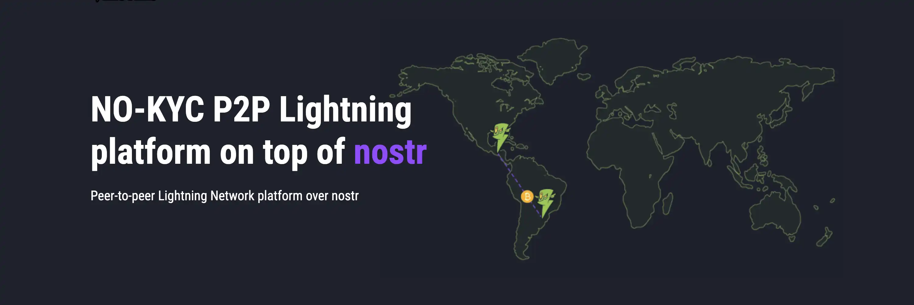


अपनी वित्तीय संप्रभुता से समझौता किए बिना आप बिटकॉइन कैसे हासिल या बेच सकते हैं? केंद्रीकृत प्लेटफ़ॉर्म आक्रामक KYC प्रक्रियाएँ लागू करते हैं जिससे आपका व्यक्तिगत डेटा उजागर हो जाता है, और मनमाने ढंग से आपके खाते को फ्रीज या सरकारी निगरानी में रखने की संभावना रहती है।


**मोस्ट्रो P2P** Lightning Network, नोस्ट्र प्रोटोकॉल और होल्ड इनवॉइस को मिलाकर एक विकेन्द्रीकृत विकल्प प्रदान करता है। इसका प्रमुख नवाचार: एक स्वचालित एस्क्रो सिस्टम जहाँ आपके बिटकॉइन पूरे एक्सचेंज के दौरान आपके नियंत्रण में रहते हैं, जिससे चोरी, एक्सचेंज दिवालियापन या मनमाने ढंग से ज़ब्ती का जोखिम समाप्त हो जाता है।


## मोस्ट्रो P2P क्या है?


मोस्ट्रो P2P एक ओपन सोर्स Bitcoin एक्सचेंज प्रोटोकॉल है, जिसे 2021 में लॉन्च किए गए लोकप्रिय टेलीग्राम बॉट lnp2pbot के डेवलपर ग्रंच द्वारा बनाया गया है। जबकि lnp2pbot ने पहले ही लाइटनिंग के माध्यम से KYC-मुक्त P2P एक्सचेंजों को सक्षम किया था, इसने एक बड़ी भेद्यता प्रस्तुत की: टेलीग्राम विफलता का एक केंद्रीकृत बिंदु है जो सरकारों द्वारा सेंसरशिप के लिए अतिसंवेदनशील है।


मोस्ट्रो इस अवधारणा के **विकेंद्रीकृत विकास** का प्रतिनिधित्व करता है: टेलीग्राम को **नोस्ट्र** प्रोटोकॉल (वितरित रिले का एक अभेद्य नेटवर्क) से बदलकर, मोस्ट्रो इस प्रणालीगत जोखिम को समाप्त करता है। यह प्रोटोकॉल तत्काल लेनदेन के लिए Lightning Network, सेंसरशिप-प्रतिरोधी संचार के लिए नोस्ट्र, और **होल्ड इनवॉइस** को मिलाकर एक वास्तविक गैर-कस्टोडियल स्वचालित एस्क्रो बनाता है।


### तकनीकी वास्तुकला


मोस्ट्रो तीन घटकों के माध्यम से काम करता है:


- डेमन मोस्ट्रोड**: उपयोगकर्ताओं और Lightning Network के बीच आदान-प्रदान का समन्वय करता है
- लाइटनिंग** नोड: होल्ड इनवॉइस बनाता है (~24 घंटे क्रिप्टोग्राफ़िक एस्क्रो)
- मोस्ट्रो** ग्राहक: उपयोगकर्ता इंटरफ़ेस (CLI, मोबाइल, वेब)


नोस्ट्र पर ऑर्डर सार्वजनिक ईवेंट (प्रकार 38383) के रूप में प्रकाशित होते हैं, जबकि निजी लेनदेन एंड-टू-एंड एन्क्रिप्टेड संदेशों (एनआईपी-59, एनआईपी-44) के माध्यम से प्रेषित होते हैं। प्रत्येक मोस्ट्रो इंस्टेंस अपनी स्वयं की फीस (आमतौर पर 0.3% और 1% के बीच) और लेनदेन सीमा (इंस्टेंस के आधार पर कुछ हज़ार से लेकर कई लाख sats तक) निर्धारित करता है।


### निर्णायक लाभ


**सेंसरशिप-प्रतिरोधी**: जब तक दुनिया में कहीं न कहीं नोस्ट्र रिले मौजूद हैं, तब तक कोई भी सरकार मोस्ट्रो को बंद नहीं कर सकती। टेलीग्राम के ज़रिए असुरक्षित lnp2pbot के विपरीत, मोस्ट्रो ऐसे एक्सचेंजों की अनुमति देता है जो **सेंसरशिप-प्रूफ** हैं।


**एस्क्रो नॉन-कस्टोडियल**: लाइटनिंग होल्ड इनवॉइस आपके बिटकॉइन को स्थायी रूप से स्थानांतरित किए बिना लॉक कर देते हैं। आपकी धनराशि आपके नियंत्रण में रहती है और किसी समस्या की स्थिति में (लगभग 24 घंटे) स्वचालित रूप से आपको वापस कर दी जाती है।


**डिज़ाइन द्वारा गोपनीयता**: आपकी ज़रूरतों के हिसाब से दो मोड उपलब्ध हैं। प्रतिष्ठा मोड** आपकी प्रतिष्ठा को आपकी नोस्ट्र कुंजी से जोड़ता है ताकि स्थायी विश्वास बना रहे। पूर्ण निजी मोड** एकल-उपयोग वाली अल्पकालिक कुंजियों के साथ पूर्ण गुमनामी को बढ़ावा देता है।


## मुख्य विशेषताएं


**विकेंद्रीकृत संचार**: सभी आदेश क्रिप्टोग्राफ़िक रूप से हस्ताक्षरित ईवेंट के माध्यम से नोस्ट्र पर प्रकाशित किए जाते हैं। निजी बातचीत एंड-टू-एंड एन्क्रिप्टेड संदेशों के माध्यम से प्रेषित की जाती है, जिससे पूर्ण गोपनीयता सुनिश्चित होती है।


**प्रतिष्ठा प्रणाली**: 5-स्टार रेटिंग, जिसमें पुनरावृत्त गणना शामिल है, नोस्ट्र पर स्थायी रूप से संग्रहीत है। यह आपको धीरे-धीरे एक विश्वसनीय व्यापारी के रूप में प्रतिष्ठा बनाने में मदद करती है।


**विकेंद्रीकृत मध्यस्थता**: किसी विवाद की स्थिति में, एक निष्पक्ष मध्यस्थ साक्ष्यों की जाँच करता है और पारदर्शी मानदंडों के आधार पर निर्णय लेता है। प्रत्येक विवाद के लिए एक विशिष्ट token उत्पन्न होता है ताकि उसका पता लगाया जा सके।


**भुगतान लचीलापन**: yadio.io विनिमय दर सेवा के माध्यम से कई फ़िएट मुद्राओं के लिए समर्थन। SEPA हस्तांतरण, PayPal, Revolut, नकद और पक्षों के बीच सहमत किसी भी विधि को स्वीकार करता है।


## मोस्ट्रो ग्राहक उपलब्ध हैं


मोस्ट्रो आपके P2P एक्सचेंजों के लिए दो मुख्य परिचालन क्लाइंट प्रदान करता है।


### मोस्ट्रो CLI - कमांड लाइन क्लाइंट


**मोस्ट्रो CLI** सबसे परिपक्व और कार्यात्मक क्लाइंट है। Rust में लिखा गया, यह कमांड-लाइन इंटरफ़ेस के माध्यम से मोस्ट्रो की सभी सुविधाएँ प्रदान करता है। यह macOS, Linux और Windows के साथ संगत है।


**मुख्य नियंत्रण** :


- `listorders`: सभी उपलब्ध ऑर्डर प्रदर्शित करें
- `neworder` : एक नया खरीद या बिक्री आदेश बनाएँ
- `takesell` / `takebuy`: खरीद या बिक्री का आदेश लें
- `fiatsent`: फिएट भुगतान भेजने की पुष्टि करें
- `रिलीज़`: एस्क्रो रिलीज़ करें और एक्सचेंज को अंतिम रूप दें
- `getdm`: प्रत्यक्ष संदेश देखें
- `दर` : विनिमय के बाद अपने प्रतिपक्ष का मूल्यांकन करें


तकनीकी उपयोगकर्ताओं, स्वचालन और अधिकतम सुरक्षा की आवश्यकता वाले वातावरण के लिए आदर्श।


### मोस्ट्रो मोबाइल - स्मार्टफोन एप्लिकेशन


अल्फा संस्करण में मोबाइल ऐप P2P ट्रेडिंग को सीधे आपके स्मार्टफ़ोन से सक्षम बनाता है। टैब्ड नेविगेशन, ऑर्डर व्यूइंग, उन्नत फ़िल्टर और आपके प्रतिपक्षियों के साथ संवाद करने के लिए एकीकृत चैट के साथ सहज ग्राफ़िकल Interface।


**एंड्रॉइड** (GitHub पर APK के माध्यम से) के लिए उपलब्ध, यह सरलता और कभी-कभार मोबाइल ट्रेडिंग पसंद करने वाले उपयोगकर्ताओं के लिए इष्टतम विकल्प है।


### मोस्ट्रो-वेब - Interface वेब (विकास में)


Interface उन्नत जावास्क्रिप्ट वेब एप्लिकेशन सक्रिय विकास के अधीन है। व्यापक ट्रेडिंग और पोर्टफोलियो प्रबंधन कार्यक्षमताओं के साथ एक संपूर्ण उपयोगकर्ता अनुभव प्रदान करने के लिए डिज़ाइन किया गया। बिना किसी इंस्टॉलेशन के ब्राउज़र के माध्यम से एक्सेस करें।


## स्थापना और कॉन्फ़िगरेशन


यह ट्यूटोरियल आपको दो मुख्य मोस्ट्रो क्लाइंट्स: CLI और मोबाइल एप्लिकेशन की स्थापना और उपयोग के बारे में मार्गदर्शन करेगा।


### आवश्यक पूर्वापेक्षाएँ


आरंभ करने से पहले, आपको आवश्यकता होगी:


- पर्याप्त तरलता (या लाइटनिंग-संगत) के साथ एक कार्यशील Lightning Network** wallet
 - अनुशंसित: Phoenix, ब्रीज़, Wallet या Satoshi...
 - परीक्षण के लिए न्यूनतम 1000 सातोशी तरलता


https://planb.academy/tutorials/wallet/mobile/phoenix-0f681345-abff-4bdc-819c-4ae800129cdf


- एक Nostr** निजी कुंजी (प्रारूप `nsec1...`)
 - [nostrkeygen.com](https://nostrkeygen.com/) पर एक समर्पित ट्रेडिंग कुंजी बनाएं
 - महत्वपूर्ण**: अपनी मुख्य व्यक्तिगत नोस्ट्र कुंजी का कभी भी उपयोग न करें
 - अपनी निजी कुंजी को सुरक्षित स्थान पर रखें (पासवर्ड मैनेजर)


- वैकल्पिक लेकिन अनुशंसित**: अपने आईपी पते को छिपाने के लिए वीपीएन या टोर कनेक्शन


https://planb.academy/tutorials/computer-security/communication/mullvad-968ec5f5-b3f0-4d23-a9e0-c07a3e85aaa8

### मोस्ट्रो CLI स्थापना


#### macOS पर


**चरण 1: Rust जांच**


जाँच करें कि Rust स्थापित है (संस्करण 1.64+ आवश्यक):


```bash
rustc --version
```


यदि Rust स्थापित नहीं है:


```bash
curl --proto '=https' --tlsv1.2 -sSf https://sh.rustup.rs | sh
source $HOME/.cargo/env
```


**चरण 2: रिपॉजिटरी की क्लोनिंग**


```bash
git clone https://github.com/MostroP2P/mostro-cli.git
cd mostro-cli
```


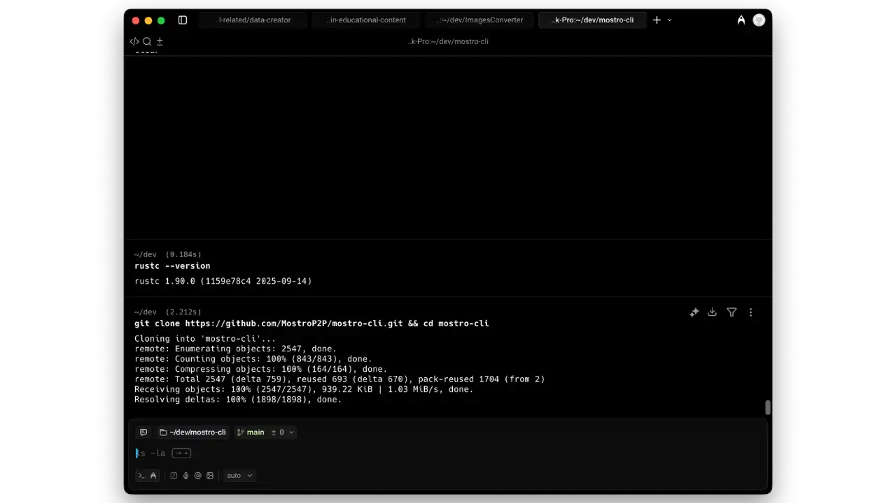


**चरण 3: कॉन्फ़िगरेशन**


कॉपी करें और संपादित करें:


```bash
cp .env-sample .env
```


`.env` खोलें और अपनी सेटिंग्स कॉन्फ़िगर करें:


```bash
# Public key of the Mostro instance (choose an instance)
# Main mainnet instance (recommended):
MOSTRO_PUBKEY='npub1ykvsmrmw2hk7jgxgy64zr8tfkx4nnjhq9eyfxdlg3caha3ph0skq6jr3z0'
# Alternative/test instance:
# MOSTRO_PUBKEY='npub19m9laul6k463czdacwx5ta4ap43nlf3lr0p99mqugnz8mdz7wtvskkm5wg'

# Your Nostr private key dedicated to trading
NSEC_PRIVKEY='nsec1votre_cle...'

# List of Nostr relays (use the same ones as the mobile app for synchronization)
RELAYS='wss://nos.lol,wss://relay.damus.io,wss://nostr-pub.wellorder.net,wss://nostr.mutinywallet.com,wss://relay.nostr.band'

POW='0'
```


**CLI/मोबाइल** सिंक्रोनाइज़ेशन के लिए महत्वपूर्ण: CLI और मोबाइल ऐप पर समान ऑर्डर एक्सेस करने के लिए, आपको दोनों क्लाइंट में **एक ही Mostro Pubkey** और **एक ही Nostr रिले** का इस्तेमाल करना होगा। मोबाइल ऐप की सेटिंग्स में इन सेटिंग्स को देखें।


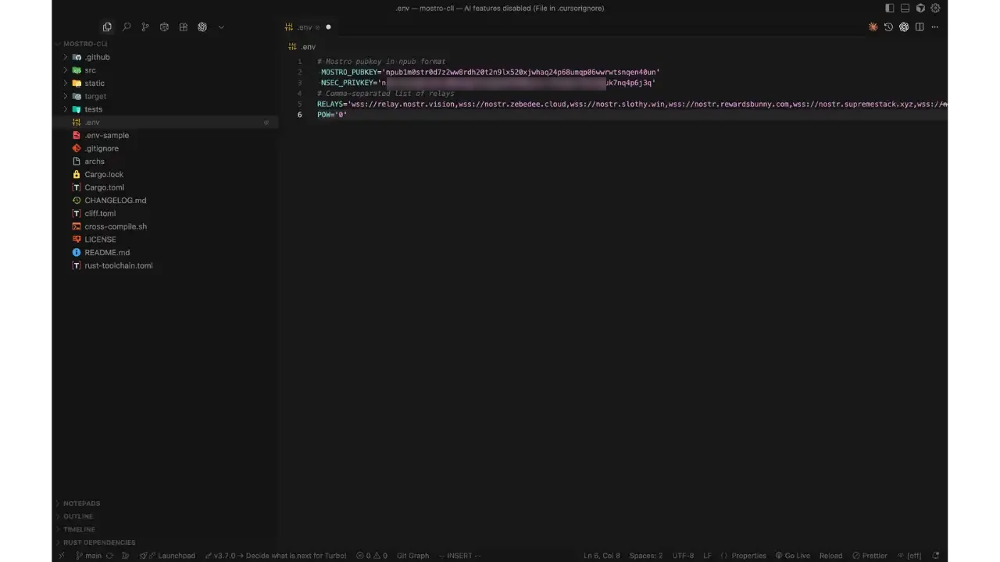


**चरण 4: स्थापना**


CLI को संकलित और स्थापित करें:


```bash
cargo install --path .
```


संकलन में 1-2 मिनट लगते हैं। `mostro-cli` निष्पादनयोग्य `~/.cargo/bin/` में स्थापित किया जाएगा।


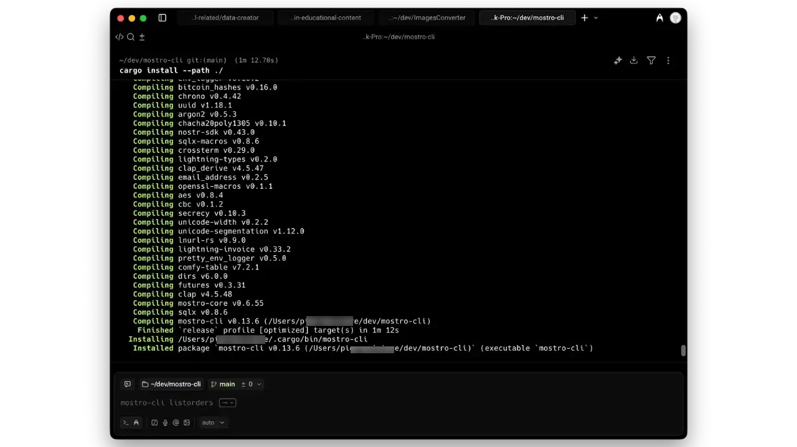


**चरण 5: जाँच करें**


जाँच करें कि सब कुछ काम कर रहा है:


```bash
mostro-cli --help
```


आपको ऑर्डर की पूरी सूची दिखनी चाहिए।


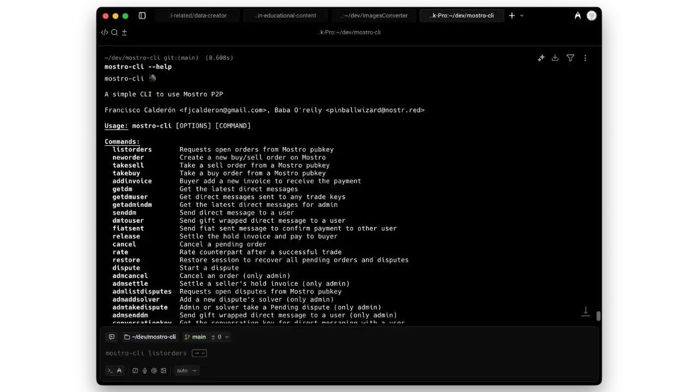


#### Linux (Ubuntu/Debian) पर


macOS के समान स्थापना, इसके अतिरिक्त:


```bash
sudo apt update
sudo apt install -y cmake build-essential pkg-config
curl --proto '=https' --tlsv1.2 -sSf https://sh.rustup.rs | sh
source $HOME/.cargo/env
git clone https://github.com/MostroP2P/mostro-cli.git
cd mostro-cli
cargo build --release
```


फिर macOS अनुभाग में चरण 3 और 4 का पालन करें।


#### विंडोज़ पर


सबसे पहले [rustup.rs](https://rustup.rs/) के माध्यम से Rust स्थापित करें, फिर PowerShell का उपयोग करें:


```powershell
git clone https://github.com/MostroP2P/mostro-cli.git
cd mostro-cli
cargo build --release
```


समान कॉन्फ़िगरेशन: `.env-sample` को `.env` में कॉपी करें और अपने पैरामीटर भरें।


### मोस्ट्रो मोबाइल इंस्टॉल करना


#### एंड्रॉइड पर


**चरण 1**: [GitHub रिलीज़ पृष्ठ](https://github.com/MostroP2P/mobile/releases) पर जाएं और **app-release.apk** फ़ाइल (लगभग 65 एमबी) डाउनलोड करें।


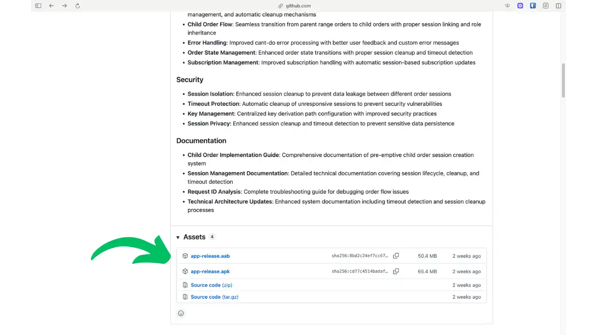


**चरण 2: डाउनलोड हो जाने के बाद, अपने डाउनलोड से APK फ़ाइल खोलें। एंड्रॉइड आपसे इस स्रोत से इंस्टॉलेशन को अधिकृत करने के लिए कहेगा।


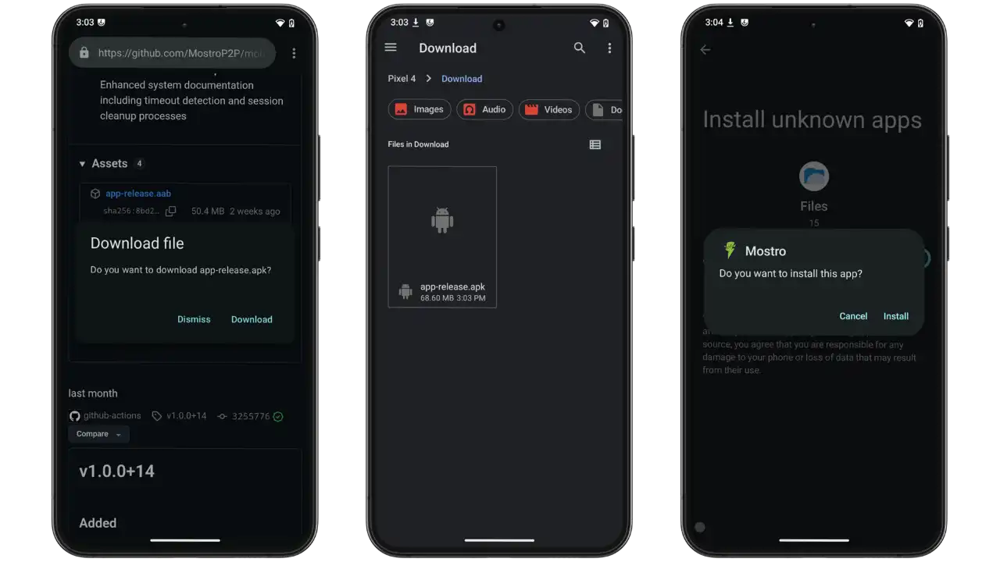


**चरण 3**: ऑनबोर्डिंग स्क्रीन का पालन करें, जो कार्यात्मकताएं प्रस्तुत करती हैं:


- Bitcoin का स्वतंत्र रूप से व्यापार करें - कोई KYC नहीं**: Nostr की बदौलत बिना पहचान सत्यापन के व्यापार करें
- डिफ़ॉल्ट रूप से गोपनीयता**: प्रतिष्ठा मोड और पूर्ण गोपनीयता मोड के बीच चुनें
- हर कदम पर सुरक्षा**: नॉन-कस्टोडियल होल्ड इनवॉइस के साथ सुरक्षा


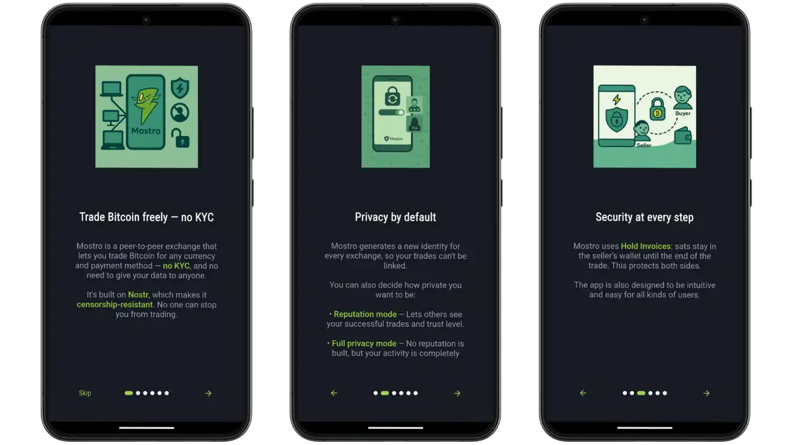


**चरण 4**: जानने के लिए ऑनबोर्डिंग जारी रखें:


- पूरी तरह से एन्क्रिप्टेड चैट**: एंड-टू-एंड एन्क्रिप्टेड संचार
- ऑफ़र स्वीकार करें**: ऑर्डर बुक ब्राउज़ करें और ऑफ़र चुनें
- आपको जो चाहिए वह नहीं मिल रहा?** : अपना खुद का कस्टमाइज़्ड ऑर्डर बनाएं


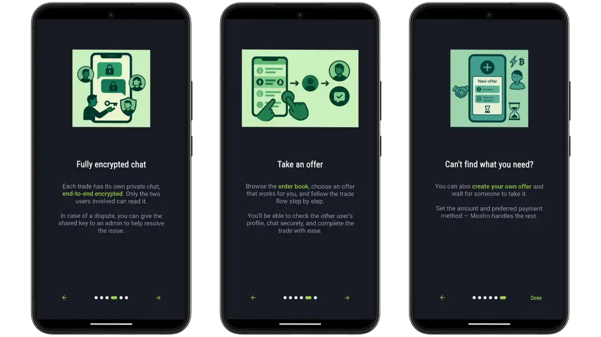


**चरण 5: ऑनबोर्डिंग पूरी होने के बाद, ऐप स्वचालित रूप से Nostr कुंजियों की एक जोड़ी जनरेट करता है। अपने **सीक्रेट वर्ड्स** (रिकवरी वाक्यांश) को सेव करने के लिए मेनू (☰) पर जाएँ और फिर **अकाउंट** पर जाएँ। इसी स्क्रीन पर आपको पहले बताए गए प्राइवेसी मोड को बदलने का विकल्प भी मिलता है।


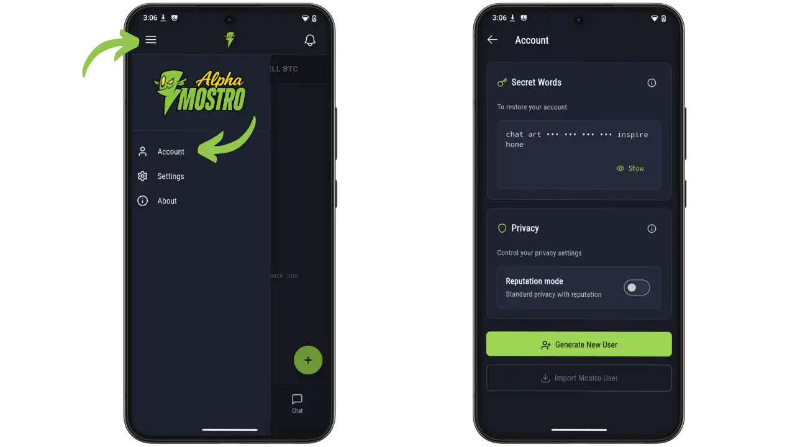


**महत्वपूर्ण**: अपने पुनर्प्राप्ति वाक्यांश को किसी सुरक्षित स्थान (पासवर्ड मैनेजर, पेपर सेफ) पर लिख लें।


### प्रारंभिक सुरक्षा कॉन्फ़िगरेशन


आप जो भी प्लेटफॉर्म उपयोग करते हैं:


- समर्पित कुंजी**: ट्रेडिंग के लिए एक अलग नोस्ट्र पहचान का उपयोग करें
- छोटी राशि**: शुरुआत करने के लिए sats 10,000 से कम से शुरुआत करें
- एकाधिक रिले**: 3-5 भौगोलिक रूप से विविध रिले कॉन्फ़िगर करें
- नेटवर्क सुरक्षा**: अपना आईपी पता छिपाने के लिए VPN या Tor सक्रिय करें
- Wallet सुरक्षित**: अपने wallet लाइटनिंग का स्वचालित लॉकिंग सक्रिय करें


## CLI के साथ प्रयोग करें


यह खंड वास्तविक जीवन के उपयोग के मामले के आधार पर मोस्ट्रो CLI के माध्यम से बिटकॉइन की खरीद को प्रदर्शित करता है।


### चरण 1: उपलब्ध ऑर्डर सूचीबद्ध करें


`listorders` कमांड सभी सक्रिय ऑर्डर प्रदर्शित करता है:


```bash
mostro-cli listorders
```


आपको प्रत्येक ऑर्डर के विवरण के साथ एक तालिका दिखाई देगी: आईडी, प्रकार (खरीद/बिक्री), राशि, मुद्रा, भुगतान विधि।


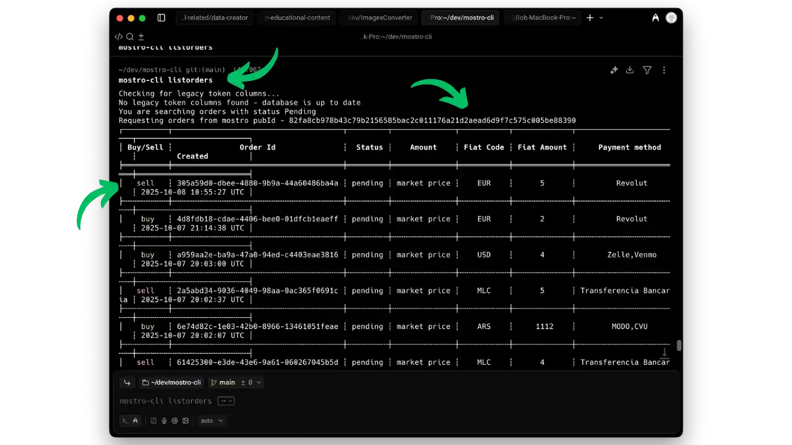


इस उदाहरण में, Revolut के माध्यम से 5 EUR बेचने का ऑर्डर दिखाई दे रहा है (ID: `305a59d0-dbee-4880-9b9a-44a60486ba4a`).


### चरण 2: ऑर्डर लेना


इन बिटकॉइन को खरीदने के लिए, `takesell` के साथ ऑर्डर लें:


```bash
mostro-cli takesell -o 305a59d0-dbee-4880-9b9a-44a60486ba4a
```


मोस्ट्रो आपसे BTC प्राप्त करने के लिए एक **लाइटनिंग इनवॉइस** मांगेगा। सटीक राशि सातोशी में दर्शाई गई है (यहाँ: 4715 sats)।


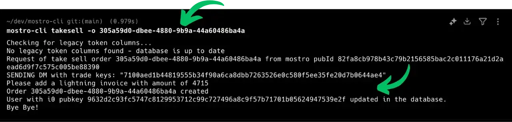


### चरण 3: अपना लाइटनिंग इनवॉइस प्रदान करें


अपने wallet (Phoenix, Breez, आदि) से सटीक राशि के लिए एक लाइटनिंग इनवॉइस बनाएं, फिर उसे भेजें:


```bash
mostro-cli takesell -o 305a59d0-dbee-4880-9b9a-44a60486ba4a --invoice lnbc47150n1p...
```


सिस्टम शिपमेंट की पुष्टि करता है और आपको बताता है कि एस्क्रो को सक्रिय करने से पहले विक्रेता द्वारा होल्ड इनवॉइस का भुगतान करने तक प्रतीक्षा करें।


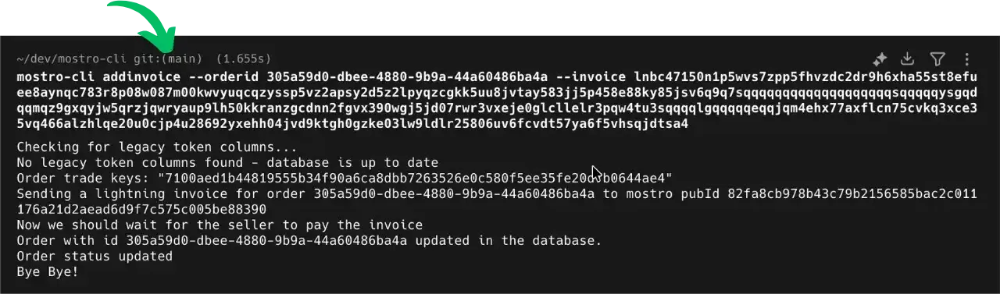


### चरण 4: विक्रेता से संपर्क करें


एक बार एस्क्रो सक्रिय हो जाने पर, विक्रेता से भुगतान विवरण का अनुरोध करने के लिए `dmtouser` का उपयोग करें:


```bash
mostro-cli dmtouser --pubkey 7100aed1b44819555b34f90a6ca8dbb7263526e0c580f5ee35fe20d7b0644ae4 \
--orderid 305a59d0-dbee-4880-9b9a-44a60486ba4a \
--message "Hey what's your revtag ?"
```


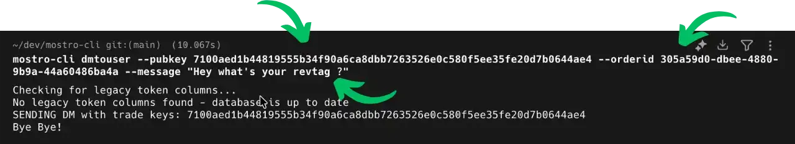


### चरण 5: उत्तर प्राप्त करें


विक्रेता का जवाब देखने के लिए प्रत्यक्ष संदेश देखें:


```bash
mostro-cli getdm
```


विक्रेता आपको अपना भुगतान आईडी देता है (यहां उसका रेवटैग: `@satoshi`).


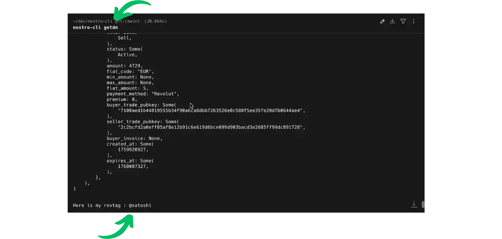


### चरण 6: फिएट भुगतान करना


भुगतान को सहमत विधि (इस उदाहरण में Revolut) के माध्यम से दिए गए संपर्क विवरण पर भेजें। **सभी सहायक दस्तावेज़** (स्क्रीनशॉट, लेनदेन संदर्भ) संभाल कर रखें।


### चरण 7: भुगतान प्रेषण की पुष्टि करें


भुगतान हो जाने पर, मोस्ट्रो को सूचित करें:


```bash
mostro-cli fiatsent -o 305a59d0-dbee-4880-9b9a-44a60486ba4a
```


### चरण 8: बिटकॉइन की प्राप्ति


जैसे ही विक्रेता फिएट की प्राप्ति की पुष्टि करता है और `रिलीज` कमांड के साथ एस्क्रो जारी करता है, आपको आपके द्वारा प्रदान किए गए लाइटनिंग चालान पर तुरंत आपके बिटकॉइन प्राप्त होते हैं।


### चरण 9: मूल्यांकन


विकेंद्रीकृत प्रतिष्ठा में योगदान देने के लिए विक्रेता को रेटिंग दें:


```bash
mostro-cli rate -o 305a59d0-dbee-4880-9b9a-44a60486ba4a -r 5
```


### उपयोगी आदेश


**ऑर्डर रद्द करें** (इसे लिए जाने से पहले) :


```bash
mostro-cli cancel -o <order-id>
```


**नया विक्रय ऑर्डर बनाएं** :


```bash
mostro-cli neworder -k sell -c eur -f 20 -m "Revolut" -p 2
```


**विवाद खोलें** :


```bash
mostro-cli dispute -o <order-id>
```


## मोबाइल एप्लिकेशन के साथ उपयोग करें


यह खंड वास्तविक जीवन के उपयोग के मामले का अनुसरण करके मोस्ट्रो मोबाइल के माध्यम से बिटकॉइन की बिक्री को प्रदर्शित करता है।


### Interface मुख्य


एप्लिकेशन में 3 मुख्य टैब हैं:


- ऑर्डर बुक**: उपलब्ध खरीद (BUY BTC) और बिक्री (SELL BTC) ऑर्डर ब्राउज़ करें
- मेरे ट्रेड्स**: अपने सक्रिय और ऐतिहासिक ऑर्डर देखें
- चैट**: आंकड़ों का उपयोग करके अपने प्रतिपक्षियों के साथ संवाद करें


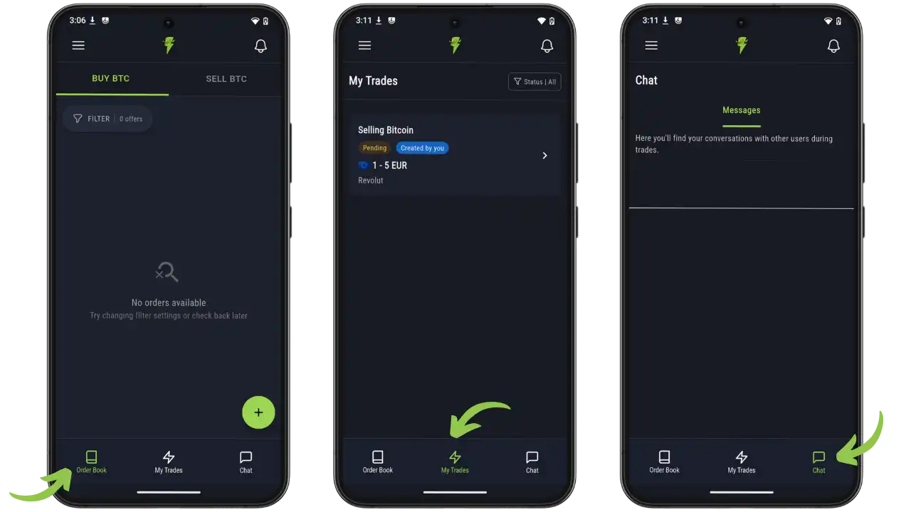


### अनुशंसित कॉन्फ़िगरेशन


ट्रेडिंग से पहले, मेनू (☰) > **सेटिंग्स** के माध्यम से कुछ सेटिंग्स कॉन्फ़िगर करें:


- लाइटनिंग Address** (वैकल्पिक): सीधे भुगतान प्राप्त करने के लिए
- रिले**: लचीलेपन के लिए कई नोस्ट्र रिले जोड़ें (उदाहरण के लिए `wss://nos.lol`, `wss://relay.damus.io`)
- मोस्ट्रो पब्लिक कुंजी**: आपके द्वारा उपयोग किए जा रहे मोस्ट्रो इंस्टेंस की सार्वजनिक कुंजी की जाँच करें


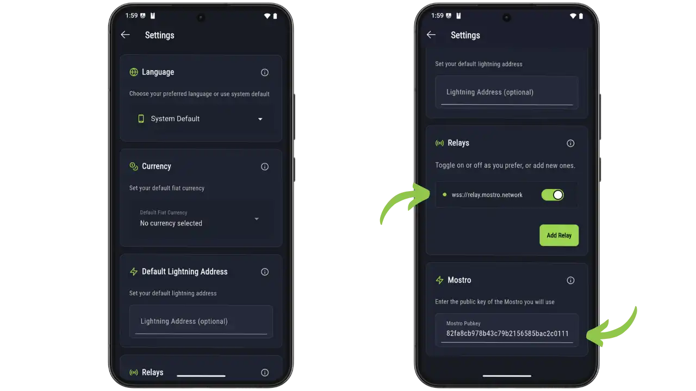


**CLI/मोबाइल सिंक्रोनाइज़ेशन के लिए महत्वपूर्ण**: यदि आप CLI और मोबाइल ऐप, दोनों का उपयोग कर रहे हैं, तो दोनों क्लाइंट में **बिल्कुल समान Nostr रिले और Mostro Pubkey** कॉन्फ़िगर करें। इस समान कॉन्फ़िगरेशन के बिना, आपको दोनों इंटरफ़ेस पर समान ऑर्डर उपलब्ध नहीं दिखाई देंगे। सेटिंग्स (ऊपर स्क्रीनशॉट) में दिखाई देने वाले रिले और Mostro Pubkey आपकी CLI `.env' फ़ाइल में मौजूद रिले और Mostro Pubkey से मेल खाने चाहिए।


### चरण 1: विक्रय आदेश बनाएँ


नीचे दाईं ओर हरे रंग का **"+"** बटन दबाएं, फिर **बेचें** (लाल बटन) चुनें।


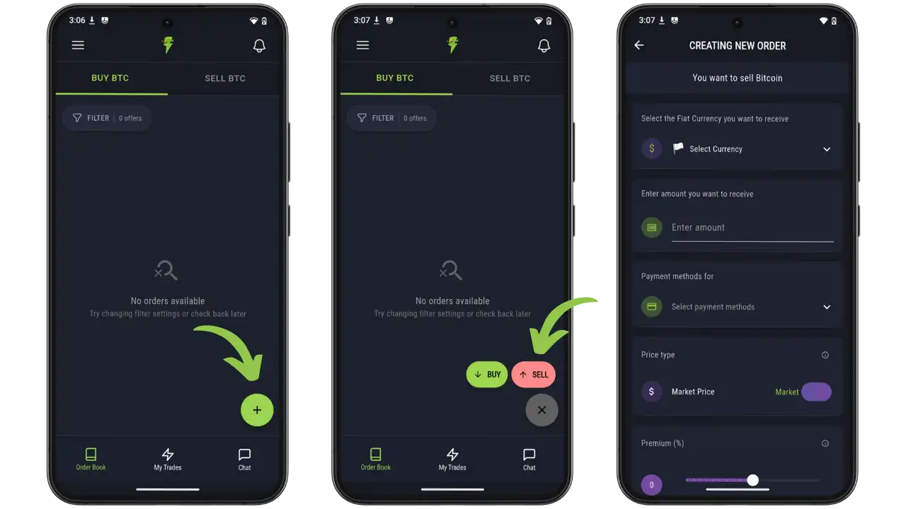


निर्माण प्रपत्र भरें:


1. **मुद्रा**: वह मुद्रा चुनें जिसे आप प्राप्त करना चाहते हैं (EUR, USD, आदि)


2. **राशि** : राशि को फिएट मुद्रा में दर्ज करें (उदाहरण के लिए 1 से 3 यूरो)


3. **भुगतान विधियाँ** : विधि चुनें (उदाहरण के लिए "Revolut")


4. **मूल्य प्रकार**: "बाज़ार मूल्य" चुनें


5. **प्रीमियम**: प्रीमियम समायोजित करें (-10% से +10% तक स्लाइडर, अनुशंसित: शीघ्र बिक्री के लिए 0%)


अपना ऑर्डर प्रकाशित करने के लिए **सबमिट** दबाएँ।


### चरण 2: प्रकाशन की पुष्टि


आपका ऑर्डर अब प्रकाशित हो गया है! यह 24 घंटे के लिए उपलब्ध रहेगा। आप इसे खरीदार द्वारा लेने से पहले किसी भी समय `cancel` कमांड चलाकर रद्द कर सकते हैं।


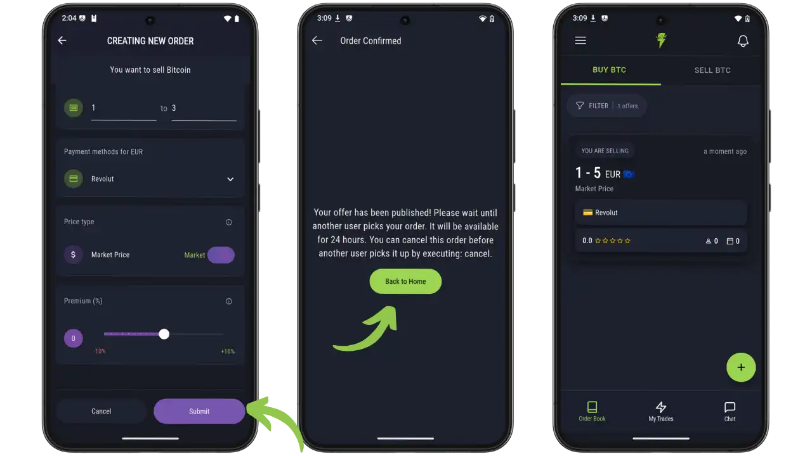


ऑर्डर **मेरे ट्रेड्स** टैब में "लंबित" स्थिति और "आपके द्वारा निर्मित" बैज के साथ दिखाई देता है।


### चरण 3: खरीदार आपका ऑर्डर लेता है


जब कोई खरीदार आपका ऑर्डर लेता है, तो आपको एक सूचना प्राप्त होती है। **मेरे ट्रेड्स** में विवरण देखें।


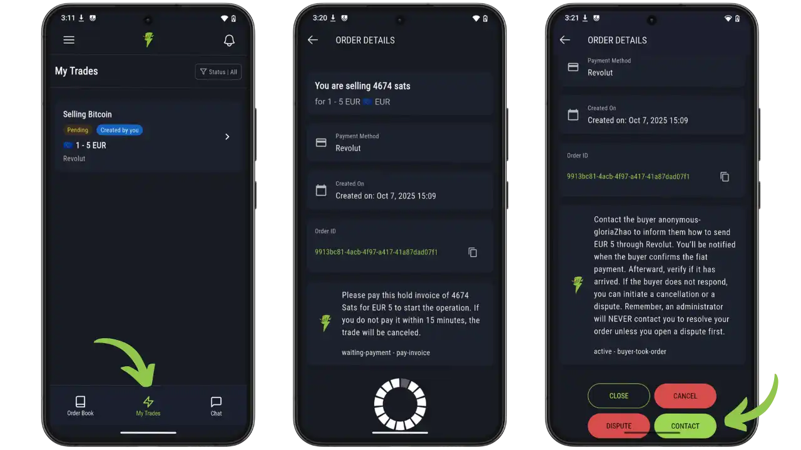


**महत्वपूर्ण निर्देश**: अब आपको अपने बिटकॉइन (यहाँ 4674 sats, 1-5 यूरो के लिए) को एस्क्रो में लॉक करने के लिए प्रदर्शित **होल्ड इनवॉइस** का भुगतान करना होगा। आपके पास **अधिकतम 15 मिनट** हैं, अन्यथा एक्सचेंज रद्द कर दिया जाएगा।


होल्ड इनवॉइस की प्रतिलिपि बनाएँ और अपने wallet लाइटनिंग (Phoenix, ब्रीज़, आदि) से इसका भुगतान करें।


### चरण 4: खरीदार के साथ संवाद करें


एक बार एस्क्रो सक्रिय हो जाने पर, खरीदार के साथ एन्क्रिप्टेड चैट खोलने के लिए **संपर्क** दबाएं।


खरीदार (यहाँ "अनाम-ग्लोरिया झाओ") आपसे संपर्क करके आपके भुगतान विवरण मांगेगा। कृपया अपने विवरण (रेवटैग, आईबीएएन, आदि) के साथ उत्तर दें।


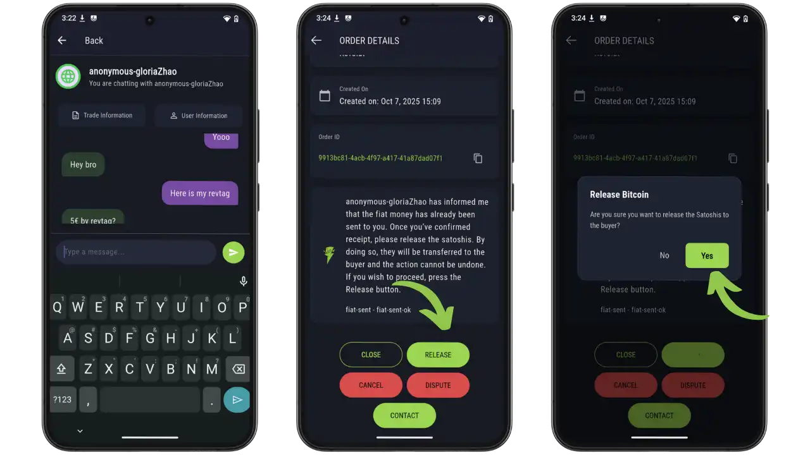


### चरण 5: फिएट भुगतान की प्राप्ति


अपने Revolut खाते (या किसी अन्य सहमत विधि) में फ़िएट भुगतान प्राप्त होने तक प्रतीक्षा करें। **ध्यान से जाँचें**:


- सटीक राशि
- प्रेषक
- यदि अनुरोध किया जाए तो संदर्भ


खरीदार आपको चैट के ज़रिए सूचित करेगा कि उसने भुगतान भेज दिया है। मोस्ट्रो आपको एक संदेश भी दिखाएगा कि आपको फ़िएट भेज दिया गया है।


### चरण 6: एस्क्रो जारी करें


एक बार जब आपके खाते में फिएट भुगतान की रसीद की पुष्टि हो जाए, तो हरे रंग का रिलीज बटन दबाएं और खरीदार को भुगतान भेजने की पुष्टि करें।


बिटकॉइन्स को खरीदार को उसके लाइटनिंग बिल के माध्यम से तुरंत हस्तांतरित कर दिया जाता है।


### चरण 7: विचार का मूल्यांकन करें


रिलीज़ के बाद, खरीदार को रेटिंग देने के लिए **RATE** दबाएँ। 1 से 5 स्टार (यहाँ 5/5) चुनें और **Submit Rating** दबाएँ।


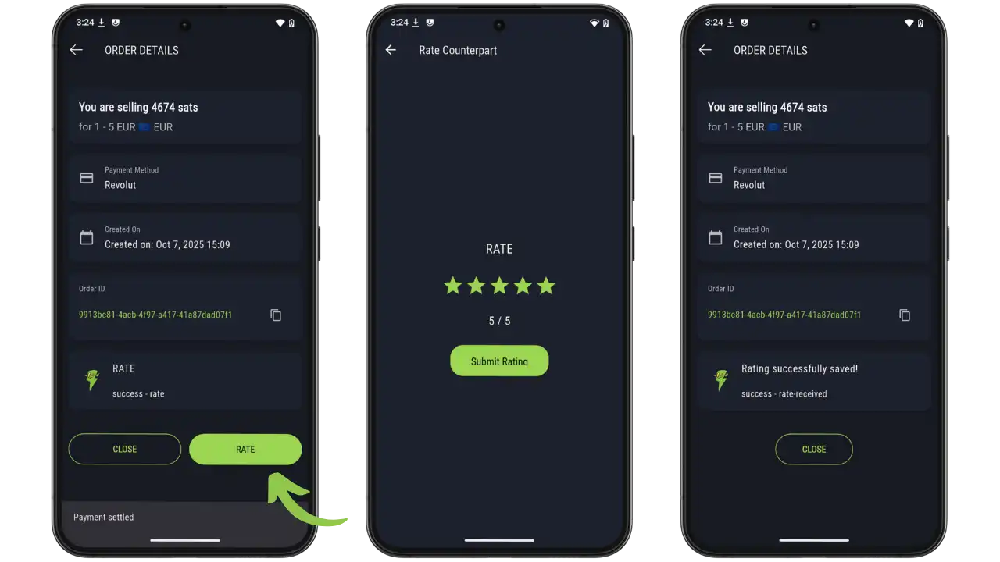


विनिमय ख़त्म हो गया है!


### मोबाइल ऐप से बिटकॉइन खरीदें


बिटकॉइन खरीदने की प्रक्रिया समान है, लेकिन उलट है:


1. विक्रय आदेश देखने के लिए **ऑर्डर बुक** > **BTC खरीदें** टैब ब्राउज़ करें


2. विवरण देखने के लिए किसी दिलचस्प ऑर्डर पर क्लिक करें


3. **ऑर्डर लें** दबाएँ


4. अपना लाइटनिंग इनवॉइस प्रदान करें (आपके wallet से उत्पन्न)


5. विक्रेता द्वारा एस्क्रो सक्रिय करने की प्रतीक्षा करें


6. भुगतान विवरण के लिए **संपर्क** के माध्यम से विक्रेता से संपर्क करें


7. फिएट भुगतान भेजें (प्रमाण रखें)


8. विक्रेता सत्यापन के बाद एस्क्रो जारी करता है


9. अपने लाइटनिंग इनवॉइस पर तुरंत बिटकॉइन प्राप्त करें


10. विक्रेता को रेटिंग दें (1-5 स्टार)


### समस्या प्रबंधन


**ऑर्डर रद्द करें**: **मेरे ट्रेड्स** में, अपना ऑर्डर दबाएं और फिर **रद्द करें** बटन दबाएं (यह केवल ऑर्डर लेने से पहले ही उपलब्ध होता है)।


**विवाद खोलें**: यदि कोई असहमति उत्पन्न होती है, तो ऑर्डर विवरण में **विवाद** दबाएँ। सभी साक्ष्य (चैट स्क्रीनशॉट, बैंक लेनदेन संदर्भ) संलग्न करें।


## लाभ और सीमाएँ


### फ़ायदे


**वित्तीय संप्रभुता**: होल्ड इनवॉइस तंत्र के कारण आपके बिटकॉइन कभी भी आपके प्रत्यक्ष नियंत्रण से बाहर नहीं जाते हैं, जिससे एक्सचेंज दिवालियापन या चोरी का जोखिम समाप्त हो जाता है।


**सेंसरशिप-प्रतिरोधी**: कोई भी प्राधिकरण नेटवर्क बंद नहीं कर सकता या आपके आदेशों को सेंसर नहीं कर सकता। यह सिस्टम तब तक काम करता है जब तक नोस्ट्र रिले चालू रहते हैं।


**डिफ़ॉल्ट गुमनामी**: केवल एक छद्म नाम वाली Nostr कुंजी ही आपकी पहचान करती है, बिना KYC या व्यक्तिगत डेटा के। एंड-टू-एंड एन्क्रिप्टेड संचार।


**भुगतान लचीलापन**: कोई भी पारस्परिक रूप से स्वीकृत भुगतान विधि संभव है (स्थानान्तरण, मोबाइल ऐप, नकद, वस्तु विनिमय)।


### सीमाएँ


**प्रारंभिक विकास**: प्रारंभिक इंटरफेस और तकनीकी सीखने की आवश्यकता।


**सीमित तरलता**: सीमित संख्या में ऑर्डर, विशेष रूप से बड़ी मात्रा या दुर्लभ मुद्राओं के लिए।


**तकनीकी आवश्यकताएँ**: लाइटनिंग और नोस्ट्र की बुनियादी समझ आवश्यक है।


**व्यक्तिगत जिम्मेदारी**: समस्याओं के मामले में कोई केंद्रीकृत सहायता नहीं, सावधानी आवश्यक।


## निष्कर्ष


मोस्ट्रो P2P, केंद्रीकृत एक्सचेंजों का एक आशाजनक विकल्प प्रस्तुत करता है, जो वास्तव में विकेंद्रीकृत व्यापार के लिए Lightning Network, नोस्ट्र और स्वचालित एस्क्रो का संयोजन करता है। अपने शुरुआती विकास और सीमित तरलता के बावजूद, यह प्लेटफ़ॉर्म पहले से ही वित्तीय संप्रभुता, सेंसरशिप प्रतिरोध और डिफ़ॉल्ट गुमनामी प्रदान करता है।


स्वायत्तता और गोपनीयता पसंद करने वाले बिटकॉइन उपयोगकर्ताओं के लिए, मोस्ट्रो एक व्यवहार्य विकल्प है जिसका क्रमिक अन्वेषण किया जाना चाहिए। इसकी विकेन्द्रीकृत वास्तुकला व्यावसायिक विकास के बजाय सामुदायिक विकास की गारंटी देती है, जिससे वास्तव में मुक्त Bitcoin एक्सचेंजों के भविष्य का मार्ग प्रशस्त होता है।


## संसाधन


### आधिकारिक दस्तावेज


- [मोस्ट्रो आधिकारिक वेबसाइट](https://mostro.network)
- [तकनीकी दस्तावेज़ीकरण](https://mostro.network/docs-english/index.html)
- [मोस्ट्रो फाउंडेशन](https://mostro.foundation)


### स्रोत कोड और विकास


- [मुख्य GitHub रिपॉजिटरी](https://github.com/MostroP2P/mostro)
- [वेब क्लाइंट](https://github.com/MostroP2P/mostro-web)
- [ग्राहक CLI](https://github.com/MostroP2P/mostro-cli)


### समुदाय


- [नोस्ट्र प्रोटोकॉल](https://nostr.com)
- [Lightning Network गाइड](https://lightning.network)