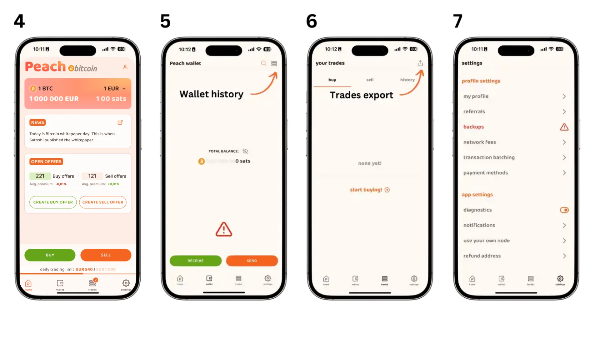
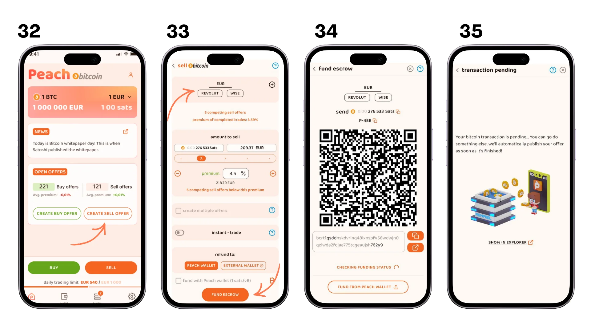
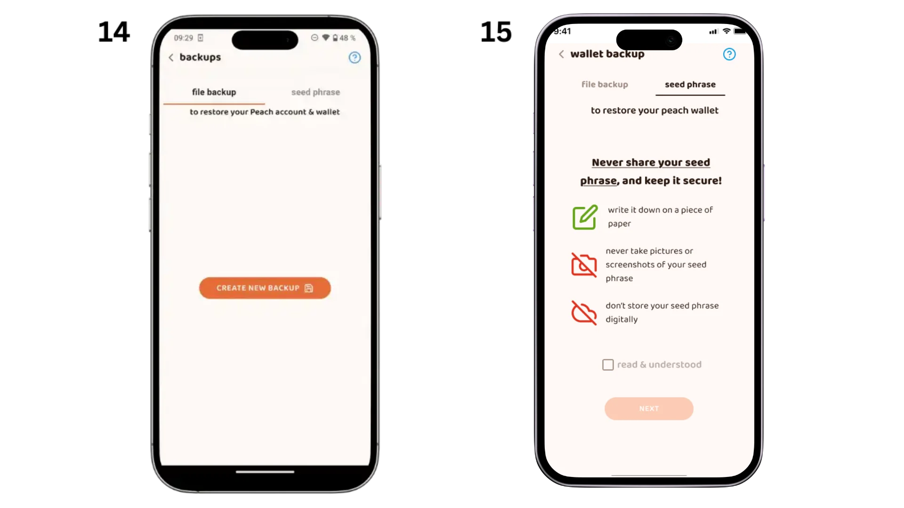
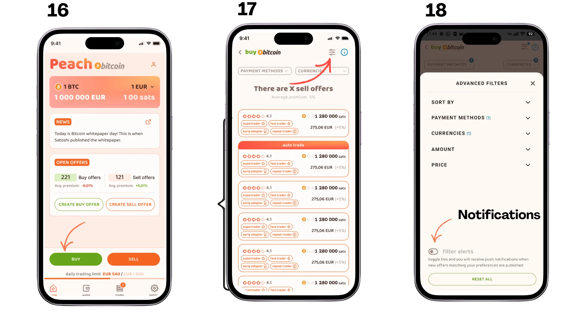
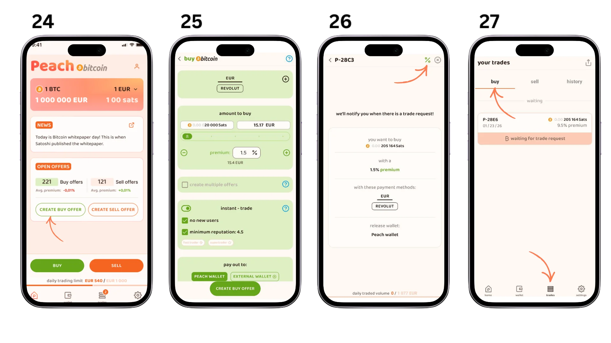
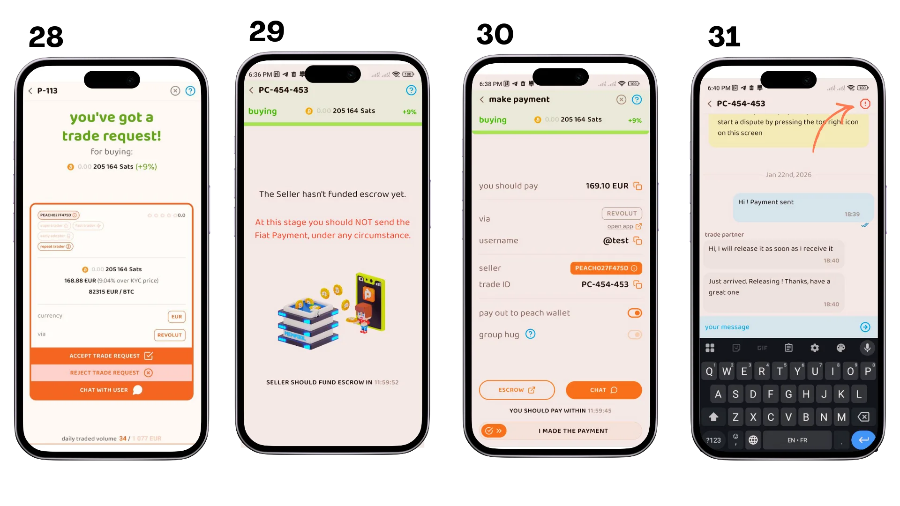
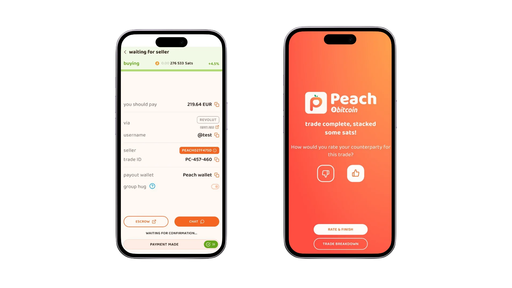

## Uvod

Peer-to-peer razmene bez KYC (P2P) su ključne za očuvanje poverljivosti korisnika i finansijske autonomije. Omogućavaju direktne transakcije između pojedinaca bez potrebe za verifikacijom identiteta, što je od suštinskog značaja za one koji cene privatnost. Za dublje razumevanje teorijskih koncepata, pogledajte kurs BTC204:

https://planb.network/courses/65c138b0-4161-4958-bbe3-c12916bc959c

### 1. Šta je Peach?

Breskva je P2P Exchange platforma koja omogućava korisnicima kupovinu i prodaju bitkoina bez KYC. Nudi intuitivan Interface i napredne sigurnosne funkcije. U poređenju sa drugim rešenjima kao što su Bisq, HodlHodl i Robosat, Breskva se ističe lakoćom korišćenja i niskim naknadama.

### 2. Privatnost i Prikupljanje Podataka

**Koje informacije Peach prikuplja?**

Breskva nastoji da čuva apsolutni minimum podataka o svojim korisnicima. Ovde je pregled podataka koji se čuvaju na njenim serverima:

- A Hash vašeg jedinstvenog identifikatora aplikacije (AdID)
- Hash vaših podataka o plaćanju
- Vaši šifrovani razgovori
- Podaci o transakcijama kako bi se osiguralo da anonimni korisnici ne prekorače limit trgovanja (vrste korišćenih metoda plaćanja, iznosi kupovine i prodaje)
- Adrese korišćene za slanje i primanje sa escrow računa
- Podaci o korišćenju (Firebase i Google Analytics), samo uz vaš pristanak

Kao podsetnik, Hash je podatak učinjen neprepoznatljivim, slično enkripciji. Isti podaci će uvek proizvesti isti Hash, što omogućava otkrivanje duplikata bez poznavanja originalnih podataka.

*Za više informacija o heširanju, možete pratiti ovaj kurs:*

https://planb.network/courses/46b0ced2-9028-4a61-8fbc-3b005ee8d70f

**Ko može videti moje podatke o plaćanju?**

- Samo vaša suprotna strana može videti vaše podatke o plaćanju
- Podaci se prenose putem Peach servera, ali su u potpunosti šifrovani od kraja do kraja.
- U slučaju spora, vaši podaci o plaćanju i istorija razgovora biće vidljivi dodeljenom Peach posredniku.

## Instalacija i konfiguracija

### 1. Instalirajte Peach aplikaciju

- Preuzmite aplikaciju sa [Peach Bitcoin](https://peachbitcoin.com/fr/quick-start/).
- Pratite uputstva za instalaciju na vašem uređaju.
- Tokom instalacije, bićete upitani da izaberete da li želite da delite određene podatke kako biste poboljšali Peach aplikaciju (slika 1)
- Na sledećem ekranu (slika 2), imate dve opcije:
 - Ako ste novi korisnik, kliknite na "Novi korisnik" da kreirate novi profil
 - Ako već imate nalog, koristite "Restore" da vratite svoj postojeći profil
- Ako imate referalni kod, možete ga uneti ovde.
- Da biste vratili postojeći nalog (slika 3), biće vam potrebno :
 - Vaša rezervna datoteka
 - Lozinka za dešifrovanje ove datoteke

### 2. Pregled glavnih ekrana

Aplikacija Peach je organizovana oko četiri glavna ekrana dostupna iz donje navigacione trake:

- **Početna**: Glavni ekran za kupovinu i prodaju bitkoina. Ovde možete kreirati nove transakcije i pristupiti dostupnim ponudama.
- **Wallet**: Vaš integrisani Bitcoin Wallet koji vam omogućava da:
 - Proveri svoj saldo
 - Primite bitkoine
 - Pošalji bitkoine
 - Pregledajte istoriju transakcija
- **Trades**: Vaš centar za upravljanje trgovinom gde ćete pronaći :
 - Vaše trenutne transakcije
 - Kompletna istorija vaših razmena
 - Status svake transakcije
- **Postavke**: Vaš čvorište za konfiguraciju naloga za:
 - Upravljajte svojim metodama plaćanja
 - Konfigurišite svoje rezervne kopije
 - Prilagodite svoje preference
 - Pristup pomoći i podršci

### 3. Konfigurišite svoje metode plaćanja

Pristupite metodama plaćanja putem kartice Podešavanja (slika 8)

**Online plaćanja**

- Kliknite na dugme da dodate novi način plaćanja
- Izaberite svoju valutu
- Odaberite željeni način plaćanja

*Vrste dostupnih metoda plaćanja:*

***Bankovni transferi dostupni: ***

- SEPA (standardni ili instant)
- Unesite svoje SEPA bankovne podatke

***Prihvaćeni online novčanici :***

- Nekoliko opcija dostupno u zavisnosti od vaše zemlje (Revolut, Paypal, Wise, Strike, itd.)
- Pratite uputstva da dodate svoje podatke za prijavu

***Poklon kartica koja se može koristiti :***

- Amazon
- Unesite zemlju izdavanja kartice i ostale potrebne informacije

***Nacionalne opcije plaćanja:***

Sistemi plaćanja specifični za zemlju :

- Satispay (Italija)
- MB Way (Portugal)
- Bizum (Španija)
- Brže uplate (Ujedinjeno Kraljevstvo)

***Plaćanja lično:***

- Odaberite "Meetup
- Zatim izaberite svoj sastanak sa liste

### Uputstva za upotrebu

- Možete istovremeno postaviti nekoliko metoda plaćanja.
- Što više metoda dodate, širi će biti raspon ponuda kojima ćete imati pristup.
- Molimo proverite da su vaši podaci tačni pre nego što se registrujete.
- Možete promeniti ili izbrisati svoje metode plaćanja u bilo kom trenutku.

**Beleška o bezbednosti**: Vaše informacije o plaćanju su šifrovane i dele se samo sa vašim Exchange partnerom tokom transakcije.

### 4. Kako osigurati svoj Wallet

**Razumevanje vašeg Peach naloga**

Peach nalog nije tradicionalni nalog sa korisničkim imenom i lozinkom. To je fajl koji se čuva lokalno na vašem telefonu, što znači da Peach ne mora da čuva vaše podatke ili zna vaš identitet: vi imate kontrolu. Ovaj fajl sadrži sve vaše podatke, od vaših Bitcoin Wallet ključeva do vaših podataka o plaćanju.

Ovaj pristup garantuje veću poverljivost, ali takođe podrazumeva veću odgovornost. Gubljenje telefona bez rezervne kopije znači gubitak pristupa vašem Peach nalogu i sredstvima. Zato je ključno napraviti rezervnu kopiju ovog fajla i zaštititi ga jakom lozinkom.

**Kreirajte svoje rezervne kopije**

- Pristupite podešavanjima iz kartice u donjem desnom uglu početnog ekrana
- Odaberite opciju "backups" u meniju podešavanja

Dve vrste rezervne kopije su dostupne:

**Sačuvaj datoteku naloga (slika 14)**

- Kliknite na "Kreiraj novu rezervnu kopiju"
- Kreirajte jaku lozinku za šifrovanje vaše rezervne datoteke
- Čuvajte ovu datoteku na sigurnom mestu.

Rezerva datoteke vraća vaš kompletan Peach nalog, uključujući :

- Vaš Wallet
- Vaši načini plaćanja
- Istorija razgovora
- Podaci o plaćanju
- Istorija transakcija sa detaljima o drugoj strani

**Čuvanje fraze za oporavak (slika 15)**

- Pratite uputstva da prikažete svoju frazu za oporavak
- Pažljivo napišite reči redosledom.
- Sačuvajte ovu rezervnu kopiju na sigurnom mestu, idealno različitom od datoteke naloga.

Fraza za oporavak oporavlja samo:

- Pristup vašem nalogu
- Vaša Bitcoin sredstva

Izgubićeš :

- Istorija razgovora
- Podaci o plaćanju
- Informacije o drugoj strani u istoriji transakcija

Za optimalnu sigurnost, preporučujemo da izvršite obe vrste bekapa.

## Kupovina i prodaja Bitcoina

### 1. Kako kupiti Bitkoine

- Na početnom ekranu, kliknite na dugme "Kupi" (slika 16)
- Konfigurišite svoju kupovinu prema vašim preferencijama (slika 17)
- Pregledajte listu dostupnih ponuda (slika 18)

- Odaberite ponudu koja vam odgovara (slika 19)
- Izvršite uplatu dogovorenim načinom.
- Potvrdite uplatu u aplikaciji i ocenite transakciju (slika 20)

- Pratite status vaše transakcije
- Proverite potvrdu o prijemu bitkoina
- Sredstva će biti dostupna na vašem Peach Wallet

### 2. Kako prodati Bitcoine

- Konfigurišite svoju prodajnu ponudu (slika 24)
- Finansirajte transakciju slanjem bitkoina na dati Address (slika 25)
- Sačekajte potvrdu transakcije (slika 26)
- Vaša ponuda je sada vidljiva kupcima (slika 27)

- Pratite status vaše ponude
- Sačekajte potvrdu uplate od kupca
- Proveri detalje transakcije

- Proveri status plaćanja
- Potvrdite prijem uplate
- Proceni transakciju
- Bitcoini se automatski puštaju kupcu

**Saveti za uspešnu transakciju**

- Brzo odgovarajte na poruke od vašeg sagovornika
- Proverite detalje plaćanja pažljivo
- Ne oklevajte da koristite uslugu medijacije ako imate problem.

**Beleška o bezbednosti**: Nikada ne potvrđujte prijem uplate dok ne proverite da li je primljena na vaš račun.

## Prednosti i nedostaci

### Prednosti breskve

- **Nije potreban KYC**: Čuva poverljivost korisnika.
- **Nema pristupa bankovnim podacima**: Peach nema pristup vašim bankovnim podacima ili vašem identitetu.
- **Intuitivni Interface**: Lako za korišćenje za korisnike srednjeg nivoa.
- **Otvoreni kod**: Izvorni kod je javan i proverljiv od strane zajednice.

### Nedostaci breskve

- **Ograničena likvidnost**: Manji obim trgovanja u poređenju sa etabliranijim platformama.
- **Regulatory risk**: Aplikacija je upravljana od strane švajcarske kompanije. Stoga podleže švajcarskim propisima, koji bi mogli evoluirati i potencijalno cenzurisati aplikaciju.

## Korisni resursi

- Francuski objašnjavajući video: [YouTube](https://youtu.be/ziwhv9KqVkM)
- Brzi vodič: [Peach Bitcoin](https://peachbitcoin.com/fr/quick-start/)