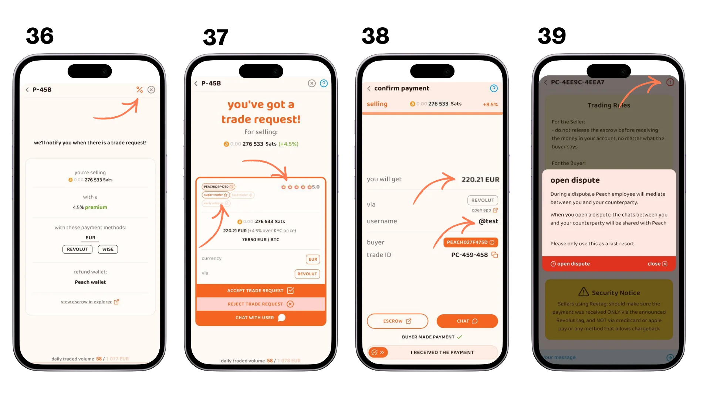
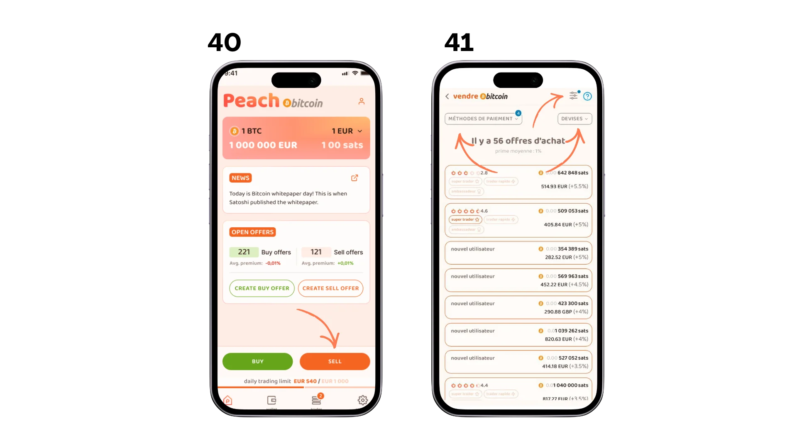
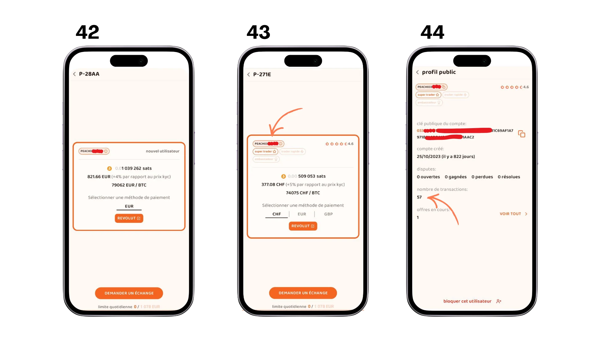
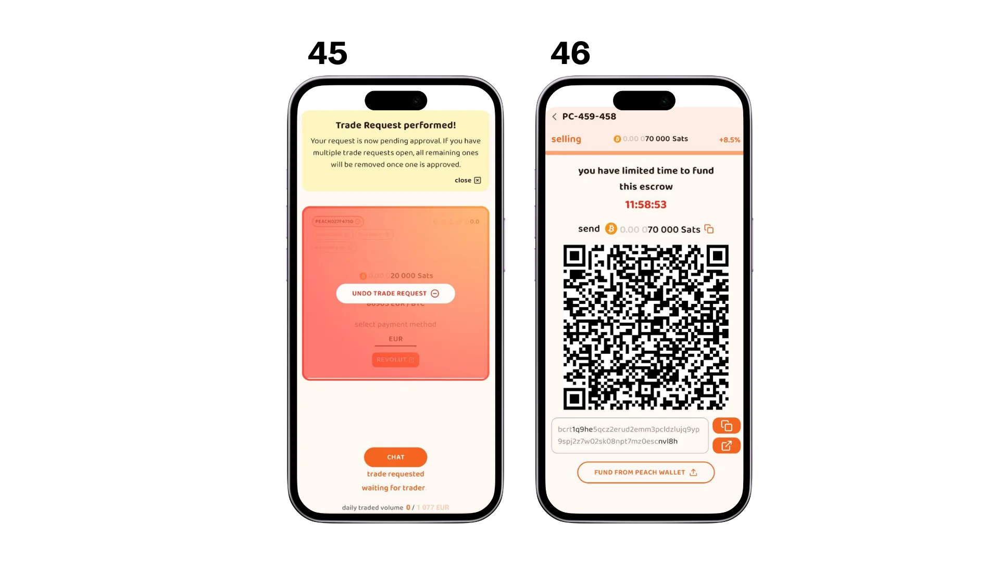

## Giới thiệu

Các sàn giao dịch ngang hàng không cần KYC (P2P) rất cần thiết để bảo vệ tính bảo mật và quyền tự chủ tài chính của người dùng. Chúng cho phép giao dịch trực tiếp giữa các cá nhân mà không cần xác minh danh tính, điều này rất quan trọng đối với những người coi trọng quyền riêng tư. Để hiểu sâu hơn về các khái niệm lý thuyết, hãy xem khóa học BTC204:

https://planb.academy/courses/65c138b0-4161-4958-bbe3-c12916bc959c

### 1. Peach là gì?

Peach là một nền tảng giao dịch dựa trên P2P cho phép người dùng mua và bán bitcoin mà không cần xác minh danh tính (KYC). Nó cung cấp giao diện trực quan và các tính năng bảo mật tiên tiến. So với các giải pháp khác như Bisq, HodlHodl và Robosat, Peach nổi bật nhờ tính dễ sử dụng.

Hệ thống ký quỹ multisignature (2-2) đảm bảo an toàn cho tiền trong các giao dịch. Peach hỗ trợ nhiều phương thức thanh toán và có hệ thống đánh giá uy tín để hướng dẫn các nhà giao dịch trong hành động của họ. Như thường lệ với các nền tảng P2P, do đó, việc duy trì uy tín tốt là rất quan trọng để giữ vững danh tiếng với các nhà giao dịch khác.

### 2. Quyền riêng tư và dữ liệu được thu thập

**Peach thu thập những thông tin gì?**

Peach luôn nỗ lực lưu trữ lượng dữ liệu tối thiểu tuyệt đối về người dùng. Dưới đây là tổng quan về dữ liệu được lưu trữ trên máy chủ của chúng tôi:

- Mẫu hash chứa mã định danh ứng dụng duy nhất của bạn (AdID)
- Mẫu hash chứa thông tin thanh toán của bạn
- Cuộc trò chuyện được mã hóa của bạn
- Dữ liệu giao dịch nhằm đảm bảo người dùng ẩn danh không vượt quá hạn mức giao dịch (loại phương thức thanh toán được sử dụng, số tiền mua và bán)
- Addresses được sử dụng để gửi và nhận tiền từ tài khoản ký quỹ
- Dữ liệu sử dụng (Firebase & Google Analytics), chỉ được thu thập khi có sự đồng ý của bạn

Xin nhắc lại, hash là dữ liệu được mã hóa đến mức không thể nhận dạng được, tương tự như mã hóa thông thường. Cùng một dữ liệu sẽ luôn tạo ra cùng một hash, điều này cho phép phát hiện các bản sao mà không cần biết dữ liệu gốc.

*Để hiểu rõ hơn về hiện tượng hash, hãy tham gia khóa học này:*

https://planb.academy/courses/46b0ced2-9028-4a61-8fbc-3b005ee8d70f

Ai có thể xem thông tin thanh toán của tôi?

- Chỉ đối tác thanh toán của bạn mới có thể xem chi tiết thanh toán của bạn
- Dữ liệu được truyền qua máy chủ Peach, nhưng được mã hóa hoàn toàn từ đầu đến cuối
- Trong trường hợp xảy ra tranh chấp, thông tin thanh toán và lịch sử giao dịch của bạn sẽ được hiển thị cho người hòa giải Peach được chỉ định

## Cài đặt và cấu hình

### 1. Cài đặt ứng dụng Peach

- Tải ứng dụng từ [Peach Bitcoin](https://peachbitcoin.com/fr/quick-start/). Trên iOS, trước tiên bạn cần cài đặt ứng dụng [testflight](https://apps.apple.com/us/app/testflight/id899247664).
- Hãy làm theo hướng dẫn cài đặt trên thiết bị của bạn.
- Trong quá trình cài đặt, bạn sẽ được yêu cầu lựa chọn xem có muốn chia sẻ một số dữ liệu nhất định để nâng cao ứng dụng Peach hay không. (hình 1)
- Trên màn hình tiếp theo (hình 2), bạn có hai lựa chọn:
 - Nếu bạn là người dùng mới, hãy nhấp vào "Người dùng mới" để tạo hồ sơ mới
 - Nếu bạn đã có tài khoản, hãy sử dụng chức năng "Khôi phục" để khôi phục hồ sơ hiện có của bạn
- Nếu bạn có mã giới thiệu, bạn có thể nhập mã đó vào đây.
- Để khôi phục tài khoản hiện có (hình 3), bạn cần:
 - Tệp sao lưu của bạn
 - Mật khẩu để giải mã tệp này

### 2. Tổng quan về các màn hình chính

Ứng dụng Peach được tổ chức xung quanh bốn màn hình chính, có thể truy cập từ thanh điều hướng phía dưới:

- Trang chủ (4)** : Màn hình chính mà từ đó bạn có thể chọn mua hoặc bán, tạo giao dịch mới và truy cập các ưu đãi hiện có:
 - Tạo đề nghị mua bằng hai nút bên dưới (tạo mua / tạo bán)
 - Hãy tận dụng các ưu đãi hiện có do người dùng khác tạo ra bằng cách sử dụng hai nút bên dưới ("Mua"/"Bán").

- Wallet (5)** : wallet bitcoin tích hợp của bạn cho phép bạn:
 - Kiểm tra số dư của bạn
 - Nhận bitcoin
 - Bitcoin Envoyer (với quyền kiểm soát coin)
 - Xem lịch sử giao dịch của bạn
 - Tài trợ cho doanh số bán hàng của bạn

- Giao dịch (6)**: các hợp đồng hiện tại và trước đây của bạn, theo ba tab:
 - Đang tiến hành mua hàng
 - Đang tiến hành bán hàng
 - Lịch sử các cuộc trao đổi của bạn

- Cài đặt (7)** : Trung tâm cấu hình cho
 - Xem hồ sơ của bạn (uy tín, huy hiệu, giới hạn, v.v.)
 - Quản lý bảo mật (sao lưu, mã PIN)
 - Quản lý phương thức thanh toán của bạn
 - Liên hệ bộ phận hỗ trợ
 - Thay đổi ngôn ngữ
 - vân vân.

### 3. Cấu hình phương thức thanh toán của bạn

Bạn có thể quản lý các phương thức thanh toán của mình trong phần cài đặt (hình 8)

Peach cung cấp hình thức thanh toán trực tuyến và thanh toán trực tiếp (chỉ tại các buổi gặp mặt đã đăng ký).

**Thanh toán trực tuyến

**Quan trọng:**

Để bảo vệ người dùng, Peach yêu cầu nguồn tiền phải trùng khớp với nguồn tiền đã được quảng cáo. Các nhà giao dịch có trách nhiệm đảm bảo điều này, vì sự an toàn của chính họ.

Để thêm một phương thức:

- Trong tab "trực tuyến", hãy nhấp vào "thêm đơn vị tiền tệ/phương thức thanh toán"
- Chọn loại tiền tệ của bạn
- Chọn phương thức thanh toán bạn ưa thích

*Các phương thức thanh toán hiện có:*

***Đối với chuyển khoản ngân hàng: ***

- SEPA (tiêu chuẩn hoặc tức thời)
- Điền thông tin tài khoản ngân hàng SEPA của bạn.

***Đã chấp nhận đăng ký wallet trực tuyến:***

- Có nhiều lựa chọn khác nhau tùy thuộc vào quốc gia của bạn (Revolut, Paypal, Wise, Strike, v.v.)
- Hãy làm theo hướng dẫn để thêm thông tin đăng nhập của bạn

*Thẻ quà tặng có thể sử dụng:*** Thẻ quà tặng có thể sử dụng:*** Thẻ quà tặng có thể sử dụng:*** Thẻ quà tặng có thể sử dụng:*** Thẻ quà tặng có thể sử dụng:*** Thẻ quà tặng có thể sử dụng:***

- Amazon, Steam, v.v.
- Nhập quốc gia phát hành thẻ và các thông tin cần thiết khác

***Các phương thức thanh toán trong nước:***

Hệ thống thanh toán đặc thù của từng quốc gia:

- Satispay (Ý)
- Đường MB (Bồ Đào Nha)
- Bizum (Tây Ban Nha)
- Thanh toán nhanh (Vương quốc Anh)
- vân vân.

***Đối với thanh toán trực tiếp:***

- Chọn "Gặp gỡ" (hình 12)
- Sau đó, chọn buổi gặp mặt của bạn từ danh sách (hình 13)

### Hướng dẫn sử dụng

- Bạn có thể thêm nhiều phương thức thanh toán
- Càng thêm nhiều phương thức, bạn càng có nhiều lựa chọn hơn
- Hãy kiểm tra độ chính xác của thông tin trước khi đăng ký
- Bạn có thể thay đổi hoặc xóa phương thức thanh toán của mình bất cứ lúc nào

**Lưu ý về bảo mật**: Thông tin thanh toán của bạn được mã hóa và chỉ được chia sẻ với đối tác giao dịch của bạn trong quá trình giao dịch, ngoại trừ trường hợp xảy ra tranh chấp, trong trường hợp đó, người hòa giải Peach cũng sẽ có quyền truy cập.

### 4. Cách bảo vệ danh mục đầu tư của bạn

**Hiểu rõ về tài khoản Peach của bạn**

Tài khoản Peach không có tên người dùng và mật khẩu. Đó là một tập tin được lưu trữ cục bộ trên điện thoại của bạn, điều này có nghĩa là Peach không cần lưu trữ dữ liệu của bạn hoặc biết danh tính của bạn: bạn hoàn toàn kiểm soát được nó. Tập tin này chứa tất cả dữ liệu của bạn: bao gồm 12 từ khôi phục bitcoin, khóa PGP, chi tiết thanh toán, v.v. Vì vậy, điều quan trọng là phải lưu tập tin này và bảo vệ nó bằng một mật khẩu mạnh.

Cách tiếp cận này đảm bảo mức độ bảo mật nhất định và giao trách nhiệm quản lý dữ liệu và sao lưu cho người dùng. Mất điện thoại mà không có bản sao lưu đồng nghĩa với việc mất quyền truy cập vào tài khoản Peach và số tiền trong đó.

**Hãy tạo bản sao lưu của bạn**

- Truy cập cài đặt từ tab ở góc dưới bên phải màn hình chính
- Chọn tùy chọn "sao lưu" trong menu cài đặt

Có hai loại sao lưu khả dụng:

**Lưu tệp tài khoản (hình 14)**

- Nhấp vào "Tạo bản sao lưu mới"
- Hãy tạo mật khẩu **mạnh** để mã hóa tệp sao lưu của bạn
- Hãy gửi tập tin này đến một vị trí đảm bảo tính dự phòng trong trường hợp điện thoại bị mất.

Việc sao lưu tập tin sẽ khôi phục toàn bộ tài khoản Peach của bạn, bao gồm:

- Danh mục đầu tư của bạn
- Phương thức thanh toán của bạn
- Dữ liệu thanh toán
- Lịch sử giao dịch bao gồm chi tiết về các đối tác và các cuộc trao đổi với họ

**Lưu cụm từ khôi phục (hình 15)**

- Hãy làm theo hướng dẫn để hiển thị cụm từ khôi phục của bạn
- Hãy cẩn thận viết các từ theo đúng thứ tự
- Hãy lưu trữ bản sao lưu này ở một vị trí an toàn, tốt nhất là khác với tệp tài khoản

Cụm từ khôi phục cho phép bạn khôi phục:

- Danh tiếng của bạn, các giao dịch của bạn
- Số tiền bitcoin của bạn

Nhưng **KHÔNG** bao gồm những điều sau:

- Các cuộc trò chuyện hiện tại và quá khứ của bạn
- Dữ liệu thanh toán
- Thông tin đối tác trong lịch sử giao dịch

## Mua bán bitcoin

### 1.a Cách mua Bitcoin: Chấp nhận lời đề nghị bán

Phản xạ đầu tiên của người mua nên là kiểm tra các giao dịch mua bán đã được thanh toán bằng bitcoin.

- Trên màn hình chính, hãy nhấp vào nút "Mua" (hình 16)
- Sau đó, bạn có thể xem danh sách các bitcoin đã được gửi vào hệ thống ký quỹ và sẵn sàng để bán (hình 17). Bạn có thể thấy số lượng, giá (tính theo % so với thị trường KYC), phương thức thanh toán và các loại tiền tệ được chấp nhận.
- Sử dụng bộ lọc để sắp xếp và phân loại các ưu đãi (hình 18).
- Lưu ý: nút ở cuối trang bộ lọc cho phép bạn nhận thông báo khi có ưu đãi phù hợp với bộ lọc của bạn được đăng tải; và nút "đặt lại" chỉ đơn giản là xóa tất cả các bộ lọc (hình 18).

- Xem ưu đãi phù hợp với bạn và gửi yêu cầu đổi trả (hình 19)
- Bạn có thể gửi nhiều yêu cầu trao đổi, và lời đề nghị chấp thuận đầu tiên sẽ hủy bỏ các yêu cầu khác của bạn.
- Thanh toán bằng phương thức đã thỏa thuận.

**Lưu ý:** Nguồn tiền phải trùng khớp với nguồn tiền bạn đã chỉ định khi thêm phương thức thanh toán.

- Vui lòng xác nhận thanh toán trong ứng dụng ngay sau khi hoàn tất**.
- Chờ người bán nhận được tiền thanh toán và xác nhận điều đó (hình 20)
- Và cuối cùng, hãy đánh giá trải nghiệm của bạn với nhân viên bán hàng (hình 21)

- Theo dõi trạng thái giao dịch của bạn
- Kiểm tra xác nhận đã nhận được bitcoin
- Số tiền sẽ có sẵn trong danh mục đầu tư Peach của bạn (hình 22 và 23)

### 1.b Cách mua bitcoin: Tạo lệnh đặt giá

Nếu bạn không tìm được người bán phù hợp, bạn có thể tạo lời đề nghị mua. Vì việc này không yêu cầu bất kỳ giao dịch bitcoin nào ở giai đoạn này, bạn sẽ có ít cơ hội tìm được đối tác giao dịch hơn, đặc biệt nếu lịch sử giao dịch và danh tiếng của bạn kém hoặc không có. Để khắc phục điều này, điều quan trọng là khi tạo lời đề nghị, bạn cần *đưa ra mức giá cao* để khuyến khích người bán chọn lời đề nghị của bạn. Hãy cùng tiếp tục:

- Trên màn hình chính, hãy nhấp vào nút "Tạo đề nghị mua hàng" (hình 24)
- Thêm phương thức thanh toán nếu bạn chưa làm, và nhập các tùy chọn của bạn (số lượng, chất lượng cao cấp, v.v.) (hình 25).

Tùy chọn "ngay lập tức" cho phép bạn chấp nhận yêu cầu giao dịch một cách tự động.

 - Nhấp chuột lại vào "tạo giá thầu" để tiếp tục
- Sau khi giao dịch được tạo, đến lượt người bán liên hệ với bạn để yêu cầu trao đổi. Bạn có thể đóng và thoát ứng dụng mà không cần lo lắng.
- Bạn có thể thay đổi mức phí bảo hiểm nếu không nhận được bất kỳ yêu cầu nào. Hãy nhớ: mức phí bảo hiểm cao hơn sẽ thúc đẩy người bán tìm kiếm ưu đãi của bạn (hình 26).
- Bạn sẽ tìm thấy ưu đãi của mình trong tab "Mua", tab này nằm trong cửa sổ "Exchange" (hình 27)

- Khi bạn nhận được yêu cầu mua (hình 28) (và nếu bạn chưa tắt giao dịch tức thời trong hình 25), hãy chấp nhận giao dịch sau khi kiểm tra uy tín của người bán. Nếu giao dịch tức thời được bật, hãy chuyển thẳng đến hình 29.
- Sau đó, người bán phải gửi bitcoin vào hệ thống ký quỹ ("nạp tiền vào két an toàn"). (hình 29)
- Sau đó, thanh toán cho người bán tại địa điểm được hiển thị trong Hình 30, thông qua hệ thống ngân hàng cá nhân của bạn. Đừng kéo con trỏ "Tôi đã thanh toán" cho đến khi bạn hoàn tất việc thanh toán!
- Bạn có thể liên lạc với người bán thông qua hệ thống nhắn tin (mã hóa P2P). Trong trường hợp có vấn đề, bạn có thể mở tranh chấp bằng cách nhấp vào biểu tượng ở góc trên bên phải (hình 31). Một người hòa giải Peach sẽ tham gia vào cuộc thảo luận.

- Sau khi người bán nhận được tiền, họ sẽ báo cáo và hệ thống ký quỹ sẽ giải phóng bitcoin, số bitcoin này sẽ được chuyển đến wallet của bạn (mặc định thông qua GroupHug, hệ thống nhóm giao dịch của Peach, chạy một lần mỗi ngày)
- Hãy đánh giá trải nghiệm của bạn với người bán

Vậy là xong!

**Lưu ý dành cho người mua mới:** Người bán dựa vào uy tín của người mua để quyết định giao dịch và thường tránh các lượt chào mua từ người mua chưa từng hoàn tất giao dịch trước đó. Ban đầu, việc xây dựng uy tín bằng cách chấp nhận các lời chào bán hiện có sẽ dễ dàng hơn.

### 2.a Cách bán bitcoin: Tạo lệnh bán

Cách nhanh nhất và dễ nhất để bán hàng trên Peach là **tạo lời chào bán**.

- Từ trang chủ, hãy nhấp vào "Tạo đề nghị bán hàng" (hình 32)
- Thiết lập ưu đãi của bạn, đảm bảo bạn đã thêm phương thức thanh toán và các thông số chính xác

Bạn cũng có thể:

  - tạo ra một số ưu đãi giống hệt nhau
  - Kích hoạt chế độ "trao đổi tức thì" để người mua đầu tiên xuất hiện có thể nhận hợp đồng (mà không cần sự xác nhận của bạn) và tiến hành thanh toán.
  - Chọn địa chỉ hoàn tiền
  - Tài trợ phần thân xe từ wallet Peach của bạn
- Hãy thanh toán giao dịch bằng cách gửi bitcoin đến địa chỉ được cung cấp (hình 34)
- Hãy chờ xác nhận giao dịch. Sau khi hoàn tất, tin rao bán của bạn sẽ hiển thị trên thị trường.

- Hãy đợi người mua chấp nhận lời đề nghị của bạn. Cân nhắc tăng phí bảo hiểm (%) nếu bạn muốn đẩy nhanh tiến độ (hình 36)
- Sau khi nhận được yêu cầu trao đổi, hãy kiểm tra danh tiếng của người mua. Hãy tự đánh giá xem hồ sơ đó có phù hợp với bạn hay không và nhấp vào "chấp nhận" nếu phù hợp. (37)
- Giờ đến lượt người mua chuyển tiền từ tài khoản ngân hàng của họ sang tài khoản của bạn. Sau đó, họ sẽ chuyển tiếp khoản thanh toán cho bạn. Đừng ngần ngại liên hệ với người mua qua phần trò chuyện.
- Sau khi kiểm tra xem ngân hàng của bạn đã nhận được tiền*, hãy giải phóng số tiền bằng cách nhấp vào nút "Tôi đã nhận được thanh toán" (hình 38). Không bao giờ xác nhận đã nhận được thanh toán trước khi kiểm tra xem tiền đã được nhận vào tài khoản của bạn hay chưa.
- Đánh giá giao dịch
- Bitcoin được tự động giao cho người mua

Vậy đấy!

**Lưu ý về an toàn và lời khuyên để giao dịch thành công:**

 - Hãy quan sát thông tin chi tiết của người mua và kiểm tra xem nguồn gốc của khoản tiền có khớp với thông tin được mô tả trên Peach hay không. Nếu nguồn gốc của khoản tiền không khớp với thông tin đã công bố, hãy vào phần Trò chuyện và mở một cuộc tranh luận (hình 39), rồi gửi lại tiền về nguồn gốc ban đầu.
 - Hãy làm theo hướng dẫn trong hình con mèo màu vàng.
 - Phản hồi nhanh chóng các tin nhắn từ đối tác của bạn
 - Hãy cẩn trọng với thái độ của người mua, đặc biệt là khi giao dịch với người có ít kinh nghiệm
 - Đừng ngần ngại sử dụng dịch vụ hòa giải nếu bạn gặp vấn đề

### 2.b Cách bán bitcoin: đặt giá thầu

Bạn cũng có thể xem và chọn các ưu đãi mua hàng. Tuy nhiên, bạn cần đặc biệt cẩn thận, vì đây là nơi tập trung nhiều kẻ lừa đảo nhất.

- Từ trang chủ, hãy nhấp vào "Bán hàng" (hình 40)
- Sử dụng bộ lọc để xem và chọn những ưu đãi hấp dẫn nhất (hình 41)

- Trước khi yêu cầu giao dịch, chúng tôi khuyên bạn nên đánh giá mức độ phù hợp của hồ sơ người mua. Bạn có thể nhấp vào một lời đề nghị, sau đó nhấp vào ID người dùng để xem hồ sơ của họ. Ví dụ, lời đề nghị trong hình 42 có thể được coi là "rủi ro" (người dùng mới, số lượng tương đối cao). "Rủi ro" bạn gặp phải khi chấp nhận lời đề nghị này chỉ đơn giản là lãng phí thời gian, miễn là bạn không mắc sai lầm là chuyển bitcoin mà chưa nhận được tiền. Bạn vẫn có thể gửi bitcoin vào két an toàn.

Mặt khác, giao dịch trong hình 43 đến từ một người giao dịch có kinh nghiệm (hình 44), không có tranh chấp nào trong lịch sử giao dịch. Do đó, đây là một lời đề nghị ít rủi ro hơn.

- Sau khi yêu cầu chào hàng được gửi đi, nếu người mua chấp nhận yêu cầu của bạn, ứng dụng sẽ đưa bạn đến hình ảnh 34, nơi bạn có thể tiếp tục giao dịch như mô tả bên dưới.

## Ưu điểm và nhược điểm

### Lợi ích của Peach

- Không yêu cầu xác minh danh tính**: Bảo vệ quyền riêng tư của người dùng.
- Không có quyền truy cập vào thông tin ngân hàng**: Peach không có quyền truy cập vào thông tin ngân hàng hoặc danh tính của bạn.
- Interface trực quan**: Dễ sử dụng cho người dùng trình độ trung cấp.
- Mã nguồn mở**: Mã nguồn được công khai và cộng đồng có thể kiểm chứng.

### Nhược điểm của Peach

- Liquidity hạn chế**: Khối lượng giao dịch ít hơn so với các nền tảng đã có uy tín.
- Rủi ro về quy định**: Ứng dụng này được quản lý bởi một công ty Thụy Sĩ. Do đó, nó phải tuân thủ các quy định của Thụy Sĩ, những quy định này có thể thay đổi và tiềm ẩn nguy cơ kiểm duyệt ứng dụng.

## Tài nguyên hữu ích

- Video giải thích bằng tiếng Pháp: [YouTube](https://youtu.be/ziwhv9KqVkM)
- Hướng dẫn bắt đầu nhanh: [Peach Bitcoin](https://peachbitcoin.com/fr/quick-start/)
- [Hỗ trợ qua Telegram](t.me/peachtopeach) (cẩn thận với kẻ lừa đảo, quản trị viên sẽ không bao giờ liên hệ với bạn trước qua tin nhắn riêng)