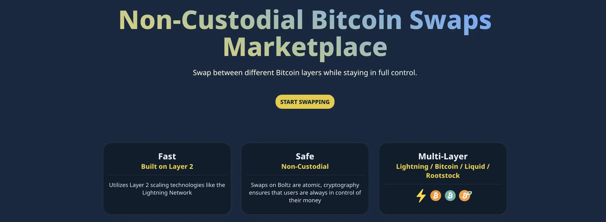


För att överföra medel mellan Bitcoin on-chain och Lightning Network krävs i allmänhet antingen manuell öppning av Lightning-kanaler (tekniskt och kostsamt) eller användning av centraliserade swapplattformar med kundkännedom. SwapMarket erbjuder ett alternativ: förtroendefria atomära swappar via konkurrenskraftiga leverantörer, utan KYC.


Innovation: Även om leverantörerna är mellanhänder garanterar HTLC (*Hash Time Locked Contracts*) matematiskt att dina medel förblir under din kontroll. Sammanslagningen av flera leverantörer (Boltz, ZEUS Swaps, Eldamar, Middle Way) skapar priskonkurrens. Interface webb öppen källkod själv värd.


## Vad är SwapMarket?


SwapMarket är en aggregator med öppen källkod som lanserades 2024 och fungerar som en jämförelsemekanism för Bitcoin/Lightning-swapleverantörer. Användaren jämför direkt villkor (avgifter, likviditet, limiter) och väljer den optimala leverantören.


### Teknisk arkitektur


**Frontend på klientsidan**: 100% klientapplikation (fork Boltz Web App) hostad på GitHub Pages. Koden körs i webbläsaren utan backend-server. Historik lagras lokalt (cookies/cache). Offentlig och granskningsbar källkod.


**Upptäckt av leverantör** : Hårdkodad lista i `src/configs/mainnet.ts`. Nya leverantörer läggs till via Pull Request eller e-post.


**Oberoende backends**: Varje leverantör driver sin egen Boltz-backend. Gränssnittet frågar API:erna i realtid för att jämföra offerter direkt.


**HTLC Atomic Swaps**: Hash Time Locked Contracts garanterar atomicitet: antingen genomförs swappen eller så återfår varje part sina medel. Motpartsrisk elimineras matematiskt.


### Filosofi


SwapMarket minskar centraliseringen genom att skapa konkurrens mellan leverantörer om avgifter och likviditet. Ingen KYC, öppen källkod, självvärd kod, multiplicering av oberoende operatörer för att undvika enskilda misslyckanden.


## Huvudsakliga egenskaper


### Leverantörens marknadsplats


Gränssnittet visar alla aktiva leverantörer: leverantörens namn, tillämpade avgifter (procentuella och/eller fasta), lägsta/maximala tillgängliga belopp och swapptyper som stöds. Programmet ställer direkta frågor till API:erna för varje leverantör som refereras till i konfigurationsfilen för att hämta offerter i realtid. Konkurrensen mellan leverantörerna garanterar optimala priser, i allmänhet omkring 0,5% för standardswappar.


### Dubbelriktade swappar


**Swap-in (on-chain → Blixt)**: Konvertera on-chain BTC till Lightning satoshis. Användningsfall: driva en mobil wallet Lightning, få inkommande kapacitet på en nod eller ha omedelbar likviditet.


**Byt ut (Lightning → on-chain)**: Konvertera Lightning satoshis till on-chain BTC. Användningsfall: töm en wallet Lightning till kylförvaring eller ombalansera likviditeten mellan lager.


### Säkerhet och återhämtning


**Trustless atombyten**: HTLC garanterar att antingen utbytet genomförs i sin helhet eller att varje part får tillbaka sin insats. Motpartsrisken är matematiskt eliminerad.


**Återbetalningsmekanism**: Varje swap har en tidslåsning. Om bytet misslyckas återbetalas pengarna automatiskt efter utgången. Användaren behåller alltid möjligheten att återkräva sina bitcoins.


** Återställningsnycklar **: SwapMarket låter dig exportera återställningsnycklar för pågående byten. I händelse av ett problem, kan dessa nycklar användas för att slutföra eller avbryta ett byte från någon enhet.


## Installation och åtkomst


### Interface webb


SwapMarket kräver ingen installation. Åtkomst sker via webbläsare genom att besöka https://swapmarket.github.io. För maximal sekretess, använd Brave, Firefox med tillägg för antispårning eller LibreWolf. Tor Browser rekommenderas för nätverksanonymitet.


Ingen registrering, e-post eller identitetsverifiering krävs.


### Självhanterande (valfritt)


För tekniska användare som vill eliminera beroendet av den officiella domänen GitHub Pages kan SwapMarket köras lokalt :


**Via npm** :


```
git clone https://github.com/SwapMarket/swapmarket.github.io.git
cd swapmarket.github.io
npm install
npm run dev
```


**via Docker** :


```
docker run -p 3000:80 ghcr.io/swapmarket/swapmarket:latest
```


Applikationen kommer att vara tillgänglig på `http://localhost:3000`. Självhosting garanterar total kontroll över gränssnittet, eliminerar risken för censur av den officiella domänen och gör det möjligt att granska källkoden innan den körs.


### Inledande konfiguration


**Wallet Blixt**: Se till att du har en fungerande wallet Lightning (Phoenix, Zeus, BlueWallet, etc.). För inbyten kommer du att generate en Lightning-faktura. För utbyten betalar du en Lightning-faktura.


**Wallet on-chain**: För swap-ins behöver du en wallet Bitcoin on-chain för att skicka pengar. För utväxling, förbered en Bitcoin mottagningsadress.


**Möjlighet till valfri konfiguration**: SwapMarket lagrar swap historia och preferenser i webbläsarens cookies. Inget konto skapande krävs.


## Tillgång till inställningar och Rescue Key


Innan du gör dina första byten rekommenderar vi starkt att du laddar ner din **Rescue Key**. Med den här nödnyckeln kan du få tillbaka dina pengar om det uppstår ett tekniskt problem eller om du förlorar åtkomsten till din enhet.


### Parametrar för åtkomst


Från SwapMarket huvudsida, klicka på kugghjulsikonen (⚙️) längst upp till höger i gränssnittet, bredvid swapformuläret.


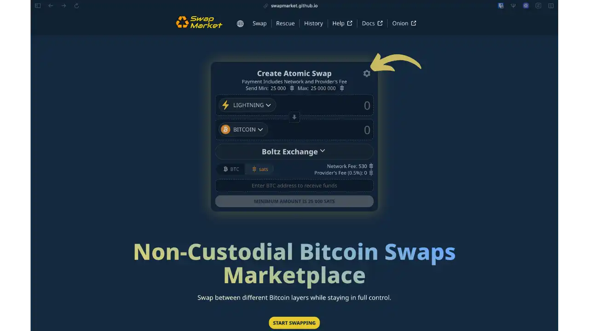


### Sidinställningar


Sidan Settings (Inställningar) öppnas och visar flera konfigurationsalternativ:


- Valör**: Val av BTC eller sats
- Decimalavgränsare**: Decimalavgränsare (, eller .)
- Ljud- och webbläsarmeddelanden**: Ljud- och webbläsarmeddelanden
- Räddningsnyckel** : Ladda ner återställningsnyckeln
- Loggar**: Visa, ladda ner eller radera loggar


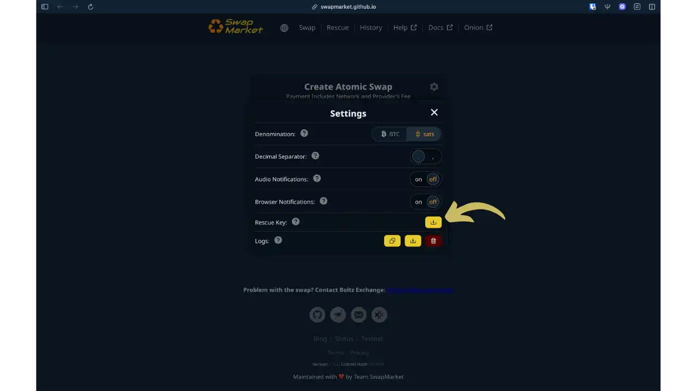


### Ladda ner Rescue Key


Klicka på knappen **Download** bredvid "Rescue Key".


**Viktiga punkter** :


- Rescue Key är en **one-stop emergency key** som fungerar för alla dina framtida swappar
- Förvara denna nyckel på en **säker och permanent** plats (lösenordshanterare, digitalt kassaskåp)
- I händelse av ett swap-problem (timeout, tekniskt fel) kan du med hjälp av denna nyckel återfå dina pengar


## Skapa en swap steg för steg


### Utbyte: Blixt → Bitcoin


Det här första exemplet visar hur man konverterar Lightning satoshis till on-chain bitcoins.


**Steg 1: Byt konfiguration


Välj swapformuläret på huvudsidan :


- LIGHTNING** (övre fältet): Ange det belopp du vill skicka i sats Lightning (exempel: 30.000 sats)
- BITCOIN** (nedre fältet): Det belopp du kommer att få visas automatiskt efter att avgifterna har dragits av (exempel: 29 320 sats)


I det nedre fältet klistrar du in din **mottagande Bitcoin-adress** där du vill ta emot pengarna. Kontrollera denna adress noggrant.


Standardleverantören är vanligtvis Boltz Exchange. Nätverksavgifter och leverantörsavgifter visas tydligt.


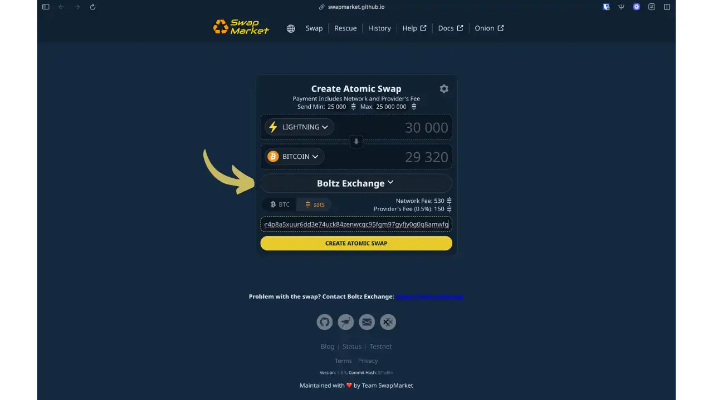


**Steg 2: Val av leverantör**


Klicka på rullgardinsmenyn för leverantör (standard: "Boltz Exchange") för att visa alla tillgängliga likviditetsleverantörer.


Ett modalt fönster öppnas och visar en jämförelsetabell:


- Status**: Green-indikator om leverantören är aktiv
- Alias**: Leverantörens namn (Boltz Exchange, Middle Way, Eldamar, ZEUS Swaps)
- Avgift**: Avgifter som tas ut av leverantören (i allmänhet mellan 0,49% och 0,5%)
- Max Swap**: Högsta belopp som accepteras för en swap


Jämför avgifter och maxbelopp och välj sedan den leverantör som passar dig bäst.


**Vänligen notera**: I gränssnittet för val av leverantör visas inte **minimibelopp** för varje leverantör. Denna information visas endast i gränssnittet för skapande av swap, efter att en leverantör har valts. Minimi- och maximibeloppen kan variera från leverantör till leverantör och kan ändras över tid. **Kontrollera alltid dessa gränser vid tidpunkten för din swap**: om det belopp du vill swappa ligger utanför en leverantörs gränser kan du välja en annan leverantör som är mer lämplig för din transaktion.


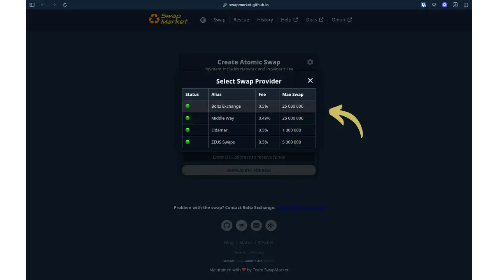


**Steg 3: Skapande av swap och betalning med blixt**


Klicka på den gula **"CREATE ATOMIC SWAP"**-knappen. SwapMarket kommer att generate en **Lightning faktura** (BOLT11) för dig att betala från din wallet Lightning.


Sidan visar :


- Swap-ID**: Unik identifierare för swap (exempel: J4ymFIMVR6Hm)
- Status**: "swap.created" (swap skapad, inväntar betalning)
- QR-kod**: Skanna den med din wallet Lightning
- Invoice Lightning**: Teckensträng som börjar med "lnbc" (exempel: lnbc300u1p50whiv...gn5dk2szgqkvfkzc)


Betala den här fakturan från din wallet Lightning (Phoenix, Zeus, BlueWallet, etc.). Det exakta beloppet som ska betalas visas (exempel: 30 000 sats).


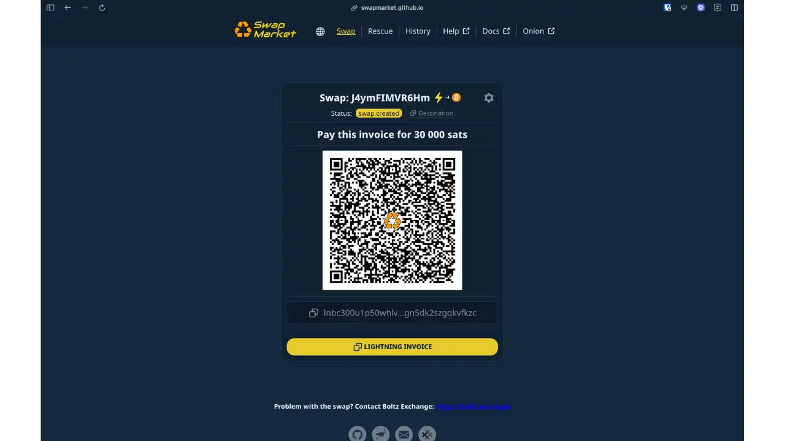


**Steg 4: Bekräftelse och godkännande**


När Lightning-betalningen har bekräftats tar SwapMarket omedelbart emot din betalning och leverantören sänder Bitcoin-transaktionen till din adress.


Statusen ändras till **"invoice.settled"** (fakturan betald) och ett bekräftelsemeddelande visas.


Dina on-chain bitcoins kommer att vara tillgängliga så snart transaktionen har bekräftats (vanligtvis några minuter till några timmar, beroende på de mining avgifter som valts av leverantören).


Du kan klicka på **"OPEN CLAIM TRANSACTION"** för att se Bitcoin-transaktionen i en blockchain-webbläsare.


### Inbyte: Bitcoin → Blixt


Det här andra exemplet visar hur man konverterar on-chain bitcoins till Lightning satoshis.


**Steg 1: Byt konfiguration


Välj swapformuläret på huvudsidan :


- BITCOIN** (övre fältet): Ange det belopp som du vill skicka i sats Bitcoin (exempel: 63 400 sats)
- LIGHTNING** (nedre fältet): Det belopp som du kommer att få visas automatiskt efter avdrag för avgifter (exempel: 62 884 sats)


I det nedre fältet klistrar du in en Lightning**-faktura (BOLT11) som genererats från din wallet Lightning, eller använder din LNURL-adress om din wallet stöder det.


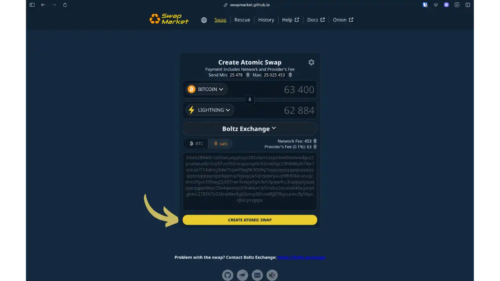


**Steg 2: Rädda nyckelkontroll**


När du har klickat på **"CREATE ATOMIC SWAP"** visas ett modalt fönster där du ombeds att verifiera din Rescue Key.


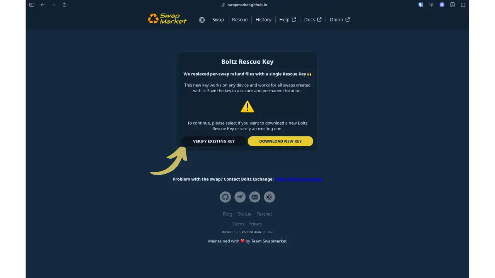


**Boltz räddningsnyckel**: Eftersom du redan har laddat upp din återställningsnyckel under den första konfigurationen (se föregående avsnitt) klickar du på knappen **"VERIFY EXISTING KEY"** för att importera den nyckel du har sparat.


Välj den tidigare nedladdade Rescue Key-filen. Efter en lyckad verifiering växlar gränssnittet automatiskt till nästa steg.


**Steg 3: Bitcoin** insättningsadress


SwapMarket genererar nu en **unik Bitcoin-adress** som innehåller HTLC-avtalet som är kopplat till din Lightning-faktura.


Sidan visar :


- Bytes-ID**: Unik identifierare (exempel: 1kGmB6JyGqU4)
- Status**: "invoice.set" (fakturan är klar, inväntar betalning Bitcoin)
- QR-kod**: Bitcoin depåadress
- Bitcoin** adress: Börjar vanligen med "bc1p..." (exempel: bc1p5mvtwxapjkds...9d4n9f)
- Varning i gult** : "Se till att din transaktion bekräftas inom ~24 timmar efter skapandet av denna swap!"


Denna period på ~24 timmar är **timeout** för HTLC-kontraktet. Om din Bitcoin-transaktion inte bekräftas inom denna tidsram kommer bytet att misslyckas och du måste använda din Rescue Key för att få tillbaka dina pengar.


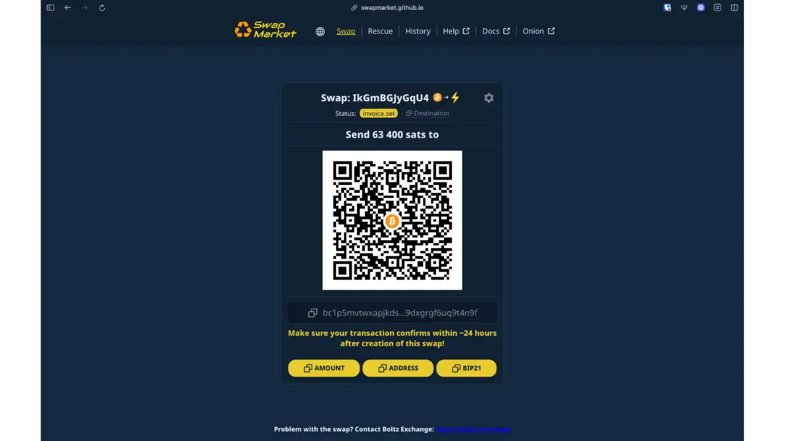


Du kan kopiera adressen genom att klicka på knappen **"ADDRESS"** eller skanna QR-koden direkt från din wallet on-chain.


**Steg 4: Skicka bitcoins**


Från din wallet Bitcoin on-chain, skicka **exakt** det belopp som anges (t.ex. 63 400 sats) till den adress som genererats.


**Viktigt**: Använd lämpliga mining-avgifter för att garantera snabb bekräftelse. Om avgiften är för låg och transaktionen ligger kvar i mempool efter tidsgränsen (~24 timmar) kommer bytet att misslyckas.


När transaktionen har skickats upptäcker SwapMarket att den finns i mempoolen och visar :


- Status** : "transaktion.mempool
- Meddelande**: "Transaktionen finns i mempool - Väntar på bekräftelse för att slutföra bytet"


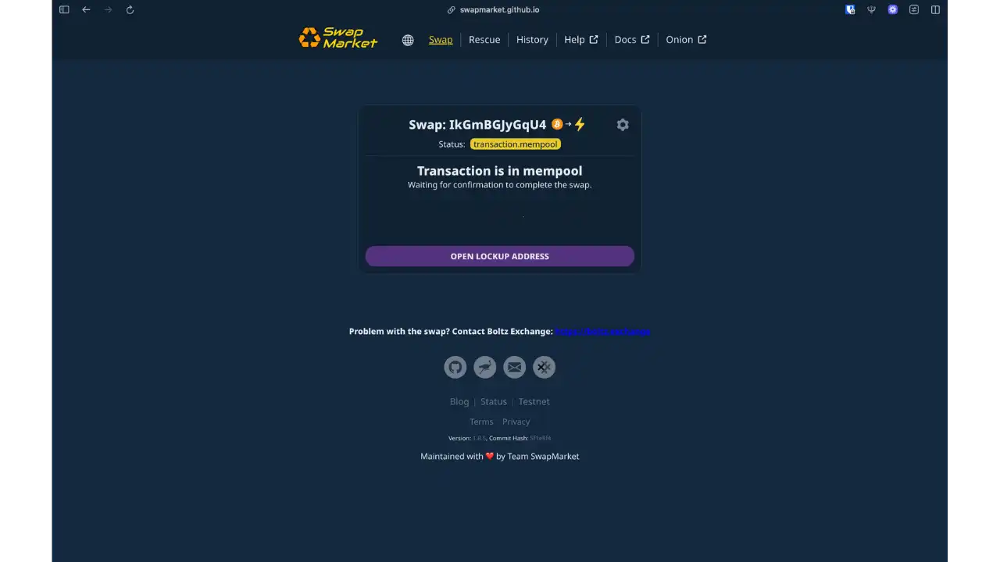


**Steg 5: Bekräftelse och mottagning med blixt**


Så snart Bitcoin-transaktionen får sin första bekräftelse betalar leverantören automatiskt din Lightning-faktura. Du får omedelbart satoshis på din wallet Lightning.


Statusen ändras till **"transaction.claim.pending"**, och ett bekräftelsemeddelande visas:


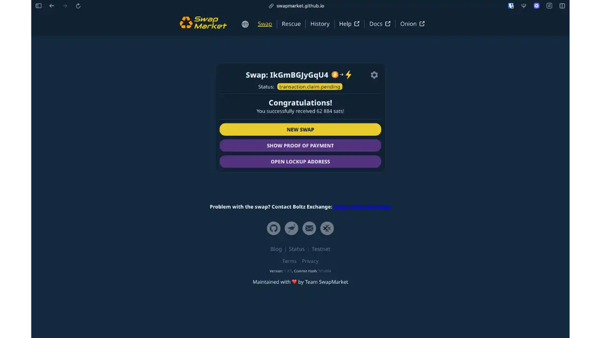


Dina Lightning satoshis finns omedelbart tillgängliga i din wallet.


## Fördelar och begränsningar


### Fördelar


**Rate competition**: Sammanslagningen av leverantörer skapar en naturlig konkurrens som drar ner avgifterna (0,49% till 0,5%).


** Konfidentialitet**: Ingen kundkännedom, 100% gränssnitt på klientsidan (ingen överföring av personuppgifter), kompatibel med Tor Browser.


** Inte vårdnadshavare**: HTLC garanterar matematiskt exklusiv kontroll över dina medel. Antingen lyckas swappen eller så får du tillbaka dina bitcoins.


**Open source self-hostable**: granskningsbar offentlig kod som kan distribueras lokalt för maximalt motstånd mot censur.


### Begränsningar


**Begränsad likviditet**: Begränsat antal aktiva leverantörer (Boltz, Eldamar, MiddleWay beroende på period). Maximala belopp kan vara begränsade.


**Utgångstid**: Timeout från 24h till 48h. Om on-chain-transaktionen inte bekräftas före utgången krävs manuell återställning.


**Interface centralisering**: Det officiella gränssnittet är självhostande men hostas på GitHub Pages. Om GitHub censurerar repot kommer åtkomst via swapmarket.github.io att blockeras (lösning: självhosting).


**on-chain Spår**: HTLC-skript är potentiellt identifierbara genom avancerad blockkedjeanalys.


## Bästa praxis


### Säker konfiguration


**Ladda ner din räddningsnyckel**: Innan du gör dina första swappar ska du ladda ner din räddningsnyckel från Inställningar (se avsnittet ovan). Denna unika nyckel kommer att fungera för alla dina framtida swappar, så att du kan få tillbaka dina pengar om det skulle uppstå problem.


** Använd Tor Browser **: För maximal sekretess, få tillgång till SwapMarket via Tor Browser för att dölja din IP-adress.


** Överväg självhosting **: För tekniska användare, kör din egen SwapMarket instans eliminerar beroendet av den officiella GitHub Pages domän.


### Optimering av byten


**Håll ett öga på mempoolen**: Kontrollera mempool.space före ett byte. Välj tider med låg aktivitet för att minimera mining-kostnaderna.


**Kontrollera adresser**: Vid byten ska du noggrant kontrollera din mottagaradress. Använd kopiera och klistra in och kontrollera de första 5 och de sista 5 tecknen.


**Testa med små belopp**: Börja med den minsta tillåtna mängden (25 000-50 000 sats). Öka gradvis när du behärskar processen.


**Dokumentera dina swappar**: Anteckna varje swaps ID, inlösenadress och utgångsdatum. Denna information underlättar spårning och återställning i händelse av ett tekniskt problem.


### Strategi för användning


**Balansera ditt kassaflöde**: Använd SwapMarket för att justera din fördelning mellan on-chain (sparande, långsiktig säkerhet) och Lightning (dagliga utgifter, omedelbara betalningar) enligt dina verkliga behov.


** Beräkna lönsamhet**: För permanenta Lightning-likviditetsbehov, jämför den kumulativa kostnaden för upprepade swappar jämfört med att öppna en Lightning-kanal direkt. SwapMarket utmärker sig för engångsjusteringar, inte nödvändigtvis för stora regelbundna flöden.


## SwapMarket vs Boltz: Vad är skillnaden?


### Boltz: Teknik kontra service


**Boltz är en öppen källkodsteknik** (`boltz-backend` på GitHub) som implementerar atombyten via HTLC mellan Bitcoin, Lightning och Liquid.


**Kritisk punkt**: Alla SwapMarket-leverantörer (Boltz Exchange, ZEUS Swaps, Eldamar, Middle Way) distribuerar sin egen instans av Boltz backend. Den underliggande tekniken är därför identisk. En sårbarhet i Boltz backend skulle potentiellt kunna påverka alla leverantörer, men systemets öppna källkod gör det möjligt för gemenskapen att granska.


**Boltz Exchange** är en enskild tjänst som drivs av Boltz-teamet, medan **SwapMarket** samlar flera leverantörer som alla använder Boltz-teknik, vilket skapar en konkurrenskraftig prissättningsmiljö.


Se våra handledningar för Boltz och Zeus Swap för mer information:


https://planb.academy/tutorials/exchange/centralized/boltz-34ad778e-6dc7-41c2-8219-e11e3361a43d

https://planb.academy/tutorials/exchange/centralized/zeus-swap-b6732907-b5d8-43ea-85e3-9dcd6e6abe47

### Viktiga skillnader


| Aspekt       | Boltz Exchange       | SwapMarket                           |
| ------------ | -------------------- | ------------------------------------ |
| Natur         | Unik tjänst          | Multi-leverantörsaggregator          |
| Leverantörer  | Endast Boltz         | Boltz, ZEUS, Eldamar, Middle Way     |
| Konkurrens    | Fasta avgifter       | Fri konkurrens                       |
| Gränssnitt    | boltz.exchange       | swapmarket.github.io (självhostningsbart) |
| Säkerhet      | Non-custodial (HTLC) | Non-custodial (HTLC)                 |

**SwapMarket fördelar**: Priskonkurrens, diversifiering av backend-instanser, jämförelse i realtid.


**Tekniska alternativ** (inte kompatibla med SwapMarket): Lightning Loop (Lightning Labs), Muun Wallet, NLoop, Breez Wallet. Dessa lösningar använder sina egna implementeringar av undervattensbyten.


**Rekommendation**: Använd Boltz Exchange för enkelhetens skull eller SwapMarket för att optimera kostnaderna genom konkurrens. Båda är likvärdiga i säkerhet (HTLC är inte frihetsberövande).


## Slutsats


SwapMarket underlättar Bitcoin/Lightning-utbyten genom att samla flera leverantörer i ett enda gränssnitt. HTLC-arkitekturen garanterar swapparnas icke-frihetsberövande karaktär, avsaknaden av KYC bevarar sekretessen och den självhanterliga öppna källkoden förstärker motståndet mot censur.


Konkurrensen mellan leverantörerna förbättrar priserna och multiplicerar likviditetskällorna. För att optimera hanteringen i två lager (on-chain-besparingar, Lightning-kostnader) är SwapMarket ett praktiskt verktyg som bevarar den finansiella suveräniteten och sekretessen.


## Resurser


### Officiell dokumentation


- [SwapMarket - Webbapplikation] (https://swapmarket.github.io)
- [GitHub SwapMarket] (https://github.com/SwapMarket/swapmarket.github.io)
- [Teknisk dokumentation] (https://docs.boltz.exchange/)
- [Guide för självhosting](https://github.com/SwapMarket/swapmarket.github.io/blob/main/README.md)


### Relaterade projekt


- [Boltz Exchange](https://boltz.exchange) - Original atombytesservice
- [ZEUS Swaps](https://zeusln.com) - leverantör av blixtbyten