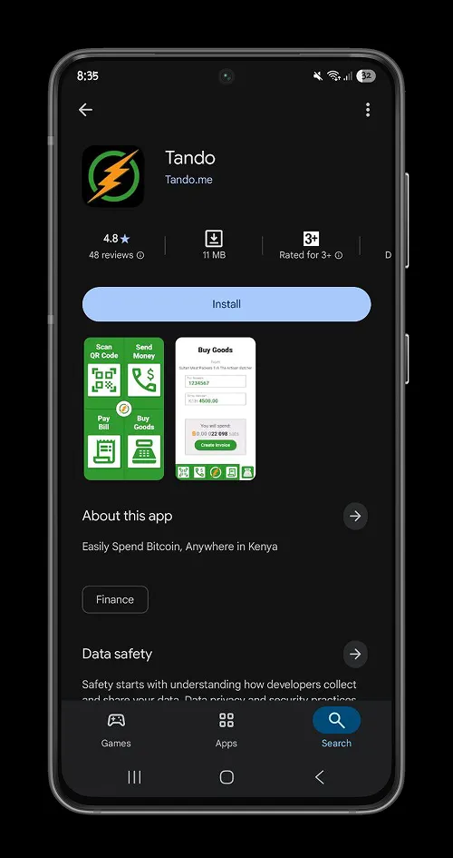
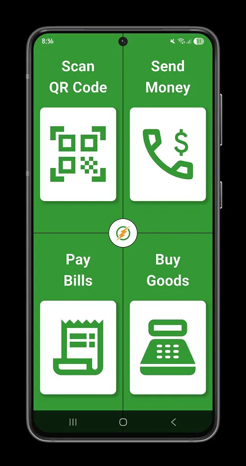
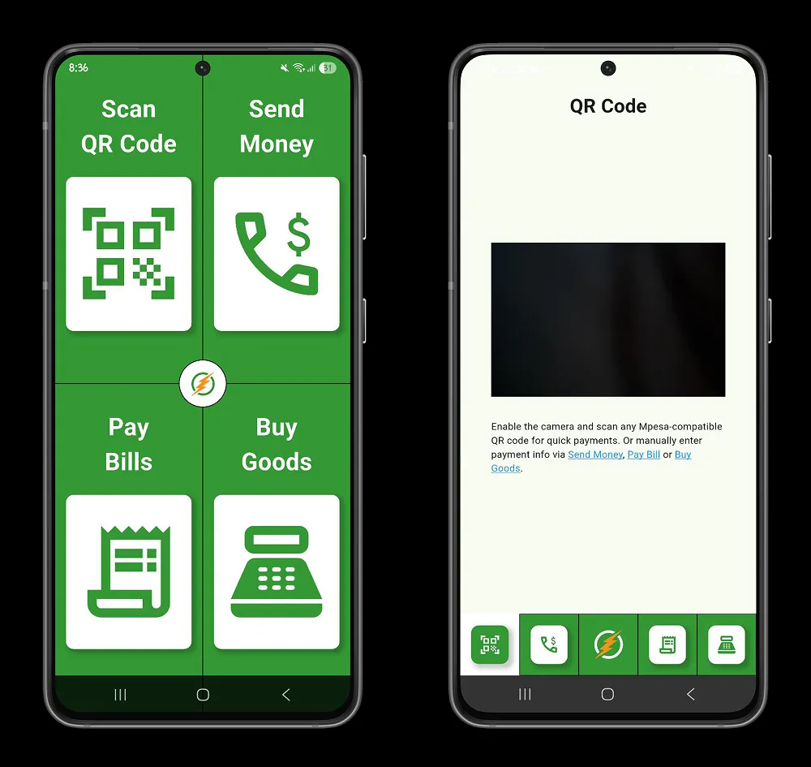
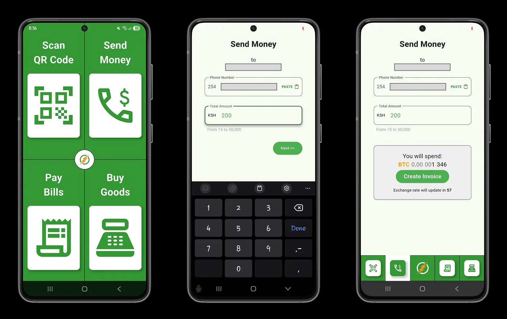
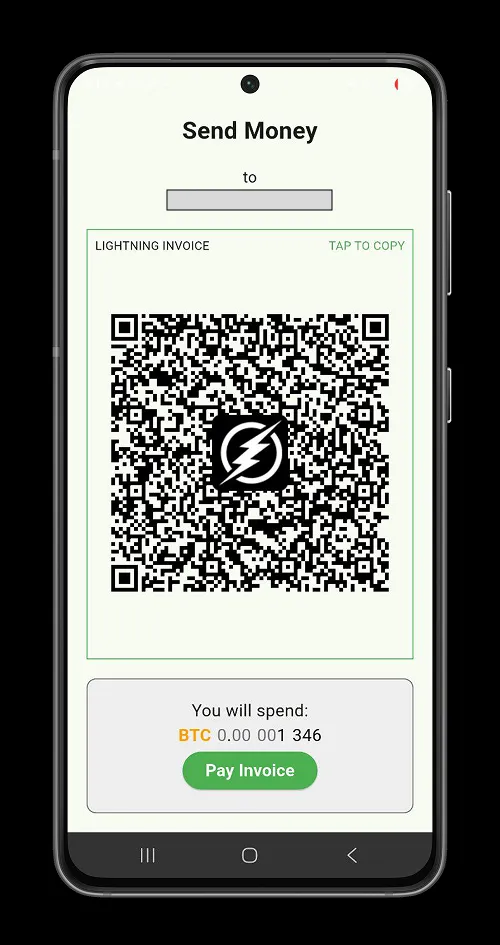
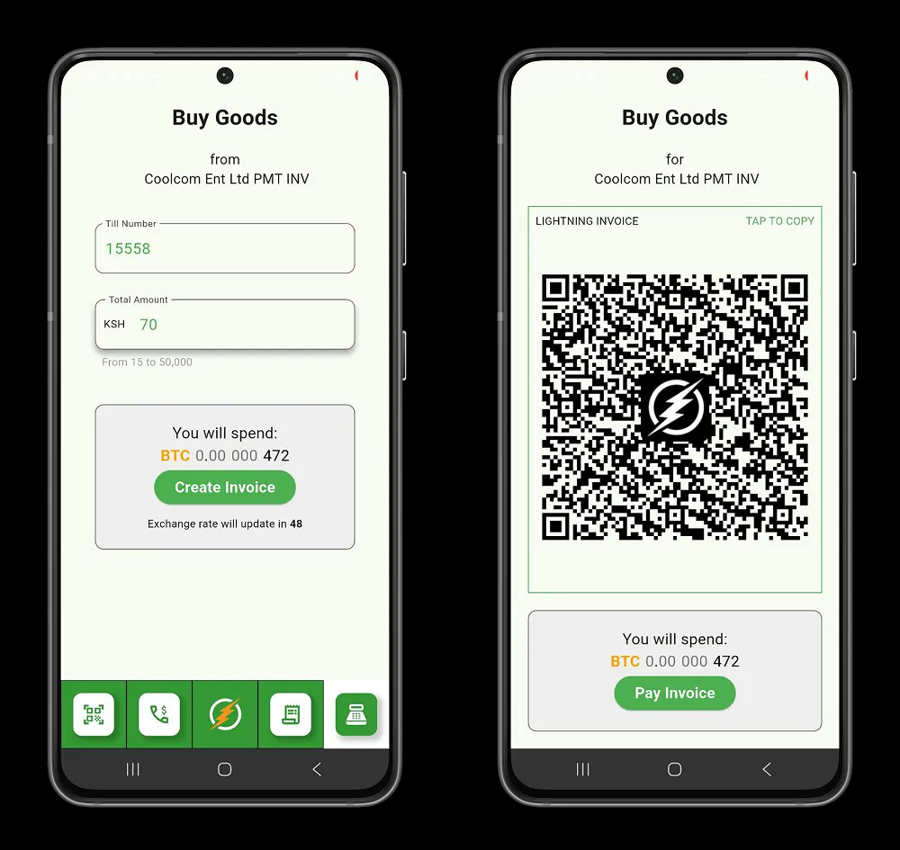
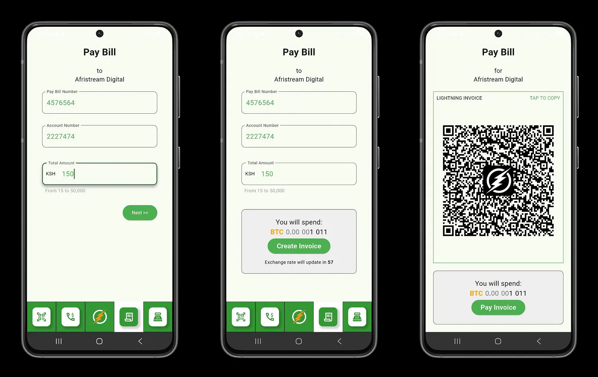
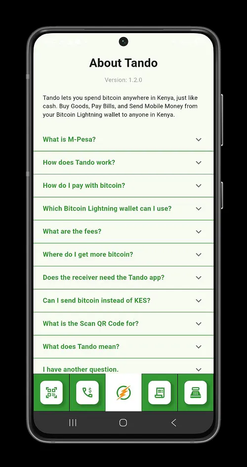

Bitcoin技術は、より多くのアフリカの地域社会が、自国の主権を確立・強化し、経済的・地域的障壁を取り除くことで貿易の質を向上させるために頼りにしている技術革新である。

2023年、**フェミ・ロンゲ**のプレゼンをきっかけに、**アフリカBitcoin会議**でケニアのスーパーアプリ、タンドの冒険が始まる：*アフリカ人はアフリカ人のためのBitcoinソリューションを創造する必要がある*。2024年、Tandoはケニアに配備され、Lightning Networkを通じてBitcoinの日常的な利用を促進し続ける。

## タンドを始める

TandoはAndroidとiOSプラットフォームで利用可能なモバイルアプリケーションで、ケニアのどこにいてもBitcoinを利用することができます。このチュートリアルでは、Androidプラットフォームに焦点を当てます。ただし、以下のプロセスはiOSプラットフォームでも有効です。

タンドーは、2つの技術に基づくExchangeの媒体である：

- Lightning Network：Bitcoin：Layerは、即座に、事実上無料で支払いができる。
- M-Pesa：ケニアで最も人気のあるモバイルマネー。

利用者の個人情報は一切不要で、本人確認も必要ない。Tandoを利用すれば、プライバシーを守りながら取引を行うことができる。

ケニアでは、ほとんどの商店、スーパーマーケット、サービス・プロバイダー、金融取引はM-Pesaを使って行うことができる。Lightning NetworkとM-Pesaのギャップを埋めることで、TandoはM-Pesaが利用可能な場所であればどこでもビットコインを利用することができ、受取人はケニア・シリング（KES）を受け取ることができる。

タンドーでは、Bitcoinを：

- 商品やサービスの支払い
- 送金
- 請求書の支払い

Tandoは、直感的でミニマルなInterfaceで、どのLightning Walletでもケニア・シリング（KES）での支払いを可能にします。これは、外国人が現金を持たずにケニアに来て、ライトニングWalletを使って普通に生活する機会を意味する。Tandoはまた、Bitcoinを使用するための適切なフレームワークを提供し、ケニアのコミュニティでの採用を奨励している。

## タンドの使用

Tandoでは、ビットコインを使って、ケニアでM-Pesaが購入できるものなら何でも買うことができる。しかも、取引手数料はM-Pesaのネイティブ取引に比べて実質的にゼロです。Tandoを利用する際、あなたはLightning WalletでKES相当額を支払い、Tandoはそのインフラを利用して、Lightning支払いをケニアシリング（KES）に変換し、あなたが指定したM-Pesa番号に合計額を送ります。

https://planb.network/tutorials/wallet/mobile/blitz-wallet-794bdac4-1af4-49d5-9ea5-abb8228ca196

https://planb.network/tutorials/wallet/mobile/phoenix-0f681345-abff-4bdc-819c-4ae800129cdf

https://planb.network/tutorials/wallet/mobile/wallet-of-satoshi-39149d86-e42b-4e8f-ae9f-7e061e7784f7

- **スキャンして支払い**：

スキャン・トゥ・ペイは、アプリケーションの自動支払いオプションのひとつです。加盟店から入手可能なM-Pesaコードをスキャンし、支払い金額を入力して、生成されるLightning Invoiceの支払いに進みます。

- **ケニアへの送金**：

タンドーの送金オプションは、世界中のどこからでもケニアへ送金することができます。そのため、あなたのLightning Walletを使って、法外な手数料なしで、国境を越えた、大陸間の取引をケニアへ行うことができます。

送金**オプション**を選択し、受取人の番号を入力します。送金額（15～50,000KES）を入力し、この支払いに関連するライトニングInvoiceを作成します。

Lightning Walletから請求書を支払うと、Tandoがケニア・シリング（KES）に換金し、指定された受取人に送ります。

- **請求書の支払い**：

支払いたいInvoiceの番号を入力し、関連するライトニングInvoiceの支払いに進む。

- **商品を買う** ：

Tandoを使って直接買い物をする。加盟店番号とお買い上げ合計金額をケニア・シリング（KES）で入力し、generateを押すと、ライトニングInvoiceが表示されます。

アプリケーションのメニューには、タンドーのビジョンと価格をよりよく理解するために必要なすべての情報もあります。

ガーナ、ナイジェリア、ケニアでBitcoinを使った決済を目指すガーナのイニシアティブ、BitSpendaを発見してほしい。

https://planb.network/tutorials/exchange/centralized/bitspenda-34cf6f5d-4464-4f26-809f-de4af3cec5fd