در سراسر جهان، راه‌حل‌هایی در حال ظهور هستند تا استفاده از Bitcoin را دسترس‌پذیرتر و ایمن‌تر کنند. در این دسته، Vexl به خاطر رویکرد و دیدگاهش برجسته است: بازگرداندن Bitcoin به دست مردم.

Vexl یک شبکه اجتماعی همتا به همتا است که خریداران و فروشندگان Bitcoin را در سراسر جهان به هم متصل می‌کند. این شبکه نیازی به تأیید هویت ندارد و با عدم افشای هرگونه اطلاعات حساس شما، حریم خصوصی‌تان را افزایش می‌دهد.

## اولین قدم‌ها با Vexl

شروع کار با Vexl بسیار ساده است: به [وب‌سایت رسمی](https://vexl.it) مراجعه کنید و سپس اپلیکیشن موبایل را بر روی گوشی iOS یا Android خود دانلود کنید.

⚠️ دانلود برنامه موبایل از وب‌سایت رسمی از کپی‌برداری جعلی پلتفرم جلوگیری کرده و یکپارچگی داده‌های شما را تضمین می‌کند.

در این آموزش، ما عمدتاً بر روی پلتفرم اندروید کار خواهیم کرد، اما کل فرآیند توضیح داده شده در زیر برای iOS نیز صدق می‌کند.

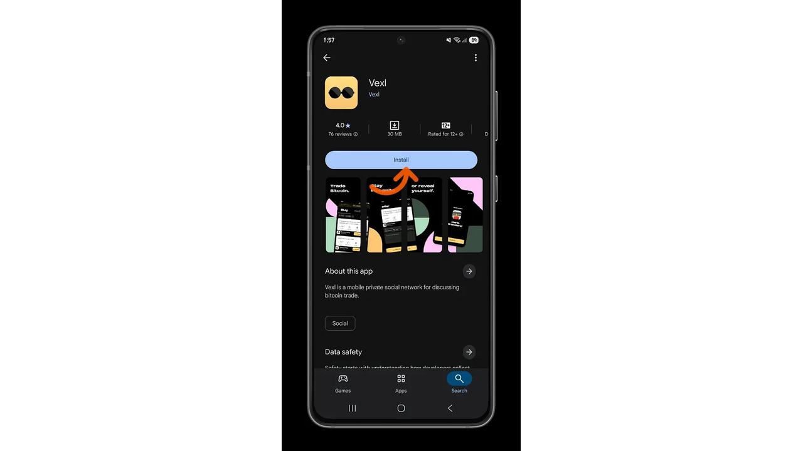

پس از نصب برنامه، با تأیید شماره تلفن خود حساب کاربری ایجاد کنید. Vexl برای حفظ ناشناس بودن و تقویت محرمانگی شما، کمترین اطلاعات ممکن را درخواست می‌کند.

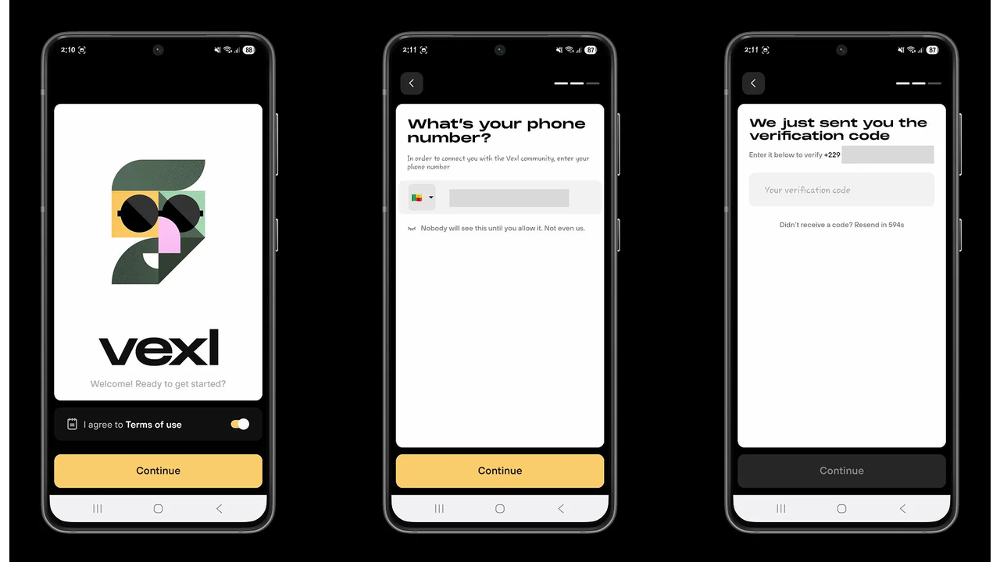

پس از تأیید حساب خود، شروع به کشف کنید که کدام اعضای شبکه در مخاطبین شما هستند. مخاطبین خود را وارد کنید و شروع به استفاده از Vexl کنید.

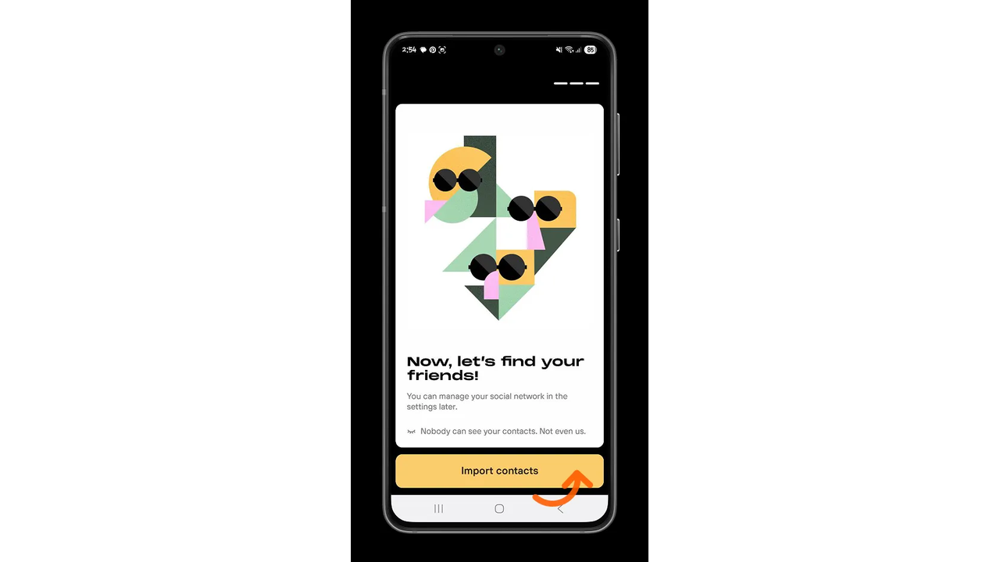

Vexl به عنوان یک بازار همتا به همتا فعالیت می‌کند و گزینه‌های متعددی را به شما ارائه می‌دهد:

- Bitcoin را با پول نقد بخرید.
- فروش Bitcoin نقدی.
- محصولی با Bitcoin بخرید.
- فروش یک محصول در Exchange برای بیت‌کوین.
- تمام پیشنهادات فروش Bitcoin را در منطقه خود ببینید.
- تمام پیشنهادات خرید Bitcoin در منطقه خود را مشاهده کنید.
- به دنبال چیزی خاص هستم.

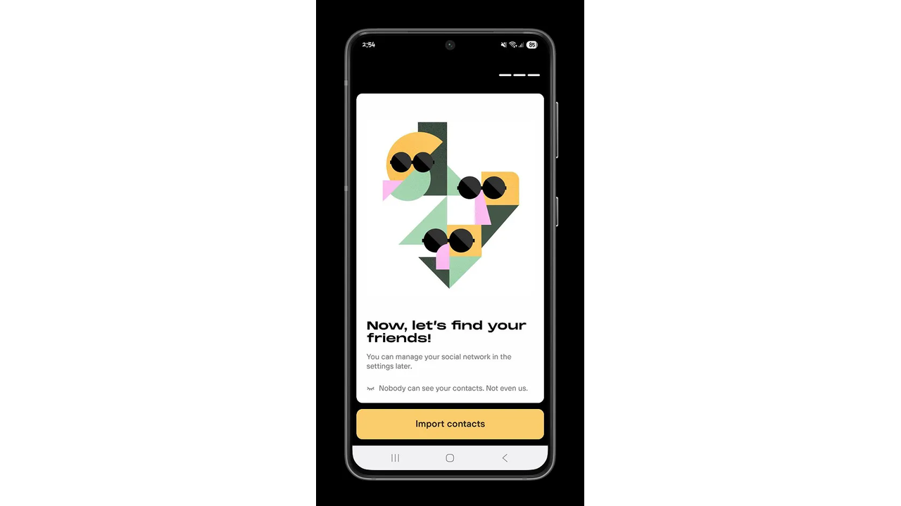

در صفحه اصلی Vexl، به محض ثبت‌نام، پیشنهاداتی در مورد چگونگی انجام عملیات خاص و تنظیماتی که می‌توانید انجام دهید تا تجربه کاربری شما روان‌تر شود، مشاهده خواهید کرد.

با کلیک بر روی آیکون **چت**، تاریخچه گفتگوهایی که با مخاطبین خود و افرادی که با آن‌ها تبادل نظر کرده‌اید را خواهید یافت.

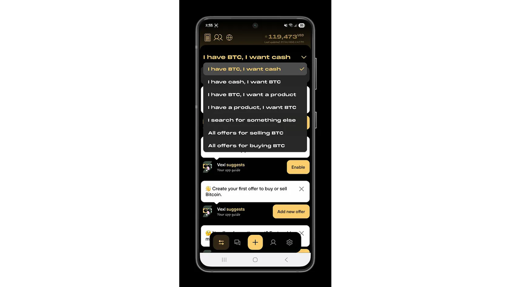

### ثبت سفارشات

Vexl یک اکوسیستم نسبتاً قابل تنظیم برای پیکربندی مبادلاتی که می‌خواهید انجام دهید، فراهم می‌کند.

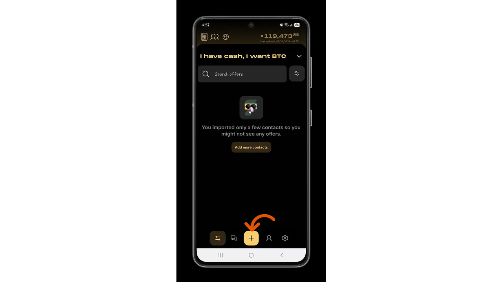

نوع لیست سفارش مورد نظر خود را انتخاب کنید، سپس مشخص کنید که در موقعیت خرید (بلند) یا فروش (کوتاه) هستید.

در این آموزش، ما بر روی مبادلات Bitcoin تمرکز خواهیم کرد.

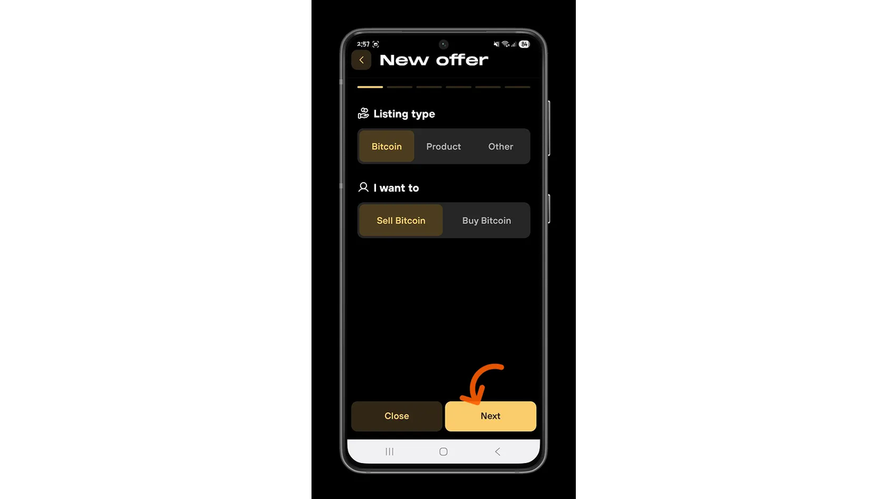

ارزی را که می‌خواهید معامله کنید انتخاب کنید، سپس مقدار معادل که می‌خواهید بخرید یا بفروشید را انتخاب کنید. شما می‌توانید از چندین عضو شبکه خرید و فروش کنید تا به مقدار مورد نظر خود برسید. همچنین می‌توانید تاریخ انقضا برای Exchange خود تعیین کنید.

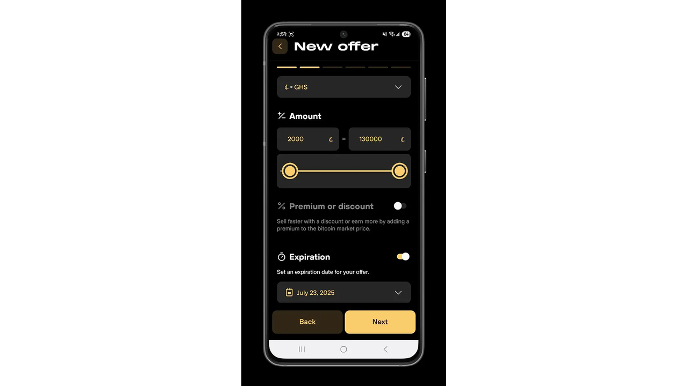

بسته به راحتی شما، می‌توانید Exchange خود را به صورت فیزیکی در یک منطقه جغرافیایی که پیدا خواهید کرد، انجام دهید یا در Vexl بمانید، با یک تماس ارتباط برقرار کنید و Exchange را به صورت آنلاین انجام دهید. وقتی صحبت از تبادلات Bitcoin می‌شود، Vexl از هر دو Lightning Network، که برای پرداخت‌های کوچک و سریع ایده‌آل است، و تراکنش‌های زنجیره اصلی هنگامی که مقادیر زیادی بیت‌کوین درگیر است، پشتیبانی می‌کند.

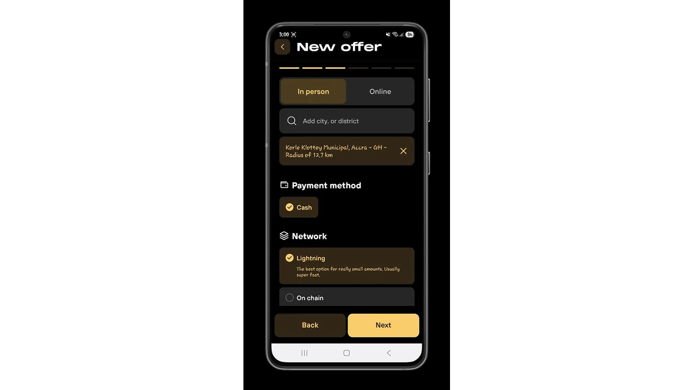

همچنین زبانی را که می‌خواهید به آن گفتگو کنید مشخص کنید و حداقل یک دلیل معتبر برای دیگر اعضای شبکه ارائه دهید تا پیشنهاد شما را جدی بگیرند.

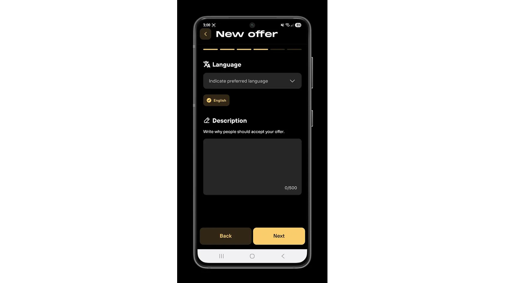

به دنبال افرادی برای مبادله در میان مخاطبان خود بگردید، یا یک قدم جلوتر بروید و مبادله را به دوستان دوستان خود گسترش دهید.

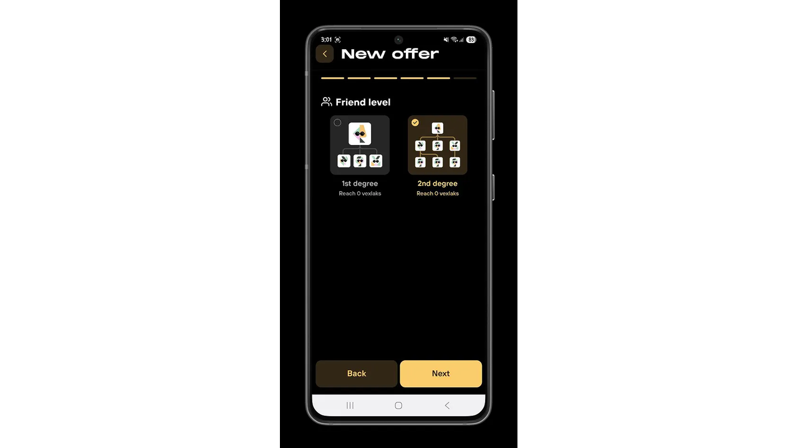

پیکربندی‌های مختلف پیشنهاد خود را بررسی کنید، سپس برای ذخیره آن تأیید کنید.

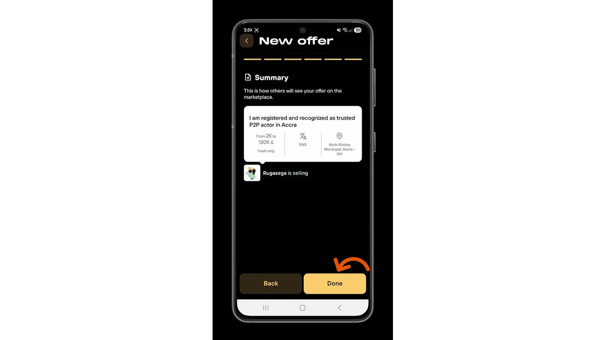

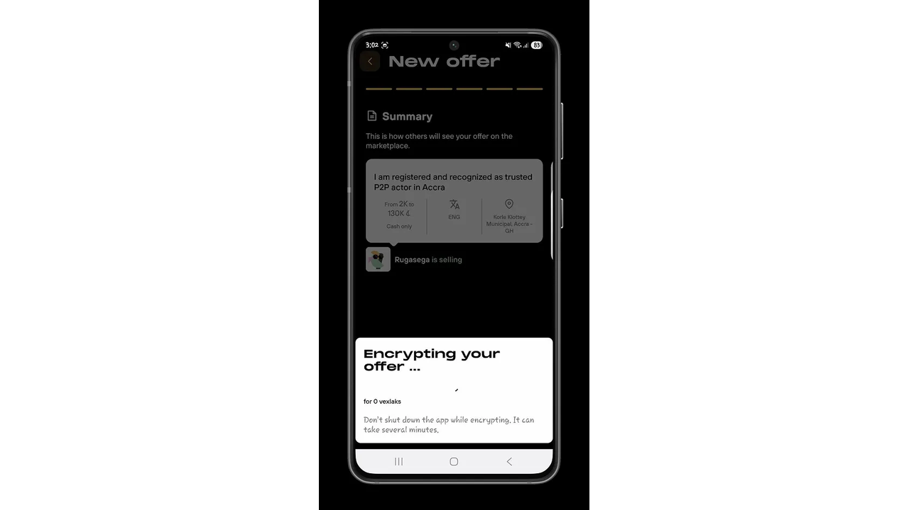

### محرمانه بودن

در تنظیمات برنامه، پیکربندی‌های مرتبط با حساب کاربری خود را خواهید یافت. در Vexl، نام کاربری شما ثابت نیست که این امر محرمانگی شما را افزایش می‌دهد: سایر کاربران نمی‌توانند تراکنش‌های شما را بر اساس نام کاربری‌تان با حساب شما مرتبط کنند.

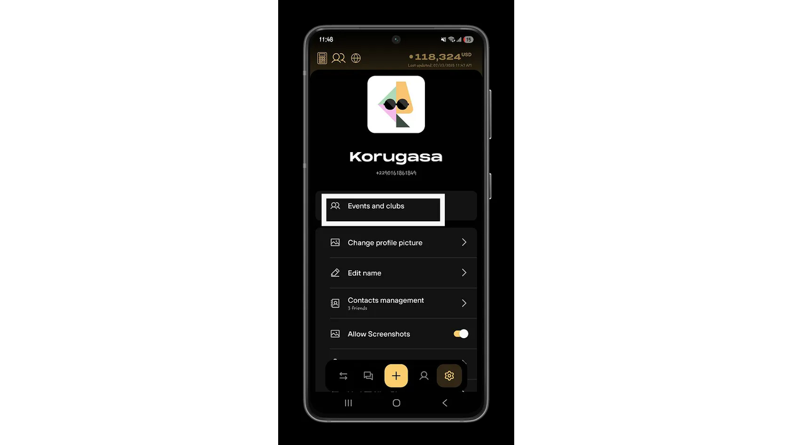

### جوامع

Vexl به شما اجازه می‌دهد به باشگاه‌هایی بپیوندید که می‌توانید با افراد بیشتری Exchange کنید، اما به روشی کمتر امن نسبت به دوستانتان و دوستان آن‌ها.

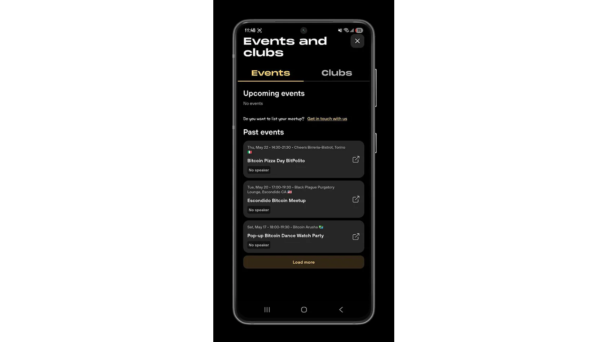

همچنین رویدادهای خبری Bitcoin را ببینید

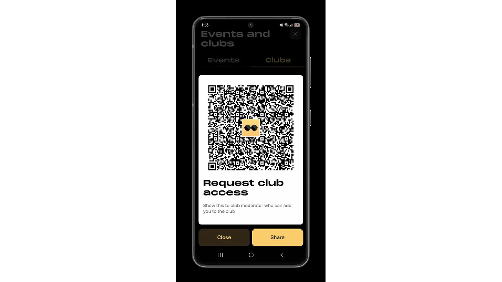

اکنون می‌توانید با Vexl به صورت ناشناس و امن بیت‌کوین مبادله کنید. برای کسب اطلاعات بیشتر، به دوره حریم خصوصی Bitcoin ما نگاهی بیندازید.

https://planb.network/courses/65c138b0-4161-4958-bbe3-c12916bc959c