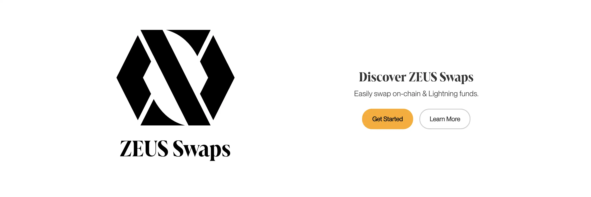
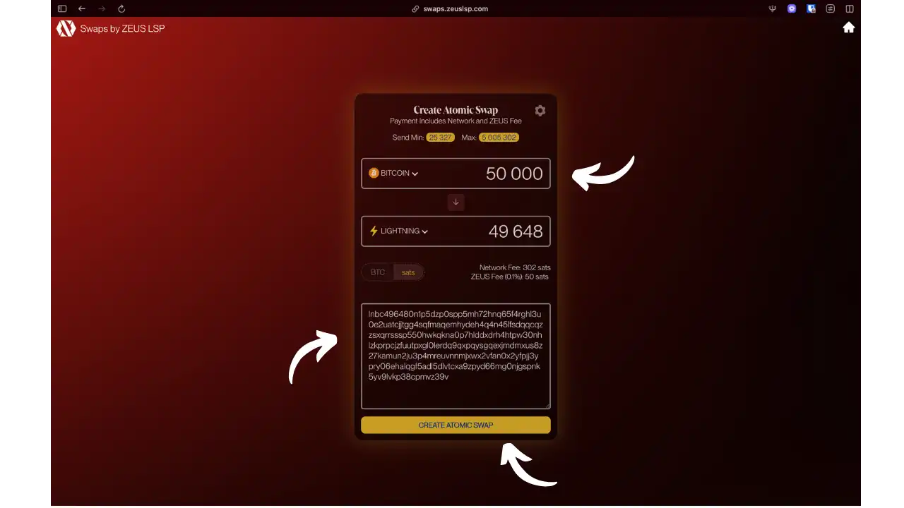
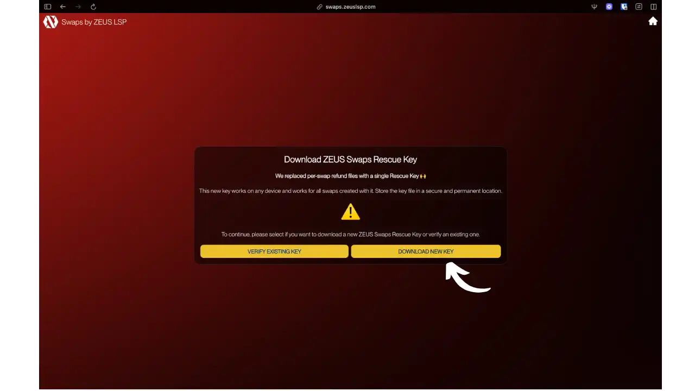
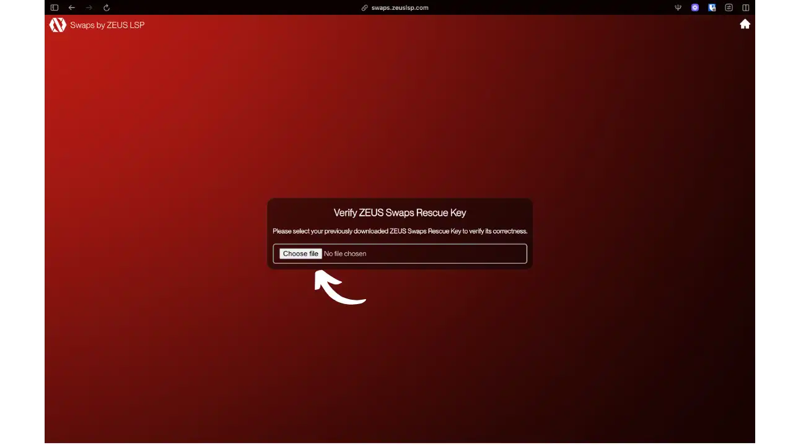
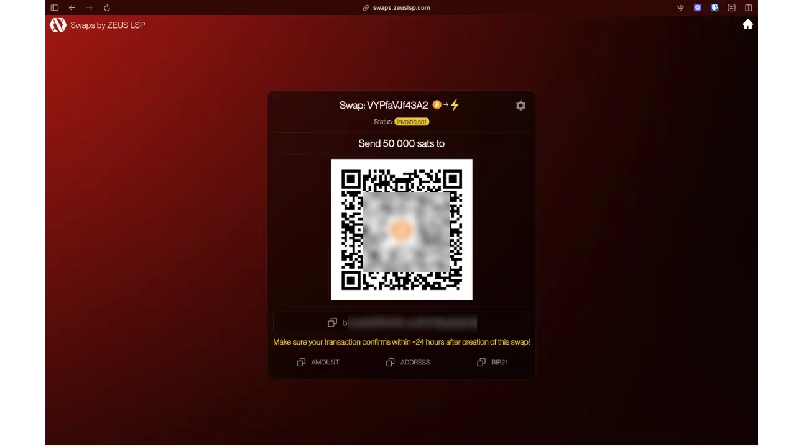
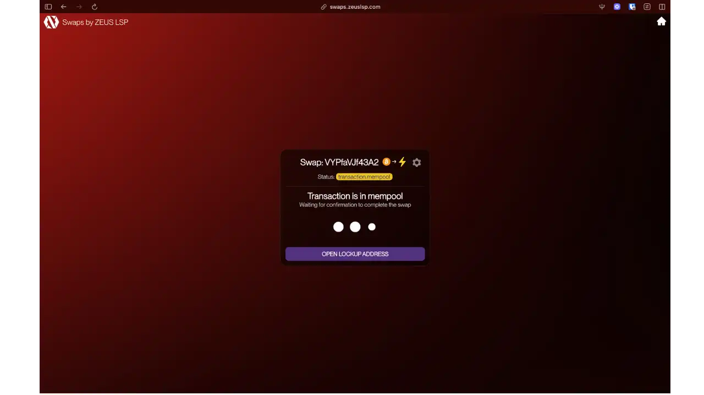
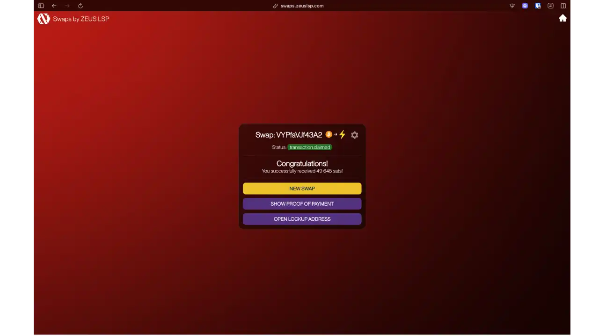
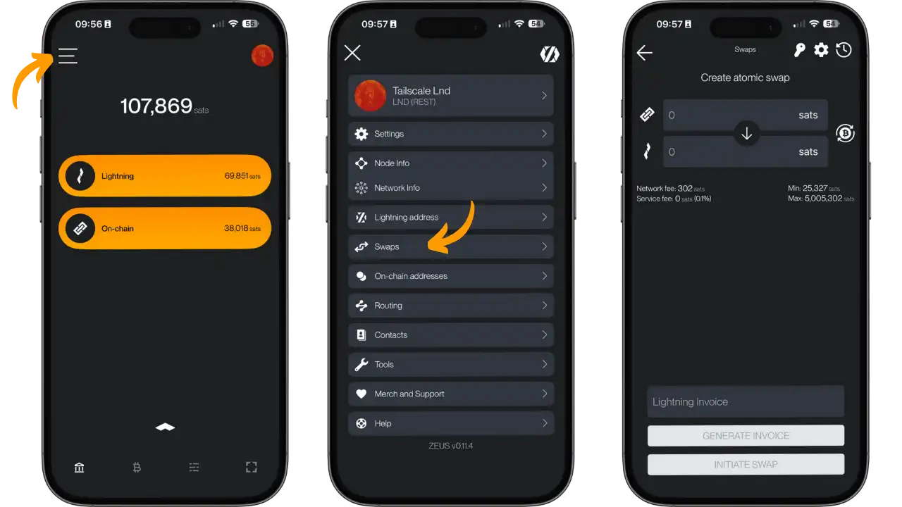
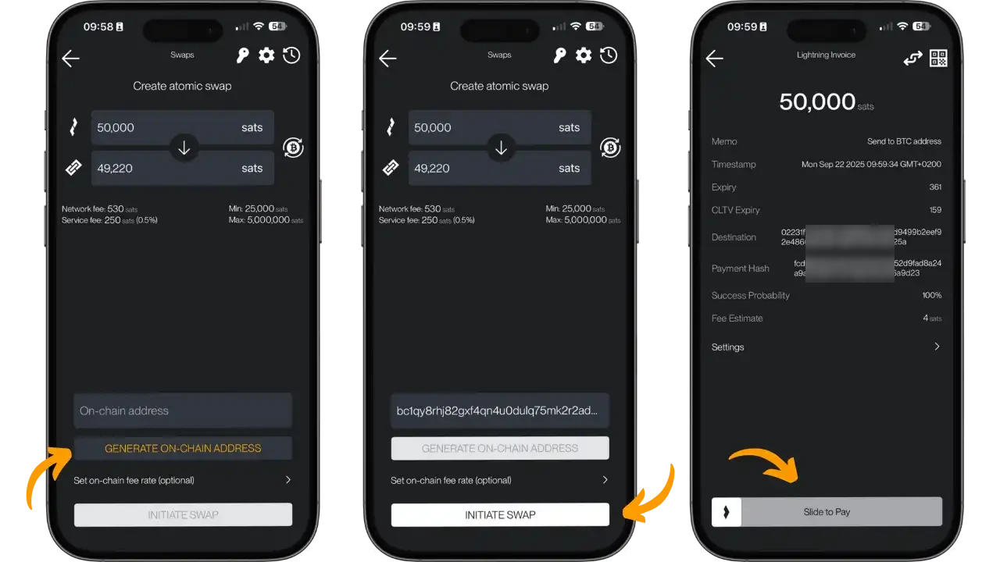
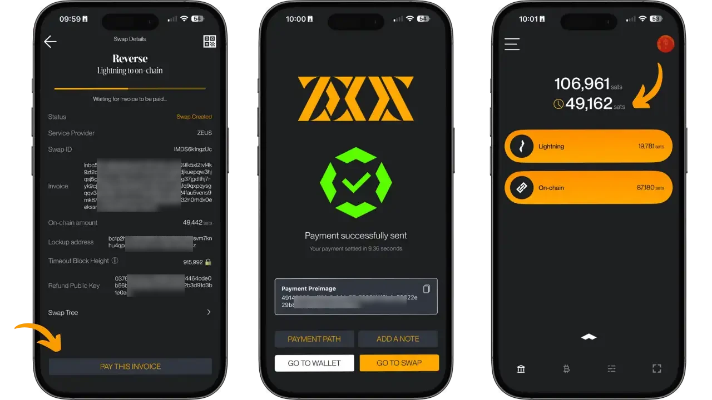

L'écosystème Bitcoin présente une dualité : le réseau principal (on-chain) offre une sécurité maximale, tandis que Lightning Network permet des transactions instantanées. Cette architecture bicouche crée un défi pratique : comment transférer efficacement des fonds entre ces deux couches sans intermédiaires centralisés ?

Le problème est concret : vous recevez un paiement Lightning, mais souhaitez le conserver en cold storage, ou inversement, vous disposez de bitcoins on-chain, mais avez besoin de liquidité Lightning. Les solutions traditionnelles impliquent l'ouverture ou la fermeture manuelle de canaux Lightning (coûteux et technique) ou des plateformes centralisées nécessitant le KYC.

Zeus Swap résout cette problématique via un service d'échange automatisé et non-custodial. Développé par Zeus LSP, il permet de convertir des bitcoins on-chain en satoshis Lightning vice-versa, sans confier vos fonds à un intermédiaire. Le processus utilise des contrats atomiques (HTLC) garantissant que l'échange s'exécute complètement ou s'annule.

L'innovation réside dans sa simplicité : quelques clics suffisent pour un échange préservant votre souveraineté financière, sans inscription ni KYC requis.

## Qu'est-ce que Zeus Swap ?

Zeus Swap est un service d'échange de liquidité développé par Zeus LSP qui permet d'effectuer des swaps atomiques entre le réseau Bitcoin principal et le Lightning Network. Il s'agit d'une infrastructure technique qui utilise les submarine swaps (échanges sous-marins) et reverse swaps (échanges inversés) pour faciliter la conversion bidirectionnelle entre BTC on-chain et satoshis Lightning, tout en préservant la nature non-custodial de l'opération.

### Architecture technique

Zeus Swap utilise la technologie open-source de Boltz pour les échanges atomiques Bitcoin/Lightning. Le protocole emploie des Hash Time Locked Contracts (HTLC) : contrats verrouillant les fonds avec deux conditions de déblocage (révélation d'un secret cryptographique ou expiration temporelle).

Pour un submarine swap (on-chain → Lightning), l'utilisateur envoie des bitcoins vers une adresse incorporant le hash d'une facture Lightning. Zeus LSP débloque ces fonds uniquement en payant la facture correspondante, révélant la préimage qui déverrouille automatiquement les bitcoins. Cette mécanique garantit l'atomicité.

Pour un reverse swap (Lightning → on-chain), l'utilisateur paie une facture Lightning de Zeus LSP, révélant une préimage permettant le déblocage d'une transaction Bitcoin préparée vers l'adresse de destination.

Pour plus de détails sur le fonctionnement du Lightning Network, n'hésitez pas à consulter notre cours dédié : 

https://planb.academy/courses/34bd43ef-6683-4a5c-b239-7cb1e40a4aeb

### Modèle économique

Zeus LSP agit comme market maker, maintenant la liquidité on-chain et Lightning pour honorer les échanges. Pour les échanges, Zeus applique des frais variables (généralement 0.1 % à 0.5 % selon la direction et les conditions) auxquels s’ajoutent les frais de minage de Bitcoin, affichés de manière transparente avant la validation.

En tant que Fournisseur de Service Lightning, Zeus optimise les coûts grâce à son expertise : ouverture de canaux à la demande, routage efficace, solutions de liquidité personnalisées.

### Intégration

Zeus Wallet intègre nativement le service, permettant des échanges sans quitter l'interface Bitcoin/Lightning. Cette intégration élimine les frictions du copier-coller entre applications.

L'interface web indépendante reste accessible pour tous portefeuilles, garantissant une flexibilité maximale d'usage.

## Fonctionnalités principales

### Swaps bidirectionnels (échanges bidirectionnels)

Zeus Swap propose deux types d'échanges :

**Submarine swaps (on-chain → Lightning)** : injectent de la liquidité Lightning depuis vos réserves Bitcoin, utiles pour alimenter un portefeuille mobile ou un nœud Lightning sans ouverture manuelle de canaux.

**Reverse swaps (Lightning → on-chain)** : convertissent des satoshis Lightning en bitcoins on-chain pour un stockage à long terme, évitant la fermeture coûteuse de canaux.

### Interfaces d'utilisation

**Interface web** (swaps.zeuslsp.com) : expérience simplifiée sans inscription, processus guidé avec affichage en temps réel des frais et des statuts.

**Intégration Zeus Wallet** : échanges directs depuis l'application, gestion automatique des factures et adresses, éliminant les erreurs de manipulation.

### Sécurité et récupération

Chaque échange génère un contrat unique avec paramètres immuables : hash Lightning, délai d'attente, adresse de remboursement. En cas de défaillance, la récupération est automatique via l'adresse fournie, indépendamment de Zeus LSP.

**Zeus Swaps Rescue Key** : lors d'un échange on-chain → Lightning, Zeus génère automatiquement une clé de récupération universelle remplaçant les anciens fichiers de remboursement individuels. Cette clé unique fonctionne sur tout appareil et pour tous les échanges créés avec elle. Il est crucial de télécharger et de sauvegarder cette clé dans un emplacement sécurisé pour pouvoir récupérer vos fonds en cas d'échec de l'échange.

### Optimisation du réseau

Zeus Swap ajuste automatiquement les délais d'expirations et les frais de minage selon les conditions du réseau. Les utilisateurs Zeus bénéficient d'options avancées : choix LSP, délais personnalisés, compatibilité autres services (Boltz).

## Installation et utilisation

### Méthodes d'accès

**Interface web** (swaps.zeuslsp.com) : solution universelle compatible tous portefeuilles, sans installation, idéale pour usage occasionnel.

**Application Zeus** (iOS/Android) : expérience intégrée combinant portefeuille et échanges, adaptée aux utilisateurs réguliers.

Vous pouvez consulter notre tutoriel Zeus pour en apprendre davantage sur ce portefeuille complet : 

https://planb.academy/tutorials/wallet/mobile/zeus-embedded-c67fa8bb-9ff5-430d-beee-80919cac96b9

### Configuration web

**On-chain → Lightning** : Le processus débute par la configuration de l'échange sur l'interface web Zeus Swap. L'utilisateur peut utiliser la flèche placée entre les champs on-chain et Lightning pour inverser le sens de l'échange.

*Interface de Zeus Swap : sélection du montant (50 000 sats → 49 648 sats après frais) avec affichage transparent des frais réseau (302 sats) et service Zeus (50 sats).*

Pendant le processus, Zeus vous propose de télécharger la clé de récupération universelle :

*Dialogue de téléchargement de la Zeus Swaps Rescue Key - clé universelle remplaçant les anciens fichiers de remboursement individuels.*

Si vous possédez déjà une clé, Zeus permet de la vérifier :

*Interface de vérification d'une Zeus Swaps Rescue Key existante pour s'assurer de sa validité.*

Une fois configuré, Zeus génère l'adresse Bitcoin de dépôt et affiche les instructions :

*Page de finalisation de l'échange : QR code et adresse Bitcoin pour l'envoi de 50 000 sats, avec rappel du délai d'expiration de 24h.*

L'échange passe ensuite en attente de confirmation de la réception des bitcoins :

*Statut "Transaction in mempool" - attente de la confirmation Bitcoin pour finaliser l'échange.*

Une fois confirmé, l'échange se finalise automatiquement :

*Confirmation de réussite : 49 648 sats reçus sur Lightning après déduction des frais de réseau et de service.*

### Utilisation de l'application Zeus

**Lightning → on-chain** : L'application Zeus offre une expérience intégrée pour les échanges inversés (Lightning vers Bitcoin).

*Écran principal Zeus montrant les soldes Lightning (69 851 sats) et on-chain (38 018 sats), accès aux échanges via le menu latéral.*

*Interface de création de swap reverse : 50 000 sats Lightning → 49 220 sats on-chain, avec frais réseau (530 sats) et service (250 sats) clairement affichés. L'utilisateur peut soit saisir manuellement une adresse Bitcoin de réception, soit en générer une automatiquement depuis le portefeuille Zeus via le bouton "GENERATE ON-CHAIN ADDRESS".*

*Écrans de finalisation : écran de paiement de la facture Lightning avec "PAY THIS INVOICE", confirmation de paiement Lightning réussi en 9,96 secondes, et état des soldes avec les 49 162 sats en attente de confirmation.*

### Surveillance et sécurité

Chaque échange possède un identifiant unique avec suivi temps réel. Affichage progression complète, alertes automatiques pour délais d'expiration. Recommandations frais automatiques selon conditions réseau.

## Avantages et limitations

### Avantages

- **Simplicité** : échange en quelques clics contre manipulation manuelle de canaux
- **Non-custodial** : aucun KYC, pas de compte, fonds jamais confiés à un tiers
- **Transparence** : frais affichés explicitement avant validation (0.1% à 0.5% + minage selon tests utilisateur - vérifiez les frais actuels à chaque échange)
- **Intégration mobile** : expérience native dans Zeus Wallet

### Limitations

- **Délais d'expiration** : 24-48h maximum, échec si Bitcoin non confirmé à temps
- **Limites de montant** : minimum 25 000 sats, liquidité Zeus LSP variable selon conditions
- **Traces on-chain** : scripts HTLC potentiellement identifiables par analyse blockchain
- **Confirmations requises** : minimum 10 minutes pour validation Bitcoin

## Bonnes pratiques

### Délais et frais

- Surveillez mempool.space pour choisir les moments de faible congestion
- Préférez week-ends et heures creuses pour réduire les frais de minage
- Calculez la rentabilité : petits montants vs ouverture canal direct

### Sécurité

- Vérifiez minutieusement les adresses Bitcoin (copier-coller recommandé)
- **Sauvegardez la Zeus Swaps Rescue Key** : téléchargez et stockez la clé de récupération en lieu sûr
- Sauvegardez : ID contrat, adresse remboursement, délai expiration
- Utilisez des frais de minage appropriés pour une confirmation dans les délais

### Stratégie d'usage

- Équilibrez liquidité on-chain/Lightning selon vos besoins
- Zeus Swap pour ajustements ponctuels, canaux directs pour besoins permanents

## Comparaison avec d'autres services d'échanges

### Zeus Swap vs Boltz Exchange

Zeus Swap utilise la technologie backend de Boltz mais apporte des améliorations cruciales :

**Avantages Zeus Swap** :
- **Interface unifiée** : intégration native dans Zeus Wallet vs interface web technique Boltz
- **API WebSocket** : mises à jour temps réel vs polling manuel
- **Gestion automatisée** : facturation et adresses gérées automatiquement
- **Support mobile** : optimisation smartphone vs desktop uniquement
- **Documentation Swagger** : API REST complète pour développeurs

**Boltz reste avantageux** pour l'indépendance totale et usage avec tout setup Bitcoin/Lightning.

Zeus Swap transforme la technologie Boltz éprouvée en expérience utilisateur grand public, comparable à la différence entre un protocole brut et une application conviviale.

### Zeus Swap vs Phoenix/Breez (échanges intégrés)

Phoenix et Breez intègrent des fonctionnalités d'échanges transparentes qui masquent la complexité technique à l'utilisateur final. Phoenix utilise un système de swap-in/swap-out automatique où l'utilisateur ne distingue pas explicitement les couches Bitcoin : il "envoie sur une adresse Bitcoin" et l'application gère l'échange en arrière-plan.

Cette approche ultra simplifiée convient parfaitement aux débutants mais limite la compréhension et le contrôle des opérations. Zeus Swap adopte une philosophie plus éducative : l'utilisateur comprend qu'il effectue un échange entre deux couches distinctes, développant progressivement sa compréhension de l'écosystème Bitcoin bicouche.

## Comparaison détaillée des frais et limites (2024)

⚠️ **Avertissement** : Les frais peuvent varier dans le temps selon les conditions de marché et les mises à jour des services. Vérifiez toujours les frais affichés dans l'interface avant de valider un échange.

| Service       | Submarine Swap (BTC→LN) | Reverse Swap (LN→BTC) | Montant minimum |
| ------------- | ----------------------- | --------------------- | --------------- |
| **Zeus Swap** | ~0.1% + frais minage    | 0.5% + frais minage   | 25 000 sats     |
| **Boltz**     | 0.2% + frais minage     | 0.5% + frais minage   | 50 000 sats     |
| **Phoenix**   | Frais minage uniquement | 0.4% fixe             | 10 000 sats     |
| **Breez**     | 0.25% + frais réseau    | 0.5% + frais minage   | 50 000 sats     |

Zeus Swap offre un équilibre entre simplicité d'usage et contrôle technique : plus accessible que Boltz, plus flexible que Phoenix/Breez, avec une approche non-custodial stricte.

## Conclusion

Zeus Swap représente une innovation significative dans l'écosystème Bitcoin en résolvant élégamment le défi de l'interopérabilité entre le réseau principal et Lightning Network. En combinant la robustesse cryptographique des échanges atomiques avec une expérience utilisateur accessible, ce service démocratise la gestion bicouches Bitcoin sans compromettre les principes de souveraineté financière.

L'architecture non-custodial de Zeus Swap, héritée de la technologie Boltz éprouvée, garantit que vos fonds restent sous votre contrôle exclusif tout au long du processus d'échange. Cette approche respecte l'esprit du Bitcoin tout en offrant la commodité d'usage nécessaire à l'adoption mainstream. La transparence tarifaire et l'absence de processus KYC renforcent cette proposition de valeur unique.

Pour l'utilisateur Bitcoin moderne, Zeus Swap constitue un outil stratégique permettant d'optimiser la répartition de liquidité selon les besoins : stockage sécurisé on-chain pour l'épargne à long terme, disponibilité Lightning pour les dépenses quotidiennes et les microtransactions. Cette flexibilité transforme la gestion Bitcoin d'une contrainte technique en un avantage concurrentiel.

L'évolution future de Zeus Swap, portée par l'équipe expérimentée de Zeus LSP et la communauté open source Boltz, promet des améliorations continues en termes de frais, de délais de traitement et d'expérience utilisateur. Ce service s'inscrit dans la tendance plus large de maturation de l'infrastructure Bitcoin, où la sophistication technique devient transparente pour l'utilisateur final.

## Ressources

### Documentation officielle
- [Zeus Swap - Portail web](https://swaps.zeuslsp.com)
- [Zeus Wallet - Application mobile](https://zeusln.app)
- [Blog Zeus - Annonces et tutoriels](https://blog.zeusln.com)
- [Documentation technique Zeus](https://docs.zeusln.app)

### Communauté et support
- [Twitter Zeus (@zeusln)](https://twitter.com/zeusln)
- [Telegram Zeus](https://t.me/ZeusLN)
- [GitHub Zeus](https://github.com/ZeusLN)
