## Attakaï - استخراج خانگی ممکن و در دسترس شد!

ابتکار "Attakaï" به بررسی Bitcoin و Mining با استفاده از حرارت تولید شده می‌پردازد. این راهنما راه‌حل‌هایی برای تبدیل ماینرها به رادیاتورهای مناسب برای استفاده در خانه‌ها ارائه می‌دهد که راحتی بیشتر و صرفه‌جویی در انرژی را فراهم می‌کند. Bitcoin به طور خودکار سختی Mining را تنظیم کرده و ماینرها را برای کارشان پاداش می‌دهد. با این حال، تمرکز Hashrate می‌تواند خطراتی برای بی‌طرفی شبکه ایجاد کند. "Attakaï" یک راهنمای عملی برای بازسازی اقتصادی ماینرها ارائه می‌دهد که به شرکت‌کنندگان اجازه می‌دهد هزینه‌های برق خود را کاهش داده و بدون KYC با Sats پاداش بگیرند.

## مقدمه

"Attakaï"، که به معنای "دمای ایده‌آل" در زبان ژاپنی است، نام ابتکاری است که با هدف کشف Bitcoin و Mining از طریق استفاده مجدد از حرارت توسط @ajelexBTC و @BlobOnChain با Découvre Bitcoin راه‌اندازی شده است. این راهنمای بازسازی ASIC به عنوان مبنایی برای یادگیری بیشتر درباره Mining، عملکرد آن، تاریخچه اخیر و اقتصاد زیربنایی آن خدمت خواهد کرد.

### چرا از گرمای ASIC دوباره استفاده کنیم؟

درک رابطه بین انرژی و تولید حرارت در یک سیستم الکتریکی مهم است.

برای سرمایه‌گذاری ۱ کیلووات انرژی الکتریکی، یک رادیاتور برقی ۱ کیلووات گرما تولید می‌کند، نه بیشتر و نه کمتر. رادیاتورهای جدید از رادیاتورهای سنتی کارآمدتر نیستند. مزیت آن‌ها در توانایی توزیع مداوم و یکنواخت گرما در یک اتاق است که راحتی بیشتری را نسبت به رادیاتورهای سنتی که بین قدرت گرمایشی بالا و بدون گرمایش متناوب می‌شوند و در نتیجه تغییرات دمایی منظم و ناراحتی ایجاد می‌کنند، فراهم می‌کند.

یک کامپیوتر، یا به طور کلی‌تر یک برد الکترونیکی، برای انجام محاسبات انرژی مصرف نمی‌کند؛ بلکه تنها نیاز دارد که انرژی از طریق اجزای آن جریان یابد تا کار کند. مصرف انرژی به دلیل مقاومت الکتریکی اجزا است که باعث ایجاد تلفات و در نتیجه تولید گرما می‌شود، که به عنوان اثر ژول شناخته می‌شود.

برخی شرکت‌ها به ایده‌ی ترکیب نیاز به قدرت محاسباتی و نیاز به گرمایش از طریق رادیاتور/سرورها دست یافته‌اند. ایده این است که سرورهای یک شرکت را به واحدهای کوچکی تقسیم کنند که می‌توانند در خانه‌ها یا دفاتر قرار گیرند. با این حال، این ایده با چندین مشکل مواجه می‌شود. نیاز به سرورها با نیاز به گرمایش مرتبط نیست و شرکت‌ها نمی‌توانند از ظرفیت محاسباتی سرورهای خود به صورت انعطاف‌پذیر استفاده کنند. همچنین محدودیت‌هایی در پهنای باندی که افراد می‌توانند داشته باشند وجود دارد. همه این محدودیت‌ها مانع از آن می‌شود که شرکت بتواند این نصب‌های گران‌قیمت را سودآور کند یا یک ارائه سرور آنلاین پایدار بدون مراکز داده‌ای که قادر به جایگزینی در مواقعی که گرمایش مورد نیاز نیست، فراهم کند.

> اگر نیاز به گرم کردن خانه خود دارید، گرمای کامپیوتر شما هدر نمی‌رود. اگر در محل زندگی‌تان از گرمایش الکتریکی استفاده می‌کنید، گرمای کامپیوتر شما هدر نمی‌رود. هزینه آن همان است اگر این گرما را با کامپیوتر خود generate کنید. اگر سیستم گرمایشی ارزان‌تری نسبت به الکتریکی دارید، هدررفت فقط در تفاوت هزینه است. اگر تابستان است و از تهویه مطبوع استفاده می‌کنید، پس این هدررفت دو برابر است.
> Bitcoin Mining باید در جایی انجام شود که ارزان‌تر باشد. شاید جایی باشد که آب و هوا Cold است و گرمایش برقی است، جایی که Mining رایگان می‌شود.

_همانطور که Satoshi ناکاموتو در 8 آگوست 2010 گفت._

Bitcoin و Proof of Work آن برجسته هستند زیرا به‌طور خودکار سختی Mining را بر اساس میزان محاسبات انجام‌شده توسط کل شبکه تنظیم می‌کنند، این مقدار به عنوان Hashrate شناخته می‌شود و بر حسب هش در ثانیه بیان می‌شود. امروزه تخمین زده می‌شود که این مقدار 280 اگزا هش در ثانیه یا 280 میلیارد میلیارد هش در ثانیه باشد. این Hashrate نمایانگر کار و بنابراین میزان انرژی مصرف‌شده است. هرچه Hashrate بالاتر باشد، سختی بیشتر افزایش می‌یابد و بالعکس. بنابراین، یک Bitcoin Miner می‌تواند در هر زمانی فعال یا غیرفعال شود بدون هیچ تأثیری بر شبکه، برخلاف رادیاتور/سرورها که نیاز به پایداری برای ارائه خدمات خود دارند. Miner برای کاری که نسبت به کار دیگران انجام می‌دهد، پاداش می‌گیرد، مهم نیست که این مشارکت چقدر کوچک باشد.

به طور خلاصه، یک رادیاتور برقی و Bitcoin Miner هر دو 1 کیلووات گرما برای 1 کیلووات برق مصرفی تولید می‌کنند. با این حال، Miner همچنین به عنوان پاداش بیت‌کوین دریافت می‌کند. صرف نظر از قیمت برق، قیمت Bitcoin، یا رقابت فعالیت Mining در شبکه Bitcoin، از نظر اقتصادی گرمایش با Miner نسبت به یک رادیاتور برقی سودمندتر است.

### ارزش افزوده برای Bitcoin

ما در اینجا به جزئیات عملیات Mining نخواهیم پرداخت (در صورت نیاز منابع در آکادمی موجود است). آنچه مهم است درک کنیم این است که چگونه Mining به تمرکززدایی Bitcoin کمک می‌کند. چندین فناوری موجود به‌طور هوشمندانه‌ای ترکیب شده‌اند تا اجماع ناکاموتو را به واقعیت تبدیل کنند. این اجماع به‌طور اقتصادی به بازیگران صادق برای مشارکتشان در عملیات شبکه Bitcoin پاداش می‌دهد، در حالی که بازیگران ناصادق را دلسرد می‌کند. این یکی از نکات کلیدی است که به شبکه اجازه می‌دهد به‌طور پایدار وجود داشته باشد.

بازیگران صادق، کسانی که طبق قوانین استخراج می‌کنند، همگی با یکدیگر رقابت می‌کنند تا بیشترین سهم ممکن از پاداش تولید بلوک‌های جدید را به دست آورند. این انگیزه اقتصادی به طور طبیعی به شکلی از تمرکز منجر می‌شود زیرا شرکت‌ها با کاهش هزینه‌های خود از طریق صرفه‌جویی‌های ناشی از مقیاس، تصمیم به تخصص در این فعالیت سودآور می‌گیرند. این بازیگران صنعتی در خرید و نگهداری ماشین‌آلات و همچنین مذاکره برای نرخ‌های عمده برق، موقعیت برتری دارند.

> در ابتدا، اکثر کاربران گره‌های شبکه را اجرا می‌کردند، اما با رشد شبکه و عبور از یک نقطه خاص، این کار بیشتر و بیشتر به متخصصانی با مزارع سرور و سخت‌افزارهای تخصصی واگذار می‌شد. یک مزرعه سرور تنها نیاز دارد که یک گره را در شبکه اجرا کند و بقیه شبکه محلی (LAN) به آن گره متصل می‌شوند.

_همانطور که Satoshi ناکاموتو در 2 نوامبر 2008 بیان کرد_

برخی از نهادها درصد قابل توجهی از کل Hashrate را در مزارع بزرگ Mining در اختیار دارند. ما می‌توانیم موج اخیر Cold را در ایالات متحده مشاهده کنیم، جایی که بخش قابل توجهی از Hashrate به صورت آفلاین درآمد تا انرژی به خانوارهایی با نیاز استثنایی به برق هدایت شود. برای چندین روز، به معدن‌کاران انگیزه اقتصادی داده شد تا مزارع خود را خاموش کنند و بنابراین می‌توانیم این وضعیت استثنایی آب و هوا را بر روی منحنی Bitcoin Hashrate مشاهده کنیم.

این مسئله می‌تواند مشکل‌ساز شود و خطر قابل‌توجهی برای بی‌طرفی شبکه ایجاد کند. یک عامل که بیش از 51% از Hashrate را در اختیار دارد، می‌تواند به‌راحتی بیشتری تراکنش‌ها را سانسور کند اگر بخواهد. به همین دلیل مهم است که Hashrate بین چندین عامل توزیع شود نه نهادهای متمرکزی که می‌توانند به‌راحتی توسط یک دولت، به‌عنوان مثال، تصرف شوند.

**اگر استخراج‌کنندگان در هزاران، یا حتی میلیون‌ها، خانه در سراسر جهان پراکنده شوند، برای یک دولت بسیار پیچیده می‌شود که کنترل آن‌ها را به دست گیرد.**

در کارخانه، یک Miner برای استفاده به عنوان رادیاتور در یک مسکن مناسب نیست، به دلیل دو مشکل اصلی: نویز بیش از حد و عدم تنظیم. با این حال، این مشکلات می‌توانند به راحتی از طریق تغییرات ساده‌ای که در سخت‌افزار و نرم‌افزار انجام می‌شود، حل شوند و اجازه دهند که یک Miner بسیار بی‌صداتر باشد که می‌تواند مانند بخاری‌های برقی مدرن پیکربندی و خودکار شود.

**آتاکای یک ابتکار آموزشی است که به شما آموزش می‌دهد چگونه آنت‌ماینر S9 را به مقرون‌به‌صرفه‌ترین شکل ممکن بازسازی کنید.**

این یک فرصت عالی برای یادگیری از طریق تمرین است. علاوه بر کاهش قبض برق خود، به خاطر مشارکتتان با KYC Sats رایگان پاداش می‌گیرید.

## فصل 1: راهنمای خرید ASIC دست دوم

در این بخش، ما به بررسی بهترین روش‌ها برای خرید یک دستگاه دست دوم Bitmain Antminer S9 خواهیم پرداخت، دستگاهی که این آموزش نصب رادیاتور بر روی آن مبتنی است. این راهنما همچنین برای مدل‌های دیگر ASIC نیز کاربرد دارد زیرا یک راهنمای کلی برای خرید سخت‌افزار دست دوم Mining است.

دستگاه Antminer S9 توسط Bitmain از ماه مه 2016 عرضه شده است. این دستگاه 1323 وات برق مصرف می‌کند و 13.5 TH/s تولید می‌کند. اگرچه به عنوان دستگاهی قدیمی در نظر گرفته می‌شود، اما همچنان گزینه‌ای عالی برای شروع Mining است. از آنجا که به تعداد زیادی تولید شده است، یافتن قطعات یدکی آن در بسیاری از مناطق جهان آسان است. به طور کلی می‌توان آن را به صورت همتا به همتا در سایت‌هایی مانند Ebay یا LeBonCoin خریداری کرد، زیرا فروشندگان حرفه‌ای دیگر آن را به دلیل رقابت‌پذیری کمتر نسبت به دستگاه‌های جدیدتر عرضه نمی‌کنند. این دستگاه نسبت به ASICهایی مانند Antminer S19 که از مارس 2020 معرفی شده‌اند، کارایی کمتری دارد، اما این امر آن را به یک سخت‌افزار دست دوم مقرون به صرفه و مناسب‌تر برای تغییراتی که انجام خواهیم داد، تبدیل می‌کند.

Antminer S9 در چندین نسخه (i, j) عرضه می‌شود که تغییرات جزئی در سخت‌افزار نسل اول ایجاد می‌کنند. ما معتقد نیستیم که این موضوع باید بر تصمیم خرید شما تأثیر بگذارد و این راهنما برای همه این نسخه‌ها کار خواهد کرد.

قیمت ASICها بسته به عوامل زیادی مانند قیمت Bitcoin، سختی شبکه، کارایی ماشین و هزینه برق متفاوت است. بنابراین، ارائه یک تخمین دقیق برای خرید یک دستگاه دست دوم دشوار است. در فوریه 2023، قیمت مورد انتظار در فرانسه به طور کلی بین €100 و €200 است، اما این قیمت‌ها ممکن است به سرعت تغییر کنند.

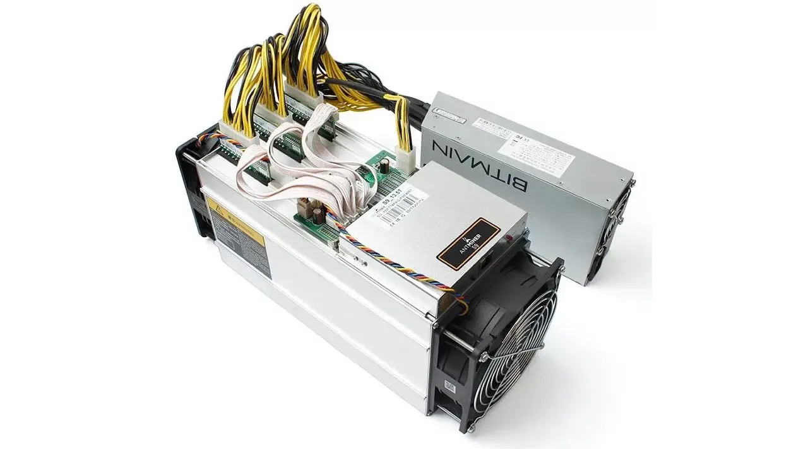

Antminer S9 از بخش‌های زیر تشکیل شده است:

- 3 هش‌بورد که تراشه‌هایی که قدرت هش را تولید می‌کنند در آن‌ها قرار دارند

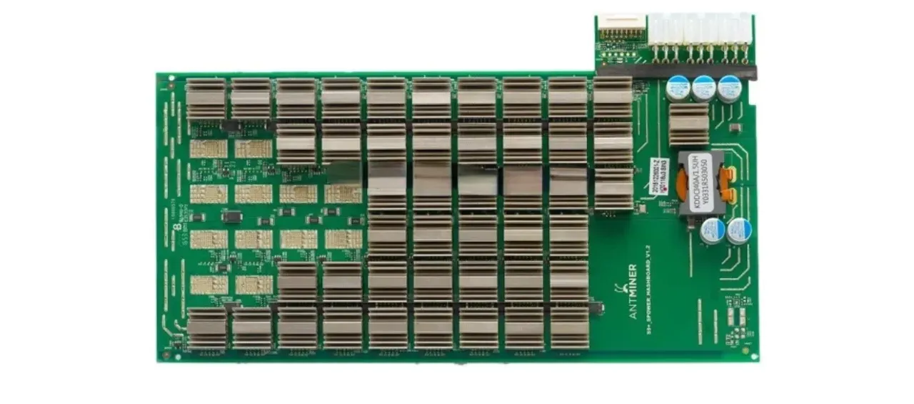'

- یک برد کنترل که شامل یک شیار برای کارت SD، یک پورت اترنت و کانکتورهایی برای هش‌بوردها و فن‌ها است. این مغز ASIC شماست.

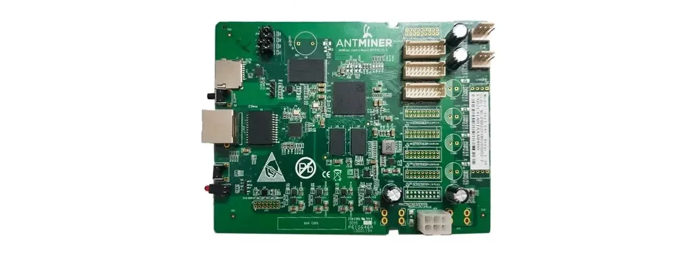

- ۳ کابل داده که هش‌بوردها را به برد کنترل متصل می‌کنند.

- Supply قدرت که با 220 ولت کار می‌کند و می‌تواند مانند یک وسیله خانگی معمولی به برق وصل شود.

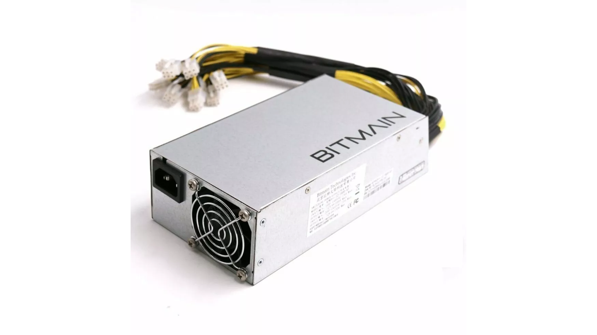

- ۲ فن ۱۲۰ میلی‌متری.

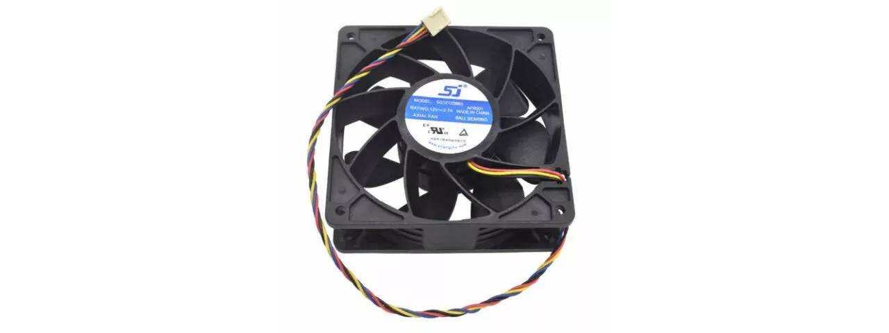

- یک کابل نر C13.

هنگام خرید یک دستگاه دست دوم، مهم است که بررسی کنید تمام قطعات شامل و کارآمد باشند. در طول Exchange، باید از فروشنده بخواهید که دستگاه را روشن کند تا عملکرد صحیح آن را تأیید کنید. مهم است که بررسی کنید دستگاه به درستی روشن می‌شود و سپس با اتصال یک کابل اترنت و دسترسی به اتصال Bitmain Interface از طریق یک مرورگر وب در همان شبکه محلی، اتصال اینترنت را بررسی کنید. می‌توانید این IP Address را با اتصال به روتر اینترنت خود Interface و جستجوی دستگاه‌های متصل پیدا کنید. این Address باید دارای فرمت زیر باشد: 192.168.x.x

همچنین بررسی کنید که اعتبارنامه‌های پیش‌فرض کار می‌کنند (نام کاربری: root، رمز عبور: root). اگر اعتبارنامه‌های پیش‌فرض کار نمی‌کنند، نیاز به انجام بازنشانی دستگاه خواهید داشت.

پس از اتصال، باید بتوانید وضعیت هر هش‌بورد را در داشبورد مشاهده کنید. اگر Miner به یک استخر متصل باشد، باید تمام هش‌بوردها در حال کار باشند. مهم است که توجه داشته باشید که ماینرها صدای زیادی تولید می‌کنند که این امر طبیعی است. همچنین، اطمینان حاصل کنید که فن‌ها به درستی کار می‌کنند.

سپس می‌توانید Mining pool مالک قبلی را حذف کنید تا بعداً خودتان آن را تنظیم کنید. در صورت تمایل، می‌توانید با باز کردن دستگاه، هش‌بوردها را نیز بررسی کنید. با این حال، این مرحله پیچیده‌تر است و به زمان بیشتری و ابزارهای خاصی نیاز دارد. اگر می‌خواهید این باز کردن را ادامه دهید، می‌توانید به بخش بعدی این آموزش که نحوه انجام آن را توضیح می‌دهد، مراجعه کنید. مهم است که توجه داشته باشید که ماینرها مقدار زیادی Dust جمع‌آوری می‌کنند و نیاز به نگهداری منظم دارند. می‌توانید این تجمع Dust و کیفیت نگهداری را با باز کردن دستگاه مشاهده کنید.

پس از بررسی همه این نکات، می‌توانید با اطمینان بالا دستگاه خود را خریداری کنید. اگر شک دارید، با جامعه ارتباط برقرار کنید و اگر برای تکمیل این آموزش به تجهیزات نیاز دارید، با خیال راحت برای ما پیام بفرستید.

برای خلاصه کردن این راهنما در یک جمله:

> اعتماد نکن، بررسی کن.

## فصل 2: راهنمای خرید قطعات اصلاحی

### چگونه آنت‌ماینر S9 خود را به یک بخاری بی‌صدا و متصل تبدیل کنید؟

اگر شما یک Antminer S9 دارید، احتمالاً می‌دانید که چقدر می‌تواند پر سر و صدا و حجیم باشد. با این حال، امکان تبدیل آن به یک بخاری بی‌صدا و متصل وجود دارد با دنبال کردن چند مرحله ساده. در این مقاله، تجهیزات لازم برای انجام تغییرات را معرفی خواهیم کرد، در حالی که مقاله‌ای دیگر به تفصیل مراحل لازم برای انجام این تغییرات را توضیح خواهد داد.

### 1. فن‌ها را تعویض کنید

طرفداران اصلی Antminer S9 برای استفاده به عنوان بخاری بسیار پر سر و صدا هستند. راه‌حل این است که آن‌ها را با فن‌های کم‌صداتر جایگزین کنید. تیم ما چندین مدل از برند Noctua را آزمایش کرده و Noctua NF-A14 iPPC-2000 PWM را به عنوان بهترین سازش انتخاب کرده است. حتماً نسخه 12V فن‌ها را انتخاب کنید. این فن 140 میلی‌متری می‌تواند تا 1300 وات گرما تولید کند و در عین حال سطح نویز نظری 31 دسی‌بل را حفظ کند. برای نصب این فن‌های 140 میلی‌متری، به یک آداپتور 140 میلی‌متری به 120 میلی‌متری نیاز دارید که می‌توانید آن را در فروشگاه DécouvreBitcoin پیدا کنید. ما همچنین گریل‌های محافظ 140 میلی‌متری اضافه خواهیم کرد.

فن Supply قدرت نیز بسیار پر سر و صدا است و نیاز به تعویض دارد. ما فن Noctua NF-A6x25 PWM را توصیه می‌کنیم. توجه داشته باشید که کانکتورهای فن‌های Noctua با کانکتورهای اصلی یکسان نیستند، بنابراین برای اتصال آنها به یک آداپتور کانکتور نیاز خواهید داشت. دو عدد باید کافی باشد. دوباره، مطمئن شوید که نسخه 12V فن را انتخاب کنید.

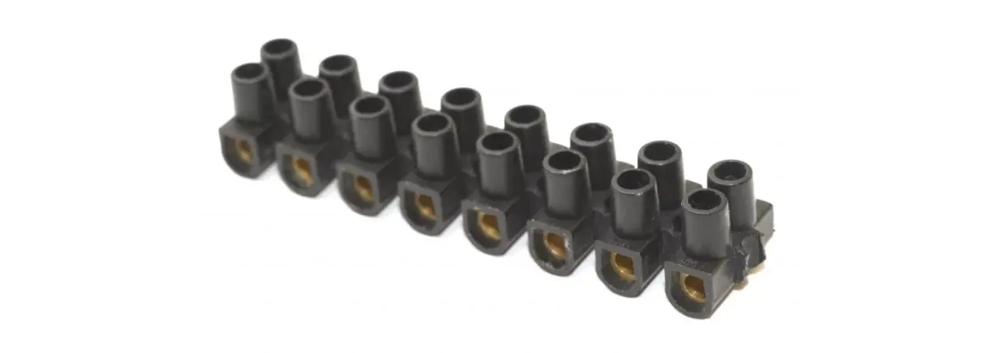

### ۲. افزودن پل WIFI/Ethernet

به جای استفاده از کابل اترنت، می‌توانید با افزودن یک پل WIFI/اترنت، آنت‌ماینر خود را به WIFI متصل کنید. ما vonets vap11g-300 را انتخاب کرده‌ایم زیرا به راحتی به شما امکان می‌دهد سیگنال WIFI را از جعبه اینترنت خود دریافت کرده و آن را از طریق اترنت به آنت‌ماینر خود منتقل کنید بدون اینکه یک زیرشبکه ایجاد کنید. اگر مهارت‌های الکتریکی دارید، می‌توانید آن را مستقیماً با منبع تغذیه آنت‌ماینر Supply بدون نیاز به افزودن شارژر USB تغذیه کنید. برای این کار، به یک جک ماده 5.5mmx2.1mm نیاز خواهید داشت.

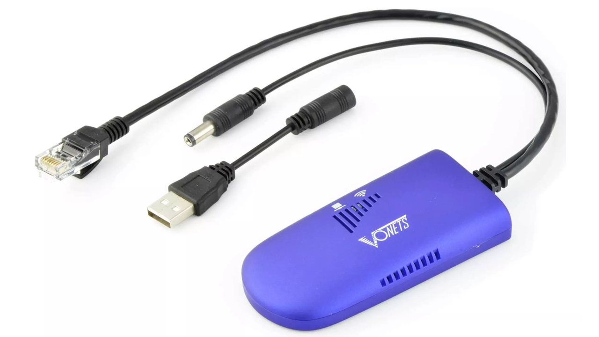

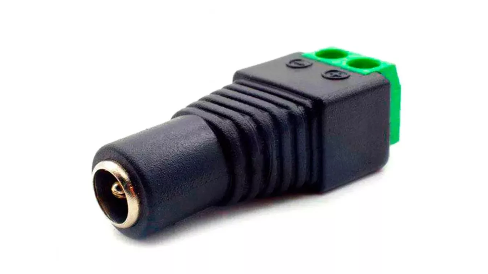

### ۳. اختیاری: افزودن یک دوشاخه هوشمند

اگر می‌خواهید انت‌ماینر خود را از طریق گوشی هوشمند روشن/خاموش کنید و مصرف برق آن را نظارت کنید، می‌توانید یک دوشاخه هوشمند اضافه کنید. ما دوشاخه ANTELA را در نسخه 16A که با برنامه smartlife سازگار است، آزمایش کردیم. این دوشاخه هوشمند به شما امکان می‌دهد مصرف برق روزانه و ماهانه را بررسی کنید و مستقیماً از طریق WIFI به جعبه اینترنت شما متصل می‌شود.

**فهرست تجهیزات و لینک‌ها:**

- ۲ عدد قطعه آداپتور ۳D از ۱۴۰ میلی‌متر به ۱۲۰ میلی‌متر
- 2X NF-A14 iPPC-2000 PWM [لینک](https://www.amazon.fr/Noctua-nf-polarized-A14-industrialppc-PWM-2000/dp/B00KESSUDW)
- 2X توری فن 140mm [link](https://www.amazon.fr/dp/B06XD4FTSQ)
- Noctua NF-A6x25 PWM [لینک](https://www.amazon.fr/Noctua-nf-a6-25-PWM-Ventilateur-Marron/dp/B00VXTANZ4)
- شکر برقکار 2.5mm2 [link](https://www.amazon.fr/Legrand-LEG98433-Borne-raccordement-Nylbloc/dp/B00BBHXLYS)
- Vonets vap11g-300 [link](https://www.amazon.fr/Vonets-VAP11G-300-Bridge-convertit-Ethernet/dp/B014SK2H6W)

## فصل ۳ - آموزش: چگونه یک Miner را به یک بخاری تبدیل کنیم؟

اگر شما یک فرد ماهر در انجام کارهای DIY هستید و به دنبال تبدیل یک Miner به یک بخاری هستید، این آموزش برای شماست. ما می‌خواهیم به شما هشدار دهیم که تغییر یک دستگاه الکترونیکی می‌تواند خطرات الکتریکی و آتش‌سوزی به همراه داشته باشد. ضروری است که تمام احتیاط‌های لازم را برای جلوگیری از هرگونه آسیب یا جراحت رعایت کنید.

خارج از کارخانه، یک Miner واقعاً به عنوان یک رادیاتور در خانه قابل استفاده نیست زیرا بسیار پر سر و صدا و غیر قابل تنظیم است. با این حال، امکان ایجاد تغییرات ساده برای حل این مشکلات وجود دارد.

**توجه:** لازم است که قبلاً Braiins OS+ را بر روی Miner خود یا هر نرم‌افزار دیگری که می‌تواند عملکرد دستگاه شما را کاهش دهد، نصب کرده باشید. این اقدام بسیار مهم است زیرا برای کاهش نویز، ما **فن‌های کم‌قدرت‌تری که توانایی کمتری در دفع حرارت دارند** نصب خواهیم کرد.

### مواد مورد نیاز

- 2 عدد آداپتور سه‌بعدی 140mm به 120mm
- ۲ فن Noctua NF-A14 iPPC-2000 PWM
- 2 توری فن 140 میلی‌متری
- 1 فن Noctua NF-A6x25 PWM
- شکر برق‌کار ۲.۵ میلی‌متر مربع
- Vonets VAP11G-300
- اختیاری: دوشاخه هوشمند ANTELA

### تعویض فن‌ها

ما با تعویض فن قدرت Supply شروع خواهیم کرد.

**توجه**: قبل از هر چیز، ابتدا مطمئن شوید که Miner خود را از برق کشیده‌اید تا از هرگونه خطر برق‌گرفتگی جلوگیری کنید.

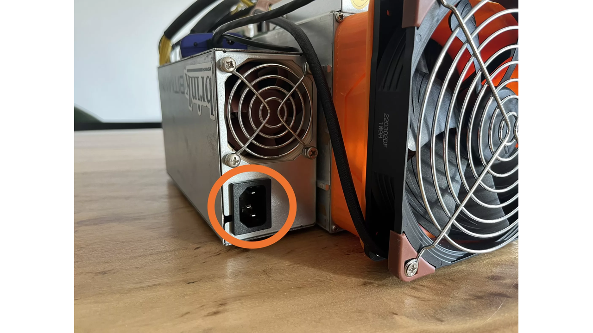

ما با تعویض فن قدرت Supply شروع خواهیم کرد.

ابتدا، ۶ پیچ در کنار کیس که آن را بسته نگه می‌دارند، باز کنید. پس از برداشتن پیچ‌ها، به آرامی کیس را باز کنید تا پوشش پلاستیکی که از قطعات محافظت می‌کند را بردارید.

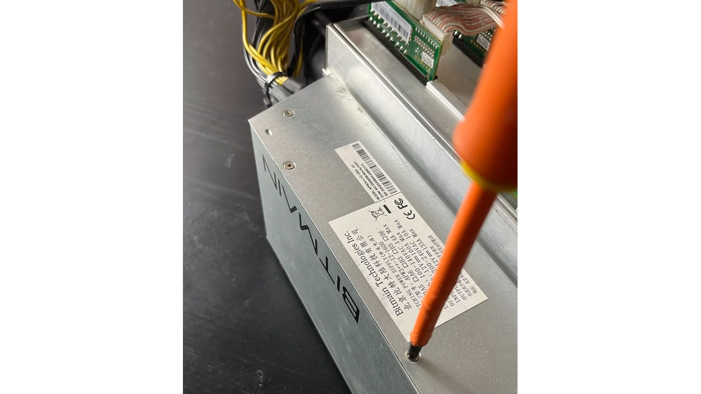

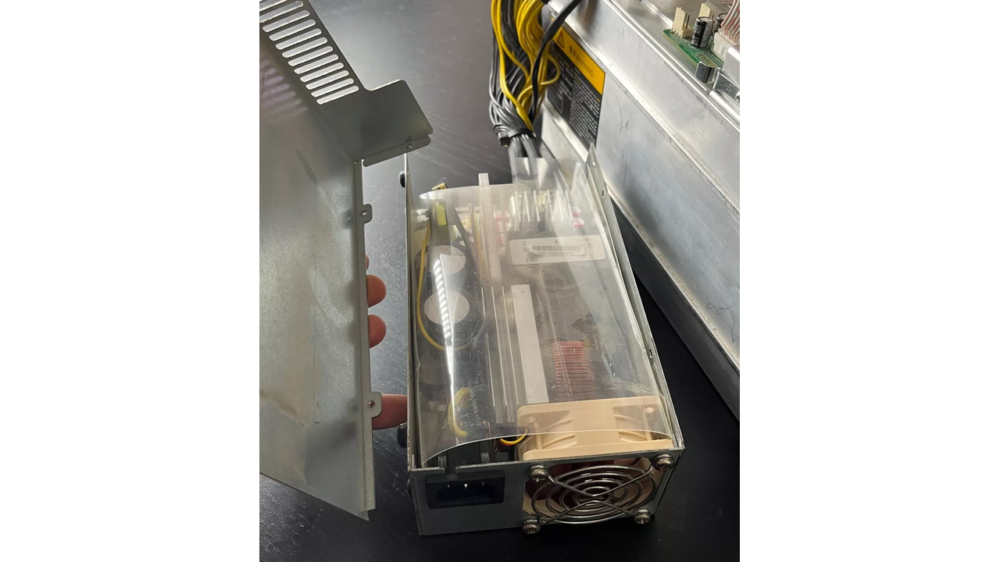'

سپس، زمان آن است که فن اصلی را بردارید، مراقب باشید که به سایر قطعات آسیبی نرسانید. برای انجام این کار، پیچ‌هایی که آن را در جای خود نگه داشته‌اند باز کنید و به آرامی چسب سفید اطراف کانکتور را جدا کنید. مهم است که با دقت پیش بروید تا به سیم‌ها یا کانکتورها آسیبی نرسد.

پس از برداشتن فن اصلی، متوجه خواهید شد که کانکتورهای فن جدید Noctua با کانکتورهای فن اصلی مطابقت ندارند. در واقع، فن جدید دارای ۳ سیم است که شامل یک سیم زرد برای کنترل سرعت می‌باشد. با این حال، این سیم در این مورد خاص استفاده نخواهد شد. برای اتصال فن جدید، توصیه می‌شود از یک آداپتور ویژه استفاده کنید. با این حال، مهم است که توجه داشته باشید که این آداپتور گاهی اوقات ممکن است به سختی پیدا شود.

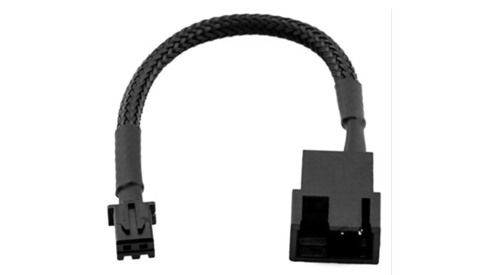

اگر این آداپتور را ندارید، همچنان می‌توانید با استفاده از یک مهره سیم، فن جدید را متصل کنید. برای انجام این کار، باید کابل‌های فن قدیمی و جدید را ببرید.

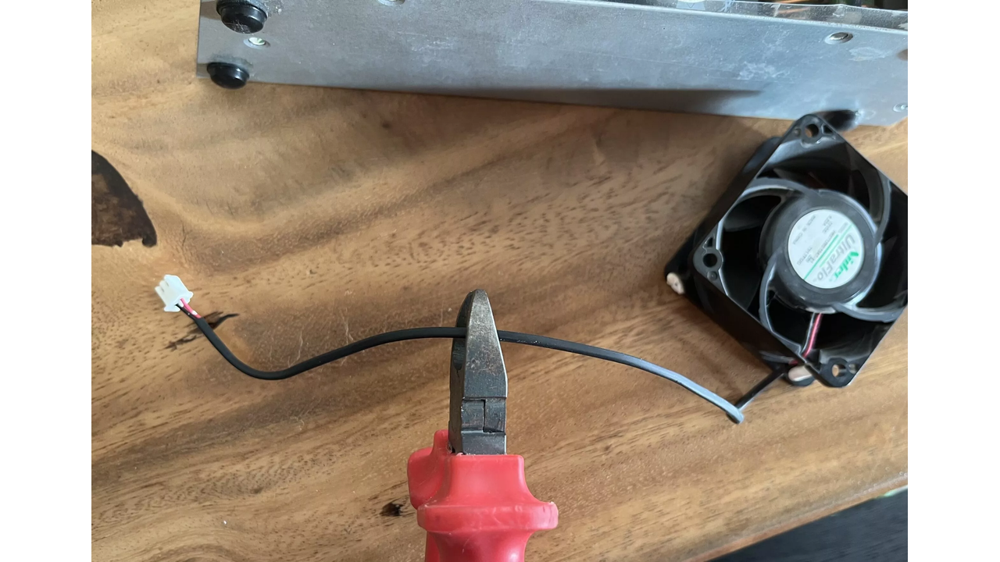

روی فن جدید، از یک کاتر استفاده کنید و با دقت کانتورهای غلاف اصلی را در ۱ سانتی‌متر ببرید بدون اینکه غلاف‌های کابل‌های زیرین را ببرید.

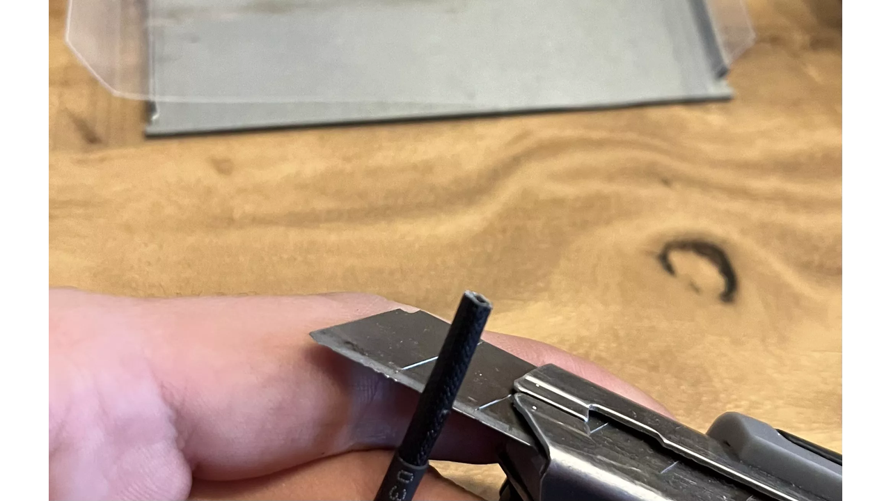

سپس، با کشیدن غلاف اصلی به سمت پایین، غلاف‌های کابل‌های قرمز و سیاه را به همان روش قبلی ببرید. و کابل زرد را به صورت هم‌سطح ببرید.

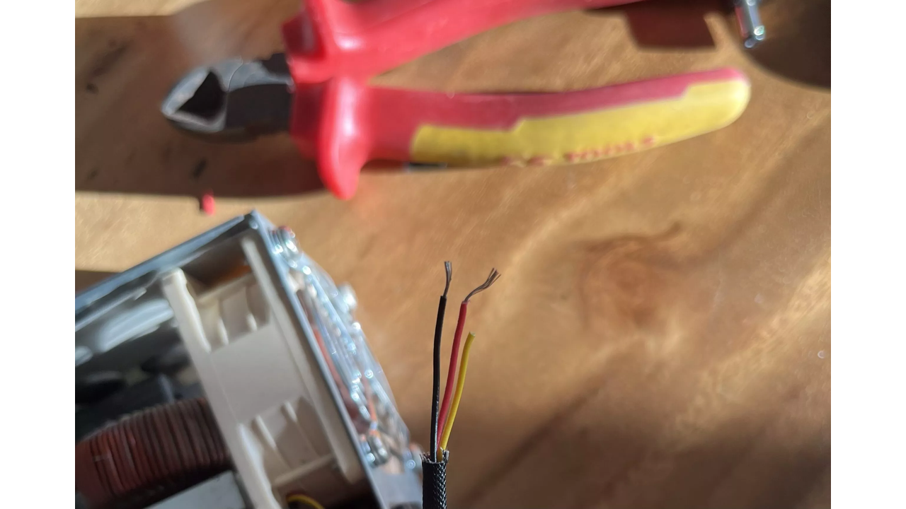

روی فن قدیمی، بریدن غلاف اصلی بدون آسیب رساندن به غلاف‌های سیم‌های قرمز و سیاه ظریف‌تر است. برای این کار، از یک سوزن استفاده کردیم که آن را بین غلاف اصلی و سیم‌های قرمز و سیاه قرار دادیم.

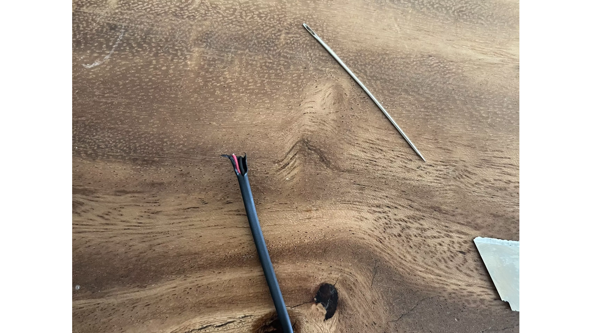

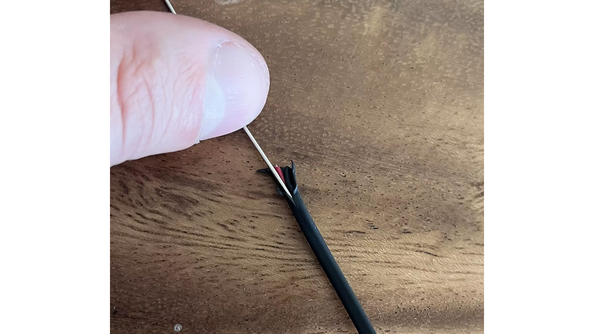

هنگامی که سیم‌های قرمز و سیاه نمایان شدند، غلاف‌ها را با دقت ببرید تا به سیم‌های الکتریکی آسیب نرسانید.

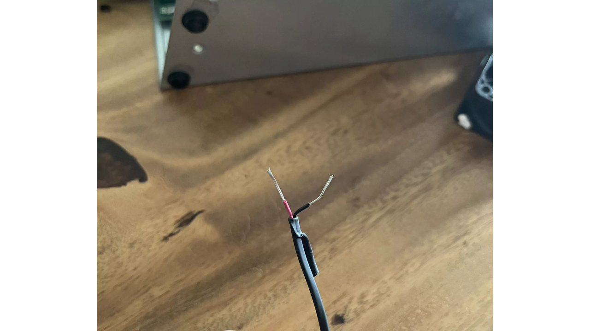

سپس، کابل‌ها را با یک مهره سیمی متصل کنید، سیم سیاه را به سیم سیاه و سیم قرمز را به سیم قرمز وصل کنید. همچنین می‌توانید نوار چسب برق اضافه کنید.

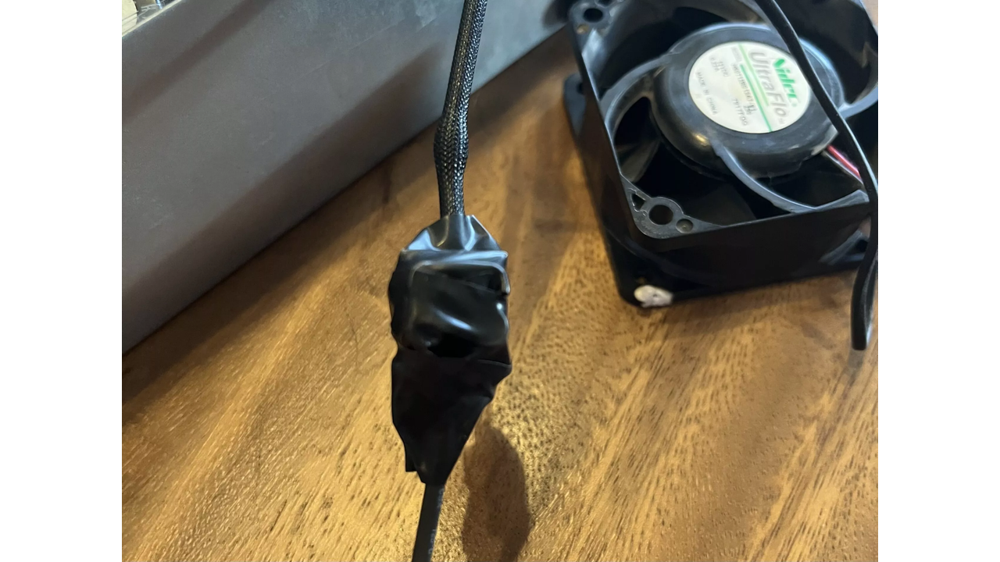

پس از برقراری اتصال، زمان نصب فن جدید Noctua با گریل و پیچ‌های قدیمی فرا رسیده است، پیچ‌های جدیدی که در جعبه هستند بعداً استفاده خواهند شد. اطمینان حاصل کنید که آن را با جهت‌گیری صحیح قرار دهید. شما یک فلش در یک طرف فن مشاهده خواهید کرد که جهت جریان هوا را نشان می‌دهد. مهم است که فن را به گونه‌ای قرار دهید که این فلش به سمت داخل کیس اشاره کند. سپس، فن را دوباره متصل کنید.

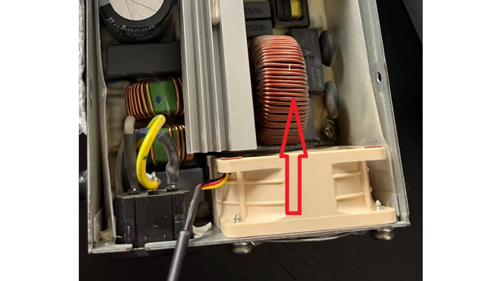

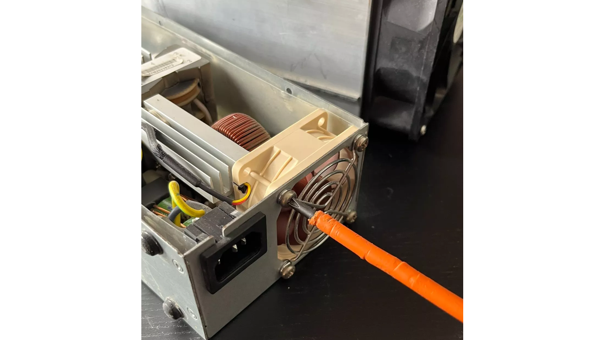

**اختیاری:** اگر در زمینه برق مهارت دارید، می‌توانید به‌طور مستقیم یک کانکتور جک 5.5 میلی‌متری مادگی به خروجی برق 12 ولت اضافه کنید، که به شما این امکان را می‌دهد تا مستقیماً پل Wi-Fi Vonet را تغذیه کنید. با این حال، اگر از مهارت‌های الکتریکی خود مطمئن نیستید، بهتر است از کانکتور USB با شارژر گوشی هوشمند استفاده کنید تا از هرگونه خطر اتصال کوتاه یا آسیب الکتریکی جلوگیری کنید.

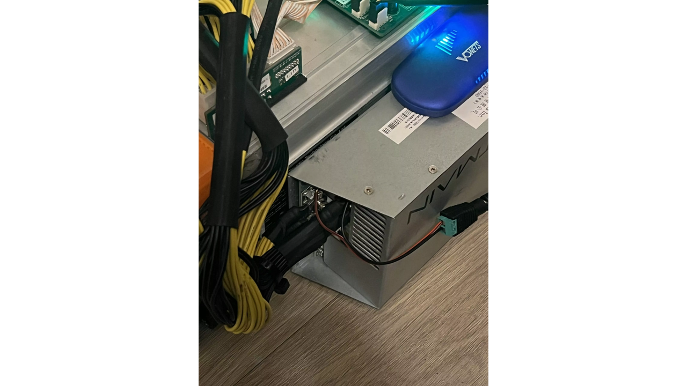

پس از برقراری اتصالات، مطمئن شوید که پوشش پلاستیکی را روی محفظه پلاستیکی قرار دهید و نه داخل آن.

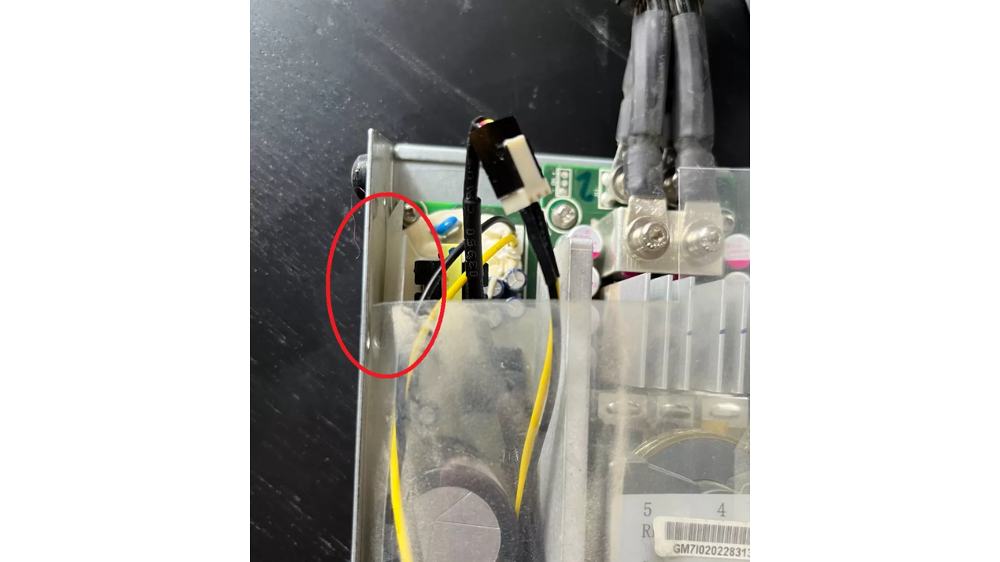

در نهایت، پوشش کیس را دوباره در جای خود قرار دهید و 6 پیچ در کناره‌ها را ببندید تا همه چیز به‌طور محکم در جای خود قرار گیرد. و حالا، کیس پاور Supply شما با یک فن جدید مجهز شده است.

### تعویض 2 فن اصلی

- ابتدا، فن‌ها را از برق بکشید و پیچ‌های آن‌ها را باز کنید.

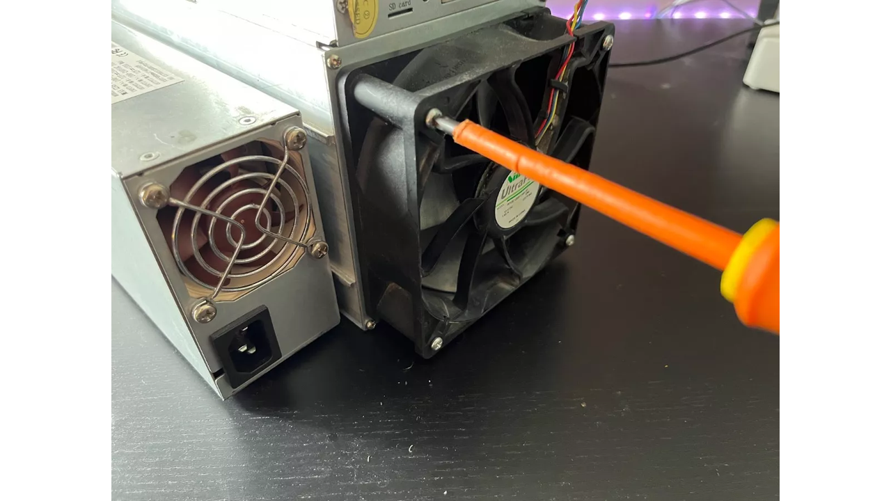

- کانکتورهای فن‌های جدید Noctua با کانکتورهای اصلی مطابقت ندارند، اما نگران نباشید! کاتر خود را بردارید و به دقت زبانه‌های پلاستیکی کوچک را ببرید تا کانکتورها به‌طور کامل با Miner شما سازگار شوند.

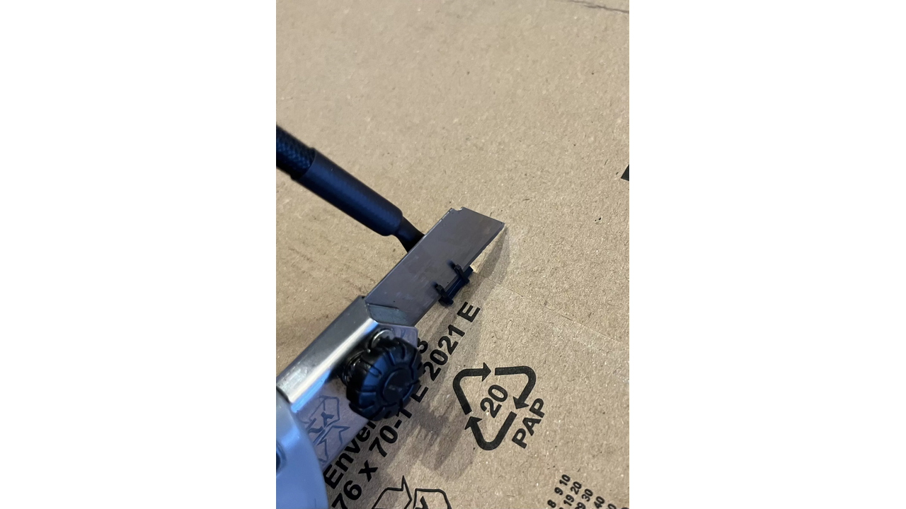

- وقت نصب قطعات سه‌بعدی است!

آن‌ها را در هر دو طرف Miner با استفاده از پیچ‌هایی که از فن‌ها جدا کرده‌اید، وصل کنید. پیچ‌ها را تا زمانی که سر پیچ وارد قطعه سه‌بعدی شود و به‌طور محکم در جای خود قرار گیرد، بچرخانید. مراقب باشید که بیش از حد سفت نکنید، زیرا ممکن است قطعه تغییر شکل دهد و یکی از پیچ‌ها به یک خازن برخورد کند! سپس با دقت زبانه‌های کوچک پلاستیکی را ببرید تا کانکتورها به‌طور کامل با Miner شما جفت شوند.

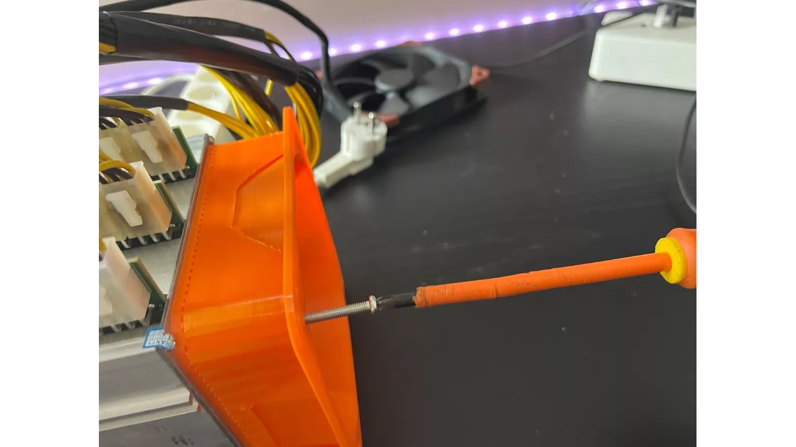

- حالا بیایید به سراغ طرفداران برویم.

آن‌ها را با استفاده از پیچ‌های موجود در جعبه به قطعات سه‌بعدی متصل کنید. به جهت جریان هوا توجه کنید، فلش‌های روی طرفین فن‌ها جهت را نشان می‌دهند. از سمت پورت اترنت به سمت دیگر بروید. به عکس زیر نگاه کنید.

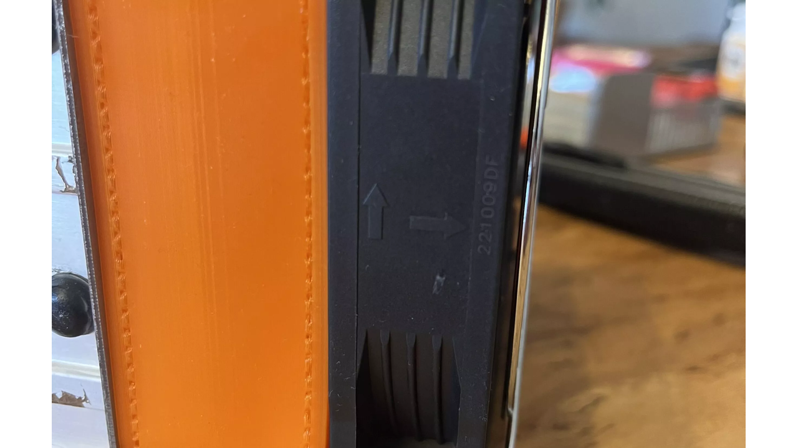

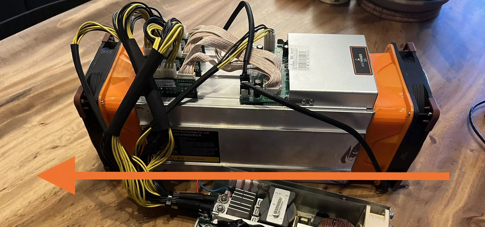

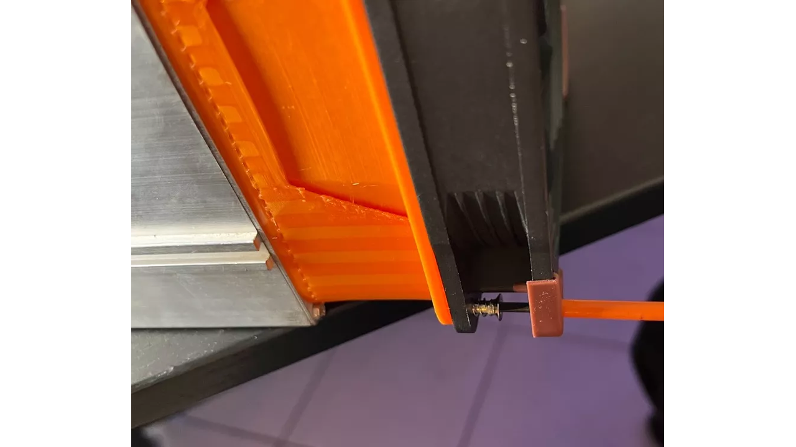

- آخرین مرحله: فن‌ها را وصل کنید و توری‌ها را با پیچ‌های استفاده‌نشده از جعبه فن در بالا متصل کنید. شما فقط ۴ پیچ دارید، اما ۲ پیچ در گوشه‌های مخالف برای هر توری کافی خواهد بود. در صورت نیاز می‌توانید پیچ‌های مشابه دیگری را در فروشگاه ابزارآلات جستجو کنید.

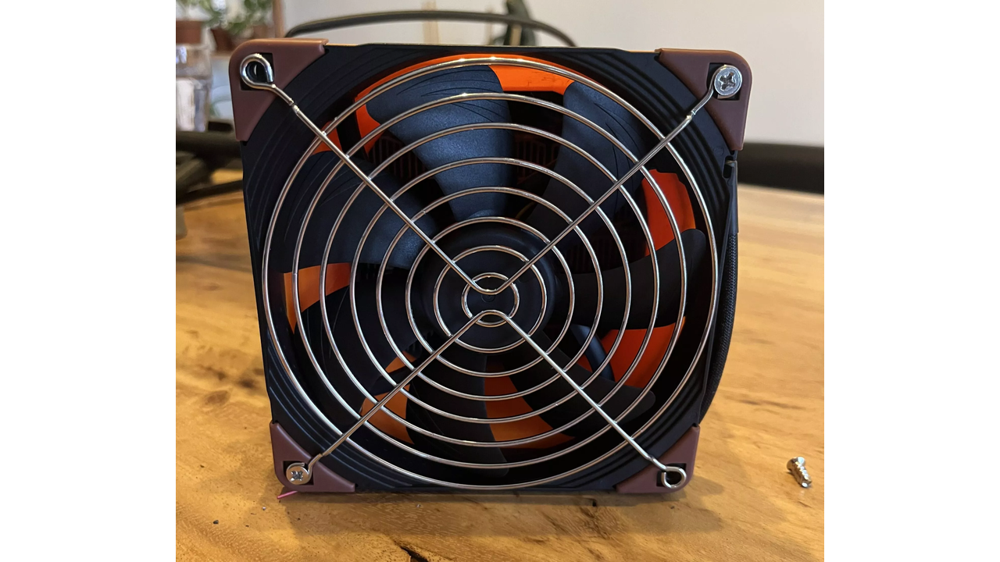

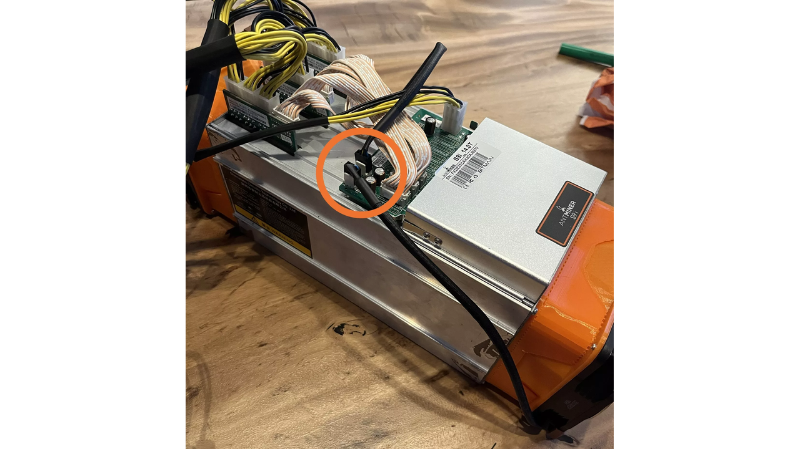

در حالی که منتظر هستید تا بتوانید یک محفظه جذاب‌تر برای بخاری جدید خود ارائه دهید، می‌توانید محفظه و برق Supply را با بست‌های کابل برق به هم متصل کنید.

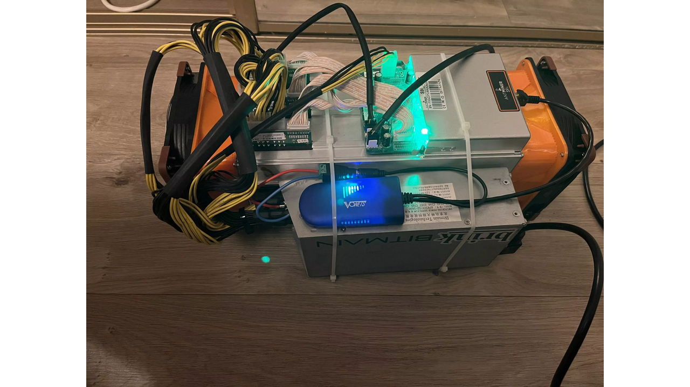

و برای لمس نهایی، پل Vonet را به پورت اترنت روی منبع تغذیه Supply وصل کنید. اگر هنوز این کار را انجام نداده‌اید، می‌توانید این آموزش را برای تنظیم پل خود دنبال کنید.

و این هم از این، تبریک می‌گویم! شما به‌تازگی تمام بخش مکانیکی Miner خود را تعویض کرده‌اید. اکنون باید صدای بسیار کمتری بشنوید.

## فصل 4 - تغییر نرم‌افزار - بازنشانی یک Antminer S9

**مجموعه مقالات پیشنهادی توسط BlobOnChain & Ajelex - 15/02/2023**

### بازنشانی از طریق دکمه "بازنشانی"

این روش می‌تواند ظرف ۱۰ دقیقه پس از شروع Miner اعمال شود.

پس از روشن کردن Miner به مدت 2 دقیقه، لطفاً دکمه "Reset" را به مدت 5 ثانیه فشار داده و سپس رها کنید. Miner ظرف 4 دقیقه به تنظیمات کارخانه بازگردانده می‌شود و به‌طور خودکار راه‌اندازی مجدد خواهد شد (نیازی به خاموش کردن آن نیست).

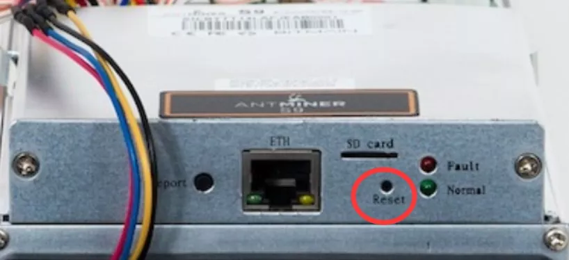

بازیابی از طریق وب سایت

به کاربر Interface از Miner خود وارد شوید، روی "Upgrade" >> "Perform a reset" کلیک کنید، سپس در پنجره پاپ‌آپ روی "OK" کلیک کنید.

### سیستم عامل اصلی

برای این بخش، فرض می‌کنیم که دستگاه در حال کار است و سیستم‌عامل اصلی آن نصب شده است. ما به‌طور مختصر به Interface سیستم‌عامل اصلی ارائه‌شده توسط Bitmain خواهیم پرداخت.

ابتدا، از طریق شبکه محلی خود به دستگاهتان متصل شوید:

پس از ورود به صفحه ورود، باید با استفاده از اطلاعات پیش‌فرض به ASIC وارد شوید:

- نام کاربری: root
- رمز عبور: root

**چگونه تنظیم مجدد کنیم اگر رمز عبور پیش‌فرض کار نمی‌کند؟**

سیستم عامل اصلی نسبتاً ساده است. با ۴ تب: سیستم، پیکربندی Miner، وضعیت Miner، شبکه. در تب پیکربندی Miner، می‌توانید تا ۳ استخر Mining را پیکربندی کنید.

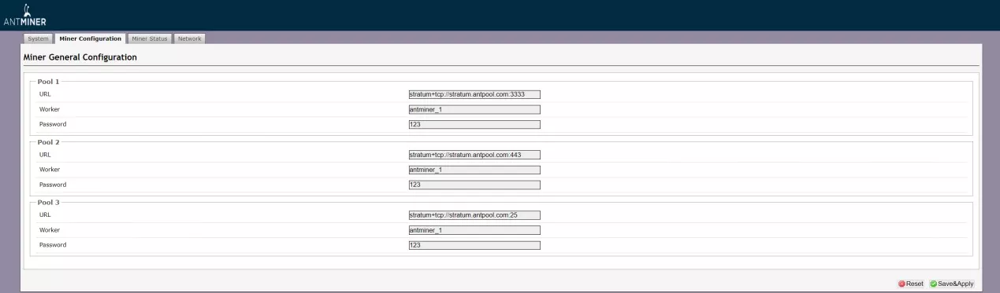

در زبانه وضعیت Miner، می‌توانید اطلاعات مختلفی درباره عملکرد زنده ASIC مشاهده کنید. Hashrate به صورت GH/s بیان شده است، اطلاعات دقیق‌تری درباره استخر، و همچنین جزئیات مربوط به وضعیت هر هش‌بورد و سرعت فن در دور در دقیقه ارائه می‌شود.

### Braiins OS+

اکنون، ما نرم‌افزار ASICs Braiins OS+ (https://braiins.com/os/plus) را مطالعه خواهیم کرد. این نرم‌افزار توسط شرکت [Braiins](https://braiins.com/) توسعه یافته است، که شرکت مادر Mining pool Braiins Pool (https://braiins.com/pool) می‌باشد. این Mining pool در حال حاضر 4.39% از Hashrate جهانی را در زمان نگارش این خطوط دارد. این شرکت مستقر در پراگ قبلاً به نام Slushpool شناخته می‌شد و اولین Mining pool است که در نوامبر 2010 شروع به کار کرد. [اینجا](https://Mempool.space/Mining/pool/braiinspool) می‌توانید آمار به‌روز شده Hashrate و تسلط استخر را پیدا کنید.

امروز، شرکت با فعالیت‌های متنوع خود، ابزارهای مطالعه سودآوری برای Mining (https://insights.braiins.com/en)، راه‌حل‌های مدیریت مزرعه Mining به موازات فعالیت استخر خود، و نرم‌افزار بهینه‌سازی برای ASICها را ارائه می‌دهد. همچنین Mining را با استفاده از پروتکل جدید Stratum V2 (https://braiins.com/Bitcoin-Mining-stack-upgrade) ارائه می‌دهد.

بنابراین ما به طور دقیق‌تر به بررسی عملکرد دستگاه‌های Bitmain خواهیم پرداخت، که در حال حاضر تنها مدل‌های سازگار هستند:

- S19، S19 Pro، S19j، S19j Pro، T19،

- ۱۷، S17 Pro، S17+، S17e، T17، T17+، T17e و S9 [i, j]

نرم‌افزار Braiins OS به‌راحتی می‌تواند بر روی تمامی ماشین‌های ذکر شده نصب شود. این نرم‌افزار امکان کنترل دقیق‌تر ماشین را با اجازه اورکلاک یا آندرکلاک فراهم می‌کند. همچنین امکان تنظیم دقیق فرکانس هر چیپ را از طریق ویژگی بهینه‌سازی خودکار به نام autotuning فراهم می‌کند. از آنجا که هر چیپ هشینگ به دلیل فرآیند تولید خود کمی متفاوت است، نرم‌افزار فرکانس بهینه برای هر چیپ را برای دستیابی به حداکثر کارایی (W/THs) آزمایش می‌کند. نرم‌افزار ادعا می‌کند که می‌تواند عملکردی تا ۲۵٪ بالاتر از نسخه اصلی ارائه دهد. بر اساس اندازه‌گیری‌های ما، دستیابی به این ارقام ممکن است.

## نصب Braiins OS+

راه‌های مختلفی برای نصب Braiins OS+ بر روی ASIC وجود دارد. می‌توانید به این راهنما و همچنین مستندات رسمی از Braiins و آموزش‌های ویدئویی مراجعه کنید.

نصب Braiins OS+ به‌طور مستقیم بر روی حافظه Antminer

یاد بگیرید که چگونه به راحتی Braiins OS+ را مستقیماً بر روی حافظه Antminer خود با استفاده از BOS toolbox نصب کنید و سیستم عامل اصلی را جایگزین کنید، از طریق مراحل دقیق زیر. اگر می‌خواهید سیستم عامل اصلی را به صورت موازی نگه دارید، می‌توانید Braiins OS+ را بر روی یک کارت SD نصب کنید.

- انت‌ماینر خود را روشن کرده و آن را به اینترنت باکس خود متصل کنید.

- دانلود جعبه‌ابزار BOS برای ویندوز / لینوکس.

- فایل دانلود شده را از حالت فشرده خارج کنید و فایل bos-toolbox.bat را باز کنید، زبان را انتخاب کنید و پس از لحظه‌ای این پنجره را خواهید دید:

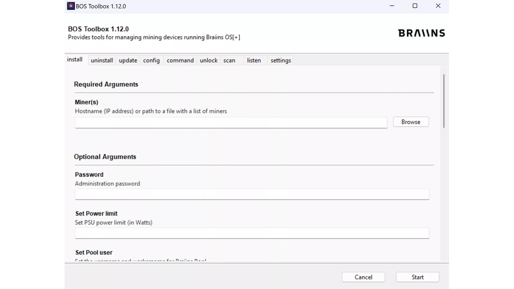

- جعبه‌ابزار Bos به شما این امکان را می‌دهد که به‌راحتی IP Address آنت‌ماینر خود را پیدا کرده و Braiins OS+ را نصب کنید. اگر از قبل IP Address دستگاه خود را می‌دانید، می‌توانید به مرحله ۸ بروید. در غیر این صورت، به تب اسکن بروید.

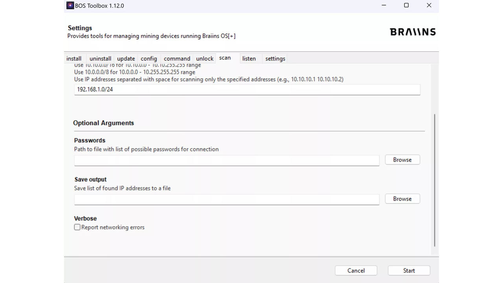

- معمولاً در شبکه‌های خانگی، محدوده IP Address بین 192.168.1.1 و 192.168.1.255 است، بنابراین "192.168.1.0/24" را در فیلد محدوده IP وارد کنید. اگر شبکه شما متفاوت است، لطفاً این آدرس‌ها را تغییر دهید. سپس روی "Start" کلیک کنید.

- توجه، اگر آنت‌ماینر دارای رمز عبور باشد، شناسایی کار نخواهد کرد. در این صورت، ساده‌ترین راه‌حل انجام بازنشانی به تنظیمات کارخانه است.

- شما باید تمام Antminerها را در شبکه خود ببینید، در اینجا IP Address برابر با 192.168.1.37 است.

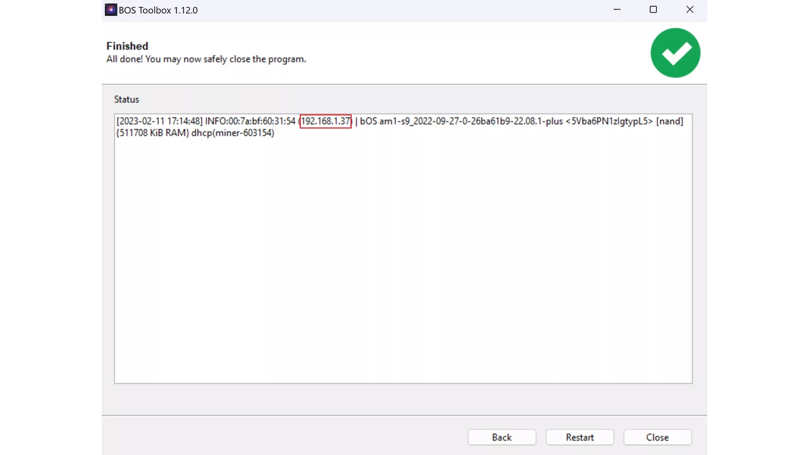

- روی "Back" کلیک کنید، سپس به تب نصب بروید، IP Address که قبلاً پیدا شده را در فیلد Miner(s) وارد کنید و "admin" (یا "root") را در فیلد رمز عبور وارد کنید که رمز عبور پیش‌فرض است، سپس روی "Start" کلیک کنید.

اگر نصب با استفاده از "admin" یا "root" به عنوان رمز عبور کار نمی‌کند، ممکن است لازم باشد یک بازنشانی به تنظیمات کارخانه انجام داده و دوباره تلاش کنید.

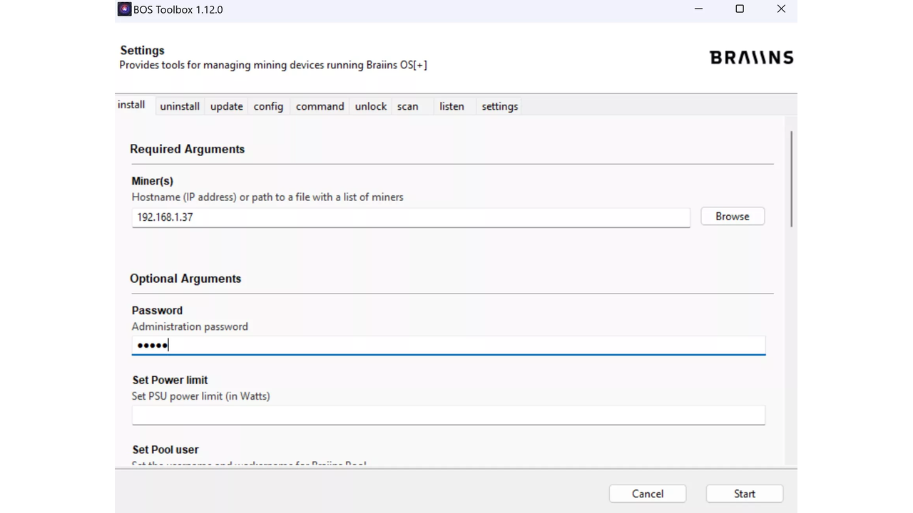

- پس از چند لحظه، آنت‌ماینر شما مجدداً راه‌اندازی می‌شود و شما قادر خواهید بود به Braiins OS+ Interface در IP Address مورد نظر، اینجا 192.168.1.37، به‌طور مستقیم در نوار Address مرورگر خود دسترسی پیدا کنید. نام کاربری پیش‌فرض "root" است و هیچ رمز عبور پیش‌فرضی وجود ندارد.

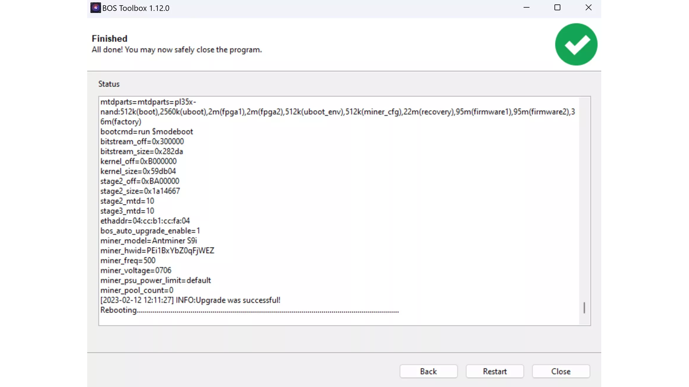

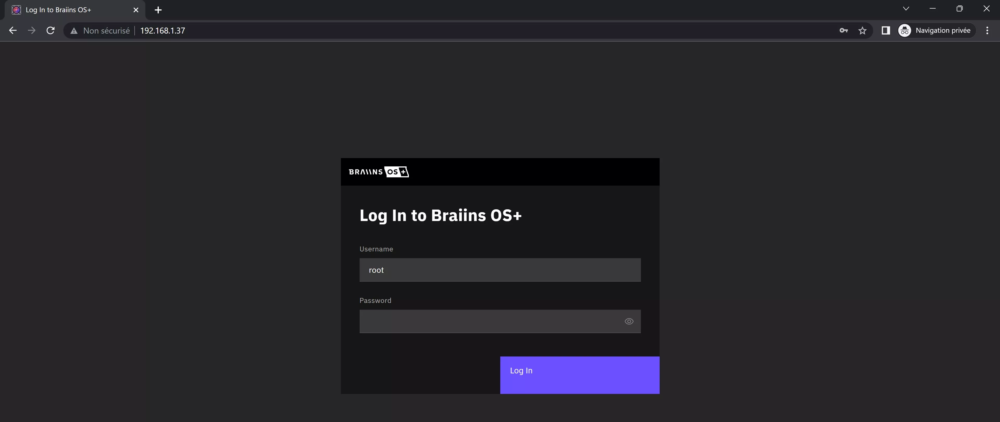

نصب Braiins OS+ بر روی کارت SD روش دوم است، که از Interface اصلی آنت‌ماینر شما استفاده می‌کند. این روش برای دستگاه‌هایی با سیستم‌عامل قبل از سال 2019 کار می‌کند.

### انت‌ماینر Interface

- سیستم‌عامل جدید را برای نصب دانلود کنید.

- همانند بخش قبلی، از طریق شبکه محلی خود به دستگاهتان متصل شوید.

- به زبانه سیستم بروید و سپس ارتقاء را انتخاب کنید.

- فایل دانلود شده را بارگذاری کرده و تصویر را فلش کنید.

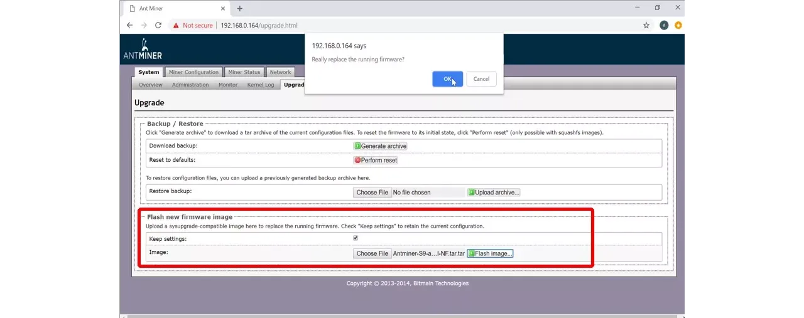

### کارت میکرو SD

روش دوم به شما اجازه می‌دهد از کارت micro SD استفاده کنید. این روش فقط با ماشین‌هایی که سیستم‌عامل آن‌ها بعد از سال ۲۰۱۹ است کار می‌کند.

- سیستم‌عامل جدید را برای نصب دانلود کنید.

- تصویر دانلود شده را روی یک کارت micro SD فلش کنید. برای این کار می‌توانید از Etcher استفاده کنید. به سادگی کپی کردن فایل به کارت micro SD کار نخواهد کرد.

- اگر شما مالک یک Antminer S9 و نسخه‌های آن (S9i, S9j) هستید، باید جامپرها را تنظیم کنید تا ASIC شما از فایل روی کارت micro SD به جای NAND بوت شود. اگر مدل متفاوتی دارید، می‌توانید به بخش 4 بروید. جامپرها روی برد کنترل در قسمت بالایی ASIC، نزدیک به پورت اترنت قرار دارند. شما باید آن را با کشیدن به سمت عقب جدا کنید. پس از تغییر موقعیت جامپر همان‌طور که در تصاویر زیر نشان داده شده است BOOT FROM SD، می‌توانید برد کنترل را دوباره وارد کرده و S9 را مجدداً متصل کنید.

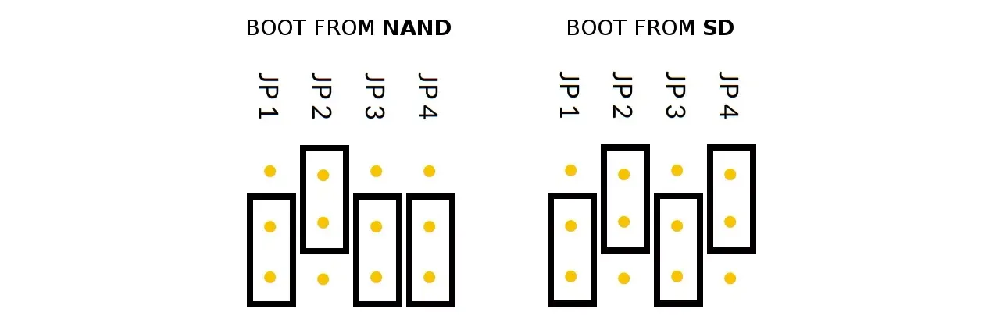

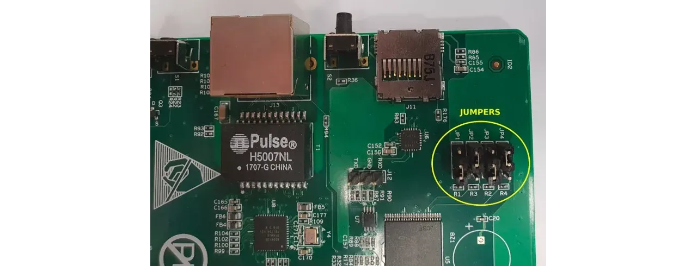

- کارت micro SD را درون ASIC قرار دهید.

- ASIC را راه‌اندازی کنید. اگر از نسخه نصب خودکار استفاده شده باشد، سیستم‌عامل جدید به‌طور خودکار نصب خواهد شد. نصب زمانی کامل می‌شود که هر دو LED به‌طور همزمان روشن شوند. می‌توانید ASIC را مجدداً راه‌اندازی کرده و کارت micro SD را خارج کنید. اگر نسخه دیگری دانلود شده باشد، باید کارت micro SD را داخل ASIC نگه دارید.

برای اطلاعات بیشتر در مورد نصب، می‌توانید به این بخش از وب‌سایت Braiins مراجعه کنید.

## Interface

شما باید به ASIC خود به روشی مشابه متصل شوید. با استفاده از IP محلی Address دستگاه خود در شبکه از طریق یک مرورگر.

اعتبارنامه‌های پیش‌فرض همانند سیستم‌عامل اصلی هستند.

- نام کاربری: root
- رمز عبور: root

سپس با داشبورد Brains OS+ مواجه خواهید شد.

### داشبورد

در این صفحه اول، می‌توانید عملکرد لحظه‌ای دستگاه خود را مشاهده کنید.

- سه نمودار لحظه‌ای که دما، Hashrate و وضعیت کلی دستگاه شما را نشان می‌دهند.
- در سمت راست، Hashrate واقعی، دمای متوسط تراشه، بازدهی تخمینی در W/THs، و مصرف برق.
- در زیر، سرعت فن به درصدی از حداکثر سرعت و تعداد چرخش‌ها در دقیقه آمده است.

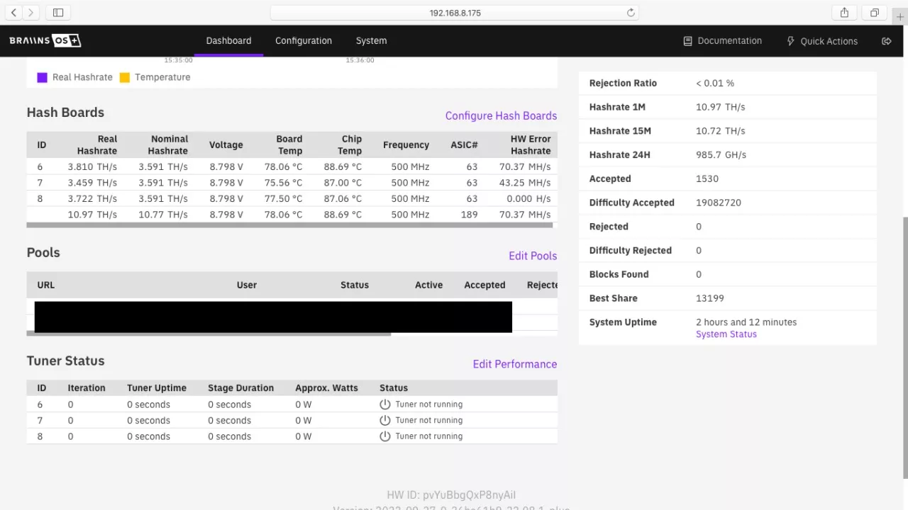

- در ادامه، نمایی دقیق از هر هش‌بورد را خواهید یافت. دمای متوسط برد و تراشه‌های آن، ولتاژ و فرکانس.
- جزئیات مربوط به استخرهای فعال Mining در Pools.
- وضعیت تنظیم خودکار در وضعیت تنظیم‌کننده.
- در سمت راست، جزئیات مربوط به سهام منتقل شده به استخر.

### پیکربندی

### سیستم

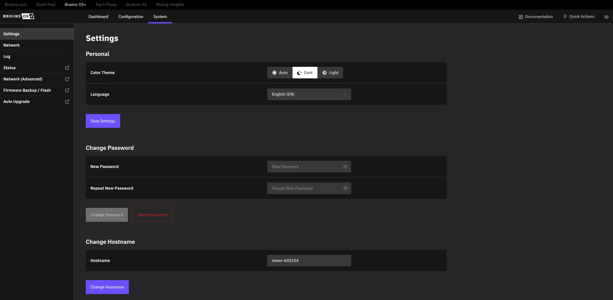

### اقدامات سریع

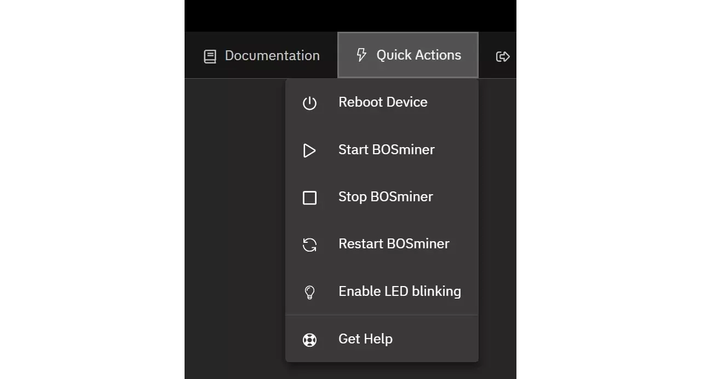

## پیکربندی یک استخر

می‌توان یک Mining pool را به‌عنوان یک تعاونی کشاورزی تصور کرد. کشاورزان تولیدات خود را با هم ترکیب می‌کنند تا واریانس Supply و تقاضا را کاهش دهند و بدین ترتیب درآمد پایدارتری برای عملیات خود به دست آورند. یک Mining pool به همین شکل عمل می‌کند و مواد خامی که با هم ترکیب می‌شوند، هش‌ها هستند. در واقع، کشف یک Hash معتبر به تنهایی اجازه ایجاد یک بلوک را می‌دهد و بدین ترتیب کوین‌بیس یا پاداش، که در حال حاضر 3.125 BTC به‌علاوه کارمزدهای تراکنش موجود در بلوک است، به دست می‌آید. اگر به‌تنهایی استخراج کنید، تنها زمانی پاداش می‌گیرید که یک بلوک پیدا کنید. در رقابت با سایر استخراج‌کنندگان در سراسر جهان، شانس بسیار کمی برای برنده شدن در این قرعه‌کشی بزرگ دارید و همچنان باید هزینه‌های مربوط به استفاده از Miner خود را بدون هیچ تضمینی برای موفقیت بپردازید. Mining این مسئله را با ترکیب قدرت محاسباتی چندین (هزاران) استخراج‌کننده و تقسیم پاداش‌های آن‌ها بر اساس درصد مشارکت در Hashrate استخر زمانی که یک بلوک پیدا می‌شود، حل می‌کند. برای تجسم شانس‌های Mining یک بلوک به‌تنهایی، می‌توانید از این ابزار استفاده کنید. با وارد کردن اطلاعات یک Antminer S9، می‌توانیم ببینیم که شانس پیدا کردن یک Hash که اجازه ایجاد یک بلوک را می‌دهد، 1 در 24,777,849 برای هر بلوک یا 1 در 172,068 در روز است. به‌طور متوسط (با یک Hashrate و سختی ثابت)، 471 سال طول می‌کشد تا یک بلوک پیدا شود.

با این حال، از آنجا که همه چیز در Bitcoin احتمال است، گاهی اوقات اتفاق می‌افتد که ماینرهای انفرادی برای پذیرش این ریسک پاداش می‌گیرند: ماینر انفرادی Bitcoin بلوک را با نرخ Hash تنها 10 TH/s حل می‌کند و شانس بسیار غیرمحتمل را شکست می‌دهد – Decrypt

اگر به قمار علاقه دارید، می‌توانید آن را امتحان کنید، اما راهنمای ما در آن جهت تمرکز نخواهد کرد. در عوض، ما بر روی Mining pool که بهترین نیازهای ما را برای ایجاد یک سیستم گرمایشی برآورده می‌کند، تمرکز خواهیم کرد.

هنگام انتخاب Mining pool، ملاحظاتی که باید در نظر گرفت شامل عملکرد پاداش‌های استخر است که می‌تواند متفاوت باشد، و همچنین حداقل مقدار قبل از اینکه بتوان پاداش‌ها را به Address برداشت کرد. به عنوان مثال، Braiins که نرم‌افزاری که در اینجا درباره آن صحبت می‌کنیم را ارائه می‌دهد، یک استخر نیز ارائه می‌دهد. این استخر دارای سیستم پاداشی به نام "Score" است که معدن‌چیان را تشویق می‌کند تا برای مدت طولانی استخراج کنند. مشارکت شامل یک عامل زمان فعالیت است که با "scoring Hashrate" بیان می‌شود. در مورد ما، جایی که می‌خواهیم یک سیستم گرمایشی داشته باشیم که فقط برای چند دقیقه روشن شود، این سیستم پاداش ایده‌آل نیست. ما ترجیح می‌دهیم سیستمی داشته باشیم که برای هر مشارکت پاداش مساوی بدهد. علاوه بر این، حداقل مقدار برداشت برای Braiins Pool برابر با 100,000 Sats و On-Chain است. بنابراین ما مقداری Sats را در هزینه‌های تراکنش از دست می‌دهیم و بخشی از پاداش ما می‌تواند قفل شود اگر در طول زمستان به اندازه کافی استخراج نکنیم.

مدلی از پاداش که برای ما جالب است، PPS است که مخفف "پرداخت به ازای هر سهم" می‌باشد. این بدان معناست که Miner برای هر سهم معتبر پاداش دریافت خواهد کرد. همچنین یک نوع دیگر از این سیستم وجود دارد به نام FPPS (پرداخت کامل به ازای هر سهم)، که نه تنها پاداش کوین‌بیس را تقسیم می‌کند، بلکه کارمزدهای تراکنش‌های موجود در بلاک را نیز شامل می‌شود. استخرهای Mining که ما برای اتصال Mining/گرمایش شما توصیه می‌کنیم، Linecoin Pool (FPPS) و Nicehash (PPS) هستند.

- نایس‌هش: مزیت نایس‌هش این است که برداشت می‌تواند با استفاده از Lightning و با کارمزدهای کم انجام شود. علاوه بر این، حداقل مبلغ برداشت 2000 Sats است. عیب آن این است که نایس‌هش از Hashrate خود برای سودآورترین Blockchain استفاده می‌کند، بدون اینکه واقعاً کنترلی به کاربر بدهد، بنابراین ممکن است لزوماً در Bitcoin Hashrate شرکت نکند.

- لاین‌کوین: مزیت لاین‌کوین تعداد ویژگی‌های ارائه شده است، مانند داشبورد دقیق، امکان برداشت با یک Paynym (BIP 47) برای حفاظت بهتر از حریم خصوصی، و ادغام یک ربات تلگرام و همچنین اتوماسیون‌های قابل تنظیم مستقیم در برنامه موبایل. این استخر تنها بلوک‌های Bitcoin را استخراج می‌کند، اما حداقل مقدار برای برداشت همچنان بالا و برابر با 100,000 Sats است. ما در مقاله‌ای آینده به بررسی دقیق‌تر Interface یکی از این استخرها خواهیم پرداخت.

برای پیکربندی یک استخر در Braiins OS+، شما نیاز به ایجاد یک حساب کاربری در یکی از استخرهای مورد نظر خود دارید. در اینجا ما مثال Linecoin را بررسی خواهیم کرد:

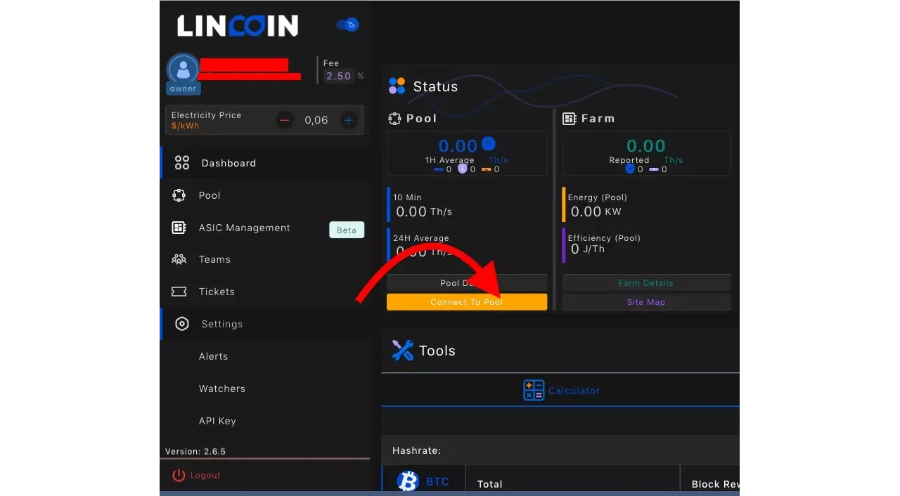

پس از ایجاد حساب کاربری، روی Connect To Pool کلیک کنید

سپس Stratum Address و همچنین نام کاربری خود را کپی کنید:

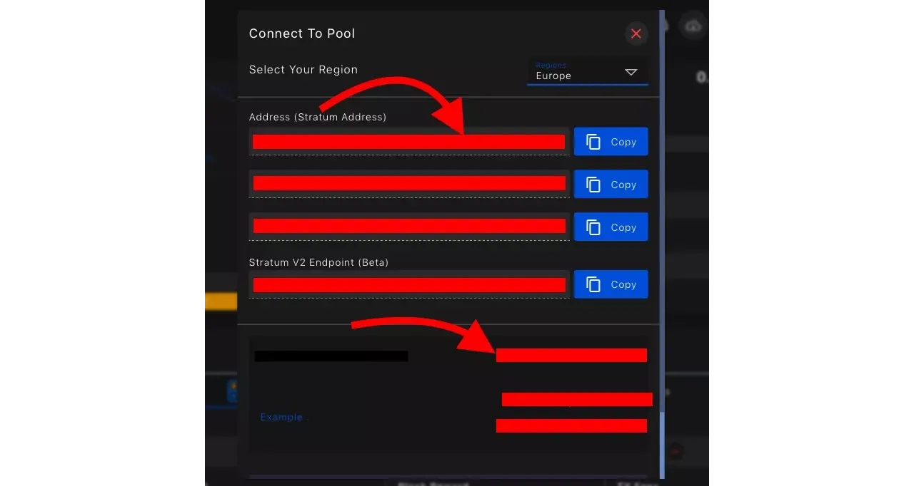

اکنون می‌توانید به Braiins OS+ Interface بازگردید تا این اطلاعات ورود را وارد کنید. برای رمز عبور، می‌توانید این فیلد را خالی بگذارید.

### اورکلاکینگ و آندرکلاکینگ

اورکلاکینگ و تنظیم خودکار هر دو شامل تنظیم فرکانس‌ها بر روی کارت‌های هشینگ برای بهبود عملکرد ASIC هستند. تفاوت بین این دو در پیچیدگی تنظیمات فرکانس‌ها نهفته است.

**اورکلاکینگ** یک تنظیم ساده است که شامل افزایش فرکانس در کارت‌های هشینگ برای افزایش نرخ Hash دستگاه می‌شود. از سوی دیگر، آندرکلاکینگ شامل کاهش فرکانس ساعت یک مدار مجتمع به زیر فرکانس اسمی آن است. با کاهش فرکانس ساعت یک ASIC از طریق آندرکلاکینگ، گرمای تولید شده توسط سخت‌افزار نیز کاهش می‌یابد. این امر اجازه می‌دهد تا سرعت فن‌های مورد نیاز برای خنک کردن ASIC کاهش یابد، زیرا آنها نیازی به کار به اندازه Hard برای حفظ دمای مناسب ندارند. با کاهش سرعت فن، نویز تولید شده توسط ASIC نیز کاهش می‌یابد. این می‌تواند به‌ویژه برای کاربرانی که از ASICها در خانه استفاده می‌کنند و به دنبال کاهش مزاحمت‌های صوتی ناشی از سخت‌افزار Mining هستند، مفید باشد.

مهم است که توجه داشته باشید که کاهش سرعت می‌تواند منجر به کاهش عملکرد ASIC شود، بنابراین یافتن تعادل مناسب بین عملکرد و نویز مهم است.

Braiins OS+ از اورکلاکینگ، آندرکلاکینگ ASIC‌ها و تنظیم خودکار پشتیبانی می‌کند. این امکان را به کاربران می‌دهد تا فرکانس ساعت سخت‌افزار خود را به‌صورت انعطاف‌پذیر تنظیم کنند تا عملکرد را به حداکثر برسانند یا بر اساس ترجیحات خود در مصرف انرژی صرفه‌جویی کنند.

### اتوتیونینگ

قبل از سال ۲۰۱۸، ماینرها دو راه برای کسب مزیت در فعالیت خود داشتند: یافتن برق با هزینه معقول و خرید سخت‌افزار کارآمدتر. با این حال، در سال ۲۰۱۸، پیشرفت جدیدی در زمینه نرم‌افزار و فریمور Mining کشف شد که AsicBoost نام دارد. این تکنیک به ماینرها اجازه می‌دهد تا با تغییر فریمور دستگاه‌های خود، هزینه‌هایشان را تقریباً ۱۳٪ کاهش دهند.

امروز، پیشرفتی جدید در بخش نرم‌افزار و فریم‌ور Mining به نام autotuning معرفی شده است که مزیتی حتی بیشتر از AsicBoost ارائه می‌دهد. ASICها از بسیاری تراشه‌های کوچک کامپیوتری تشکیل شده‌اند که عملیات هشینگ را انجام می‌دهند. این تراشه‌ها از سیلیکون ساخته شده‌اند، همان عنصری که به طور گسترده در نیمه‌هادی‌ها و دیگر اجزای میکروالکترونیکی استفاده می‌شود. نکته کلیدی اینجاست که همه تراشه‌های سیلیکونی یکسان نیستند - هر کدام می‌توانند در خواص الکتریکی خود کمی متفاوت باشند. تولیدکنندگان سخت‌افزار این را می‌دانند و مشخصات عملکردی ماشین‌های Mining خود را بر اساس حد پایین تحمل‌هایشان منتشر می‌کنند. به عبارت دیگر، تولیدکنندگان فرکانسی را که برای تراشه‌های متوسط بهترین کارایی را دارد می‌شناسند و از این فرکانس به طور یکنواخت برای همه تراشه‌های موجود در ماشین استفاده می‌کنند.

این یک حد بالایی برای نرخ Hash است که یک ماشین می‌تواند داشته باشد. تنظیم خودکار فرآیندی است که در آن الگوریتم‌ها فرکانس‌های بهینه برای هشینگ تراشه به تراشه را ارزیابی می‌کنند، به جای اینکه کل ماشین را به عنوان یک واحد واحد در نظر بگیرند. این بدان معناست که یک تراشه با کیفیت بالاتر که می‌تواند هش‌های بیشتری در ثانیه انجام دهد، فرکانس بالاتری دریافت می‌کند و یک تراشه با کیفیت پایین‌تر که می‌تواند هش‌های نسبتاً کمتری انجام دهد، فرکانس پایین‌تری دریافت می‌کند. تنظیم خودکار در سطح تراشه اساساً راهی برای بهینه‌سازی عملکرد یک ASIC از طریق نرم‌افزار و فریم‌ور در حال اجرا بر روی آن است.

نتیجه نهایی نرخ بالاتر Hash به ازای هر وات برق است که به معنای حاشیه سود بیشتر برای ماینرها است. دلیل اینکه ماشین‌ها با این نوع نرم‌افزار توزیع نمی‌شوند این است که تغییرات ماشین نامطلوب است، زیرا مشتریان می‌خواهند دقیقاً بدانند چه چیزی دریافت می‌کنند و بنابراین برای تولیدکنندگان ایده بدی است که محصولی را بفروشند که عملکردی ثابت و قابل پیش‌بینی از یک ماشین به ماشین دیگر ندارد. علاوه بر این، تنظیم خودکار در سطح تراشه نیاز به منابع توسعه قابل توجهی دارد، زیرا پیاده‌سازی آن پیچیده است. تولیدکنندگان در حال حاضر منابع زیادی را صرف توسعه فریمورهای خود می‌کنند. راه‌حل‌های نرم‌افزاری وجود دارد که امکان تنظیم خودکار را فراهم می‌کنند، مانند Braiins OS+. علاوه بر بهبود عملکرد ASIC تا 20%.

این راهنما توسط DecouvreBitcoin ایجاد شده است، اطلاعات بیشتر در مورد MIN201 - اعتبار به Jim و Ajelex

