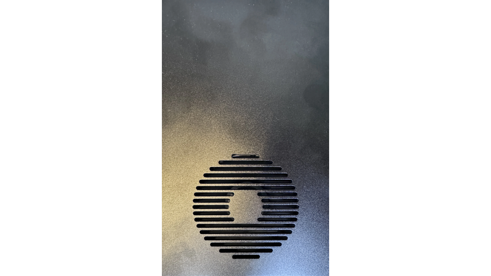

### Imenyekanisha

Ubwonko bwa Mini Miner BMM 100 ni igikoresho cakozwe n’ishirahamwe ry’ubwonko bwa Mining pool. Ico gikoresho gifise ubuhinga bukwegera kandi kiracereje cane. Itanga 1.1 Th/s y’ubushobozi bwo gukoresha ubuhinga bwa none kandi ikoresha nk’amawatts 40. Udakunze ibindi bikoresho, ntabwo ari open source, ariko vy’ukuri biroroshe gushiramwo, vy’ukuri bisaba gusa gukanda gatoyi! Mini Miner BMM 100 ni yo ya mbere yasohotse. Ubu version 2 iriko irakorwa, yitwa BMM 101, itandukanye n’iya mbere mu kuba ifise ikigaragaza kinini cane no kuba hariho Wi-Fi, ariko uburyo bwo kuyishiramwo ni bumwe.

Ushobora kandi kuronka amakuru ahambaye cane mu kuraba uburongozi bwose ataco uhinduye kuri [urubuga rw’umuhinguzi](https://braiins.com/hardware/mini-Miner-bmm-100).

### Incamake ya BMM 100

igikoresho kimeze nk'ikigereranyo gifise ikigaragaza imbere

umuyaga ku ruhande rwo hejuru

mu gihe ku ruhande rw’inyuma dufise: umwobo w’ububasha, umwanya wo gushiramwo ikarita SD (ishobora gukenerwa ku bijanye n’ivyo guhindura vyose), akabuto gatoyi kavuga ngo `IP REPORT` kagufasha kumenya IP Address ya mini Miner, iyo Address ikenewe kugira ngo ugere ku dashboard y’igikoresho. Iyo umuntu amaze gukanda kuri iyo buto, IP Address iragaragara mu masegonda nka 5, hanyuma irazimangana maze igicapo ca set kigasubira kugaragara. Ariko rero, nimba ukeneye guhindura ibintu bimwebimwe, gusa wongere ushireko buto ivugwa maze IP Address izosubira kugaragara ku rubuga. Dukomeje n’urutonde turabona icuma ca Ethernet n’uburyo bwo gusubiramwo igikoresho, ivyo uzokenera gufata pin ukayifata amasegonda 10 kugira ngo usubiremwo ama settings yose ya mini Miner. Ubwa nyuma turabona amatara abiri yerekana, rimwe Green irindi ry’umutuku, ritwereka aho Miner iri.

### Guhuza Mini Miner.

Uzokenera gufatanya igikoresho na internet biciye kuri ethernet, menya ko n’ivyo bishasha (BMM 101) ivyo bitagikenewe. Tugaruke kuri iyi mini Miner, nitwamara kumenya aho iri tuzokenera kuyifatanya mbere n’umurongo wa internet hanyuma tuyihuze n’amashanyarazi: iyo device izoca ifunguka ubwayo maze yerekane IP Address yayo ku rubuga.

### Gutunganya

Turakeneye gufungura umucukumbuzi maze tukinjira muri IP Address itwereka mini Miner mu gice c’ugushaka. Ndabibutsa ko kugira uronke igikoresho kiri ku rubuga uzobwirizwa kuba uri mu karere, rero uzobwirizwa kugira mudasobwa ukoresha ifatanye n’urubuga rumwe na mini Miner. iyo twinjiye muri IP Address duca dukanda enter hanyuma urupapuro rwo kwinjira muri mini Miner, ari rwo Braiins OS, ruzoboneka ku rubuga.

Kugira ngo winjire uzobwirizwa kwinjiza `root` nk'izina ryawe ry'ukoresha, mu gihe ushobora gusiga ijambobanga ubusa. Fyonda kuri login maze mini Miner yawe izoboneka.

### Amagenamiterere rusangi

Reka tujane kuri Sisitemu

mu mirongo dusanga imirongo rusangi nk’insanganyamatsiko (umuco canke umwijima), ururimi, isaha, n’uguhindura ijambobanga.

Nitwaja kuri "Mini Miner Screen" aho kubigira turafise amasetingi ya mini Miner yacu, nk'igaragaza igicapo. Turashobora guhitamwo kwerekana isaha, canke igiciro ca Bitcoin, canke igicapo kirimwo amakuru yerekeye uko imashini imeze nk’igicuruzwa Hash, ubushuhe, amawatts akoreshwa, n’ibindi. Aha ni wewe uhitamwo ivyo ushaka kubona ku rubuga; turashobora kandi guhindura umuco w’ibarabara, gushinga uburyo bw’ijoro, no kwerekana isaha mu buryo bw’amasaha 12 canke 24.

Umaze guhindura, kanda kuri `Bika ivyo wahinduye` uzobona ivyo wahinduye ku mugaragaro w'igikoresho cawe

### Ihuzwa na Mining pool

None ntiturakora, kuko dutegerezwa kwifatanya n'ikidengeri kugira ngo dutangure Mining, rero dutegerezwa kuja kuri "Configuration".

kandi ivyinjira vya mbere ni `Ibidengeri` gusa.

Aha tuzobwirizwa gufata ingingo y’ikidengeri twokoresha. Muri iyi nyigisho nzokwereka uburyo bubiri. Ica mbere ni ukuduhuza na Mining pool Braiins nayo ikoreshwa n’abacukuzi b’abahinga, nk’uko mushobora kubibona muri iyi nyigisho:

https://planb.network/it/tutorials/mining/pool/braiins-pool-557be706-35a9-4375-a563-d55ab5c69f55

Ihitamwo rya kabiri ni ukudufatanya na Mining pool iyo mina mu solo, nka Public Pool, ukurikize iyi nzira kugira ngo ubikore:

https://planb.network/it/tutorials/mining/pool/public-pool-42b9e1b5-722d-471d-b1e3-9ca758065be1

#### Ikidengeri c'ubwonko

Kugira ngo twinjire muri iki kinogo dukeneye gukora konti. iki kigega na co nyene kiratanga amahera akoresheje Lightning Network, rero tuzoshobora kuronka Sats nkeyi ku musi. Kugira ivyo tubishikeko turakeneye gushinga umuravyo Address tuzoronkako impembo. Niba utazi uko wokora konti kuri braiins pool canke uko woshiraho umuravyo wawe wa Address ushobora gukurikira iyi nzira:

https://planb.network/it/tutorials/mining/pool/braiins-pool-557be706-35a9-4375-a563-d55ab5c69f55

Ivyo bimaze gushika tuba turi mu gicapo c’ibarabara ca Braiins. Ico dutegerezwa gukora n’ukubwira pool ko dushaka kwifatanya n’umwe mu Bacukuzi bacu, rero ku ruhande rw’ibubamfu rw’ibarabara uzosanga umubare w’ibintu vyinjiye. Turakeneye kuja ku "abakozi."

kandi dukeneye gukanda kuri buto y'umuyugubwe iri iburyo ivuga ngo "Huza abakozi."

Aha niho haje idirisha rifise amakuru dukeneye kugira ngo duhuze mini Miner yacu n’ikidengeri. Aha ihinduka rimwe gusa dushobora gukora ni uguhitamwo Stratum V2. Kugira umenye ico Stratum v2 ari co raba iyi nkuru iri muri [urutonde rw’amajambo](https://planb.network/ru/ibikoresho/urutonde rw’amajambo/urugero-v2).

Ubu rero turakeneye gukopa uru rudodo rutangura na stratumv2. Turafyonda rero ku kimenyetso gitoyi ca "copy", hanyuma tuja ku dashboard y'imodoka yacu mini Miner twari twasize mu configuration n'ibidengeri. Turafyonda kuri kwongerako ikidengeri gishasha

kandi ushire urudodo twakopye mu kibanza kiri musi ya Pool URL.

Ubu rero turakeneye kwongerako izina ry’ukoresha n’ijambobanga. Reka dusubire ku dashboad y’ikidengeri. Munsi yaho turafise kandi userID n’ijambobanga. UserID n’izina ryacu ry’ukoresha, iryo twatanze igihe twakora konti, hamwe n’izina rya Miner dushaka gushiramwo.ushobora gufata ingingo yo gutanga izina canke kutatanga izina ku gikoresho uriko urahuza n’ikidengeri, ni ubusabe, ariko ni vyiza ko ugishiramwo, rero iyo uhuze deviasi zizoba ziri kure. Niba udashaka gushiramwo ikintu na kimwe ushobora gusiga `Izina ry'Umukozi`.

Turaheza tuja kuri mini Miner yacu tukandika izina ry’ukoresha. Aha tuzokwinjira mu kibazo canje "finalstepbitcoin" ariyo userID yanje, akadomo gatoyi. Iri ni ryo zina nafashe ingingo yo kwita ico gikoresho. Niba udashaka kuyita izina wandike gusa userid dot izina ry'umukozi. Mu gihe canje vyoba ari intambwe ya nyumabitcoin.izina ry’umukozi. Uhejeje kwinjiza izina ry’ukoresha ushobora guhitamwo ijambobanga ukarindika mu kibanza kitagiramwo ikintu. Ushobora kandi gushiramwo anithing123, ariyo nayo yerekanwa mu gicapo c'amazi, ariko ishaka gusa kwerekana ko ushobora gushiramwo ijambobanga ryose ushaka.

Uhejeje kwinjiza amakuru yose utegerezwa gukanda buto yo kubika iburyo (iyo ifise ishusho ya disquette) maze muri ubwo buryo uba waratunganije amakuru y'ikidengeri muri mini Miner.

Ubu ubwirizwa gusubira ku rubuga rw'amazi maze ukande kuri "Ihuye! Subirayo."

Twarahuje mini Miner yacu n’ikidengeri c’ubwonko! Ubu rero urashobora kubibona ku rutonde rw’abakozi. Niba itagaragara gusa kora refresh urindire umwanya mutoyi. Igihe kizoboneka, suzuma ko gifise ikibanza ca "OK" gifise ikimenyetso ca Green.

iyo usubiye ku dashboard ushobora gutangura kubona movement ku graph ukabona Hashrate y’igikoresho cacu. Ivyo bisigura ko ikidengeri kiriko kirakira igikorwa cacu rero turi ku ntumbero zose n’intumbero zose turiko turasenyura.

#### Igidengeri ca bose

Biciye muri iki kidengeri umuntu arashobora kugerageza amahirwe yiwe n’ayanje wenyene, yishingikirije ku kidengeri. Muri ivyo ntituzoronka impembo, ariko tuzoronka impembo yuzuye nitwashobora gucukura ibuye. Tuzoca duhuza n’ikidengeri ca bose, ikidengeri ca Mining gusa gifunguye rwose. Turafungura idirisha rishasha ku mucukumbuzi maze tuja kuri [urubuga.abantu bose.io](https://urubuga.abantu bose.io/#/).

hariho page iriko amakuru yose dukeneye. Turaheza tugakopa ng’aho igice ca Address .

hanyuma dusubire ku rubuga rwa mini Miner yacu, tuja ku configuration no ku bidengeri, dufyonde kuri add pool nshasha (ivyo nyene nk’uko twabibonye haruguru) maze dushire 'stratum Address munsi y'url y'ikidengeri.

None rero reka dusubire kuri page ya pool turabe ko nk’izina ry’ukoresha dutegerezwa kwinjiramwo Bitcoin Address, iryo rizoba ari ryo tuzoronkako impembo mu gihe twoba dusenyuye block, hanyuma akadomo hanyuma izina ry’igikoresho cacu, nk’uko twabigize mbere na Braiins Pool, mu gihe ijambo banga ryacu twoshobora guhitamwo.

Turasubira kuri mini Miner maze munsi y'izina ry'ukoresha dushirako Address Bitcoin ikurikiwe n'igihe n'izina, nzoshiramwo `miniminer`. Mu password aho nzoshiramwo test, wewe winjiza ivyo ushaka vyose.

Ubu rero turazigama ama settings maze tukazimya pool ya Braiins.

Vyiza! Ubu turi Mining ku kidengeri ca bose!

