Trong hướng dẫn này, chúng ta sẽ xem cách thiết lập Canaan Avalon Mini 3 để sử dụng Miner dễ dàng tại nhà.

Cho đến nay, các máy ASIC (*Mạch tích hợp ứng dụng cụ thể*) được thiết kế riêng để thực hiện một nhiệm vụ nhất định - trong trường hợp này là tính toán Hash (SHA-256) cho Miner của Bitcoin - đặc biệt không phù hợp để sử dụng trong gia đình. Sự phiền toái của tiếng ồn, nhiệt sinh ra và nhu cầu điều chỉnh hệ thống điện của bạn để hỗ trợ công suất lớn của các thiết bị này đã ngăn cản hầu hết chúng ta tham gia.

Ngày nay, Canaan, một trong những nhà sản xuất máy ASIC hàng đầu, đã quyết định giải quyết thị trường cá nhân muốn lắp đặt máy Miner tại nhà bằng cách cung cấp một loạt sản phẩm tương đối yên tĩnh và rất dễ lắp đặt (cắm và chạy).

Các thiết bị này được tiếp thị dưới dạng máy sưởi phụ trợ trong trường hợp **Avalon Nano 3S (140W)** hoặc dưới dạng bộ tản nhiệt mini có công suất đầu ra **800W** trong trường hợp **Avalon Mini 3**.

https://planb.network/tutorials/mining/hardware/canaan-avalon-nano-3f6ac96e-ea8a-4dee-9b9b-13875824c9a6

Xin lưu ý rằng sự chênh lệch giá với các máy sưởi truyền thống có công suất tương đương không, trong phần lớn các trường hợp, cho phép bạn kiếm được lợi nhuận tài chính. Satoshi do hoạt động của Mining tạo ra sẽ không bao giờ bù đắp được sự chênh lệch giá này, trừ khi bạn có quyền truy cập vào điện miễn phí (thặng dư) hoặc rất rẻ.

Theo tôi, những thiết bị này nên được coi là một cách đơn giản hơn để Miner tại nhà cho những ai muốn làm như vậy vì lý do cá nhân: *nhận Satss không cần KYC / chơi "xổ số" bằng cách solominating / tham gia vào quá trình phi tập trung hóa Hashrate, v.v..*., trong khi được hưởng lợi **như một phần thưởng** từ nhiệt lượng tạo ra để sưởi ấm căn phòng của một người vào mùa đông. Nhưng không phải là cách tiết kiệm tiền trong hầu hết các trường hợp ít nhất là (các nước phương Tây).

## Mở hộp và Tính năng

### Avalon Nano 3S

Đầu tiên, chúng ta hãy xem bên trong hộp Avalon Mini 3 có gì.

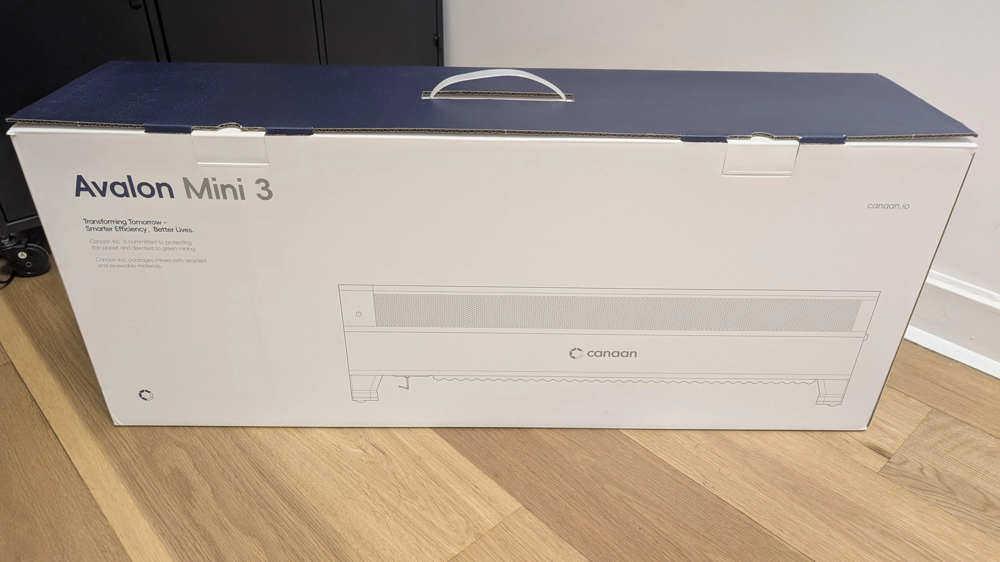

Khi bạn mở hộp, hướng dẫn sử dụng nằm ngay trước mặt bạn, nhưng quan trọng hơn, mô-đun thu WIFI được giấu bên dưới nhãn dán tròn màu trắng ở bên trái hướng dẫn sử dụng. Bạn sẽ cần nó sau.

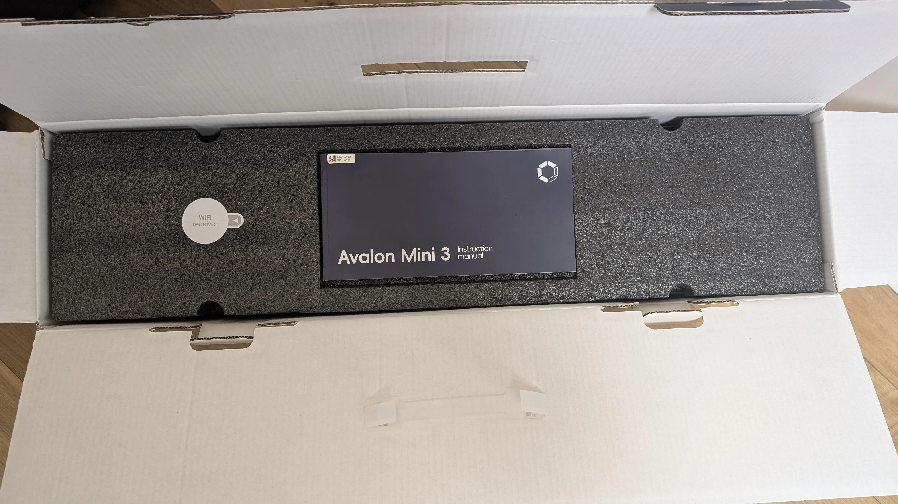

Bên dưới khối xốp là thiết bị, sau khi lấy ra khỏi hộp là bộ phận nguồn Supply.

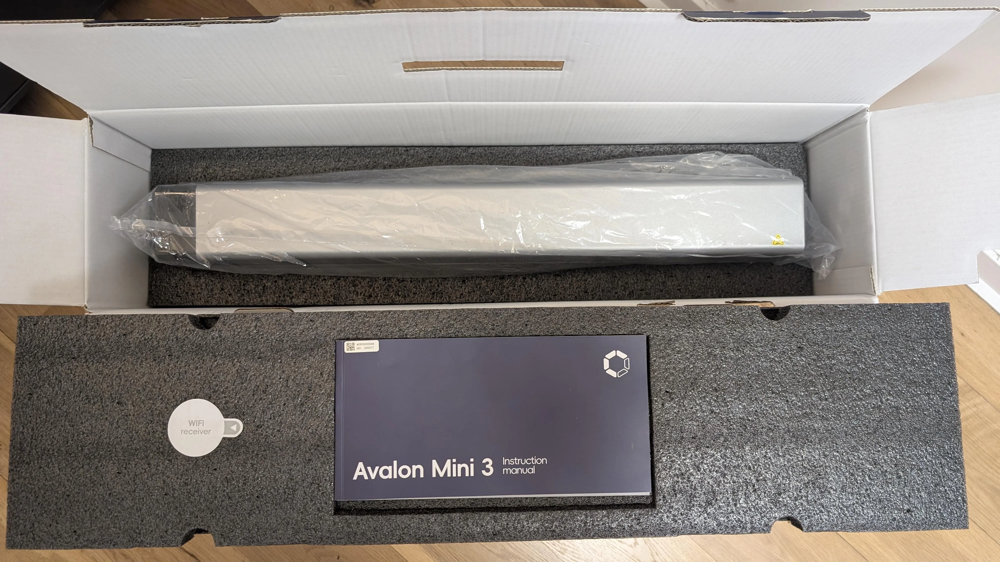

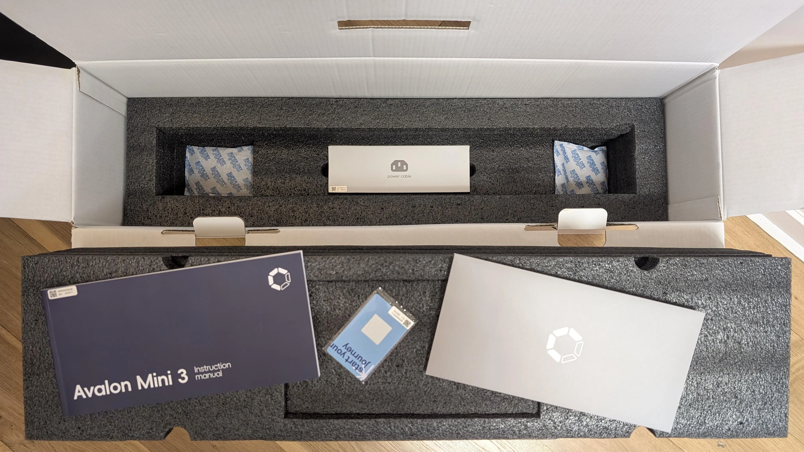

## Bật nguồn và kết nối với mạng cục bộ

Sau khi mở hộp, hãy đặt Avalon Mini 3 của bạn ở nơi tương đối thoáng, nếu có thể, để nhiệt lưu thông tốt. Sau đó, bắt đầu bằng cách lắp mô-đun thu WIFI nhỏ vào cổng USB ở mặt dưới của thiết bị, cắm nguồn Supply và đảm bảo nút nguồn ở vị trí "1".

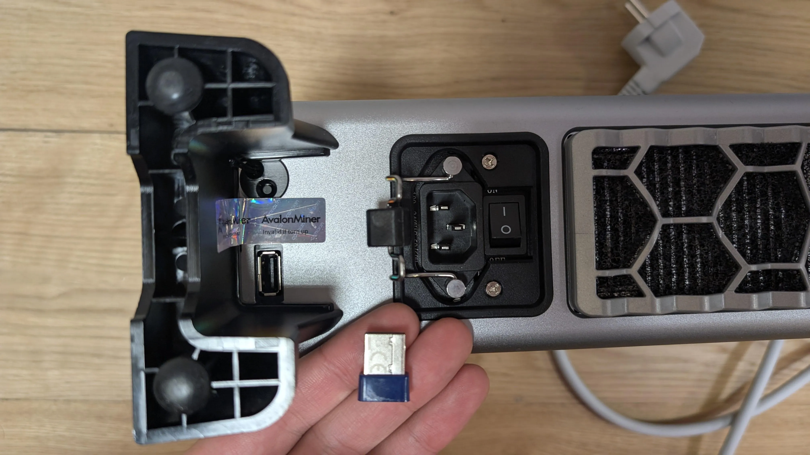

Sau khi hoàn tất các bước này, màn hình LED của thiết bị sẽ sáng lên và hiển thị biểu tượng "Bluetooth", cho biết thiết bị đã sẵn sàng để kết nối với mạng cục bộ của bạn thông qua ứng dụng Avalon Family.

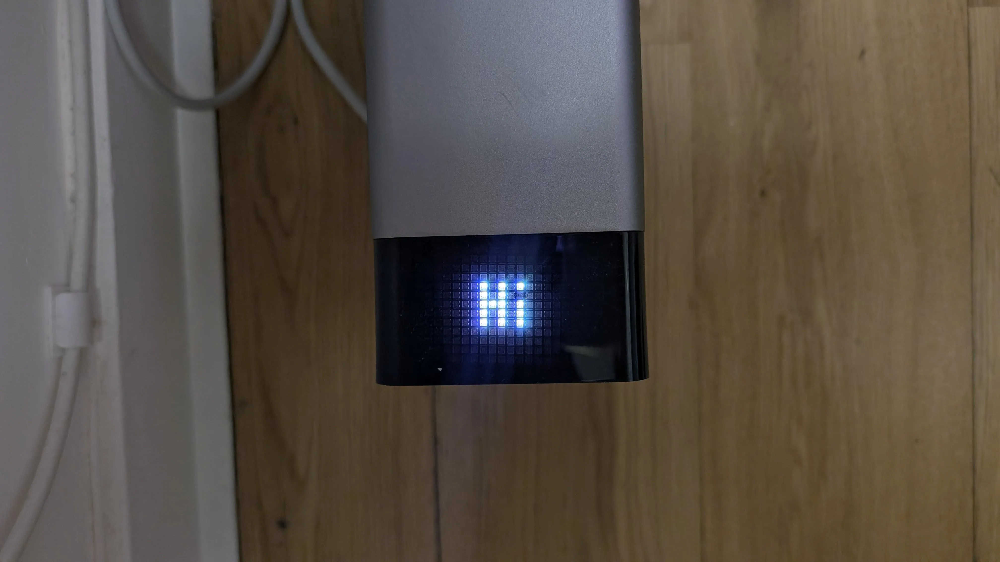

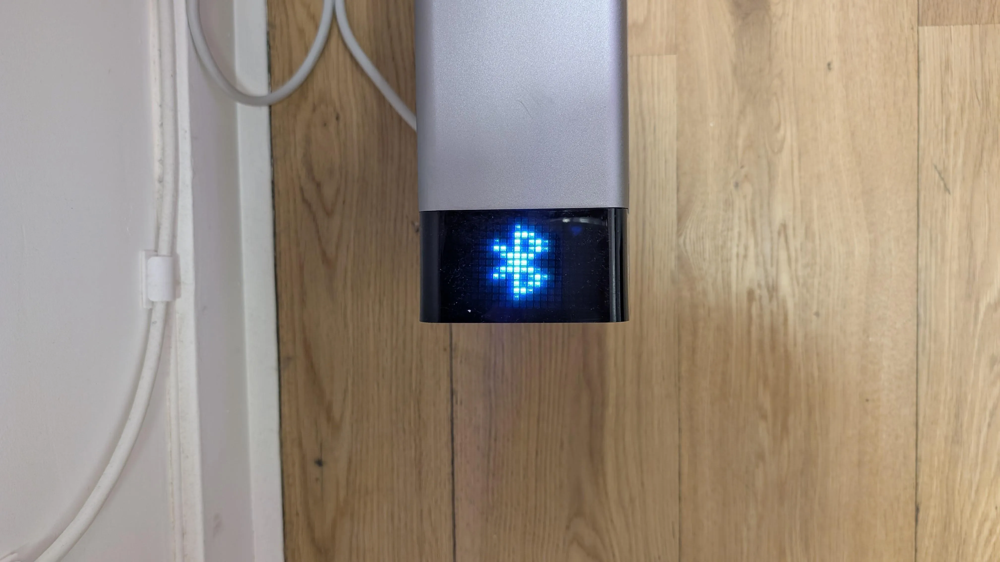

Để thực hiện việc này, hãy vào cửa hàng ứng dụng di động, tìm kiếm và tải xuống ứng dụng **Avalon Family**.

Sau khi cài đặt, hãy mở bằng cách nhấp vào "Bỏ qua" ở góc trên bên phải, sau đó nhấp vào nút "Thêm" và cuối cùng là "Tìm kiếm". Đảm bảo rằng bạn đã bật Bluetooth trên điện thoại thông minh của mình để việc phát hiện thiết bị diễn ra suôn sẻ.

Sau khi ứng dụng phát hiện ra thiết bị, hãy nhấp vào thiết bị đó và chọn "Kết nối". Sau đó, bạn sẽ được đưa đến màn hình nơi bạn có thể nhập thông tin kết nối WIFI của mình.

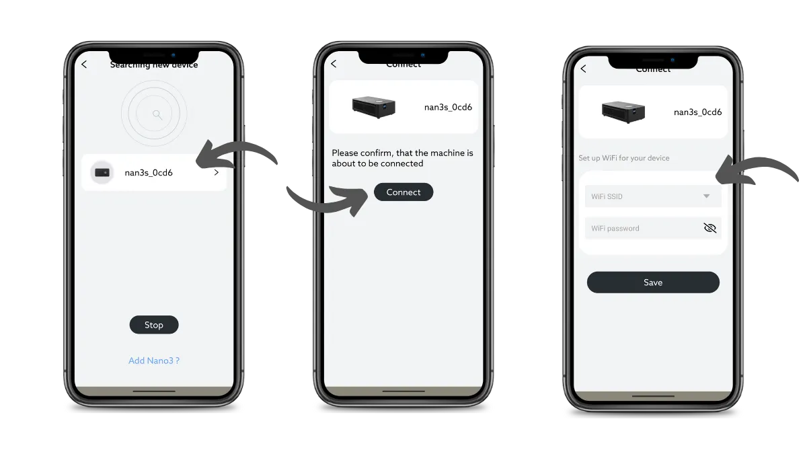

Sau khi kết nối với mạng cục bộ, Mini 3 của bạn sẽ hiển thị thông tin như IP Address, thời gian, Hashrate và nguồn điện.

Dưới đây là bảng tóm tắt thông số kỹ thuật chung của Mini 3:

| Caractéristique                                      | Valeur                                                    |
| ---------------------------------------------------- | --------------------------------------------------------- |
| Hashrate                                             | 37.5 Th/s +- 5%                                           |
| Consommation électrique                              | 800 W                                                     |
| Bruit                                                | 35-55 dB                                                  |
| Température de l'air en sortie                       | 60-70°C (sous température ambiante 25°C)                  |
| Exigences de température ambiante pour l'utilisation | -5° C - 40°C                                              |
| Plage d'entrée de l'appareil                         | 110V-240V AC 50/60Hz                                      |
| Taille de la machine                                 | Longueur: 760 mm / Profondeur: 104 mm / Hauteur: 214.5 mm |
| Poids de la machine                                  |  8.35 kg                                                  |

## Kết nối với Mining pool

**Phần này dành chung cho các thiết bị Nano 3s và Mini 3 vì các quy trình hoàn toàn giống hệt nhau **

Cho dù chúng ta muốn "solominate" hay "pool" Miner, chúng ta sẽ cần kết nối với Mining pool. Trên thực tế, thiết bị của chúng ta không gì khác hơn là một máy tạo Hash không có nhận thức về mạng Bitcoin. Kết nối nó với một pool cho phép nó truy cập vào mạng Bitcoin và cho phép nó nhận các mẫu khối để làm việc.

### Sử dụng ứng dụng để kết nối với Mining pool

Trên ứng dụng Avalon Family, hãy chọn thiết bị như hình dưới đây. Sau đó, bạn sẽ được yêu cầu tự động thay đổi mật khẩu quản trị viên của máy. Nhấp vào "OK" nếu bạn muốn thực hiện hoặc nhấp vào hủy để giữ nguyên mật khẩu truy cập mặc định là "admin".

Sau đó chọn "Cài đặt", rồi "Cấu hình nhóm" và nhập các thông số cho 3 nhóm được yêu cầu.

Pool #2 và #3 sẽ hoạt động như bản sao lưu trong trường hợp một trong số chúng bị lỗi, do đó Miner của bạn không hoạt động vô ích. Theo mặc định, Hashrate sẽ được trỏ đến pool #1

Trong trường hợp của chúng tôi, chúng tôi chọn:

- 1 - Hồ bơi công cộng,
- 2 - CkPool,
- 3 - Đại dương.

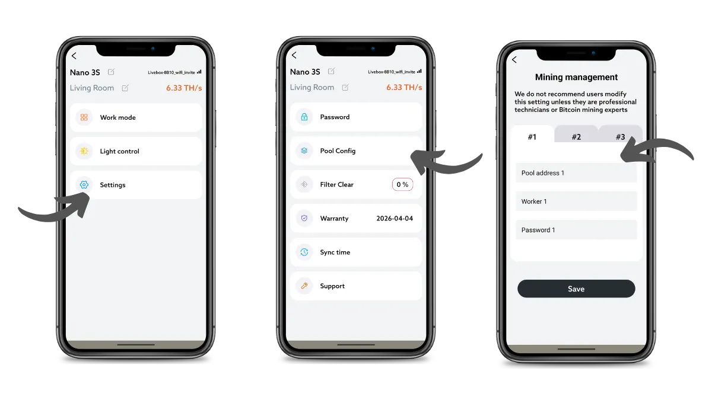

Để biết thêm chi tiết về cách kết nối với Mining pool, vui lòng tham khảo các hướng dẫn sau:

https://planb.network/tutorials/mining/pool/public-pool-42b9e1b5-722d-471d-b1e3-9ca758065be1

https://planb.network/tutorials/mining/pool/ocean-pool-30c9e2c9-2364-44a1-bae0-2afbdb8b1c9c

Tóm lại, chúng ta cần

- pool Address, thường là **stratum+tcp://xxxxxxxx:port**.

- tên của "người làm việc" bao gồm *Bitcoin Address* của bạn và *giả* bạn chọn cho thiết bị của mình, 2 thiết bị này được phân tách bằng dấu *dấu chấm*, ví dụ:**bc1qxxxxxxxxxxxxxxx.MonAvalonNano3S**

- mật khẩu, thường là "**x**"

Sau khi nhập thông tin nhóm, hãy nhấp vào "Lưu".

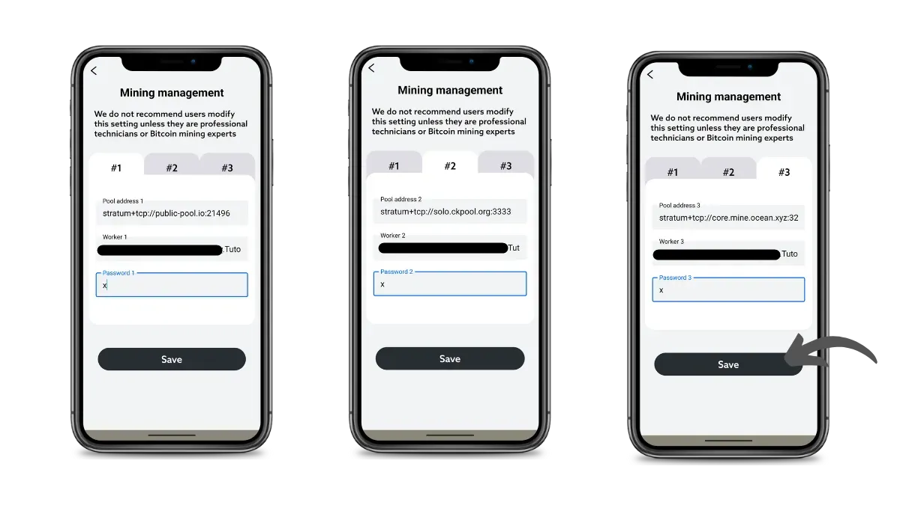

Khởi động lại thiết bị theo hướng dẫn và đợi vài phút cho đến khi Hashrate hướng đến hồ bơi bạn muốn (#1).

### Sử dụng trình duyệt để kết nối với Mining pool

Bạn cũng có thể kết nối với Mining pool và truy cập vào hệ thống quản lý Interface của thiết bị thông qua trình duyệt yêu thích của bạn.

Để thực hiện việc này, hãy nhập vào thanh tìm kiếm của trình duyệt IP Address của thiết bị hiển thị trên màn hình bên dưới, trong ví dụ của chúng tôi là **192.168.144.6**

Trang tiếp theo sẽ xuất hiện, yêu cầu bạn mở ứng dụng Avalon Family và quét mã QR được hiển thị cùng với ứng dụng.

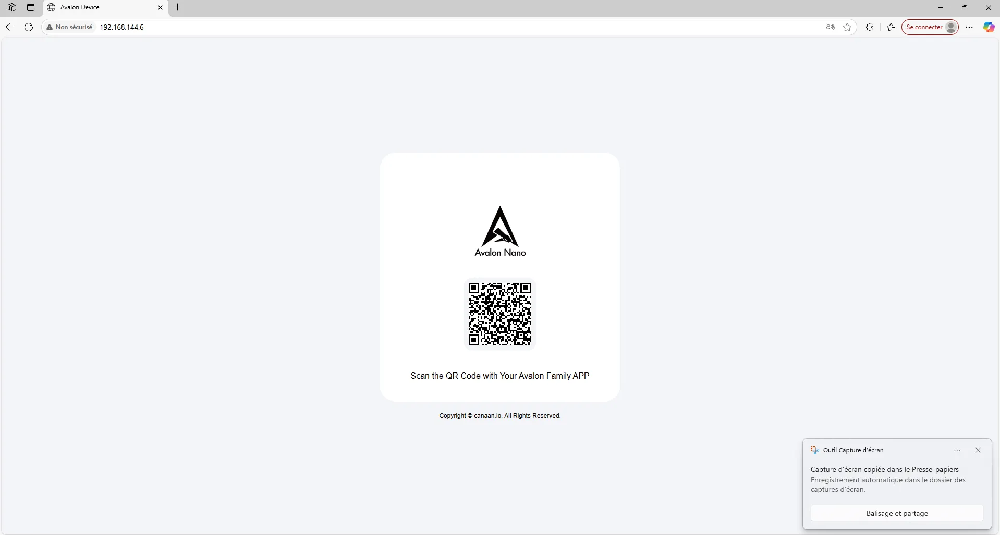

Mở ứng dụng và nhấp vào 3 dấu gạch ngang ở góc trên bên phải, sau đó nhấp vào quét. Quét mã QR của trình duyệt, sau đó nhập mật khẩu quản trị viên của ứng dụng và nhấp vào OK.

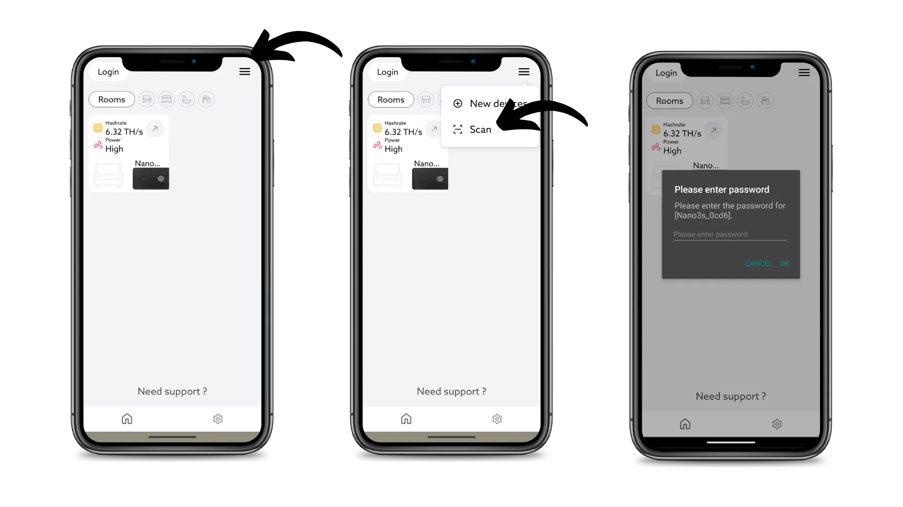

Đây là trang web cho phép bạn tương tác với Avalon của mình. Nó giống một bảng điều khiển để hiển thị các số liệu của máy hơn là một phương tiện để cấu hình máy.

Nhưng bạn vẫn có thể truy cập vào cài đặt nhóm theo cách này bằng cách nhấp vào **"Cấu hình nhóm"** ở góc dưới bên phải.

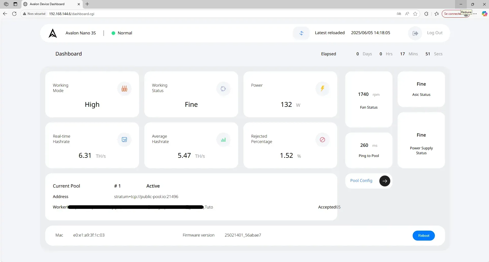

Tương tự như trên ứng dụng di động, bạn có thể nhập thông số nhóm của mình tại đây.

## Kiểm soát thiết bị của bạn thông qua ứng dụng Avalon Family

Bây giờ chúng tôi đã kết nối Miner tại nhà với mạng cục bộ và hướng Hashrate của chúng tôi đến các nhóm khai thác. Bây giờ chúng ta hãy khám phá các tính năng thiết yếu của máy thông qua ứng dụng Avalon Family.

Trong menu chính của ứng dụng Avalon, hãy nhấp vào biểu tượng tương ứng với Avalon Mini 3. Bạn sẽ được đưa trực tiếp đến menu để quản lý các chế độ hoạt động.

Có 3 tùy chọn: chế độ "Sưởi ấm", chế độ "Mining" hoặc chế độ "Ban đêm".

- Ở chế độ "Sưởi ấm", bạn có 2 mức công suất "Eco" hoặc "Super".

Mức "Eco" tương ứng với công suất làm nóng 500W cho Hashrate khoảng 25 Th/s và mức âm thanh 40 dB.

Mức "Siêu" tương ứng với công suất đầu ra là 650 W ở khoảng 30Th/s và 45 dB. Chế độ này cho phép bạn đặt nhiệt độ môi trường tối đa mà ở đó thiết bị sẽ ngừng hoạt động.

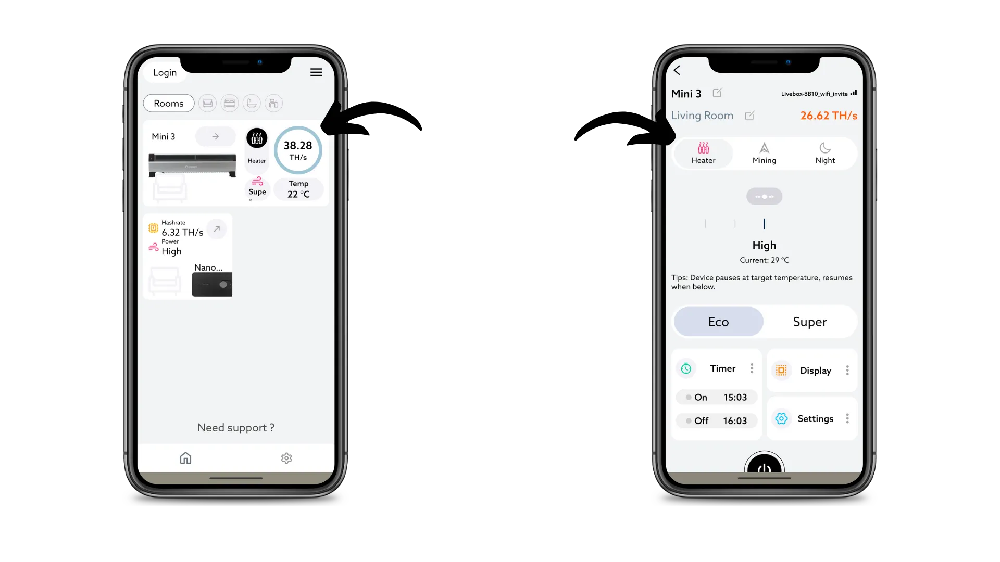

- Ở chế độ "Mining", thiết bị hoạt động ở tốc độ tối đa, không có tùy chọn cài đặt nhiệt độ mục tiêu (tất nhiên là ngoại trừ giới hạn quá nhiệt tích hợp). Mục đích là tận dụng tối đa hiệu suất của Miner. Ở đây, công suất đầu ra đạt tới 800 W ở khoảng 37,5 Th/s và mức độ tiếng ồn là 50-55 dB.

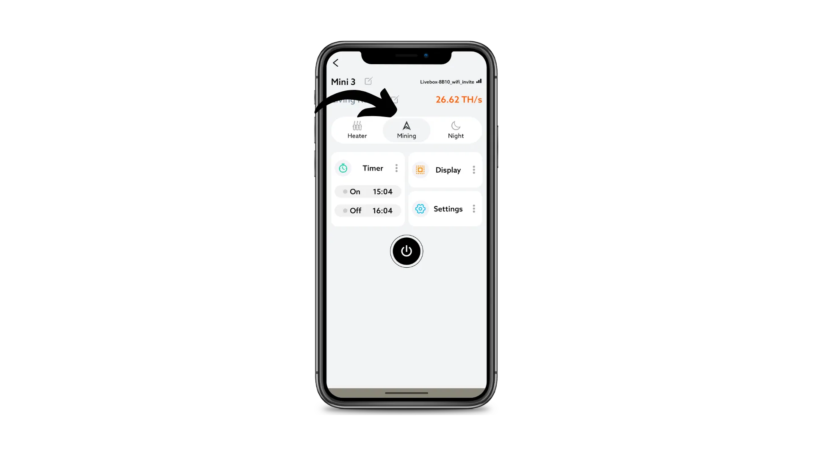

Cuối cùng, ở chế độ "Ban đêm", Mini 3 của bạn hoạt động ở tốc độ thấp nhất có thể với độ ồn tối thiểu. 400 W, 20 Th/s và khoảng 33 dB.

Ở đây, bạn cũng có thể đặt nhiệt độ mục tiêu mà ở đó thiết bị sẽ chuyển sang chế độ không hoạt động và dừng Miner. Nếu nhiệt độ giảm, thiết bị sẽ khởi động lại và tiếp tục sưởi ấm và Miner. Ở chế độ này, đèn LED hiển thị sẽ tắt theo mặc định, nhưng bạn có thể chọn bật chúng nếu cần để chiếu sáng căn phòng trong bóng tối, giống như đèn ngủ (xem ảnh bên dưới).

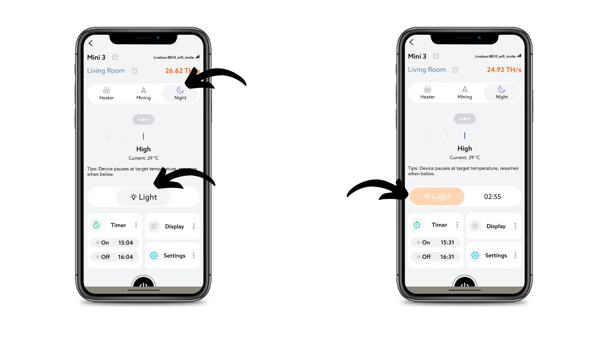

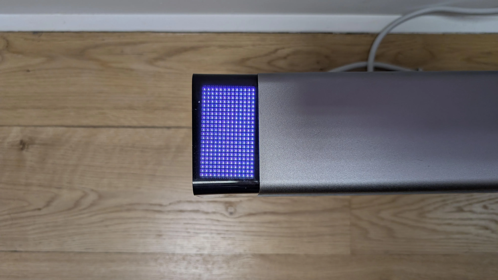

Cuối cùng, bạn có thể chơi với đèn LED của Avalon thông qua menu "Hiển thị". Bạn có thể chọn cuộn qua thông tin hoạt động có liên quan, chọn hiển thị thời gian hoặc thậm chí là hình ảnh tùy chỉnh (pixelated).

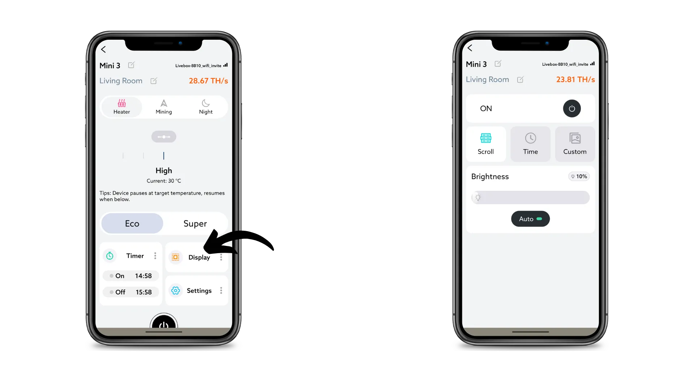

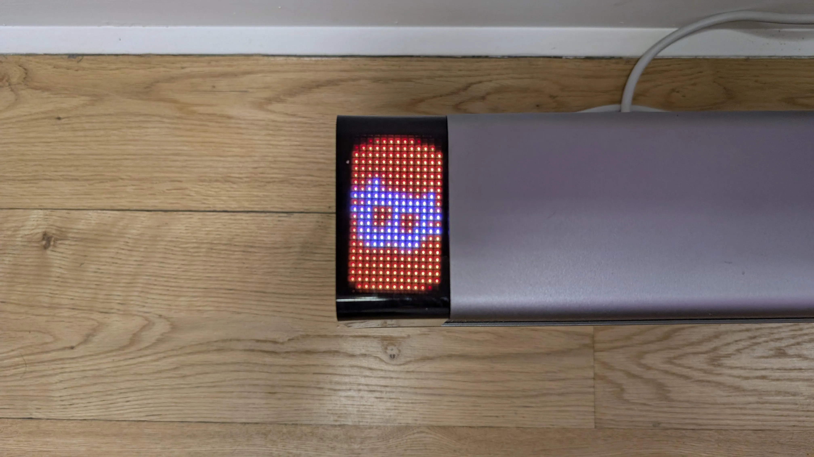

Giống như Avalon Nano 3S, menu "Cài đặt" cho phép bạn thay đổi mật khẩu quản trị viên, cài đặt hồ bơi, kiểm tra tình trạng tắc nghẽn của bộ lọc (nằm ở mặt dưới của thiết bị), liên hệ với bộ phận hỗ trợ hoặc xem nhật ký thiết bị.

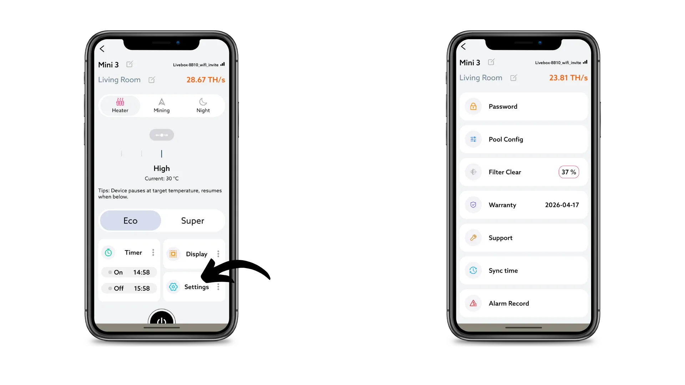

Một lần nữa, bộ lọc ở dưới cùng của thiết bị có thể được vệ sinh bằng máy hút bụi, càng thường xuyên càng tốt.

Chúng ta đã đến phần cuối của hướng dẫn này, hướng dẫn cách kết nối Avalon Mini 3 với mạng cục bộ, cách trỏ Hashrate vào nhóm Mining và cách điều hướng qua các tùy chọn và cài đặt bằng ứng dụng Avalon Family.

Để tìm hiểu thêm, hãy xem hướng dẫn của chúng tôi về phiên bản nhỏ hơn của Avalon: Nano 3S.

https://planb.network/tutorials/mining/hardware/canaan-avalon-nano-3f6ac96e-ea8a-4dee-9b9b-13875824c9a6