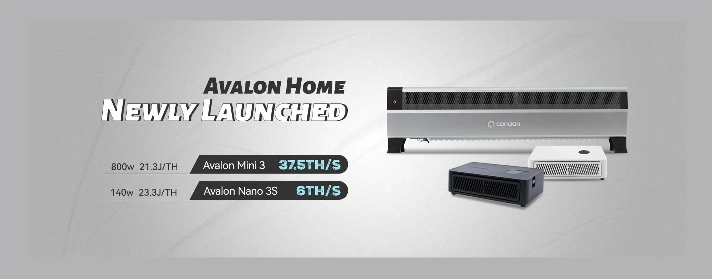

在本教程中，我们将介绍如何设置 Canaan Avalon Nano 3S，以便在家中轻松使用 Miner。

在此之前，专为执行特定任务而设计的 ASIC（*专用集成电路*）机器--在这种情况下，Bitcoin 的 Miner 的 Hash 计算（SHA-256）--特别不适合家庭使用。噪音、产生的热量以及为支持这些设备的巨大能量而对电气设备进行调整的需要，都阻碍了我们中的大多数人参与其中。

如今，作为 ASIC 设备的主要制造商之一，迦南决定通过提供一系列噪音相对较低、安装非常简单（即插即用）的产品，来满足希望在家中使用 Miner 设备的个人市场需求。

这些设备在市场上销售，**Avalon Nano 3S（140 瓦）** 是辅助加热器，**Avalon Mini 3** 是输出功率**800 瓦**的微型散热器。

https://planb.network/tutorials/mining/hardware/canaan-avalon-mini-f2185435-10a3-4d7b-b88f-f1a489babab7

请注意，在绝大多数情况下，与同等功率的传统加热器之间的价格差异不会让您获得经济利润。除非您能获得免费（剩余）或非常便宜的电力，否则 Mining 活动所产生的 satoshis 永远无法弥补这种价格差异。

在我看来，对于那些出于个人原因希望在家中实现 Miner 的人来说，这些设备更应该被视为一种简单的方法： *获得非 KYC Satss / 通过 Solominating 玩 "彩票"/参与 Hashrate 分散化等等......*。但至少在大多数情况下（西方国家），这并不是一种省钱的方式。

## 开箱和功能

首先，让我们看看 Avalon Nano 3S 包装盒内有什么。

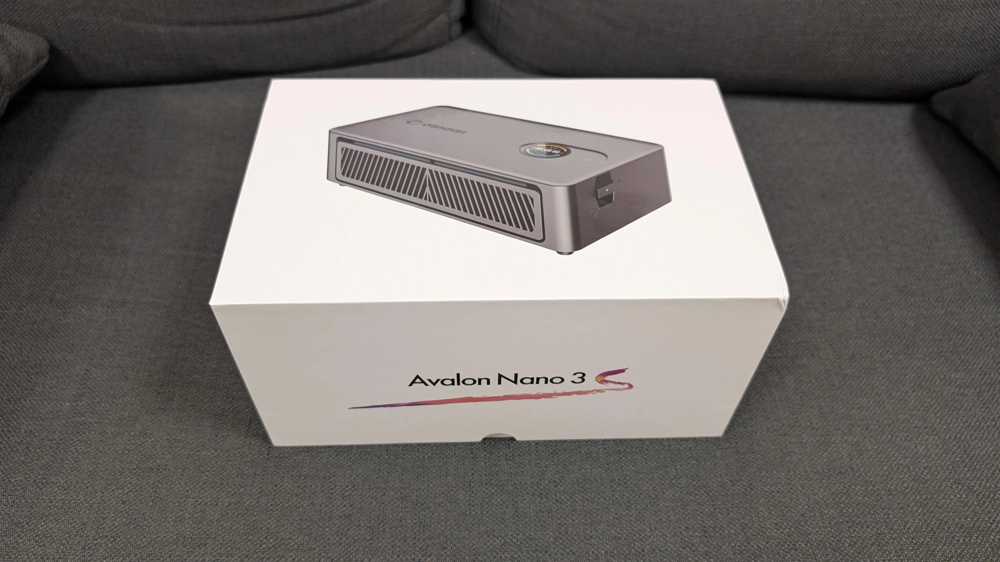

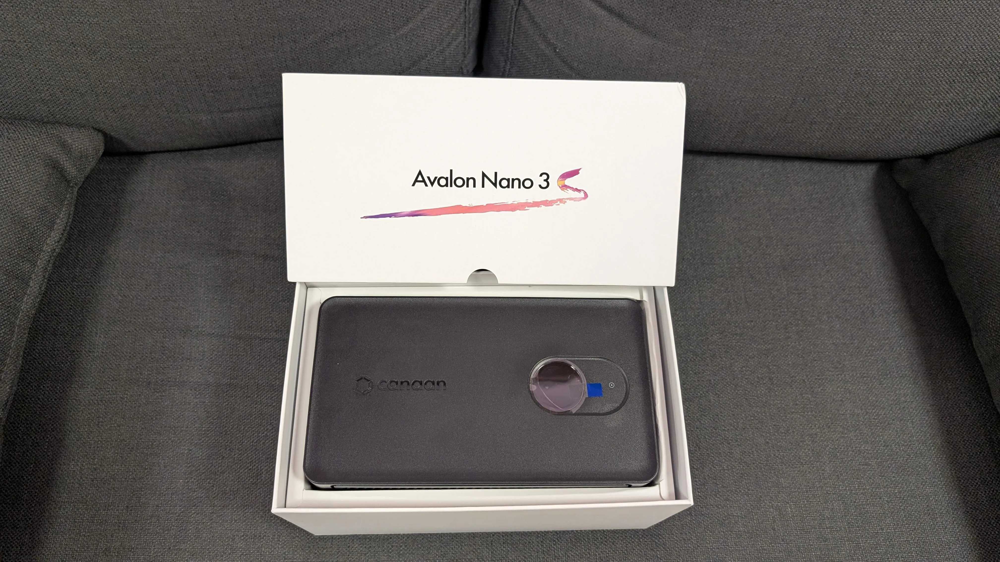

打开包装盒后，你会发现一个纸板套筒，里面装有一个 WIFI 接收器，稍后我们会看到，你需要将其插入设备的 USB 端口，使其能够连接到本地网络。此外，还有使用说明书和一个金属针，用于在必要时将设备重置为出厂设置。

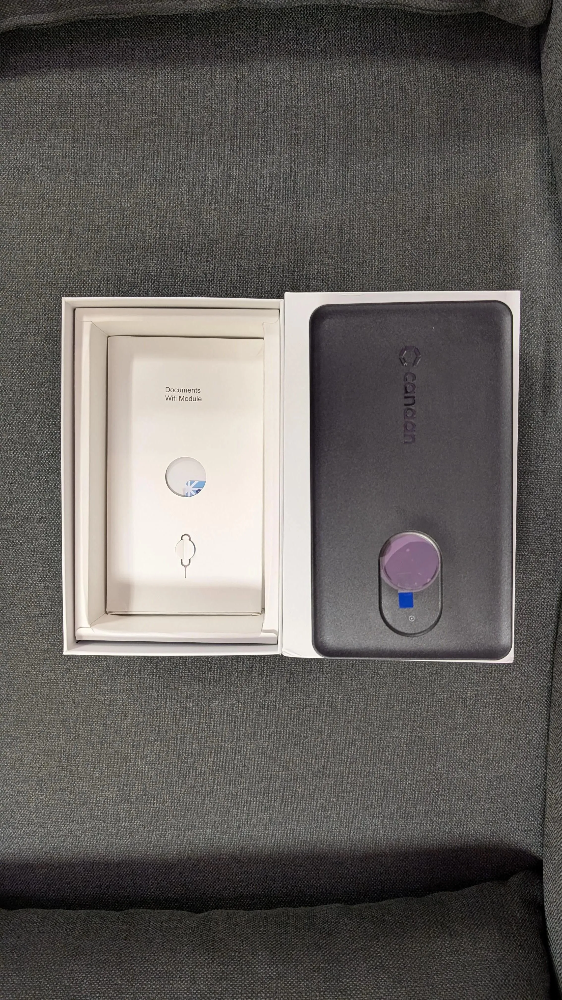

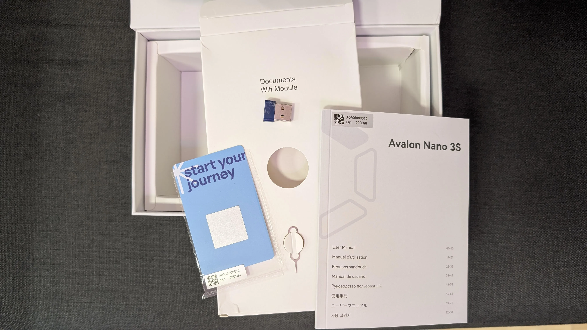

所有东西开箱后，我们会看到以下物品：机器本身、用户手册、WIFI 接收器、前面提到的金属尖头以及设备的电源 Supply。附带的信用卡在我们看来不值一提。

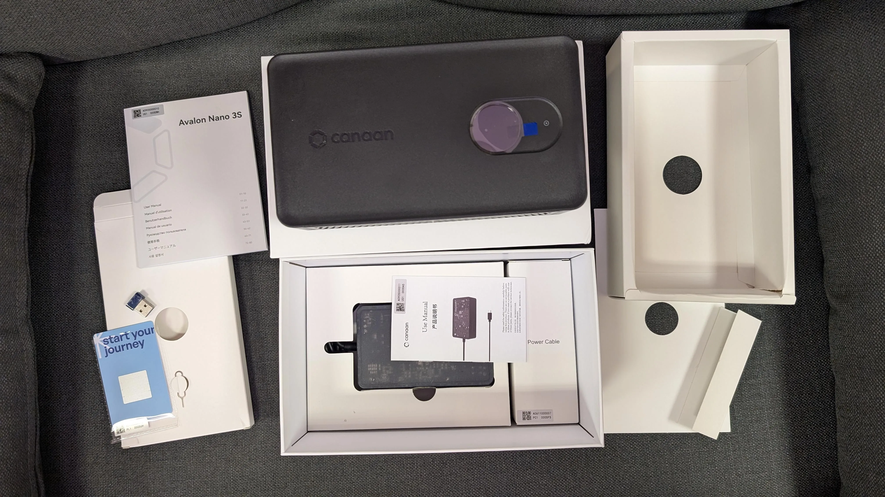

下表概述了 Nano 3S 的一般技术规格：

| Caractéristique                                      | Valeur                                                  |
| ---------------------------------------------------- | ------------------------------------------------------- |
| Taux de hachage                                      | 6 Th/s +- 5%                                            |
| Consommation d'énergie                               | 140 W                                                   |
| Bruit                                                | 30 - 40 dB                                              |
| Plage de température de sortie d'air                 | 60-70°C (sous température ambiante 25°C)                |
| Exigences de température ambiante pour l'utilisation | de -5 à 30°C                                            |
| Plage d'entrée de l'appareil                         | 28V 5A continu                                          |
| Plage d'entrée de l'adaptateur                       | 110-240V AC 50/60Hz                                     |
| Taille de la machine                                 | Longueur: 205 mm /  Largeur: 115 mm / Hauteur:  58.5 mm |
| Poids de la machine                                  | 0.86 kg                                                 |

## 开机并连接本地网络

拆开包装后，尽可能将 Avalon Nano 3 S 放在相对开阔的地方，让热量流通。然后，如下图所示插入小型 WIFI 接收模块：

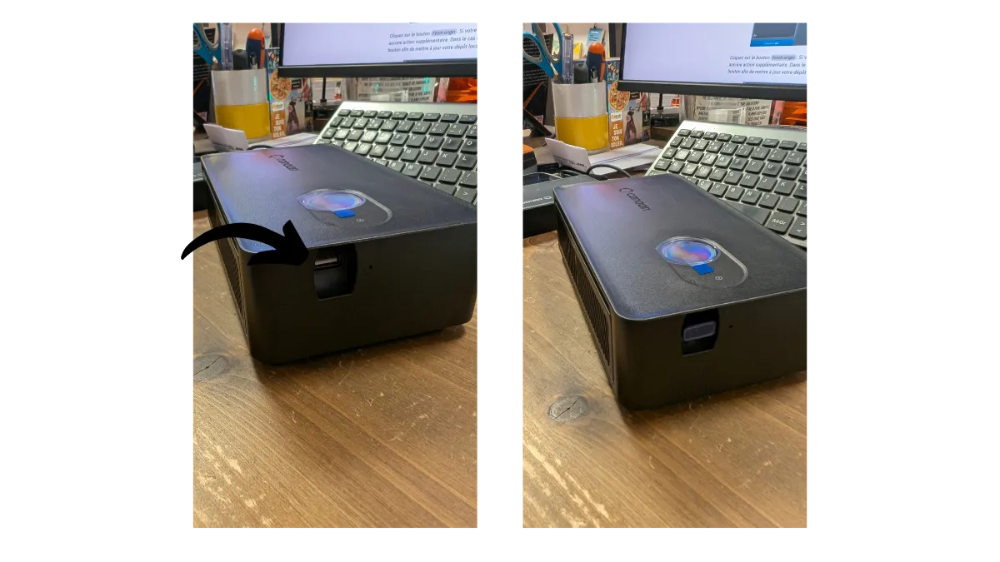

然后将电源 Supply 的 USB-C 插头插入设备的 USB-C 端口，为其供电。

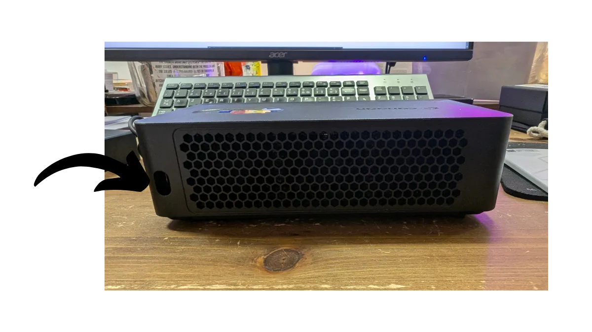

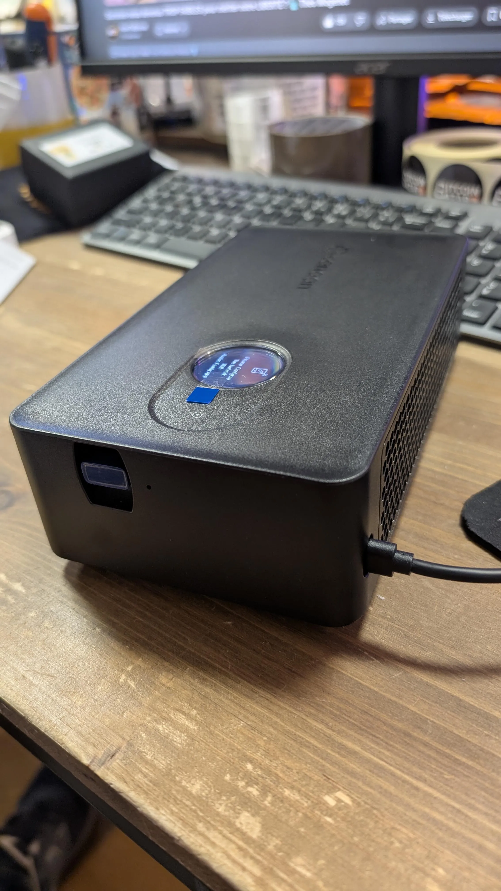

设备启动后，屏幕上会出现 Avalon Nano 徽标，随后出现一个 "手机 "徽标，上面写着 "请使用 Avalon Family App 配置网络"。

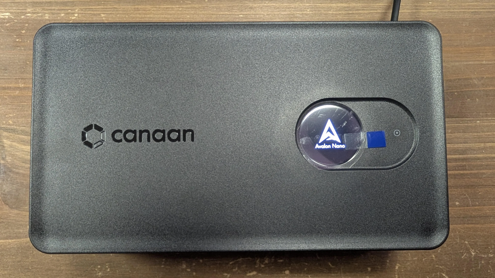

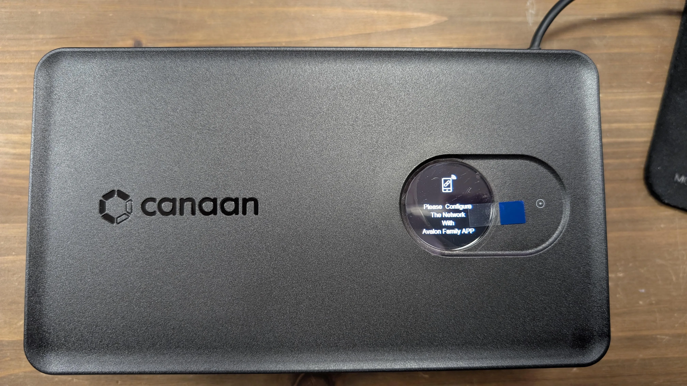

为此，请访问您的移动应用程序商店，搜索并下载 **Avalon Family** 应用程序。

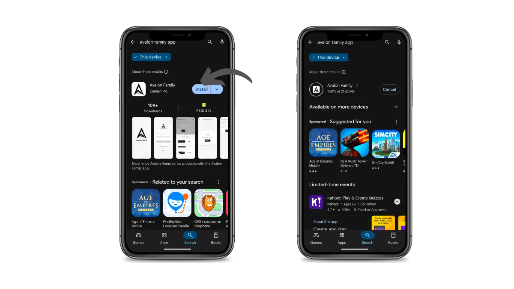

安装完成后，点击右上角的 "跳过 "打开，然后点击 "添加 "按钮，最后点击 "搜索"。确保智能手机已启用蓝牙，以便顺利检测设备。

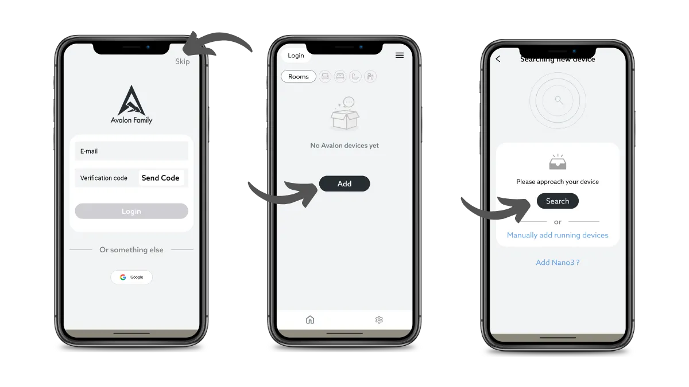

应用程序检测到设备后，点击设备并选择 "连接"。然后，您将进入输入 WIFI 连接详细信息的界面。

设备连接到本地网络后，屏幕将显示如下内容：

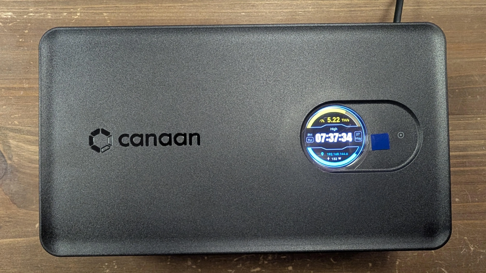

它会显示一个 "虚构 "的 Hashrate（因为尚未配置池），以及设备的时间、日期、电源和 IP Address（如果您想通过 PC 和浏览器访问设备的 Interface，这将非常有用）（稍后详述）。

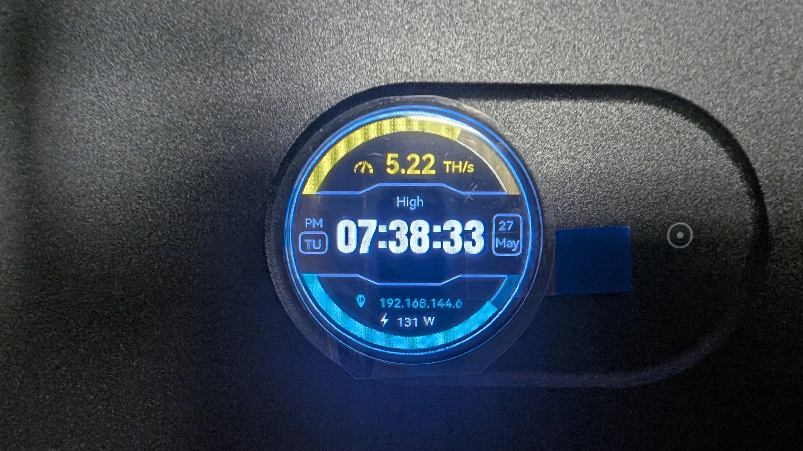

## 连接到 Mining pool

**这一部分是 Nano 3s 和 Mini 3 的共同点，因为它们的流程完全相同**。

无论我们想要 "独占 "还是 Miner "汇集"，我们都必须连接到 Mining pool。事实上，我们的设备只是一个 Hash 制造器，对 Bitcoin 网络没有任何感知。将它连接到 "池 "中，它就能访问 Bitcoin 网络，并接收区块模板。

### 使用应用程序连接 Mining pool

在 Avalon Family 应用程序中，选择设备，如下图所示。系统会自动要求您更改机器的管理员密码。如果要更改，请单击 "OK（确定）"；如果要保留默认访问密码 "admin"，请单击 "Cancel（取消）"。

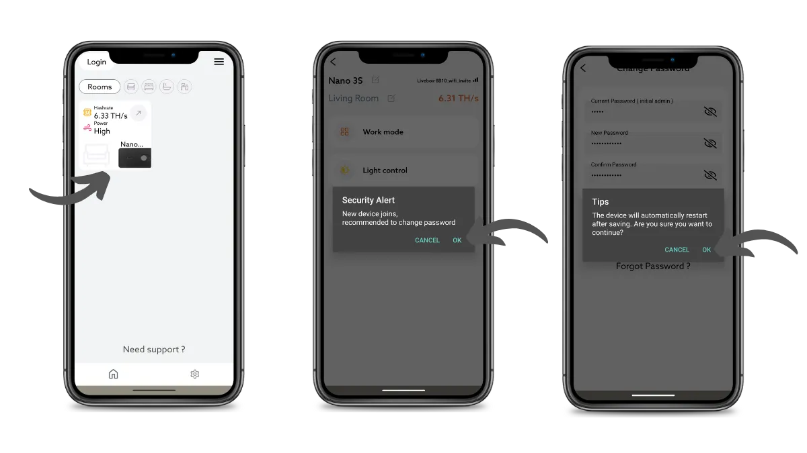

然后选择 "设置"，再选择 "池配置"，输入 3 个所需池的参数。

如果其中一个池出现故障，2 号池和 3 号池将作为备份，这样你的 Miner 就不会白白工作。默认情况下，Hashrate 将指向 1 号池

就我们而言，我们选择

- 1 - 公共游泳池、
- 2 - CkPool、
- 3 - 海洋

有关如何连接 Mining pool 的详细信息，请参阅这些教程：

https://planb.network/tutorials/mining/pool/public-pool-42b9e1b5-722d-471d-b1e3-9ca758065be1

https://planb.network/tutorials/mining/pool/ocean-pool-30c9e2c9-2364-44a1-bae0-2afbdb8b1c9c

总之，我们需要

- 池 Address，通常为 **stratum+tcp://xxxxxxxx:port**。

- 由 *your Bitcoin Address* 和您为设备选择的 *pseudo* 组成的 "工作者 "名称，2 之间用 *dot* 分隔，例如：**bc1qxxxxxxxxxxxxxxx.MonAvalonNano3S**

- 密码，通常总是 "**x**"

输入泳池信息后，点击 "保存"。

按照说明重新启动设备，等待几分钟，直到 Hashrate 指向您的首选池 (#1)。

### 使用浏览器连接 Mining pool

您还可以连接到 Mining pool，更广泛地说，可以通过您喜欢的浏览器访问设备的 Interface 管理系统。

为此，请在浏览器搜索栏中输入下图所示设备的 IP Address，例如 **192.168.144.6**

将出现以下页面，要求您打开 Avalon Family 应用程序并扫描应用程序显示的 QR 代码。

打开应用程序，点击右上角的 3 个破折号，然后点击扫描。扫描浏览器的二维码，然后输入应用程序的管理员密码，点击确定。

这里是与 Avalon 交互的网页。与其说它是一种配置手段，不如说它是一个显示机器指标的仪表盘。

但仍可通过点击右下角的**"池配置 "**来访问池设置。

与手机应用程序相同，您可以在此输入泳池参数。

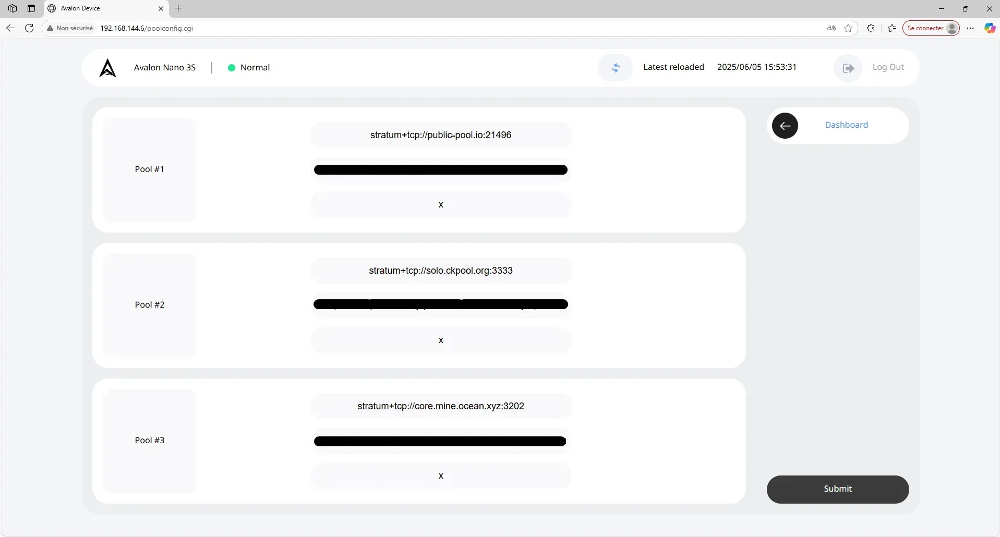

## 通过 Avalon Family 应用程序控制设备

现在，我们已经将家用 Miner 连接到本地网络，并将 Hashrate 对准 Minings 水池。现在，让我们通过 Avalon Family 应用程序来了解我们机器的基本功能。

在 Avalon 系列应用程序中，点击与 Avalon Nano 3S 相对应的图标。

然后会出现 3 个菜单："工作模式"、"灯光控制 "和 "设置"。首先，点击 "工作模式"。然后，您将看到机器的 3 种电源模式。

**低**：70 瓦功耗可实现约 3 Th/s 的 Hashrate。

**中**：100 瓦功耗可获得约 4.5 Th/s 的 Hashrate 功率

**高**：在最大耗电量为 140 瓦时，每秒可提供约 6 Th 的 Hashrate 功率

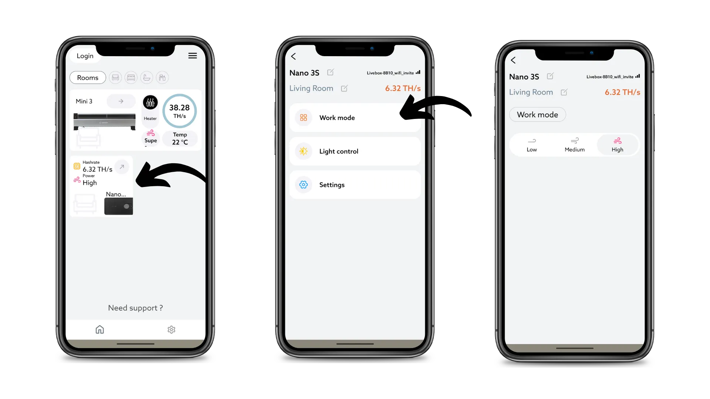

让我们退后一步，探索一下 "灯光控制 "菜单。这纯粹是外观设计。这里有一大堆选项，可以改变颜色、强度、热量，在夜间关闭设备的 LED 灯等等。你很容易就能找到答案。

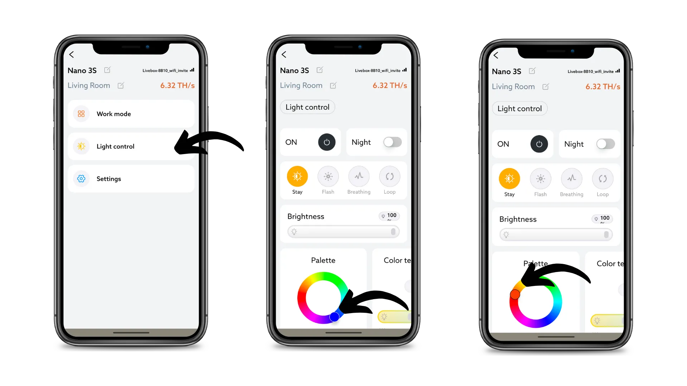

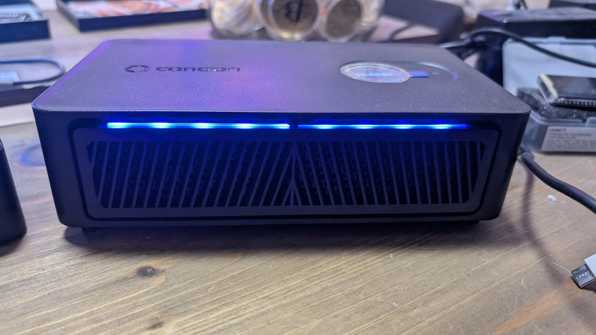

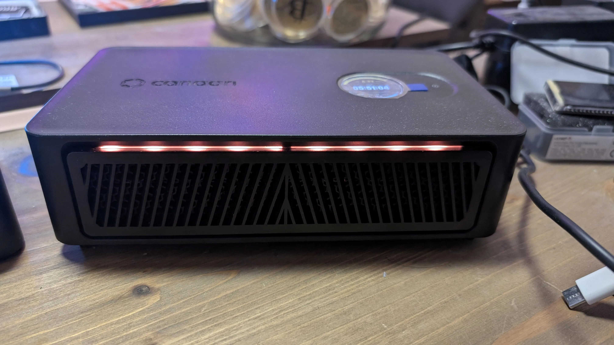

最后，我们可以使用的菜单是 "设置 "菜单，我们已经在连接 Mining 水池时看到过。在这里，您可以管理您的池，更改设备的管理员密码，并观察各种指标，如保修到期日、过滤器清洁度或出现故障时如何联系支持人员。

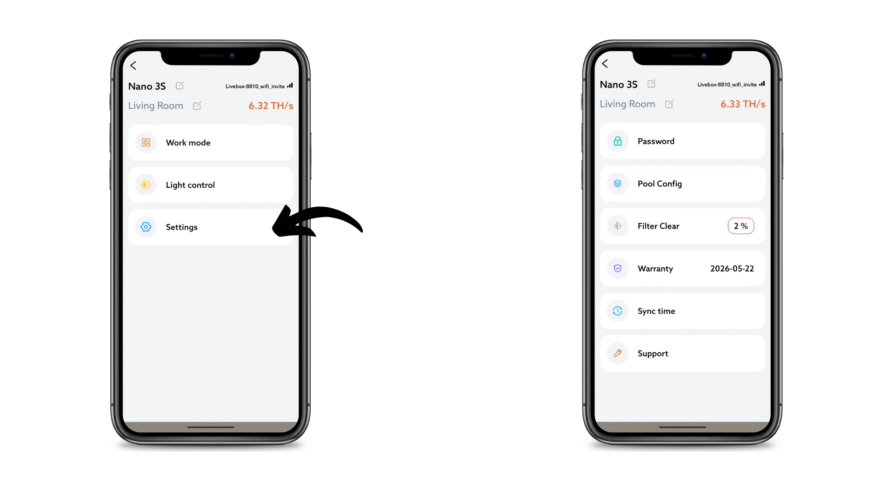

为便于维护和尽可能保持过滤器清洁，我们建议使用真空吸尘器定期对进气口和出气口进行吸尘，以防止堵塞。

本教程的最后，我们将学习如何将 Avalon Nano 3 S 连接到本地网络，如何将 Hashrate 指向 Mining 池，以及如何使用 Avalon Family 应用程序浏览选项和设置。

要了解更多信息，请参阅我们关于 Avalon 的高级版本：Mini 3 的教程。

https://planb.network/tutorials/mining/hardware/canaan-avalon-mini-f2185435-10a3-4d7b-b88f-f1a489babab7