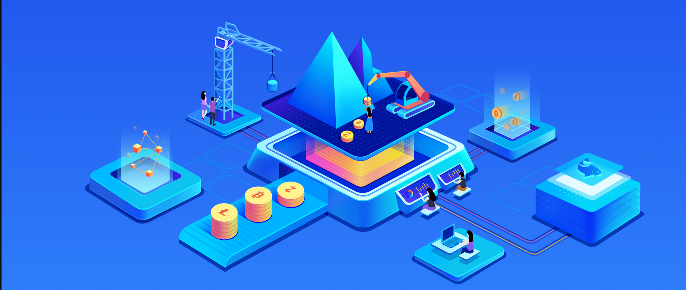

## mining pool nedir?

Kripto para birimi mining, bir blockchain ağını güvence altına almak ve işlemleri doğrulamak için bilgi işlem gücü sağlamayı içerir. Karşılığında, miner'ler kripto para birimleri şeklinde ödüller alırlar.

Yalnız mining** durumunda, bir miner tek başına çalışır ve yalnızca bir blok bulmayı başarırsa ödül alır. Bu yaklaşım, rekabet ve gereken hesaplama gücü nedeniyle günümüzde çoğu kullanıcı için gerçekçi değildir.

Bir **mining pool** kolektif bir çözümdür: birkaç miner hesaplama güçlerini bir araya getirir (hashrate). Bir blok bulunduğunda, ödül katılımcılar arasında katkılarıyla orantılı olarak paylaşılır.

## F2pool'a genel bakış

**f2pool** dünyanın en eski ve en büyük mining pool'larından biridir. 2013 yılında kurulmuş olup, birçok ülkeye yayılmış bireysel miner'ler, endüstriyel çiftlikler ve profesyonel operatörler tarafından kullanılmaktadır.

**f2pool**, miner'ye farklı donanım türleri (ASIC, GPU) kullanarak çok çeşitli kripto para birimleri sunarken :

- detaylı bir izleme arayüzü,
- düzenli ödemeler,
- birleştirilmiş mining mining gibi gelişmiş seçenekler,
- hem yeni başlayanlar hem de deneyimli miner'ler için yönetim araçları.

## F2pool detaylı sunum

### Tarihçe ve güvenilirlik

**f2pool**, Bitcoin ekosisteminin henüz yapılanma aşamasında olduğu bir dönemde, 2013 yılında kurulmuş bir mining pool'dır. İstikrarı, altyapısının güvenilirliği ve birçok profesyonel miner tarafından benimsenmesi sayesinde kısa sürede mining endüstrisinde önemli bir oyuncu olarak kendini kanıtlamıştır.

On yılı aşkın deneyimiyle f2pool, sektörün tarihi havuzlarından biridir. Özellikle Bitcoin ve diğer büyük ağlarda olmak üzere, toplam bilgi işlem gücü (hashrate) açısından düzenli olarak dünyanın önde gelen havuzları arasında yer almaktadır.

Bu uzun ömürlülük, birçok hizmetin ortaya çıktığı ve ardından hızla ortadan kaybolduğu bir ortamda önemli bir güvenilirlik göstergesidir.

### Desteklenen kripto para birimleri

**f2pool** farklı algoritmalara dayalı çok sayıda kripto para biriminin mining'sini destekler. En iyi bilinenleri arasında :

- Bitcoin (BTC)
- Litecoin (LTC)
- Ethereum Classic (ETC)
- Zcash (ZEC)
- Kaspa (KAS)
- Alephium (ALPH)
- Nervos (CKB)

Kripto para birimleri listesi piyasa koşullarına, karlılığa ve ilgili ağların faaliyetlerine göre düzenli olarak değişir. Bu nedenle, en güncel bilgiler için doğrudan f2pool web sitesindeki coinlere ayrılmış bölüme başvurmanızı öneririz.

### Desteklenen mining algoritmaları

Her kripto para birimi belirli bir mining algoritmasına dayanır. f2pool, aşağıdakiler dahil olmak üzere birkaç ana algoritmayı destekler :

- SHA-256 (Bitcoin ve türevleri)
- Scrypt (Litecoin)
- Etchash (Ethereum Classic)
- Equihash (Zcash)
- kHeavyHash (Kaspa)

Algoritma seçimi, kullanılacak ekipman türünün yanı sıra enerji tüketimini ve potansiyel karlılığı da belirler.

### Uyumlu donanım türleri

**f2pool** farklı mining ekipman türleriyle çalışmak üzere tasarlanmıştır:

- ASIC**: belirli bir algoritma için yüksek performansa sahip özel donanım (örn. SHA-256, Scrypt). Bu, mining Bitcoin ve Litecoin için tercih edilen seçimdir.
- GPU**: belirli algoritmalara uyarlanmış çok yönlü grafik kartları. Genellikle alternatif kripto para birimleri için kullanılırlar.

Havuz, konfigürasyon gerekli teknik parametrelere uygun olduğu sürece donanım markaları veya modelleri konusunda herhangi bir özel kısıtlama getirmemektedir.

## mining pool nasıl çalışır?

### Solo ve havuz mining

Solo mining**, tek bir miner'nın bir blockchain ağındaki bir bloğu çözmeye çalışmasını içerir. Bir blok bulunduğunda, tüm ödül miner'ya geri döner. Uygulamada, bu yaklaşım çok yüksek hesaplama gücü gerektirir ve bazen birkaç ay veya yıl süren son derece rastgele ödül süreleri içerir.

Havuz mining** ise çok sayıda miner'un hesaplama gücünün bir havuzda toplanmasına dayanır. Her katılımcı kendi hashrate'siyle katkıda bulunur ve havuz bir blok bulduğunda, ödül önceden tanımlanmış kurallara göre üyeler arasında paylaştırılır.

Bireysel ve küçük ölçekli miner'lerin çoğu için havuz mining, solo mining'a göre çok daha fazla **gelir istikrarı** sunar.

### hashrate ve hisse kavramları

hashrate**, bir miner veya havuz tarafından sağlanan hesaplama gücünü temsil eder. Genellikle H/s (saniye başına hashes) veya MH/s, GH/s, TH/s veya PH/s gibi daha yüksek birimlerle ifade edilir.

Bir mining pool'da, miner'ler doğrudan bir bloğun tam çözümü üzerinde çalışmazlar. Onlar **hisse**, yani kısmi çalışma kanıtları gönderirler. Bu paylar, havuzun her bir miner'nin katkısını doğru bir şekilde ölçmesini sağlar.

Bir miner ne kadar çok geçerli paylaşım gönderirse, havuza katkısı ve ödüllerden aldığı pay o kadar yüksek olur.

### Bir havuz bir bloğu nasıl bulur?

mining pool, hesaplama görevlerini tüm bağlı miner'lere dağıtır. Katılımcılardan biri ağ zorluğuna karşılık gelen geçerli bir çözüm bulduğunda, blok blockchain'ye önerilir.

Sadece bir miner bloğu gerçekten bulsa bile, ödül bir bütün olarak **havuza** verilir, daha sonra tüm katılımcılar arasında paylarla ölçülen katkılarına göre yeniden dağıtılır.

### Ödüllerin dağıtımı

Ödüllerin bir havuz içindeki dağılımı, havuz operatörü tarafından tanımlanan **ödeme yöntemlerine** dayanır. Bu yöntemler, kazanç düzenliliği ve risk alma üzerinde doğrudan bir etkiye sahiptir.

F2pool'da en yaygın ödeme modelleri şunlardır :

- PPS (Pay Başına Ödeme)**: havuzun bir blok bulup bulmadığına bakılmaksızın her geçerli pay hemen ödenir.
- PPS+**: Blok ödülüne ek olarak işlem ücreti dağıtımını entegre eden PPS varyantı.

Bu modeller **gelir öngörülebilirliğini** vurgulamaktadır, bu da profesyonel miner'ler arasındaki popülerliklerini açıklamaktadır.

### Havuz ücretlerinin rolü

Altyapı, bakım ve geliştirme maliyetlerini karşılamak için f2pool bir **havuz ücreti** uygular. Bunlar ödeme yapılmadan önce ödüllerden otomatik olarak düşülür.

Ücret oranı, kullanılan kripto para birimine ve ödeme yöntemine göre değişir. Bir mining işletmesinin genel karlılığını değerlendirirken bunu göz önünde bulundurmak önemlidir.

### Neden f2pool gibi bir havuz seçmelisiniz?

F2pool gibi tanınmış bir mining pool'i seçmek, avantajlardan yararlanmanızı sağlar:

- istikrarlı, yüksek performanslı bir altyapı,
- katkıların ve gelirlerin hassas bir şekilde takip edilmesi,
- düzenli, öngörülebilir ödemeler,
- kazanç varyansında önemli bir azalma.

## Bir f2pool hesabı oluşturun

Tarayıcınızda, resmi [f2pool] web sitesine (https://www.f2pool.com/) gidin ve sağ üst köşedeki **Hesap oluştur** seçeneğine tıklayın.

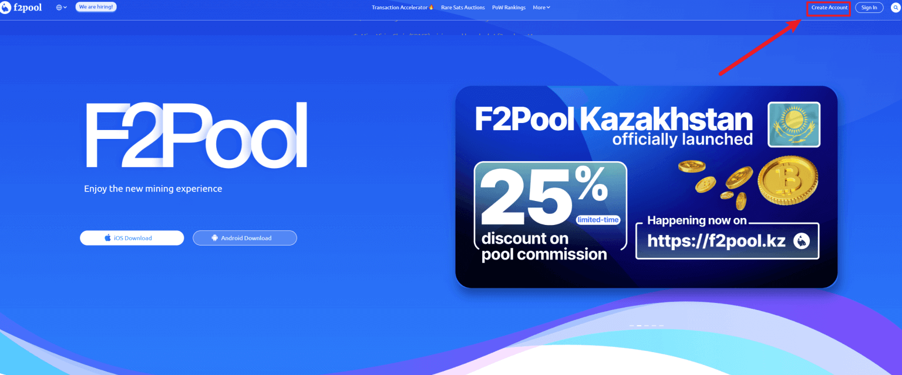

Kayıt sayfasında kullanıcı adınızı, e-posta adresinizi ve şifrenizi girin. Girilen bilgileri doğruladıktan sonra, görüntülenen talimatlara göre kaydı doğrulamaya devam edin. Gerekli unsurları kontrol edin, ardından gönder düğmesine tıklayın.

Kayıt işlemi artık tamamlanmıştır. Gelecekteki girişler ve hesap yönetimi için gerekli olacağından, kayıt bilgilerinizi güvenli bir yerde saklamanızı öneririz.

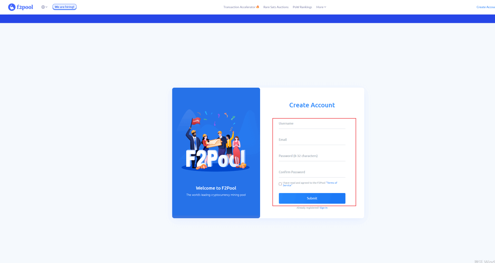

Kayıt işlemi tamamlandıktan sonra, hesabınızın etkinleştirildiğini onaylamak için gelen kutunuzu kontrol edin.

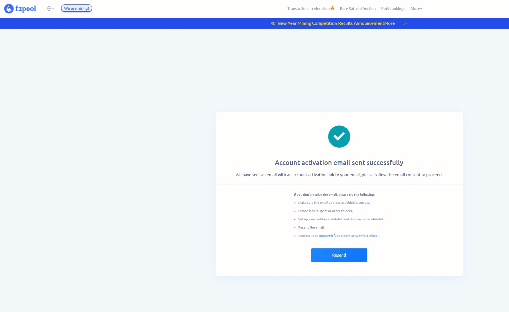

Gelen kutunuza gidin, aktivasyon e-postasını bulun, açın ve hesabınızı etkinleştirmek için verilen bağlantıya tıklayın.

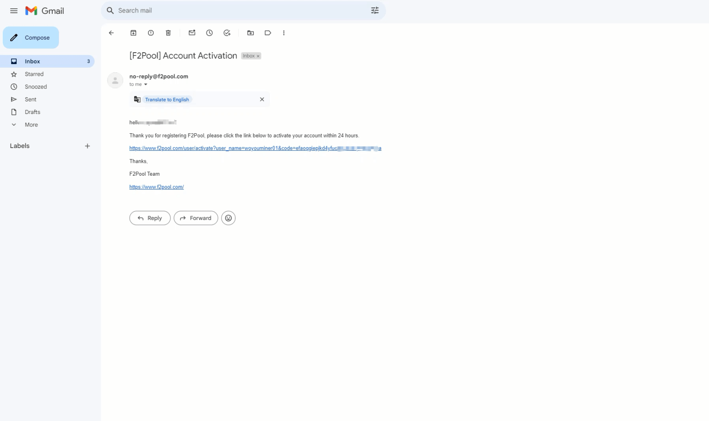

Başarılı hesap kaydının ardından oturum açın.

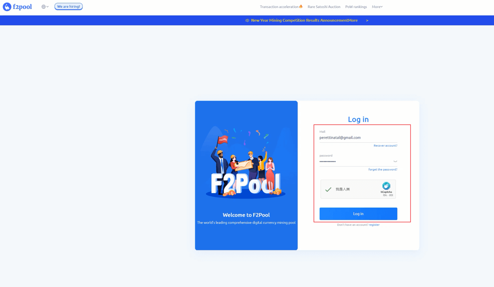

Giriş yaptığınızda, size e-posta ile bir doğrulama kodu gönderilebilir. Hesabınıza erişimi onaylamak için bu kodun girilmesi gerekir.

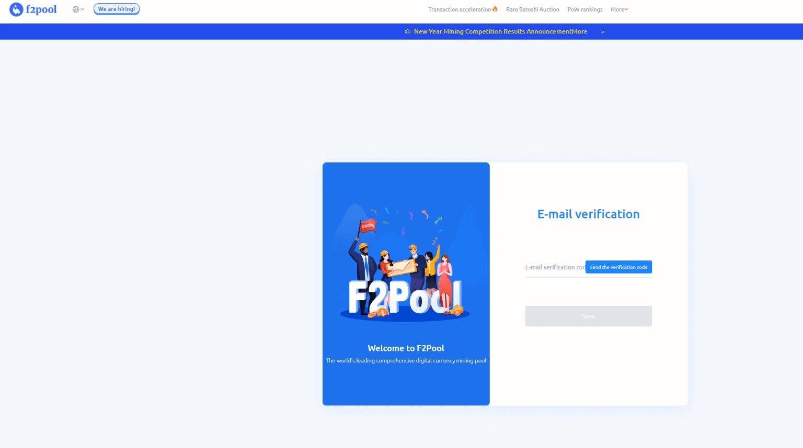

Hesabınızın güvenliğini artırmak için cep telefonu numaranızı ilişkilendirebilir veya iki aşamalı doğrulamayı (iki faktörlü kimlik doğrulama) etkinleştirebilirsiniz.

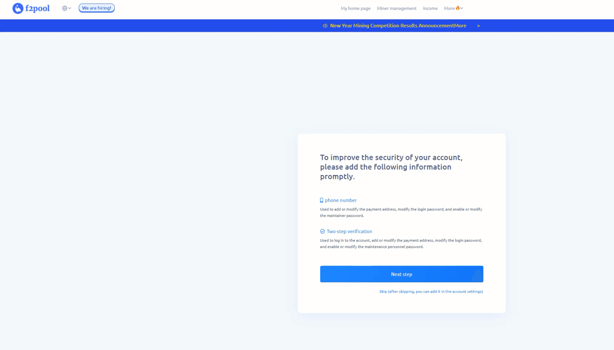

Giriş yaptıktan sonra, ana sayfaya gidin ve ardından "Hesap ayarları "na tıklayın.

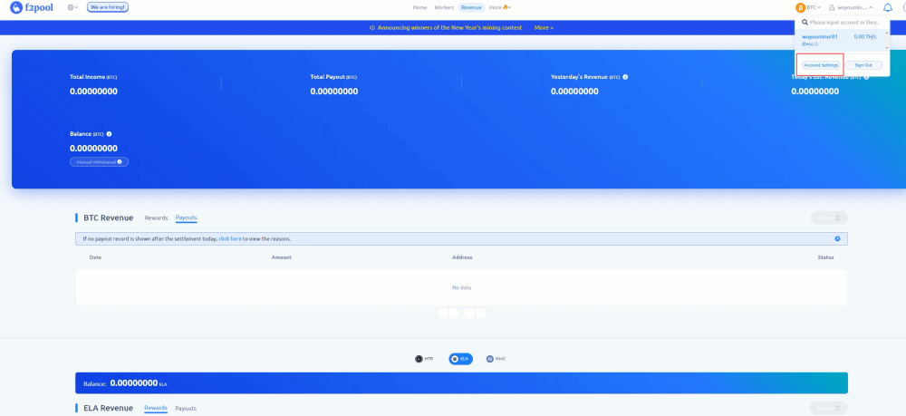

Özel bölüme gidin ve wallet'nızın adıyla ilişkili miner'yi yapılandırın. miner için istediğiniz kripto para birimlerini seçin ve ilgili wallet adresini girin. Minimum ödeme eşiğini de ayarlayabilirsiniz.

Bitcoin adresini girdikten sonra gelen kutunuza bir onay e-postası gönderilecektir. Bu mesajı açın ve adresi doğrulamak için talimatları izleyin.

Onaylandıktan sonra, yeni ödeme adresi 48 saat içinde işleme alınacaktır.

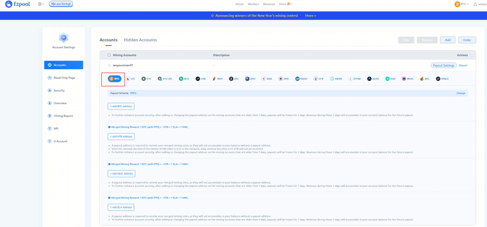

wallet'ınızı kurduktan sonra, mining makinenizi yapılandırmak için gereken BTC mining adresini ve miner'in adını kopyalamak için ilgili sayfaya gidin.

miner yapmak istediğiniz kripto paraya bağlı mining adresini ve miner adını kopyaladığınızdan emin olun.

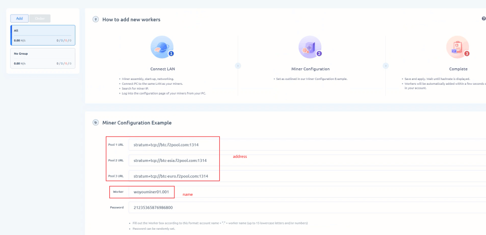

Örneğin, BTC'nın miner'i için, yapılandırma tamamlandıktan sonra bu sayfada miner'inizin düzgün çalışıp çalışmadığını kontrol edebilirsiniz.

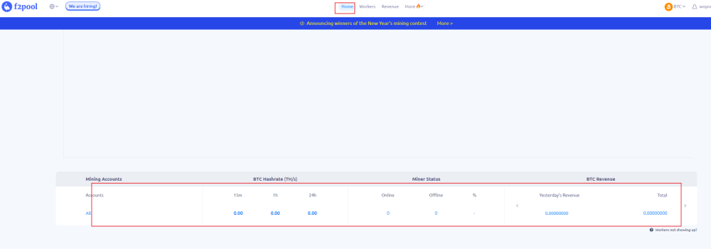

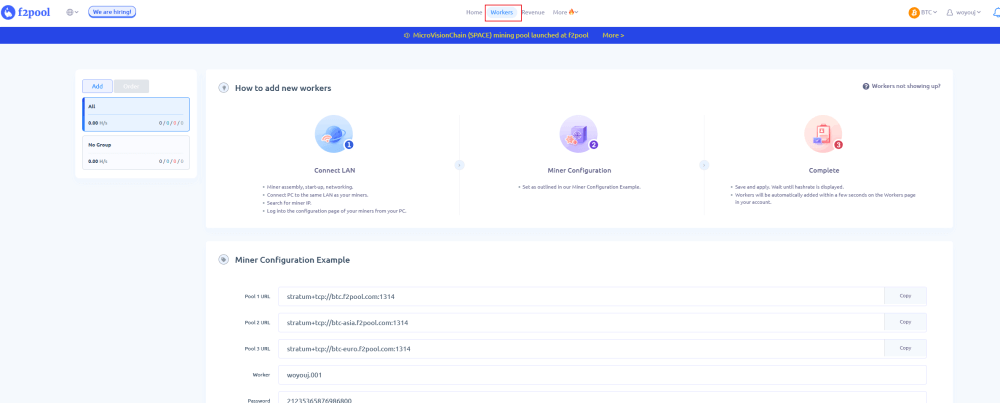

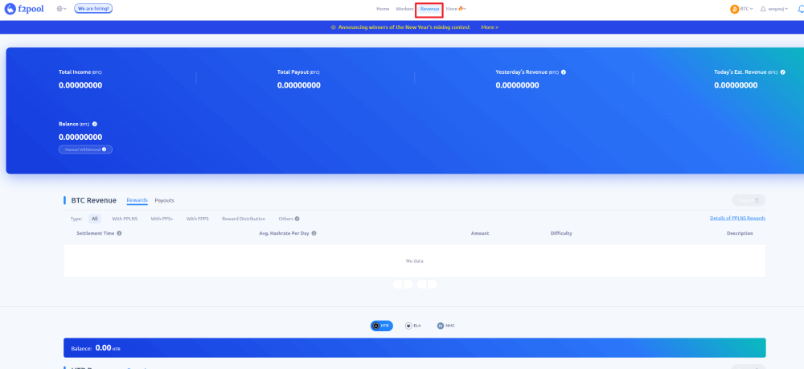

Maden operasyonlarına gözlemci modunda bir bağlantı kurmak için salt okunur sayfaya (müdahale edemeden yalnızca görüntüleyebileceğiniz sayfa) erişin ve ardından "Oluştur "a tıklayın.

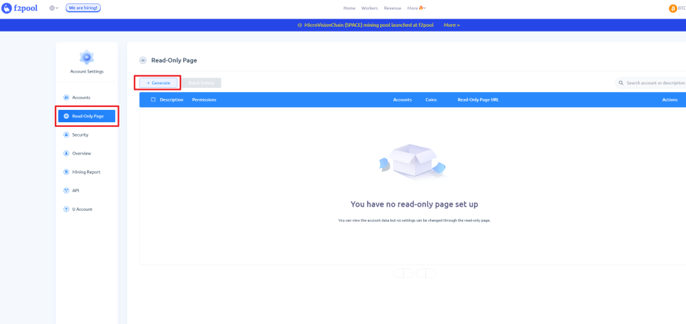

miner'in adını ve miner'e kripto para türünü seçin, ardından oluşturulacak mining makinesinin erişim noktasını seçin. Bu, mining ve bakım ekiplerinin kazançlara veya ödemelere erişimi olmadan makinenin çalışmasını izlemesine olanak tanıyacaktır.

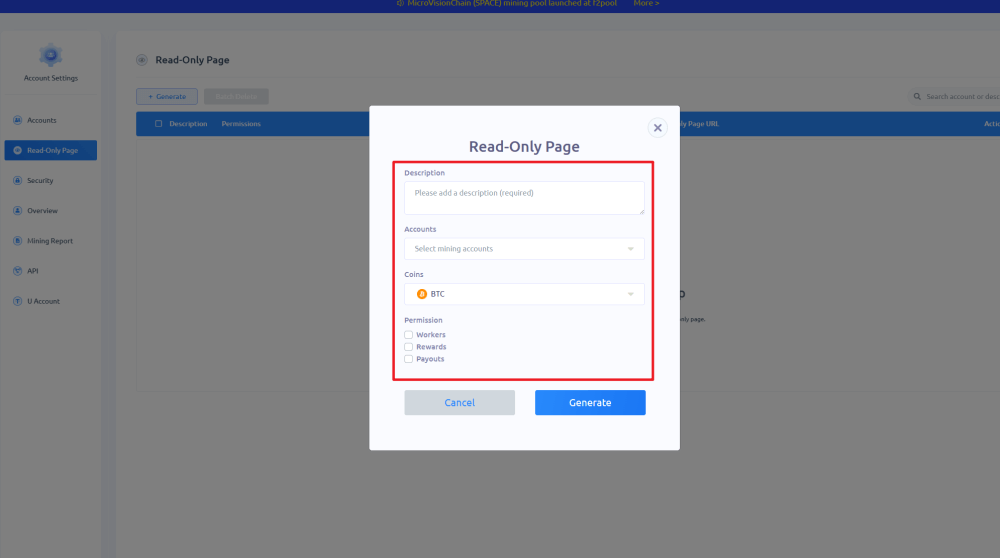

Yapılandırma oluşturulduktan sonra "Kopyala "ya tıklayın ve bilgileri Ops ekibine iletin. mining makinesinde hata ayıklaması yapıldıktan sonra, havuz arka ucu makinenin çalışma durumunu görüntüleyebilecektir.

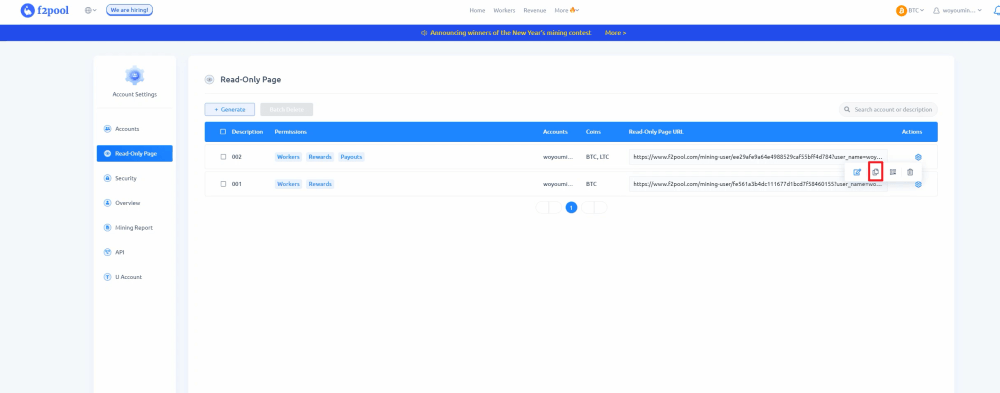

## F2pool'un Avantajları

F2pool'un başlıca avantajları şunlardır:

- sağlam ve istikrarlı bir altyapı,
- güçlü likidite ve düzenli ödemeler,
- performans izleme için net bir arayüz,
- belirli ağlarda birleştirilmiş mining desteği,
- piyasadaki mining yazılımlarının ve ürün yazılımlarının çoğuyla uyumluluk.

Bu, f2pool'un neden her boyuttaki miner'ler tarafından yaygın olarak kullanıldığını açıklar.

## Sınırlar ve dikkat edilmesi gereken noktalar

Her merkezi havuz gibi f2pool'un da belirli sınırlamaları vardır:

- üçüncü taraf bir operatöre bağımlılık,
- havuz ücretleri kripto paraya göre değişmektedir,
- yeni başlayanlar için karmaşık görünebilecek zengin bir arayüz.

Bu noktalar büyük engeller değildir, ancak bir mining pool seçerken dikkate alınmalıdır.

## Sonuç

f2pool, istikrarı, uzun ömürlülüğü ve desteklediği varlıkların çeşitliliği sayesinde kripto havuzu mining için bir referans çözümü olarak kendini kanıtlamıştır. İster yeni başlayan ister deneyimli bir miner olun, platform mining etkinliğinizi yapılandırılmış bir şekilde başlatmak, izlemek ve optimize etmek için doğru araçları sunar.