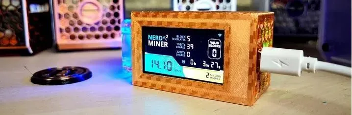
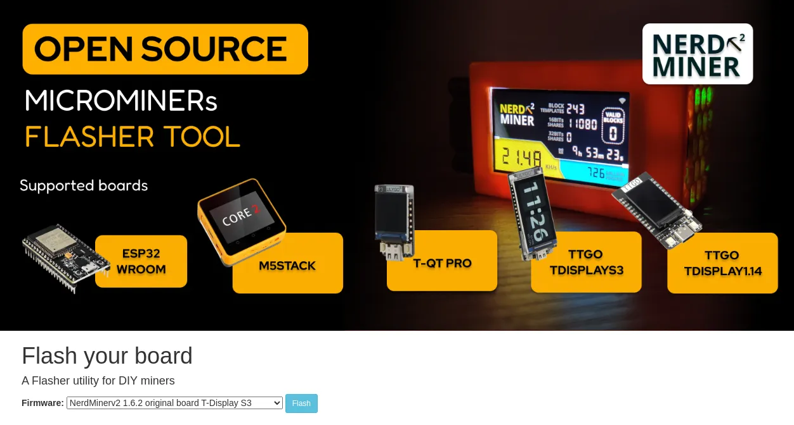
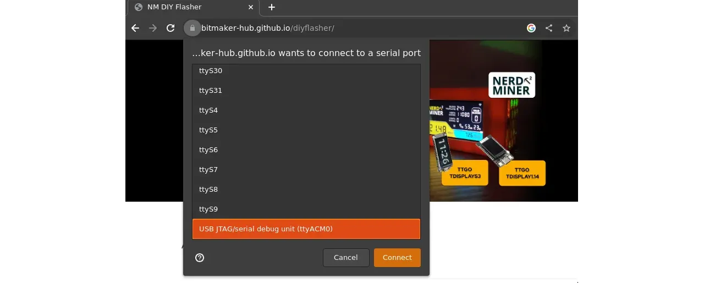
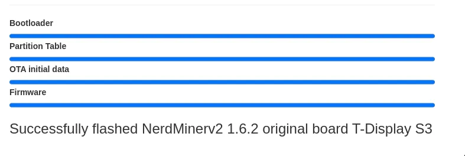
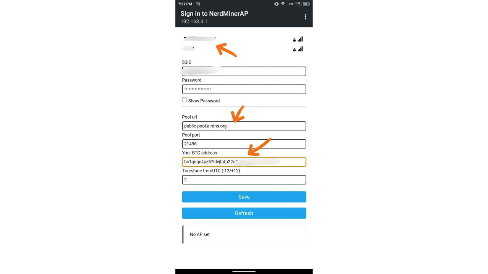
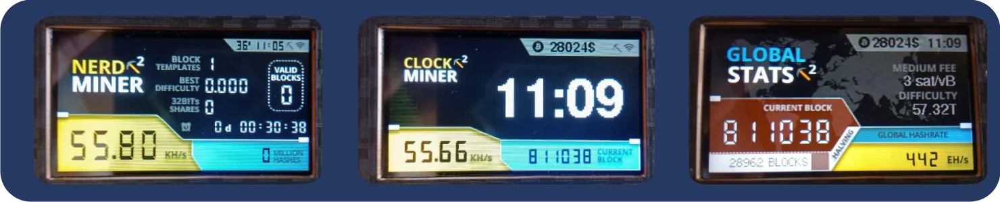

## Konfiguracija vašeg NerdMiner v2

U ovom vodiču ćemo vas provesti kroz potrebne korake za postavljanje NerdMiner_v2, koji je hardverski uređaj (ESP-32 S3) posvećen Bitcoin Mining.

Očigledno je da računarska snaga takvog uređaja ne može da se takmiči sa ASIC-ima amaterskih ili profesionalnih rudara. Ipak, NerdMiner je savršen edukativni alat za učiniti Bitcoin Mining opipljivim. A ko zna, uz (mnogo) sreće, možda pronađete blok i nagradu koja ide uz njega. Za radoznale, videćemo u odeljku [Procena verovatnoće dobitka](#estimation-de-la-probabilite-de-gain). Što se tiče potrošnje energije, NerdMiner troši 0.5W; za poređenje, LED lampa u proseku troši 20 puta više.

Pre nego što pređemo na različite korake, hajde da navedemo potrebnu opremu za izradu:

- a [Lilygo T-display S3](https://lilygo.cc/products/t-display-s3)
- a [USB-C power Supply](https://amzn.eu/d/gIOot90)
- 3D kućište: ako imate 3D štampač, možete preuzeti [3D fajl](https://www.printables.com/model/501547-nerdminer-v2-click-case-w-buttons), u suprotnom možete kupiti jedno u [Silexperience online prodavnici](https://silexperience.company.site/NerdMiner_V2-p544379757).
- računar sa instaliranim Chrome pregledačem
- internet konekcija
- a Bitcoin Address

Takođe možete kupiti unapred sastavljen NerdMiner komplet od nekoliko prodavaca kao što su:

- [DécouvreBitcoin](https://shop.decouvrebitcoin.com/products/nerd-Miner?_pos=1&_psq=nerd&_ss=e&_v=1.0)
- [BitMaker](https://bitronics.store/shop/)

Prvo ćemo videti kako da flešujemo softver na ESP-32 S3, a zatim ćemo videti kako da ga restartujemo kako bismo promenili WiFi mrežu. Ovi koraci su za korisnike Windows-a, ako koristite Linux OS, molimo vas da izvršite [preliminarne korake](#etapes-preliminaires-pour-utilisateurs-linux) kako biste omogućili prepoznavanje ESP-32 S3 od strane vašeg sistema.

**Instalacija NerdMiner_v2 Softvera** je znatno pojednostavljena zahvaljujući korišćenju webflasher-a.

## Korak 1: Priprema Webflasher-a

Prvo, treba da odete na [online NM2 flasher](https://bitmaker-hub.github.io/diyflasher/).

Zatim izaberite firmver koji odgovara vašem ESP-32. Većinu vremena to je podrazumevani: T-Display S3. Zatim kliknite na "Flash".

**Napomena⚠️ :** važno je da koristite Chrome pregledač - jer on omogućava, po defaultu, korišćenje flash-a i pristup vašim USB portovima.

## Korak 2: Povezivanje ESP-32

Kada se webflasher pokrene, pojaviće se iskačući prozor koji prikazuje različite USB portove koje pretraživač prepoznaje.

Zatim možete povezati svoj ESP-32, i novi port će biti prikazan (u ovom slučaju, to je ttyACM0 port). Zatim ga morate odabrati i kliknuti na "connect".

Softver će zatim biti preuzet na vaš ESP32 za nekoliko sekundi.

## Korak 3: Konfiguracija NerdMiner-a

Konfiguracija vašeg NerdMiner-a će biti obavljena putem pametnog telefona ili računara.

Omogući WiFi i poveži se na lokalnu mrežu NerdMinerAP. Ako koristiš pametni telefon, portal za konfiguraciju će se automatski otvoriti. U suprotnom, unesi Address 192.168.4.1 u pregledač.

Zatim izaberite "Configure WiFi".

Sada možete konfigurisati svoj NerdMiner.

Prvo se povežite na svoju WiFi mrežu tako što ćete odabrati naziv mreže i uneti odgovarajuću lozinku.

Zatim možete izabrati Mining pool u kojem želite učestvovati. Zaista, u industriji Bitcoin Mining je uobičajeno udruživanje računarske snage kako bi se povećale šanse za pronalaženje bloka u Exchange radi proporcionalne podele nagrade prema pruženom Hashrate.

Za NerdMiners, možete izabrati da se povežete na jedan od ovih pool-ova:

| Pool URL          | Port  | URL                        | Status                                   |
| ----------------- | ----- | -------------------------- | ---------------------------------------- |
| public-pool.io    | 21496 | https://web.public-pool.io | Default Solo and open-source mining pool |
| pool.nerdminer.io | 3333  | https://nerdminer.io       | Maintained by CHMEX                      |
| pool.vkbit.com    | 3333  | https://vkbit.com/         | Maintained by djerfy                     |

Jednom kada odaberete svoj bazen, potrebno je da unesete svoj Bitcoin Address kako biste primili nagradu u slučaju da (izuzetno) blok bude pronađen.

Takođe, izaberite svoju vremensku zonu kako bi NerdMiner mogao pravilno prikazati vreme.

Sada možete kliknuti na "save".

Čestitamo, sada ste deo Bitcoin Mining mreže!

## NerdMiner Operation

Softver NerdMinerv2 ima 3 različita ekrana, do kojih možete pristupiti klikom na gornje dugme na desnoj strani vašeg ekrana:

- Glavni ekran omogućava pristup statistikama vašeg NerdMiner-a.
- Drugi ekran omogućava pristup vremenu, vašem Hashrate, ceni Bitcoin i visini bloka.
- Treći ekran omogućava pristup statistikama globalne Bitcoin Mining mreže.

Ako želite da restartujete svoj NerdMiner, na primer da promenite WiFi mrežu, potrebno je da pritisnete gornje dugme na 5 sekundi.

Pritiskom na donje dugme jednom isključićete vaš NerdMiner. Dvostrukim klikom promenićete orijentaciju ekrana.

### Preliminarni koraci za korisnike Linux-a

Evo koraka kako Chrome može detektovati vaš serijski port na Linuxu.

1. Identifikujte povezanu luku:

- Povežite svoj ESP-32 sa računarom.
- Otvorite terminal.
- Unesite sledeću komandu da biste prikazali sve portove:
  - `dmesg | grep tty`
  - ili `ls /dev/tty*`
- Da biste bili sigurni u port, možete nastaviti eliminacijom ponavljanjem komande bez povezivanja ESP-32.

2. Promenite dozvolu povezanog porta:

- Podrazumevano, pristup serijskim portovima može zahtevati root dozvole, tako da ćemo ih učiniti dostupnim dodavanjem vašeg korisnika u grupu `dialout`.
  - `sudo usermod -a -G dialout YOUR_USERNAME`, zameni `YOUR_USERNAME` sa svojim korisničkim imenom.
  - zatim se odjavite i ponovo prijavite kao ovaj korisnik, ili ponovo pokrenite sistem kako biste osigurali da promene u grupi stupe na snagu.

Sada kada vaš ESP-32 prepoznaje vaš sistem, možete se vratiti na [prvi korak](#etape-1-preparation-du-webflasher) za instalaciju softvera.

## Zaključak

I eto ga! Vaš NerdMiner_v2 je sada konfigurisan i spreman za upotrebu.

Srećan Mining i neka vam sreća bude naklonjena!

### Procena verovatnoće pobede

Hajde da se zabavimo procenjujući verovatnoću pobede na Block reward. Ova procena će biti gruba i ima za cilj samo da dobije red veličine verovatnoće.

Bazen na koji se NerdMiner može povezati je samo "solo Mining pool" što znači da bazen ne udružuje Hashrate svih povezanih rudara već jednostavno deluje kao koordinator.

Sada pretpostavimo da naš NerdMiner ima Hashrate od oko 45kH/s.

Znajući da je ukupni Hashrate oko 450 EH/s (ili 4.5 x 10^20 heševa po sekundi), možemo smatrati da je verovatnoća pronalaženja sledećeg bloka 1 u 100 miliona milijardi, što je veoma, veoma, veoma neverovatno da se dogodi. Dakle, pored toga što je obrazovni alat i predmet radoznalosti, NerdMiner može služiti kao lutrijska karta u Bitcoin Mining uz marginalni trošak električne energije od 0.5 W—iako, kao što smo upravo videli, verovatnoća dobitka je smešno niska. Ipak, zašto ne izazvati svoju sreću?

### Dodatne informacije

Evo nekoliko linkova ako želite dodatno čitati o temi:

- [Stranica projekta NerdMiner_v2](http://github.com/BitMaker-hub/NerdMiner_v2)
- [Potpuna dokumentacija za NerdMiners](https://docs.bitwater.ch/nerd-Miner-v2/)