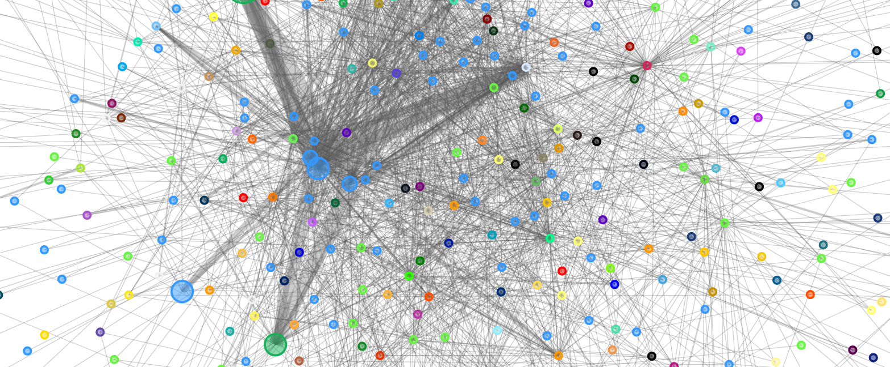

## บทนำ

Lightning Network เป็นโซลูชันการชำระเงินที่รวดเร็วและต้นทุนต่ำที่สร้างขึ้นบน Bitcoin ช่วยให้การทำธุรกรรมเป็นไปอย่างรวดเร็วและปลอดภัย การสังเกตเครือข่ายนี้เป็นสิ่งสำคัญในการทำความเข้าใจวิธีการทำงาน โครงสร้างเครือข่าย และสถานะของโหนดที่ประกอบขึ้นมา การใช้ Lightning explorer เช่น 1ML ช่วยในการแสดงข้อมูลสาธารณะของเครือข่าย รวมถึงโหนดที่ใช้งาน ช่องทางที่เปิดอยู่ และความจุที่มีอยู่ ซึ่งให้ภาพรวมที่มีค่าสำหรับผู้ใช้ นักพัฒนา และผู้ดำเนินการโหนด

## เข้าถึง 1ML และทำความเข้าใจหน้าแรก

ในการเข้าถึง 1ML เพียงเปิดเว็บเบราว์เซอร์ของคุณและพิมพ์ [https://1ml.com](https://1ml.com) ซึ่งจะนำคุณไปยังหน้าแรกที่ทำหน้าที่เป็นแดชบอร์ดทั่วโลกของ Lightning Network

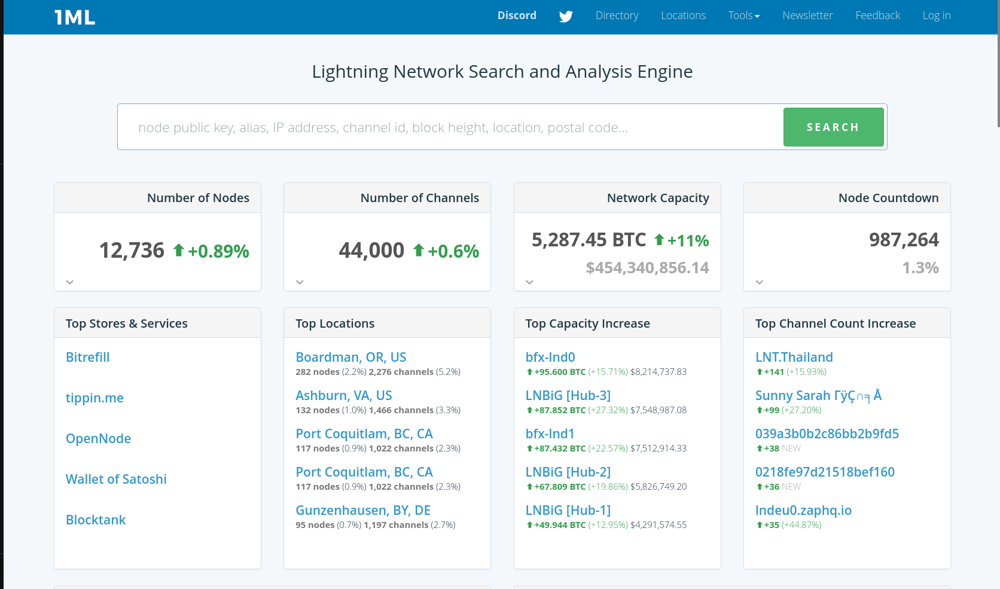

หน้านี้แสดงสถิติสำคัญหลายรายการที่ด้านบนของหน้าจอ รวมถึง :

- **จำนวนโหนดที่ใช้งานทั้งหมด** บนเครือข่าย, กล่าวคือ คอมพิวเตอร์ที่มีส่วนร่วมในการส่งและรับการชำระเงินผ่าน Lightning.
- **จำนวนช่องทางที่เปิดอยู่** ซึ่งสอดคล้องกับการเชื่อมต่อระหว่างโหนดเหล่านี้ที่ช่วยให้การโอนเงินเป็นไปได้
- **ความจุเครือข่ายทั้งหมด** แสดงเป็นบิตคอยน์ (BTC) ซึ่งบ่งบอกถึงผลรวมของความจุของช่องสาธารณะทั้งหมด

ตัวเลขเหล่านี้ได้รับการอัปเดตเป็นประจำเพื่อสะท้อนถึงสถานะปัจจุบันของเครือข่าย พวกเขาให้แนวคิดเกี่ยวกับขนาด การเติบโต และความแข็งแกร่งของเครือข่าย

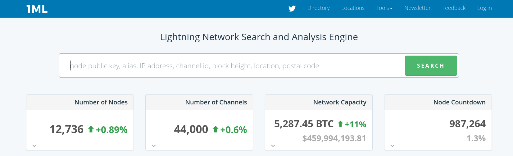

ด้านล่างนี้ หน้าเว็บมีรายการพร้อมการจัดอันดับ:

- **โหนดที่เชื่อมต่อมากที่สุด** ซึ่งมีช่องทางเปิดไปยังโหนดอื่นมากที่สุด
- ความจุ **สูงสุด** บนโหนด แสดงถึงโหนดที่สามารถถ่ายโอนข้อมูลในปริมาณมากที่สุด
- ช่องทางที่สำคัญที่สุดในแง่ของความจุ

ตัวกรองยังสามารถใช้เพื่อปรับปรุงรายการเหล่านี้ตามสถานที่ทางภูมิศาสตร์หรือเกณฑ์อื่น ๆ ได้อีกด้วย

หน้านี้เป็นจุดเริ่มต้นที่เหมาะสำหรับการสำรวจ Lightning Network และทำความเข้าใจโทโพโลยีทั่วไปของมัน

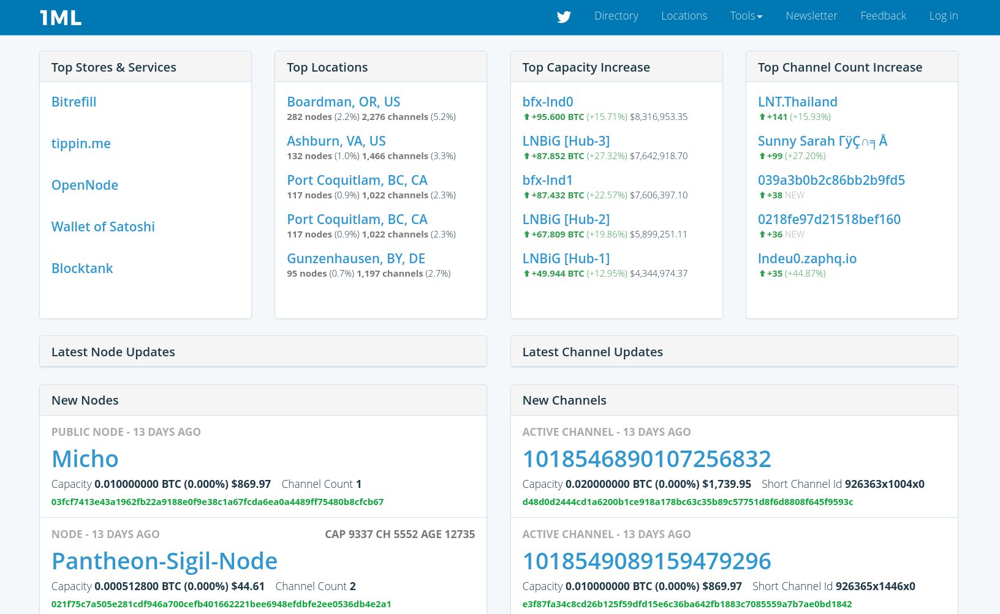

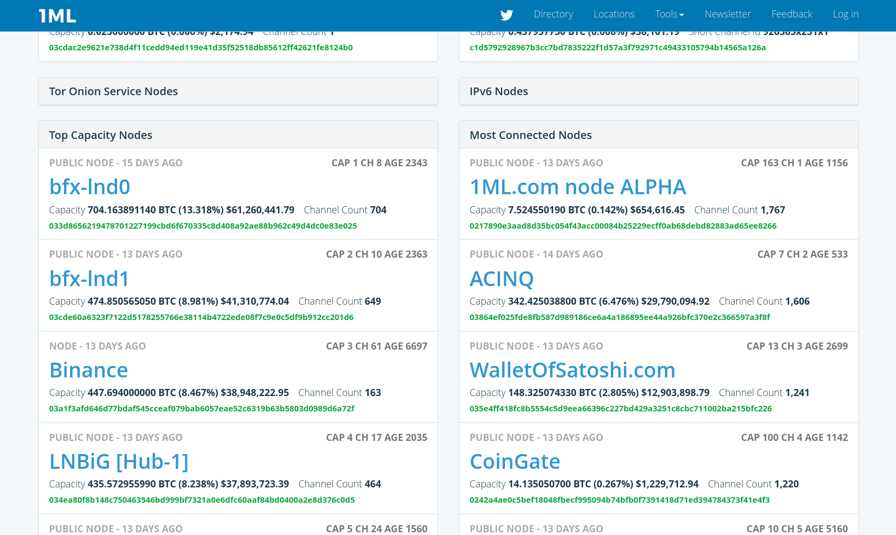

## สำรวจโหนดสายฟ้า

ในการสำรวจโหนดบน 1ML ให้เริ่มต้นโดยใช้แถบค้นหาที่ด้านบนของหน้า คุณสามารถป้อน **Node ID** ซึ่งเป็นตัวระบุเฉพาะของโหนด หรือ **alias** ซึ่งเป็นชื่อที่จำได้ง่ายกว่า

เมื่อการค้นหาเสร็จสิ้น ให้คลิกที่โหนดที่สอดคล้องกันเพื่อเข้าถึงหน้ารายละเอียดของมัน

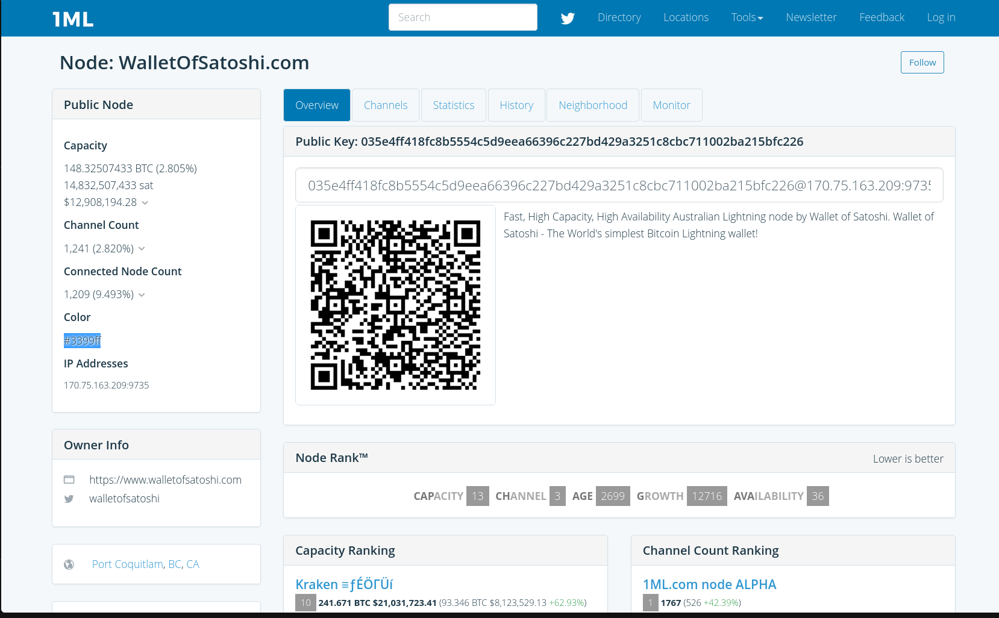

ในหน้านี้ ข้อมูลสำคัญหลายอย่างถูกแสดง:

- รหัสประจำตัวโหนด**: ตัวระบุเฉพาะนี้เป็นสตริงยาวของอักขระที่ช่วยให้สามารถระบุโหนดได้อย่างแม่นยำทั่วทั้งเครือข่าย

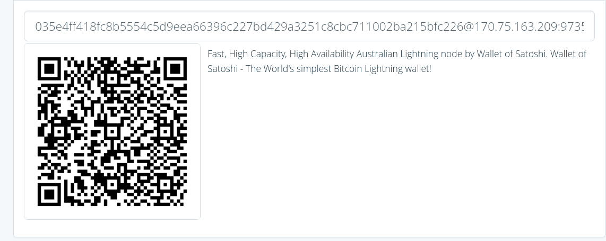

- Alias**: นี่คือชื่อที่เจ้าของโหนดเลือกเพื่อแสดงต่อสาธารณะ

- **จำนวนช่องสัญญาณ** บ่งบอกถึงจำนวนการเชื่อมต่อที่โหนดมีเปิดอยู่กับโหนดอื่น ๆ ในขณะที่ **ความจุรวม** แสดงถึงผลรวมของบิตคอยน์ที่มีอยู่ในช่องสัญญาณเหล่านี้ โหนดที่มีจำนวนช่องสัญญาณมากและมีความจุสูงมักจะเชื่อมต่อได้ดีและสามารถโอนเงินจำนวนมากได้อย่างรวดเร็วผ่านเครือข่าย

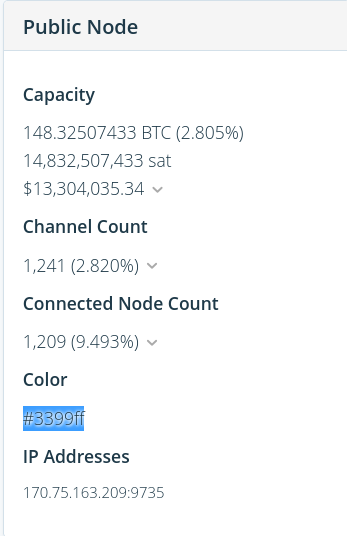

- **uptime** หรือความพร้อมใช้งาน วัดระยะเวลาที่โหนดยังคงใช้งานและเข้าถึงได้ทางออนไลน์ ซึ่งสะท้อนถึงความน่าเชื่อถือของมัน ส่วน **age** ของโหนดนั้นบ่งบอกถึงระยะเวลาที่มันอยู่ในเครือข่าย ซึ่งสะท้อนถึงความเสถียรและประสบการณ์ภายใน Lightning Network

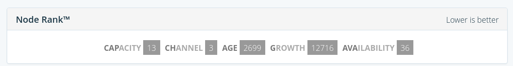

ข้อมูลนี้ช่วยให้คุณเข้าใจถึงความสำคัญและความน่าเชื่อถือของโหนดใน Lightning Network ตัวอย่างเช่น โหนดที่มีจำนวนช่องสัญญาณมาก ความจุสูง และมีเวลาทำงานสูง มักจะเป็นผู้เล่นหลักในเครือข่าย

## สำรวจช่องทางฟ้าผ่า

### ช่องทาง Lightning คืออะไร?

ช่องทาง Lightning เป็นการเชื่อมต่อโดยตรงระหว่างโหนดเครือข่ายสองโหนด มันช่วยให้โหนดทั้งสองนี้สามารถแลกเปลี่ยนการชำระเงินที่รวดเร็วและมีต้นทุนต่ำได้โดยไม่ต้องผ่านเครือข่ายหลัก Bitcoin สำหรับแต่ละธุรกรรม ช่องทางเหล่านี้เป็นพื้นฐานที่ทำให้ Lightning Network รวดเร็วและสามารถขยายได้

### อ่านข้อมูลช่องบน 1ML

ใน 1ML แต่ละช่องมีหน้าเพจหรือแผ่นบรรยายของตัวเองที่มีข้อมูลสำคัญจำนวนหนึ่ง:

จากหน้าของโหนด คุณสามารถเข้าถึงรายการช่องของมันได้ โดยการคลิกที่ช่อง 1ML จะแสดงหน้าที่เฉพาะพร้อมข้อมูลสำคัญหลายชิ้น

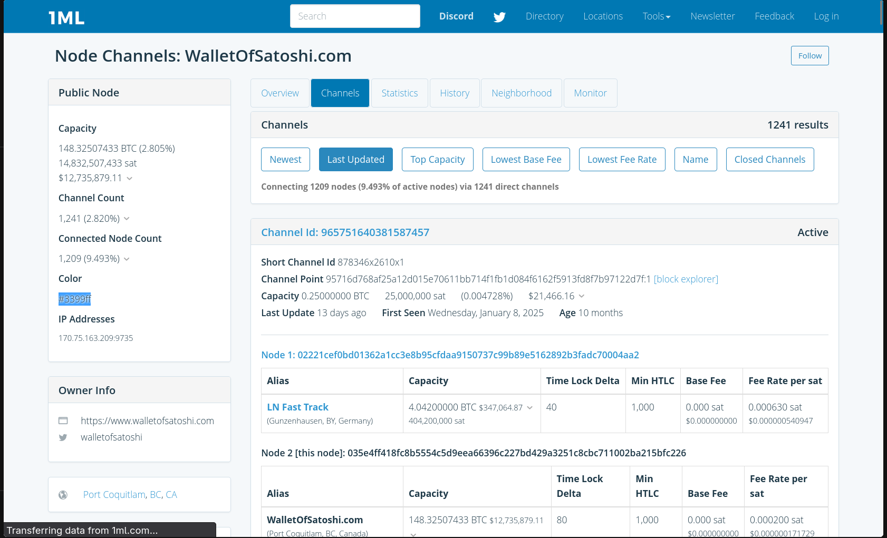

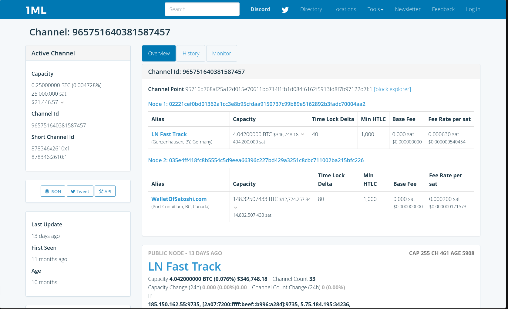

ข้อมูลที่มองเห็นหลักมีดังนี้:

- โหนดคู่ค้า**: แต่ละช่องทางเชื่อมโยงโหนดสองโหนด 1ML แสดงตัวระบุทั้งสองและนามแฝงที่เกี่ยวข้อง

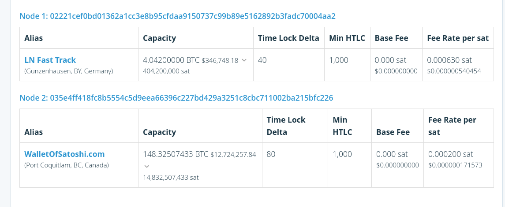

- ความจุของช่องทาง**: นี่คือจำนวนรวมของบิตคอยน์ที่ถูกล็อกในช่องทางนี้ ความจุนี้แสดงถึงขีดจำกัดสูงสุดของการชำระเงินที่สามารถผ่านช่องทางนี้ได้

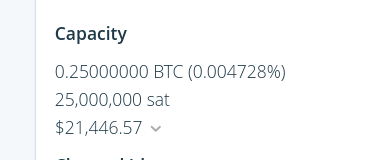

- อายุของช่อง**: ระบุระยะเวลาที่ช่องได้เปิดใช้งาน ช่องที่มีอายุมากมักเป็นสัญญาณของความสัมพันธ์ที่มั่นคงระหว่างสองโหนด

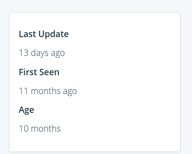

### ขีดจำกัดการมองเห็นของช่อง

สิ่งสำคัญคือต้องเข้าใจว่า 1ML แสดงเพียง **บางส่วน** ของ Lightning Network เท่านั้น ตัวสำรวจจะแสดงเฉพาะ **ช่องทางสาธารณะ** เท่านั้น กล่าวคือ ช่องทางที่ได้รับการประกาศบนเครือข่ายแล้ว ช่องทางส่วนตัวที่มักใช้ด้วยเหตุผลด้านความลับหรือกลยุทธ์จะไม่ปรากฏให้เห็น นอกจากนี้ 1ML ไม่ได้แสดงการกระจายเงินทุนที่แน่นอนในแต่ละด้านของช่องทาง หรือการชำระเงินที่ทำขึ้น หรือสภาพคล่องที่มีอยู่จริงในช่วงเวลาที่กำหนด ข้อมูลที่แสดงสามารถใช้ในการวิเคราะห์ **โครงสร้างทั่วไปของเครือข่าย** แต่ไม่ใช่กิจกรรมทางการเงินที่แท้จริงหรือสถานะสภาพคล่องโดยละเอียด

## สำรวจ Lightning Network ตามสถานที่

### โหนดตามประเทศและภูมิภาค

1ML ช่วยให้คุณสำรวจ Lightning Network ตาม **การแบ่งทางภูมิศาสตร์** จากหน้าแรกหรือผ่านส่วนที่กำหนดเฉพาะ สามารถแสดงโหนดตามประเทศหรือภูมิภาคได้ ฟีเจอร์นี้อ้างอิงจากข้อมูลตำแหน่งที่ประกาศโดยผู้ดำเนินการโหนด

ในแถบการนำทาง คุณจะเห็นลิงก์ **Location** บนหน้าเว็บ โหนดจะถูกจัดกลุ่มตามทวีป ประเทศ และเมือง

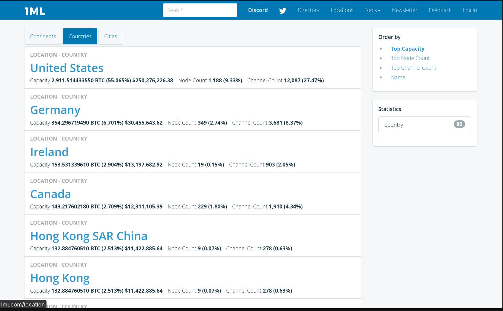

โดยการเลือกประเทศ 1ML จะแสดงรายการของโหนดที่เกี่ยวข้อง พร้อมด้วยสถิติที่รวบรวมไว้ เช่น จำนวนโหนดและความจุที่มองเห็นได้ทั้งหมดสำหรับพื้นที่ทางภูมิศาสตร์นั้น

#### สิ่งที่กล่าวถึงการรับเลี้ยงบุตรบุญธรรมในท้องถิ่น

- การยอมรับเทคโนโลยี**: จำนวนโหนดที่มากในภูมิภาคบ่งบอกว่าผู้ใช้ Bitcoin บริษัท หรือบริการกำลังยอมรับ Lightning Network อย่างแข็งขัน ซึ่งแสดงถึงความเป็นผู้ใหญ่ทางเทคโนโลยีและความเต็มใจที่จะใช้ประโยชน์จากข้อดีของ Lightning (ธุรกรรมที่รวดเร็ว ค่าใช้จ่ายที่ต่ำกว่า)
- ระบบนิเวศทางเศรษฐกิจ** : การมีอยู่หนาแน่นของโหนดสามารถบ่งบอกถึงโครงสร้างทางเศรษฐกิจในท้องถิ่นรอบๆ Bitcoin: พ่อค้าที่รับ Lightning, สตาร์ทอัพที่พัฒนาเครื่องมือ, กิจกรรมชุมชน, เป็นต้น
- ความปลอดภัยและความยืดหยุ่น**: การกระจายทางภูมิศาสตร์ที่หลากหลายช่วยเพิ่มความยืดหยุ่นของเครือข่ายเมื่อต้องเผชิญกับการหยุดชะงักหรือข้อจำกัดในท้องถิ่น ยิ่งโหนดกระจายตัวมากเท่าใด เครือข่ายก็ยิ่งกระจายศูนย์และยากต่อการเซ็นเซอร์มากขึ้นเท่านั้น
- นโยบายและกฎระเบียบ**: บางประเทศอาจมีการนำไปใช้ที่รวดเร็วขึ้นเนื่องจากกรอบการกำกับดูแลที่เอื้ออำนวยหรือชุมชนที่มีความกระตือรือร้น ในทางกลับกัน ในพื้นที่ที่มีกฎระเบียบที่เข้มงวดหรือไม่เป็นมิตร จำนวนโหนดจะน้อยลง

#### ขีดจำกัดของข้อมูลภูมิศาสตร์

อย่างไรก็ตาม โปรดทราบว่าการระบุตำแหน่งทางภูมิศาสตร์ของโหนด Lightning มีข้อจำกัดและอคติ:

- ตำแหน่ง IP โดยประมาณ**: 1ML โดยทั่วไปจะใช้ที่อยู่ IP สาธารณะของโหนดเพื่อประมาณตำแหน่งของพวกเขา อย่างไรก็ตาม วิธีนี้อาจถูกบิดเบือนโดยการใช้ VPN, เซิร์ฟเวอร์คลาวด์ (AWS, Google Cloud) หรือการโฮสต์ในประเทศที่แตกต่างจากที่อยู่อาศัยจริงของเจ้าของโหนด
- โหนดเสมือน**: ผู้ให้บริการบางรายโฮสต์โหนดของตนบนเซิร์ฟเวอร์ระยะไกลด้วยเหตุผลด้านความน่าเชื่อถือและความพร้อมใช้งาน ซึ่งอาจทำให้เกิดความเข้าใจผิดเกี่ยวกับตำแหน่งทางกายภาพ
- การเคลื่อนที่ของผู้ใช้**: ผู้ดำเนินการโหนดอาจเปลี่ยนตำแหน่ง ย้ายโครงสร้างพื้นฐาน หรือเปิดโหนดหลายแห่งในภูมิภาคต่างๆ ทำให้การอ่านข้อมูลซับซ้อนมากขึ้น
- การมองไม่เห็นของโหนดส่วนตัว**: โหนดบางตัวไม่เผยแพร่ที่อยู่ IP ของพวกเขาหรือใช้วิธีการซ่อนตำแหน่งของพวกเขา ทำให้ไม่สามารถระบุตำแหน่งทางภูมิศาสตร์ได้

## กรณีการใช้งานคอนกรีต 1ML

### การทำความเข้าใจโทโพโลยีเครือข่าย

1ML ช่วยให้คุณมองเห็น **โครงสร้างทั่วไปของ Lightning Network** โดยการสังเกตการเชื่อมต่อระหว่างโหนด จำนวนช่องทาง และความจุโดยรวม เป็นไปได้ที่จะเข้าใจว่าเครือข่ายถูกจัดระเบียบอย่างไร โหนดใดมีบทบาทสำคัญ และการไหลของการชำระเงินสามารถหมุนเวียนได้อย่างไรในทางทฤษฎี

ความเข้าใจนี้เป็นสิ่งสำคัญหากเราต้องการเข้าใจว่า Lightning Network ทำงานอย่างไร และไม่ใช่แค่สำหรับการใช้งานพอร์ตโฟลิโอเท่านั้น

### ระบุโหนดที่สำคัญ

ขอบคุณการจัดอันดับที่เสนอโดย 1ML (โหนดที่เชื่อมต่อมากที่สุด, ความจุสูงสุด, อายุ) ทำให้สามารถระบุโหนดที่มีความสำคัญในเครือข่ายได้ โหนดเหล่านี้มักทำหน้าที่เป็นเกตเวย์หลักสำหรับการชำระเงินผ่าน Lightning

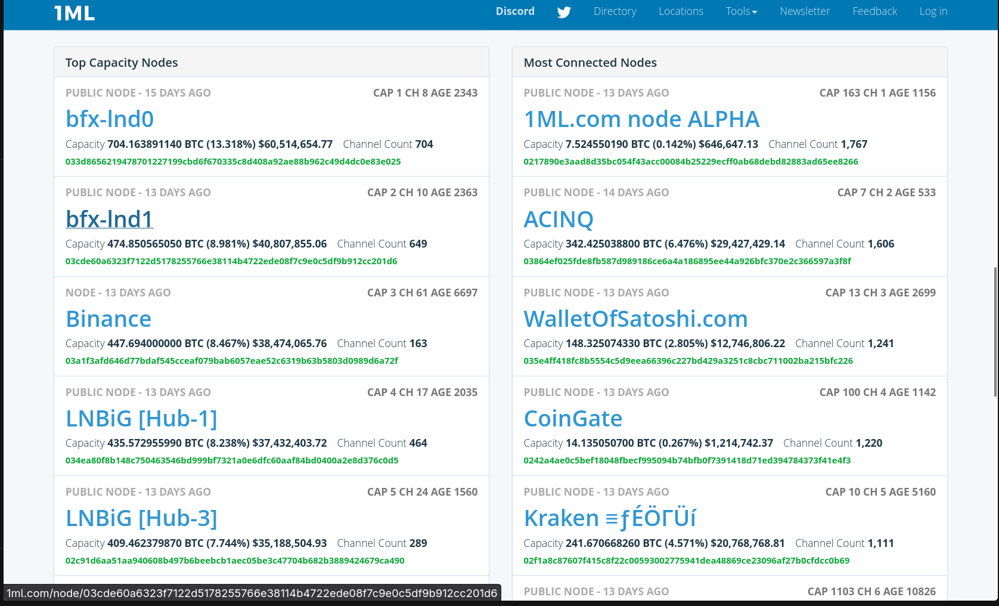

### ตรวจสอบการมองเห็นสาธารณะของโหนด

สำหรับผู้ดำเนินการโหนด 1ML ช่วยให้คุณตรวจสอบว่าโหนดของคุณถูก **โฆษณาอย่างเป็นทางการ** บน Lightning Network หรือไม่ หากโหนดปรากฏบน 1ML นั่นหมายความว่าโหนดนั้นสามารถมองเห็นและเข้าถึงได้โดยโหนดอื่น ๆ สำหรับการเปิดช่องทางสาธารณะ

สิ่งนี้สามารถเป็นประโยชน์สำหรับการวินิจฉัยปัญหาการมองเห็นหรือการเชื่อมต่อ

### กำลังดู Lightning Network พัฒนาไปตามกาลเวลา

โดยการเปรียบเทียบสถิติทั่วโลกในช่วงเวลาต่างๆ 1ML ช่วยให้เราสังเกตการพัฒนาของ Lightning Network: การเพิ่มขึ้นหรือลดลงของจำนวนโหนด การเปลี่ยนแปลงในความจุรวม หรือการเปลี่ยนแปลงในการกระจายทางภูมิศาสตร์

ข้อสังเกตเหล่านี้นำเสนอแนวคิดที่น่าสนใจเกี่ยวกับการเติบโต ความเป็นผู้ใหญ่ และแนวโน้มของ Lightning Network

## แนวปฏิบัติที่ดีที่สุดและข้อจำกัดของ 1ML

### ข้อมูลสาธารณะ ≠ ความเป็นจริงทั้งหมด

1ML ขึ้นอยู่กับข้อมูล **ที่ประกาศต่อสาธารณะ** ของ Lightning Network เท่านั้น ซึ่งหมายความว่าเครื่องมือนี้แสดงให้เห็นเพียงบางส่วนของความเป็นจริง ช่องทางหลายช่องอาจเป็นส่วนตัว โหนดบางตัวอาจไม่ได้รับการโฆษณา และสภาพคล่องที่แท้จริงที่มีอยู่ในช่องทางไม่สามารถมองเห็นได้ ดังนั้นจึงจำเป็นต้องใช้ 1ML เป็นเครื่องมือวิเคราะห์ระดับโลก ไม่ใช่เป็นการแสดงเครือข่ายอย่างละเอียดถี่ถ้วน

### ความเป็นส่วนตัวและสายฟ้า

Lightning Network ได้รับการออกแบบโดยเน้นที่ **ความเป็นส่วนตัวในการชำระเงิน** เป็นหลัก ธุรกรรมแต่ละรายการจะไม่ปรากฏบน 1ML และยอดคงเหลือของช่องทางที่แน่นอนจะไม่เป็นสาธารณะ ข้อจำกัดนี้ไม่ใช่ข้อบกพร่องของตัวสำรวจ แต่เป็นคุณสมบัติพื้นฐานของ Lightning Network ที่ออกแบบมาเพื่อปกป้องความเป็นส่วนตัวของผู้ใช้

### อย่าด่วนสรุป

โหนดที่มีความจุสูงหรือมีช่องทางมากไม่จำเป็นต้อง "เชื่อถือได้" หรือ "มีประสิทธิภาพ" มากกว่าในทุกกรณี เช่นเดียวกัน การลดลงชั่วคราวของความจุเครือข่ายโดยรวมไม่ได้หมายความว่ามีปัญหาเชิงโครงสร้างเสมอไป ตัวเลขควรถูกตีความด้วยการมองย้อนกลับและใส่ในบริบทเสมอ

### ความเสริมกันกับเครื่องมืออื่น ๆ

1ML เป็นจุดเริ่มต้นที่ยอดเยี่ยมสำหรับการสำรวจ Lightning Network แต่ควรใช้ร่วมกับเครื่องมืออื่น ๆ เช่น พอร์ตโฟลิโอสายฟ้า, อินเทอร์เฟซการจัดการโหนด และเครื่องมือสำรวจอื่น ๆ วิธีการนี้จะให้มุมมองที่สมบูรณ์และละเอียดมากขึ้นของเครือข่าย

## ตัวเลือกการเชื่อมต่อ 1ML (ฟังก์ชันขั้นสูง)

1ML มีตัวเลือก **เข้าสู่ระบบ / สร้างบัญชี** ที่มองเห็นได้บนเว็บไซต์ แต่ **ไม่จำเป็น** สำหรับการดูข้อมูล Lightning Network ฟีเจอร์ทั้งหมดที่กล่าวถึงในบทแนะนำนี้สามารถใช้งานได้ **โดยไม่ต้องมีบัญชี**

การเชื่อมต่อนี้มุ่งเน้นไปที่ **ผู้ดำเนินการโหนด Lightning** เป็นหลัก โดยเฉพาะอย่างยิ่ง มันช่วยให้โหนดสามารถเชื่อมโยงกับบัญชี 1ML เพื่อจัดการข้อมูลสาธารณะบางอย่าง เช่น การนำเสนอของโหนด ลิงก์ติดต่อ และเมตาดาต้าอื่น ๆ ฟีเจอร์นี้ถูกออกแบบมาเพื่อปรับปรุงการมองเห็นและการระบุโหนดภายในตัวสำรวจ

สิ่งสำคัญคือต้องทราบว่า 1ML **ไม่ใช่บริการรับฝากทรัพย์สิน** การสร้างบัญชีไม่ได้ให้สิทธิ์เข้าถึงเงินทุน ช่องทาง หรือการชำระเงินของโหนด มันมีไว้เพื่อโต้ตอบกับตัวสำรวจจากมุมมองที่เป็นการประกาศและให้ข้อมูลเท่านั้น

ในบริบทของการเรียนรู้หรือการค้นพบ Lightning Network ตัวเลือกนี้จึงสามารถถือว่าเป็น **ทางเลือก** และสงวนไว้สำหรับการใช้งานขั้นสูงมากขึ้น

## บทสรุป

1ML เป็นเครื่องมือที่มีค่าสำหรับการสังเกตและทำความเข้าใจ Lightning Network จากข้อมูลสาธารณะ ช่วยให้คุณสำรวจโครงสร้างของเครือข่าย วิเคราะห์โหนดและช่องทาง และติดตามวิวัฒนาการโดยรวมของการยอมรับ Lightning Network ตามกาลเวลา โดยไม่จำเป็นต้องมีบัญชีหรือการจัดการเงินทุน 1ML มอบประตูทางเข้าที่เข้าถึงได้สำหรับทุกคนที่ต้องการทำความเข้าใจอย่างลึกซึ้งเกี่ยวกับการทำงานของ Lightning

หากคุณต้องการก้าวไปไกลกว่านี้กับ Lightning Network ฉันขอแนะนำหลักสูตรแนะนำ Lightning Network แบบครบถ้วน:

https://planb.academy/courses/34bd43ef-6683-4a5c-b239-7cb1e40a4aeb