Le Lightning Network est une couche du protocole Bitcoin qui a été principalement développé pour favoriser l'adoption des paiements Bitcoin au quotidien en augmentant la vitesse de traitement de chaque transaction. En se basant sur le principe de la décentralisation, le Lightning Network se constitue de nœuds (ordinateurs tournant une implémentation Lightning) communiquant pair-à-pair en se relayant des données (paiements et vérification de paiement).

https://planb.network/tutorials/node/lightning-network/lightning-network-daemon-linux-59d777e9-72c8-4b32-8c50-e86cdae8f2f9

Tout comme sur la chaîne principale, permettre aux utilisateurs de connaitre les informations et l'état du réseau est devenu primordial afin de faciliter les connexions entre les nœuds et de réduire au maximum le problème de liquidités qui se pose généralement dans le réseau. En effet, sur le Lightning Network, nous préconisons les micro-paiements d'un montant relativement moins conséquent que celles des transactions sur la chaîne principale de Bitcoin.

Il est important de noter que tous les nœuds du Lightning ne sont pas disponibles sur la plateforme Amboss.

Au même titre que [Mempool Space](https://mempool.space) qui recense les informations utiles sur la chaîne principale du protocole Bitcoin, depuis 2022, [Amboss](https://amboss.space) vous permet d'avoir des informations sur :

- Les nœuds présents sur le Lightning Network
- Les canaux de paiement et leur capacité de paiement
- L'évolution du Lightning Network au fil du temps
- Les statistiques sur les frais à payer aux nœuds relayeurs de vos paiements.

https://planb.network/tutorials/privacy/analysis/mempool-space-f3e468a1-92f1-43ce-b2e4-c3298fa0e02f

Dans ce tutoriel, nous vous amenons à la découverte de cette plateforme qui constitue une ressource essentielle pour vous qui êtes utilisateur du Lightning Network, vous qui souhaitez connecter votre nœud pour agrandir le réseau, etc.

## Trouver des paires

L'un des objectifs de la plateforme Amboss est de pouvoir permettre aux différents nœuds du réseau de pouvoir se connecter et de pouvoir communiquer des informations entre eux. Sur la page d'accueil de la plateforme, vous pouvez directement rechercher le nom d'un nœud que vous connaissez déjà ou retrouver des nœuds des portefeuilles Lightning les plus populaires que vous utilisez.

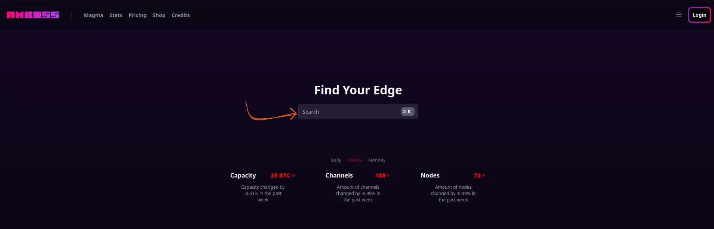

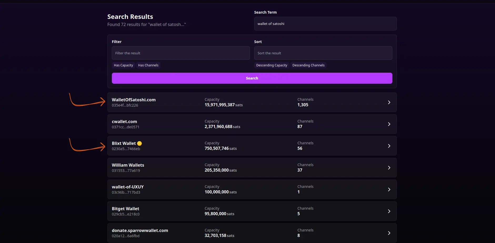

https://planb.network/tutorials/wallet/mobile/blixt-04b319cf-8cbe-4027-b26f-840571f2244f

Sur la page d'accueil, vous retrouverez également les nœuds classés en fonction de :
- L'évolution de la capacité : la quantité de bitcoin associée à la clé publique du nœud et le total disponible dans l'ensemble de ses canaux.
- L'évolution du nombre de canal : Le nombre de nouvelles connexions avec les autres nœuds du réseau.
- La popularité du nœud : la fréquence d'utilisation de ce nœud.

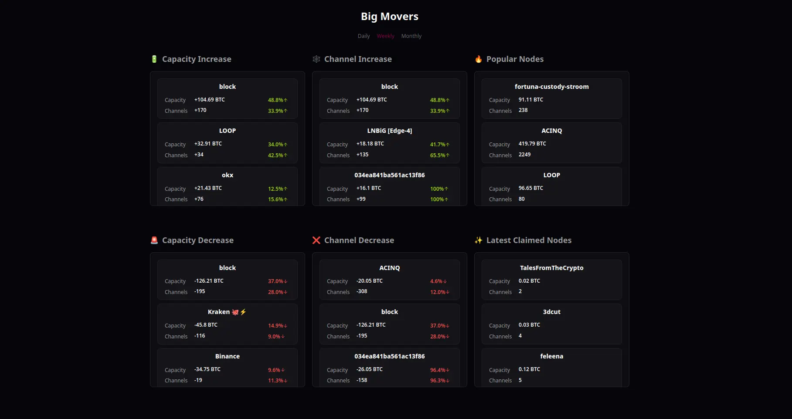

Choisir un bon nœud auquel se connecter revient donc à vérifier les critères suivants :

- S'assurer que le nœud dispose d'une quantité suffisante de bitcoins ; plus la capacité de ce nœud est grande, plus vous pouvez faire des paiements de montants conséquents.

- S'assurer que le nœud possède un grand nombre de connexions et de canaux ouverts avec les autres nœuds du réseau.

- S'assurer que le nœud est actif et encore apprécié par ses paires en vérifiant le nombre de nouveaux canaux ; plus  ce nœud a de nouveaux canaux ouverts, plus il  est apprécié par les autres nœuds du réseau.

Une fois votre bon nœud trouvé, vous pouvez cliquer sur son nom pour être redirigé sur la page d'informations du nœud.

Sur cette interface, en vérifiant l'horodatage du canal récemment créé, vous avez un indice sur l'activité de ce nœud. Vous retrouverez également les informations sur la capacité des canaux de ce nœud : cette information est capitale pour vous qui souhaitez utiliser activement ce nœud pour faire vos paiements.

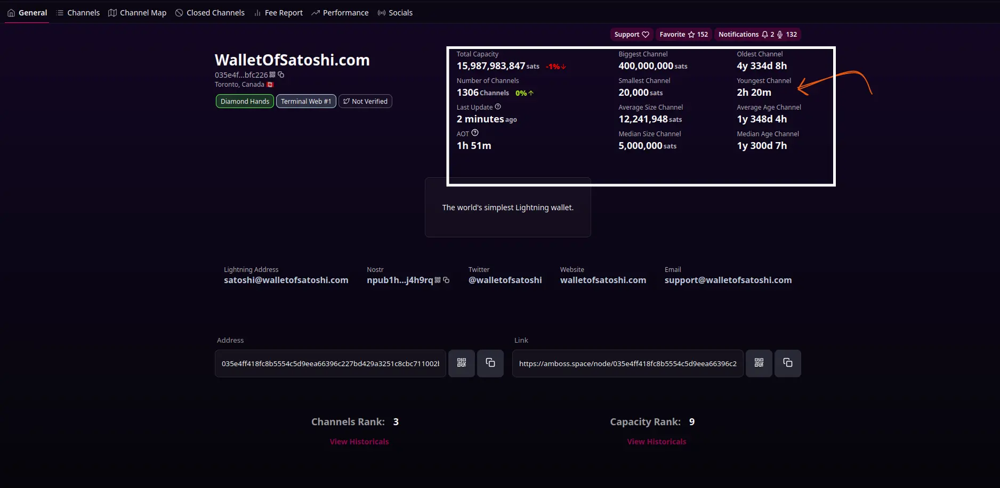

Dans la section gauche, vous avez plus de détails concernant la localisation de ce nœud. Vous pouvez consulter par exemple :
- La clé publique : l'identifiant juste en dessous du nom du nœud.
- La position géographique de ce nœud.

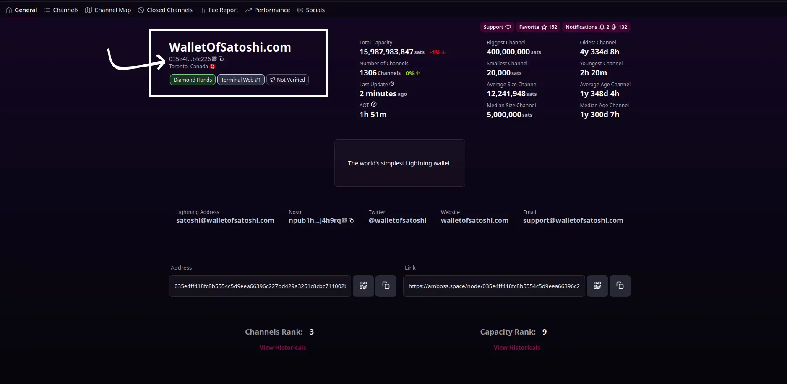

Cette interface vous indique l'adresse de connexion à ce nœud : elle se présente sous forme `pubkey@ip:port`. Dans notre exemple, nous souhaitons nous connecter au nœud dont :
- la clé publique `pubkey` est : `035e4ff418fc8b5554c5d9eea66396c227bd429a3251c8cbc711002ba215bfc226`
- l'adresse IP : `170.75.163.209`
- Le port : `9735`

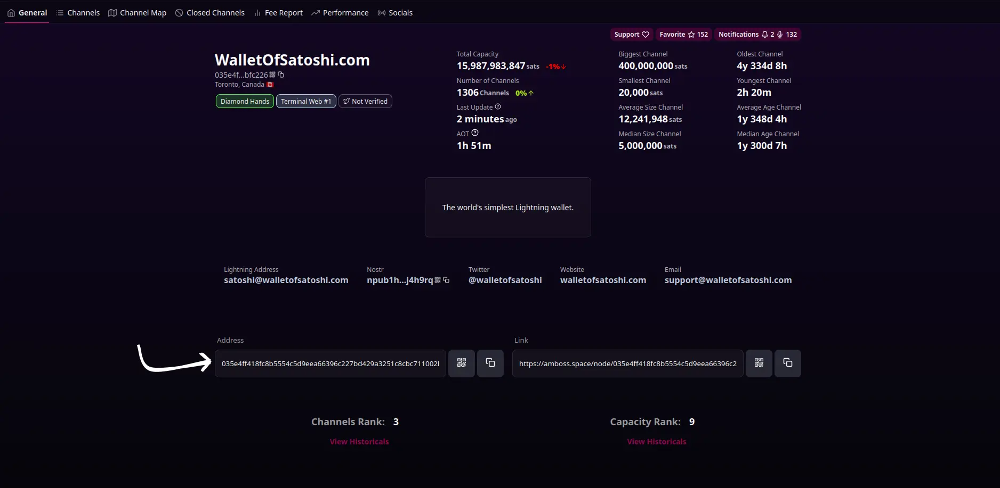

Dans la section **Canaux**, vous verrez la liste des canaux ouverts et les connexions du nœud avec les autres nœuds du réseau. Sur cette interface, plusieurs informations nous sont capitales pour confirmer que ce nœud correspond à nos besoins ou est fiable :

- **Le ratio entrant** : Le montant que vous prélèvera le nœud pour chaque million de satoshi qu'il recevra en fonction du canal choisi. 
- **Le ratio (parts par million)** : qui représente le nombre de satoshi par million d'unités que vous prélèvera le nœud lorsque vous déciderez de transiter un paiement via un de ses canaux. Supposons que vous décidez de faire un paiement de `10_000 sats` en passant par un canal dont le ratio ppm est de `500 sats` , vous devrez payer au nœud `10_000 * 500 / 1_000_000` satoshis soit l'équivalent de `5 sats`.
-  **Le [HTLC](https://planb.network/resources/glossary/htlc) maximum** : Le montant maximum que ce nœud vous permet de transiter via l'un de ces canaux.

En consultant le tableau de cette interface, vous pouvez également retrouver toutes ces informations sur le nœud il est apparié.

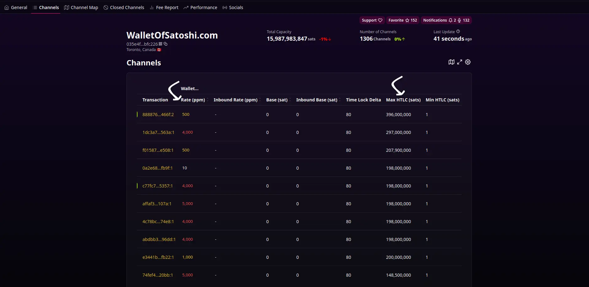

Dans la section **Cartes des canaux**, vous pouvez avoir un visuel des répartitions et de la capacité des différents canaux de ce nœud. Vous pouvez changer le critère de répartition affiché en sélectionnant l'une des options de la liste déroulante à droite.

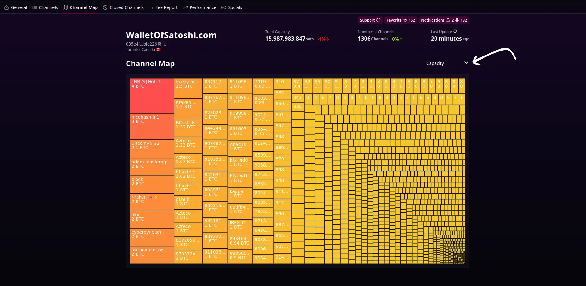

La section des **Canaux fermés** regroupe l'ensemble des anciens canaux du nœud en fonction du type de fermeture :
- Une **fermeture mutuelle** : représente l'accord des deux parties qui signent avec leur clé privée la transaction marquant la fermeture du canal et la répartition des soldes dans ce canal
- Une **fermeture forcée** : représente la fermeture brusque et unilatérale d'une des parties du canal. Ce type de fermeture n'est pas recommandé, car le Lightning Network est un protocole basé sur la punition : lorsque vous essayez de frauder avec le solde d'un canal, vous risquez de perdre tout votre solde disponible dans ce canal.

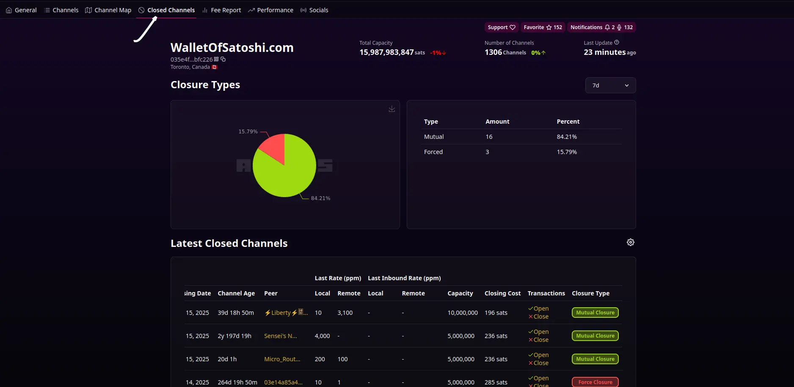

Obtenez les informations relatives aux frais de transit pour faire transiter vos paiements dans un canal du nœud que vous utilisez

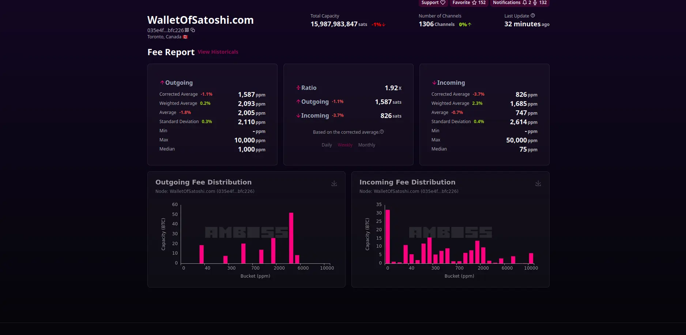

## Informations sur le réseau

Amboss ne se focalise pas uniquement sur les informations des membres du réseau mais également sur l'état du réseau en lui-même.

Dans la section **Statistiques**,sous le menu gauche "Simulations", retrouvez le graphique de probabilité de réussite d'un paiement en fonction du montant de ce paiement.

En effet vous constaterez que la courbe est décroissante parce que, plus le montant de votre paiement augmente, moins vous avez de chance de voir ce paiement aboutir. Cela traduit le réel problème de liquidité présent sur le Lightning Network. Par exemple, vous avez environ `79%` de chance que votre paiement de `10_000` satoshis soit effectué. En revanche, pour un paiement de `3_000_000` satoshis vous avez moins de `13%` de chances de réussite.

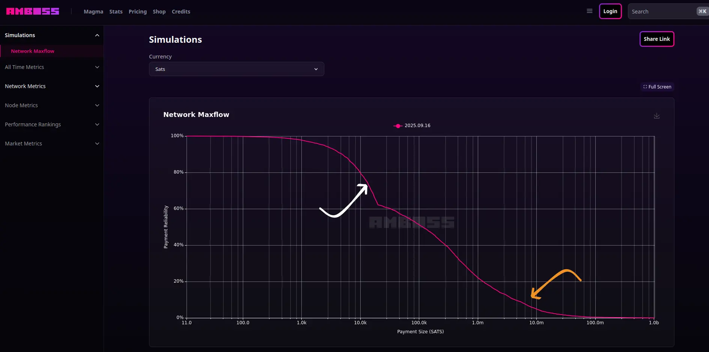

Le menu **Statistiques réseau** vous permet de retrouver sous forme de graphique les statistiques des : 
- Canaux de paiement 
- Nœuds
- Capacité
- Frais
- Évolution de canaux.

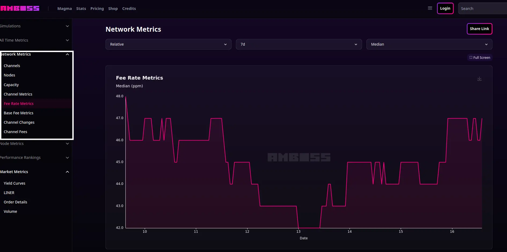

Dans le menu **Statistiques de marché**, l'option **Détails d'ordres** , vous permet de visualiser la demande de liquidité sur le Lightning Network. Ce graphe peut également indiquer quels canaux sont les plus sollicités et/ou qui possèdent des capacités considérables.

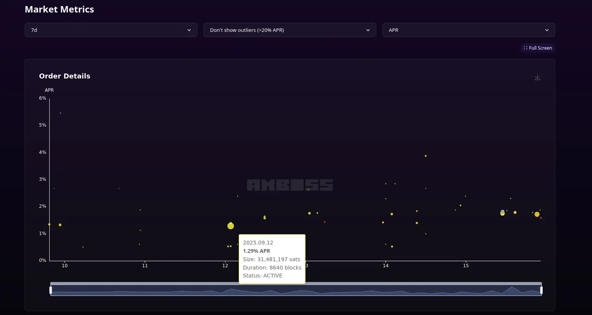

## Outils

Amboss met en avant un certain nombre d'outils qui vous permettent d'optimiser vos recherches et vos actions.

### Le décodeur Lightning Network

Cet outil se charge principalement de vous donner les détails de la structure d'une facture Lightning, d'une adresse Lightning ou d'une URL Lightning.

Sur la page d'accueil, dans la section **Outils**, soumettez votre adresse Lightning par exemple.

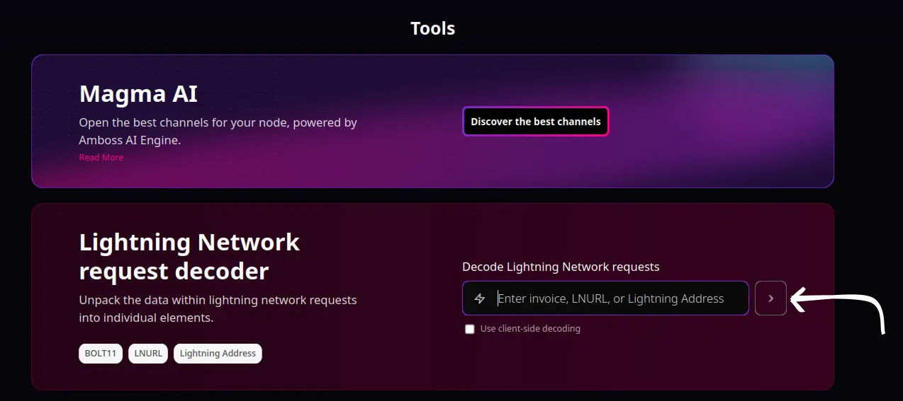

À partir de ce décodeur, vous obtenez les informations telles que :
-  la clé publique du nœud associée à votre adresse Lightning;
- Le temps d'expiration d'une facture issue de votre adresse;
- Le minimum et maximum que vous pouvez envoyer;
- Le nœud Nostr associé à votre adresse dans le cas où Nostr est activé sur ce nœud.

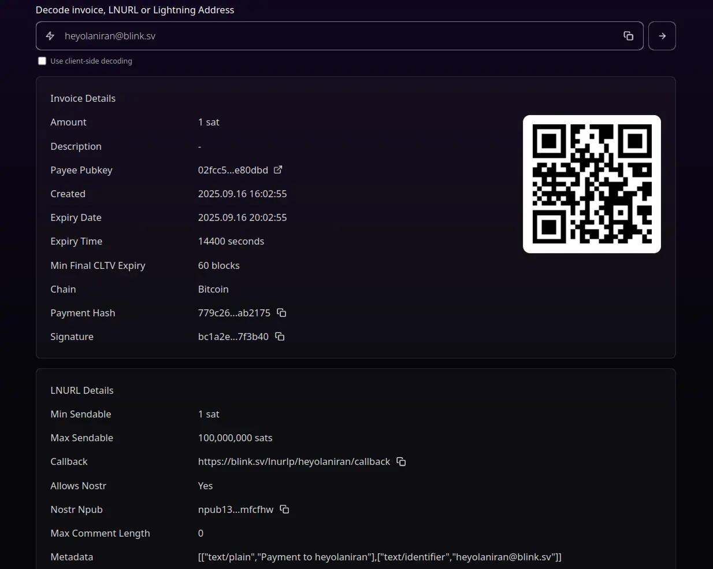

### Magma IA

Découvrez le tout dernier outil dévoilé par Amboss pour gérer efficacement vos connexions aux nœuds du Lightning Network. Magma AI utilise une intelligence artificielle dédiée pour se focaliser sur un problème important : faire une bonne sélection de nœuds auxquels se connecter.

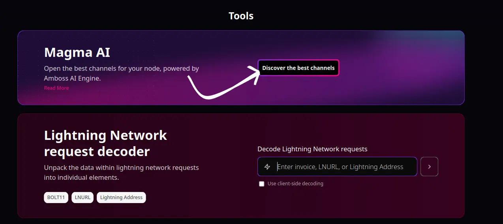

### Calculateur de Satoshi

Prenez connaissance du prix actuel du bitcoin dans votre devise locale (EUR / USD). Sur la page d'accueil, utilisez le calculateur de satoshis pour connaitre le prix sur le marché.

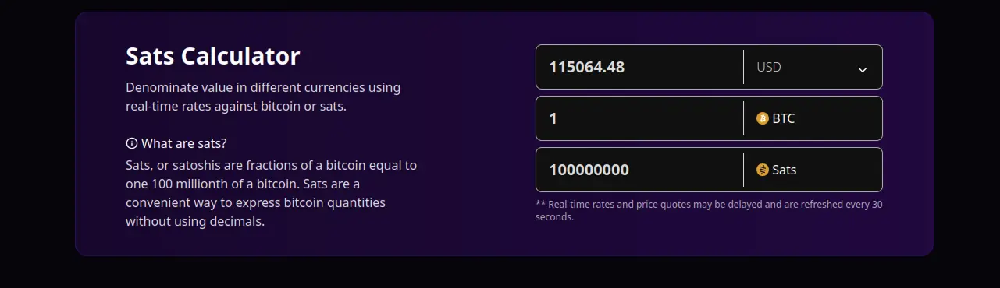

Vous avez désormais fait un tour complet des fonctionnalités et outils d'analyses de la plateforme. Nous vous proposons de retrouver, ci-dessous, notre article sur l'explorateur Bitcoin **Mempool.space**.

https://planb.network/tutorials/privacy/analysis/mempool-space-f3e468a1-92f1-43ce-b2e4-c3298fa0e02f
