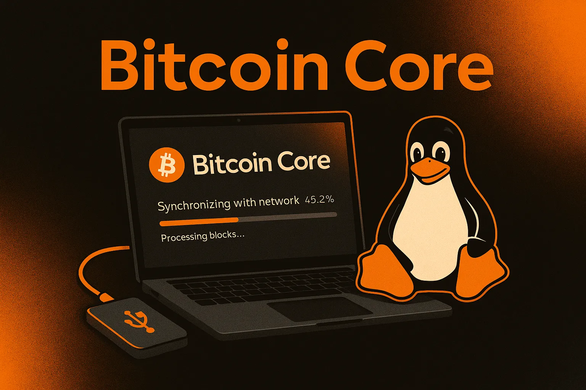
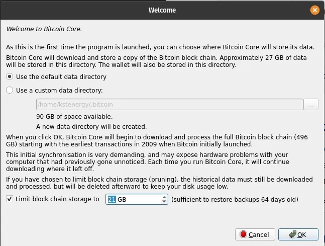
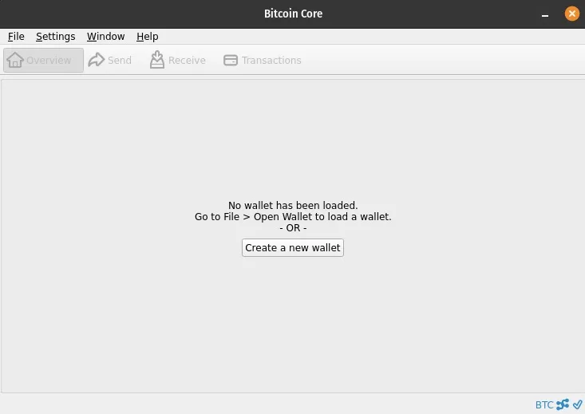
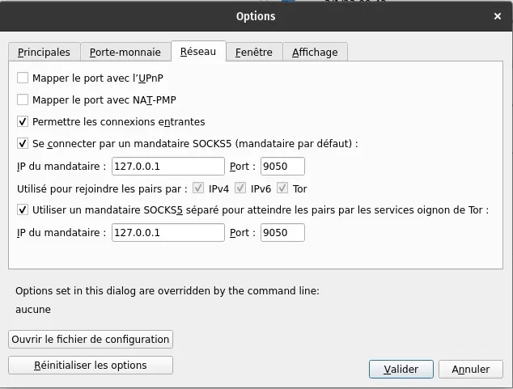
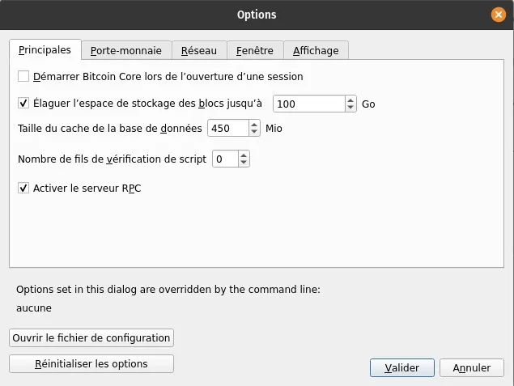
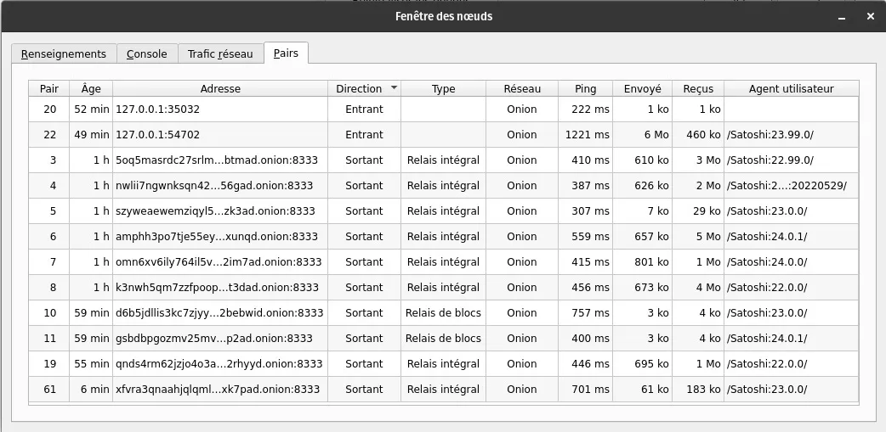

## Executando seu próprio nó com o Bitcoin core


Introdução ao Bitcoin e ao conceito de nó, complementado por um guia de instalação completo em Linux.


Um dos aspectos mais interessantes do Bitcoin é a possibilidade de executar o programa por si próprio e, assim, participar a um nível granular na rede e na verificação da transação pública Ledger.


O Bitcoin, enquanto projeto de código aberto, está disponível gratuitamente e é distribuído publicamente desde 2009. Quase 17 anos após a sua criação, o Bitcoin é agora uma rede monetária digital robusta e imparável, beneficiando de um poderoso efeito de rede orgânico. Pelos seus esforços e visão, o Satoshi Nakamoto merece a nossa gratidão. A propósito, hospedamos o whitepaper do Bitcoin aqui no Agora 256 (nota: também na universidade).


### Tornar-se o seu próprio banco


A gestão do seu próprio nó tornou-se essencial para os adeptos do Bitcoin. Sem pedir autorização a ninguém, é possível descarregar o Blockchain desde o início e assim verificar todas as transacções de A a Z de acordo com o protocolo Bitcoin.


O programa também inclui o seu próprio Wallet. Assim, temos controlo sobre as transacções que enviamos para o resto da rede, sem qualquer intermediário ou terceiro. O utilizador é o seu próprio banco.


O resto deste artigo é, portanto, um guia para instalar o Bitcoin core - a versão mais usada do software Bitcoin - especificamente em distribuições Linux compatíveis com Debian, como Ubuntu e Pop!OS. Siga este guia para dar um passo mais perto da sua soberania individual.


## Guia de instalação do Bitcoin core para Debian/Ubuntu


**Pré-requisitos


- Mínimo de 6GB de armazenamento de dados (nó pruned) - 1TB de armazenamento de dados (Full node)
- Esperar que o *Initial Block Download* (IBD) demore pelo menos 24 horas. Esta operação é obrigatória mesmo para um nó pruned.
- Permitir ~600GB de largura de banda para o IBD, mesmo para um nó pruned.


**Nota:💡** os seguintes comandos estão predefinidos para o Bitcoin core versão 24.1.


### Transferir e verificar ficheiros


- [Download](https://bitcoincore.org/en/download/) `Bitcoin-24.1-x86_64-linux-gnu.tar.gz`, bem como os ficheiros `SHA256SUMS` e `SHA256SUMS.asc` (é óbvio que tem de descarregar a última versão do software).


- Abra um terminal no diretório onde os arquivos baixados estão localizados. Exemplo: `cd ~/Downloads/`.


- Verifique se a soma de verificação do ficheiro de versão está listada no ficheiro de soma de verificação utilizando o comando `sha256sum --ignore-missing --check SHA256SUMS`.


- A saída deste comando deve incluir o nome do arquivo da versão baixada seguido de `OK`. Example: `Bitcoin-24.0.1-x86_64-linux-gnu.tar.gz: OK`.


- Instalar o git utilizando o comando `sudo apt install git`. Em seguida, clone o repositório que contém as chaves PGP dos signatários do Bitcoin core usando o comando `git clone https://github.com/Bitcoin-core/guix.sigs`.


- Importar as chaves PGP de todos os signatários usando o comando `gpg --import guix.sigs/builder-keys/*`


- Verifique se o ficheiro de checksum está assinado com as chaves PGP dos signatários utilizando o comando `gpg --verify SHA256SUMS.asc`.


Cada assinatura válida apresentará uma linha que começa com: `gpg: Boa assinatura` e outra linha terminando com: `Primary key fingerprint: 133E AC17 9436 F14A 5CF1 B794 860F EB80 4E66 9320` (exemplo da impressão digital da chave PGP de Pieter Wuille).


**Nota💡:** não é necessário que todas as chaves do signatário devolvam um "OK". De facto, apenas uma pode ser necessária. Cabe ao utilizador determinar o seu próprio limite de validação para a verificação PGP.


Pode ignorar os avisos:


- `Esta chave não está certificada com uma assinatura de confiança!`


- não há qualquer indicação de que a assinatura pertença ao proprietário


### Instalação do Bitcoin core gráfico Interface


- No terminal, ainda no diretório onde se encontra o arquivo da versão Bitcoin core, utilize o comando `tar xzf Bitcoin-24.1-x86_64-linux-gnu.tar.gz` para extrair os arquivos contidos no arquivo.


- Instale os arquivos extraídos anteriormente usando o comando `sudo install -m 0755 -o root -g root -t /usr/local/bin Bitcoin-24.1/bin/*`


- Instale as dependências necessárias usando o comando `sudo apt-get install libqt5gui5 libqt5core5a libqt5dbus5 qttools5-dev qttools5-dev-tools qtwayland5 libqrencode-dev`


- Inicie o _bitcoin-qt_ (Bitcoin core gráfico Interface) usando o comando `Bitcoin-qt`.


- Para escolher um nó pruned, selecione _Limitar armazenamento Blockchain_ e configure o limite de dados a armazenar:





### Conclusão da Parte 1: Guia de instalação


Uma vez instalado o Bitcoin core, recomenda-se mantê-lo a funcionar tanto quanto possível para contribuir para a rede Bitcoin, verificando transacções e transmitindo novos blocos a outros pares.


No entanto, executar e sincronizar o seu nó de forma intermitente, mesmo que seja apenas para validar as transacções recebidas e enviadas, continua a ser uma boa prática.





## Configurar o Tor para um nó Bitcoin core


**Nota💡:** este guia foi concebido para o Bitcoin core 24.0.1 em distribuições Linux compatíveis com Ubuntu/Debian.


### Instalando e configurando o Tor para Bitcoin core


Primeiro, precisamos de instalar o serviço Tor (The Onion Router), uma rede utilizada para comunicação anónima, que nos permitirá tornar anónimas as nossas interações com a rede Bitcoin. Para uma introdução às ferramentas de proteção da privacidade online, incluindo o Tor, consulte o nosso artigo sobre este tópico.


Para instalar o Tor, abra um terminal e digite `sudo apt -y install tor`. Uma vez que a instalação esteja completa, o serviço normalmente será iniciado automaticamente em segundo plano. Verifique se ele está funcionando corretamente com o comando `sudo systemctl status tor`. A resposta deve mostrar `Active: active (exited)`. Pressione `Ctrl+C` para sair desta função.


**Dica:** em qualquer caso, você pode usar os seguintes comandos no terminal para iniciar, parar ou reiniciar o Tor:


```shell
sudo systemctl start tor
sudo systemctl stop tor
sudo systemctl restart tor
```


Em seguida, vamos iniciar o Bitcoin core gráfico do Interface com o comando `Bitcoin-qt`. Depois, activemos a funcionalidade automática do software para encaminhar as nossas ligações através de um proxy Tor: _Configurações > Rede_, e a partir daí marque _Conectar através de proxy SOCKS5 (proxy padrão)_ bem como _Usar um proxy SOCKS5 separado para alcançar pares através de serviços Tor onion_.





O Bitcoin core detecta automaticamente se o Tor está instalado e, em caso afirmativo, criará por defeito ligações de saída para outros nós que também utilizem o Tor, para além de ligações a nós que utilizem redes IPv4/IPv6 (clearnet).


**Nota💡:** para alterar o idioma do ecrã para francês, vá ao separador Ecrã em Definições.


### Configuração avançada do Tor (opcional)


É possível configurar o Bitcoin core para usar apenas a rede Tor para se conectar com os pares, otimizando assim o nosso anonimato através do nosso nó. Uma vez que não existe nenhuma funcionalidade incorporada para isto no Interface gráfico, teremos de criar manualmente um ficheiro de configuração. Vá a Settings, depois Options.





Aqui, clique em _Open configuration file_. Uma vez no ficheiro de texto `Bitcoin.conf`, basta adicionar uma linha `onlynet=onion` e guardar o ficheiro. É necessário reiniciar o Bitcoin core para que este comando tenha efeito.


Vamos então configurar o serviço Tor para que o Bitcoin core possa receber ligações de entrada através de um proxy, permitindo que outros nós na rede usem o nosso nó para descarregar dados do Blockchain sem comprometer a segurança da nossa máquina.


No terminal, digite `sudo nano /etc/tor/torrc` para acessar o arquivo de configuração do serviço Tor. Neste arquivo, procure pela linha `#ControlPort 9051` e remova o `#` para habilitá-la. Agora adicione duas novas linhas ao arquivo:


```
HiddenServiceDir /var/lib/tor/bitcoin-service/
HiddenServicePort 8333 127.0.0.1:8334
```


Para sair do arquivo enquanto o salva, pressione `Ctrl+X > Y > Enter`. De volta ao terminal, reinicie o Tor digitando o comando `sudo systemctl restart tor`.


Com esta configuração, o Bitcoin core será capaz de estabelecer ligações de entrada e saída com outros nós na rede apenas através da rede Tor (Onion). Para confirmar isto, clique no separador _Window_ e depois em _Peers_.





### Recursos adicionais


Em última análise, usar apenas a rede Tor (`onlynet=onion`) pode torná-lo vulnerável a um Sybil Attack. É por isso que alguns recomendam manter uma configuração multi-rede para mitigar esse tipo de risco. Além disso, todas as conexões IPv4/IPv6 serão roteadas através do proxy Tor uma vez que ele esteja configurado, como indicado anteriormente.


Alternativamente, para permanecer somente na rede Tor e mitigar o risco de um Sybil Attack, você pode adicionar o Address de outro nó confiável ao seu arquivo `Bitcoin.conf` adicionando a linha `addnode=trusted_address.onion`. Você pode adicionar essa linha várias vezes se quiser se conectar a vários nós confiáveis.


Para ver os logs do seu nó Bitcoin especificamente relacionados com a sua interação com o Tor, adicione `debug=tor` ao seu ficheiro `Bitcoin.conf`. Terá agora informação relevante sobre o Tor no seu registo de depuração, que pode ver na janela _Information_ com o botão _Debug File_. Também é possível visualizar esses logs diretamente no terminal com o comando `bitcoind -debug=tor`.


**Tip💡:** aqui estão alguns links interessantes:


- [Página Wiki que explica o Tor e a sua relação com o Bitcoin](https://en.Bitcoin.it/wiki/Tor)
- [Gerador de ficheiros de configuração Bitcoin core por Jameson Lopp](https://jlopp.github.io/Bitcoin-core-config-generator/)
- [Guia de configuração do Tor por Jon Atack](https://github.com/Bitcoin/Bitcoin/blob/master/doc/tor.md)


Como sempre, se tiver alguma dúvida, não hesite em partilhá-la com a comunidade Agora256. Aprendemos juntos para sermos melhores amanhã do que somos hoje!