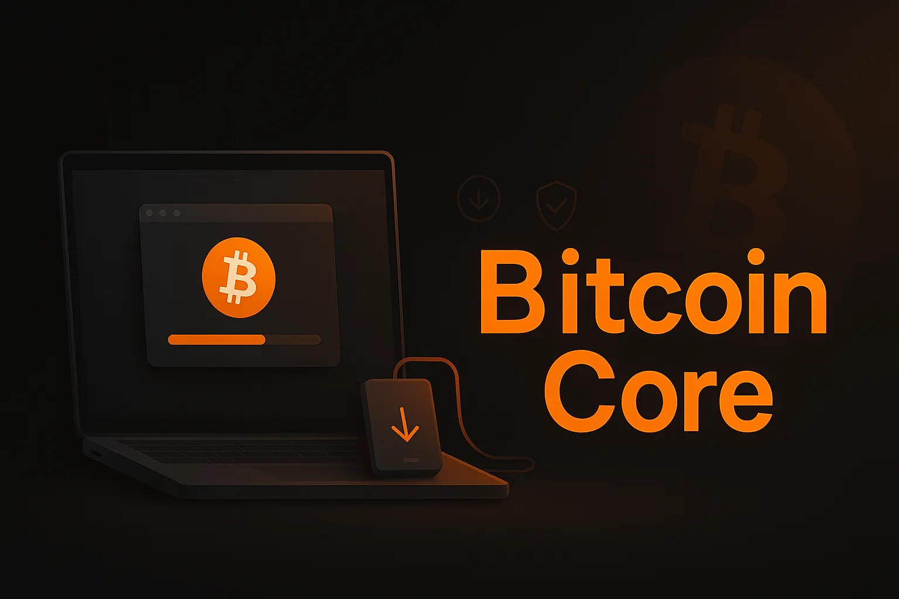

Bitcoin core installeren op je gewone computer kan, maar is niet ideaal. Als je het niet erg vindt om je computer 24/7 aan te laten staan, dan werkt dit prima. Als je de computer uit moet zetten, wordt het vervelend om elke keer te moeten wachten tot de software gesynchroniseerd is.


Deze instructies zijn voor Mac- of Windows-gebruikers. Linux-gebruikers zullen mijn hulp waarschijnlijk niet nodig hebben, maar de instructies voor Linux lijken erg op die voor de Mac.


## Schoon beginnen


Idealiter wil je een schone computer gebruiken, zonder malware. Zelfs als je een Hardware Wallet gebruikt, kan malware je je munten ontnemen.


Je kunt een oude computer schoonvegen en die gebruiken als dedicated Bitcoin computer, of een dedicated computer/laptop kopen.


## De Hard aandrijving


Bitcoin core zal ongeveer 400 gigabyte aan data in beslag nemen op je schijf, en zal blijven groeien. Je kunt je interne schijf gebruiken, maar je kunt ook een externe Hard schijf aansluiten. Ik zal beide opties uitleggen. Idealiter gebruik je een solid-state drive. Als je een oude computer hebt, heeft die waarschijnlijk niet zo'n interne schijf. Koop gewoon een externe SSD van 1 of 2 terabyte en gebruik die. De gewone schijf zal waarschijnlijk wel werken, maar je kunt problemen krijgen en hij zal veel langzamer zijn.


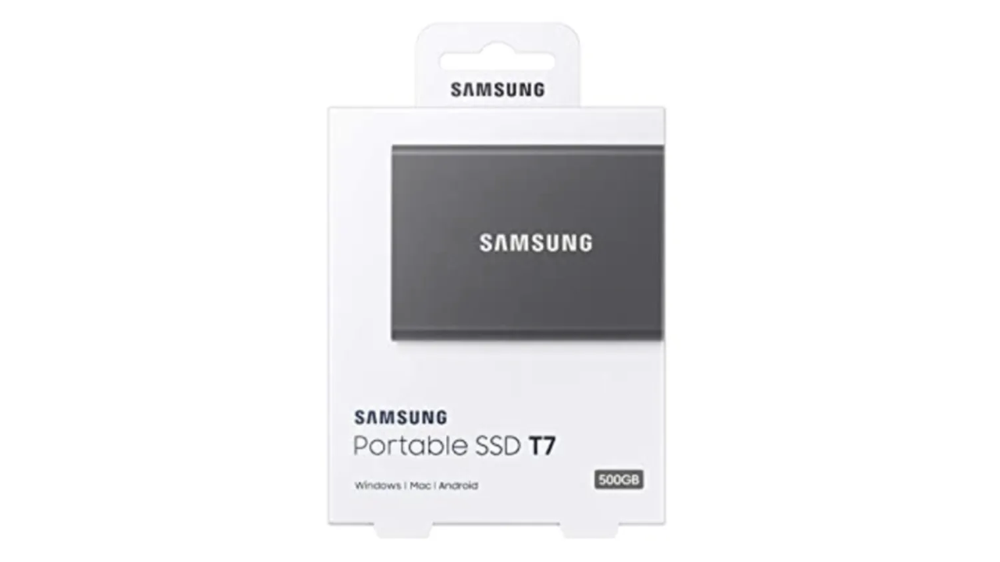


## Bitcoin core downloaden


Ga naar Bitcoin.org (zorg ervoor dat je niet naar Bitcoin.com gaat, dat is een shitcoin site die eigendom is van Roger Ver, die mensen misleidt om Bitcoin Cash te kopen in plaats van Bitcoin)


Eenmaal daar is het vreemd genoeg niet duidelijk waar je de software vandaan moet halen. Ga naar het resources menu en klik op "Bitcoin core", zoals hieronder getoond:


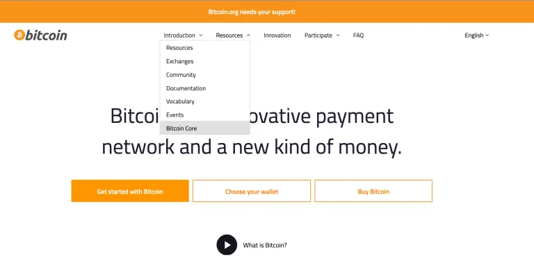


Dit brengt je naar de downloadpagina:


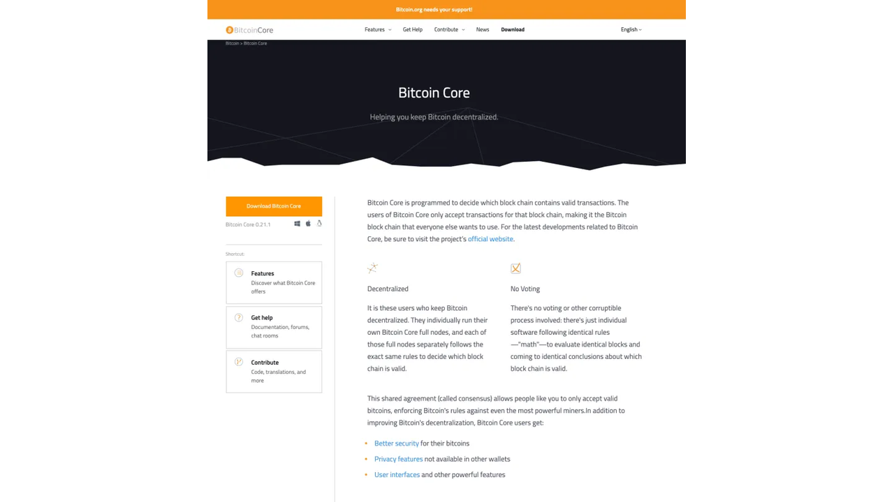


Klik op de oranje knop Download Bitcoin core:


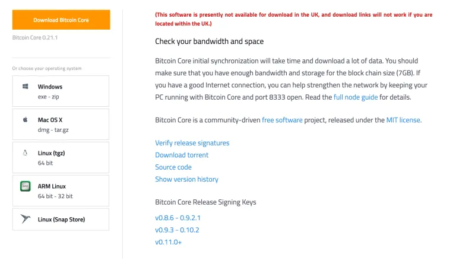


Er zijn verschillende opties waaruit je kunt kiezen, afhankelijk van je computer. De eerste twee zijn relevant voor deze gids; kies Windows of Mac in de linkerbalk. Nadat je erop hebt geklikt, begint het downloaden, waarschijnlijk naar je Downloads-map.


## De download controleren (deel 1)


Je hebt het bestand nodig dat de hashes van verschillende releases bevat. Dit bestand stond eerst op de downloadpagina van Bitcoin.org, maar is nu verplaatst naar bitcoincore.org/nl/download:


Je hebt het SHA256 binaire hashes bestand nodig. Dit bestand bevat de SHA256 hashes van de verschillende downloadpakketten van Bitcoin core.


Vervolgens moeten we de Hash van de Bitcoin core download vergelijken met wat het bestand zegt dat de Hash zou moeten zijn. Dan weten we dat de download identiek is aan wat wordt verwacht volgens bitcoincore.org.


Navigeer opnieuw naar de map Downloads en voer dit commando uit (vervang de X'en precies door de naam van het Full node Bitcoin downloadbestand):


```bash
shasum -a 256 XXXXXXXXXXXX # <--- FOR MAC
certutil -hashfile XXXXXXXXXXX SHA256 # <--- FOR WINDOWS
```


Je krijgt een Hash uitvoer. Noteer die en vergelijk hem met de Hash in het SHA256SUMS bestand.


Als de uitkomsten identiek zijn, dan heb je geverifieerd dat er met geen enkel bit gegevens geknoeid is... bijna. We moeten er nog steeds zeker van zijn dat het SHA256SUMS bestand niet kwaadaardig is.


Om verder te gaan met de volgende stap, moeten we gpg geïnstalleerd hebben op onze computer.


Om dat te doen, zie mijn SHA256/gpg gids, en scroll ongeveer halverwege naar de "Download gpg" sectie, en zoek naar de subkop van je besturingssysteem. Kom dan hier terug.


## De openbare sleutel ophalen


Ga terug naar de downloadpagina en haal het SHA256 Hash handtekeningenbestand op


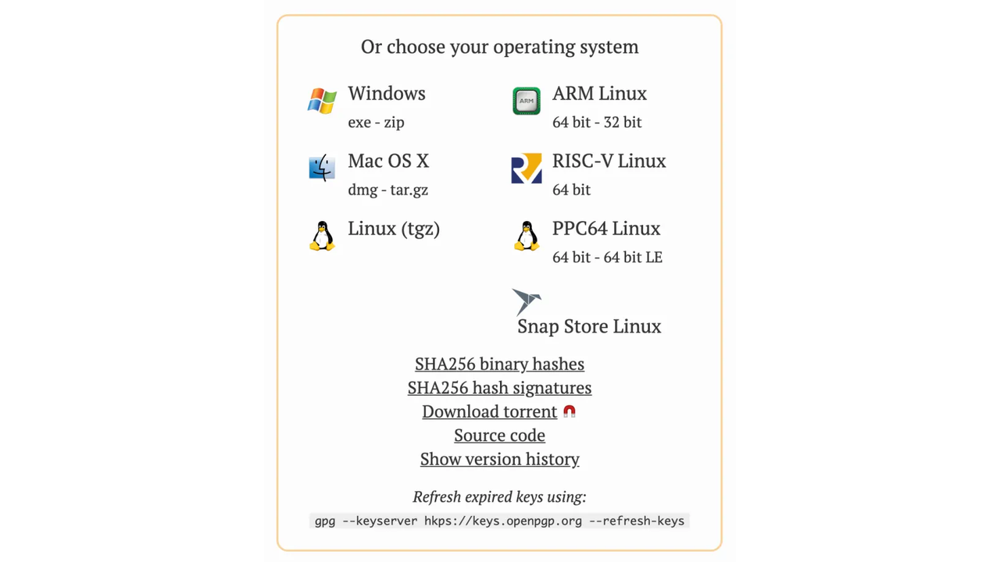


Klik erop en sla het bestand op schijf op, bij voorkeur in de map Downloads.


Dit bestand bevat handtekeningen van verschillende mensen, van het SHA256SUMS bestand.


We willen de publieke sleutel van de hoofdontwikkelaar, Wladimir J. van der Laan, aan de sleutelbos van onze computer. Zijn publieke sleutel ID is:

1 - 01EA 5486 DE18 A882 D4C2 6845 90C8 019E 36C2 E964


Kopieer die tekst in het volgende commando:


```bash
gpg --keyserver hkp://keyserver.ubuntu.com --recv-keys 01EA5486DE18A882D4C2684590C8019E36C2E964
```


Interessant is dat je op elk moment kunt zien welke sleutels er in de sleutelring van de computer zitten met dit commando:


```bash
gpg --list-keys
```


## De download controleren (deel 2)


We hebben de publieke sleutel, dus we kunnen nu het SHA256SUMS bestand verifiëren dat de hashes van de Bitcoin core download bevat, en de handtekening voor die hashes.


Open Terminal of CMD opnieuw en zorg ervoor dat je in de map Downloads bent. Voer vanaf daar deze opdracht uit:


```bash
gpg –verify SHA256SUMS.asc SHA256SUMS
```


Het eerste vermelde bestand is de exacte spelling van het handtekeningbestand. Het tweede vermelde bestand moet de exacte spelling zijn van het tekstbestand dat de hashes bevat. Beide bestanden moeten in dezelfde map staan en je moet in de map van de bestanden zijn, anders moet je het volledige pad voor elk bestand intypen.


Dit is de uitvoer die u zou moeten krijgen


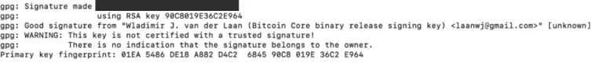


Het is veilig om het WAARSCHUWING bericht te negeren - dat herinnert je er alleen maar aan dat je Wladimir niet hebt ontmoet bij een sleutel onderdeel en hem persoonlijk hebt gevraagd wat zijn publieke sleutel was, en vervolgens je computer hebt verteld om deze sleutel volledig te vertrouwen.


Als je dit bericht hebt gekregen, dan weet je nu dat er niet is geknoeid met het SHA256SUMS.asc bestand nadat Wladimir het heeft ondertekend.


## Bitcoin core installeren


Je zou geen gedetailleerde instructies nodig moeten hebben over hoe je het programma installeert.


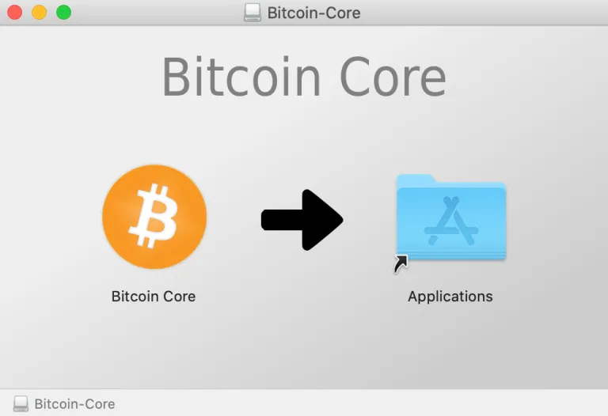


## Bitcoin core uitvoeren


Op een Mac krijg je misschien een waarschuwing (Apple is nog steeds anti-Bitcoin)


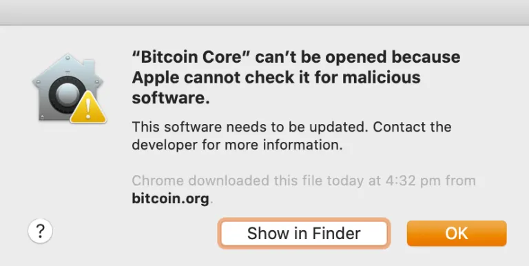


Klik op OK en open vervolgens je Systeemvoorkeuren


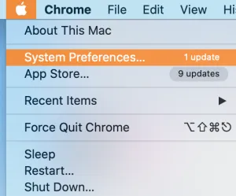


Klik op het pictogram Beveiliging en privacy:


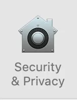


Klik dan op "toch openen":


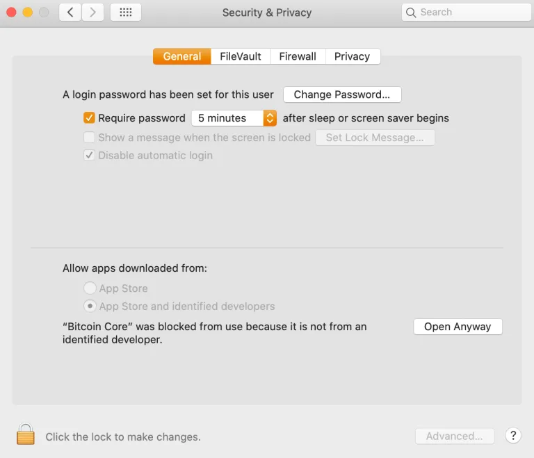


De foutmelding verschijnt opnieuw, maar deze keer is er een knop OPEN beschikbaar. Klik erop.


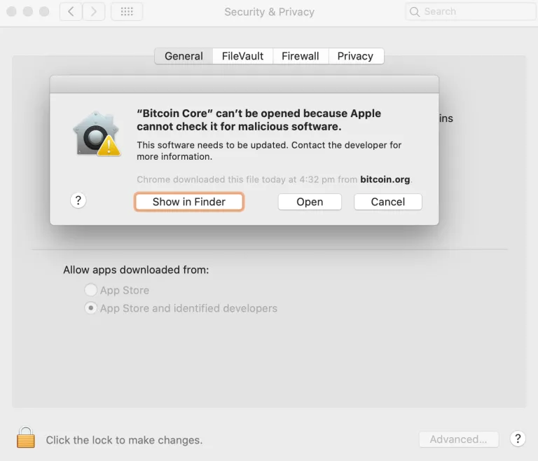


Bitcoin core zou moeten laden en je krijgt een aantal opties te zien:


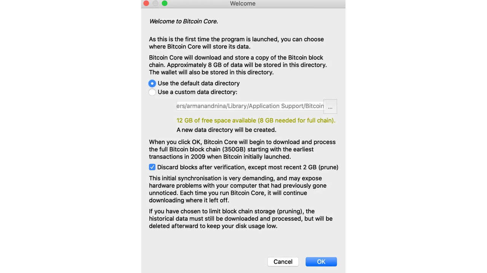


Hier kun je kiezen om het standaardpad te gebruiken waarnaar de Blockchain wordt gedownload, of je kunt je externe schijf kiezen. Ik raad aan om het standaardpad niet te veranderen als je de interne schijf gaat gebruiken, dat maakt het makkelijker om dingen in te stellen als je andere software installeert om met de Bitcoin core te communiceren.


Je kunt ervoor kiezen om een pruned node te gebruiken, dat bespaart ruimte, maar beperkt wat je met je node kunt doen. Hoe dan ook, je zult de hele Blockchain moeten downloaden en verifiëren, dus als je de ruimte hebt, bewaar dan wat je hebt gedownload en snoei niet als je het kunt vermijden.


Zodra je bevestigt, zal de Blockchain beginnen met downloaden. Dit zal vele dagen duren.


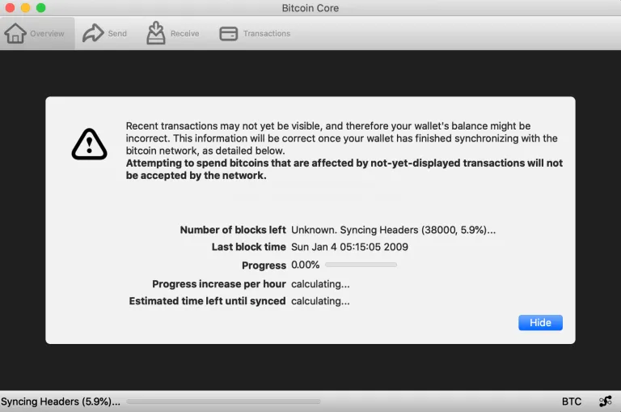


Je kunt de computer afsluiten en terugkomen om te downloaden als je wilt, het zal geen schade aanrichten.
