*Deze handleiding is gebaseerd op [de officiële Ashigaru documentatie](https://ashigaru.rs/docs/), die ik heb overgenomen en uitgebreid. Ik heb alle secties herschreven om de duidelijkheid te verbeteren, meer gedetailleerde uitleg toegevoegd, evenals illustraties voor beginners, om de installatie en het gebruik begrijpelijker te maken.*


---

Dojo is een open-source programma ontworpen om te fungeren als backend server voor bepaalde privacy-georiënteerde Bitcoin wallets, gebaseerd op een Bitcoin core node. Historisch gezien werd het ontwikkeld om te werken met Samourai Wallet, een mobiele Wallet die geavanceerde privacyfuncties bood zoals Whirlpool (CoinJoin), Ricochet, Stonewall, PayNym... Samourai Wallet is nu gesloten na de arrestatie van de ontwikkelaars, maar de opvolger van de gemeenschap, **Ashigaru Wallet**, heeft het overgenomen en blijft vertrouwen op Dojo om een complete ervaring te bieden voor gebruikers die controle willen houden over hun gegevens bij het gebruik van Bitcoin.


Praktisch gezien fungeert Dojo als een gateway tussen je Wallet en het Bitcoin netwerk. Zonder Dojo zou een lichtgewicht mobiele Wallet servers van derden moeten bevragen om de status van je UTXO's en je geschiedenis op te vragen, of om je transacties uit te zenden. Dit impliceert afhankelijkheid en het lekken van gevoelige gegevens naar een server van een derde partij (gebruikte adressen, bedragen, betalingsfrequentie, etc.). Met Dojo host je deze server zelf, rechtstreeks verbonden met je eigen Bitcoin knooppunt. Op deze manier lopen al je portfolio-aanvragen via een infrastructuur die je zelf beheert, zonder tussenpersonen, wat je vertrouwelijkheid en soevereiniteit versterkt.


## Vereisten voor het opzetten van een Dojo


Voor het opzetten van een Dojo server heb je geen ultra-krachtige machine nodig. Iedereen met een eenvoudige computer, een stabiele internetverbinding en de mogelijkheid om deze continu (24/7) aan te laten staan, kan een werkende Dojo opzetten.


### Kies uw machinetype


U kunt :


- een laptop ;
- een desktopcomputer ;
- een mini-pc (bijvoorbeeld Intel NUC, Lenovo Thincentre Tiny...).


Elke optie heeft voor- en nadelen:


- Prijs: een refurbished mini-pc of desktop is vaak goedkoper dan een nieuwe laptop.
- Footprint: een Mini-PC neemt minder ruimte in beslag.
- Stroom Supply: een laptop heeft het voordeel van een batterij, wat betekent dat hij niet wordt uitgeschakeld als de stroom uitvalt, in tegenstelling tot een mini-pc.
- Upgradebaarheid: met barbones kun je over het algemeen geheugen toevoegen of eenvoudig een Hard schijf vervangen.


Voor meer informatie over het kiezen van je uitrusting raad ik je aan deze cursus te volgen:


https://planb.academy/courses/3cd9cb94-82e8-417a-9c5a-02afc2589426

### Aanbevolen uitrusting


Het is niet nodig om een nieuwe machine te kopen. Een gereviseerde computer met de onderstaande specificaties zal veel betere prestaties leveren dan single-board elektronica (zoals de Raspberry Pi).


**Minimumspecificaties:**


- X86-64-architectuur (64-bits processor).
- 2 GHz dual-core processor of sneller.
- minimaal 8 GB RAM.
- 2 TB of meer NVMe SSD (om Blockchain of Bitcoin en de benodigde indexen op te slaan).


**Aanbevolen besturingssysteem: **


- Een Debian-gebaseerde distributie, zoals Ubuntu 24.04 LTS.


**Aanbevolen uitrusting:**


- HP EliteDesk / EliteBook
- Dell OptiPlex
- Lenovo ThinkCentre / ThinkPad
- Intel NUC
- enz.


Het is perfect mogelijk om een Dojo server op andere hardware configuraties te draaien. Echter, om de beste prestaties te krijgen en problemen te beperken, raden we je aan om de bovenstaande aanbevelingen te volgen.


In deze tutorial gebruik ik een oude ThinkCentre Tiny met een Intel Pentium Dual-Core G4400T processor, 8 GB RAM en een 2 TB SSD.


## 1 - Ubuntu installeren


*Als je Dojo wilt installeren op een apparaat dat al geconfigureerd is, kun je deze stap overslaan en direct doorgaan naar stap 2.*


Nadat je de gekozen hardware hebt voorbereid, is het tijd om een besturingssysteem te installeren. Je kunt vrijwel elke Debian-distributie gebruiken, maar ik raad je aan te kiezen voor een LTS-versie van Ubuntu, omdat die perfect geschikt is voor onze doeleinden. Dit zijn de te volgen stappen:


### 1.1. maak een opstartbare USB-sleutel


Download vanaf een reeds werkende computer (je gebruikelijke machine) het Ubuntu LTS ISO image [van de officiële site](https://ubuntu.com/download/desktop) (`24.04` op het moment van schrijven, maar neem het meest recente als er een andere beschikbaar is).


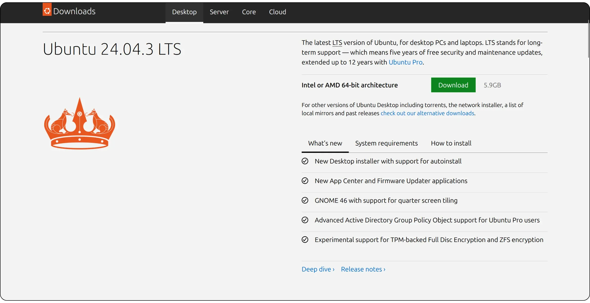


Plaats een USB-sleutel van minstens 8 GB in deze computer en maak vervolgens een opstartbare sleutel met software zoals [Balena Etcher](https://etcher.balena.io/). Selecteer de Ubuntu ISO image die je net hebt gedownload, kies de USB-sleutel als doelapparaat en start het creatieproces (wees geduldig, het kan enkele minuten duren).


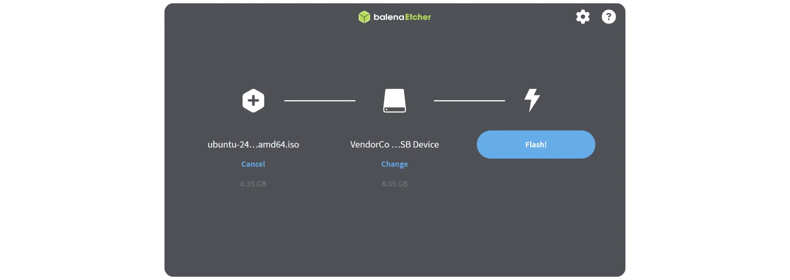


Steek de opstartbare USB-stick in de uitgeschakelde computer (de computer waarop je Dojo wilt draaien). Start de computer op en druk meteen op **F12** of **F10** op je toetsenbord (afhankelijk van het model) om het opstartmenu te openen. Kies vervolgens je USB-stick als prioriteitsapparaat in de opstartvolgorde van de computer.


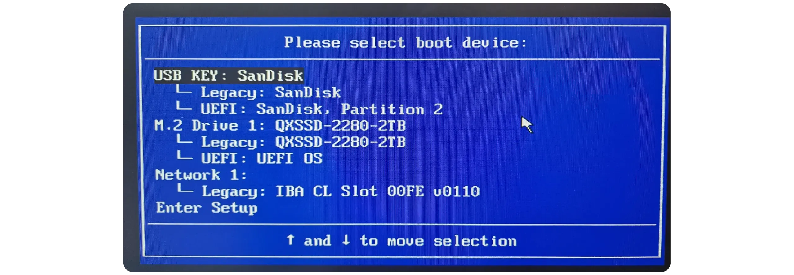


### 1.2. installeer het besturingssysteem


Het startscherm van Ubuntu verschijnt. Selecteer "Ubuntu proberen of installeren*".


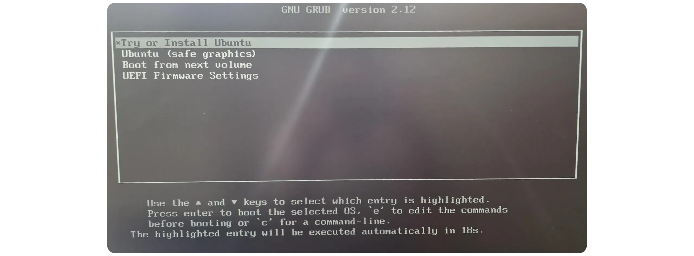


Volg dan het klassieke Ubuntu-installatieproces:


- Selecteer taal.
- Selecteer het type toetsenbord.
- Als je verbonden bent via een RJ45-kabel, hoef je geen Wi-Fi te configureren.
- Klik op "*Installeer Ubuntu*" en vink de optie aan om software van derden te installeren (Wi-Fi-stuurprogramma's, multimedia codecs, enz.).
- Wanneer de wizard vraagt om het type installatie, selecteer dan "*Schijf wissen en Ubuntu installeren*". **Waarschuwing**: deze operatie zal de inhoud van de schijf volledig wissen. Controleer zorgvuldig of de schijf die je hebt gekozen overeenkomt met de NVMe SSD bedoeld voor Dojo.
- Maak een eenvoudige gebruikersnaam aan (bijvoorbeeld "*loic*").
- Wijs een naam toe aan de machine (bijvoorbeeld "*dojo-node*").
- Stel een sterk wachtwoord in en bewaar het veilig.
- Schakel de optie "*Vraag mijn wachtwoord om in te loggen*" in om de beveiliging te versterken.
- Geef je tijdzone aan en klik vervolgens op "*Installeren*".
- Wacht tot de installatie is voltooid. Eenmaal voltooid, zal het systeem automatisch herstarten.
- Verwijder de USB-installatiesleutel wanneer u de computer opnieuw opstart.


Voor meer details over het installatieproces van Ubuntu, zie onze speciale tutorial :


https://planb.academy/tutorials/computer-security/operating-system/ubuntu-78a3be56-5d51-4ec3-8629-0dd27c352ab5

### 1.3. systeemupdate


Open na de eerste keer opstarten een terminal met de toetsencombinatie ***Ctrl + Alt + T*** en voer de volgende commando's uit om het systeem bij te werken:


```bash
sudo apt update
sudo apt upgrade -y
```


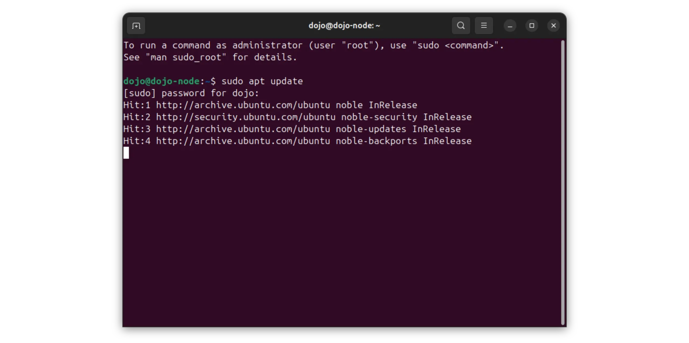


## 2. Installatie bijgebouw


Om Dojo goed te laten werken, moeten er bepaalde softwarebricks aanwezig zijn op je systeem. Deze worden gebruikt om software repositories, communicatie, archief decompressie en de uitvoering van Dojo in Docker containers te beheren. Al deze handelingen worden uitgevoerd in de terminal.


### 2.1. Voorbereiding


Met het volgende commando ga je terug naar je persoonlijke map. Dit is een goede oefening voordat je een reeks installaties uitvoert.


```bash
cd ~/
```


Controleer voordat je software installeert of de database met software die beschikbaar is op je machine up-to-date is. Dit voorkomt het installeren van verouderde versies.


```bash
sudo apt-get update
```


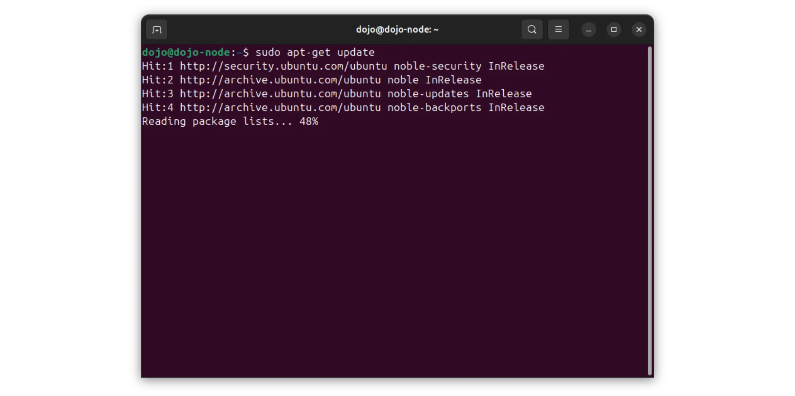


### 2.2. hulpprogramma's installeren


Er moeten verschillende hulpmiddelen aan het systeem worden toegevoegd:


- `apt-transport-https`: hiermee kun je veilig pakketten downloaden via HTTPS
- `ca-certificates`: beheert de certificaten die nodig zijn voor versleutelde verbindingen
- `curl`: om bestanden op te halen van het internet
- `gnupg-agent`: voor GPG sleutelbeheer
- software-properties-common`: biedt hulpprogramma's voor het manipuleren van APT-repositories
- `unzip`: pakt bestanden in ZIP-formaat uit


```bash
sudo apt-get install apt-transport-https ca-certificates curl gnupg-agent software-properties-common unzip
```


Tijdens de installatie kan het systeem u om bevestiging vragen. Druk op de toets "*y*" en vervolgens op "*Enter*".


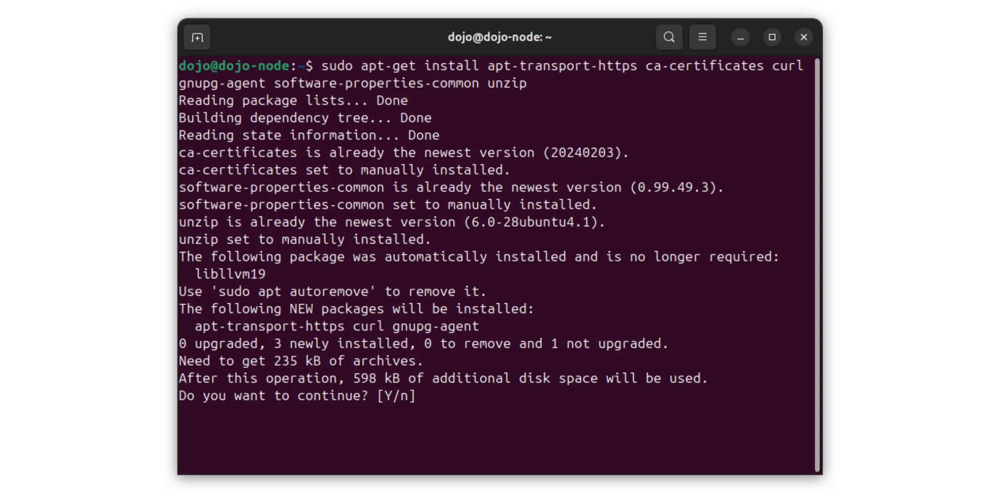


### 2.3. Torsocks installeren


Met Torsocks kunnen bepaalde commando's via het Tor-netwerk worden uitgevoerd, waardoor de vertrouwelijkheid van de communicatie wordt verbeterd.


```bash
sudo apt install torsocks
```


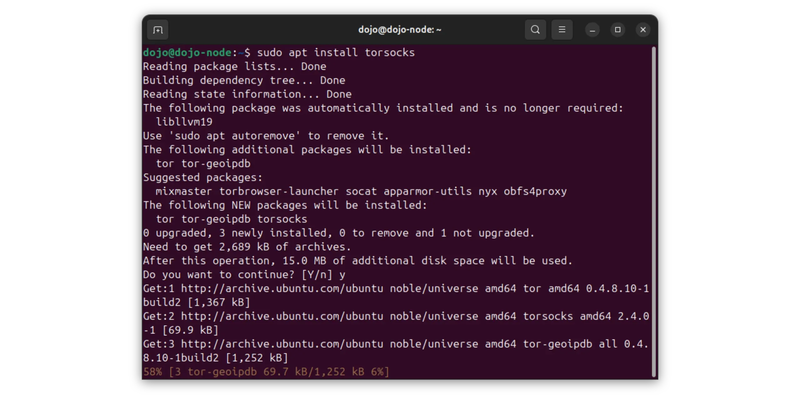


### 2.4. Docker en Docker Compose installeren


Dojo draait in Docker-containers. Dit betekent dat elke service geïsoleerd is in een onafhankelijke omgeving, wat onderhoud en beveiliging vereenvoudigt. Hiervoor moet je Docker en de Docker Compose tool installeren, waarmee je meerdere containers tegelijk kunt beheren.


#### Docker-sleutel toevoegen


Docker levert zijn eigen digitale handtekeningsleutel. Door deze toe te voegen wordt de authenticiteit van gedownloade pakketten geverifieerd.


```bash
sudo apt-get update
sudo apt-get install ca-certificates curl
sudo install -m 0755 -d /etc/apt/keyrings
sudo curl -fsSL https://download.docker.com/linux/ubuntu/gpg -o /etc/apt/keyrings/docker.asc
sudo chmod a+r /etc/apt/keyrings/docker.asc
```


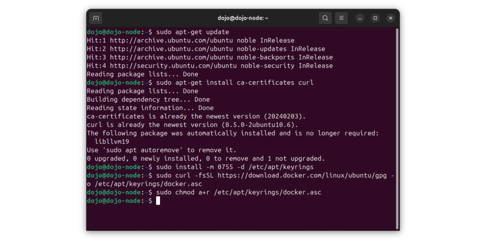


#### Officiële Docker-repository toegevoegd


Vervolgens moet je het systeem vertellen waar het de officiële Docker-pakketten kan vinden. Dit commando voegt een nieuwe repository toe aan de configuratie van je pakketbeheerder.


```bash
echo \
"deb [arch=$(dpkg --print-architecture) signed-by=/etc/apt/keyrings/docker.asc] https://download.docker.com/linux/ubuntu \
$(. /etc/os-release && echo "*$VERSION_CODENAME*") stable" | \
sudo tee /etc/apt/sources.list.d/docker.list > /dev/null

sudo apt-get update
```


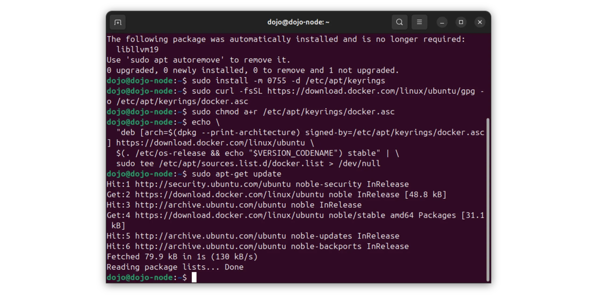


#### Docker en Docker Compose installeren


De belangrijkste Docker-componenten kunnen nu worden geïnstalleerd.


```bash
sudo apt-get install docker-ce docker-ce-cli containerd.io docker-buildx-plugin docker-compose-plugin
```


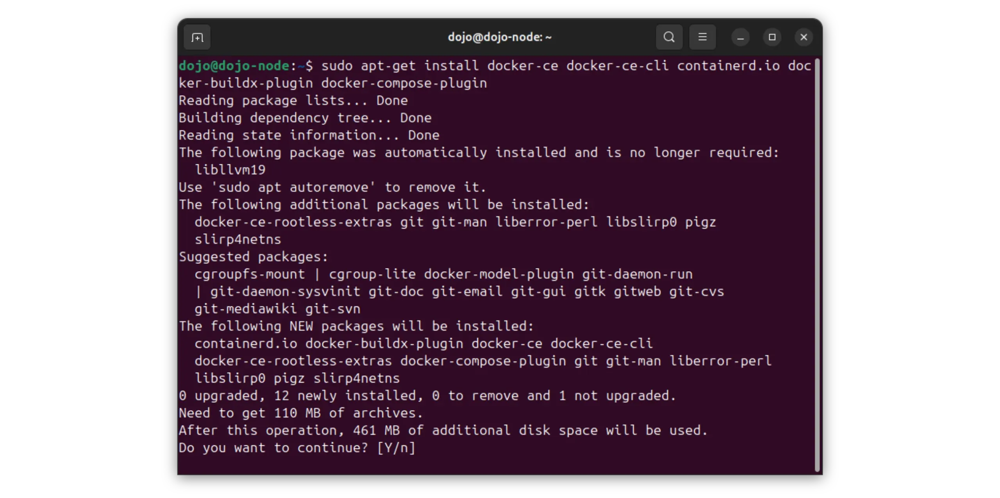


#### Machtiging gebruiker


Standaard kunnen alleen commando's uitgevoerd met beheerdersrechten Docker starten. Voor meer gemak raad ik aan om je huidige gebruiker toe te voegen aan de "*docker*" groep. Hierdoor kun je Docker gebruiken zonder telkens `sudo` te moeten typen.


```bash
sudo usermod -aG docker $USER
```


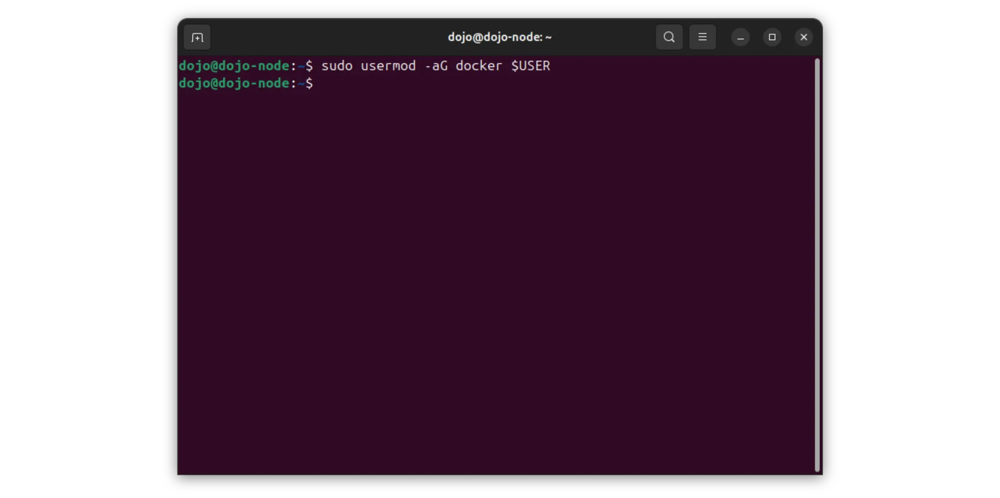


## 3. Aanmaken van één gebruiker (optioneel)


Als je de veiligheid van je systeem wilt verbeteren, raad ik je aan om een aparte gebruiker aan te maken die uitsluitend Dojo gebruikt. Deze scheiding beperkt de risico's: als er een beveiligingsprobleem optreedt in Dojo, zal het niet direct je hoofdaccount compromitteren.


### 3.1. gebruikersaccount aanmaken


Het volgende commando maakt een nieuwe gebruiker aan met de naam "*dojo*". Deze gebruiker heeft een home directory `/home/dojo` en toegang tot de bash terminal. Hij wordt ook toegevoegd aan de sudo groep om het uitvoeren van admin commando's mogelijk te maken.


```bash
sudo useradd -s /bin/bash -d /home/dojo -m -G sudo dojo
```


### 3.2. Een wachtwoord instellen


Het is belangrijk om een sterk wachtwoord toe te kennen aan dit account. Idealiter gebruik je een wachtwoordmanager zoals Bitwarden om generate een lange, Hard te raden combinatie te geven.


```bash
sudo passwd dojo
```


Het systeem zal je dan vragen om je gekozen wachtwoord in te voeren en het vervolgens een tweede keer te bevestigen.


https://planb.academy/tutorials/computer-security/authentication/bitwarden-0532f569-fb00-4fad-acba-2fcb1bf05de9

### 3.3. Gebruiker machtigen om Docker te gebruiken


Om de gebruiker "*dojo*" in staat te stellen de containers te starten die nodig zijn om Dojo te draaien, moet hij toegevoegd worden aan de Docker groep. Dit voorkomt dat elk commando voorafgegaan moet worden door `sudo`.


```bash
sudo usermod -aG docker dojo
```


### 3.4. Systeem herstarten


Om groepswijzigingen van kracht te laten worden, moet de machine opnieuw opgestart worden.


```bash
sudo reboot
```


### 3.5. Inloggen met nieuwe gebruiker


Wanneer het systeem opnieuw opstart, log dan in met de ***dojo*** login en het wachtwoord dat je eerder hebt gedefinieerd. Alle volgende stappen moeten worden uitgevoerd vanaf dit specifieke account.


## 4. Dojo downloaden en controleren


Voordat je Dojo installeert, moet je er zeker van zijn dat de bestanden afkomstig zijn van de officiële ontwikkelaar en dat ze niet gewijzigd zijn. Deze stap vertrouwt op het gebruik van PGP en hashes om de authenticiteit en integriteit van bestanden te verifiëren.


### 4.1. de PGP-sleutel van de ontwikkelaar importeren


Download de publieke sleutel van de ontwikkelaar via Tor en importeer deze in je lokale sleutelbos. Deze sleutel wordt gebruikt om de handtekeningen van Dojobestanden te verifiëren.


```bash
torsocks wget http://zkaan2xfbuxia2wpf7ofnkbz6r5zdbbvxbunvp5g2iebopbfc4iqmbad.onion/vks/v1/by-fingerprint/E53AD419B242822F19E23C6D3033D463D6E544F6 && gpg --import E53AD419B242822F19E23C6D3033D463D6E544F6
```


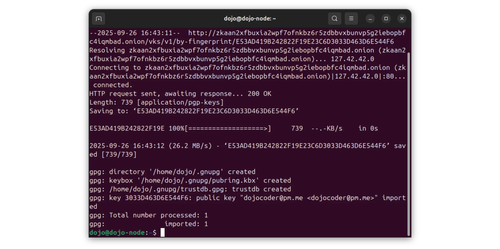


### 4.2. download de nieuwste versie van Dojo


Haal het gecomprimeerde archief op dat de broncode van Dojo bevat. In dit voorbeeld is de meest recente versie `1.27.0`: pas het commando aan volgens [de laatste versie hier op de officiële GitHub repository](https://github.com/Dojo-Open-Source-Project/samourai-dojo/releases).


```bash
torsocks wget -O samourai-dojo-1.27.0.zip https://github.com/Dojo-Open-Source-Project/samourai-dojo/archive/refs/tags/v1.27.0.zip
```


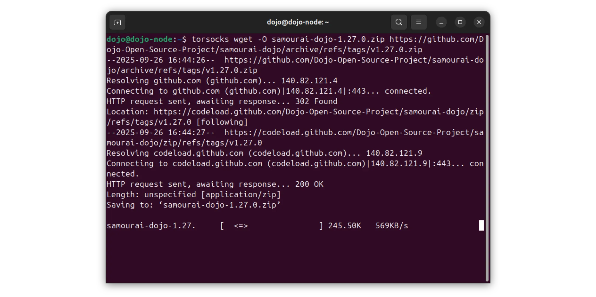


### 4.3. Vingerafdrukken en handtekening downloaden


De ontwikkelaars publiceren een bestand met de digitale vingerafdrukken van de archieven, evenals een bestand ondertekend door hun PGP-sleutel. Download ze om je bestanden lokaal te vergelijken.


```bash
torsocks wget https://github.com/Dojo-Open-Source-Project/samourai-dojo/releases/download/v1.27.0/samourai-dojo-1.27.0-fingerprints.txt && torsocks wget https://github.com/Dojo-Open-Source-Project/samourai-dojo/releases/download/v1.27.0/samourai-dojo-1.27.0-fingerprints.txt.sig
```


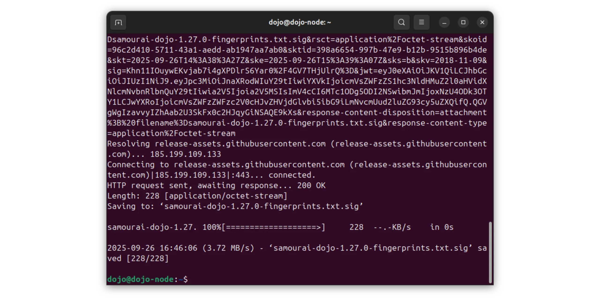


### 4.4. PGP-handtekening controleren


Controleer of het vingerafdrukbestand is ondertekend door de geïmporteerde sleutel.


```bash
gpg --verify samourai-dojo-1.27.0-fingerprints.txt.sig
```


Een correct resultaat toont een geldige handtekening met de sleutel `E53AD419B242822F19E23C6D3033D463D6E544F6` en de bijbehorende Address `dojocoder@pm.me`. Er kan een waarschuwing verschijnen dat de sleutel niet gecertificeerd is: deze kun je negeren.


Als de handtekening daarentegen ongeldig is, stop dan onmiddellijk het installatieproces en begin opnieuw vanaf het begin.


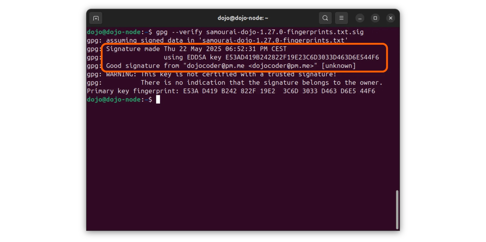


### 4.5. Controleer de integriteit van het archief


Bereken de SHA256 vingerafdruk van het gedownloade bestand, open dan het vingerafdrukbestand om de twee waarden te vergelijken.


```bash
sha256sum samourai-dojo-1.27.0.zip
cat samourai-dojo-1.27.0-fingerprints.txt
```


Als de twee vingerafdrukken identiek zijn, kun je er zeker van zijn dat het archief niet gewijzigd is. Als ze verschillen, ga dan niet verder en verwijder de bestanden.


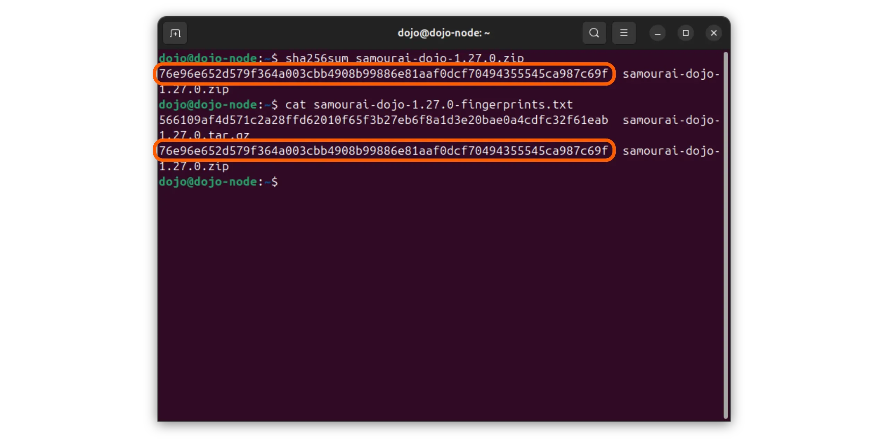


### 4.6. Bestanden uitpakken en organiseren


Zodra de verificatie met succes is voltooid, kun je het archief uitpakken en een map voorbereiden voor de installatie van Dojo.


```bash
unzip samourai-dojo-1.27.0.zip -d .
mkdir ~/dojo-app
mv ~/samourai-dojo-1.27.0/* ~/dojo-app/
```


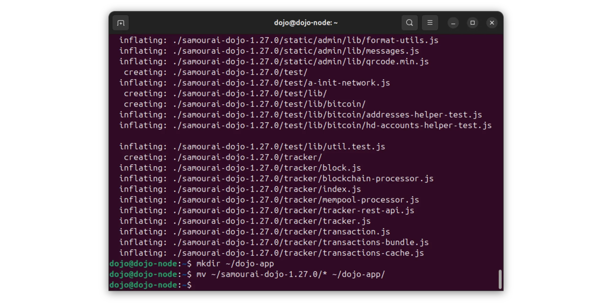


### 4.7. Opschonen van onnodige bestanden


Verwijder tijdelijke bestanden en archieven die je niet langer nodig hebt om je omgeving schoon te houden.


```bash
rm -r samourai-dojo-1.27.0 && rm samourai-dojo-1.27.0.zip && rm samourai-dojo-1.27.0-fingerprints.txt && rm samourai-dojo-1.27.0-fingerprints.txt.sig && rm E53AD419B242822F19E23C6D3033D463D6E544F6
```


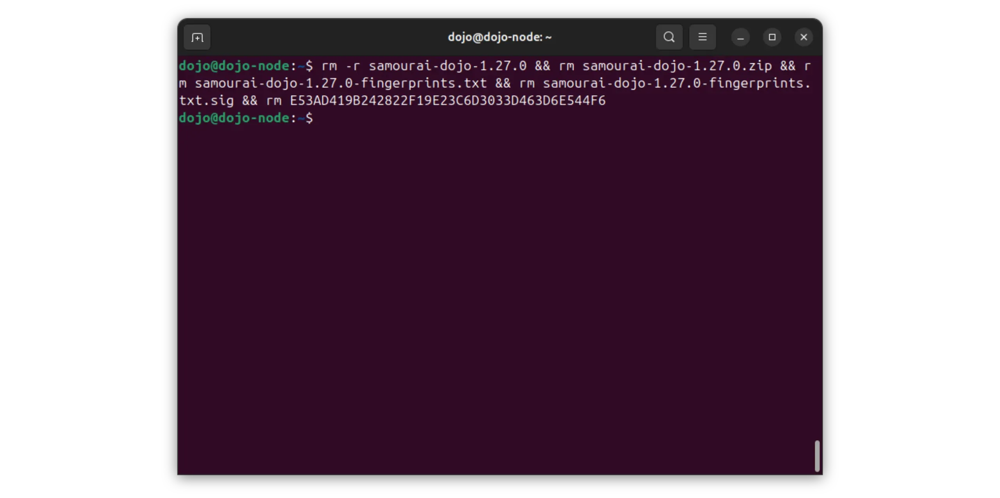


## 5. Dojo configuratie


Dojo is een backend server die verschillende diensten samenbrengt om te communiceren met je portfolio en je Bitcoin node te beheren. De configuratie kan complex zijn, maar het project biedt een vereenvoudigde methode die automatisch de volgende componenten installeert en configureert:


- Dojo (hoofd-API)
- Bitcoin core (compleet Bitcoin knooppunt)
- BTC-RPC Verkenner (web Block explorer)
- Fulcrum Indexer (snelle indexering van blokken en transacties)
- Fulcrum Electrum Server beschikbaar op het Tor-netwerk
- Fulcrum Electrum Server beschikbaar op het lokale netwerk
- Administratieve referenties


### 5.1. administratieve referenties


Om de toegang tot de verschillende diensten te beveiligen, moet je generate verschillende unieke identifiers gebruiken:


- `BITCOIND_RPC_USER`
- `BITCOIND_RPC_WACHTWOORD`
- `MYSQL_ROOT_WACHTWOORD`
- mYSQL_USER
- `MYSQL_WACHTWOORD`
- nODE_API_KEY`
- `NODE_ADMIN_KEY`
- `NODE_JWT_SECRET`


Deze identifiers **moeten** uniek zijn (dit is heel belangrijk: je mag niet hetzelfde wachtwoord gebruiken voor verschillende diensten), uitsluitend bestaan uit cijfers, hoofdletters en kleine letters (alfanumeriek) en ongeveer 40 tekens lang zijn om een hoog beveiligingsniveau te garanderen. Nogmaals, ik raad het gebruik van een wachtwoordmanager sterk aan.


### 5.2. Toegang tot configuratiebestanden


Dojo configuratiebestanden staan in de map `conf/`. Verplaats naar deze map:


```bash
cd ~/dojo-app/docker/my-dojo/conf/
```


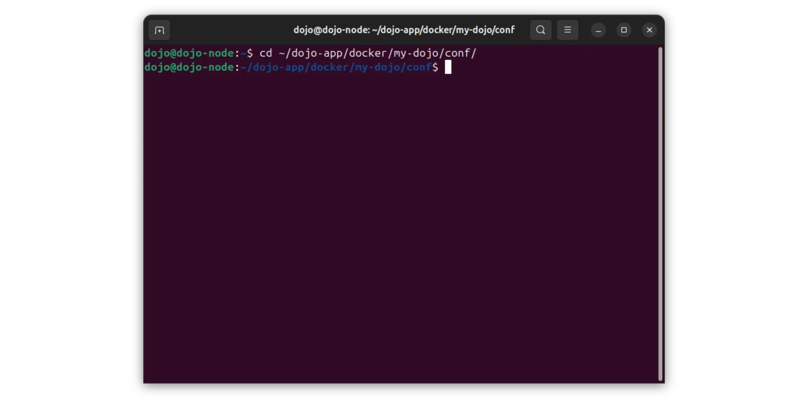


### 5.3. Bitcoin core configuratie


Open het Bitcoin core configuratiebestand met de teksteditor nano:


```bash
nano docker-bitcoind.conf.tpl
```


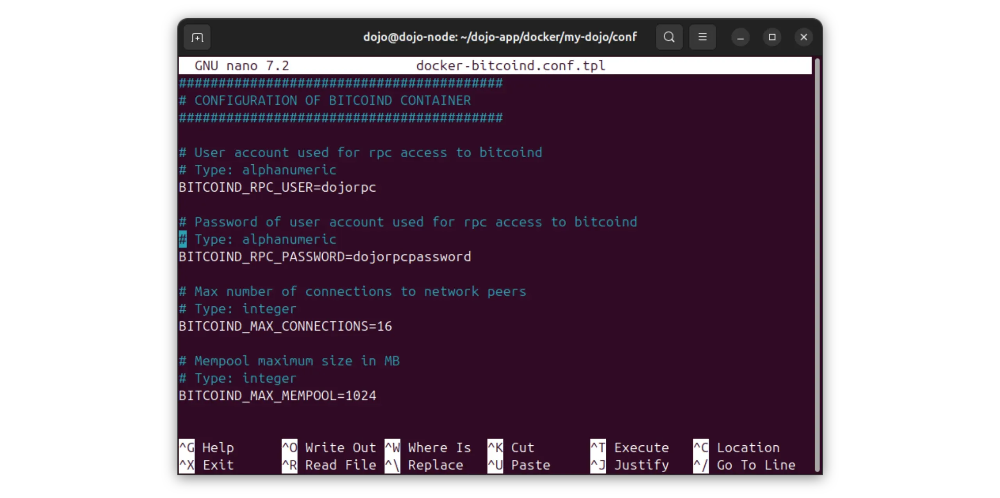


Voer in dit bestand de gegenereerde identifiers in:


```
BITCOIND_RPC_USER=your-ID-here
BITCOIND_RPC_PASSWORD=your-password-here
```


⚠️ ***Vervang `uw-ID-hier` en `uw-wachtwoord-hier` door je eigen logins (met een sterk wachtwoord).***


Je kunt ook de grootte van het cachegeheugen dat Bitcoin core gebruikt aanpassen om de prestaties te verbeteren (je kunt zelfs meer gebruiken als je veel RAM beschikbaar hebt):


```
BITCOIND_DB_CACHE=2048
```


Om uw wijzigingen op te slaan en de editor te sluiten :


- druk op `Ctrl + X
- type `y`
- druk dan op "*Enter*"


### 5.4. MySQL configuratie


Open dan de MySQL databaseconfiguratie:


```bash
nano docker-mysql.conf.tpl
```


Voer uw inloggegevens in:


```
MYSQL_ROOT_PASSWORD=your-password-here
MYSQL_USER=your-ID-here
MYSQL_PASSWORD=your-password-here
```


⚠️ ***Vervang `uw-ID-hier` en `uw-wachtwoord-hier` door je eigen logins (met sterke, unieke wachtwoorden).***


Sla op dezelfde manier op (`Ctrl + X`, `y`, "*Enter*").


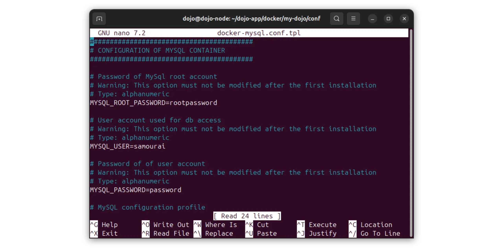


### 5.5. Fulcrum indexer configuratie


Open het volgende bestand:


```bash
nano docker-indexer.conf.tpl
```


Voeg de parameters toe om Fulcrum te activeren en correct te integreren in Dojo :


```
INDEXER_INSTALL=on
INDEXER_TYPE=fulcrum
INDEXER_BATCH_SUPPORT=active
INDEXER_EXTERNAL=on
```


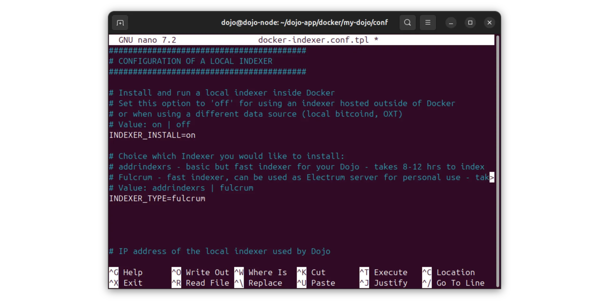


Vervolgens zijn er 2 mogelijkheden, afhankelijk van je configuratie. Als Dojo is geïnstalleerd op een machine die los staat van je dagelijkse computer (op een speciale machine, een server...), voer dan zijn IP Address in je lokale netwerk in, bijvoorbeeld :


```
INDEXER_EXTERNAL_IP=192.168.1.157
```


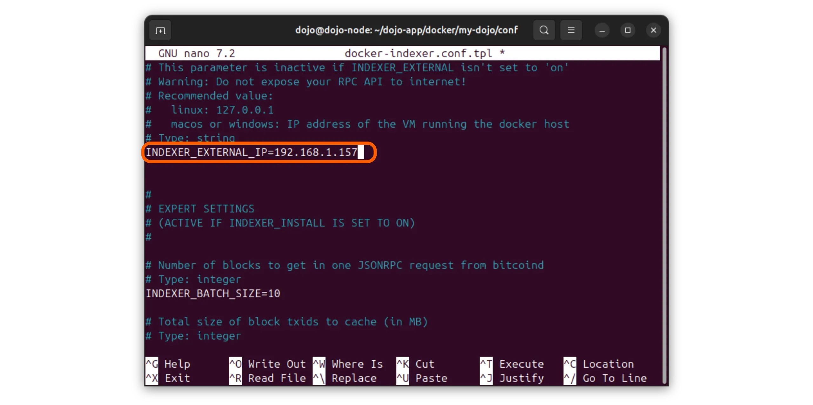


Om het lokale IP Address van je machine te achterhalen, open je een andere terminal en voer je het volgende commando in:


```bash
hostname -I
```


Tweede mogelijkheid: als Dojo rechtstreeks op je dagelijkse computer wordt uitgevoerd, behoud dan de standaardwaarde die al in het configuratiebestand staat:


```
INDEXER_EXTERNAL_IP=127.0.0.1
```


Opslaan en de editor afsluiten (`Ctrl + X`, `y`, "*Enter*").


### 5.6. Node-service configuratie


Open tenslotte de configuratie van de Dojo service:


```bash
nano docker-node.conf.tpl
```


Voer uw inloggegevens in:


```
NODE_API_KEY=your-password-here
NODE_ADMIN_KEY=your-password-here
NODE_JWT_SECRET=your-password-here
```


⚠️ ***Vervang `uw-wachtwoord-hier` door uw eigen referenties (met sterke, unieke wachtwoorden).***


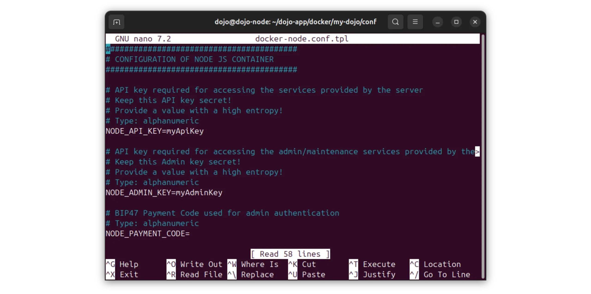


Activeer vervolgens de lokale indexer:


```
NODE_ACTIVE_INDEXER=local_indexer
```


Opslaan en de editor afsluiten (`Ctrl + X`, `y`, "*Enter*").


### 5.7. Beheer van aanmeldingen


Als de configuratie voltooid is, is het niet nodig om alle gegenereerde identifiers op te slaan. De enige die absoluut moet worden opgeslagen is :


```
NODE_ADMIN_KEY
```


Met deze login kun je later inloggen op de Dojo onderhoudstool. Alle andere logins kun je verwijderen uit je wachtwoordmanager of handgeschreven notities. Ze blijven toegankelijk via de Dojo configuratiebestanden, mocht je ze in de toekomst nodig hebben.


## 6. Dojo installatie


In dit stadium wordt Dojo geïnstalleerd en gestart op je machine. De operatie zal verschillende diensten starten (Bitcoin core, de Fulcrum indexer, de Dojo backend, etc.) en de volledige synchronisatie van de Blockchain Bitcoin starten. Dit kan enkele dagen duren, afhankelijk van je hardware en internetverbinding.


### 6.1. Controleer of Docker goed werkt


Voordat je de installatie start, moet je ervoor zorgen dat Docker operationeel is. Voer het volgende commando uit:


```bash
docker run hello-world
```


Dit commando downloadt en lanceert een kleine testcontainer. Als alles correct werkt, zou je een bericht moeten zien dat lijkt op :


```
Hello from Docker!
This message shows that your installation appears to be working correctly...
```


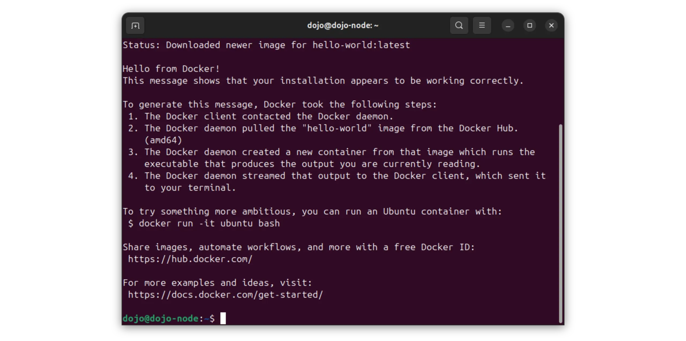


Als dit bericht niet wordt weergegeven, start de machine dan opnieuw op met :


```bash
sudo reboot
```


Log dan weer in op je **dojo** account en voer het testcommando opnieuw uit. Als de fout blijft bestaan, is Docker niet correct geïnstalleerd. Ga in dit geval terug naar stap `2.4.` over het installeren van Docker en controleer elk commando zorgvuldig.


### 6.2. Ga naar de Dojo installatiemap


De scripts die nodig zijn voor de installatie staan in de map `my-dojo`. Verplaats naar deze map:


```bash
cd ~/dojo-app/docker/my-dojo
```


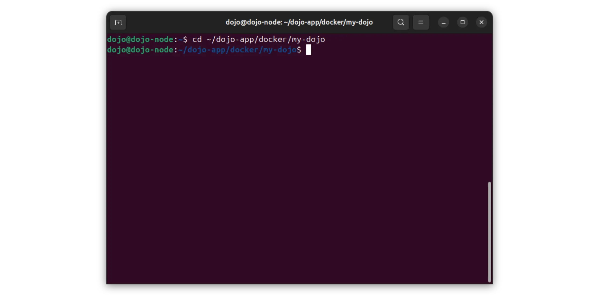


Gebruik het `ls` commando om te controleren of het `dojo.sh` bestand aanwezig is. Dit is het hoofdscript dat de installatie van Dojo en het starten van alle services automatiseert.


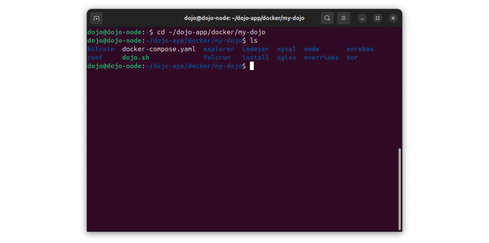


### 6.3. Installatie starten


Start de installatie door de :


```bash
./dojo.sh install
```


Bevestig de installatie door op `y` te drukken en vervolgens op "*Enter*".


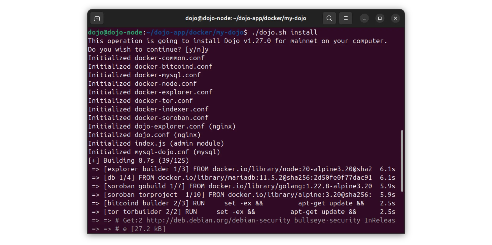


Dit script zal :


- de benodigde Docker-containers downloaden en starten,
- gW-29 initialiseren en Blockchain beginnen te synchroniseren,
- start de Fulcrum indexer om transacties en adressen bij te houden,
- de Dojo backend en zijn API's activeren.


Je zult een gestage stroom logs voorbij zien rollen, met kleurrijke verwijzingen zoals `bitcoind`, `soroban`, `nodejs` of `fulcrum`. Dit scrollen geeft aan dat Dojo draait en de verschillende services begint uit te voeren.


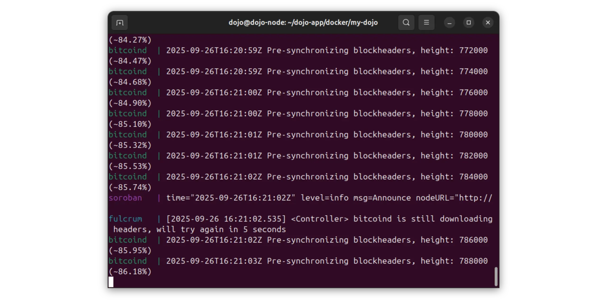


### 6.4. Logboekweergave afsluiten


Logs verschijnen in real time in je terminal. Om terug te keren naar de opdrachtprompt terwijl Dojo op de achtergrond draait, typ je :


```
Ctrl + C
```


Maak je geen zorgen: het stoppen van de logweergave stopt de services niet. Docker blijft Dojo op de achtergrond draaien (je hoeft de computer natuurlijk niet te stoppen als je wilt dat IBD doorgaat).


### 6.5. Inzicht in *Initial Block Download* (IBD)


Bij het opstarten moet Bitcoin core de gehele Blockchain sinds 2009 downloaden en verifiëren. Deze stap heet ***Initial Block Download* (IBD)**. Het is essentieel, omdat het je Dojo knooppunt in staat stelt om elk Bitcoin blok en transactie onafhankelijk te verifiëren.


De duur van deze synchronisatie hangt af van verschillende factoren:


- de kracht van je processor en de hoeveelheid RAM-geheugen die beschikbaar is,
- de snelheid van je schijf,
- het aantal en de kwaliteit van peers waarmee je knooppunt verbinding maakt,
- de snelheid van je internetverbinding.


In de praktijk duurt deze operatie meestal tussen **2 en 7 dagen**. Tijdens deze periode kun je de machine continu aan laten staan. Hoe langer de machine aanstaat, hoe sneller de synchronisatie voltooid zal zijn. Ik adviseer je om de synchronisatiestatus regelmatig te controleren door de Bitcoin core logs te raadplegen, of door de Dojo onderhoudstool te gebruiken nadat deze geïnstalleerd is (zie volgende sectie).


Om je kennis over IBD en, meer in het algemeen, over de werking en de rol van je Bitcoin knoop te verdiepen, raad ik je aan deze cursus te volgen:


https://planb.academy/courses/3cd9cb94-82e8-417a-9c5a-02afc2589426


## 7. Synchronisatiebewaking


Wanneer je Dojo voor de eerste keer installeert, moet je wachten tot twee belangrijke handelingen volledig zijn afgerond: het volledig downloaden van de Blockchain Bitcoin (*IBD*) en het indexeren van deze Blockchain door Fulcrum. Afhankelijk van uw verbinding en de kracht van de machine, kan dit enkele dagen duren. Gedurende deze tijd kun je de voortgang van het proces volgen om er zeker van te zijn dat alles soepel verloopt.


Er zijn twee manieren om de status van synchronisatie te controleren:


- gebruik van de Dojo Maintenance Tool (of DMT), die eenvoudig is maar weinig details geeft tijdens IBD;
- directe raadpleging van Dojo-logs op je machine, technischer maar veel nauwkeuriger.


### 7.1. Controleer via Dojo Maintenance Tool (DMT)


De Dojo Maintenance Tool is een beveiligde, webgebaseerde Interface waarmee je de status van je installatie kunt controleren en bepaalde handelingen kunt uitvoeren. Het is de gemakkelijkste en meest toegankelijke manier om de voortgang van de IBD te controleren. Tijdens de initiële synchronisatiefase kan de weergegeven informatie beperkt zijn. De DMT toont bijvoorbeeld niet de gedetailleerde voortgang van de Fulcrum indexering. Aan de andere kant, zodra de synchronisatie is voltooid, zal de DMT duidelijk :


- alle lampjes op Green;
- het laatste gevalideerde blok voor elke service (Node, Indexer, Dojo DB).


Om toegang te krijgen moet je de URL van je DMT weten en er verbinding mee maken [via de Tor browser](https://www.torproject.org/download/). Om dit te doen, open je een terminal en ga je naar de `/mijn-dojo` directory:


```bash
cd ~/dojo-app/docker/my-dojo
```


Voer dan het volgende commando uit:


```bash
./dojo.sh onion
```


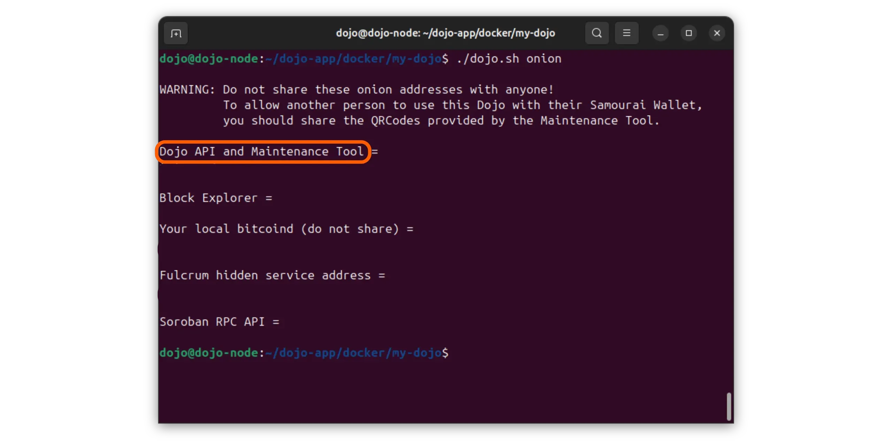


Je hebt dan toegang tot alle informatie met betrekking tot verbindingen met je Dojo via Tor. Degene waarin we hier geïnteresseerd zijn is de volgende URL:


```
Dojo API and Maintenance Tool =
```


Om toegang te krijgen tot de DMT vanaf elke machine op elk netwerk (zelfs op afstand), open je Tor Browser en voer je deze URL in gevolgd door `/admin`. Als je URL bijvoorbeeld `wo4zobymdl45gmmzzmpoypeemoukbj74wpibc22rxs2yfgpej62v6dyd.onion` is, moet je deze invoeren in de [Tor Browser](https://www.torproject.org/download/) balk:


```
wo4zobymdl45gmmzzmpoypeemoukbj74wpibc22rxs2yfgpej62v6dyd.onion/admin
```


⚠️ **Gelieve deze Address strikt vertrouwelijk te behandelen


Je wordt dan doorgestuurd naar een authenticatiepagina. De DMT is ingelogd met het `NODE_ADMIN_KEY` wachtwoord dat je eerder hebt gegenereerd.


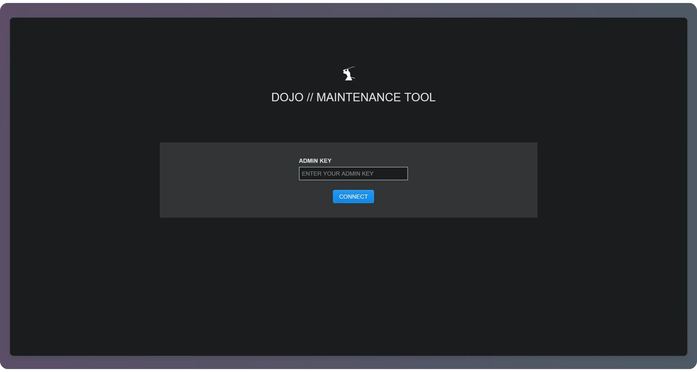


Eenmaal ingelogd heb je toegang tot de *Dojo Onderhoudstool*! Tijdens IBD kun je de "*Laatste Blok*" informatie zien in het "*Full node*" menu, waarmee je de huidige status van je Bitcoin knooppunt kunt zien.


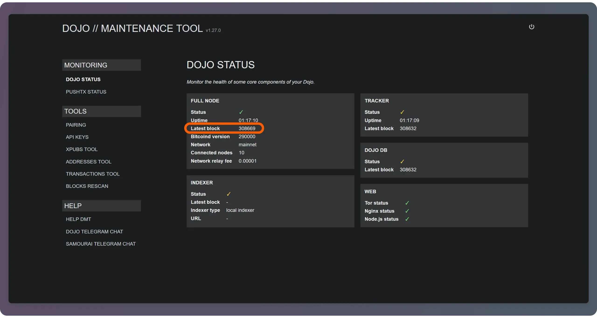


Vergeet niet om een bladwijzer aan te maken voor deze Address in Tor Browser, zodat je deze later gemakkelijk terug kunt vinden.


Zodra je Dojo volledig is gesynchroniseerd, zou je Green moeten zien controleren ✅ op alle indicatoren op de DMT-startpagina.


### 7.2. Verificatie via Dojo-logboeken


De tweede manier om de voortgang van je IBD te volgen is door direct de logboeken van je machine te raadplegen. Deze aanpak biedt een veel nauwkeurigere, real-time controle. Je kunt zien hoe Bitcoin core vordert met het downloaden van blokken, en hoe Fulcrum ze indexeert.


Maak verbinding met de machine waarop je Dojo staat en open een terminal. Alle commando's moeten worden uitgevoerd vanuit de `mijn-dojo` map. Plaats jezelf in deze map:


```bash
cd ~/dojo-app/docker/my-dojo
```


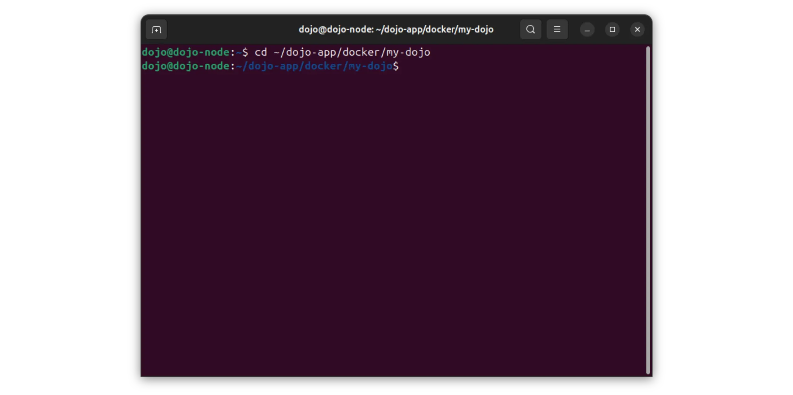


#### Bitcoin core logboeken


Bitcoin core logboeken bekijken om de voortgang van IBD bij te houden:


```bash
./dojo.sh logs bitcoind
```


Aan het begin ziet u een pre-synchronisatiefase van de block headers:


```
bitcoind | Pre-synchronizing blockheader, height : NNNNNN
```


Wanneer dit getal 100% bereikt, begint Bitcoin core met de volledige download van Blockchain. Je ziet de voortgang van IBD. Om de huidige blokhoogte te weten te komen, kijk je naar de waarde aangegeven door `height=`. Je kunt ook de sleutel `progress=` volgen, die het percentage van de IBD voortgang aangeeft.


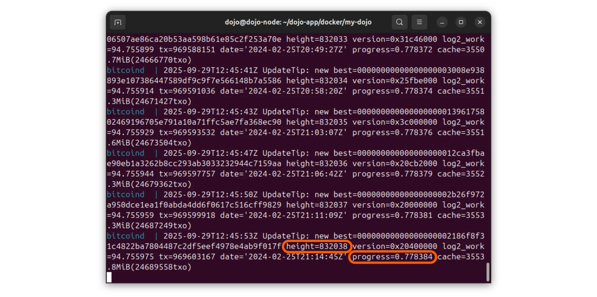


Zoals altijd, gebruik de `Ctrl + C` combinatie om de logs te sluiten en terug te keren naar de opdrachtprompt.


#### Fulcrum houtblokken


Zodra Bitcoin core klaar is met de header pre-synchronisatie, begint Fulcrum met het indexeren van Blockchain. Bekijk zijn logs met :


```bash
./dojo.sh logs fulcrum
```


Je ziet dan de hoogte van het laatst geïndexeerde blok, aangegeven na `hoogte:`, evenals het voortgangspercentage van het indexeren.


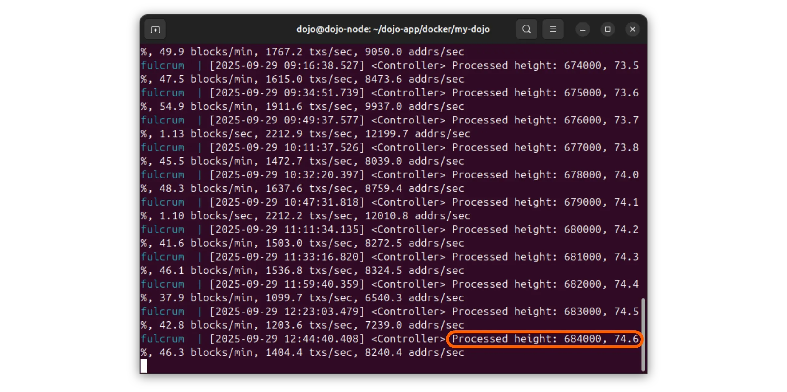


### 7.3. Fulcrum database corruptie


Fulcrum is een bijzonder krachtige indexer, maar de installatie ervan kan complex zijn, niet in het minst vanwege het delicate databasebeheer. In het geval van een stroomstoring of plotselinge uitschakeling van de machine tijdens de eerste synchronisatie, kan de database van de indexer beschadigd raken. Dit kun je bijvoorbeeld zien aan de volgende logs:


```bash
fulcrum | The database has been corrupted etc...
```


**Noot:** Dit type fout zou gecorrigeerd moeten zijn met de aankomende release van Fulcrum 2.0.


Als dit bij jou gebeurt, heeft dit geen invloed op bitcoind (jouw Bitcoin knooppunt): zijn IBD zal onafhankelijk van Fulcrum verder gaan. Je zult Fulcrum echter niet kunnen gebruiken, totdat je de beschadigde data hebt verwijderd en de synchronisatie vanaf het begin opnieuw hebt gestart. Dit is hoe het werkt:


Stop Dojo:


```bash
cd ~/dojo-app/docker/my-dojo
./dojo.sh stop
```


Verwijder alleen de Fulcrum container en het volume:


```bash
docker rm -f fulcrum || true
docker volume ls | grep -i fulcrum
docker volume rm my-dojo_data-fulcrum
```


Normaal gesproken is de naam `mijn-dojo_data-fulcrum`, als dit niet het geval is voor jou, pas dan de naam aan die door het vorige commando is geretourneerd.


Start Dojo dan opnieuw en bouw Fulcrum helemaal opnieuw op:


```bash
./dojo.sh upgrade
```


Je kunt dan controleren of Fulcrum goed werkt door de logs te raadplegen:


```bash
docker logs -f fulcrum
```


## 8. De Dojo onderhoudstool gebruiken


Zodra je Bitcoin knoop met de meeste Proof of Work gesynchroniseerd is met de kettingkop en de Blockchain 100% geïndexeerd is door Fulcrum, kun je je Dojo gaan gebruiken.


Je Dojo biedt een breed scala aan functies, die regelmatig worden uitgebreid met elke nieuwe versie. Naar mijn mening zijn de 2 belangrijkste :


- de mogelijkheid om je Ashigaru Wallet aan te sluiten om je eigen node te gebruiken om Blockchain gegevens te raadplegen en je transacties uit te zenden,
- en de Block explorer, die je toegang geeft tot informatie over de Blockchain Bitcoin zonder je gegevens bloot te stellen aan een externe instantie waar je geen controle over hebt.


Laten we eens kijken hoe we ze kunnen gebruiken.


### 8.1. Ashigaru verbinden met je Dojo


Je Ashigaru Wallet verbinden met je Dojo is heel eenvoudig: open op je DMT het menu "*Pairing*". Er verschijnt een QR-code die je direct kunt scannen met de Ashigaru-toepassing.


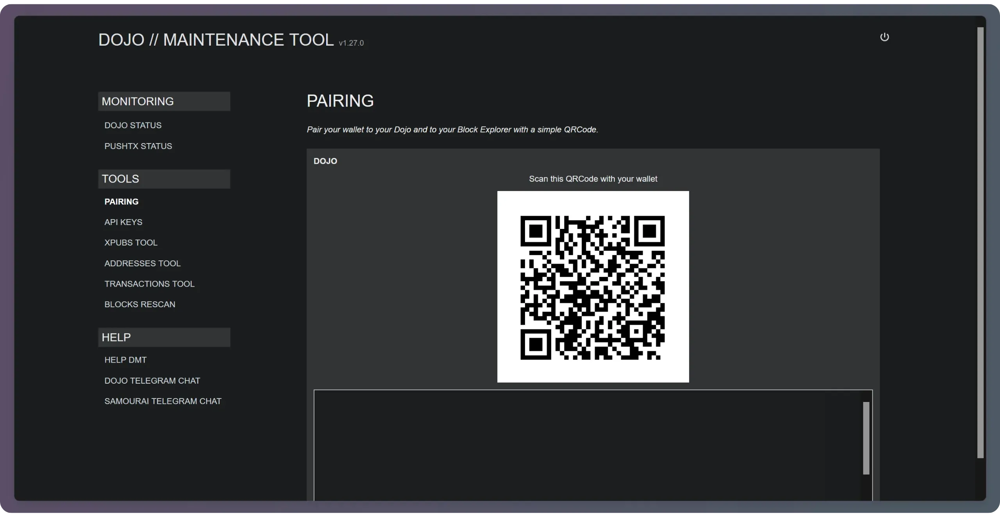


De eerste keer dat je de Ashigaru-toepassing opstart na het aanmaken of herstellen van je Wallet, word je doorgestuurd naar de pagina "*Configure your Dojo server*". Druk op "*Scan QR*" en scan de QR code die op je DMT staat.


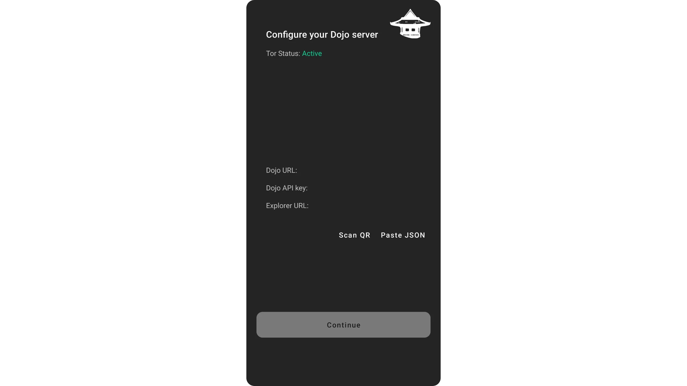


Klik vervolgens op de knop "*Doorgaan*".


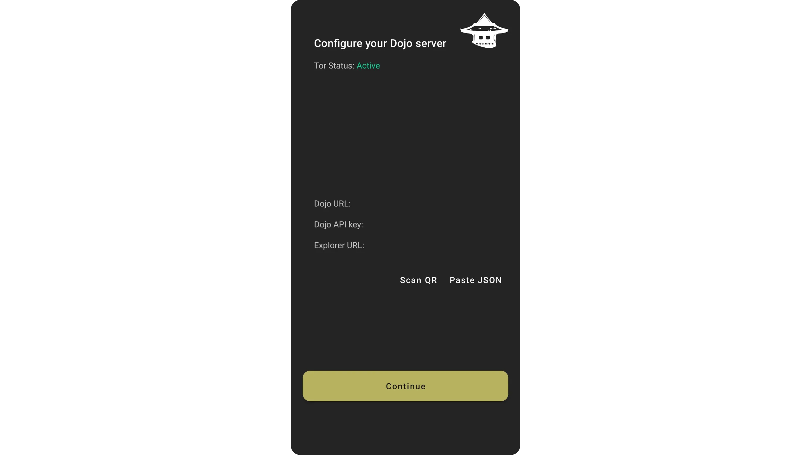


Je bent nu verbonden met je Dojo.


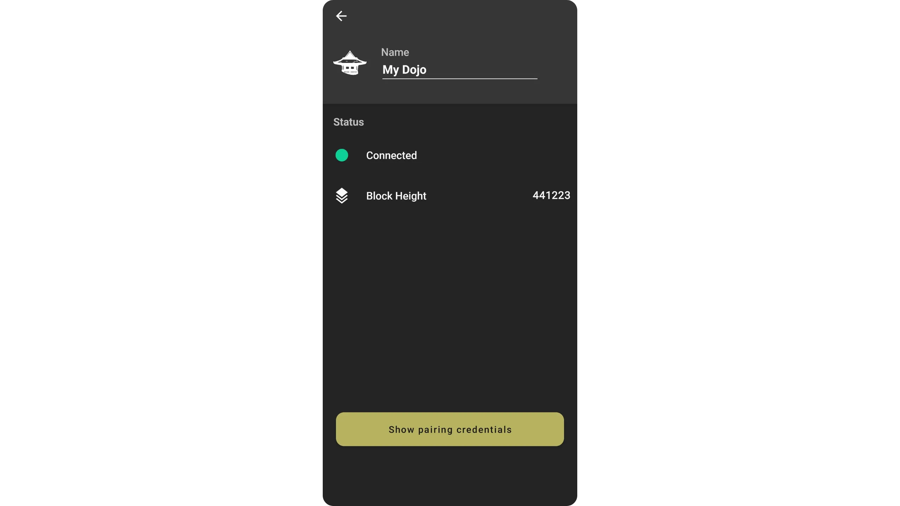


### 8.2. De Block explorer gebruiken


Dojo installeert automatisch een Block explorer, [BTC-RPC Explorer](https://github.com/janoside/btc-RPC-explorer), die direct put uit gegevens van je eigen Bitcoin node. Een explorer geeft je toegang tot ruwe informatie van Blockchain en je Mempool via een eenvoudig te begrijpen Interface web. Zo kun je bijvoorbeeld gemakkelijk de status van een lopende transactie controleren, het saldo van een Address bekijken of de samenstelling van een blok onderzoeken.


Om toegang te krijgen, haal je gewoon de Tor Address op uit je browser. Voer hiervoor hetzelfde commando uit dat je gebruikte om de Address van je DMT te verkrijgen:


```bash
./dojo.sh onion
```


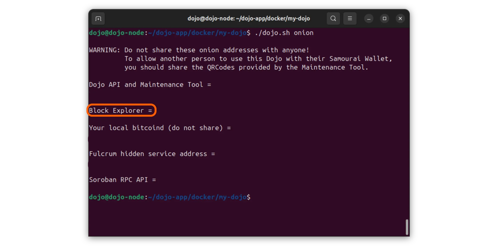


Je hebt toegang tot al je Dojo verbindingsinformatie via Tor. Waar we hier in geïnteresseerd zijn is de volgende URL:


```
Block Explorer =
```


Als je al verbonden bent met je DMT, kun je deze Address ook vinden in het "*Pairing*" menu, in de connection JSON:


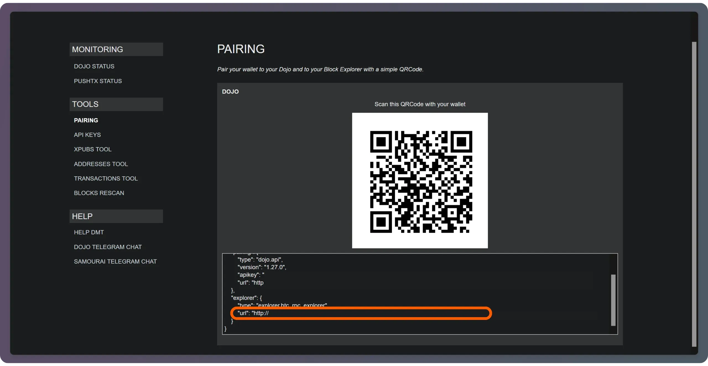


Om toegang te krijgen tot je browser vanaf elke machine op elk netwerk (zelfs op afstand), open je [Tor Browser](https://www.torproject.org/download/) en voer je de URL in die je zojuist hebt opgehaald.


⚠️ **Bewaar deze Address strikt vertrouwelijk


Je hebt dan toegang tot je eigen Block explorer.


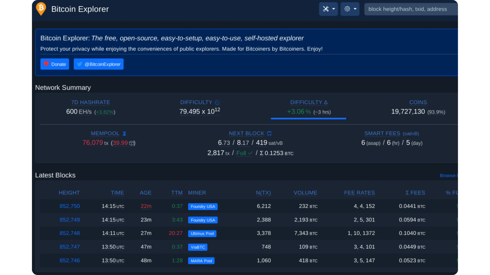


*Afbeelding credit: https://ashigaru.rs/.*


Om een transactie te volgen, voer je gewoon de txid in de zoekbalk rechtsboven in.


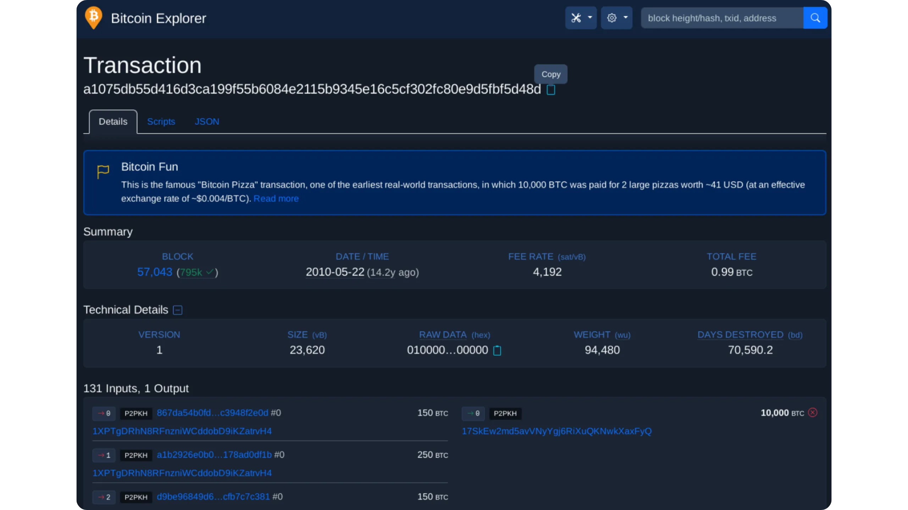


*Afbeelding credit: https://ashigaru.rs/.*


Om de bewegingen geassocieerd met een Address te controleren, ga je op dezelfde manier te werk door de Address in te voeren in de zoekbalk.


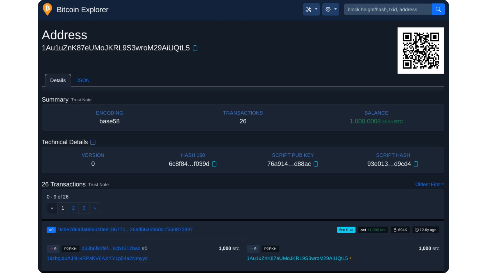


*Afbeelding credit: https://ashigaru.rs/.*


Je kunt ook de Hash of hoogte van een blok invoeren in de zoekbalk om details weer te geven.


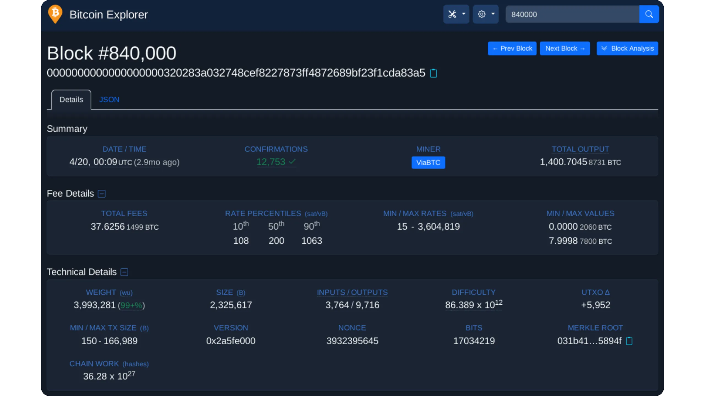


*Afbeelding credit: https://ashigaru.rs/.*


## 9. Dojo onderhoud


### 9.1 Stop je Dojo


Onderbreek nooit abrupt de stroomtoevoer naar je Dojo, omdat dit bepaalde databases kan beschadigen, met name de Fulcrum indexer. Als je het toch moet uitschakelen, voer dan altijd een schone shutdown van Dojo uit en schakel daarna, als alle procedures zijn voltooid, ook de machine uit:


```bash
cd ~/dojo-app/docker/my-dojo
./dojo.sh stop
```


### 9.2 Werk je Dojo bij


Dojo ontwikkelt zich regelmatig en er worden nieuwe versies uitgebracht om bugs te verhelpen, de stabiliteit te verbeteren en functies toe te voegen. Het is daarom belangrijk [om regelmatig te controleren op updates](https://github.com/Dojo-Open-Source-Project/samourai-dojo/releases) en om je Dojo bij te werken. Het proces is vergelijkbaar met de initiële installatie, maar vereist dat je bepaalde bestanden vervangt door de laatste beschikbare versie, terwijl je je configuratie behoudt. Hier zijn de gedetailleerde stappen die je moet volgen voor een schone en veilige update:


Om de huidige versie van je Dojo te weten te komen, voer je het commando :


```bash
./dojo.sh version
```


Hoewel deze stap optioneel is, raad ik je aan om te beginnen met het updaten van je OS. Dit vermindert het risico op incompatibiliteiten en zorgt ervoor dat de afhankelijkheden die Dojo gebruikt up-to-date zijn:


```bash
sudo apt-get update
sudo apt-get upgrade
```


Ga naar de Dojo directory en stop de huidige services:


```bash
cd ~/dojo-app/docker/my-dojo
./dojo.sh stop
```


Start vervolgens je systeem opnieuw op om een schone lei te krijgen:


```bash
sudo reboot
```


Dojo wordt geleverd met digitaal ondertekende bestanden. Deze PGP-handtekeningen garanderen dat de bestanden afkomstig zijn van de ontwikkelaar en op geen enkele manier zijn gewijzigd. Het is belangrijk om ze te controleren elke keer dat je Dojo bijwerkt, net zoals je deed toen je het voor het eerst installeerde. Begin met het downloaden van de publieke sleutel van de ontwikkelaar via Tor en importeer deze :


```bash
torsocks wget http://zkaan2xfbuxia2wpf7ofnkbz6r5zdbbvxbunvp5g2iebopbfc4iqmbad.onion/vks/v1/by-fingerprint/E53AD419B242822F19E23C6D3033D463D6E544F6 && gpg --import E53AD419B242822F19E23C6D3033D463D6E544F6
```


Ga terug naar je persoonlijke map:


```bash
cd ~/
```


Download de laatste versie van Dojo van GitHub via Tor. In dit voorbeeld is het versie `1.28.0` (die nog niet bestaat op het moment van schrijven: dit is alleen om een voorbeeld te geven). Vergeet niet om het bestand en de link [te vervangen door de versie die je wilt installeren](https://github.com/Dojo-Open-Source-Project/samourai-dojo/releases):


```bash
torsocks wget -O samourai-dojo-1.28.0.zip https://github.com/Dojo-Open-Source-Project/samourai-dojo/archive/refs/tags/v1.28.0.zip
```


Download ook het bestand met de PGP vingerafdrukken en handtekening (nogmaals, vergeet niet de versie aan te passen in het commando):


```bash
torsocks wget https://github.com/Dojo-Open-Source-Project/samourai-dojo/releases/download/v1.28.0/samourai-dojo-1.28.0-fingerprints.txt && torsocks wget https://github.com/Dojo-Open-Source-Project/samourai-dojo/releases/download/v1.28.0/samourai-dojo-1.28.0-fingerprints.txt.sig
```


Controleer of het gedownloade vingerafdrukbestand is ondertekend met de sleutel van de ontwikkelaar:


```bash
gpg --verify samourai-dojo-1.28.0-fingerprints.txt.sig
```


Een correct resultaat moet worden weergegeven:


```
gpg: Signature made [date + time]
gpg: using EDDSA key E53AD419B242822F19E23C6D3033D463D6E544F6
gpg: Good signature from "dojocoder@pm.me" <dojocoder@pm.me> [unknown]
```


Er kan een waarschuwing verschijnen dat de sleutel niet gecertificeerd is, maar dit is niet belangrijk. Aan de andere kant, als de handtekening ongeldig is of overeenkomt met een andere sleutel, ga dan niet verder en begin opnieuw door de koppelingen te controleren.


Bereken dan de SHA256 vingerafdruk van het archief en vergelijk deze met het officiële vingerafdrukbestand:


```bash
sha256sum samourai-dojo-1.28.0.zip
cat samourai-dojo-1.28.0-fingerprints.txt
```


Als de twee vingerafdrukken perfect overeenkomen, is het archief echt en intact. Als ze verschillen, verwijder de bestanden dan onmiddellijk en ga niet verder.


Pak het archief uit in je thuismap:


```bash
unzip samourai-dojo-1.28.0.zip -d .
```


Kopieer vervolgens de inhoud naar de Dojo-directory, waarbij je de oude :


```bash
cp -a samourai-dojo-1.28.0/. dojo-app/
```


Deze bewerking behoudt je configuratiebestanden die zich bevinden in `~/dojo-app/docker/mijn-dojo/conf`, maar vervangt alle andere bestanden door de bijgewerkte versies.


Verwijder onnodige bestanden om je omgeving schoon te houden:


```bash
rm -r samourai-dojo-1.28.0 && rm samourai-dojo-1.28.0.zip && rm samourai-dojo-1.28.0-fingerprints.txt && rm samourai-dojo-1.28.0-fingerprints.txt.sig && rm E53AD419B242822F19E23C6D3033D463D6E544F6
```


Ga terug naar de Dojo scripts map en voer het update commando uit:


```bash
cd ~/dojo-app/docker/my-dojo
./dojo.sh upgrade -y
```


Dit commando instrueert Docker om de images te herbouwen met de nieuwe bestanden en vervolgens automatisch alle services te herstarten. Controleer aan het einde van het proces de logs om er zeker van te zijn dat Bitcoin core, Fulcrum en Dojo allemaal correct werken:


```bash
./dojo.sh logs bitcoind
./dojo.sh logs fulcrum
```


Als de services zonder fouten starten en de logs laten zien dat er blokken worden verwerkt, dan is je Dojo nu up-to-date en operationeel.