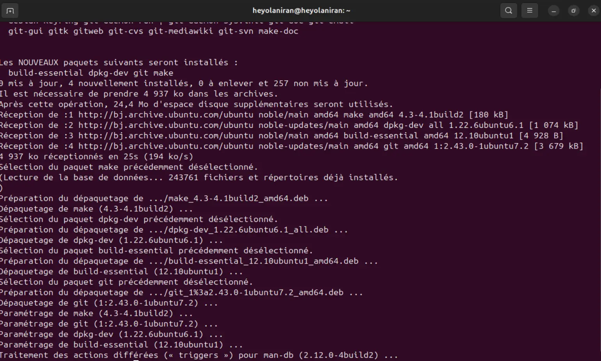
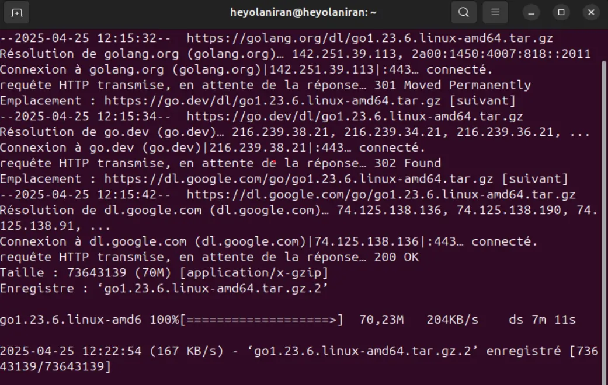
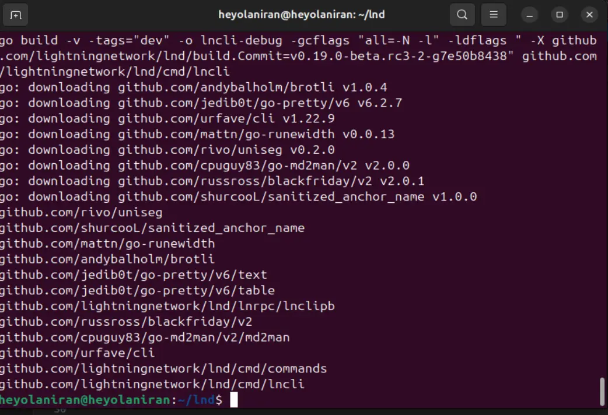
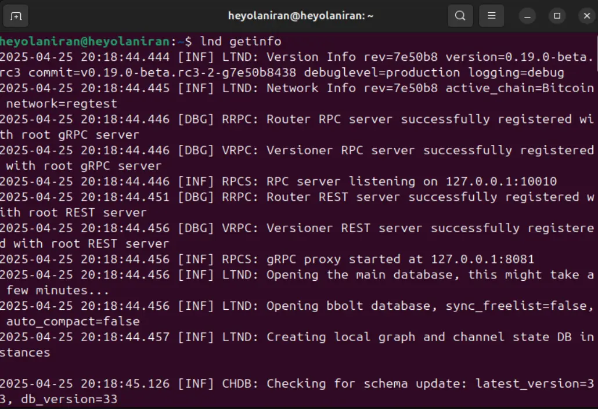
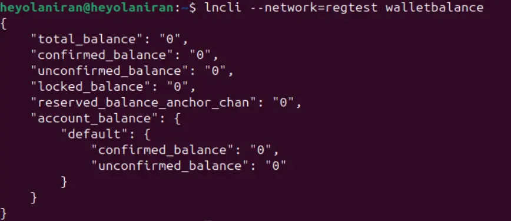

Lightning Network دومین Layer از Bitcoin است که به لطف سرعت و هزینه پایین تراکنش‌هایی که ارائه می‌دهد، قادر به پذیرش ابعاد رعد و برق است.


در این آموزش، ما پیاده‌سازی Lightning Network Daemon را بر روی ماشین لینوکس خود (توزیع Ubuntu 24.04) نصب خواهیم کرد.


## Lightning Network Daemon چیست؟


Lightning Network Daemon یک پیاده‌سازی کامل Go از Lightning Network است. این توسط Lightning Labs ایجاد شده و به شما اجازه می‌دهد یک نمونه کامل از یک نود Lightning را روی دستگاه خود اجرا کنید.


به عبارت دیگر، با این پیاده‌سازی، شما می‌توانید:


- با **Lightning Network** تعامل کنید: می‌توانید از خطوط فرمان برای ایجاد کیف‌پول‌های Lightning، مدیریت کانال‌ها و مسیرهای پرداخت و بسیاری موارد دیگر، مستقیماً از ترمینال دستگاه خود استفاده کنید.
- **اتصال یک نود راه دور Bitcoin یا نمونه Bitcoin Core خودتان**: LND به شما اجازه می‌دهد تا یک نمونه Bitcoin را متصل کرده و از آن به عنوان بک‌اند خود استفاده کنید. برای استفاده از این پیاده‌سازی، نیازی به اجرای یک نمونه Bitcoin Core بر روی دستگاه خود ندارید.


https://planb.network/fr/tutorials/node/bitcoin/bitcoin-core-linux-568c13a6-8746-4d63-8e95-f4a61c5ae0ed

## چرا نود لایتنینگ خود را داشته باشید؟


لایتنینگ یک پوشش Bitcoin است که فرآیند انتقال را بهینه‌سازی کرده و هزینه‌های تراکنش را کاهش می‌دهد.


با چرخاندن نود لایتنینگ خود، حاکمیت و استقلال به دست می‌آورید. شما کنترل وجوه خود را دارید، بنابراین به خاطر داشته باشید:


"کلیدهای شما نیست، بیت‌کوین‌های شما نیست."


به این معنا، اجرای یک نود لایتنینگ امنیت و یکپارچگی داده‌های شما را به روش‌های زیر افزایش می‌دهد:


- **کنترل کامل**: کانال‌های پرداخت خود را مدیریت کنید، بانک خود شوید و استاد دارایی‌های خود باشید.
- **محرمانگی**: بدون اتکا به اشخاص ثالث برای حفاظت از حریم خصوصی خود معامله کنید.
- **یادگیری و خودمختاری**: با استفاده از دستورات `lncli`، می‌توانید با کار کردن از طریق ترمینال خود، فرآیندهای زیرساختی Lightning را بهتر درک کنید.
- **غیرمتمرکزسازی**: نقش فعالی در تقویت و غیرمتمرکزسازی Bitcoin / Lightning Network ایفا کنید.


https://planb.network/courses/65c138b0-4161-4958-bbe3-c12916bc959c


شما دو گزینه برای اجرای یک نمونه از پیاده‌سازی LND بر روی ماشین ما دارید. می‌توانیم یا محیط را بر روی ماشین خودمان تنظیم کنیم تا به صورت محلی اجرا شود، یا LND را از یک کانتینر Docker نصب کنیم. در اینجا، ما بر روی گزینه اول تمرکز خواهیم کرد و در یک آموزش بعدی خواهیم دید که چگونه با Docker پیش برویم.


## نصب LND از کد منبع


### پیش‌نیازها


از آنجا که LND به زبان Go نوشته شده است، باید اطمینان حاصل کنید که محیط GoLang و وابستگی‌های لازم را بر روی ماشین لینوکس خود دارید.


- **نیازمندی‌های سخت‌افزاری:**


برای تجربه‌ای روان و بدون وقفه، دستگاه شما باید ظرفیت لازم برای اجرای نود LND Lightning را داشته باشد.


شما نیاز خواهید داشت به:


1. **8 گیگابایت رم** برای روانی بهینه،


2. **پردازنده چند هسته‌ای (چهار هسته‌ای یا بیشتر)** برای مدیریت کارآمد اقدامات نود شما،


3. **حداقل 5 گیگابایت فضای دیسک** برای حالت نود هرس‌شده و 1 ترابایت برای اجرای Bitcoin Core (اختیاری در صورت استفاده از نود راه دور)


- نصب وابستگی‌های مفید:


دستور زیر به شما اجازه می‌دهد تا ابزارهای مورد نیاز برای اجرای LND را بر روی دستگاه خود نصب کنید. از جمله موارد دیگر، شما نیاز به نصب `Git`، یک ابزار نسخه‌بندی، و `make` دارید که می‌تواند اجرای LND و ساخت آن از کد منبع را انجام دهد.


```bash
sudo apt install -y build-essential git make
```





- **GoLang را بر روی ماشین لینوکس خود نصب کنید**


تا تاریخ این آموزش، LND برای نصب به نسخه 1.23.6 از **Go** نیاز دارد.


اگر نسخه قبلی را قبلاً نصب کرده‌اید، آن را برای نصب جدید Go حذف کنید.


```bash
# Suppression d'une ancienne version de Go
sudo rm -rf /usr/local/go

# Installation de la version 1.23.6 de Go
wget https://golang.org/dl/go1.23.6.linux-amd64.tar.gz

# Decompression du package

sudo tar -C /usr/local -xzf go1.23.6.linux-amd64.tar.gz

```





- پیکربندی محیط **Go**


در فایل `~/.bashrc` خود، متغیرهای محیطی زیر را برای افزودن Go به سیستم لینوکس خود مقداردهی کنید.


```bash
# Configuration de l'environnement Go
export GOROOT=/usr/local/go
export GOPATH=~/gocode
export PATH=$PATH:$GOROOT/bin

# Appliquer les modifications

source ~/.bashrc
```


- **بررسی نصب** (به زبان فرانسوی)


```bash
go version
```


### کلون کردن مخزن LND از GitHub


از git برای دریافت یک نسخه از کد منبع LND به صورت محلی روی دستگاه خود استفاده کنید.


```bash
git clone https://github.com/lightningnetwork/lnd.git
```


### بسازید و نصب کنید


ابزار `make` که قبلاً نصب شده است، به شما این امکان را می‌دهد که یک فایل اجرایی از کد منبع LND بسازید و با نصب خود ادامه دهید.


```bash
# Acceder au repertoire clonné
cd lnd

# construire LND
make
```


LND را روی دستگاه خود نصب کنید


```bash
# installer LND
make install
```





- بررسی نصب **شما** (به زبان فرانسوی)


برای اطمینان از اینکه همه چیز به خوبی پیش رفته است، اجرای این فرمان باید نسخه LND که در حال حاضر اجرا می‌کنید را به شما بدهد.


```bash
# Version de LND
lnd --version

# Version  de LNCLI
lncli --version
```


- نگهداری و ارتقاء


```bash
cd lnd
git pull
make clean && make && make install
```


⚠️ **مهم**: به‌روزرسانی‌های LND ممکن است به نسخه‌های جدیدتری از Go نیاز داشته باشند، بنابراین حتماً سیستم خود را به‌روزرسانی کنید تا از مشکلات وابستگی در طول نصب جلوگیری شود.


### پیکربندی Lightning Network Daemon


پیکربندی یک نود Lightning LND مشابه با Bitcoin است و در یک فایل پیکربندی که شامل تمام پارامترهای نود شما است انجام می‌شود. برای این کار، می‌توانید در ریشه ماشین خود یک پوشه مخفی به نام `.LND` ایجاد کرده و سپس فایل پیکربندی خود `LND.conf` را در این پوشه ایجاد کنید.


```bash
# Création du ficher
mkdir -p ~/.lnd

cd ~/.lnd

# Fichier de configuration
touch lnd.conf
```


در فایل پیکربندی، می‌توانید گره LND خود را تنظیم کنید.


```
noseedbackup=0
debuglevel=debug

[Bitcoin]
bitcoin.active=1
bitcoin.mainnet=1
bitcoin.node=bitcoind

[Bitcoind]
bitcoind.rpcuser=<UTILISATEUR_BITCOIN>
bitcoind.rpcpassword=<MOT_DE_PASSE_BITCOIN>
bitcoind.zmqpubrawblock=tcp://127.0.0.1:28332
bitcoind.zmqpubrawtx=tcp://127.0.0.1:28333

```


## درک پیکربندی شما


درک پیکربندی حداقلی که برای نصب صحیح و کامل نود LND خود نیاز دارید، برای شما مهم است.


بر اساس محتوای فایل `~/.LND/LND.conf`، جزئیات فیلدها به شرح زیر است:


- **noseedbackup**: به شما اجازه می‌دهد که انتخاب کنید آیا می‌خواهید LND به‌طور خودکار از کیف‌پول‌های شما پشتیبان‌گیری کند یا خیر. تنظیم این ویژگی به `0` به شما اجازه می‌دهد تا اطلاعات بازیابی را به‌صورت دستی در مکانی امن که خودتان انتخاب کرده‌اید ذخیره کنید.


- **debuglevel**: به شما اجازه می‌دهد سطح جزئیات خطاها و گزارش‌ها را در صورت وقوع خطاها در طول یک عمل تعریف کنید.


- **Bitcoin.active**: به LND دستور می‌دهد تا به عنوان یک گره Bitcoin عمل کرده و با شبکه Bitcoin تعامل داشته باشد.


- **Bitcoin.Mainnet**: مشخص می‌کند که LND به شبکه اصلی Bitcoin (Mainnet) متصل شود، می‌توانید مقادیر `bitcoind.signet` و `bitcoind.regtest` را به ترتیب برای شبکه‌های Signet و Regtest Bitcoin تنظیم کنید.


- **گره Bitcoin**: نوع گره Bitcoin را مشخص می‌کند که LND باید به آن متصل شود.


- **Bitcoin.rpcuser** و **Bitcoin.rpcpassword** : نمایندگی.


به ترتیب لاگین‌ها (کاربر، رمز عبور) برای اتصال به نود Bitcoin شما


- **bitcoind.zmqpubrawblock** و **bitcoind.zmqpubrawtx**: به ترتیب نقاط انتهایی ZeroMQ را برای دریافت اعلان‌ها درباره بلوک‌ها و تراکنش‌های جدید در شبکه Bitcoin تعریف می‌کنند.


## بررسی نصب شما با LND


احتمالاً می‌خواهید مطمئن شوید که فرآیند موفقیت‌آمیز بوده است و با Lightning Network همگام‌سازی می‌کنید تا اطلاعات نود خود را به‌روز نگه دارید.


برای شروع پیاده‌سازی LND و دریافت اطلاعات درباره نود خود، به سادگی فرمان زیر را تایپ کنید:


```bash
lnd getinfo
```





## انجام اقدامات بر روی LND


پس از تکمیل و بررسی نصب، می‌توانید از آن استفاده کنید.


در اینجا دستورات ضروری برای شروع کار آورده شده است.


### ایجاد یک Wallet


اولین قدم در هر اقدامی برای مدیریت وجوه شما، Lightning Wallet شما است.


⚠️ **مهم**: به عبارت ۲۴ کلمه‌ای **seed** خود با دقت توجه کنید. در صورت بروز مشکلات، برای بازیابی وجوه خود به آن نیاز خواهید داشت.


همچنین رمز عبور Wallet خود را ذخیره کنید تا بتوانید هنگام راه‌اندازی مجدد گره LND خود، آن را با فرمان `lncli unlock` باز کنید.


```bash
lncli create
```


### موجودی خود را بررسی کنید


مستقیماً از ترمینال خود به حساب‌هایتان مشورت کنید:


```bash
lncli walletbalance
```





### اطلاعات در مورد نود شما


از دستور زیر برای پیدا کردن اینکه کدام کانال‌ها در نود شما فعال هستند استفاده کنید.


```bash
lncli listchannels
```


شما همچنین می‌توانید فهرستی از نودهایی که به آن‌ها متصل هستید را دریافت کنید.


```bash
lncli listpeers
```


### مدیریت کانال


یک کانال لایتنینگ به شما امکان می‌دهد تا یک **ارتباط مستقیم، جفت به جفت با یک نود دیگر در Lightning Network** داشته باشید. در این کانال، می‌توانید به صورت آزادانه Exchange ساتوشی تا ظرفیت کانال انتقال دهید.


### به یک نود متصل شوید


اتصال به سایر نودهای لایتنینگ یک اقدام اساسی است اگر می‌خواهید به‌طور فعال مشارکت کنید و از قدرت لایتنینگ بهره‌مند شوید.


برای اتصال به یک همتا (گره لایتنینگ)، به سه قطعه اطلاعات نیاز دارید:


- **کلید عمومی گره**: این شناسه‌ی یکتای گره در شبکه‌ی Bitcoin است؛
- **IP** : آی‌پی ماشینی که نود روی آن نصب شده است؛
- **پورت** : پورت باز روی دستگاه که امکان ارتباط با این نود را فراهم می‌کند.


می‌توانید نودهایی برای اتصال در [amboss](https://amboss.space/) پیدا کنید، یک پلتفرم که اطلاعاتی درباره نودهای لایتنینگ ارائه می‌دهد.


```bash
# Se connecter à un noeud
lncli connect <ID_PUBKEY>@<IP>:<PORT>

# Un exemple  : Connexion au noeud de Wallet of Satoshi
lncli connect 035e4ff418fc8b5554c5d9eea66396c227bd429a3251c8cbc711002ba215bfc226@170.75.163.209:9735
```


مطمئن شوید که به **گره‌های قابل اعتماد** متصل می‌شوید تا یکپارچگی سیستم خود را حفظ کنید. در اینجا چند توصیه برای انتخاب اتصالات مناسب آورده شده است.


- **تنوع جغرافیایی**: به نودهای مناطق مختلف متصل شوید.


- **شهرت**: گره‌هایی با دسترسی خوب انتخاب کنید.


- **ظرفیت**: گره‌هایی را انتخاب کنید که نقدینگی خوبی دارند.


- **هزینه‌ها**: هزینه‌های مسیریابی را بررسی کنید.


### یک کانال پرداخت باز کنید


برای باز کردن یک کانال پرداخت، مطمئن شوید که به نود همتا **متصل** هستید، سپس **ظرفیت** (مقدار ساتوشی‌ها) که می‌خواهید در این کانال مسدود کنید را تعریف کنید.


```bash
lncli openchannel --node_key=<ID_PUBKEY> --local_amt=<AMOUNT_SATOSHIS>
```


### ایجاد یک Lightning Invoice


یک Lightning Invoice رشته‌ای از کاراکترها را نشان می‌دهد که بیانگر تمایل شما برای دریافت ساتوشی‌ها در Lightning Wallet شما است.


ایجاد فاکتورهای Lightning با نود خودتان به شما این امکان را می‌دهد که از داده‌های خود (جغرافیایی و شخصی) محافظت کنید و ۱۰۰٪ استقلال در مدیریت وجوه خود داشته باشید.


```bash
# Générer une facture de 1000 sats

lncli addinvoice --amt=1000 --memo="Facture de 1000 sats"
```


### پرداخت یک Lightning Invoice


```bash
lncli payinvoice <FACTURE>
```


### بستن یک کانال


دو راه برای بستن یک کانال فعال در نود فعلی شما وجود دارد.


- **بسته شدن تعاونی**: این نشان‌دهنده تمایل گره شما برای خروج از کانال پرداخت است، با اطمینان از اینکه وظایف جاری تکمیل شده و داده‌ها پشتیبان‌گیری شده‌اند تا از از دست رفتن وجوه جلوگیری شود.


```
lncli closechannel <ID_CANAL>
```


- **بستن اجباری**: ⚠️ در صورت امکان از این اقدام اجتناب کنید، این عمل فرآیندهای جاری در کانال پرداخت شما را مختل کرده و خطر از دست دادن وجوه را افزایش می‌دهد.


```
lncli closechannel --force <ID_CANAL>
```


## بهترین روش‌ها و ایمنی برای نود LND شما.


ایمنی در هنگام استفاده از یک نود Bitcoin/ Lightning بسیار مهم است. در اینجا چند نکته برای تقویت ایمنی نصب شما آورده شده است:


- `seed phrase` خود را در یک مکان امن و آفلاین نگه دارید.


- از فایل `~/.LND/channel.backup` به طور منظم نسخه پشتیبان تهیه کنید: این فایل هر بار که یک کانال جدید باز می‌شود (یا یک کانال قدیمی بسته می‌شود) وضعیت کانال‌های شما را ذخیره می‌کند.


⚠️ به شما امکان می‌دهد کانال‌ها را بازیابی کرده و وجوه مسدود شده در کانال‌های پرداخت را در صورت از دست دادن داده‌ها یا خرابی نود بازیابی کنید.


می‌توانید با استفاده از فرمان زیر و مشخص کردن مسیر پشتیبان این فایل، وجوه خود را بازیابی کنید:


```
lncli restorechanbackup <CHEMIN_DU_FICHIER>
```


- مطمئن شوید که کلمات بازیابی و رمز عبور Lightning Wallet خود را ذخیره کرده‌اید.
- سیستم خود را به‌روز نگه دارید.


## عیب‌یابی فعلی


### مشکلات مکرر


- **خطای اتصال bitcoind** : جزئیات ورود RPC خود را بررسی کنید
- **همگام‌سازی مسدود شد**: اتصال اینترنت خود را بررسی کنید
- **خطای مجوز**: حقوق پوشه `~/.LND` را بررسی کنید


بنابراین به پایان این آموزش رسیده‌اید. اگر مایلید بیشتر درباره Lightning بیاموزید، ما این دوره مقدماتی را ارائه می‌دهیم تا درک بهتری از مفاهیم و تمرین‌های پشت Lightning Network به شما بدهد.


https://planb.network/courses/34bd43ef-6683-4a5c-b239-7cb1e40a4aeb