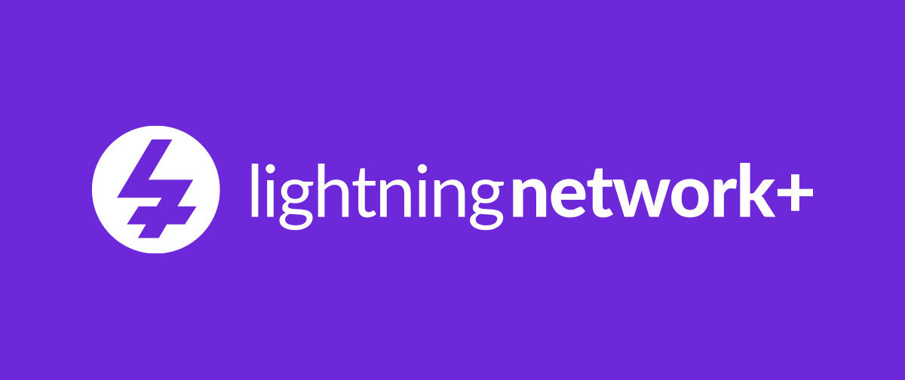

## 导言

[LN+ (Lightning Network Plus)](https://lightningnetwork.plus/) 是一个社区平台，旨在促进 Lightning Network 节点运营商之间的合作。其主要目标是提高闪电网络的连接性、流动性和去中心化，而无需中央中介。

本教程将重点介绍**"交换 "**服务，这是 LN+ 目前使用最广泛的结构化功能。此外，还将介绍该平台提供的其他服务。

## LN+ 概览

### 什么是 Lightning Network Plus？

Lightning Network Plus（LN+）是一个社区平台，供希望直接和自愿合作的闪电节点运营商使用。它旨在促进创建有用、平衡和可持续的闪电通道，同时避免使用集中式解决方案或强加的中心。

LN+ 的基本原则是：建立在透明、互惠和信誉基础上的点对点合作。

### LN+ 服务一览

LN+ 提供多项服务，旨在改善 Lightning 网络的拓扑结构和流动性，包括.NET、.NET 和.NET：

- 交换**：运营商之间相互开放通道（主要服务）。
- 环**：几个参与者之间的环形通道开口。
- 基于信任的互换**：更加依赖参与者的信任和历史的变种。
- 社交功能**：档案、评论和声誉系统。

在本教程的剩余部分，我们将专门讨论**Swaps**服务，它是当前 LN+ 使用的核心。

## LN+ "交换 "服务

### LN+ 交换的定义

LN+ **交换**是两个 "闪电 "节点运营商之间达成的自愿协议，相互开放容量相当（或预先商定）的 "闪电 "通道。与传统的单边通道开放不同，交换基于**明确的互惠**。

在实践中 ：

- 您为合作伙伴的节点打开通道。
- 您的合作伙伴为您的节点打开通道。
- 双方绑定的 on-chain 比特币数量相似。

### 节点操作员交换的目的是什么？

掉期服务解决了闪电运营商遇到的几个关键问题：

- 改进连通性**：双向通道一打开就能创建有用的双向通道。
- 更好的流动性管理**：每一方都有流入和流出能力。
- 降低不必要渠道的风险**：鼓励合作伙伴保持渠道畅通。
- 更大程度的分散化**：运营商之间的直接连接，没有强加的枢纽。

### 哪些节点配置文件需要交换？

掉期对以下情况特别有用：.....：

- 希望快速提高路由能力的新节点。
- 希望提高渠道图密度的中间运营商。
- 希望优化拓扑结构的路由导向型节点。

## 将您的 Lightning 节点连接到 LN+

### 技术要求

在开始之前，您需要 ：

- 一个正常工作的 Lightning 节点（LND、Core Lightning 或 Eclair）。
- 访问节点的管理界面。
- 足够的 on-chain 能力打开通道。

访问 [Lightning Network](https://lightningnetwork.plus/) Plus 网站，点击界面右上方的 "登录 "按钮。

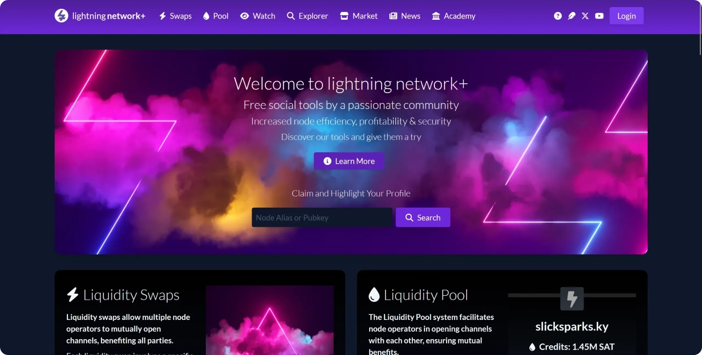

### 通过信息签名验证

要验证自己的身份，您需要使用 Lightning 节点的私人密钥签署所提供的信息。使用 ThunderHub，这一操作非常简单。

首先复制 LN+ 显示的信息。

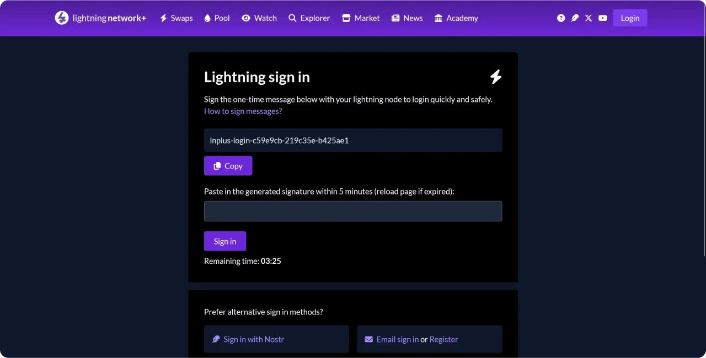

在 ThunderHub 中，转到 "工具 "选项卡，然后点击 "消息 "部分的 "签名 "按钮。

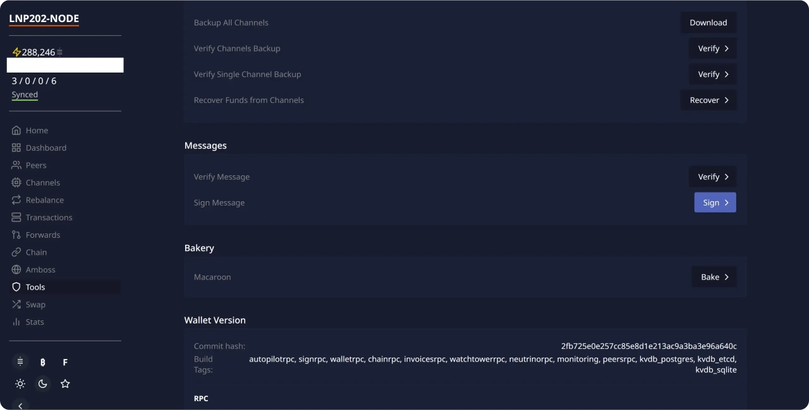

粘贴 LN+ 提供的验证信息，然后单击 "签署"。

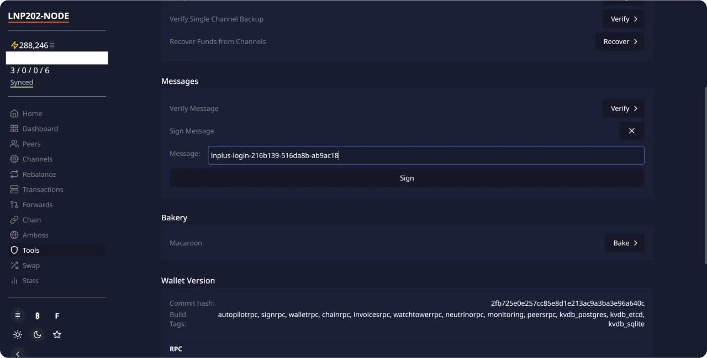

然后，ThunderHub 会使用节点的私人密钥对该信息进行签名。复制生成的签名。

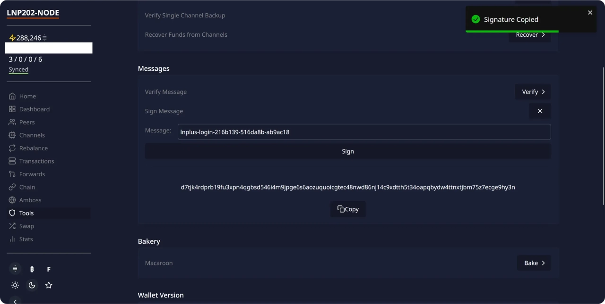

将此签名粘贴到 LN+ 网站上的相应字段，然后点击 "登录"。

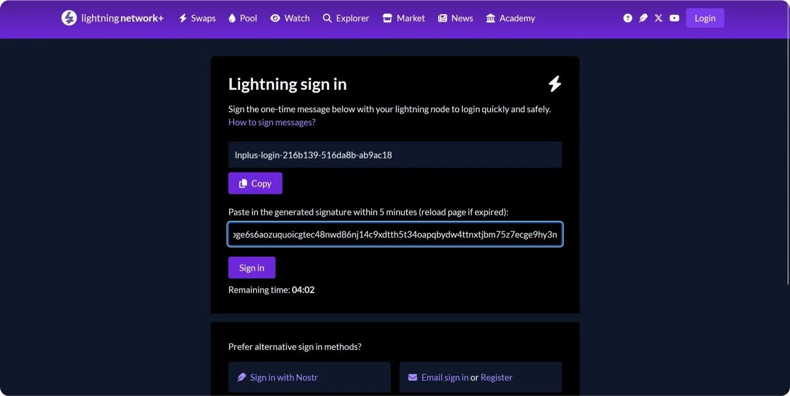

您现在已通过您的 "闪电 "节点连接到 LN+。此过程允许 LN+ 验证您是否是您在其平台上所声称节点的合法所有者。

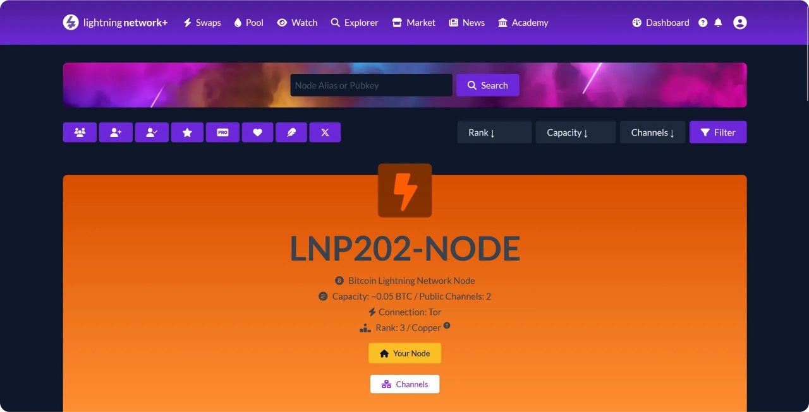

如果您愿意，可以个性化您的 LN+ 简介，例如添加简短的自传。

## 参与现有的交换

### 获取交换优惠

要参与首次频道开放，请进入界面顶部的 "交换 "菜单。在这里，您可以找到当前可用的所有交换，具体取决于您节点的特性。

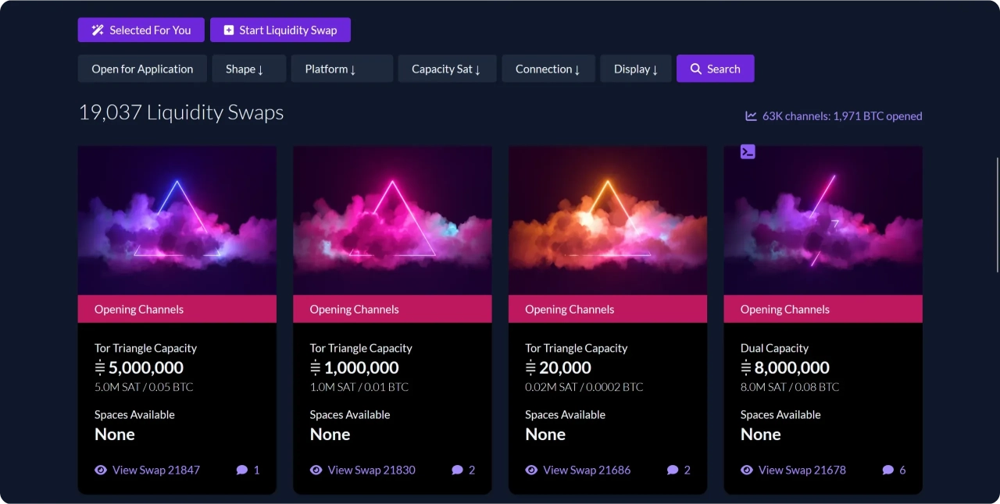

### 资格条件

要加入现有的交换产品，只需选择相应的广告并注册即可。不过，LN+ 允许交换创建者定义某些**资格条件**，例如：

- 已经开放的最低数量的通道；
- 最小节点总容量 ；
- 接受某些类型的连接。

### 最近的节点

因此，特别是在使用的早期阶段，您的节点有可能**很少或**没有提供。对于新节点或尚未连接的节点来说，这种情况很常见。

就我而言，尽管有一些公开渠道，但没有一个报价符合所需的标准。

## 创建自己的交换提议

### 什么时候应该创建自己的交换？

在没有现成报价的情况下，创建自己的交换通常是最好的解决方案。它还允许您保留对交换参数的控制。

### 交换配置

点击 ** 启动 Liquidity Swap**，然后配置报价参数：

- 选择参与者总数（3、4 或 5）；
- 表示要打开的通道的容量；
- 确定参与者同意不关闭其渠道的承诺期；
- 指定适用于参与者的任何限制（最小通道数、最小总容量、可接受的连接类型）。

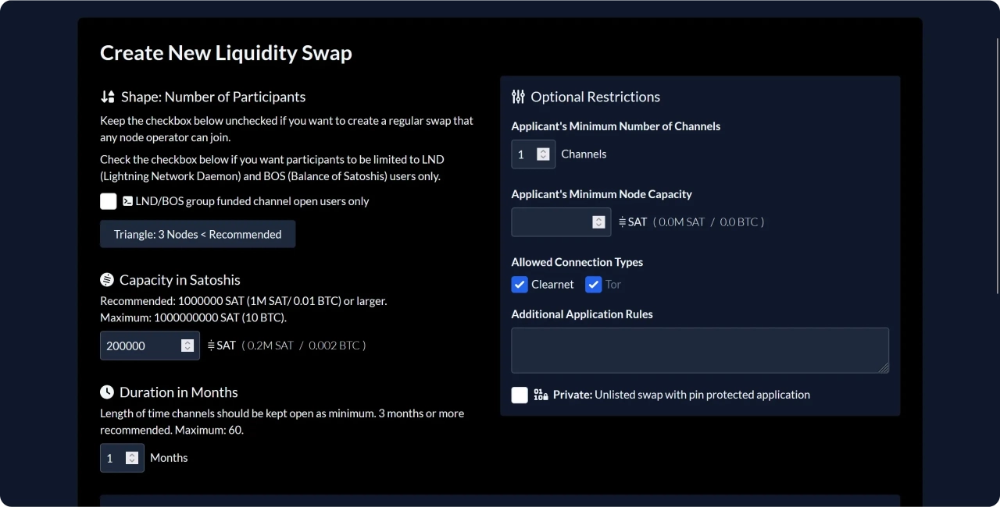

### 出版和参与者的期望

输入所有参数后，点击 **开始 Liquidity Swap** 发布您的报价。现在您要做的就是等待其他运营商注册。

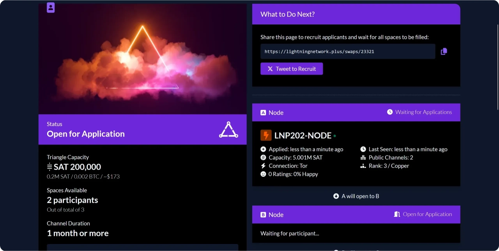

## 完成交换

### 有效通道开口

现在，所有交换位置都已就位，每个参与者都可以从 LN+ 界面上看到，他需要打开哪个节点的 "闪电 "通道。

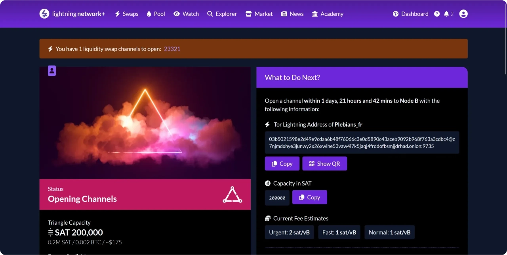

在您这边，使用 LN+ 提供的节点 ID 打开通道，并遵守指示的数量。该操作可通过 ThunderHub、另一个 Lightning 节点管理器或直接通过节点的基本接口进行。

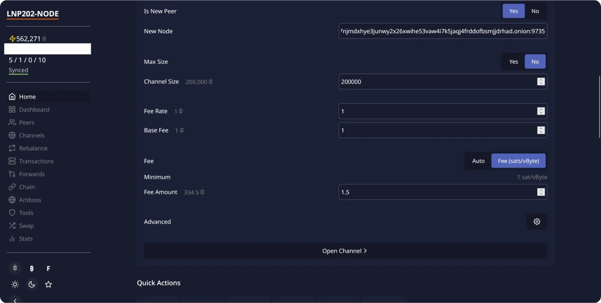

打开后，频道会出现在等待频道部分。

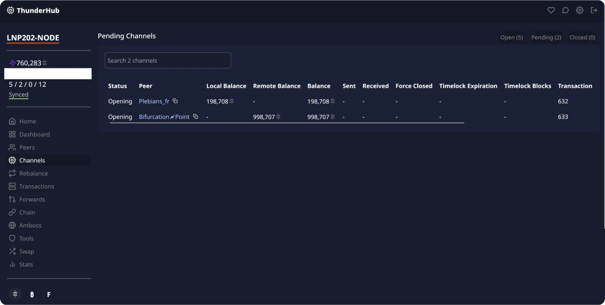

### 在 LN+ 中确认

然后返回 LN+，单击 "通道开放已开始 "按钮，确认已启动通道开放。

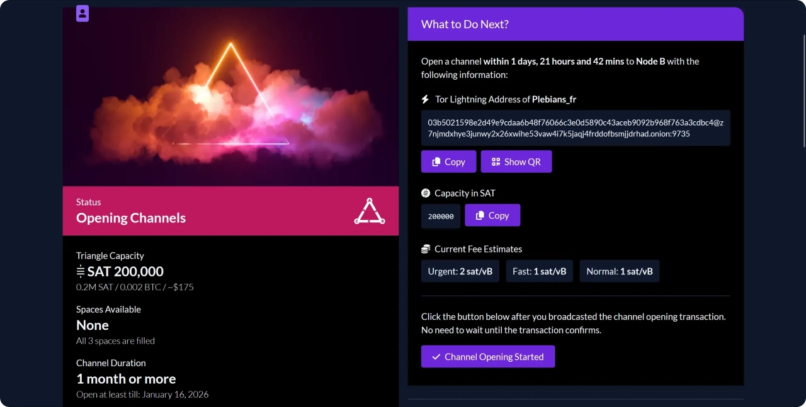

### 交换结束

当所有参与者都打开了他们所承诺的通道时，交换就算完成了。

## 声誉和良好的沟通做法

### LN+ 声誉系统

LN+ 根据参与者在交换结束时留下的意见建立了一个声誉系统。这些意见是公开的，直接影响操作员加入或创建未来交换的能力。

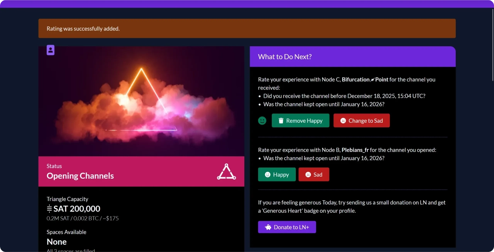

### 建议的最佳做法

为了保持良好的声誉和确保交换的顺利进行，建议......：

- 遵守渠道开放期限 ；
- 在出现问题或延误时迅速沟通；
- 使用评论区与其他参与者交换意见；
- 不在承诺期结束前关闭渠道。

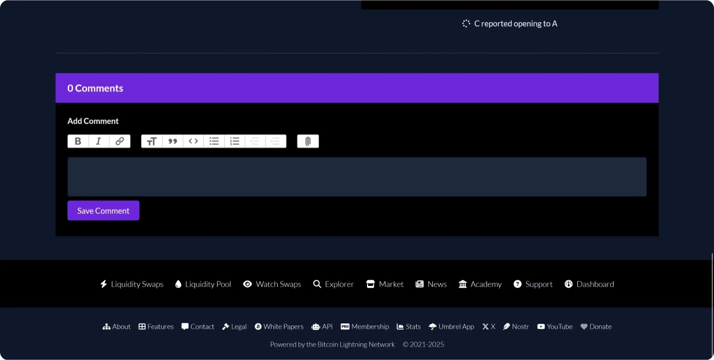

### 为什么声誉是 LN+ 的核心？

LN+ 以自愿合作模式为基础，没有严格的技术限制。因此，声誉是确保参与者可靠性和可信度的主要激励因素。

## 其他 LN+ 服务

除交换外，LN+ 还提供其他服务，旨在改善 "闪电 "节点运营商之间的连接和协调。环**使多个参与者能够创建一个环形通道开口，从而加强路由路径的冗余性和闪电图的密度。基于信任的交换**基于与传统交换类似的原则，但为已经在平台上建立声誉的参与者提供了更大的灵活性。

LN+ 还集成了公共节点档案、交换评论和声誉系统等社交功能。这些工具本身并不是技术服务，但在平台的顺利运行中发挥着核心作用，促进了运营商之间的沟通、协调和信任。

## 结论

LN+ 的交换服务是改善闪电网络的连接性、流动性和去中心化的有效工具。通过促进互惠、协调的渠道开放，LN+ 使节点运营商能够加强其拓扑结构，同时促进负责任的分散合作。