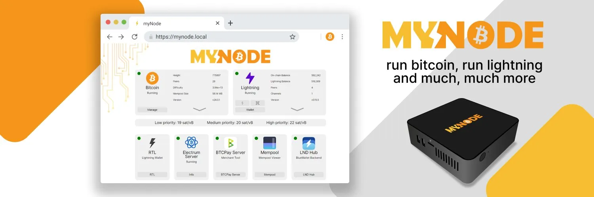

[My Node](https://mynodebtc.com/) е най-лесният и най-мощен начин за управление на възел Bitcoin и Lightning! Ние комбинираме най-добрия софтуер с отворен код с нашия интерфейс, управление и поддръжка, така че да можете лесно, частно и сигурно да използвате Bitcoin и Lightning.


## Видове настройки на възли


Съществуват различни настройки на възли. MyNode е отличен. Има много приложения, които идват с него, и още повече, ако платите за премиум версията. В противен случай е много досадно да изтеглите всички тези приложения сами. С MyNode това е доста лесно, както ще видите.


Алтернативен и подобен вариант е RaspiBlitz. Графичният интерфейс не е толкова приятен, а приложенията се припокриват много с приложенията, които се предлагат с MyNode, но Raspiblitz е безплатен софтуер с отворен код (FOSS), а MyNode не е съвсем. Друга разлика е, че MyNode се изпълнява в контейнер Docker. Намирам Docker за обезсърчаващ и труден за отстраняване на проблеми. Това е проблем само ако се натъкнете на грешки или бъгове. Разработчикът предлага помощ за премиум потребителите, а има и чат група за Telegram.


RaspiBlitz е просто няколко програми, инсталирани под Linux, без Docker. Външният твърд диск може лесно да се свърже към друга машина с Linux и Bitcoin Core и да тръгнете, ако имате нужда.


Друг вариант е просто да инсталирате Bitcoin Core и разновидност на Electrum Server (има няколко такива) на операционната система. Имам ръководства за Linux (Raspberry Pi), Mac и Windows.


## Списък за пазаруване


- Raspberry Pi 4, 4Gb памет или 8Gb (4Gb е достатъчно)
- Официално захранване на Raspberry Pi (Много важно! Не получавайте генерично захранване, сериозно)
- Пример за Pi. Калъфът FLIRC е страхотен. Цялата кутия е радиатор и няма нужда от вентилатор, който може да бъде шумен
- 16 Gb microSD карта (необходима ви е една, но няколко са удобни)
- Четец на карти с памет (повечето компютри нямат слот за microSD карта).
- Външен твърд диск SSD 1Tb.

Забележка: SSD е от решаващо значение. не използвайте преносим външен твърд диск, въпреки че е по-евтин


- Кабел за Ethernet (за свързване с домашния маршрутизатор)
- Не се нуждаете от монитор


## Изтегляне на MyNode изображение


Отидете на уебсайта MyNode Връзка


Кликнете върху `Даунлоуд сега`


Изтеглете версията за Raspberry Pi 4:


Това е голям файл:


Изтегляне на хешовете SHA 256


Отворете терминала за Mac или Linux или Command Prompt за Windows. Въведете:


```bash
shasum -a 256 DOWNLOADEDFILENAME # <--- Mac/Linux
certUtil -hashfile DOWNLOADEDFILENAME SHA256 # <--- Windows
```


Компютърът мисли в продължение на около 20 секунди. След това проверете дали изходният хешфайл съвпада с този, изтеглен от уебсайта в предишната стъпка. Ако той е идентичен, можете да продължите.

Flash на SD картата


## Изтеглете и инсталирайте Balena Etcher. Връзка


Не успях да намеря цифровия подпис за това. Ако знаете как, моля, кажете ми и ще актуализирам тази статия.


Използването на Etcher е разбираемо. Поставете микро SD картата си и флашнете софтуера на Raspberry Pi (.img файл) върху SD картата.


След това дискът вече не може да се чете. Възможно е да се получи грешка от операционната система и дискът да изчезне от работния плот. Извадете картата.


## Настройте Pi и поставете SD картата


Частите (корпусът не е показан):


Свържете кабела за Ethernet и USB конектора на твърдия диск (все още без захранване). Избягвайте да свързвате към USB портовете със син цвят в центъра. Те са USB 3. MyNode препоръчва да използвате USB 2 порта, въпреки че твърдият диск може да е с USB 3.


Микро SD картата се поставя тук:


Накрая свържете захранването:


## Намерете IP адреса на Pi


С MyNode никога не се нуждаете от монитор. Необходим е обаче друг компютър в домашната мрежа. Ако Pi не е свързан с Ethernet и искате да разчитате на WiFi, намирането на IP изисква компютърни умения на високо ниво. Не мога да ви помогна, съжалявам. Нуждаете се от връзка с етернет. (Проблемът идва от необходимостта от достъп до монитор и операционна система, за да се свържете с WiFi и да въведете парола).


Проверете маршрутизатора си за списък с всички IP адреси на всички свързани устройства.


Въведох 192.168.0.1 в браузъра (инструкциите, които дойдоха с моя маршрутизатор), влязох и успях да видя устройство "MyNode" с IP 192.168.0.18. Обърнете внимание, че тези IP адреси не са публично видими в интернет (те първо минават през маршрутизатора), а са само идентификатори за устройствата в домашната ви мрежа.


Намирането на IP е от решаващо значение.


**Забележка:** можете да използвате терминала на компютър с Mac или Linux, за да откриете IP адреса на всички свързани към Ethernet устройства в домашната мрежа, като използвате командата "arp -a". Изходът не е толкова красив, колкото този, който ще покаже маршрутизаторът, но цялата необходима информация е налице. Ако не е очевидно кое е Pi, направете опит и грешка.


## SSH в Pi


Имате възможност да влезете в устройството от разстояние чрез SSH команда, но това не е задължително (необходимо е при RaspiBlitz Node). Все пак ще ви покажа как, тъй като е много удобно.


Отворете компютър с Mac или Linux (за Windows изтеглете Putty, инструмент за SSH) и въведете:


```bash
ssh admin@192.168.0.18
```


Използвайте собствен IP адрес. Потребителското име за устройството MyNode по подразбиране е "admin". Паролата по подразбиране е "bolt".


Ако сте използвали Pi преди и сте сменили микро SD картата, ще получите тази грешка:


Това, което трябва да направите, е да отидете до мястото, където се намира файлът "known_hosts", и да го изтриете. Това е безопасно. Съобщението за грешка ви показва пътя. При мен той беше /Users/MyUserName/.ssh/


Не забравяйте символа "." пред ssh, който показва, че това е скрита директория.


След това опитайте отново командата ssh.


Този път ще видите този резултат:


Изтритият файл е изтрит и добавяте нов пръстов отпечатък. Въведете yes (да) и <enter>.


Ще бъдете помолени да въведете паролата. Тя е "bolt"


Вече имате терминален достъп до MyNode Pi без монитор и можете да потвърдите, че всичко е заредено безпроблемно.


## Достъп чрез уеб браузър


Отворете браузър. Това трябва да е компютър в домашната ви мрежа, не можете да направите това отвън. Има начин, но той е труден. Не съм го тествал.


Въведете IP адреса в прозореца с адреса на браузъра. Това ще се случи:


Въведете паролата "bolt" - променете я по-късно.


Тогава ще се случи това:


Изберете Format Drive


Сега чакаме.


В даден момент ще бъдете попитани дали искате да въведете продуктовия си ключ или да използвате безплатното издание на общността - ще покажа изданието Premium. Препоръчвам ви да платите за премиум версията, ако можете да си го позволите, много си заслужава.


След това ще видите напредъка на изтеглените блокове. Това отнема дни:


Ако е необходимо, можете да изключите компютъра по време на изтеглянето. Отидете в настройките и намерете бутона за изключване на машината. Не дрънкайте просто кабела, защото може да повредите инсталацията или твърдия диск.


Уверете се, че още в началото сте отишли в "Настройки" и сте деактивирали quicksync. Това ще започне първоначалното изтегляне на блока отначало.


Исках да продължа със създаването на ръководството, затова ето още един MyNode, който подготвих по-рано. Ето как изглежда страницата, когато блокчейнът е синхронизиран и са активирани и синхронизирани няколко "приложения":


Имайте предвид, че Electrum Server също трябва да се синхронизира, така че веднага след като Bitcoin Blockchain е синхронизиран, щракнете върху бутона, за да започнете този процес - отнема ден или два. Всичко останало се активира за няколко минути, след като изберете да го активирате. Можете да щракнете върху нещата и да ги разгледате. Няма да счупите нищо. Ако все пак нещо се счупи (това ми се случи, но мисля, че защото имах евтини части), ще трябва да префлашнете и да започнете да сваляте отново. Проблемът, който имам с MyNode, е, че ако се наложи да "префлашнете", в крайна сметка трябва да започнете синхронизацията на блокчейн отново от нулата. Има технически начини да се заобиколи това, но не е лесно.


Ако искате да изпробвате и друг възел, например RaspiBlitz, се нуждаете от допълнителен външен твърд диск SSD и друга микро SD карта за флаш памет. Иначе става въпрос за същото оборудване, просто очевидно не можете да използвате MyNode и RaspiBlitz едновременно. Ако искате да направите това, време е да си купите друг Raspberry Pi.


След като вече имате работещ възел, използвайте го, а не го оставяйте да седи и да не прави нищо за вас. Проследете моята статия (и видеоклип) за това как да свържете вашия настолен компютър Electrum Wallet към ядро Electrum Server и Bitcoin тук.