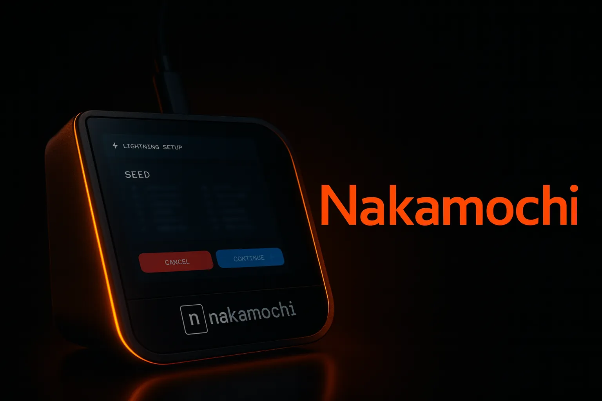

Pokretanje sopstvenog Bitcoin i Lightning full node-a više ne mora biti složen zadatak ograničen na tehničke stručnjake. Tradicionalno, postavljanje i upravljanje čvorovima zahtevalo je duboko poznavanje kriptografije, umrežavanja i razvoja softvera. Nakamochi to menja tako što čini čvorove dostupnim svima, bez obzira na tehničku pozadinu.

Sa Nakamochijem, svako može postaviti i upravljati čvorom od kuće, omogućavajući im potpunu privatnost i finansijsku nezavisnost. Pokretanje full node-a ne samo da osigurava vaše sopstvene transakcije već i doprinosi snazi Bitcoin mreže. Decentralizovana i otporna Bitcoin mreža oslanja se na široku distribuciju čvorova kako bi osigurala svoju sigurnost i nezavisnost.

### Sadržaj

- Šta je Nakamochi i kako funkcioniše?
- Postavljanje Nakamochi-a
- O Lightning mreži
- Otvaranje kanala i obavljanje transakcija u Lightning mreži

## Šta je Nakamochi i kako funkcioniše?

Nakamochi je Bitcoin-samo Full node koji podržava obe Bitcoin i Lightning mreže. Uključuje integrisani Bitcoin i Lightning novčanik, omogućavajući korisnicima da pokreću siguran, samostalni Bitcoin čvor dok imaju koristi od brzine i niskih troškova transakcija Lightning mreže.

Vaš Nakamochi čvor se upravlja putem mobilne aplikacije, [BitBanana (Android)](https://bitbanana.app) i [Zeus (iOS)](https://bitbanana.app), omogućavajući vam da ga kontrolišete praktično sa bilo kog mesta. Ove aplikacije funkcionišu kao daljinski upravljač za vaš čvor, omogućavajući vam da direktno plaćate putem Bitcoina ili Lightning-a, upravljate transakcijama, otvarate i zatvarate kanale, proveravate stanje i pratite performanse vašeg čvora — sve to na jednostavan način.

## Postavljanje Nakamochi-ja traje samo 5 minuta

### Korak 1: Priključite i počnite

1. Povežite Nakamochi na struju i Wi-Fi.

2. Kliknite na **"Setup New Wallet"** i sigurno sačuvajte svoju frazu za oporavak od 24 reči.

3. Koristite aplikaciju za upravljanje čvorovima (Zeus ili BitBanana) da se povežete sa svojim Nakamochijem:

4. Otvorite aplikaciju i skenirajte QR kod prikazan na vašem Nakamochi-ju.

5. Za dodatnu sigurnost, postavite PIN kod na svoj uređaj.

_Povežite na struju i zapišite svoju seed frazu od 24 reči_

_Sačekajte dok blockchain ne sustigne_

_Podesite novi novčanik u Lightning kartici_

_Skenirajte QR kod pomoću aplikacije za upravljanje nodom_

_Za dodatnu sigurnost podesite PIN kod_

**Napomena:** _Dozvolite da se vaš Nakamochi nod sinhronizuje sa blockchainom. Ovaj proces može potrajati neko vreme u zavisnosti od vaše internet konekcije._

## O Lightning mreži

https://planb.network/courses/34bd43ef-6683-4a5c-b239-7cb1e40a4aeb

Bitcoin Lightning mreža revolucioniše Bitcoin transakcije čineći ih bržim, jeftinijim i efikasnijim. Savršena je za svakodnevnu upotrebu, omogućavajući skoro trenutna plaćanja sa minimalnim naknadama, idealna za mikrotransakcije poput kupovine kafe ili obavljanja čestih malih kupovina.

Rukovanjem [off-chain](https://planb.network/resources/glossary/offchain), Lightning je dizajniran da se skalira, podržavajući hiljade transakcija u sekundi bez preopterećenja glavnog Bitcoin Blockchain-a. Ovo ga čini ključnim igračem u evoluciji Bitcoin-a u praktičan, globalni platni sistem.

Privatnost je još jedna prednost, jer se transakcije na Lightning-u usmeravaju kroz privatne kanale plaćanja umesto da budu direktno zabeležene na Blockchain-u. Ovo obezbeđuje diskretniji način za obavljanje transakcija, uz očuvanje snažnog bezbednosnog modela Bitcoina.

#### Objašnjenje platnih kanala

Lightning mreža radi kroz kanale plaćanja, koji su veze između dve strane koje omogućavaju više transakcija bez direktne interakcije sa Blockchain-om. Kada je kanal otvoren, bilans između dve strane se pri svakoj transakciji ažurira na drugom sloju — Lightning mreži — što omogućava brza i niskotroškovna plaćanja. Samo otvaranje i zatvaranje kanala se beleži [On-Chain](https://planb.network/resources/glossary/onchain), smanjujući zagušenje na Bitcoin Blockchain-u. Ovakav pristup omogućava skalabilnost i veću privatnost, budući da pojedinačne transakcije nisu zapisane u javnom blokčejnu.

**Primer:** Alisa i Bob otvaraju kanal tako što mu pridružuju bitkoine. Alisa šalje bitkoine Bobu, i njihova off-chain salda se ažuriraju trenutno bez on-chain zapisa. Ako Alisa zatim plati Čarliju, a Alisa nema direktan kanal do Čarlija, uplata se može usmeriti kroz Bobov kanal da bi stigla do Čarlija. Usmeravanje kroz posredničke čvorove omogućava plaćanja čak i bez direktnih veza, čineći mrežu veoma efikasnom.

## Otvaranje kanala i obavljanje transakcija u Lightning mreži

Kada je vaš Nakamochi postavljen i povezan sa aplikacijom za upravljanje čvorovima, možete početi koristiti Lightning mrežu otvaranjem kanala i obavljanjem transakcija.

### Otvaranje kanala na Zeus-u (iOS):

1. Idite na karticu **„Channels“** (donji meni).

2. Kliknite na **„+“** da otvorite novi kanal.

3. Skenirajte ili unesite javni ključ čvora sa kojim želite da se povežete.

4. Unesite zaključani iznos (dogovorite se sa svojim partnerom ili koristite minimalni fiksni iznos za poznate čvorove).

5. Kliknite na **„Open Channel“**.

_ZEUS Screenshot_

Za više informacija: [Channels | Zeus Documentation](https://docs.zeusln.app/)

### Otvaranje kanala na BitBanana (Android):

1. Otvorite meni (levo).

2. Idite na **„Channels“**.

3. Kliknite na **“+”** da dodate/otvorite novi kanal.

4. Skenirajte ili nalepite javni ključ.

5. Unesite zaključani iznos (dogovorite se sa svojim partnerom ili koristite minimalni fiksni iznos za poznate čvorove).

_Snimak ekrana Bitbanana_

Za više informacija: [BitBanana](https://bitbanana.com)

Kada je vaš kanal otvoren, plaćanja se mogu usmeravati kroz njega ka drugim učesnicima u mreži. Stanja se prilagođavaju off-chain, osiguravajući da su transakcije gotovo trenutne i da imaju minimalne naknade.

Ako vam kanal više nije potreban, možete ga zatvoriti. Ova akcija rešava konačno stanje između vas i vašeg partnera i beleži se On-Chain. Idealno je da se obe strane slože i budu online za „kooperativno zatvaranje“ (brže i sa manje naknada u odnosu na „prisilno zatvaranje“ sa nereagujućim/van mreže partnerom).

Generalno, preporučujemo ostavljanje kanala otvorenim kako biste smanjili troškove i povećali pouzdanost i efikasnost mreže. Držanjem kanala otvorenim, minimizirate On-Chain naknade za transakcije, izbegavate zastoje zbog ponovnog povezivanja kanala i održavate stabilan kapacitet rutiranja za nesmetanu obradu plaćanja. Ovaj pristup podstiče robusnu i otpornu mrežu dok poboljšava ukupno korisničko iskustvo i smanjuje operativne troškove.

### Korisni linkovi

- [O Nakamochi](https://nakamochi.io/)
- [Pretplatite se na Nakamochi Newsletter](https://90c7addc.sibforms.com/serve/MUIFAHG7H5YBPpm-kZ8G6TuS-nmL4uaq85rlpBfI__S79tZ5jheIJfF3kJYudycgs_6_RUdDBkt8Sd7OyNL_JDTTJvOb36ifF6vcQoabBXKp4cbefzh1DYqnok_jItexICcQL13ucd2aS581ngqy7jr0Q1H3HhxV3z2eWKE5-Z-YMasj-MMotQeDvdorMCSi0XgCWDqs8rEMQC7E)
